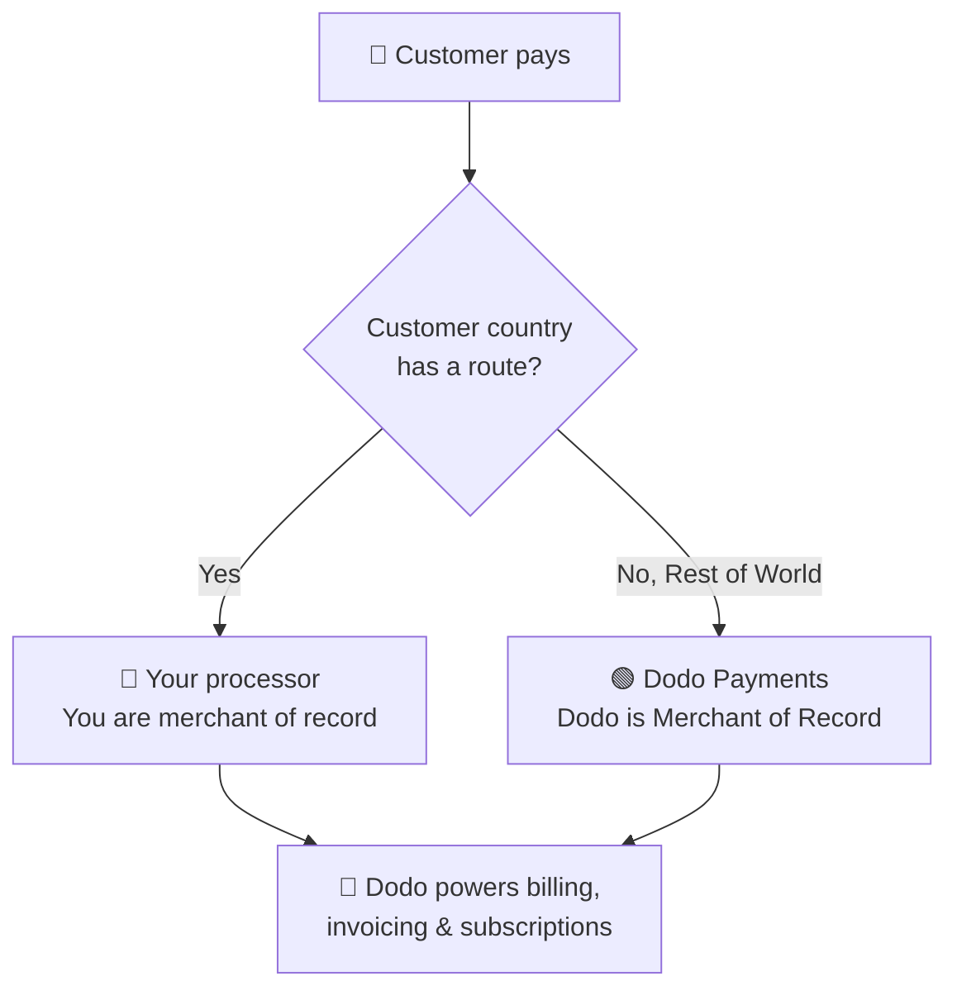

**Bring Your Own Processor (BYOP)** memungkinkan Anda menghubungkan prosesor pembayaran Anda sendiri — saat ini **Stripe** atau **Adyen**, dengan dukungan untuk lebih banyak prosesor segera hadir — dan tetap menggunakan Dodo Payments untuk semua yang berada di atas transaksi: produk, langganan, kunci lisensi dan mesin hak, penagihan, portal pelanggan, dan analitik.

Anda memutuskan, per negara pelanggan, apakah suatu pembayaran diproses oleh **prosesor Anda** (Anda tetap menjadi penjual catatan untuk rute tersebut) atau oleh **Dodo Payments** sebagai Penyedia Layanan Merchant penuh Anda. Negara yang tidak Anda rute secara eksplisit akan otomatis kembali ke Dodo.

<CardGroup cols={2}>
<Card title="Route by geography" icon="globe">
Kirim pembayaran dari negara tertentu ke prosesor Anda sendiri, dan semua lainnya ke Dodo.
</Card>

<Card title="Keep your processor accounts" icon="plug">
Lanjutkan menggunakan akun Stripe atau Adyen Anda yang sudah ada dan relasinya.
</Card>

<Card title="Stay the merchant of record" icon="building">
Pada rute Anda sendiri, Anda tetap menjadi penjual hukum dan mengendalikan pajak, sengketa, dan pembayaran.
</Card>

<Card title="One billing layer" icon="layer-group">
Dodo menangani produk, langganan, faktur, dan analitik di kedua rute.
</Card>
</CardGroup>

## BYOP vs. Dodo sebagai Merchant of Record

Saat Anda mengaktifkan BYOP, Anda memilih bagaimana setiap pembayaran ditangani. Kedua model dapat berjalan berdampingan, diarahkan oleh negara pelanggan.

| Fitur | Dodo sebagai Merchant of Record | Bring Your Own Processor |
|---------|----------------------------|--------------------------|
| Penjual catatan hukum | Dodo Payments | Perusahaan Anda |
| Pajak (Pajak Pertambahan Nilai, PP, & pajak penjualan) | Dihitung, dikumpulkan & disetor untuk Anda | Anda mendaftar, mengumpulkan & mengajukan |
| Pengembalian uang & penipuan | Kewajiban & perlindungan ditangani oleh Dodo | Anda mengelola dengan alat prosesor Anda sendiri |
| Kepatuhan PCI | Ditangani oleh Dodo | Anda mengelola |
| Metode pembayaran | 30+ global & lokal, multi-mata uang | Hanya kartu (kredit/debit) |
| Pembayaran | Pembayaran global teragregasi | Langsung dari prosesor Anda |
| Pengaturan | Sederhana, beroperasi dalam hitungan menit | Sedang, tambahkan kunci & routing |
| Terbaik untuk | Menjual secara global, kepatuhan tanpa campur tangan | Prosesor yang sudah ada & kontrol regional |

<Tip>
Pengaturan umum adalah **hybrid**: arahkan negara di mana Anda sudah memiliki entitas terdaftar dan prosesor (misalnya, pasar asal Anda) ke prosesor Anda sendiri, dan biarkan Dodo menangani seluruh dunia lainnya sebagai Merchant of Record.
</Tip>

## Prosesor yang didukung

Saat ini Anda dapat menghubungkan **Stripe** atau **Adyen**. Dukungan untuk lebih banyak prosesor sedang dalam pengembangan.

<CardGroup cols={2}>
<Card title="Stripe" icon="stripe" />
<Card title="Adyen" icon="/images/logos/adyen.svg" />
</CardGroup>

<Note>
Pembayaran yang di-routing melalui prosesor Anda sendiri saat ini hanya mendukung **kartu kredit dan debit**. Kami sedang menambahkan lebih banyak metode pembayaran.
</Note>

<Warning>
Baik **Stripe** dan **Adyen** memerlukan **akses API kartu mentah** yang diaktifkan pada akun Anda sehingga Dodo dapat menangani penagihan di atas prosesor Anda. Masing-masing prosesor memberikan ini atas permintaan — Anda mengaturnya dengan menghubungi dukungan prosesor sebelum Anda terhubung. Lihat panduan [Stripe](/features/byop/stripe) dan [Adyen](/features/byop/adyen) untuk rincian.
</Warning>

<Info>
Koneksi dikonfigurasikan **per lingkungan**. Prosesor yang Anda hubungkan dalam **mode uji** (Sandbox) terpisah dari yang ada dalam **mode live** (Produksi); atur keduanya jika Anda ingin menguji sebelum beroperasi. Panduan pengaturan mengikuti sakelar uji/live global dasbor Anda.
</Info>

## Mengatur BYOP

Buka **Pengaturan → BYOP** di dashboard dan pilih **Atur** pada kartu *Bring Your Own Processor* untuk meluncurkan panduan pengaturan.

<Frame>

</Frame>

<Steps>
<Step title="Choose a payment processor">
Pilih prosesor yang ingin Anda hubungkan, **Stripe** atau **Adyen**, dan lanjutkan.

<Frame>

</Frame>
</Step>

<Step title="Connect your account">
Beri koneksi nama **Provider Name** (berguna saat Anda memiliki beberapa akun dari prosesor yang sama, mis. *Stripe US* dan *Stripe UK*), lalu masukkan **Secret Key** prosesor Anda (untuk Stripe, kunci `sk_...` Anda).

Untuk **Adyen**, juga masukkan identitas **Akun Pedagang Anda**.

<Frame>

</Frame>

Menyimpan menciptakan koneksi dan menghasilkan **Endpoint Webhook** yang unik untuk itu. Tambahkan URL tersebut sebagai tujuan webhook di dasbor prosesor Anda, lalu tempelkan **Webhook Signing Secret** kembali ke Dodo untuk menyelesaikannya:

- **Stripe**: tempelkan rahasia tanda tangan dari endpoint webhook yang Anda tambahkan.
- **Adyen**: tempelkan kunci **HMAC** dari *Customer Area → Webhooks*.

<Note>
Kunci rahasia Anda disimpan dengan aman dan tidak dapat dilihat atau diubah setelah disimpan. Anda hanya mengatur URL webhook yang dihasilkan Dodo di prosesor Anda; Anda tidak pernah berinteraksi langsung dengan infrastruktur yang mendasarinya.
</Note>

<Tip>
Gunakan **Verifikasi koneksi** setelah menyimpan untuk menjalankan panggilan uji terhadap prosesor Anda dan mengkonfirmasi bahwa kunci dan rahasia webhook valid sebelum Anda mulai beroperasi.
</Tip>
</Step>

<Step title="Configure payment routing">
Tambahkan **aturan routing** yang memetakan negara pelanggan ke prosesor. Setiap negara dapat diarahkan ke tepat satu prosesor.

- **Prosesor Anda** menangani pembayaran dari negara-negara yang Anda tetapkan untuk itu.
- **Dodo Payments** menangani **Sisa Dunia** (setiap negara yang tidak Anda rute secara eksplisit) sebagai Merchant of Record.

<Frame>

</Frame>

Gunakan **Tambahkan Rute** untuk menugaskan satu atau lebih negara ke prosesor.

<Frame>

</Frame>

<Info>
**Panduan routing**
- "Sisa Dunia" mencakup semua negara yang tidak terdaftar di atas.
- Rute Dodo Payments MoR menangani kepatuhan dan pajak otomatis.
- Rute prosesor Anda sendiri memerlukan konfigurasi pajak terpisah jika diperlukan.
</Info>
</Step>

<Step title="Configure invoice information">
Untuk pembayaran yang diarahkan melalui prosesor Anda sendiri, **Anda** adalah penjual pada faktur tersebut. Masukkan detail bisnis yang harus muncul pada faktur-faktur tersebut:

- **Nama Bisnis Terdaftar** (diperlukan)
- **ID Pajak** (EIN, SSN, dll.; opsional, dengan validasi format tersedia untuk EIN AS)
- **Pernyataan Deskriptor** (diperlukan): apa yang dilihat pelanggan pada laporan bank mereka (5 hingga 22 karakter)
- **Alamat Bisnis Terdaftar** (diperlukan): mulai mengetik untuk mencari dan mengisi alamat Anda secara otomatis
- Tautan **Kebijakan Privasi** dan **Ketentuan Layanan** (diperlukan)

Pratinjau **Header Faktur** langsung menunjukkan bagaimana detail tersebut akan terlihat. Detail ini hanya berlaku untuk faktur untuk rute yang Anda tangani melalui prosesor Anda sendiri; pembayaran yang diarahkan ke Dodo tetap menggunakan detail Merchant of Record Dodo.

<Frame>

</Frame>
</Step>

<Step title="Review and finish">
Ulas koneksi prosesor Anda, aturan routing, dan detail faktur. Konfirmasi bahwa detail routing dan penagihan sudah benar, lalu pilih **Selesaikan pengaturan**.

<Frame>

</Frame>
</Step>
</Steps>

Setelah dikonfigurasi, kartu BYOP menampilkan **Edit Konfigurasi**, dan Anda dapat kembali ke hanya MoR kapan saja dengan **Edit aturan routing**.

<Frame>

</Frame>

## Bagaimana routing bekerja

Routing ditentukan oleh **negara pelanggan** pada saat pembayaran. Logika yang sama berlaku di seluruh pembayaran satu kali, sesi checkout, dan pendaftaran langganan. Pembaruan menggunakan prosesor yang sama dengan langganan dibuat (lihat [Langganan](#subscriptions)).

Pada rute yang dikelola oleh **prosesor Anda**:

- Pembayaran diproses pada akun prosesor **Anda** dalam mata uang tagihan.
- **Tidak ada pajak yang dihitung atau dikumpulkan** oleh Dodo; Anda tetap bertanggung jawab atas pajak pada rute tersebut.
- Faktur menggunakan **detail bisnis dan deskriptor pernyataan** yang Anda konfigurasikan, tanpa referensi Merchant of Record.
- Pembayaran langsung diselesaikan **ke Anda** dari prosesor Anda; tidak ada yang mengalir melalui dompet Dodo.

Pada rute yang dikelola oleh **Dodo** (Sisa Dunia), Dodo berperilaku sebagai Merchant of Record penuh Anda, menangani pajak, kepatuhan, sengketa, penipuan, dan pembayaran teragregasi.

## Langganan

Langganan tetap menggunakan prosesor yang digunakan saat dibuat. Saat melakukan pembaruan, Dodo membebani prosesor pembayaran yang digunakan untuk membeli langganan, menggunakan mandat pembayaran yang tersimpan. Aturan routing tidak dievaluasi ulang setiap kali pembaruan.

## Melihat prosesor mana yang menangani pembayaran

Setelah BYOP dikonfigurasi, tabel **Payments** dan **Disputes** menampilkan ikon prosesor (Stripe, Adyen, atau Dodo) di samping setiap baris, dan halaman detail pembayaran dan sengketa menyertakan bidang **Payment Processor**, sehingga Anda selalu dapat mengetahui rute mana yang menangani transaksi tertentu.

## Pengembalian uang, sengketa & pembayaran

<Tabs>
<Tab title="Refunds">
Anda memulai pengembalian dana dari dasbor Dodo seperti biasa. Untuk pembayaran yang diarahkan melalui prosesor Anda sendiri, pengembalian dana dieksekusi pada prosesor tersebut; untuk pembayaran yang diarahkan Dodo, Dodo memproses pengembalian dana.
</Tab>

<Tab title="Disputes">
Dasbor Dodo menampilkan sengketa hanya untuk pembayaran yang diproses **oleh Dodo**.

> Sengketa yang hanya diproses Dodo ditampilkan di sini. Sengketa pada prosesor Anda sendiri (misalnya Stripe) dikelola di dasbor prosesor tersebut.

Unggahan bukti, penerimaan, dan tindakan tantangan hanya tersedia untuk sengketa yang diproses Dodo. Sengketa pada prosesor Anda ditangani dengan alat prosesor Anda sendiri.
</Tab>

<Tab title="Payouts">
Untuk rute pada prosesor Anda sendiri, prosesor membayar Anda **langsung**; pembayaran tersebut tidak muncul di Dodo.

> Hanya pembayaran Dodo yang terlihat di sini. Pembayaran pada prosesor Anda sendiri terjadi di prosesor tersebut.

Pembayaran Dodo (untuk volume MoR Sisa Dunia) mengikuti [struktur pembayaran](/features/payouts/payout-structure) standar.
</Tab>
</Tabs>

## Analitik

Analitik pendapatan, pajak, dan langganan mencakup **kedua** rute sehingga Anda dapat melihat gambaran lengkap penagihan Anda. Widget sengketa dan pembayaran menampilkan aktivitas yang hanya diproses **Dodo**, dengan banner yang menunjukkan bahwa aktivitas di prosesor Anda sendiri ada di dasbor prosesor itu.

## Biaya penagihan

Dodo menerapkan **biaya penagihan BYOP** kecil pada pembayaran yang diarahkan melalui prosesor Anda sendiri, karena Dodo tetap menangani produk, langganan, penagihan, dan analitik Anda pada transaksi tersebut. Biaya ini muncul sebagai baris `byop_fee` dalam buku saldo Anda. Tarif default adalah **0.5%**; tarif pasti dikonfirmasi sebagai bagian dari mengaktifkan BYOP untuk akun Anda. [Hubungi kami](mailto:founders@dodopayments.com) untuk detail.

## Pertanyaan yang sering diajukan

<AccordionGroup>
<Accordion title="Which processors can I connect?">
Stripe dan Adyen didukung saat ini, dengan dukungan untuk lebih banyak prosesor yang segera hadir. Keduanya memerlukan **akses API kartu mentah** yang diaktifkan pada akun Anda, yang Anda atur dengan menghubungi dukungan prosesor. Lihat panduan [Stripe](/features/byop/stripe) dan [Adyen](/features/byop/adyen) untuk detail.
</Accordion>

<Accordion title="Can I route only some countries to my processor?">
Ya. Tugaskan negara-negara tertentu ke prosesor Anda dan biarkan yang lainnya sebagai **Sisa Dunia**, yang ditangani Dodo sebagai Merchant of Record. Setiap negara diarahkan ke tepat satu prosesor.
</Accordion>

<Accordion title="Who is the merchant of record on BYOP routes?">
Anda adalah. Pada rute yang dikelola oleh prosesor Anda sendiri, Anda tetap menjadi penjual hukum dan bertanggung jawab atas pajak, pengembalian uang, kepatuhan PCI, dan pembayaran pada transaksi tersebut.
</Accordion>

<Accordion title="Does Dodo calculate tax on my processor's routes?">
Tidak. Pajak tidak dihitung atau dikumpulkan pada rute yang diatur melalui prosesor Anda sendiri; Anda mengelola pajak untuk transaksi tersebut. Dodo tetap menangani pajak pada pembayaran yang diarahkan ke Dodo (MoR).
</Accordion>

<Accordion title="What happens to active subscriptions if I disable a processor?">
Pembaruan pada prosesor tersebut akan gagal dan muncul sebagai pembayaran gagal di dasbor. Aktifkan kembali prosesor untuk memulihkan pembaruan.
</Accordion>
</AccordionGroup>

## Mulai

<Card title="What is Merchant of Record?" icon="building-columns" href="/features/mor-introduction">
Pahami bagaimana model layanan penuh Dodo sebagai MoR bekerja.
</Card>
