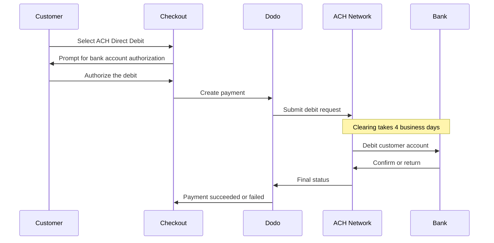

ACH Direct Debit memungkinkan pelanggan di Amerika Serikat membayar langsung dari rekening bank mereka tanpa menggunakan kartu. Metode ini berjalan melalui jaringan Automated Clearing House dan tersedia pada checkout USD untuk pembayaran satu kali.

## Mengapa Menawarkan ACH Direct Debit?

<CardGroup cols={3}>
<Card title="Lower Processing Cost" icon="piggy-bank">
Debit bank biasanya lebih murah untuk diproses dibandingkan pembayaran kartu, terutama untuk pesanan bernilai tinggi.
</Card>

<Card title="No Card Required" icon="building-columns">
Jangkau pelanggan AS yang lebih suka membayar dari rekening bank atau tidak ingin menggunakan kartu untuk pembelian besar.
</Card>

<Card title="Higher Value Orders" icon="chart-line">
Keunggulan biaya dibandingkan kartu semakin besar seiring meningkatnya nilai pesanan, sehingga ACH sangat sesuai untuk pembelian satu kali bernilai besar.
</Card>
</CardGroup>

## Ringkasan

| Detail | Nilai |
| :----- | :---- |
| **Mata Uang Penagihan** | USD |
| **Negara yang Didukung** | Amerika Serikat |
| **Langganan** | Tidak |
| **Jumlah Minimum** | $0.50 |
| **Penyelesaian** | 4 hari kerja |

<Warning>
ACH Direct Debit tidak bersifat instan. Pembayaran memerlukan **4 hari kerja** untuk dikonfirmasi, jadi jangan menganggap otorisasi sebagai penyelesaian — penuhi pesanan hanya setelah pembayaran mencapai status succeeded.
</Warning>

## Cara Kerjanya



## Pengalaman Pelanggan

1. Pelanggan memilih ACH Direct Debit saat checkout
2. Pelanggan mengotorisasi debit dari rekening bank AS mereka
3. Pembayaran dikirimkan ke jaringan ACH dan memasuki status processing
4. Kliring selesai dalam beberapa hari kerja berikutnya
5. Pembayaran berubah ke status succeeded, atau gagal jika dikembalikan oleh bank

<Info>
Karena kliring berlangsung secara asynchronous, gunakan [webhooks](/developer-resources/webhooks) untuk mengetahui hasil akhir, bukan pengalihan dari checkout. Pengalihan yang berhasil hanya berarti pelanggan telah mengotorisasi debit.

Pembayaran menghasilkan `payment.processing` setelah debit dikirimkan, lalu `payment.succeeded` atau `payment.failed` saat kliring selesai. Hanya `payment.succeeded` yang aman untuk digunakan sebagai dasar pemenuhan pesanan.
</Info>

## Ketersediaan

ACH Direct Debit muncul saat checkout jika semua kondisi berikut terpenuhi:

- **Mata uang penagihan** adalah `USD`
- **Negara penagihan** adalah `US`
- Transaksi merupakan **pembayaran satu kali**

<Note>
ACH Direct Debit tidak tersedia untuk langganan. Jendela kliring selama beberapa hari membuatnya tidak sesuai untuk siklus penagihan berulang. Untuk pembayaran berulang, gunakan kartu atau metode lain yang mendukung langganan — lihat [ringkasan Payment Methods](/features/payment-methods).
</Note>

## Konfigurasi

```javascript
const session = await client.checkoutSessions.create({
  product_cart: [{ product_id: 'pdt_123', quantity: 1 }],
  allowed_payment_method_types: ['ach', 'credit', 'debit'],
  billing_currency: 'USD',
  billing_address: {
    country: 'US',
    zipcode: '94102'
  },
  return_url: 'https://example.com/success'
});
```

<Note>
ACH Direct Debit memerlukan mata uang penagihan **USD** dan alamat penagihan di **AS**. Jika Anda mencantumkan harga dalam mata uang lain, aktifkan [Adaptive Currency](/features/adaptive-currency) agar pelanggan AS ditagih dalam USD dan ACH tersedia.
</Note>

## Jenis Metode API

| Jenis | Metode | Negara |
| :--- | :----- | :------ |
| `ach` | ACH Direct Debit | Amerika Serikat |

## Pengembalian Dana dan Sengketa

Pengembalian dana dan sengketa untuk pembayaran ACH menggunakan API dan alur dashboard yang sama seperti metode pembayaran lainnya — tidak ada penanganan khusus ACH yang perlu diimplementasikan.

<Warning>
Karena pembayaran ACH dapat dikembalikan oleh bank pelanggan setelah tampak berhasil diproses, hindari menerbitkan pengembalian dana hingga pembayaran awal mencapai status succeeded.
</Warning>

## Pengujian

<Steps>
<Step title="Enable test mode">
Gunakan API keys pengujian Dodo Payments Anda.
</Step>

<Step title="Set currency and billing address">
Atur mata uang penagihan ke `USD` dan negara alamat penagihan ke `US`.
</Step>

<Step title="Include `ach` in allowed methods">
Masukkan `ach` di `allowed_payment_method_types`, atau kosongkan field tersebut untuk menampilkan semua metode yang memenuhi syarat.
</Step>

<Step title="Enter the test bank details">
Masukkan salah satu pasangan routing number dan account number pengujian di bawah, lalu pastikan webhook handler Anda menerima status pembayaran akhir.
</Step>
</Steps>

### Rekening Bank Pengujian

Pelanggan memasukkan account number dan routing number mereka langsung saat checkout. Dalam test mode, gunakan routing number `110000000` dengan salah satu account number di bawah untuk memicu hasil tertentu.

| Account Number | Routing Number | Perilaku |
| :------------- | :------------- | :------- |
| `000123456789` | `110000000` | Pembayaran berhasil. |
| `000222222227` | `110000000` | Pembayaran gagal karena dana tidak mencukupi. |
| `000111111113` | `110000000` | Pembayaran gagal karena rekening ditutup. |
| `000111111116` | `110000000` | Pembayaran gagal karena rekening tidak ditemukan. |
| `000333333335` | `110000000` | Pembayaran gagal karena debit tidak diotorisasi pada rekening tersebut. |
| `000444444440` | `110000000` | Pembayaran gagal karena mata uang tidak valid. |
| `000555555559` | `110000000` | Pembayaran berhasil, lalu memicu sengketa. |
| `000000000009` | `110000000` | Pembayaran tetap dalam status processing tanpa batas waktu, yang berguna untuk menguji UI status tertunda. |

<Note>
Sebagian besar pembayaran pengujian mencapai status akhir jauh lebih cepat daripada jendela kliring live, jadi Anda tidak perlu menunggu berhari-hari untuk memverifikasi integrasi. Pengecualiannya adalah `000000000009`, yang dirancang untuk tetap dalam status processing.
</Note>

## Praktik Terbaik

<AccordionGroup>
<Accordion title="Don't fulfill on authorization">
Otorisasi ACH bukanlah pembayaran. Tunggu hingga pembayaran mencapai status succeeded sebelum memberikan akses atau mengirimkan pesanan — debit masih dapat dikembalikan oleh bank pelanggan.
</Accordion>

<Accordion title="Set customer expectations at checkout">
Beri tahu pelanggan bahwa pembayaran bank tidak selesai secara instan. Hal ini mengurangi tiket dukungan yang menanyakan mengapa pesanan masih tertunda.
</Accordion>

<Accordion title="Provide card fallbacks">
Selalu sertakan `credit` dan `debit` bersama `ach` agar pelanggan yang memerlukan akses instan ke produk Anda dapat memilih metode yang lebih cepat.
</Accordion>

<Accordion title="Use ACH for high-value one-time purchases">
Keunggulan biaya ACH meningkat seiring nilai pesanan, sehingga metode ini paling berguna untuk pembelian satu kali bernilai besar, bukan pembelian kecil.
</Accordion>
</AccordionGroup>

## Pemecahan Masalah

<AccordionGroup>
<Accordion title="ACH not appearing at checkout">
**Periksa:**
1. Apakah mata uang penagihan diatur ke `USD`?
2. Apakah negara penagihan pelanggan adalah `US`?
3. Apakah `ach` disertakan dalam `allowed_payment_method_types`?
4. Apakah ini pembayaran satu kali? ACH tidak ditawarkan untuk langganan.

**Solusi:** Hapus sementara `allowed_payment_method_types` untuk melihat semua metode yang memenuhi syarat, lalu verifikasi mata uang penagihan dan negara alamat dalam request API Anda.
</Accordion>

<Accordion title="ACH not appearing on a subscription checkout">
**Penyebab:** ACH Direct Debit hanya ditawarkan untuk pembayaran satu kali.

**Solusi:** Gunakan kartu atau metode lain yang mendukung langganan untuk penagihan berulang.
</Accordion>

<Accordion title="Payment stuck in processing">
**Penyebab:** Hal ini memang diharapkan. Pembayaran ACH tetap dalam status processing selama seluruh jendela kliring, jauh lebih lama daripada pembayaran kartu.

**Solusi:** Tunggu webhook akhir. Jangan mencoba kembali pembayaran — percobaan ulang dapat mendebit pelanggan dua kali.
</Accordion>

<Accordion title="Payment failed after initially succeeding at checkout">
**Penyebab:** Bank pelanggan mengembalikan debit — biasanya karena dana tidak mencukupi atau rekening ditutup.

**Solusi:** Perlakukan pembayaran sebagai gagal dan minta pelanggan mencoba kembali dengan metode pembayaran lain. Selalu jadikan status succeeded sebagai syarat pemenuhan pesanan untuk menghindari masalah ini.
</Accordion>
</AccordionGroup>

## Halaman Terkait

<CardGroup cols={2}>
<Card title="Payment Methods Overview" icon="credit-card" href="/features/payment-methods">
Lihat semua metode pembayaran yang didukung.
</Card>

<Card title="Adaptive Currency" icon="globe" href="/features/adaptive-currency">
Dukungan mata uang dan konversi otomatis.
</Card>

<Card title="Checkout Guide" icon="book" href="/developer-resources/checkout-session">
Panduan lengkap implementasi checkout.
</Card>

<Card title="Webhooks" icon="webhook" href="/developer-resources/webhooks">
Tangani konfirmasi pembayaran yang tertunda secara asynchronous.
</Card>
</CardGroup>
