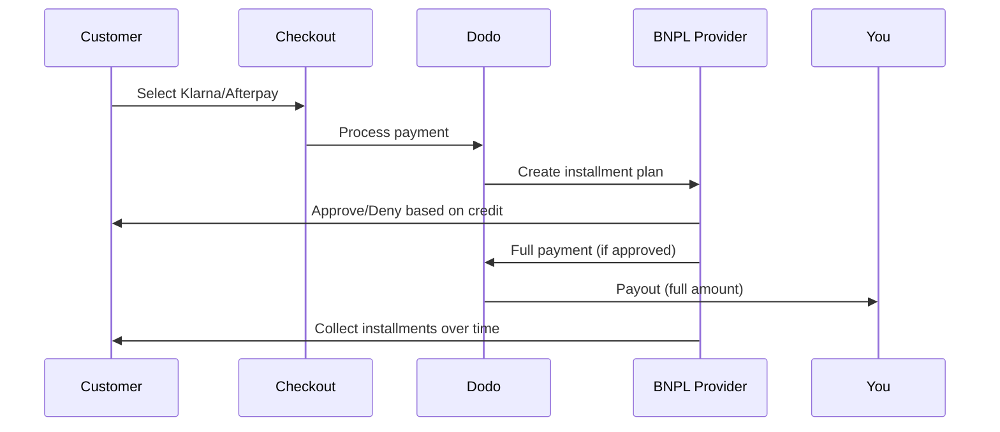

Beli Sekarang Bayar Nanti (BNPL) memungkinkan pelanggan membagi pembelian menjadi cicilan tanpa bunga, meningkatkan nilai rata-rata order sebesar 20-50% dan tingkat konversi sebesar 10-30% untuk transaksi yang memenuhi syarat.

## Mengapa Menawarkan BNPL?

<CardGroup cols={3}>
<Card title="Higher AOV" icon="chart-line">
Pelanggan membelanjakan lebih banyak saat mereka bisa mencicil pembayaran dari waktu ke waktu. Nilai pesanan rata-rata meningkat 20-50%.
</Card>

<Card title="Better Conversion" icon="percent">
Menghilangkan hambatan pembayaran saat checkout. Tingkat konversi meningkat 10-30% untuk produk bernilai tinggi.
</Card>

<Card title="Zero Risk" icon="shield-check">
Penyedia BNPL menangani risiko kredit dan penagihan. Anda menerima pembayaran penuh di muka.
</Card>
</CardGroup>

## Penyedia yang Didukung

### Klarna

| Fitur | Rincian |
| :------ | :------ |
| **Ketersediaan** | AS + 19 negara Eropa |
| **Mata Uang** | USD, EUR, GBP, DKK, NOK, SEK, CZK, RON, PLN, CHF |
| **Minimum** | $50.01 (atau setara) |
| **Langganan** | Ya |

**Negara yang Didukung:** Austria, Belgia, Republik Ceko, Denmark, Finlandia, Prancis, Jerman, Yunani, Irlandia, Italia, Belanda, Norwegia, Polandia, Portugal, Rumania, Spanyol, Swedia, Swiss, Inggris, Amerika Serikat

**Opsi Pembayaran:**
- **Bayar dalam 4** — Bagi menjadi 4 pembayaran tanpa bunga
- **Bayar dalam 30 hari** — Pembayaran penuh jatuh tempo dalam 30 hari
- **Pembiayaan** — Rencana cicilan jangka panjang

### Afterpay (Clearpay)

| Fitur | Detail |
| :------ | :------ |
| **Ketersediaan** | AS, Inggris |
| **Mata Uang** | USD, GBP |
| **Minimum** | $50.01 (atau setara) |
| **Langganan** | Tidak |

**Opsi Pembayaran:**
- **Bayar dalam 4** — 4 pembayaran tanpa bunga setiap 2 minggu

<Note>
Di Inggris, Afterpay beroperasi sebagai "Clearpay" tetapi menggunakan jenis API yang sama (`afterpay_clearpay`).
</Note>

### Billie

| Fitur | Detail |
| :------ | :------ |
| **Ketersediaan** | Global |
| **Mata Uang** | GBP |
| **Minimum** | Tidak ada |
| **Langganan** | Tidak |

**Tentang Billie:**
Billie adalah solusi B2B Beli Sekarang Bayar Nanti yang memungkinkan bisnis menawarkan syarat pembayaran yang fleksibel kepada pelanggannya. Dirancang untuk transaksi bisnis-ke-bisnis di mana pembeli memerlukan opsi pembayaran berbasis faktur.

**Opsi Pembayaran:**
- **Pembayaran Faktur** — Bayar dalam jangka waktu yang disepakati
- **Syarat Fleksibel** — Jadwal pembayaran yang ramah bisnis

### Sunbit

| Fitur | Detail |
| :------ | :------ |
| **Ketersediaan** | AS |
| **Mata Uang** | USD |
| **Minimum** | $60,00 |
| **Maksimum** | $19.999,00 |
| **Langganan** | Tidak |

**Opsi Pembayaran:**
- **Pembiayaan Angsuran** — Bagi pembelian menjadi pembayaran bulanan yang mudah dikelola

## Konfigurasi

### Jenis Metode API

| Tipe | Penyedia |
| :--- | :------- |
| `klarna` | Klarna |
| `afterpay_clearpay` | Afterpay / Clearpay |
| `billie` | Billie (B2B) |
| `sunbit` | Sunbit |

### Contoh

```javascript
const session = await client.checkoutSessions.create({
  product_cart: [{ product_id: 'prod_123', quantity: 1 }],
  allowed_payment_method_types: [
    'klarna',
    'afterpay_clearpay',
    'credit',
    'debit'
  ],
  customer: {
    email: 'customer@example.com',
    name: 'Jane Smith'
  },
  billing_address: {
    country: 'US',
    zipcode: '10001'
  },
  return_url: 'https://example.com/success'
});
```

<Warning>
Selalu sertakan `credit` dan `debit` sebagai pengganti. Tidak semua pelanggan memenuhi syarat untuk BNPL, dan transaksi di bawah batas minimum penyedia tidak akan memenuhi syarat.
</Warning>

## Batas Jumlah Transaksi

Setiap penyedia BNPL memiliki jumlah transaksi minimum (dan terkadang maksimum) sendiri:

| Penyedia | Minimum | Maksimum |
| :------- | :------ | :------ |
| Klarna | $50,01 | — |
| Afterpay | $50,01 | — |
| Sunbit | $60,00 | $19.999,00 |

Transaksi di luar batas ini:
- Opsi BNPL tidak akan muncul saat checkout
- Tidak ada kesalahan yang ditampilkan — opsi tidak terlihat
- Pembayaran dengan kartu tetap tersedia

Ini adalah perilaku yang diharapkan. Jangan sertakan metode BNPL dalam `allowed_payment_method_types` jika harga produk Anda tidak mungkin jatuh dalam rentang yang didukung penyedia tersebut.

## Cara Kerja Angsuran



**Poin penting:**
- Anda menerima **pembayaran penuh di muka** dari penyedia BNPL
- Penyedia BNPL menangani **risiko kredit dan penagihan**
- Pelanggan membayar penyedia langsung dalam **4 angsuran** (biasanya)
- **Tidak ada pengembalian dana** dari kegagalan angsuran — itu adalah risiko penyedia

## Pengujian

### Data Uji Klarna

Gunakan detail ini dalam mode uji:

| Bidang | Disetujui | Ditolak |
| :---- | :------- | :----- |
| **Tanggal Lahir** | 07-10-1970 | 07-10-1970 |
| **Nama Depan** | Test | Test |
| **Nama Belakang** | Person-us | Person-us |
| **Email** | customer@email.us | customer+denied@email.us |
| **Jalan** | Amsterdam Ave | Amsterdam Ave |
| **Nomor Rumah** | 509 | 509 |
| **Kota** | New York | New York |
| **Negara Bagian** | New York | New York |
| **Kode Pos** | 10024-3941 | 10024-3941 |
| **Telepon** | +13106683312 | +13106354386 |

<Note>
Transaksi harus minimal $50 agar Klarna muncul sebagai pilihan.
</Note>

### Pengujian Afterpay

<Steps>
<Step title="Select Afterpay">
Pilih Afterpay saat checkout dan klik Bayar.
</Step>

<Step title="Successful payment">
Gunakan email dan alamat pengiriman yang valid.
</Step>

<Step title="Failed authentication">
Untuk menguji kegagalan: tutup modal Afterpay pada halaman pengalihan. Status pembayaran berubah menjadi `requires_payment_method`.
</Step>
</Steps>

### Pengujian Sunbit

<Steps>
<Step title="Set billing country and currency">
Pastikan sesi checkout memiliki `billing_address.country` diatur ke `US` dan `billing_currency` diatur ke `USD`.
</Step>

<Step title="Use a qualifying amount">
Atur jumlah transaksi antara **$60,00 dan $19.999,00**. Sunbit tidak akan muncul di luar rentang ini.
</Step>

<Step title="Select Sunbit">
Pilih Sunbit saat checkout dan selesaikan alur aplikasi pembiayaan di modal Sunbit.
</Step>

<Step title="Test failure">
Untuk mensimulasikan aplikasi yang ditolak, tutup modal Sunbit sebelum menyelesaikan alur. Pembayaran berubah menjadi `requires_payment_method`.
</Step>
</Steps>

<Note>
Sunbit hanya tersedia untuk pelanggan AS yang membayar dalam USD dengan jumlah transaksi antara $60,00 dan $19.999,00.
</Note>

## Praktik Terbaik

<AccordionGroup>
<Accordion title="Target high-ticket items">
BNPL bekerja paling baik untuk produk $100-$1000. Proposal nilai "bayar seiring waktu" paling menarik di rentang ini.
</Accordion>

<Accordion title="Show installment amounts">
"4 pembayaran sebesar $25" lebih menarik daripada "$100 dengan Klarna". Tampilkan jumlah per pembayaran jika memungkinkan.
</Accordion>

<Accordion title="Don't force BNPL for low-value products">
Di bawah $50, BNPL tidak akan muncul. Di bawah $100, sebagian besar pelanggan lebih memilih kartu. Fokuskan promosi BNPL pada barang dengan tiket lebih tinggi.
</Accordion>

<Accordion title="Collect billing address">
Penyedia BNPL memerlukan informasi penagihan untuk pemeriksaan kredit. Pastikan checkout Anda mengumpulkan detail alamat lengkap.
</Accordion>

<Accordion title="Set clear expectations">
Pelanggan harus memahami bahwa mereka memasuki perjanjian kredit dengan Klarna/Afterpay, bukan dengan Anda.
</Accordion>
</AccordionGroup>

## Keterbatasan

### Tidak Ada Langganan
Metode pembayaran BNPL **tidak mendukung pembayaran berulang**. Untuk produk berlangganan, gunakan kartu atau metode lain yang kompatibel dengan berulang.

### Persetujuan Berbasis Kredit
Penyedia BNPL melakukan pemeriksaan kredit instan. Tidak semua pelanggan akan disetujui. Tingkat persetujuan bervariasi menurut:
- Riwayat kredit pelanggan dengan penyedia
- Jumlah transaksi
- Lokasi pelanggan

### Pemetaan Mata Uang & Negara

Setiap mata uang dibatasi pada wilayah yang sesuai:

| Mata Uang | Negara yang Didukung |
| :------- | :------------------ |
| **USD** | Hanya Amerika Serikat |
| **EUR** | Semua negara Eropa yang didukung (Austria, Belgia, Republik Ceko, Denmark, Finlandia, Prancis, Jerman, Yunani, Irlandia, Italia, Belanda, Norwegia, Polandia, Portugal, Rumania, Spanyol, Swedia, Swiss) |
| **GBP** | Britania Raya dan semua negara Eropa yang didukung |

Mata uang lain yang didukung Klarna (DKK, NOK, SEK, CZK, RON, PLN, CHF) bekerja di negaranya masing-masing.

<Info>
Misalnya, transaksi USD hanya akan menampilkan opsi BNPL kepada pelanggan di AS. Transaksi EUR akan menampilkan opsi BNPL di semua negara Eropa yang didukung. Transaksi GBP akan menampilkan opsi BNPL kepada pelanggan di Inggris dan semua negara Eropa yang didukung.
</Info>

| Penyedia | Mata Uang yang Didukung |
| :------- | :------------------- |
| Klarna | USD, EUR, GBP, DKK, NOK, SEK, CZK, RON, PLN, CHF |
| Afterpay | USD (AS), GBP (UK) |
| Sunbit | USD (AS) |

## Pemecahan Masalah

<AccordionGroup>
<Accordion title="BNPL not appearing at checkout">
**Periksa:**
1. Jumlah transaksi dalam rentang yang didukung penyedia? (Klarna/Afterpay: min $50,01; Sunbit: $60,00–$19.999,00)
2. Lokasi pelanggan di negara yang didukung?
3. Mata uang yang didukung oleh penyedia BNPL?
4. Metode BNPL termasuk dalam `allowed_payment_method_types`?

**Solusi:** Paling umum, transaksi berada di bawah minimum atau di atas maksimum. Verifikasi jumlah sesuai dengan rentang yang didukung penyedia.
</Accordion>

<Accordion title="Customer denied by BNPL provider">
**Penyebab:**
- Riwayat kredit tidak cukup dengan penyedia
- Terlalu banyak rencana angsuran aktif
- Verifikasi identitas gagal

**Solusi:** Ini diharapkan untuk beberapa pelanggan. Pastikan opsi pembayaran dengan kartu tersedia. Jangan mengungkapkan alasan penolakan tertentu.
</Accordion>

<Accordion title="Payment stuck in pending">
**Penyebab:** Pelanggan tidak menyelesaikan alur otentikasi dengan penyedia BNPL.

**Solusi:** Pembayaran akan kedaluwarsa dan gagal. Pelanggan dapat mencoba lagi atau menggunakan metode yang berbeda.
</Accordion>
</AccordionGroup>

## Halaman Terkait

<CardGroup cols={2}>
<Card title="Payment Methods Overview" icon="credit-card" href="/features/payment-methods">
Lihat semua metode pembayaran yang didukung.
</Card>

<Card title="Checkout Guide" icon="book" href="/developer-resources/checkout-session">
Panduan pelaksanaan checkout lengkap.
</Card>

<Card title="Testing Process" icon="flask" href="/miscellaneous/testing-process">
Semua data uji untuk metode pembayaran.
</Card>

<Card title="Adaptive Currency" icon="globe" href="/features/adaptive-currency">
Dukungan mata uang dan konversi.
</Card>
</CardGroup>