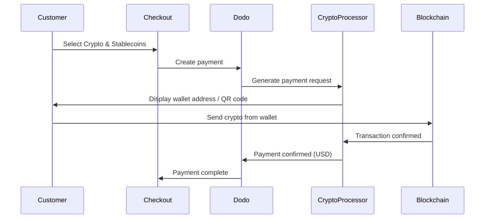

Pembayaran Crypto & Stablecoins memungkinkan pelanggan membayar menggunakan cryptocurrency dan stablecoin dari mana saja di dunia (kecuali India). Transaksi ditagih dalam USD, sehingga Anda menerima mata uang fiat sementara pelanggan membayar dengan dompet kripto pilihan mereka.

## Mengapa Menawarkan Crypto & Stablecoins?

<CardGroup cols={3}>
<Card title="Global Reach" icon="globe">
Terima pembayaran dari negara mana pun — tidak diperlukan infrastruktur perbankan di pihak pelanggan.
</Card>

<Card title="No Chargebacks" icon="shield-check">
Transaksi kripto tidak dapat diubah, menghilangkan penipuan chargeback sepenuhnya.
</Card>

<Card title="USD Settlement" icon="dollar-sign">
Anda menerima USD — tidak perlu mengelola volatilitas kripto atau dompet.
</Card>
</CardGroup>

## Gambaran Umum

| Detail | Nilai |
| :----- | :---- |
| **Mata Uang Penagihan** | USD |
| **Negara yang Didukung** | Global (Kecuali IN) |
| **Langganan** | Tidak |
| **Jumlah Minimum** | $0.50 |
| **Penyelesaian** | USD |

## Cara Kerjanya



## Pengalaman Pelanggan

1. Pelanggan memilih Crypto & Stablecoins saat checkout
2. Alamat dompet dan kode QR ditampilkan dengan jumlah dalam kripto
3. Pelanggan mengirim jumlah tepat dari dompet kripto mereka
4. Transaksi dikonfirmasi di blockchain
5. Pelanggan diarahkan ke halaman sukses

<Info>
Pembayaran kripto ditagih dalam USD. Jumlah kripto yang ditampilkan di checkout mencerminkan kurs tukar waktu nyata pada saat pembayaran.
</Info>

## Mata Uang & Jaringan yang Didukung

| Mata Uang | Jaringan |
| :-------- | :------- |
| **USDC** | Ethereum, Solana, Polygon, Base |
| **USDP** | Ethereum, Solana |
| **USDG** | Ethereum |

## Konfigurasi

```javascript
const session = await client.checkoutSessions.create({
  product_cart: [{ product_id: 'prod_123', quantity: 1 }],
  allowed_payment_method_types: ['crypto', 'credit', 'debit'],
  return_url: 'https://example.com/success'
});
```

## Tipe Metode API

| Tipe | Metode | Negara |
| :--- | :----- | :------ |
| `crypto` | Crypto & Stablecoins | Global (Kecuali IN) |

## Pengujian

<Steps>
<Step title="Enable test mode">
Gunakan kunci API uji Dodo Payments Anda.
</Step>

<Step title="Create a test checkout">
Buat sesi checkout dengan `crypto` dalam metode pembayaran yang diizinkan.
</Step>

<Step title="Complete the test flow">
Ikuti alur pembayaran kripto simulasi di lingkungan uji.
</Step>
</Steps>

## Praktik Terbaik

<AccordionGroup>
<Accordion title="Always include card fallbacks">
Tidak semua pelanggan memiliki dompet kripto. Selalu sertakan `credit` dan `debit` sebagai metode pembayaran cadangan.
</Accordion>

<Accordion title="Set clear expectations on confirmation time">
Konfirmasi blockchain dapat memakan waktu beberapa menit tergantung pada jaringan. Pastikan checkout Anda mengkomunikasikan hal ini kepada pelanggan.
</Accordion>

<Accordion title="Handle underpayments and overpayments">
Pembayaran kripto kadang-kadang mungkin berbeda sedikit dari jumlah yang sebenarnya karena biaya jaringan. Pantau webhook untuk pembaruan status pembayaran.
</Accordion>
</AccordionGroup>

## Pemecahan Masalah

<AccordionGroup>
<Accordion title="Crypto not appearing at checkout">
**Periksa:**
1. `crypto` termasuk dalam `allowed_payment_method_types`?
2. Jumlah transaksi memenuhi minimum ($0.50)?

**Solusi:** Pastikan tipe metode pembayaran diteruskan dengan benar dalam permintaan API Anda.
</Accordion>

<Accordion title="Payment not confirming">
**Penyebab:** Waktu konfirmasi blockchain bervariasi. Beberapa jaringan memakan waktu lebih lama dibandingkan yang lain.

**Solusi:** Tunggu konfirmasi webhook. Jangan menganggap pembayaran gagal hingga jendela konfirmasi berlalu.
</Accordion>

<Accordion title="Amount mismatch">
**Penyebab:** Kurs tukar kripto berfluktuasi antara waktu pembayaran diinisiasi dan saat dikirim.

**Solusi:** Pantau webhook untuk jumlah akhir yang dikonfirmasi. Ketidaksesuaian kecil ditangani secara otomatis.
</Accordion>
</AccordionGroup>

## Halaman Terkait

<CardGroup cols={2}>
<Card title="Payment Methods Overview" icon="credit-card" href="/features/payment-methods">
Lihat semua metode pembayaran yang didukung.
</Card>

<Card title="Checkout Guide" icon="book" href="/developer-resources/checkout-session">
Panduan implementasi checkout lengkap.
</Card>

<Card title="Webhooks" icon="webhook" href="/developer-resources/webhooks">
Tangani konfirmasi pembayaran secara asinkron.
</Card>

<Card title="Testing Process" icon="flask" href="/miscellaneous/testing-process">
Panduan pengujian lengkap untuk semua metode pembayaran.
</Card>
</CardGroup>
