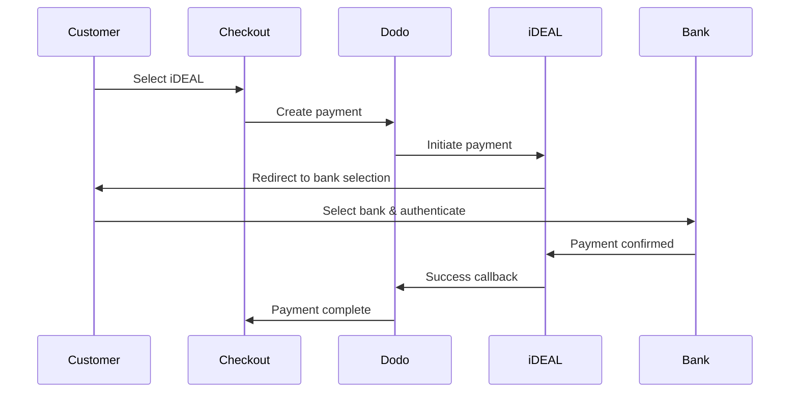
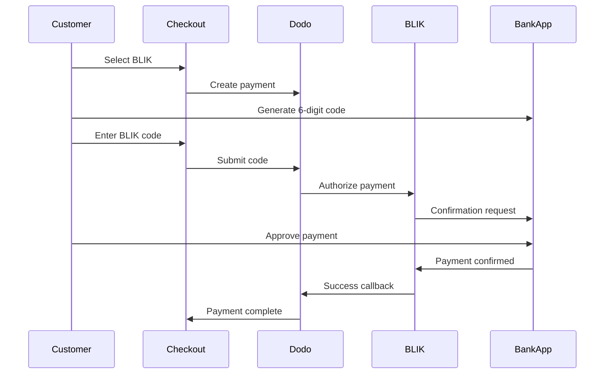

Pelanggan Eropa sangat menyukai metode pembayaran lokal yang terintegrasi dengan sistem perbankan mereka. Menawarkan metode ini dapat meningkatkan rasio konversi sebesar 20-40% di pasar target.

## Mengapa Metode Pembayaran Lokal Eropa?

<CardGroup cols={3}>
<Card title="Higher Conversion" icon="chart-line">
iDEAL menangkap ~60% pembayaran online Belanda. Tidak menawarkan berarti kehilangan pelanggan.
</Card>

<Card title="Lower Fraud" icon="shield-check">
Pembayaran yang diautentikasi bank memiliki tingkat penipuan hampir nol dan tanpa chargeback.
</Card>

<Card title="Real-Time Settlement" icon="bolt">
Sebagian besar metode Eropa memberikan konfirmasi pembayaran instan.
</Card>
</CardGroup>

## Metode yang Didukung

| Metode | Negara | Pangsa Pasar | Mata Uang | Langganan |
| :----- | :------ | :----------- | :------- | :-----------: |
| **iDEAL** | Belanda | ~60% | EUR | Tidak |
| **Bancontact** | Belgia | ~50% | EUR | Tidak |
| **EPS** | Austria | ~30% | EUR | Tidak |
| **Multibanco** | Portugal | ~40% | EUR | Tidak |
| **BLIK** | Polandia | ~60% | PLN | Tidak |
| **SEPA Direct Debit** | Zona Euro | Banyak digunakan | EUR | Tidak |
| **Satispay** | Eropa (Italia) | Berkembang | EUR | Ya |

## iDEAL (Belanda)

iDEAL adalah metode pembayaran daring yang dominan di Belanda, terhubung langsung ke semua bank utama Belanda.

### Cara Kerjanya



### Bank yang Didukung

Semua bank utama Belanda didukung:
- ABN AMRO
- ASN Bank
- Bunq
- ING
- Knab
- Rabobank
- RegioBank
- Revolut
- SNS
- Triodos Bank
- Van Lanschot

### Konfigurasi

```javascript
const session = await client.checkoutSessions.create({
  product_cart: [{ product_id: 'pdt_123', quantity: 1 }],
  allowed_payment_method_types: ['ideal', 'credit', 'debit'],
  billing_currency: 'EUR',
  billing_address: {
    country: 'NL',
    zipcode: '1012JS'
  },
  return_url: 'https://example.com/success'
});
```

## Bancontact (Belgia)

Bancontact adalah skema pembayaran nasional Belgia, digunakan oleh hampir semua bank Belgia untuk pembayaran daring.

### Fitur
- Berfungsi dengan kartu debit Belgia yang ada
- Dukungan aplikasi seluler (Payconiq oleh Bancontact)
- Konfirmasi pembayaran instan
- Tidak perlu pendaftaran tambahan untuk pelanggan

### Konfigurasi

```javascript
const session = await client.checkoutSessions.create({
  product_cart: [{ product_id: 'pdt_123', quantity: 1 }],
  allowed_payment_method_types: ['bancontact_card', 'credit', 'debit'],
  billing_currency: 'EUR',
  billing_address: {
    country: 'BE',
    zipcode: '1000'
  },
  return_url: 'https://example.com/success'
});
```

## EPS (Austria)

EPS (Electronic Payment Standard) memungkinkan transfer bank daring langsung untuk pelanggan Austria.

### Fitur
- Integrasi langsung dengan bank-bank Austria
- Konfirmasi pembayaran waktu nyata
- Tingkat kepercayaan tinggi di antara konsumen Austria
- Tidak ada pengembalian dana

### Bank yang Didukung

Bank-bank besar Austria termasuk:
- Erste Bank
- Bank Austria
- Raiffeisen
- BAWAG
- Volksbank

### Konfigurasi

```javascript
const session = await client.checkoutSessions.create({
  product_cart: [{ product_id: 'pdt_123', quantity: 1 }],
  allowed_payment_method_types: ['eps', 'credit', 'debit'],
  billing_currency: 'EUR',
  billing_address: {
    country: 'AT',
    zipcode: '1010'
  },
  return_url: 'https://example.com/success'
});
```

## Multibanco (Portugal)

Multibanco adalah jaringan antarbank Portugal, menawarkan pembayaran daring dan pembayaran berbasis ATM.

### Opsi Pembayaran

1. **Perbankan Daring** — Transfer bank langsung melalui perbankan internet
2. **Pembayaran ATM** — Pelanggan menerima referensi untuk membayar di mana saja di ATM Multibanco
3. **Perbankan Seluler** — Pembayaran melalui aplikasi seluler bank

### Cara Kerja Pembayaran ATM

Untuk pembayaran ATM, pelanggan menerima referensi pembayaran:

```
Entity: 12345
Reference: 123 456 789
Amount: €50.00
Expiry: 24 hours
```

Pelanggan dapat membayar di mana saja di ATM Portugal atau melalui perbankan daring menggunakan referensi ini.

### Konfigurasi

```javascript
const session = await client.checkoutSessions.create({
  product_cart: [{ product_id: 'pdt_123', quantity: 1 }],
  allowed_payment_method_types: ['multibanco', 'credit', 'debit'],
  billing_currency: 'EUR',
  billing_address: {
    country: 'PT',
    zipcode: '1000-001'
  },
  return_url: 'https://example.com/success'
});
```

<Note>
Pembayaran ATM Multibanco mungkin mengalami keterlambatan antara checkout dan pembayaran aktual. Pantau webhook untuk konfirmasi pembayaran.
</Note>

## BLIK (Polandia)

BLIK adalah metode pembayaran seluler paling populer di Polandia, yang memungkinkan pelanggan membayar menggunakan kode 6 digit sekali pakai yang dibuat di aplikasi perbankan mereka. BLIK diselesaikan dalam **PLN** (Złoty Polandia), bukan EUR.

### Cara Kerjanya



### Ketersediaan

- **Mata uang penagihan:** Hanya PLN
- **Jenis transaksi:** Hanya pembayaran satu kali (tidak tersedia untuk langganan)
- **Cakupan:** Semua bank utama di Polandia yang mendukung BLIK

### Konfigurasi

```javascript
const session = await client.checkoutSessions.create({
  product_cart: [{ product_id: 'pdt_123', quantity: 1 }],
  allowed_payment_method_types: ['blik', 'credit', 'debit'],
  billing_currency: 'PLN',
  billing_address: {
    country: 'PL',
    zipcode: '00-001'
  },
  return_url: 'https://example.com/success'
});
```

<Note>
BLIK memerlukan mata uang penagihan **PLN**. Jika Anda menetapkan harga dalam EUR, aktifkan [Adaptive Currency](/features/adaptive-currency) agar pelanggan Polandia ditagih dalam PLN dan BLIK tersedia.
</Note>

## SEPA Direct Debit (Zona Euro)

SEPA Direct Debit memungkinkan pelanggan di seluruh Zona Euro membayar langsung dari rekening bank mereka, bukan menggunakan kartu. Metode ini ditawarkan pada checkout EUR untuk pembayaran satu kali.

### Cara Kerja

Pelanggan mengotorisasi debit selama checkout dan pembayaran ditarik dari rekening bank mereka. Tidak seperti sebagian besar metode Eropa di halaman ini, konfirmasi tidak dilakukan secara langsung.

<Warning>
SEPA Direct Debit tidak instan. Pembayaran memerlukan waktu **6 hari kerja** untuk dikonfirmasi, jadi jangan menganggap otorisasi sebagai penyelesaian — penuhi pesanan hanya setelah pembayaran mencapai status succeeded.
</Warning>

### Ketersediaan

- **Mata uang penagihan:** EUR
- **Jenis transaksi:** Hanya pembayaran satu kali (tidak tersedia untuk langganan)

### Konfigurasi

```javascript
const session = await client.checkoutSessions.create({
  product_cart: [{ product_id: 'pdt_123', quantity: 1 }],
  allowed_payment_method_types: ['sepa', 'credit', 'debit'],
  billing_currency: 'EUR',
  billing_address: {
    country: 'DE',
    zipcode: '10115'
  },
  return_url: 'https://example.com/success'
});
```

### IBAN Pengujian SEPA

Dalam mode pengujian, masukkan salah satu IBAN di bawah ini saat checkout untuk memaksa hasil tertentu.

| IBAN Pengujian | Perilaku |
| :-------- | :------- |
| `DE89370400440532013000` | Pembayaran berhasil. |
| `DE08370400440532013003` | Pembayaran berhasil setelah penundaan setidaknya tiga menit. |
| `DE62370400440532013001` | Pembayaran gagal. |
| `DE78370400440532013004` | Pembayaran gagal setelah penundaan setidaknya tiga menit. |
| `DE35370400440532013002` | Pembayaran berhasil, lalu langsung disengketakan. |
| `DE65370400440002222227` | Pembayaran gagal karena dana tidak mencukupi. |
| `DE18370400440000066666` | Rekening bank tidak dapat digunakan, sehingga metode pembayaran tidak dapat dibuat. |

Untuk menguji perilaku khusus negara, gunakan IBAN berhasil yang setara untuk negara lain di Zona Euro:

| Negara | IBAN Berhasil |
| :------ | :----------- |
| Austria | `AT611904300234573201` |
| Belgia | `BE62510007547061` |
| Estonia | `EE382200221020145685` |
| Finlandia | `FI2112345600000785` |
| Prancis | `FR1420041010050500013M02606` |
| Irlandia | `IE29AIBK93115212345678` |
| Luksemburg | `LU280019400644750000` |

<Note>
IBAN pengujian yang tertunda berguna untuk memastikan bahwa handler webhook Anda — bukan pengalihan checkout — yang memberikan akses, karena pembayaran SEPA dikonfirmasi jauh setelah pelanggan meninggalkan checkout.
</Note>

## Satispay (Eropa)

Satispay adalah jaringan pembayaran seluler Eropa yang populer, terutama di Italia, yang memungkinkan pelanggan membayar langsung dari aplikasi Satispay mereka tanpa membagikan detail kartu atau bank. Satispay diselesaikan dalam **EUR**.

### Fitur

- Pembayaran berbasis aplikasi yang tidak bergantung pada jaringan kartu
- Adopsi yang kuat di Italia dan terus berkembang di pasar Eropa lainnya
- Mendukung pembayaran satu kali dan langganan

### Ketersediaan

- **Mata uang penagihan:** EUR
- **Jenis transaksi:** Pembayaran satu kali dan langganan

### Konfigurasi

```javascript
const session = await client.checkoutSessions.create({
  product_cart: [{ product_id: 'pdt_123', quantity: 1 }],
  allowed_payment_method_types: ['satispay', 'credit', 'debit'],
  billing_currency: 'EUR',
  billing_address: {
    country: 'IT',
    zipcode: '00100'
  },
  return_url: 'https://example.com/success'
});
```

## Jenis Metode API

| Jenis | Metode | Negara |
| :--- | :----- | :------ |
| `ideal` | iDEAL | Belanda |
| `bancontact_card` | Bancontact | Belgia |
| `eps` | EPS | Austria |
| `multibanco` | Multibanco | Portugal |
| `blik` | BLIK | Polandia |
| `sepa` | SEPA Direct Debit | Zona Euro |
| `satispay` | Satispay | Eropa (Italia) |

## Checkout Eropa Multi-Negara

Untuk bisnis yang melayani beberapa negara Eropa, sertakan semua metode regional:

```javascript
const session = await client.checkoutSessions.create({
  product_cart: [{ product_id: 'pdt_123', quantity: 1 }],
  allowed_payment_method_types: [
    'ideal',           // Netherlands
    'bancontact_card', // Belgium
    'eps',             // Austria
    'multibanco',      // Portugal
    'blik',            // Poland (requires PLN billing currency)
    'sepa',            // Eurozone (one-time payments only)
    'satispay',        // Europe / Italy
    'credit',          // Fallback
    'debit'            // Fallback
  ],
  billing_currency: 'EUR',
  return_url: 'https://example.com/success'
});
```

Dodo secara otomatis hanya menampilkan metode yang relevan berdasarkan lokasi pelanggan. Pelanggan dari Belanda akan melihat iDEAL; pelanggan dari Belgia akan melihat Bancontact.

## Pengujian

Metode pembayaran Eropa dapat diuji dalam Test Mode. Alur pengujian menyimulasikan proses autentikasi bank.

<Note>
SEPA Direct Debit diuji secara berbeda — alih-alih alur bank yang disimulasikan, Anda memasukkan IBAN pengujian secara langsung. Lihat [IBAN Pengujian SEPA](#sepa-test-ibans).
</Note>

<Steps>
<Step title="Enable test mode">
Gunakan kunci API pengujian Dodo Payments Anda.
</Step>

<Step title="Set appropriate billing address">
Tetapkan negara alamat penagihan agar sesuai dengan metode pembayaran:
- `NL` untuk iDEAL
- `BE` untuk Bancontact
- `AT` untuk EPS
- `PT` untuk Multibanco
- `PL` untuk BLIK (dengan mata uang penagihan PLN)
- `IT` untuk Satispay
</Step>

<Step title="Complete the test flow">
Ikuti alur autentikasi bank yang disimulasikan di lingkungan pengujian.
</Step>
</Steps>

## Praktik Terbaik

<AccordionGroup>
<Accordion title="Always include regional methods for target markets">
Jika Anda menjual kepada pelanggan dari Belanda, sertakan iDEAL. Tidak melakukannya sama seperti tidak menerima Visa di AS — Anda akan kehilangan penjualan dalam jumlah besar.
</Accordion>

<Accordion title="Match currency to region">
Sebagian besar metode pembayaran Eropa memerlukan EUR — pastikan penetapan harga Anda mendukung transaksi Euro. Satu pengecualiannya adalah BLIK, yang hanya ditawarkan dengan penagihan **PLN** (Złoty Polandia).
</Accordion>

<Accordion title="Handle redirects gracefully">
Semua metode Eropa melibatkan pengalihan ke situs bank. Pastikan penanganan return URL Anda kuat dan memperhitungkan pengguna yang berhenti di tengah alur.
</Accordion>

<Accordion title="Provide card fallbacks">
Tidak semua pelanggan Eropa memiliki akses ke metode regional ini (wisatawan, ekspatriat, dan sebagainya). Selalu sertakan `credit` dan `debit` sebagai fallback.
</Accordion>

<Accordion title="Consider Multibanco timing">
Pembayaran Multibanco melalui ATM mungkin memerlukan waktu berjam-jam untuk selesai. Jangan menunda pemenuhan pesanan sambil menunggu pembayaran langsung — gunakan webhook untuk konfirmasi asinkron.
</Accordion>
</AccordionGroup>

## Pemecahan Masalah

<AccordionGroup>
<Accordion title="European method not appearing">
**Periksa:**
1. Apakah negara penagihan pelanggan sesuai dengan negara metode?
2. Apakah mata uang ditetapkan ke EUR?
3. Apakah metode disertakan dalam `allowed_payment_method_types`?

**Solusi:** Metode Eropa memiliki batasan regional yang ketat. Pelanggan dengan negara penagihan `DE` (Jerman) tidak akan melihat iDEAL, yang hanya tersedia di Belanda.
</Accordion>

<Accordion title="Bank authentication failed">
**Penyebab:**
- Pelanggan membatalkan proses selama autentikasi bank
- Sistem autentikasi bank sedang tidak tersedia untuk sementara
- Pelanggan memasukkan kredensial yang salah

**Solusi:** Pelanggan harus mencoba lagi. Jika masalah berlanjut, sarankan untuk mencoba metode pembayaran lain.
</Accordion>

<Accordion title="Redirect not completing">
**Penyebab:**
- Pelanggan menutup browser selama pengalihan ke bank
- Masalah jaringan selama autentikasi
- Return URL dikonfigurasi dengan tidak benar

**Solusi:** Pastikan return URL sudah benar dan dapat diakses. Pastikan URL tersebut menangani status berhasil maupun gagal.
</Accordion>

<Accordion title="Multibanco payment pending">
**Penyebab:** Pelanggan menerima referensi pembayaran tetapi belum membayar.

**Solusi:** Hal ini wajar untuk pembayaran berbasis ATM. Tunggu konfirmasi webhook. Referensi biasanya kedaluwarsa dalam 24–72 jam.
</Accordion>
</AccordionGroup>

## Kepatuhan PSD2

Semua metode pembayaran Eropa mematuhi peraturan PSD2 (Payment Services Directive 2):

- **Strong Customer Authentication (SCA)** — Terintegrasi dalam alur autentikasi bank
- **Komunikasi Aman** — Semua data dikirim melalui saluran yang aman
- **Perlindungan Konsumen** — Kepatuhan penuh terhadap hak konsumen UE

## Halaman Terkait

<CardGroup cols={2}>
<Card title="Payment Methods Overview" icon="credit-card" href="/features/payment-methods">
Lihat semua metode pembayaran yang didukung.
</Card>

<Card title="Adaptive Currency" icon="globe" href="/features/adaptive-currency">
Dukungan mata uang dan konversi otomatis.
</Card>

<Card title="Checkout Guide" icon="book" href="/developer-resources/checkout-session">
Panduan implementasi checkout lengkap.
</Card>

<Card title="Webhooks" icon="webhook" href="/developer-resources/webhooks">
Tangani konfirmasi pembayaran secara asinkron.
</Card>
</CardGroup>