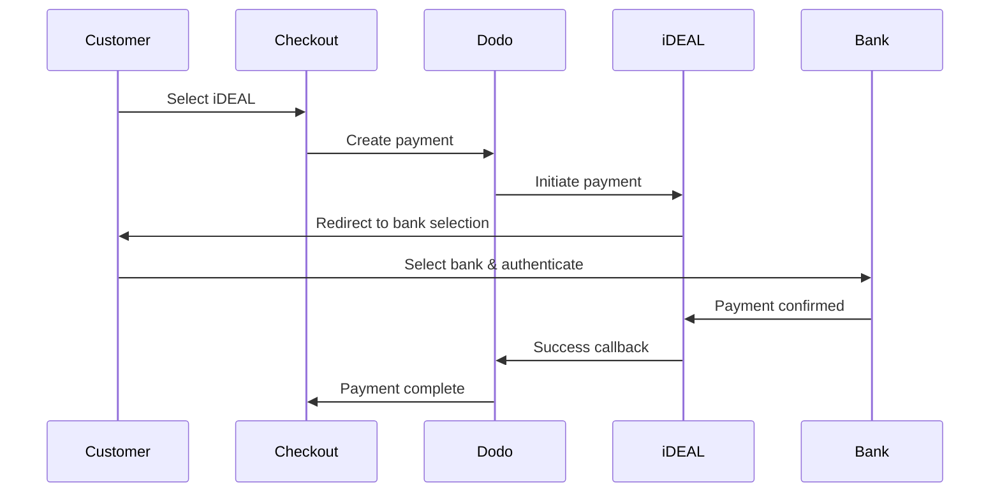
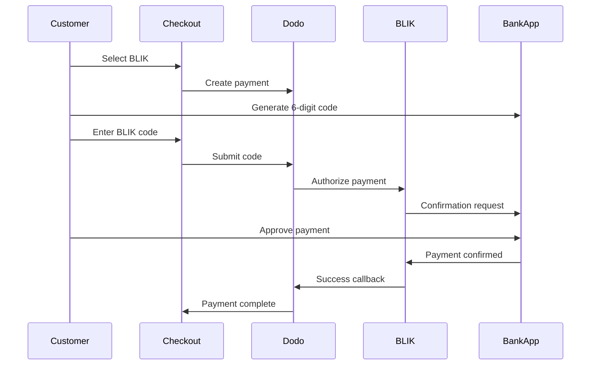
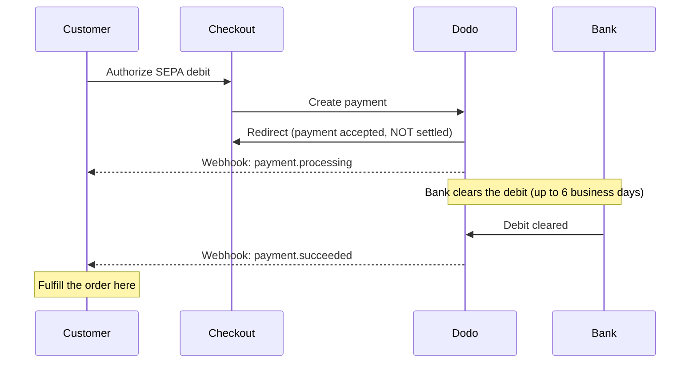

Pelanggan Eropa sangat menyukai metode pembayaran lokal yang terintegrasi dengan sistem perbankan mereka. Menawarkan metode ini dapat meningkatkan rasio konversi sebesar 20-40% di pasar target.

## Mengapa Metode Pembayaran Lokal Eropa?

<CardGroup cols={3}>
<Card title="Higher Conversion" icon="chart-line">
iDEAL menangkap ~60% pembayaran online Belanda. Tidak menawarkan berarti kehilangan pelanggan.
</Card>

<Card title="Lower Fraud" icon="shield-check">
Pembayaran yang diautentikasi bank memiliki tingkat penipuan hampir nol dan tanpa chargeback.
</Card>

<Card title="Real-Time Settlement" icon="bolt">
Sebagian besar metode Eropa memberikan konfirmasi pembayaran instan.
</Card>
</CardGroup>

## Metode yang Didukung

| Metode | Negara | Pangsa Pasar | Mata Uang | Langganan |
| :----- | :------ | :----------- | :------- | :-----------: |
| **iDEAL** | Belanda | ~60% | EUR | Tidak |
| **Bancontact** | Belgia | ~50% | EUR | Tidak |
| **EPS** | Austria | ~30% | EUR | Tidak |
| **Multibanco** | Portugal | ~40% | EUR | Tidak |
| **BLIK** | Polandia | ~60% | PLN | Tidak |
| **SEPA Direct Debit** | Zona Euro | Banyak digunakan | EUR | Tidak |
| **Satispay** | Eropa (Italia) | Berkembang | EUR | Ya |

## iDEAL (Belanda)

iDEAL adalah metode pembayaran daring yang dominan di Belanda, terhubung langsung ke semua bank utama Belanda.

### Cara Kerjanya



### Bank yang Didukung

Semua bank utama Belanda didukung:
- ABN AMRO
- ASN Bank
- Bunq
- ING
- Knab
- Rabobank
- RegioBank
- Revolut
- SNS
- Triodos Bank
- Van Lanschot

### Konfigurasi

```javascript
const session = await client.checkoutSessions.create({
  product_cart: [{ product_id: 'pdt_123', quantity: 1 }],
  allowed_payment_method_types: ['ideal', 'credit', 'debit'],
  billing_currency: 'EUR',
  billing_address: {
    country: 'NL',
    zipcode: '1012JS'
  },
  return_url: 'https://example.com/success'
});
```

## Bancontact (Belgia)

Bancontact adalah skema pembayaran nasional Belgia, digunakan oleh hampir semua bank Belgia untuk pembayaran daring.

### Fitur
- Berfungsi dengan kartu debit Belgia yang ada
- Dukungan aplikasi seluler (Payconiq oleh Bancontact)
- Konfirmasi pembayaran instan
- Tidak perlu pendaftaran tambahan untuk pelanggan

### Konfigurasi

```javascript
const session = await client.checkoutSessions.create({
  product_cart: [{ product_id: 'pdt_123', quantity: 1 }],
  allowed_payment_method_types: ['bancontact_card', 'credit', 'debit'],
  billing_currency: 'EUR',
  billing_address: {
    country: 'BE',
    zipcode: '1000'
  },
  return_url: 'https://example.com/success'
});
```

## EPS (Austria)

EPS (Electronic Payment Standard) memungkinkan transfer bank daring langsung untuk pelanggan Austria.

### Fitur
- Integrasi langsung dengan bank-bank Austria
- Konfirmasi pembayaran waktu nyata
- Tingkat kepercayaan tinggi di antara konsumen Austria
- Tidak ada pengembalian dana

### Bank yang Didukung

Bank-bank besar Austria termasuk:
- Erste Bank
- Bank Austria
- Raiffeisen
- BAWAG
- Volksbank

### Konfigurasi

```javascript
const session = await client.checkoutSessions.create({
  product_cart: [{ product_id: 'pdt_123', quantity: 1 }],
  allowed_payment_method_types: ['eps', 'credit', 'debit'],
  billing_currency: 'EUR',
  billing_address: {
    country: 'AT',
    zipcode: '1010'
  },
  return_url: 'https://example.com/success'
});
```

## Multibanco (Portugal)

Multibanco adalah jaringan antarbank Portugal, menawarkan pembayaran daring dan pembayaran berbasis ATM.

### Opsi Pembayaran

1. **Perbankan Daring** — Transfer bank langsung melalui perbankan internet
2. **Pembayaran ATM** — Pelanggan menerima referensi untuk membayar di mana saja di ATM Multibanco
3. **Perbankan Seluler** — Pembayaran melalui aplikasi seluler bank

### Cara Kerja Pembayaran ATM

Untuk pembayaran ATM, pelanggan menerima referensi pembayaran:

```
Entity: 12345
Reference: 123 456 789
Amount: €50.00
Expiry: 24 hours
```

Pelanggan dapat membayar di mana saja di ATM Portugal atau melalui perbankan daring menggunakan referensi ini.

### Konfigurasi

```javascript
const session = await client.checkoutSessions.create({
  product_cart: [{ product_id: 'pdt_123', quantity: 1 }],
  allowed_payment_method_types: ['multibanco', 'credit', 'debit'],
  billing_currency: 'EUR',
  billing_address: {
    country: 'PT',
    zipcode: '1000-001'
  },
  return_url: 'https://example.com/success'
});
```

<Note>
Pembayaran ATM Multibanco mungkin mengalami keterlambatan antara checkout dan pembayaran aktual. Pantau webhook untuk konfirmasi pembayaran.
</Note>

## BLIK (Polandia)

BLIK adalah metode pembayaran seluler paling populer di Polandia, yang memungkinkan pelanggan membayar menggunakan kode 6 digit sekali pakai yang dibuat di aplikasi perbankan mereka. BLIK diselesaikan dalam **PLN** (Złoty Polandia), bukan EUR.

### Cara Kerjanya



### Ketersediaan

- **Mata uang penagihan:** Hanya PLN
- **Jenis transaksi:** Hanya pembayaran satu kali (tidak tersedia untuk langganan)
- **Cakupan:** Semua bank utama di Polandia yang mendukung BLIK

### Konfigurasi

```javascript
const session = await client.checkoutSessions.create({
  product_cart: [{ product_id: 'pdt_123', quantity: 1 }],
  allowed_payment_method_types: ['blik', 'credit', 'debit'],
  billing_currency: 'PLN',
  billing_address: {
    country: 'PL',
    zipcode: '00-001'
  },
  return_url: 'https://example.com/success'
});
```

<Note>
BLIK memerlukan mata uang penagihan **PLN**. Jika Anda menetapkan harga dalam EUR, aktifkan [Adaptive Currency](/features/adaptive-currency) agar pelanggan Polandia ditagih dalam PLN dan BLIK tersedia.
</Note>

## SEPA Direct Debit (Zona Euro)

SEPA Direct Debit memungkinkan pelanggan di seluruh Zona Euro membayar langsung dari rekening bank mereka, bukan menggunakan kartu. Metode ini ditawarkan pada checkout EUR untuk pembayaran satu kali.

<Warning>
**SEPA Direct Debit tidak instan — pembayaran memerlukan waktu hingga 6 hari kerja untuk dikonfirmasi.** Tidak seperti metode lainnya di halaman ini, pelanggan yang mengotorisasi debit saat checkout **tidak** berarti dana telah berhasil dicairkan. Jangan pernah memenuhi pesanan berdasarkan pengalihan checkout atau `payment.processing`; tunggu webhook `payment.succeeded`.
</Warning>

### Cara Kerjanya

Pelanggan mengotorisasi debit selama checkout, lalu Dodo Payments menarik dana dari rekening bank mereka. Karena bank menyelesaikan debit secara asinkron, pembayaran akan berada dalam status `processing` sebelum mencapai hasil akhir:



### Linimasa Pembayaran

| Tahap | Kapan | Status pembayaran | Artinya |
| :---- | :--- | :------------- | :------------ |
| **Otorisasi** | Saat checkout | `processing` | Pelanggan menyetujui debit dan dialihkan kembali. Dana **belum** berpindah — jangan memenuhi pesanan. |
| **Konfirmasi** | Hingga **6 hari kerja** kemudian | `succeeded` | Bank telah menyelesaikan debit. Penuhi pesanan sekarang. |
| **Kegagalan** | Hingga **6 hari kerja** kemudian | `failed` | Debit tidak dapat ditagih (misalnya, dana tidak mencukupi). Jangan memenuhi pesanan; beri tahu pelanggan. |

Karena konfirmasi diterima beberapa hari setelah pelanggan meninggalkan situs Anda, handler webhook Anda — bukan pengalihan checkout — harus menjadi dasar pemberian akses. Lihat [Menangani Penundaan Konfirmasi](#handling-the-confirmation-delay) di bawah.

### Ketersediaan

- **Mata uang penagihan:** EUR
- **Jenis transaksi:** Hanya pembayaran satu kali (tidak tersedia untuk langganan)

### Konfigurasi

```javascript
const session = await client.checkoutSessions.create({
  product_cart: [{ product_id: 'pdt_123', quantity: 1 }],
  allowed_payment_method_types: ['sepa', 'credit', 'debit'],
  billing_currency: 'EUR',
  billing_address: {
    country: 'DE',
    zipcode: '10115'
  },
  return_url: 'https://example.com/success'
});
```

### IBAN Pengujian SEPA

Dalam mode pengujian, masukkan salah satu IBAN di bawah saat checkout untuk memaksa hasil tertentu.

| IBAN pengujian | Perilaku |
| :-------- | :------- |
| `DE89370400440532013000` | Pembayaran berhasil. |
| `DE08370400440532013003` | Pembayaran berhasil setelah penundaan setidaknya tiga menit. |
| `DE62370400440532013001` | Pembayaran gagal. |
| `DE78370400440532013004` | Pembayaran gagal setelah penundaan setidaknya tiga menit. |
| `DE35370400440532013002` | Pembayaran berhasil, lalu langsung disengketakan. |
| `DE65370400440002222227` | Pembayaran gagal karena dana tidak mencukupi. |
| `DE18370400440000066666` | Rekening bank tidak dapat digunakan, sehingga metode pembayaran tidak dapat dibuat. |

Untuk menguji perilaku khusus negara, gunakan IBAN keberhasilan yang setara untuk negara Zona Euro lainnya:

| Negara | IBAN keberhasilan |
| :------ | :----------- |
| Austria | `AT611904300234573201` |
| Belgia | `BE62510007547061` |
| Estonia | `EE382200221020145685` |
| Finlandia | `FI2112345600000785` |
| Prancis | `FR1420041010050500013M02606` |
| Irlandia | `IE29AIBK93115212345678` |
| Luksemburg | `LU280019400644750000` |

<Note>
IBAN pengujian yang tertunda berguna untuk memastikan bahwa handler webhook Anda — bukan pengalihan checkout — yang memberikan akses, karena pembayaran SEPA dikonfirmasi jauh setelah pelanggan meninggalkan checkout.
</Note>

### Menangani Penundaan Konfirmasi

Karena SEPA diselesaikan hingga 6 hari kerja setelah checkout, Anda tidak dapat mengandalkan pengalihan browser untuk mengetahui apakah pembayaran telah dicairkan. Sebagai gantinya, jalankan proses pemenuhan berdasarkan event webhook. Aktifkan `payload.type` dan tangani setiap tahap:

| Jenis event | Saat dipicu | Tindakan |
| :--------- | :------------ | :--------- |
| `payment.processing` | Pelanggan mengotorisasi debit saat checkout dan dialihkan kembali. | **Jangan memenuhi pesanan.** Tandai pesanan sebagai tertunda dan, jika perlu, beri tahu pelanggan bahwa pembayaran mereka sedang diproses. |
| `payment.succeeded` | Bank telah menyelesaikan debit (hingga 6 hari kerja kemudian). | Penuhi pesanan — berikan akses, lakukan provision produk, dan kirim tanda terima. |
| `payment.failed` | Debit tidak dapat ditagih. | Beri tahu pelanggan dan minta mereka mencoba lagi; jangan memenuhi pesanan. |

```javascript Handling SEPA payment events expandable
app.post('/webhooks/dodo', async (req, res) => {
  const event = req.body;

  switch (event.type) {
    case 'payment.processing': {
      // SEPA debit authorized but NOT settled — this can last up to 6 business days.
      // Record the order as pending; do not grant access yet.
      await markOrderPending(event.data.payment_id);
      break;
    }
    case 'payment.succeeded': {
      // The debit cleared — safe to fulfill now.
      await fulfillOrder(event.data.payment_id);
      break;
    }
    case 'payment.failed': {
      // The debit could not be collected (e.g. insufficient funds).
      await markOrderFailed(event.data.payment_id);
      // Notify the customer and prompt a retry.
      break;
    }
  }

  res.json({ received: true });
});
```

<Tip>
Selalu **penuhi pesanan berdasarkan `payment.succeeded` dari webhook**, bukan berdasarkan pengalihan checkout atau `payment.processing`. Pengalihan dipicu saat pelanggan mengotorisasi debit — beberapa hari sebelum dana benar-benar dicairkan. Verifikasi signature webhook sebelum memprosesnya; lihat [panduan Webhooks](/developer-resources/webhooks) untuk penyiapan, dan [Panduan Event Webhook](/developer-resources/webhooks/intents/webhook-events-guide) untuk daftar event lengkap.
</Tip>

<Warning>
Tetapkan ekspektasi pelanggan saat checkout. Karena akses hanya diberikan setelah debit dicairkan, beri tahu pelanggan SEPA bahwa pesanan mereka sedang diproses dan mereka akan diberi tahu setelah pembayaran dikonfirmasi — jika tidak, mereka mungkin mengharapkan akses instan seperti pada pembayaran kartu.
</Warning>

## Satispay (Eropa)

Satispay adalah jaringan pembayaran seluler Eropa yang populer, terutama di Italia, yang memungkinkan pelanggan membayar langsung dari aplikasi Satispay tanpa membagikan detail kartu atau bank. Satispay menyelesaikan pembayaran dalam **EUR**.

### Fitur

- Pembayaran berbasis aplikasi yang tidak bergantung pada jaringan kartu
- Adopsi yang kuat di seluruh Italia dan terus berkembang di pasar Eropa lainnya
- Mendukung pembayaran satu kali dan langganan

### Ketersediaan

- **Mata uang penagihan:** EUR
- **Jenis transaksi:** Pembayaran satu kali dan langganan

### Konfigurasi

```javascript
const session = await client.checkoutSessions.create({
  product_cart: [{ product_id: 'pdt_123', quantity: 1 }],
  allowed_payment_method_types: ['satispay', 'credit', 'debit'],
  billing_currency: 'EUR',
  billing_address: {
    country: 'IT',
    zipcode: '00100'
  },
  return_url: 'https://example.com/success'
});
```

## Jenis Metode API

| Jenis | Metode | Negara |
| :--- | :----- | :------ |
| `ideal` | iDEAL | Belanda |
| `bancontact_card` | Bancontact | Belgia |
| `eps` | EPS | Austria |
| `multibanco` | Multibanco | Portugal |
| `blik` | BLIK | Polandia |
| `sepa` | SEPA Direct Debit | Zona Euro |
| `satispay` | Satispay | Eropa (Italia) |

## Checkout Eropa Multi-Negara

Untuk bisnis yang melayani beberapa negara Eropa, sertakan semua metode regional:

```javascript
const session = await client.checkoutSessions.create({
  product_cart: [{ product_id: 'pdt_123', quantity: 1 }],
  allowed_payment_method_types: [
    'ideal',           // Netherlands
    'bancontact_card', // Belgium
    'eps',             // Austria
    'multibanco',      // Portugal
    'blik',            // Poland (requires PLN billing currency)
    'sepa',            // Eurozone (one-time payments only)
    'satispay',        // Europe / Italy
    'credit',          // Fallback
    'debit'            // Fallback
  ],
  billing_currency: 'EUR',
  return_url: 'https://example.com/success'
});
```

Dodo secara otomatis hanya menampilkan metode yang relevan berdasarkan lokasi pelanggan. Pelanggan Belanda akan melihat iDEAL; pelanggan Belgia akan melihat Bancontact.

## Pengujian

Metode pembayaran Eropa dapat diuji dalam Test Mode. Alur pengujian menyimulasikan proses autentikasi bank.

<Note>
SEPA Direct Debit diuji dengan cara yang berbeda — alih-alih alur bank yang disimulasikan, Anda memasukkan IBAN pengujian secara langsung. Lihat [IBAN Pengujian SEPA](#sepa-test-ibans).
</Note>

<Steps>
<Step title="Enable test mode">
Gunakan API keys pengujian Dodo Payments Anda.
</Step>

<Step title="Set appropriate billing address">
Atur negara alamat penagihan agar sesuai dengan metode pembayaran:
- `NL` untuk iDEAL
- `BE` untuk Bancontact
- `AT` untuk EPS
- `PT` untuk Multibanco
- `PL` untuk BLIK (dengan mata uang penagihan PLN)
- `IT` untuk Satispay
</Step>

<Step title="Complete the test flow">
Ikuti alur autentikasi bank yang disimulasikan di lingkungan pengujian.
</Step>
</Steps>

## Praktik Terbaik

<AccordionGroup>
<Accordion title="Always include regional methods for target markets">
Jika Anda menjual kepada pelanggan Belanda, sertakan iDEAL. Tidak menyertakannya seperti tidak menerima Visa di AS — Anda akan kehilangan penjualan yang signifikan.
</Accordion>

<Accordion title="Match currency to region">
Sebagian besar metode pembayaran Eropa memerlukan EUR — pastikan harga Anda mendukung transaksi Euro. Satu-satunya pengecualian adalah BLIK, yang hanya tersedia dalam **PLN** (Złoty Polandia) untuk penagihan.
</Accordion>

<Accordion title="Handle redirects gracefully">
Semua metode Eropa melibatkan pengalihan ke situs bank. Pastikan penanganan return URL Anda andal dan memperhitungkan pengguna yang membatalkan proses di tengah jalan.
</Accordion>

<Accordion title="Provide card fallbacks">
Tidak semua pelanggan Eropa memiliki akses ke metode regional ini (wisatawan, ekspatriat, dan sebagainya). Selalu sertakan `credit` dan `debit` sebagai fallback.
</Accordion>

<Accordion title="Consider Multibanco timing">
Pembayaran ATM Multibanco dapat memerlukan waktu berjam-jam untuk selesai. Jangan menahan pemenuhan pesanan berdasarkan pembayaran instan — gunakan webhook untuk konfirmasi asinkron.
</Accordion>

<Accordion title="Account for the SEPA 6-day delay">
SEPA Direct Debit memerlukan waktu hingga **6 hari kerja** untuk dikonfirmasi. Jangan pernah memenuhi pesanan berdasarkan pengalihan checkout atau `payment.processing` — berikan akses hanya berdasarkan webhook `payment.succeeded`, dan tetapkan ekspektasi saat checkout agar pelanggan mengetahui bahwa pesanan mereka tertunda. Lihat [Menangani Penundaan Konfirmasi](#handling-the-confirmation-delay).
</Accordion>
</AccordionGroup>

## Pemecahan Masalah

<AccordionGroup>
<Accordion title="European method not appearing">
**Periksa:**
1. Apakah negara penagihan pelanggan sesuai dengan negara metode tersebut?
2. Apakah mata uang diatur ke EUR?
3. Apakah metode tersebut disertakan dalam `allowed_payment_method_types`?

**Solusi:** Metode Eropa bersifat khusus regional. Pelanggan dengan negara penagihan `DE` (Jerman) tidak akan melihat iDEAL, yang hanya tersedia di Belanda.
</Accordion>

<Accordion title="Bank authentication failed">
**Penyebab:**
- Pelanggan membatalkan proses selama autentikasi bank
- Sistem autentikasi bank sementara tidak tersedia
- Pelanggan memasukkan kredensial yang salah

**Solusi:** Pelanggan harus mencoba lagi. Jika masalah terus terjadi, sarankan untuk mencoba metode pembayaran lain.
</Accordion>

<Accordion title="Redirect not completing">
**Penyebab:**
- Pelanggan menutup browser selama pengalihan bank
- Masalah jaringan selama autentikasi
- Return URL salah dikonfigurasi

**Solusi:** Pastikan return URL sudah benar dan dapat diakses. Pastikan URL tersebut menangani status berhasil dan gagal.
</Accordion>

<Accordion title="Multibanco payment pending">
**Penyebab:** Pelanggan menerima referensi pembayaran tetapi belum membayar.

**Solusi:** Hal ini wajar untuk pembayaran berbasis ATM. Tunggu konfirmasi webhook. Referensi biasanya kedaluwarsa dalam 24–72 jam.
</Accordion>

<Accordion title="SEPA payment stuck in processing">
**Penyebab:** SEPA Direct Debit diselesaikan secara asinkron melalui bank pelanggan.

**Solusi:** Hal ini wajar. Status `payment.processing` dapat berlangsung hingga **6 hari kerja** sebelum debit dicairkan. Tunggu webhook terminal `payment.succeeded` (penuhi pesanan) atau `payment.failed` (jangan penuhi pesanan) — jangan menganggap pengalihan checkout sebagai konfirmasi. Lihat [Menangani Penundaan Konfirmasi](#handling-the-confirmation-delay).
</Accordion>
</AccordionGroup>

## Kepatuhan PSD2

Semua metode pembayaran Eropa mematuhi peraturan PSD2 (Payment Services Directive 2):

- **Strong Customer Authentication (SCA)** — Terintegrasi dalam alur autentikasi bank
- **Secure Communication** — Semua data dikirim melalui saluran yang aman
- **Consumer Protection** — Kepatuhan penuh terhadap hak konsumen UE

## Halaman Terkait

<CardGroup cols={2}>
<Card title="Payment Methods Overview" icon="credit-card" href="/features/payment-methods">
Lihat semua metode pembayaran yang didukung.
</Card>

<Card title="Adaptive Currency" icon="globe" href="/features/adaptive-currency">
Dukungan mata uang dan konversi otomatis.
</Card>

<Card title="Checkout Guide" icon="book" href="/developer-resources/checkout-session">
Panduan lengkap implementasi checkout.
</Card>

<Card title="Webhooks" icon="webhook" href="/developer-resources/webhooks">
Tangani konfirmasi pembayaran secara asinkron.
</Card>
</CardGroup>