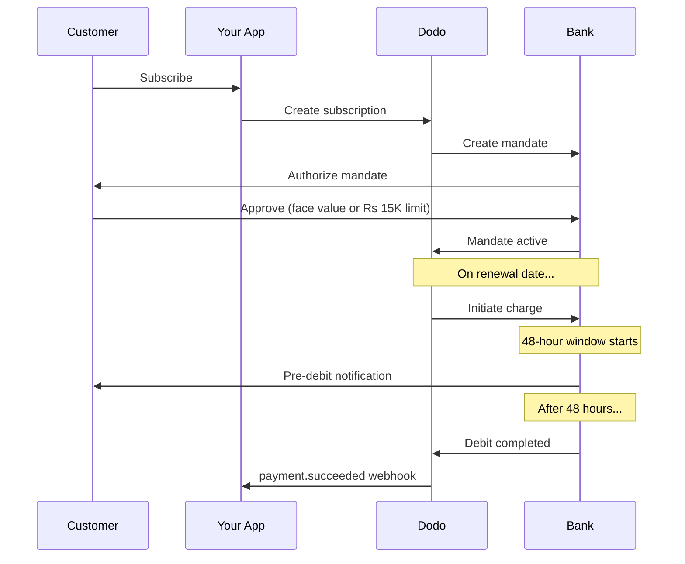

India memiliki infrastruktur pembayaran unik yang didominasi oleh UPI (lebih dari 60% transaksi digital) dan kartu yang diterbitkan di India (Visa, Mastercard, Rupay, dll.). Dodo Payments mendukung semuanya dengan kepatuhan penuh terhadap RBI untuk mandate subscription.

## Mengapa Metode Pembayaran India Penting

<CardGroup cols={3}>
<Card title="UPI Dominance" icon="mobile">
UPI memproses lebih dari 10 miliar transaksi per bulan. Banyak pelanggan India tidak memiliki kartu internasional.
</Card>

<Card title="Low Transaction Costs" icon="indian-rupee-sign">
UPI memiliki biaya transaksi yang hampir nol. Sangat baik untuk transaksi bervolume tinggi dengan nilai lebih rendah.
</Card>

<Card title="Subscription Support" icon="repeat">
Tidak seperti kebanyakan metode pembayaran alternatif, UPI dan semua kartu yang diterbitkan di India (Visa, Mastercard, Rupay, dll.) mendukung pembayaran berulang melalui mandate RBI.
</Card>
</CardGroup>

## Metode yang Didukung

| Metode | Tipe | Subscription | Jumlah Min. |
| :----- | :--- | :-----------: | :--------- |
| **UPI Collect** | Kode QR / VPA | Ya* | ₹1 |
| **Rupay Credit** | Kartu | Ya* | ₹1 |
| **Rupay Debit** | Kartu | Ya* | ₹1 |

*Subscription memerlukan mandate yang sesuai RBI dengan aturan pemrosesan khusus. Penundaan pemrosesan 48 jam berlaku untuk semua kartu yang diterbitkan di India dan UPI.

## Konfigurasi

### Tipe API Method

| Tipe | Deskripsi |
| :--- | :---------- |
| `upi_collect` | UPI melalui kode QR atau entri VPA |
| `credit` | Kartu kredit termasuk Rupay |
| `debit` | Kartu debit termasuk Rupay |

### Contoh: Checkout yang Berfokus pada India

```javascript
const session = await client.checkoutSessions.create({
  product_cart: [{ product_id: 'prod_123', quantity: 1 }],
  allowed_payment_method_types: [
    'upi_collect',
    'credit',
    'debit'
  ],
  billing_currency: 'INR',
  customer: {
    email: 'customer@example.in',
    name: 'Priya Sharma',
    phone_number: '+919876543210'
  },
  billing_address: {
    country: 'IN',
    zipcode: '560001'
  },
  return_url: 'https://example.com/success'
});
```

### Persyaratan untuk UPI

Agar UPI muncul saat checkout:
1. **Negara penagihan** harus India (`IN`)
2. **Mata uang** harus INR
3. Untuk merchant non-India: **Adaptive Currency** harus diaktifkan

<Warning>
Jika Anda adalah merchant non-India dan Adaptive Currency tidak diaktifkan, UPI tidak akan tersedia bagi pelanggan Anda.
</Warning>

## Subscription dengan Mandate RBI

Subscription metode pembayaran India beroperasi berdasarkan peraturan RBI (Reserve Bank of India) dengan persyaratan khusus.

### Cara Kerja Mandate RBI



### Tipe Mandate

| Jumlah Subscription | Tipe Mandate | Batas |
| :------------------ | :----------- | :---- |
| **Di bawah batas minimum mandate** | Mandate on-demand | Batas minimum mandate (default ₹15.000) |
| **Pada atau di atas batas minimum mandate** | Mandate dengan jumlah tetap | Jumlah subscription yang tepat |

Jumlah yang didaftarkan pada bank pelanggan adalah `max(mandate_floor, billing_amount)`. Jadi, batas minimum tersebut pada dasarnya adalah **batas otorisasi** yang dilihat pelanggan ketika penagihan lebih rendah daripada batas minimum.

**Penting untuk perubahan paket:** Jika upgrade menghasilkan tagihan yang melebihi batas mandate yang ada, tagihan akan gagal dan pelanggan harus melakukan otorisasi ulang.

### Batas Minimum Mandate yang Dapat Dikonfigurasi

Batas minimum mandate untuk e-mandate INR dapat dikonfigurasi melalui field `mandate_min_amount_inr_paise` (dalam **paise INR** — 1 INR = 100 paise). Anda dapat mengganti default sistem sebesar ₹15.000 pada tiga level:

| Level | Tempat pengaturan | Cakupan |
|-------|--------------|-------|
| **Per request** | `mandate_min_amount_inr_paise` pada checkout session, payment, atau subscription | Satu transaksi |
| **Merchant** | Pengaturan bisnis | Semua subscription INR Anda |
| **Sistem** | — | Default ₹15.000 |

Prioritas resolusi: penggantian per request → pengaturan merchant → default sistem.

```typescript
// Per-checkout override
const session = await client.checkoutSessions.create({
  product_cart: [{ product_id: 'prod_inr_monthly', quantity: 1 }],
  mandate_min_amount_inr_paise: 2_000_000, // ₹20,000 ceiling
  return_url: 'https://yoursite.com/return'
});

// Per-subscription override
const subscription = await client.subscriptions.create({
  product_id: 'prod_inr_monthly',
  customer: { email: 'customer@example.in' },
  billing: { country: 'IN', /* ... */ },
  mandate_min_amount_inr_paise: 2_000_000
});
```

| Field | Tipe | Validasi | Berlaku untuk |
|-------|------|------------|------------|
| `mandate_min_amount_inr_paise` | `integer` (paise INR) | `>= 1` | Subscription INR dengan kartu India pada connector non-Airwallex |

<Info>
Menetapkan batas minimum yang lebih tinggi memungkinkan Anda mendukung tagihan satu kali yang lebih besar di kemudian hari (misalnya upgrade paket atau kelebihan penggunaan berbasis pemakaian) tanpa memaksa pelanggan melakukan otorisasi ulang. Menetapkan batas minimum yang lebih rendah membuat otorisasi pelanggan lebih mendekati jumlah penagihan sebenarnya, tetapi membatasi ruang untuk tagihan variabel di masa mendatang.
</Info>

<Warning>
Pengaturan ini hanya memengaruhi e-mandate yang didaftarkan untuk kartu yang diterbitkan di India (Visa, Mastercard, RuPay) pada subscription INR. Subscription UPI mengikuti alur AutoPay-nya sendiri dan tidak terpengaruh.
</Warning>

### Penundaan Pemrosesan 48 Jam

Ini adalah perbedaan paling penting dibandingkan payment kartu internasional:

<Steps>
<Step title="Charge Initiated (Day 0)">
Pada tanggal renewal yang dijadwalkan, Dodo memulai tagihan dengan bank.
</Step>

<Step title="Pre-Debit Notification">
Pelanggan menerima notifikasi dari bank mereka tentang debit yang akan datang.
</Step>

<Step title="48-Hour Window">
Pelanggan dapat membatalkan mandate selama periode ini melalui aplikasi perbankan mereka.
</Step>

<Step title="Debit Completed (~48-51 hours)">
Setelah 48 jam (ditambah hingga 3 jam tambahan untuk pemrosesan bank), dana didebit.
</Step>

<Step title="Webhook Sent">
Webhook `payment.succeeded` dikirim setelah debit aktual, bukan saat inisiasi.
</Step>
</Steps>

<Warning>
**Jangan berikan manfaat saat inisiasi tagihan.** Tunggu webhook `payment.succeeded`, yang tiba sekitar 48–51 jam setelah tanggal tagihan yang dijadwalkan.
</Warning>

### Menangani Jendela 48 Jam

```javascript
// DON'T do this:
async function handleSubscriptionRenewal(subscription) {
  // ❌ Bad: Granting access immediately when charge is initiated
  grantPremiumAccess(subscription.customer_id);
}

// DO this:
async function handlePaymentWebhook(event) {
  if (event.type === 'payment.succeeded') {
    // ✅ Good: Only grant access after payment is confirmed
    grantPremiumAccess(event.data.customer_id);
  }
  
  if (event.type === 'payment.failed') {
    // Handle failed payment (mandate cancelled, insufficient funds)
    revokePremiumAccess(event.data.customer_id);
  }
}
```

### Event Webhook untuk Subscription India

| Event | Kapan | Tindakan |
| :---- | :--- | :----- |
| `subscription.active` | Mandate diotorisasi | Catat awal subscription |
| `payment.succeeded` | ~48 jam setelah tanggal tagihan | Berikan/lanjutkan akses |
| `payment.failed` | Debit gagal | Beri tahu pelanggan, jeda akses |
| `subscription.on_hold` | Payment gagal | Minta pelanggan memperbarui payment method |
| `subscription.active` | Diaktifkan kembali setelah payment | Pulihkan akses |

## Pengujian

### ID Pengujian UPI

| Status | ID UPI |
| :----- | :----- |
| Berhasil | `success@upi` |
| Gagal | `failure@upi` |

### Nomor Pengujian Kartu India

| Brand | Skenario | Nomor Kartu | Kedaluwarsa | CVV |
| :---- | :------- | :---------- | :----- | :-- |
| Visa | Berhasil | `4576238912771450` | 06/32 | 123 |
| Visa | Ditolak | `4706131211212123` | 06/32 | 123 |
| Mastercard | Berhasil | `5409162669381034` | 06/32 | 123 |
| Mastercard | Ditolak | `5105105105105100` | 06/32 | 123 |

## Praktik Terbaik

<AccordionGroup>
<Accordion title="Plan for the 48-hour delay">
Bangun aplikasi Anda untuk menangani jeda antara inisiasi tagihan dan payment aktual. Pertimbangkan:
- Masa tenggang untuk akses subscription
- Komunikasi yang jelas kepada pelanggan tentang waktu pemrosesan
- Pemenuhan yang digerakkan webhook, bukan berdasarkan tanggal
</Accordion>

<Accordion title="Handle mandate cancellations">
Pelanggan dapat membatalkan mandate melalui aplikasi bank mereka kapan saja. Pantau webhook `subscription.on_hold` dan minta pelanggan untuk berlangganan kembali atau memperbarui payment method.
</Accordion>

<Accordion title="Set appropriate mandate amounts">
Untuk harga variabel (misalnya berbasis pemakaian), pertimbangkan apakah mandate on-demand sebesar Rs 15.000 sudah mencukupi. Jika tagihan dapat melebihi jumlah ini, pelanggan harus melakukan otorisasi ulang.
</Accordion>

<Accordion title="Offer UPI prominently">
Untuk pelanggan India, UPI sebaiknya menjadi opsi payment utama. Banyak pengguna lebih memilihnya daripada kartu karena sudah familiar dan lebih praktis.
</Accordion>
</AccordionGroup>

## Pemecahan Masalah

<AccordionGroup>
<Accordion title="UPI not appearing at checkout">
**Periksa:**
1. Apakah negara penagihan diatur ke `IN`?
2. Apakah mata uang diatur ke `INR`?
3. Jika merchant non-India: apakah Adaptive Currency diaktifkan?
4. Apakah `upi_collect` disertakan dalam `allowed_payment_method_types`?

**Solusi:** Pastikan alamat penagihan memiliki `country: "IN"` dan `billing_currency: "INR"`.
</Accordion>

<Accordion title="Subscription charge failed after upgrade">
**Penyebab:** Jumlah tagihan baru melebihi batas mandate yang ada (ambang Rs 15.000).

**Solusi:** Pelanggan harus memperbarui payment method untuk membuat mandate baru dengan batas yang tepat.
</Accordion>

<Accordion title="Subscription on hold but customer claims they didn't cancel">
**Penyebab:** Pelanggan mungkin telah membatalkan mandate selama jendela 48 jam, atau bank mereka menolak debit.

**Solusi:** Pelanggan perlu melakukan otorisasi ulang mandate atau memperbarui payment method mereka.
</Accordion>

<Accordion title="Payment deduction delayed beyond 48 hours">
**Penyebab:** Penundaan API bank dapat memperpanjang pemrosesan selama 2–3 jam tambahan.

**Solusi:** Ini adalah hal yang diharapkan. Bangun sistem Anda untuk menangani penundaan yang bervariasi hingga total sekitar 51 jam.
</Accordion>

<Accordion title="Mandate cancelled but subscription still active">
**Penyebab:** Kasus khusus dalam peraturan RBI — pembatalan mandate selama jendela pemrosesan tidak langsung membatalkan subscription.

**Solusi:** Tagihan berikutnya akan gagal dan subscription akan berpindah ke `on_hold`. Pantau webhook untuk `payment.failed`.
</Accordion>
</AccordionGroup>

## Halaman Terkait

<CardGroup cols={2}>
<Card title="Payment Methods Overview" icon="credit-card" href="/features/payment-methods">
Lihat semua metode pembayaran yang didukung.
</Card>

<Card title="Subscriptions" icon="repeat" href="/features/subscription">
Dokumentasi subscription lengkap termasuk mandate RBI.
</Card>

<Card title="Webhooks" icon="webhook" href="/developer-resources/webhooks">
Penanganan webhook untuk event payment.
</Card>

<Card title="Testing Process" icon="flask" href="/miscellaneous/testing-process">
Semua data pengujian termasuk ID UPI dan kartu India.
</Card>
</CardGroup>