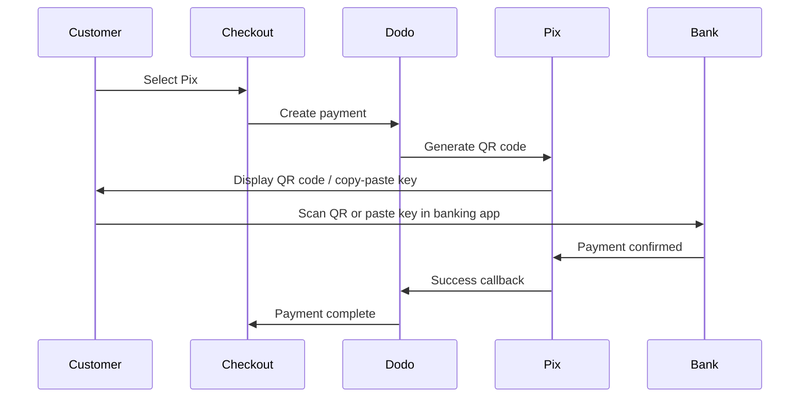

Pix adalah sistem pembayaran instan Brasil yang dibuat oleh Bank Sentral Brasil (Banco Central do Brasil). Ini memungkinkan transfer real-time 24/7, termasuk akhir pekan dan hari libur, dan telah menjadi metode pembayaran paling populer di Brasil.

## Mengapa Menawarkan Pix?

<CardGroup cols={3}>
<Card title="Dominant in Brazil" icon="chart-line">
Pix adalah metode pembayaran yang paling banyak digunakan di Brasil, melampaui kartu kredit dan boleto.
</Card>

<Card title="Instant Settlement" icon="bolt">
Pembayaran dikonfirmasi dalam hitungan detik, 24/7/365 — tidak perlu menunggu jendela pemrosesan bank.
</Card>

<Card title="Low Friction" icon="mobile">
Pelanggan membayar melalui kode QR atau salin-tempel kunci — tidak perlu nomor kartu atau detail bank.
</Card>
</CardGroup>

## Ikhtisar

| Detail | Nilai |
| :----- | :---- |
| **Mata Uang Tagihan** | BRL |
| **Negara yang Didukung** | Brazil |
| **Langganan** | Tidak |
| **Jumlah Minimum** | $0.50 |
| **Penyelesaian** | Instan |

## Cara Kerjanya



## Pengalaman Pelanggan

1. Pelanggan memilih Pix saat checkout
2. Kode QR dan kunci salin-tempel ditampilkan
3. Pelanggan membuka aplikasi perbankan mereka dan memindai kode QR atau menempelkan kunci
4. Pembayaran dikonfirmasi seketika
5. Pelanggan diarahkan ke halaman sukses

<Info>
Kode QR Pix biasanya kedaluwarsa setelah waktu tertentu. Jika pelanggan tidak menyelesaikan pembayaran tepat waktu, mereka perlu memulai ulang checkout.
</Info>

## Konfigurasi

```javascript
const session = await client.checkoutSessions.create({
  product_cart: [{ product_id: 'prod_123', quantity: 1 }],
  allowed_payment_method_types: ['pix', 'credit', 'debit'],
  billing_currency: 'BRL',
  return_url: 'https://example.com/success'
});
```

## Jenis Metode API

| Jenis | Metode | Negara |
| :--- | :----- | :------ |
| `pix` | Pix | Brazil |

## Pengujian

<Steps>
<Step title="Enable test mode">
Gunakan kunci API pengujian Dodo Payments Anda.
</Step>

<Step title="Set billing currency to BRL">
Pastikan mata uang tagihan diatur ke `BRL` dalam permintaan checkout Anda.
</Step>

<Step title="Enter test CPF and scan the QR code">
Saat diminta untuk CPF Pix, masukkan `1234567890`. Kode QR uji akan dihasilkan — pindai dengan kamera ponsel normal Anda (tidak perlu aplikasi Pix). Anda akan diarahkan ke halaman uji Stripe di mana Anda dapat mensimulasikan transaksi sebagai keberhasilan atau kegagalan.
</Step>
</Steps>

## Praktik Terbaik

<AccordionGroup>
<Accordion title="Set billing currency to BRL">
Pix hanya bekerja dengan BRL. Pastikan harga Anda mendukung transaksi Real Brasil untuk pasar Brasil.
</Accordion>

<Accordion title="Provide card fallbacks">
Tidak semua pelanggan Brasil mungkin lebih suka Pix. Selalu sertakan `credit` dan `debit` sebagai opsi cadangan.
</Accordion>

<Accordion title="Handle QR code expiration">
Kode QR Pix kedaluwarsa setelah waktu tertentu. Pastikan checkout Anda menangani kedaluwarsa dengan baik dan memungkinkan pelanggan untuk membuat ulang kode.
</Accordion>
</AccordionGroup>

## Pemecahan Masalah

<AccordionGroup>
<Accordion title="Pix not appearing at checkout">
**Periksa:**
1. Mata uang tagihan diatur ke `BRL`?
2. `pix` termasuk di `allowed_payment_method_types`?
3. Negara penagihan pelanggan adalah Brasil?

**Solusi:** Pix hanya tersedia untuk transaksi BRL. Verifikasi mata uang dan alamat penagihan dalam permintaan API Anda.
</Accordion>

<Accordion title="QR code expired">
**Penyebab:** Pelanggan tidak menyelesaikan pembayaran dalam jangka waktu kedaluwarsa.

**Solusi:** Pelanggan perlu memulai ulang checkout untuk membuat kode QR baru.
</Accordion>

<Accordion title="Payment pending">
**Penyebab:** Pembayaran Pix biasanya dikonfirmasi seketika, tetapi sesekali terjadi penundaan dari pihak bank.

**Solusi:** Pantau webhooks untuk konfirmasi pembayaran. Jika pembayaran tidak terkonfirmasi dalam beberapa menit, anggap sebagai gagal.
</Accordion>
</AccordionGroup>

## Halaman Terkait

<CardGroup cols={2}>
<Card title="Payment Methods Overview" icon="credit-card" href="/features/payment-methods">
Lihat semua metode pembayaran yang didukung.
</Card>

<Card title="Adaptive Currency" icon="globe" href="/features/adaptive-currency">
Dukungan mata uang dan konversi otomatis.
</Card>

<Card title="Checkout Guide" icon="book" href="/developer-resources/checkout-session">
Panduan lengkap implementasi checkout.
</Card>

<Card title="Webhooks" icon="webhook" href="/developer-resources/webhooks">
Tangani konfirmasi pembayaran secara asinkron.
</Card>
</CardGroup>
