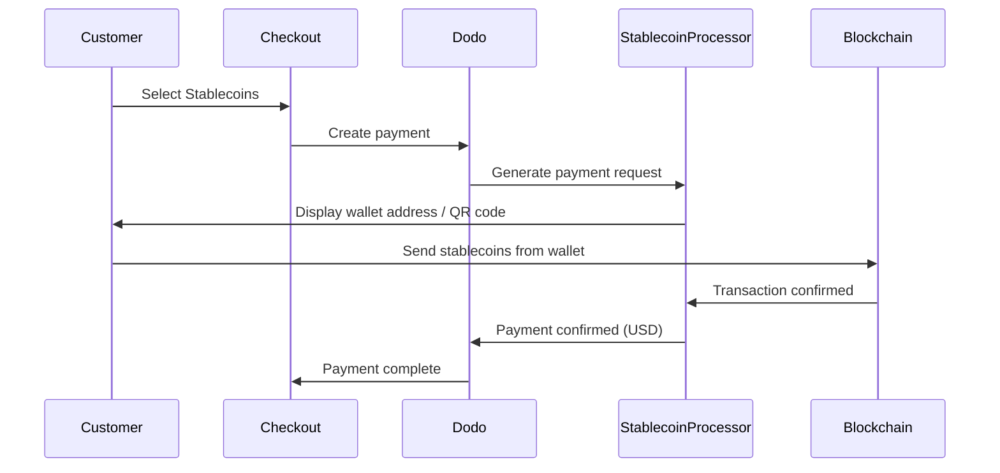

Pembayaran stablecoin memungkinkan pelanggan untuk membayar menggunakan stablecoin dari mana saja di dunia (kecuali India). Transaksi ditagih dalam USD, sehingga Anda menerima mata uang fiat sementara pelanggan membayar dengan dompet stablecoin pilihan mereka.

## Mengapa Menawarkan Stablecoins?

<CardGroup cols={3}>
<Card title="Global Reach" icon="globe">
Terima pembayaran dari negara mana saja — tidak memerlukan infrastruktur perbankan di sisi pelanggan.
</Card>

<Card title="No Chargebacks" icon="shield-check">
Transaksi stablecoin tidak dapat dibatalkan, menghilangkan seluruh penipuan chargeback.
</Card>

<Card title="USD Settlement" icon="dollar-sign">
Anda menerima USD — tidak perlu mengelola volatilitas atau dompet.
</Card>
</CardGroup>

## Gambaran Umum

| Detail | Nilai |
| :----- | :---- |
| **Mata Uang Penagihan** | USD |
| **Negara yang Didukung** | Global (Kecuali IN) |
| **Langganan** | Tidak |
| **Jumlah Minimum** | $0.50 |
| **Penyelesaian** | USD |

## Cara Kerjanya



## Pengalaman Pelanggan

1. Pelanggan memilih Stablecoins saat checkout
2. Alamat dompet dan kode QR ditampilkan dengan jumlah dalam stablecoin
3. Pelanggan mengirimkan jumlah tepat dari dompet stablecoin mereka
4. Transaksi dikonfirmasi di blockchain
5. Pelanggan diarahkan ke halaman sukses

<Info>
Pembayaran stablecoin ditagih dalam USD. Jumlah stablecoin yang ditampilkan saat checkout mencerminkan kurs real-time pada saat pembayaran.
</Info>

## Mata Uang & Jaringan yang Didukung

| Mata Uang | Jaringan |
| :------- | :------- |
| **USDC** | Ethereum, Solana, Polygon, Base |
| **USDP** | Ethereum, Solana |
| **USDG** | Ethereum |

## Konfigurasi

```javascript
const session = await client.checkoutSessions.create({
  product_cart: [{ product_id: 'prod_123', quantity: 1 }],
  allowed_payment_method_types: ['crypto', 'credit', 'debit'],
  return_url: 'https://example.com/success'
});
```

## Tipe Metode API

| Tipe | Metode | Negara |
| :--- | :----- | :------ |
| `crypto` | Stablecoins | Global (Kecuali IN) |

## Pengujian

<Steps>
<Step title="Enable test mode">
Gunakan kunci API uji Dodo Payments Anda.
</Step>

<Step title="Create a test checkout">
Buat sesi checkout dengan `crypto` dalam metode pembayaran yang diizinkan.
</Step>

<Step title="Complete the test flow">
Ikuti alur pembayaran stablecoin yang disimulasikan di lingkungan uji.
</Step>
</Steps>

## Praktik Terbaik

<AccordionGroup>
<Accordion title="Always include card fallbacks">
Tidak semua pelanggan memiliki dompet stablecoin. Selalu sertakan `credit` dan `debit` sebagai metode pembayaran cadangan.
</Accordion>

<Accordion title="Set clear expectations on confirmation time">
Konfirmasi blockchain dapat memakan waktu beberapa menit tergantung pada jaringan. Pastikan checkout Anda mengkomunikasikan ini kepada pelanggan.
</Accordion>

<Accordion title="Handle underpayments and overpayments">
Pembayaran stablecoin terkadang dapat berbeda sedikit dari jumlah yang tepat karena biaya jaringan. Pantau webhooks untuk pembaruan status pembayaran.
</Accordion>
</AccordionGroup>

## Pemecahan Masalah

<AccordionGroup>
<Accordion title="Stablecoins not appearing at checkout">
**Periksa:**
1. `crypto` termasuk dalam `allowed_payment_method_types`?
2. Jumlah transaksi memenuhi minimum ($0.50)?

**Solusi:** Verifikasi tipe metode pembayaran yang dilewatkan dengan benar dalam permintaan API Anda.
</Accordion>

<Accordion title="Payment not confirming">
**Penyebab:** Waktu konfirmasi blockchain bervariasi. Beberapa jaringan memerlukan waktu lebih lama daripada yang lain.

**Solusi:** Tunggu konfirmasi webhook. Jangan anggap pembayaran gagal sampai jendela konfirmasi berlalu.
</Accordion>

<Accordion title="Amount mismatch">
**Penyebab:** Biaya jaringan dapat menyebabkan jumlah yang diterima sedikit berbeda dari jumlah yang diminta.

**Solusi:** Pantau webhooks untuk jumlah akhir yang dikonfirmasi. Perbedaan kecil ditangani secara otomatis.
</Accordion>
</AccordionGroup>

## Halaman Terkait

<CardGroup cols={2}>
<Card title="Payment Methods Overview" icon="credit-card" href="/features/payment-methods">
Lihat semua metode pembayaran yang didukung.
</Card>

<Card title="Checkout Guide" icon="book" href="/developer-resources/checkout-session">
Panduan implementasi checkout lengkap.
</Card>

<Card title="Webhooks" icon="webhook" href="/developer-resources/webhooks">
Tangani konfirmasi pembayaran secara asinkron.
</Card>

<Card title="Testing Process" icon="flask" href="/miscellaneous/testing-process">
Panduan pengujian lengkap untuk semua metode pembayaran.
</Card>
</CardGroup>
