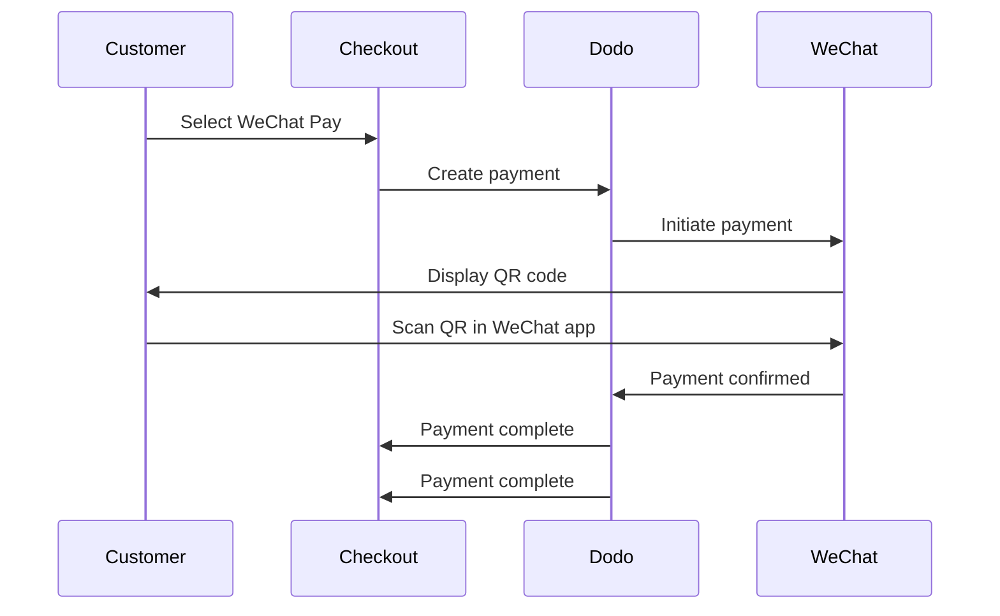

WeChat Pay adalah salah satu dari dua platform pembayaran seluler terbesar di China, digunakan oleh lebih dari satu miliar orang. Ini memungkinkan pembayaran melalui kode QR dalam aplikasi WeChat, membuatnya penting bagi bisnis yang menargetkan konsumen Tiongkok.

## Mengapa Menawarkan WeChat Pay?

<CardGroup cols={3}>
<Card title="1B+ Users" icon="users">
WeChat Pay digunakan oleh lebih dari satu miliar orang, menjadikannya salah satu platform pembayaran terbesar di dunia.
</Card>

<Card title="Mobile-First" icon="mobile">
Pembayaran diselesaikan sepenuhnya dalam aplikasi WeChat — cepat, akrab, dan tanpa hambatan bagi pelanggan Tiongkok.
</Card>

<Card title="Dual Currency" icon="money-bill-transfer">
Terima pembayaran dalam USD dan CNY, memberikan fleksibilitas untuk transaksi lintas batas dan domestik.
</Card>
</CardGroup>

## Ikhtisar

| Detail | Nilai |
| :----- | :---- |
| **Mata Uang Penagihan** | USD, CNY |
| **Langganan** | Tidak |
| **Jumlah Minimum** | $0.50 / ¥1.00 |
| **Penyelesaian** | USD |

## Cara Kerjanya



## Pengalaman Pelanggan

1. Pelanggan memilih WeChat Pay saat checkout
2. Kode QR ditampilkan di halaman checkout
3. Pelanggan membuka WeChat di ponsel mereka dan memindai kode QR
4. Pelanggan mengonfirmasi pembayaran dalam aplikasi WeChat
5. Pembayaran terkonfirmasi secara instan dan pelanggan diarahkan ke halaman sukses

<Info>
Pelanggan membayar dalam USD atau CNY, dan Anda menerima penyelesaian dalam USD.
</Info>

## Konfigurasi

```javascript
const session = await client.checkoutSessions.create({
  product_cart: [{ product_id: 'pdt_123', quantity: 1 }],
  allowed_payment_method_types: ['we_chat_pay', 'credit', 'debit'],
  return_url: 'https://example.com/success'
});
```

## Jenis Metode API

| Tipe | Metode | Mata Uang |
| :--- | :----- | :--------- |
| `we_chat_pay` | WeChat Pay | USD, CNY |

## Pengujian

<Steps>
<Step title="Enable test mode">
Gunakan kunci API uji Dodo Payments Anda.
</Step>

<Step title="Create a test checkout">
Buat sesi checkout dengan `we_chat_pay` dalam metode pembayaran yang diperbolehkan.
</Step>

<Step title="Scan the QR code">
Kode QR uji akan dihasilkan — pindai dengan kamera ponsel normal Anda (tidak perlu aplikasi WeChat). Anda akan diarahkan ke halaman uji di mana Anda dapat mensimulasikan transaksi sebagai sukses atau gagal.
</Step>
</Steps>

## Praktik Terbaik

<AccordionGroup>
<Accordion title="Target Chinese customers">
WeChat Pay terutama digunakan oleh konsumen Tiongkok. Sertakan saat basis pelanggan Anda mencakup pembeli Tiongkok atau Anda menargetkan pasar Tiongkok.
</Accordion>

<Accordion title="Always include card fallbacks">
Tidak semua pelanggan memiliki WeChat. Selalu sertakan `credit` dan `debit` sebagai metode pembayaran cadangan.
</Accordion>

<Accordion title="Optimize for mobile">
Banyak pengguna WeChat Pay menjelajah di ponsel. Pastikan halaman checkout Anda responsif — pemindaian kode QR bekerja paling baik ketika checkout ditampilkan pada desktop atau tablet sementara pelanggan memindai dengan ponsel mereka.
</Accordion>

<Accordion title="Consider both currencies">
WeChat Pay mendukung USD dan CNY. Pilih mata uang penagihan yang paling sesuai dengan pasar target Anda — USD untuk lintas batas, CNY untuk transaksi domestik Tiongkok.
</Accordion>
</AccordionGroup>

## Pemecahan Masalah

<AccordionGroup>
<Accordion title="WeChat Pay not appearing at checkout">
**Periksa:**
1. `we_chat_pay` termasuk dalam `allowed_payment_method_types`?
2. Mata uang penagihan diatur ke USD atau CNY?
3. Jumlah transaksi memenuhi minimum?

**Solusi:** Verifikasi tipe metode pembayaran dan mata uang telah diteruskan dengan benar dalam permintaan API Anda.
</Accordion>

<Accordion title="QR code not scanning">
**Penyebab:** Kode QR mungkin sudah kedaluwarsa, atau versi WeChat pelanggan sudah usang.

**Solusi:** Segarkan halaman checkout untuk menghasilkan kode QR baru. Pastikan pelanggan menggunakan versi WeChat yang terkini.
</Accordion>

<Accordion title="Payment not confirming">
**Penyebab:** WeChat Pay biasanya mengonfirmasi secara instan, tetapi penundaan jaringan dapat terjadi.

**Solusi:** Pantau webhook untuk konfirmasi pembayaran. Jika pembayaran tidak mengonfirmasi dalam beberapa menit, pelanggan mungkin perlu mencoba lagi.
</Accordion>
</AccordionGroup>

## Halaman Terkait

<CardGroup cols={2}>
<Card title="Payment Methods Overview" icon="credit-card" href="/features/payment-methods">
Lihat semua metode pembayaran yang didukung.
</Card>

<Card title="Checkout Guide" icon="book" href="/developer-resources/checkout-session">
Panduan implementasi checkout lengkap.
</Card>

<Card title="Webhooks" icon="webhook" href="/developer-resources/webhooks">
Tangani konfirmasi pembayaran secara asinkron.
</Card>

<Card title="Testing Process" icon="flask" href="/miscellaneous/testing-process">
Panduan pengujian lengkap untuk semua metode pembayaran.
</Card>
</CardGroup>
