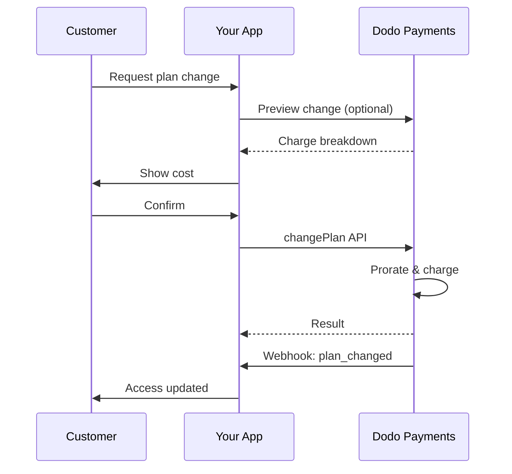
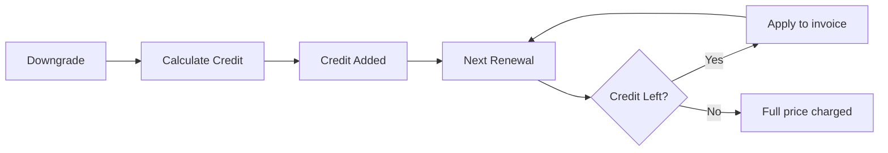

<Info>
Langganan memungkinkan Anda menjual akses berkelanjutan dengan pembaruan otomatis. Gunakan siklus penagihan yang fleksibel, percobaan gratis, perubahan rencana, dan add-on untuk menyesuaikan harga untuk setiap pelanggan.
</Info>

<CardGroup cols={2}>
<Card title="Tingkatkan & Turunkan" icon="repeat" href="/developer-resources/subscription-upgrade-downgrade">
Kontrol perubahan rencana dengan prorata dan pembaruan kuantitas.
</Card>

<Card title="Langganan Sesuai Permintaan" icon="bolt" href="/developer-resources/ondemand-subscriptions">
Otorisasi mandat sekarang dan tarik biaya nanti dengan jumlah yang disesuaikan.
</Card>

<Card title="Portal Pelanggan" icon="id-card" href="/features/customer-portal">
Biarkan pelanggan mengelola rencana, penagihan, dan pembatalan.
</Card>

<Card title="Webhook Langganan" icon="code" href="/developer-resources/webhooks/intents/subscription">
Reaksi terhadap peristiwa siklus hidup seperti dibuat, diperbarui, dan dibatalkan.
</Card>
</CardGroup>

## Apa Itu Langganan?

Langganan adalah produk berulang yang dibeli pelanggan sesuai jadwal. Mereka ideal untuk:

- **Lisensi SaaS**: Aplikasi, API, atau akses platform
- **Keanggotaan**: Komunitas, program, atau klub
- **Konten digital**: Kursus, media, atau konten premium
- **Rencana dukungan**: SLA, paket keberhasilan, atau pemeliharaan

## Manfaat Utama

- **Pendapatan yang dapat diprediksi**: Penagihan berulang dengan pembaruan otomatis
- **Siklus fleksibel**: Bulanan, tahunan, interval kustom, dan percobaan
- **Agilitas rencana**: Prorata untuk peningkatan dan penurunan
- **Add-on dan kursi**: Lampirkan peningkatan opsional yang dapat dihitung
- **Checkout yang mulus**: Checkout yang dihosting dan portal pelanggan
- **Developer-first**: API yang jelas untuk pembuatan, perubahan, dan pelacakan penggunaan

## Membuat Langganan

Buat produk langganan di dasbor Dodo Payments Anda, lalu jual melalui checkout atau API Anda. Memisahkan produk dari langganan aktif memungkinkan Anda untuk memversioning harga, melampirkan add-on, dan melacak kinerja secara independen.

### Pembuatan produk langganan

Konfigurasikan bidang di dasbor untuk mendefinisikan bagaimana langganan Anda dijual, diperbarui, dan ditagih. Bagian di bawah ini langsung memetakan apa yang Anda lihat di formulir pembuatan.

#### Detail produk

- **Nama Produk** (wajib): Nama tampilan yang ditampilkan di checkout, portal pelanggan, dan faktur.
- **Deskripsi Produk** (wajib): Pernyataan nilai yang jelas yang muncul di checkout dan faktur.
- **Gambar Produk** (wajib): PNG/JPG/WebP hingga 3 MB. Digunakan di checkout dan faktur.
- **Merek**: Kaitkan produk dengan merek tertentu untuk tema dan email.
- **Kategori Pajak** (wajib): Pilih kategori (misalnya, SaaS) untuk menentukan aturan pajak.

<Tip>
Pilih kategori pajak yang paling akurat untuk memastikan pengumpulan pajak yang benar per wilayah.
</Tip>

#### Penetapan Harga

- **Tipe Harga**: Pilih <b>Langganan</b> (panduan ini). Alternatifnya adalah Pembayaran Tunggal dan Penagihan Berdasarkan Penggunaan.
- **Harga** (diperlukan): Harga dasar berulang dengan mata uang.
- **Diskon yang Berlaku (%)**: Diskon persentase opsional yang diterapkan pada harga dasar; tercermin dalam checkout dan faktur.
- **Pembayaran ulang setiap** (diperlukan): Interval untuk perpanjangan, misalnya, setiap 1 Bulan. Pilih ritme (bulan atau tahun) dan jumlahnya.
- **Periode Langganan** (diperlukan): Total masa di mana langganan tetap aktif (misalnya, 10 Tahun). Setelah periode ini berakhir, perpanjangan berhenti kecuali diperpanjang.
- **Hari Periode Percobaan** (diperlukan): Atur panjang percobaan dalam hari. Gunakan 0 untuk menonaktifkan percobaan. Biaya pertama terjadi secara otomatis ketika percobaan berakhir.
- **Pilih add-on**: Lampirkan hingga 10 add-on yang dapat dibeli pelanggan bersamaan dengan paket dasar.

<Warning>
Mengubah harga pada produk aktif mempengaruhi pembelian baru. Langganan yang ada mengikuti pengaturan perubahan rencana dan prorata Anda.
</Warning>

<Info>
Add-on sangat ideal untuk ekstra yang dapat dihitung seperti kursi atau penyimpanan. Anda dapat mengontrol kuantitas yang diizinkan dan perilaku prorata saat pelanggan mengubahnya.
</Info>

#### Pengaturan Lanjutan

- **Harga Termasuk Pajak**: Tampilkan harga termasuk pajak yang berlaku. Perhitungan pajak akhir masih bervariasi berdasarkan lokasi pelanggan.
- **Hasilkan kunci lisensi**: Terbitkan kunci unik untuk setiap pelanggan setelah pembelian. Lihat panduan <a href="/features/license-keys">Kunci Lisensi</a>.
- **Pengiriman Produk Digital**: Kirim file atau konten secara otomatis setelah pembelian. Pelajari lebih lanjut di <a href="/features/digital-product-delivery">Pengiriman Produk Digital</a>.
- **Metadata**: Lampirkan pasangan kunci-nilai kustom untuk penandaan internal atau integrasi klien. Lihat <a href="/api-reference/metadata">Metadata</a>.

<Tip>
Gunakan metadata untuk menyimpan pengidentifikasi dari sistem Anda (misalnya, accountId) sehingga Anda dapat mencocokkan peristiwa dan faktur nanti.
</Tip>

## Percobaan Langganan

Percobaan memungkinkan pelanggan mengakses langganan tanpa pembayaran segera. Biaya pertama terjadi secara otomatis ketika percobaan berakhir.

### Mengonfigurasi Percobaan

Set **Hari Percobaan** di bagian harga produk (gunakan `0` untuk menonaktifkan). Anda dapat menimpa ini saat membuat langganan:

```typescript
// Via subscription creation
const subscription = await client.subscriptions.create({
  customer_id: 'cus_123',
  product_id: 'prod_monthly',
  trial_period_days: 14  // Overrides product's trial period
});

// Via checkout session
const session = await client.checkoutSessions.create({
  product_cart: [{ product_id: 'prod_monthly', quantity: 1 }],
  subscription_data: { trial_period_days: 14 }
});
```

<Warning>
Nilai `trial_period_days` harus antara 0 dan 10.000 hari.
</Warning>

### Mendeteksi Status Percobaan

<Warning>
Saat ini, tidak ada bidang langsung untuk mendeteksi status percobaan. Berikut adalah solusi sementara yang memerlukan kueri pembayaran, yang tidak efisien. Kami sedang mengerjakan solusi yang lebih efisien.
</Warning>

Untuk menentukan apakah langganan sedang dalam percobaan, ambil daftar pembayaran untuk langganan tersebut. Jika ada tepat satu pembayaran dengan jumlah 0, langganan sedang dalam periode percobaan:

```typescript
const subscription = await client.subscriptions.retrieve('sub_123');
const payments = await client.payments.list({
  subscription_id: subscription.subscription_id
});

// Check if subscription is in trial
const isInTrial = payments.items.length === 1 && 
                  payments.items[0].total_amount === 0;
```

### Memperbarui Periode Percobaan

Perpanjang percobaan dengan memperbarui `next_billing_date`:

```typescript
await client.subscriptions.update('sub_123', {
  next_billing_date: '2025-02-15T00:00:00Z'  // New trial end date
});
```

<Warning>
Anda tidak dapat mengatur `next_billing_date` ke waktu yang telah berlalu. Tanggal harus di masa depan.
</Warning>

## Perubahan Rencana Langganan

Perubahan rencana memungkinkan Anda untuk meningkatkan atau menurunkan langganan, menyesuaikan kuantitas, atau bermigrasi ke produk yang berbeda. Setiap perubahan memicu biaya segera berdasarkan mode prorata yang Anda pilih.

<Tip>
Anda dapat mengubah rencana langganan dan memperbarui tanggal penagihan berikutnya langsung dari dasbor Dodo Payments. Ini memberikan cara cepat untuk menyesuaikan langganan untuk permintaan dukungan pelanggan, peningkatan promosi, atau migrasi rencana tanpa melakukan panggilan API.
</Tip>

<Tip>
**Aktifkan perubahan rencana swakelola:** Ingin pelanggan dapat meningkatkan atau menurunkan langganan mereka sendiri melalui Portal Pelanggan? Tambahkan produk langganan Anda ke Koleksi Produk dan aktifkan "Izinkan Pembaruan Langganan" di Pengaturan Langganan Anda.
</Tip>



<Card title="Koleksi Produk" icon="layer-group" href="/features/product-collections">
  Kelompokkan produk terkait ke dalam koleksi untuk memungkinkan jalan upgrade/downgrade yang mulus di Portal Pelanggan.
</Card>

### Mode Prorata

Pilih bagaimana pelanggan akan ditagih saat mengganti rencana:

<Info>
**Perbandingan cepat dari tiga mode prorata:**

| | `prorated_immediately` | `difference_immediately` | `full_immediately` |
|---|---|---|---|
| **Upgrade** | Biaya prorata untuk sisa hari | Selisih harga penuh dikenakan | Harga rencana baru penuh dikenakan |
| **Downgrade** | Kredit prorata untuk sisa hari | Selisih harga penuh sebagai kredit | Tidak ada kredit, biaya penuh |
| **Siklus penagihan** | Tetap sama | Tetap sama | Direset ke hari ini |
| **Terbaik untuk** | Penagihan yang adil berdasarkan waktu | Perubahan tier yang sederhana | Reset siklus penagihan |
</Info>

#### `prorated_immediately`
Menggunakan jumlah prorata berdasarkan waktu yang tersisa dalam siklus penagihan saat ini. Terbaik untuk penagihan yang adil yang mempertimbangkan waktu yang tidak terpakai.

```typescript
await client.subscriptions.changePlan('sub_123', {
  product_id: 'prod_pro',
  quantity: 1,
  proration_billing_mode: 'prorated_immediately'
});
```

#### `difference_immediately`
Biaya selisih harga segera (upgrade) atau menambahkan kredit untuk perpanjangan di masa mendatang (downgrade). Terbaik untuk skenario upgrade/downgrade yang sederhana.

```typescript
// Upgrade: charges $50 (difference between $30 and $80)
// Downgrade: credits remaining value, auto-applied to renewals
await client.subscriptions.changePlan('sub_123', {
  product_id: 'prod_pro',
  quantity: 1,
  proration_billing_mode: 'difference_immediately'
});
```

<Info>
Kredit dari downgrade menggunakan `difference_immediately` bersifat terfokus pada langganan dan secara otomatis diterapkan pada perpanjangan di masa mendatang. Mereka berbeda dari <a href="/features/customer-credit">Kredit Pelanggan</a>.
</Info>

Ketika seorang pelanggan menurunkan pilihan dengan `difference_immediately`, nilai yang tidak terpakai menjadi kredit terfokus pada langganan yang secara otomatis mengimbangi perpanjangan di masa mendatang:



#### `full_immediately`
Menghitung jumlah penuh berdasarkan rencana baru segera, mengabaikan waktu yang tersisa. Terbaik untuk mereset siklus penagihan.

```typescript
await client.subscriptions.changePlan('sub_123', {
  product_id: 'prod_monthly',
  quantity: 1,
  proration_billing_mode: 'full_immediately'
});
```

<AccordionGroup>
<Accordion title="Contoh: Perhitungan upgrade prorata">

**Skenario**: Pelanggan pada Basic ($30/bulan) meningkatkan ke Pro ($80/bulan) pada hari ke-16 dari siklus 30 hari menggunakan `prorated_immediately`.

```
Unused credit from Basic = $30 × (15 remaining / 30 total) = $15.00
Prorated cost of Pro     = $80 × (15 remaining / 30 total) = $40.00
────────────────────────────────────────────────────────────────────
Immediate charge         = $40.00 − $15.00 = $25.00
```

Perpanjangan berikutnya pada tanggal penagihan asli: **$80.00/bulan**.

<Tip>
Untuk lebih banyak contoh perhitungan dan kasus tepi yang lebih mendetail, lihat panduan lengkap kami [Panduan Upgrade & Downgrade](/developer-resources/subscription-upgrade-downgrade).
</Tip>

</Accordion>
<Accordion title="Contoh: Perhitungan kredit downgrade">

**Skenario**: Pelanggan pada Pro ($80/bulan) menurunkan ke Starter ($20/bulan) menggunakan `difference_immediately`.

```
Credit = Old plan − New plan = $80 − $20 = $60.00
```

Kredit $60 secara otomatis diterapkan pada perpanjangan yang akan datang:
- Perpanjangan 1: $20 − $20 (kredit) = **$0.00** ($40 kredit tersisa)
- Perpanjangan 2: $20 − $20 (kredit) = **$0.00** ($20 kredit tersisa)  
- Perpanjangan 3: $20 − $20 (kredit) = **$0.00** (kredit habis)
- Perpanjangan 4: **$20.00** (harga penuh)

<Info>
Pelajari lebih lanjut tentang bagaimana kredit dikelola dalam [Panduan Upgrade & Downgrade](/developer-resources/subscription-upgrade-downgrade).
</Info>

</Accordion>
</AccordionGroup>

### Mengubah Rencana dengan Tambahan

Sesuaikan tambahan saat mengubah rencana. Tambahan termasuk dalam perhitungan prorata:

```typescript
await client.subscriptions.changePlan('sub_123', {
  product_id: 'prod_pro',
  quantity: 1,
  proration_billing_mode: 'difference_immediately',
  addons: [{ addon_id: 'addon_extra_seats', quantity: 2 }]  // Add add-ons
  // addons: []  // Empty array removes all existing add-ons
});
```

<Info>
Perubahan rencana memicu biaya langsung. Biaya yang gagal dapat memindahkan langganan ke status `on_hold`. Lacak perubahan melalui peristiwa webhook `subscription.plan_changed`.
</Info>

### Prabaca Perubahan Rencana

Sebelum berkomitmen pada perubahan rencana, prabaca biaya yang tepat dan langganan yang dihasilkan:

```typescript
const preview = await client.subscriptions.previewChangePlan('sub_123', {
  product_id: 'prod_pro',
  quantity: 1,
  proration_billing_mode: 'prorated_immediately'
});

// Show customer the charge before confirming
console.log('You will be charged:', preview.immediate_charge.summary);
```

<Card title="Prabaca API Perubahan Rencana" icon="eye" href="/api-reference/subscriptions/preview-change-plan">
  Prabaca perubahan rencana sebelum berkomitmen.
</Card>

## Status Langganan

Langganan dapat berada dalam berbagai status selama siklus hidupnya:

- **`active`**: Langganan aktif dan akan diperpanjang secara otomatis
- **`on_hold`**: Langganan ditangguhkan karena pembayaran gagal. Pembaruan metode pembayaran diperlukan untuk mengaktifkan kembali
- **`cancelled`**: Langganan dibatalkan dan tidak akan diperpanjang
- **`expired`**: Langganan telah mencapai tanggal berakhir
- **`pending`**: Langganan sedang dibuat atau diproses

### Status Tangguh

Langganan memasuki status `on_hold` ketika:

- Pembayaran perpanjangan gagal (dana tidak mencukupi, kartu kadaluarsa, dll.)
- Biaya perubahan rencana gagal
- Otorisasi metode pembayaran gagal

<Warning>
Ketika langganan berada dalam status `on_hold`, itu tidak akan diperpanjang secara otomatis. Anda harus memperbarui metode pembayaran untuk mengaktifkan kembali langganan.
</Warning>

### Mengaktifkan Kembali dari Status Tangguh

Untuk mengaktifkan kembali langganan dari status `on_hold`, perbarui metode pembayaran. Ini secara otomatis:

1. Membuat biaya untuk penyelesaian yang tersisa
2. Menghasilkan faktur
3. Memproses pembayaran menggunakan metode pembayaran baru
4. Mengaktifkan kembali langganan menuju status `active` setelah pembayaran berhasil

```typescript
// Reactivate subscription from on_hold
const response = await client.subscriptions.updatePaymentMethod('sub_123', {
  type: 'new',
  return_url: 'https://example.com/return'
});

// For on_hold subscriptions, a charge is automatically created
if (response.payment_id) {
  console.log('Charge created:', response.payment_id);
  // Redirect customer to response.payment_link to complete payment
  // Monitor webhooks for payment.succeeded and subscription.active
}
```

<Info>
Setelah berhasil memperbarui metode pembayaran untuk langganan `on_hold`, Anda akan menerima `payment.succeeded` diikuti dengan peristiwa webhook `subscription.active`.
</Info>

## Manajemen API

<AccordionGroup>
<Accordion title="Buat langganan">
Gunakan `POST /subscriptions` untuk membuat langganan secara programatis dari produk, dengan percobaan dan tambahan opsional.

<Card title="Referensi API" icon="code" href="/api-reference/subscriptions/post-subscriptions">
Lihat API pembuatan langganan.
</Card>
</Accordion>

<Accordion title="Perbarui langganan">
Gunakan `PATCH /subscriptions/{id}` untuk memperbarui kuantitas, membatalkan pada tanggal penagihan berikutnya, atau memodifikasi metadata.

<Card title="Referensi API" icon="code" href="/api-reference/subscriptions/patch-subscriptions">
Pelajari cara memperbarui detail langganan.
</Card>
</Accordion>

<Accordion title="Ubah rencana (prorata)">
Ubah produk aktif dan kuantitas dengan kontrol prorata.

<Card title="Referensi API" icon="code" href="/api-reference/subscriptions/change-plan">
Tinjau opsi perubahan rencana.
</Card>
</Accordion>

<Accordion title="Biaya sesuai permintaan">
Untuk langganan sesuai permintaan, tagihkan jumlah tertentu sesuai kebutuhan.

<Card title="Referensi API" icon="code" href="/api-reference/subscriptions/create-charge">
Tagih langganan sesuai permintaan.
</Card>
</Accordion>

<Accordion title="Daftar dan ambil">
Gunakan `GET /subscriptions` untuk mendaftar semua langganan dan `GET /subscriptions/{id}` untuk mengambil satu.

<Card title="Referensi API" icon="code" href="/api-reference/subscriptions/get-subscriptions">
Jelajahi API daftar dan ambil.
</Card>
</Accordion>

<Accordion title="Riwayat penggunaan">
Ambil penggunaan yang tercatat untuk model harga terukur atau hibrida.

<Card title="Referensi API" icon="code" href="/api-reference/subscriptions/get-usage-history">
Lihat API riwayat penggunaan.
</Card>
</Accordion>

<Accordion title="Perbarui metode pembayaran">
Perbarui metode pembayaran untuk langganan. Untuk langganan aktif, ini memperbarui metode pembayaran untuk perpanjangan di masa mendatang. Untuk langganan dalam status `on_hold`, ini mengaktifkan kembali langganan dengan membuat biaya untuk penyelesaian yang tersisa.

<Card title="Referensi API" icon="code" href="/api-reference/subscriptions/update-payment-method">
Pelajari cara memperbarui metode pembayaran dan mengaktifkan kembali langganan.
</Card>
</Accordion>
</AccordionGroup>

## Kasus Penggunaan Umum

- **SaaS dan API**: Akses bertingkat dengan tambahan untuk kursi atau penggunaan
- **Konten dan media**: Akses bulanan dengan percobaan pengenalan
- **Rencana dukungan B2B**: Kontrak tahunan dengan tambahan dukungan premium
- **Alat dan plugin**: Kunci lisensi dan rilis versi

## Contoh Integrasi

### Sesi Checkout (langganan)
Saat membuat sesi checkout, sertakan produk langganan Anda dan tambahan opsional:

```typescript
const session = await client.checkoutSessions.create({
  product_cart: [
    {
      product_id: 'prod_subscription',
      quantity: 1
    }
  ]
});
```

### Perubahan rencana dengan prorata
Tingkatkan atau turunkan langganan dan kontrol perilaku prorata:

```typescript
await client.subscriptions.changePlan('sub_123', {
  product_id: 'prod_new',
  quantity: 1,
  proration_billing_mode: 'difference_immediately'
});
```

### Batalkan pada tanggal penagihan berikutnya
Jadwalkan pembatalan yang berlaku di akhir periode penagihan saat ini:

```typescript
await client.subscriptions.update('sub_123', {
  cancel_at_next_billing_date: true
});
```

### Langganan sesuai permintaan
Buat langganan sesuai permintaan dan tagih nanti sesuai kebutuhan:

```typescript
const onDemand = await client.subscriptions.create({
  customer_id: 'cus_123',
  product_id: 'prod_on_demand',
  on_demand: true
});

await client.subscriptions.createCharge(onDemand.id, {
  amount: 4900,
  currency: 'USD',
  description: 'Extra usage for September'
});
```

### Perbarui metode pembayaran untuk langganan aktif
Perbarui metode pembayaran untuk langganan aktif:

```typescript
// Update with new payment method
const response = await client.subscriptions.updatePaymentMethod('sub_123', {
  type: 'new',
  return_url: 'https://example.com/return'
});

// Or use existing payment method
await client.subscriptions.updatePaymentMethod('sub_123', {
  type: 'existing',
  payment_method_id: 'pm_abc123'
});
```

### Mengaktifkan kembali langganan dari on_hold
Aktifkan kembali langganan yang ditangguhkan karena pembayaran gagal:

```typescript
// Update payment method - automatically creates charge for remaining dues
const response = await client.subscriptions.updatePaymentMethod('sub_123', {
  type: 'new',
  return_url: 'https://example.com/return'
});

if (response.payment_id) {
  // Charge created for remaining dues
  // Redirect customer to response.payment_link
  // Monitor webhooks: payment.succeeded → subscription.active
}
```

## Langganan dengan Mandat Sesuai RBI

  Langganan UPI dan kartu India beroperasi di bawah peraturan RBI (Reserve Bank of India) dengan persyaratan mandat tertentu:

  ### Batas Mandat

  Jenis dan jumlah mandat tergantung pada biaya berulang langganan Anda:

  - **Biaya di bawah Rs 15.000:** Kami membuat mandat sesuai permintaan untuk Rs 15.000 INR. Jumlah langganan dikenakan secara berkala sesuai dengan frekuensi langganan Anda, hingga batas mandat.
  - **Biaya Rs 15.000 atau lebih:** Kami membuat mandat langganan (atau mandat sesuai permintaan) untuk jumlah langganan yang tepat.

Untuk informasi terperinci tentang mandat yang sesuai dengan RBI untuk metode pembayaran India, lihat halaman <a href="/features/payment-methods/india">Metode Pembayaran India</a>.

  ### Pertimbangan Upgrade dan Downgrade

  **Penting:** Saat melakukan upgrade atau downgrade langganan, pertimbangkan batas mandat dengan cermat:

  - Jika upgrade/downgrade menghasilkan jumlah biaya yang melebihi Rs 15.000 dan melewati batas pembayaran sesuai permintaan yang ada, biaya transaksi mungkin gagal.
  - Dalam kasus tersebut, pelanggan mungkin perlu memperbarui metode pembayaran mereka atau mengubah langganan lagi untuk menetapkan mandat baru dengan batas yang benar.

  ### Otorisasi untuk Biaya Berharga Tinggi

  Untuk biaya langganan sebesar Rs 15.000 atau lebih:

  - Pelanggan akan diminta oleh bank mereka untuk mengotorisasi transaksi.
  - Jika pelanggan gagal mengotorisasi transaksi, transaksi akan gagal dan langganan akan ditangguhkan.

  ### Penundaan Pemrosesan 48 Jam

  **Jadwal Pemrosesan:** Biaya berulang pada kartu India dan langganan UPI mengikuti pola pemrosesan yang unik:

  - Biaya **dimulai** pada tanggal yang dijadwalkan sesuai dengan frekuensi langganan Anda.
  - **Pengurangan** sebenarnya dari akun pelanggan terjadi hanya setelah **48 jam** dari inisiasi pembayaran.
  - Jendela 48 jam ini mungkin diperpanjang hingga **2-3 jam tambahan** tergantung pada respons API bank.

  ### Jendela Pembatalan Mandat

  Selama jendela pemrosesan 48 jam:

  - Pelanggan dapat membatalkan mandat melalui aplikasi perbankan mereka.
  - Jika seorang pelanggan membatalkan mandat selama periode ini, langganan akan tetap **aktif** (ini adalah kasus tepi yang spesifik untuk langganan otomatis kartu India dan UPI).
  - Namun, pengurangan sebenarnya mungkin gagal, dan dalam hal tersebut, kami akan menempatkan langganan **dalam status ditangguhkan**.

  **Penanganan Kasus Tepi:** Jika Anda memberikan manfaat, kredit, atau penggunaan langganan kepada pelanggan segera setelah inisiasi biaya, Anda perlu menangani jendela 48 jam ini dengan tepat dalam aplikasi Anda. Pertimbangkan:

  - Menunda aktivasi manfaat hingga konfirmasi pembayaran
  - Menerapkan periode tenggang atau akses sementara
  - Memantau status langganan untuk pembatalan mandat
  - Menangani status ditangguhkan langganan dalam logika aplikasi Anda

  <Tip>
  Pantau webhook langganan untuk melacak perubahan status pembayaran dan menangani kasus tepi di mana mandat dibatalkan selama jendela 48 jam.
  </Tip>

## Praktik Terbaik

- **Mulailah dengan tingkat yang jelas**: 2–3 rencana dengan perbedaan yang jelas
- **Komunikasikan harga**: Tampilkan total, prorata, dan perpanjangan berikutnya
- **Gunakan percobaan dengan bijak**: Konversi dengan onboarding, tidak hanya berdasarkan waktu
- **Manfaatkan tambahan**: Jaga rencana dasar tetap sederhana dan tawarkan ekstra
- **Uji perubahan**: Validasi perubahan rencana dan prorata dalam mode pengujian

<Info>
Langganan adalah landasan fleksibel untuk pendapatan berulang. Mulailah sederhana, uji secara menyeluruh, dan iterasi berdasarkan adopsi, churn, dan metrik ekspansi.
</Info>