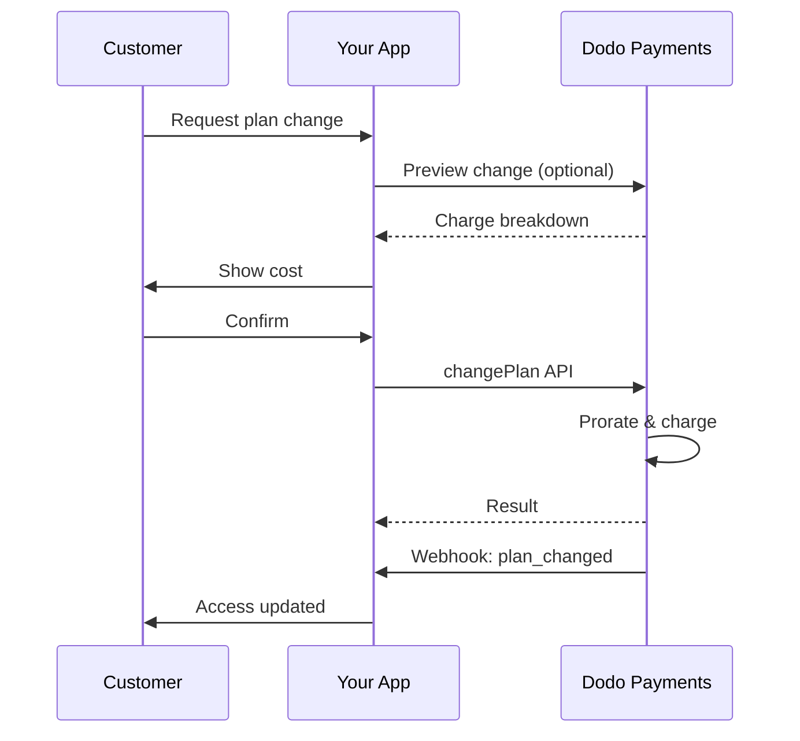
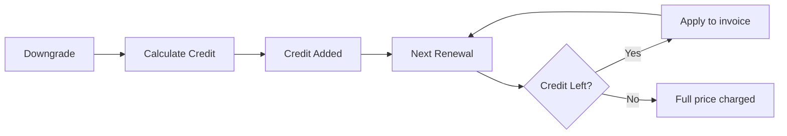
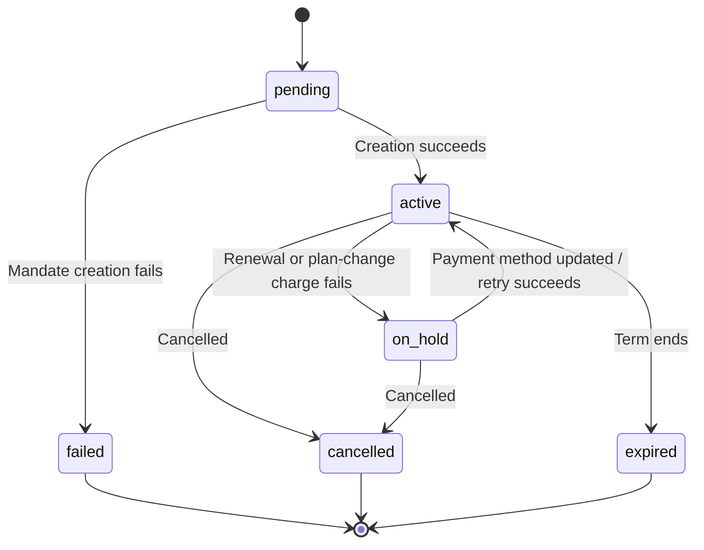

<Info>
Subscriptions let you sell ongoing access with automated renewals. Use flexible billing cycles, free trials, plan changes, and add‑ons to tailor pricing for each customer.
</Info>

<CardGroup cols={2}>
<Card title="Upgrade & Downgrade" icon="repeat" href="/developer-resources/subscription-upgrade-downgrade">
Control plan changes with proration and quantity updates.
</Card>

<Card title="On‑Demand Subscriptions" icon="bolt" href="/developer-resources/ondemand-subscriptions">
Authorize a mandate now and charge later with custom amounts.
</Card>

<Card title="Customer Portal" icon="id-card" href="/features/customer-portal">
Let customers manage plans, billing, and cancellations.
</Card>

<Card title="Subscription Webhooks" icon="code" href="/developer-resources/webhooks/intents/subscription">
React to lifecycle events like created, renewed, and canceled.
</Card>
</CardGroup>

## What Are Subscriptions?

Subscriptions are recurring products customers purchase on a schedule. They’re ideal for:

- **SaaS licenses**: Apps, APIs, or platform access
- **Memberships**: Communities, programs, or clubs
- **Digital content**: Courses, media, or premium content
- **Support plans**: SLAs, success packages, or maintenance

## Key Benefits

- **Predictable revenue**: Recurring billing with automated renewals
- **Flexible cycles**: Monthly, annual, custom intervals, and trials
- **Plan agility**: Proration for upgrades and downgrades
- **Add‑ons and seats**: Attach optional, quantifiable upgrades
- **Seamless checkout**: Hosted checkout and customer portal
- **Developer-first**: Clear APIs for creation, changes, and usage tracking

## Creating Subscriptions

Create subscription products in your Dodo Payments dashboard, then sell them through checkout or your API. Separating products from active subscriptions lets you version pricing, attach add‑ons, and track performance independently.

### Subscription product creation

Configure the fields in the dashboard to define how your subscription sells, renews, and bills. The sections below map directly to what you see in the creation form.

#### Product details

- **Product Name** (required): The display name shown in checkout, customer portal, and invoices.
- **Product Description** (required): A clear value statement that appears in checkout and invoices.
- **Product Image** (required): PNG/JPG/WebP up to 3 MB. Used on checkout and invoices.
- **Brand**: Associate the product with a specific brand for theming and emails.
- **Tax Category** (required): Choose the category (for example, SaaS) to determine tax rules.

<Tip>
Pick the most accurate tax category to ensure correct tax collection per region.
</Tip>

#### Pricing

- **Jenis Harga**: Pilih <b>Berlangganan</b> (panduan ini). Alternatifnya adalah Pembayaran Tunggal dan Penagihan Berdasarkan Penggunaan.
- **Harga** (wajib): Harga berulang dasar dengan mata uang. Harga harus setidaknya **$1** (atau setara dalam mata uang yang Anda pilih). Jumlah di bawah minimum ini tidak didukung dan langganan tidak akan berfungsi.
- **Diskon Berlaku (%)**: Persentase diskon opsional yang diterapkan pada harga dasar; tercermin pada checkout dan faktur.
- **Ulangi pembayaran setiap** (wajib): Interval untuk perpanjangan, misalnya, setiap 1 Bulan. Pilih frekuensi (bulan atau tahun) dan jumlahnya.
- **Periode Berlangganan** (wajib): Jangka waktu total di mana langganan tetap aktif (misalnya, 10 Tahun). Setelah periode ini berakhir, perpanjangan berhenti kecuali diperpanjang.
- **Hari Periode Percobaan** (wajib): Tetapkan panjang percobaan dalam hari. Gunakan 0 untuk menonaktifkan percobaan. Biaya pertama terjadi secara otomatis ketika percobaan berakhir.
- **Pilih add‑on**: Lampirkan hingga 10 add‑on yang dapat dibeli pelanggan bersama paket dasar.

<Warning>
Changing pricing on an active product affects new purchases. Existing subscriptions follow your plan‑change and proration settings.
</Warning>

<Info>
Add‑ons are ideal for quantifiable extras such as seats or storage. You can control allowed quantities and proration behavior when customers change them.
</Info>

#### Advanced settings

- **Tax Inclusive Pricing**: Display prices inclusive of applicable taxes. Final tax calculation still varies by customer location.
- **Generate license keys**: Issue a unique key to each customer after purchase. See the <a href="/features/license-keys">License Keys</a> guide.
- **Digital Product Delivery**: Deliver files or content automatically after purchase. Learn more in <a href="/features/digital-product-delivery">Digital Product Delivery</a>.
- **Metadata**: Attach custom key–value pairs for internal tagging or client integrations. See <a href="/api-reference/metadata">Metadata</a>.

<Tip>
Use metadata to store identifiers from your system (e.g., accountId) so you can reconcile events and invoices later.
</Tip>

## Subscription Trials

Trials let customers access subscriptions without immediate payment. The first charge occurs automatically when the trial ends.

### Configuring Trials

Set **Trial Period Days** in the product pricing section (use `0` to disable). You can override this when creating subscriptions:

```typescript
// Via subscription creation
const subscription = await client.subscriptions.create({
  customer_id: 'cus_123',
  product_id: 'prod_monthly',
  trial_period_days: 14  // Overrides product's trial period
});

// Via checkout session
const session = await client.checkoutSessions.create({
  product_cart: [{ product_id: 'prod_monthly', quantity: 1 }],
  subscription_data: { trial_period_days: 14 }
});
```

<Warning>
The `trial_period_days` value must be between 0 and 10,000 days.
</Warning>

### Detecting Trial Status

<Warning>
Currently, there is no direct field to detect trial status. The following is a workaround that requires querying payments, which is inefficient. We are working on a more efficient solution.
</Warning>

To determine if a subscription is in trial, retrieve the list of payments for the subscription. If there is exactly one payment with amount 0, the subscription is in trial period:

```typescript
const subscription = await client.subscriptions.retrieve('sub_123');
const payments = await client.payments.list({
  subscription_id: subscription.subscription_id
});

// Check if subscription is in trial
const isInTrial = payments.items.length === 1 && 
                  payments.items[0].total_amount === 0;
```

### Updating Trial Period

Extend the trial by updating `next_billing_date`:

```typescript
await client.subscriptions.update('sub_123', {
  next_billing_date: '2025-02-15T00:00:00Z'  // New trial end date
});
```

<Warning>
You cannot set `next_billing_date` to a past time. The date must be in the future.
</Warning>

## Subscription Plan Changes

Plan changes let you upgrade or downgrade subscriptions, adjust quantities, or migrate to different products. Depending on the proration mode you select, a change may trigger an immediate charge, create credit, or apply no billing adjustment.

<Tip>
You can change subscription plans and update the next billing date directly from the Dodo Payments dashboard. This provides a quick way to adjust subscriptions for customer support requests, promotional upgrades, or plan migrations without making API calls.
</Tip>

<Tip>
**Enable self-service plan changes:** Want customers to upgrade or downgrade their own subscriptions via the Customer Portal? Add your subscription products to a Product Collection and enable "Allow Subscription Updates" in your Subscription Settings.
</Tip>



<Card title="Product Collections" icon="layer-group" href="/features/product-collections">
  Group related products into collections to enable seamless upgrade/downgrade paths in the Customer Portal.
</Card>

### Proration Modes

Choose how customers are billed when changing plans:

<Info>
**Quick comparison of the four proration modes:**

| | `prorated_immediately` | `difference_immediately` | `full_immediately` | `do_not_bill` |
|---|---|---|---|---|
| **Upgrade** | Biaya prorata untuk hari yang tersisa | Selisih harga penuh dikenakan | Harga paket baru penuh dikenakan | Tidak ada biaya — langsung beralih |
| **Downgrade** | Kredit prorata untuk hari yang tersisa | Selisih harga penuh sebagai kredit | Tidak ada kredit, biaya penuh | Tidak ada kredit — langsung beralih |
| **Siklus penagihan** | Direset ke hari ini | Direset ke hari ini | Direset ke hari ini | Tetap sama |
| **Terbaik untuk** | Penagihan berbasis waktu yang adil | Perubahan tier sederhana | Reset siklus penagihan | Migrasi gratis atau penggantian sebagai keramahan |
</Info>

#### `prorated_immediately`
Charges prorated amount based on remaining time in the current billing cycle. Best for fair billing that accounts for unused time.

```typescript
await client.subscriptions.changePlan('sub_123', {
  product_id: 'prod_pro',
  quantity: 1,
  proration_billing_mode: 'prorated_immediately'
});
```

#### `difference_immediately`
Charges the price difference immediately (upgrade) or adds credit for future renewals (downgrade). Best for simple upgrade/downgrade scenarios.

```typescript
// Upgrade: charges $50 (difference between $30 and $80)
// Downgrade: credits remaining value, auto-applied to renewals
await client.subscriptions.changePlan('sub_123', {
  product_id: 'prod_pro',
  quantity: 1,
  proration_billing_mode: 'difference_immediately'
});
```

<Info>
Credits from downgrades using `difference_immediately` are subscription-scoped and auto-applied to future renewals. They're distinct from <a href="/features/credit-based-billing">Credit-Based Billing</a> entitlements.
</Info>

When a customer downgrades with `difference_immediately`, the unused value becomes a subscription-scoped credit that automatically offsets future renewals:



#### `full_immediately`
Charges full new plan amount immediately, ignoring remaining time. Best for resetting billing cycles.

```typescript
await client.subscriptions.changePlan('sub_123', {
  product_id: 'prod_monthly',
  quantity: 1,
  proration_billing_mode: 'full_immediately'
});
```

#### `do_not_bill`
Switches to the new plan without any billing adjustment. No proration charges, no credits — the customer simply moves to the new plan. Best for courtesy migrations, free plan switches, or scenarios where you want to absorb the cost difference.

```typescript
await client.subscriptions.changePlan('sub_123', {
  product_id: 'prod_new_plan',
  quantity: 1,
  proration_billing_mode: 'do_not_bill'
});
```

<AccordionGroup>
<Accordion title="Example: Prorated upgrade calculation">

**Scenario**: Customer on Basic ($30/month) upgrades to Pro ($80/month) on day 16 of a 30-day cycle using `prorated_immediately`.

```
Unused credit from Basic = $30 × (15 remaining / 30 total) = $15.00
Prorated cost of Pro     = $80 × (15 remaining / 30 total) = $40.00
────────────────────────────────────────────────────────────────────
Immediate charge         = $40.00 − $15.00 = $25.00
```

Pembaharuan berikutnya pada **15 Februari** (16 Januari + 30 hari): **$80.00/bulan**.

<Tip>
For more detailed calculation examples and edge cases, see our full [Upgrade & Downgrade Guide](/developer-resources/subscription-upgrade-downgrade).
</Tip>

</Accordion>
<Accordion title="Example: Downgrade credit calculation">

**Scenario**: Customer on Pro ($80/month) downgrades to Starter ($20/month) using `difference_immediately`.

```
Credit = Old plan − New plan = $80 − $20 = $60.00
```

The $60 credit auto-applies to future renewals:
- Renewal 1: $20 − $20 (credit) = **$0.00** ($40 credit remaining)
- Renewal 2: $20 − $20 (credit) = **$0.00** ($20 credit remaining)  
- Renewal 3: $20 − $20 (credit) = **$0.00** (credit exhausted)
- Renewal 4: **$20.00** (full price)

<Info>
Learn more about how credits are managed in the [Upgrade & Downgrade Guide](/developer-resources/subscription-upgrade-downgrade).
</Info>

</Accordion>
</AccordionGroup>

### Changing Plans with Add-ons

Modify add-ons when changing plans. Add-ons are included in proration calculations:

```typescript
await client.subscriptions.changePlan('sub_123', {
  product_id: 'prod_pro',
  quantity: 1,
  proration_billing_mode: 'difference_immediately',
  addons: [{ addon_id: 'addon_extra_seats', quantity: 2 }]  // Add add-ons
  // addons: []  // Empty array removes all existing add-ons
});
```

<Info>
Plan changes trigger immediate charges. Failed charges may move the subscription to `on_hold` status. Track changes via `subscription.plan_changed` webhook events.
</Info>

### Previewing Plan Changes

Before committing to a plan change, preview the exact charge and resulting subscription:

```typescript
const preview = await client.subscriptions.previewChangePlan('sub_123', {
  product_id: 'prod_pro',
  quantity: 1,
  proration_billing_mode: 'prorated_immediately'
});

// Show customer the charge before confirming
console.log('You will be charged:', preview.immediate_charge.summary);
```

<Card title="Preview Change Plan API" icon="eye" href="/api-reference/subscriptions/preview-change-plan">
  Preview plan changes before committing to them.
</Card>

## Subscription States

Sebuah langganan bergerak melalui serangkaian status yang telah ditentukan selama masa hidupnya. Tabel ini adalah referensi untuk setiap status, penyebabnya, dan cara (atau apakah) Anda dapat memulihkannya.

| Status | Artinya | Dapat Pulih? | Jalur Pemulihan / langkah selanjutnya |
|--------|---------|--------------|------------------|
| `pending` | Langganan sedang dibuat atau diproses | — | Tunggu `subscription.active` (atau `subscription.failed`) |
| `active` | Langganan aktif dan akan diperbarui secara otomatis | — | Tidak ada tindakan yang diperlukan |
| `on_hold` | Pembayaran pembaruan (atau biaya perubahan paket) gagal; langganan dijeda | **Ya** | Perbarui metode pembayaran untuk mengaktifkan kembali — secara otomatis melalui [Payment Retries](/features/recovery/payment-retries) dan [Dunning](/features/recovery/subscription-dunning), atau secara manual melalui [Update Payment Method API](/api-reference/subscriptions/update-payment-method) |
| `cancelled` | Langganan dibatalkan dan tidak akan diperbarui | Hanya pembelian ulang | Pelanggan harus memulai langganan baru; [Dunning](/features/recovery/subscription-dunning) dapat memantik pembelian ulang |
| `failed` | Pembuatan **langganan** gagal (mandat awal atau pembayaran tidak berhasil) | **Tidak — terminal** | Pelanggan harus membuat langganan baru dengan metode pembayaran yang berfungsi |
| `expired` | Langganan mencapai akhir masa berlakunya | — | Pelanggan harus memulai langganan baru jika diinginkan |

<Warning>
`on_hold` dan `failed` sering kali membingungkan. `on_hold` adalah keadaan **dapat dipulihkan** untuk langganan yang sudah aktif yang pembaruannya gagal. `failed` adalah keadaan **terminal** yang hanya terjadi ketika pembuatan langganan **awal** gagal — tidak dapat diaktifkan kembali.
</Warning>

### Mesin Status



### Status Ditahan

Sebuah langganan masuk ke dalam status `on_hold` ketika:

- Pembayaran pembaruan gagal (dana tidak mencukupi, kartu kedaluwarsa, dll.)
- Biaya perubahan paket gagal
- Otorisasi metode pembayaran gagal

<Warning>
Ketika langganan berada dalam status `on_hold`, itu tidak akan diperbarui secara otomatis. Anda harus memperbarui metode pembayaran untuk mengaktifkan kembali langganan.
</Warning>

### Mengaktifkan Kembali dari Ditahan

Untuk mengaktifkan kembali langganan dari status `on_hold`, perbarui metode pembayaran. Ini secara otomatis:

1. Membuat biaya untuk hutang yang tersisa
2. Menghasilkan faktur
3. Memproses pembayaran menggunakan metode pembayaran baru
4. Mengaktifkan kembali langganan ke status `active` setelah pembayaran berhasil

```typescript
// Reactivate subscription from on_hold
const response = await client.subscriptions.updatePaymentMethod('sub_123', {
  type: 'new',
  return_url: 'https://example.com/return'
});

// For on_hold subscriptions, a charge is automatically created
if (response.payment_id) {
  console.log('Charge created:', response.payment_id);
  // Redirect customer to response.payment_link to complete payment
  // Monitor webhooks for payment.succeeded and subscription.active
}
```

<Info>
Setelah berhasil memperbarui metode pembayaran untuk langganan `on_hold`, Anda akan menerima acara webhook `payment.succeeded` diikuti oleh `subscription.active`.
</Info>

### Acara Webhook oleh Transisi

Setiap transisi memancarkan webhook sehingga Anda dapat menggerakkan logika hak tanpa pemindaian:

| Transisi | Acara |
|----------|-------|
| Langganan diaktifkan | `subscription.active` |
| Pembaruan berhasil | `subscription.renewed` |
| Pembaruan gagal → jeda | `subscription.on_hold` |
| Pembuatan gagal | `subscription.failed` |
| Paket diperbarui/dikurangi | `subscription.plan_changed` |
| Dibatalkan | `subscription.cancelled` |
| Masa berakhir | `subscription.expired` |
| Perubahan pada setiap bidang | `subscription.updated` |

<Card title="Subscription Webhook Payloads" icon="webhook" href="/developer-resources/webhooks/intents/subscription">
Lihat skema payload lengkap untuk acara siklus hidup langganan.
</Card>

## Manajemen API

<AccordionGroup>
<Accordion title="Create subscriptions">
Gunakan `POST /subscriptions` untuk membuat langganan secara programatis dari produk, dengan uji coba dan add-on opsional.

<Card title="API Reference" icon="code" href="/api-reference/subscriptions/post-subscriptions">
Lihat API pembuatan langganan.
</Card>
</Accordion>

<Accordion title="Update subscriptions">
Gunakan `PATCH /subscriptions/{id}` untuk memperbarui kuantitas, membatalkan pada tanggal penagihan berikutnya, atau memodifikasi metadata.

<Card title="API Reference" icon="code" href="/api-reference/subscriptions/patch-subscriptions">
Pelajari cara memperbarui detail langganan.
</Card>
</Accordion>

<Accordion title="Change plans (proration)">
Ubah produk aktif dan kuantitas dengan kontrol proration.

<Card title="API Reference" icon="code" href="/api-reference/subscriptions/change-plan">
Tinjau opsi perubahan paket.
</Card>
</Accordion>

<Accordion title="On‑demand charges">
Untuk langganan berdasarkan permintaan, kenakan jumlah tertentu sesuai permintaan.

<Card title="API Reference" icon="code" href="/api-reference/subscriptions/create-charge">
Tagih langganan sesuai permintaan.
</Card>
</Accordion>

<Accordion title="List and retrieve">
Gunakan `GET /subscriptions` untuk menyusun daftar semua langganan dan `GET /subscriptions/{id}` untuk mendapatkan satu langganan.

<Card title="API Reference" icon="code" href="/api-reference/subscriptions/get-subscriptions">
Jelajahi API penyusunan daftar dan pengambilan.
</Card>
</Accordion>

<Accordion title="Usage history">
Ambil penggunaan yang terukur untuk model harga metered atau hybrid.

<Card title="API Reference" icon="code" href="/api-reference/subscriptions/get-usage-history">
Lihat API riwayat penggunaan.
</Card>
</Accordion>

<Accordion title="Update payment method">
Perbarui metode pembayaran untuk langganan. Untuk langganan aktif, ini memperbarui metode pembayaran untuk pembaruan di masa depan. Untuk langganan dalam status `on_hold`, ini mengaktifkan kembali langganan dengan membuat biaya untuk hutang yang tersisa.

Ketika menghasilkan tautan metode pembayaran baru (tipe permintaan `New`), Anda dapat memasukkan `allowed_payment_method_types` untuk membatasi metode pembayaran mana yang dilihat pelanggan di halaman itu. Pelanggan tidak akan pernah melihat metode yang tidak ada dalam daftar, meskipun memasukkan metode tidak menjamin metode itu muncul (ketersediaan masih bergantung pada faktor seperti lokasi pelanggan dan pengaturan bisnis Anda).

<Card title="API Reference" icon="code" href="/api-reference/subscriptions/update-payment-method">
Pelajari cara memperbarui metode pembayaran dan mengaktifkan kembali langganan.
</Card>
</Accordion>
</AccordionGroup>

## Kasus Penggunaan Umum

- **SaaS dan API**: Akses bertingkat dengan add-on untuk kursi atau penggunaan
- **Konten dan media**: Akses bulanan dengan uji coba pengantar
- **Paket dukungan B2B**: Kontrak tahunan dengan add-on dukungan premium
- **Alat dan plugin**: Kunci lisensi dan rilis versi

## Contoh Integrasi

### Sesi Pembayaran (langganan)
Saat membuat sesi pembayaran, sertakan produk langganan Anda dan add-on opsional:

```typescript
const session = await client.checkoutSessions.create({
  product_cart: [
    {
      product_id: 'prod_subscription',
      quantity: 1
    }
  ]
});
```

### Perubahan paket dengan proration
Upgrade atau downgrade langganan dan kontrol perilaku proration:

```typescript
await client.subscriptions.changePlan('sub_123', {
  product_id: 'prod_new',
  quantity: 1,
  proration_billing_mode: 'difference_immediately'
});
```

### Batalkan pada tanggal penagihan berikutnya
Jadwal pembatalan yang berlaku pada akhir periode penagihan saat ini:

```typescript
await client.subscriptions.update('sub_123', {
  cancel_at_next_billing_date: true
});
```

### Langganan berdasarkan permintaan
Buat langganan berdasarkan permintaan dan tagih nanti sesuai kebutuhan:

```typescript
const onDemand = await client.subscriptions.create({
  customer_id: 'cus_123',
  product_id: 'prod_on_demand',
  on_demand: true
});

await client.subscriptions.charge(onDemand.id, {
  amount: 4900,
  currency: 'USD',
  description: 'Extra usage for September'
});
```

### Perbarui metode pembayaran untuk langganan aktif
Perbarui metode pembayaran untuk langganan aktif:

```typescript
// Update with new payment method
const response = await client.subscriptions.updatePaymentMethod('sub_123', {
  type: 'new',
  return_url: 'https://example.com/return'
});

// Or use existing payment method
await client.subscriptions.updatePaymentMethod('sub_123', {
  type: 'existing',
  payment_method_id: 'pm_abc123'
});
```

### Mengaktifkan kembali langganan dari on_hold
Aktifkan kembali langganan yang dijeda karena pembayaran gagal:

```typescript
// Update payment method - automatically creates charge for remaining dues
const response = await client.subscriptions.updatePaymentMethod('sub_123', {
  type: 'new',
  return_url: 'https://example.com/return'
});

if (response.payment_id) {
  // Charge created for remaining dues
  // Redirect customer to response.payment_link
  // Monitor webhooks: payment.succeeded → subscription.active
}
```

## Langganan dengan Mandat Sesuai RBI

Langganan UPI dan kartu India beroperasi di bawah regulasi RBI (Bank Sentral India) dengan persyaratan mandat tertentu:

### Batas Mandat

Jenis dan jumlah mandat bergantung pada biaya berulang langganan Anda:

- **Biaya di bawah batas bawah mandat (default ₹15,000):** Kami membuat mandat berdasarkan permintaan untuk jumlah batas bawah. Jumlah langganan dikenakan secara berkala sesuai dengan frekuensi langganan Anda, hingga batas mandat.
- **Biaya di atau di atas batas bawah mandat:** Kami membuat mandat langganan (atau mandat berdasarkan permintaan) untuk jumlah langganan yang tepat.

Batas bawah mandat dapat dikonfigurasi per pedagang atau per permintaan melalui `mandate_min_amount_inr_paise` (INR paise). Jumlah yang didaftarkan dengan bank adalah `max(mandate_floor, billing_amount)` — sehingga batas bawah secara efektif menjadi batas otorisasi yang terlihat oleh pelanggan setiap kali penagihan lebih rendah.

Untuk informasi terperinci tentang mandat yang sesuai dengan RBI dan batas bawah mandat yang dapat dikonfigurasi untuk metode pembayaran India, lihat halaman <a href="/features/payment-methods/india#configurable-mandate-floor">India Payment Methods</a>.

### Pertimbangan Dalam Upgrade dan Downgrade

**Penting:** Saat melakukan upgrade atau downgrade langganan, pertimbangkan dengan cermat batas mandat:

- Jika upgrade/downgrade menghasilkan jumlah biaya yang melebihi Rs 15,000 dan melampaui batas pembayaran berdasarkan permintaan yang ada, biaya transaksi mungkin gagal.
- Dalam kasus seperti itu, pelanggan mungkin perlu memperbarui metode pembayaran mereka atau mengubah langganan lagi untuk membentuk mandat baru dengan batas yang benar.

### Otorisasi untuk Biaya Bernilai Tinggi

Untuk biaya langganan sebesar Rs 15,000 atau lebih:

- Pelanggan akan diberitahukan oleh bank mereka untuk mengotorisasi transaksi.
- Jika pelanggan gagal mengotorisasi transaksi, transaksi akan gagal dan langganan akan dijeda.

### Keterlambatan Proses 48 Jam

**Garis Waktu Pemrosesan:** Biaya berulang untuk langganan kartu India dan UPI mengikuti pola pemrosesan unik:

- Biaya **dimulai** pada tanggal yang dijadwalkan sesuai dengan frekuensi langganan Anda.
- Pengurangan **sebenarnya** dari akun pelanggan terjadi hanya setelah **48 jam** dari inisiasi pembayaran.
- Jendela 48 jam ini dapat diperpanjang hingga **2-3 jam tambahan** tergantung pada respons API bank.

### Jendela Pembatalan Mandat

Selama jendela pemrosesan 48 jam:

- Pelanggan dapat membatalkan mandat melalui aplikasi perbankan mereka.
- Jika pelanggan membatalkan mandat selama periode ini, langganan akan tetap **aktif** (ini adalah kasus khusus untuk langganan kartu dan UPI AutoPay India).
- Namun, pengurangan sebenarnya mungkin gagal, dan dalam hal itu, kami akan menempatkan langganan **dalam penangguhan**.

**Penanganan Kasus Khusus:** Jika Anda memberikan manfaat, kredit, atau penggunaan langganan kepada pelanggan segera setelah inisiasi biaya, Anda perlu menangani jendela 48 jam ini dengan tepat dalam aplikasi Anda. Pertimbangkan:

- Menunda aktivasi manfaat hingga konfirmasi pembayaran
- Menerapkan masa tenggang atau akses sementara
- Memonitor status langganan untuk pembatalan mandat
- Menangani status penangguhan langganan dalam logika aplikasi Anda

<Tip>
Pantau webhook langganan untuk melacak perubahan status pembayaran dan menangani kasus khusus di mana mandat dibatalkan selama jendela 48 jam.
</Tip>

## Praktik Terbaik

- **Mulai dengan tingkatan yang jelas**: 2–3 paket dengan perbedaan yang jelas
- **Komunikasikan harga**: Perlihatkan total, proration, dan pembaruan berikutnya
- **Gunakan uji coba dengan bijak**: Konversi dengan onboarding, bukan hanya waktu
- **Manfaatkan add-on**: Jaga agar paket dasar tetap sederhana dan tawarkan tambahan
- **Uji perubahan**: Validasi perubahan paket dan proration dalam mode uji

<Info>
Langganan adalah fondasi fleksibel untuk pendapatan berulang. Mulailah dengan sederhana, uji secara menyeluruh, dan iterasi berdasarkan adopsi, churn, dan metrik ekspansi.
</Info>