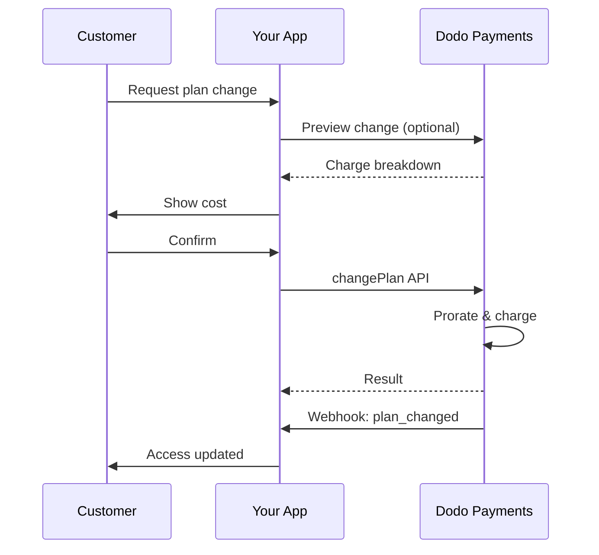
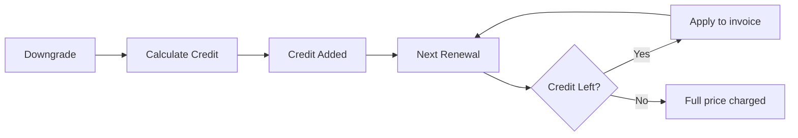
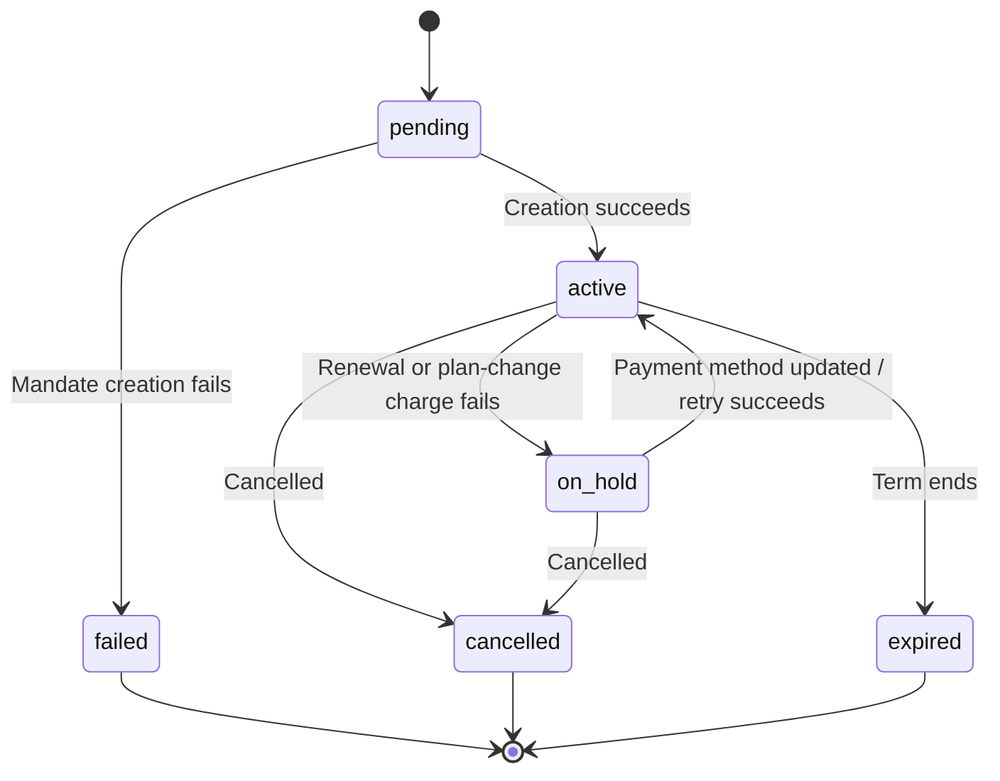

<Info>
Subscriptions let you sell ongoing access with automated renewals. Use flexible billing cycles, free trials, plan changes, and add‑ons to tailor pricing for each customer.
</Info>

<CardGroup cols={2}>
<Card title="Upgrade & Downgrade" icon="repeat" href="/developer-resources/subscription-upgrade-downgrade">
Control plan changes with proration and quantity updates.
</Card>

<Card title="On‑Demand Subscriptions" icon="bolt" href="/developer-resources/ondemand-subscriptions">
Authorize a mandate now and charge later with custom amounts.
</Card>

<Card title="Customer Portal" icon="id-card" href="/features/customer-portal">
Let customers manage plans, billing, and cancellations.
</Card>

<Card title="Subscription Webhooks" icon="code" href="/developer-resources/webhooks/intents/subscription">
React to lifecycle events like created, renewed, and canceled.
</Card>
</CardGroup>

## What Are Subscriptions?

Subscriptions are recurring products customers purchase on a schedule. They’re ideal for:

- **SaaS licenses**: Apps, APIs, or platform access
- **Memberships**: Communities, programs, or clubs
- **Digital content**: Courses, media, or premium content
- **Support plans**: SLAs, success packages, or maintenance

## Key Benefits

- **Predictable revenue**: Recurring billing with automated renewals
- **Flexible cycles**: Monthly, annual, custom intervals, and trials
- **Plan agility**: Proration for upgrades and downgrades
- **Add‑ons and seats**: Attach optional, quantifiable upgrades
- **Seamless checkout**: Hosted checkout and customer portal
- **Developer-first**: Clear APIs for creation, changes, and usage tracking

## Creating Subscriptions

Create subscription products in your Dodo Payments dashboard, then sell them through checkout or your API. Separating products from active subscriptions lets you version pricing, attach add‑ons, and track performance independently.

### Subscription product creation

Configure the fields in the dashboard to define how your subscription sells, renews, and bills. The sections below map directly to what you see in the creation form.

#### Product details

- **Product Name** (required): The display name shown in checkout, customer portal, and invoices.
- **Product Description** (required): A clear value statement that appears in checkout and invoices.
- **Product Image** (required): PNG/JPG/WebP up to 3 MB. Used on checkout and invoices.
- **Brand**: Associate the product with a specific brand for theming and emails.
- **Tax Category** (required): Choose the category (for example, SaaS) to determine tax rules.

<Tip>
Pick the most accurate tax category to ensure correct tax collection per region.
</Tip>

#### Pricing

- **Pricing Type**: Pilih <b>Subscription</b> (panduan ini). Alternatifnya adalah Single Payment dan Usage Based Billing.
- **Price** (wajib): Harga dasar berulang dengan mata uang. Harga harus sekurang-kurangnya **$1** (atau setara dalam mata uang yang dipilih). Jumlah di bawah minimum ini tidak didukung dan subscription tidak akan berfungsi.
- **Discount Applicable (%)**: Diskon persentase opsional yang diterapkan pada harga dasar; tercermin di checkout dan invoice.
- **Repeat payment every** (wajib): Interval untuk perpanjangan, misalnya setiap 1 Month. Pilih cadence (bulan atau tahun) dan jumlahnya.
- **Subscription Period** (wajib): Jangka waktu total subscription tetap aktif (misalnya 10 Years). Setelah periode ini berakhir, perpanjangan berhenti kecuali diperpanjang.
- **Trial Period Days** (wajib): Tetapkan durasi trial dalam hari. Gunakan 0 untuk menonaktifkan trial. Tagihan pertama dibuat secara otomatis saat trial berakhir.
- **Trial Amount**: Biaya awal opsional untuk paid trial. Biarkan tidak diisi untuk free trial. Lihat [Paid Trials](#paid-trials).
- **Select add‑on**: Lampirkan hingga 10 add-on yang dapat dibeli pelanggan bersama paket dasar.

<Warning>
Changing pricing on an active product affects new purchases. Existing subscriptions follow your plan‑change and proration settings.
</Warning>

<Info>
Add‑ons are ideal for quantifiable extras such as seats or storage. You can control allowed quantities and proration behavior when customers change them.
</Info>

#### Advanced settings

- **Tax Inclusive Pricing**: Display prices inclusive of applicable taxes. Final tax calculation still varies by customer location.
- **Generate license keys**: Issue a unique key to each customer after purchase. See the <a href="/features/license-keys">License Keys</a> guide.
- **Digital Product Delivery**: Deliver files or content automatically after purchase. Learn more in <a href="/features/digital-product-delivery">Digital Product Delivery</a>.
- **Metadata**: Attach custom key–value pairs for internal tagging or client integrations. See <a href="/api-reference/metadata">Metadata</a>.

<Tip>
Use metadata to store identifiers from your system (e.g., accountId) so you can reconcile events and invoices later.
</Tip>

## Subscription Trials

Trial memungkinkan pelanggan mengevaluasi subscription sebelum membayar harga berulang penuh. Trial dapat berupa **free**, ketika tidak ada biaya yang dikenakan hingga trial berakhir, atau **paid**, ketika jumlah yang lebih rendah dikenakan di muka. Dalam kedua kasus tersebut, harga penuh mulai berlaku pada perpanjangan pertama setelah trial berakhir.

### Configuring Trials

Set **Trial Period Days** in the product pricing section (use `0` to disable). You can override this when creating subscriptions:

```typescript
// Via subscription creation
const subscription = await client.subscriptions.create({
  customer: { customer_id: 'cus_123' },
  billing: { country: 'US' },
  product_id: 'pdt_monthly',
  quantity: 1,
  trial_period_days: 14  // Overrides product's trial period
});

// Via checkout session
const session = await client.checkoutSessions.create({
  product_cart: [{ product_id: 'pdt_monthly', quantity: 1 }],
  subscription_data: { trial_period_days: 14 }
});
```

<Warning>
The `trial_period_days` value must be between 0 and 10,000 days.
</Warning>

### Paid Trials

Trial tidak harus gratis. Tetapkan **Trial Amount** pada harga berulang produk subscription untuk mengenakan biaya awal yang lebih rendah selama jendela trial. Harga berulang penuh kemudian mulai berlaku pada perpanjangan pertama.

<Frame>

</Frame>

Paid trial dikonfigurasi pada harga produk, bukan per subscription atau per checkout session:

| Field | Type | Description |
|-------|------|-------------|
| `trial_amount` | integer | Jumlah yang dikenakan hari ini untuk trial, dalam unit minor mata uang harga (misalnya, `500` untuk $5.00). Memerlukan `trial_period_days > 0`. Kosongkan atau tetapkan ke `null` untuk free trial. |
| `trial_apply_discounts` | boolean | Menentukan apakah kode diskon checkout mengurangi biaya trial. Default-nya `false`, sehingga jumlah trial dikenakan penuh meskipun diskon diterapkan pada harga berulang. |

```typescript
const product = await client.products.create({
  name: 'Pro Plan',
  tax_category: 'saas',
  price: {
    type: 'recurring_price',
    price: 2900,                      // $29.00 per month after the trial
    currency: 'USD',
    discount: 0,
    purchasing_power_parity: false,
    payment_frequency_count: 1,
    payment_frequency_interval: 'Month',
    subscription_period_count: 1,
    subscription_period_interval: 'Year',
    trial_period_days: 14,            // A paid trial requires a positive trial period
    trial_amount: 500,                // $5.00 charged today
    trial_apply_discounts: false      // Discounts apply to the recurring price only
  }
});
```

Paid trial juga diproses melalui checkout. Jumlah trial dikenai pajak, ditampilkan dalam perhitungan checkout session dan harga payment link, serta markup Adaptive Currency diterapkan per mata uang. [Preview endpoint](/developer-resources/checkout-session) mengembalikan `trial_amount` dan `trial_period_days` sehingga Anda dapat menampilkan jumlah yang harus dibayar hari ini sebelum subscription dibuat.

<Info>
Free trial tidak berubah. Membiarkan **Trial Amount** kosong akan mempertahankan perilaku yang ada, yaitu biaya pertama adalah `0` dan harga penuh dikenakan saat trial berakhir.
</Info>

### Mencegah Penyalahgunaan Trial

**Prevent Trial Misuse** mencegah pelanggan berulang kali mengklaim trial untuk bisnis yang sama. Saat diaktifkan, pelanggan yang sebelumnya telah menukarkan trial akan secara otomatis dialihkan ke **paid, no-trial purchase**, bukan menerima trial baru.

<Frame>

</Frame>

Aktifkan dari tab **Subscriptions** di **Settings**. Setelah diaktifkan:

- Pelanggan dicocokkan berdasarkan **normalized email**, dengan plus-alias yang dihapus, sehingga `user+trial@example.com` dan `user@example.com` dianggap sebagai orang yang sama.
- Penukaran dicatat saat **trial activation**, sehingga pelanggan yang membatalkan pada hari yang sama tetap dianggap telah menggunakan trial mereka.
- Pelanggan yang sudah ada di-backfill berdasarkan trial historis melalui email, sehingga pengguna trial sebelumnya langsung dikenali.

<Info>
Pengaturan ini **off by default**. Lihat [Subscription Settings](/features/product-collections#subscription-settings) untuk daftar lengkap kontrol subscription tingkat bisnis.
</Info>

### Mendeteksi Status Trial

<Warning>
Saat ini tidak ada field langsung untuk mendeteksi status trial. Solusi berikut memerlukan query payments, yang tidak efisien. Kami sedang mengembangkan solusi yang lebih efisien.
</Warning>

Untuk menentukan apakah subscription **free trial** sedang dalam masa trial, ambil daftar payments untuk subscription tersebut. Jika terdapat tepat satu payment dengan amount 0, subscription berada dalam masa trial:

```typescript
const subscription = await client.subscriptions.retrieve('sub_123');
const payments = await client.payments.list({
  subscription_id: subscription.subscription_id
});

// Check if subscription is in trial
const isInTrial = payments.items.length === 1 && 
                  payments.items[0].total_amount === 0;
```

<Warning>
Pemeriksaan jumlah nol ini hanya berfungsi untuk free trial. Untuk [paid trial](#paid-trials), payment pertama sama dengan jumlah trial, bukan `0`. Bandingkan payment pertama dengan `trial_amount` milik subscription, atau periksa apakah `next_billing_date` masih berada dalam jendela trial.
</Warning>

### Memperbarui Periode Trial

Perpanjang trial dengan memperbarui `next_billing_date`:

```typescript
await client.subscriptions.update('sub_123', {
  next_billing_date: '2025-02-15T00:00:00Z'  // New trial end date
});
```

<Warning>
Anda tidak dapat menetapkan `next_billing_date` ke waktu yang telah berlalu. Tanggal tersebut harus berada di masa mendatang.
</Warning>

## Perubahan Paket Subscription

Perubahan paket memungkinkan Anda melakukan upgrade atau downgrade subscription, menyesuaikan jumlah, atau berpindah ke produk lain. Bergantung pada mode proration yang dipilih, perubahan dapat memicu biaya langsung, membuat kredit, atau tidak menerapkan penyesuaian billing.

<Tip>
Anda dapat mengubah paket subscription dan memperbarui tanggal billing berikutnya langsung dari dashboard Dodo Payments. Ini menyediakan cara cepat untuk menyesuaikan subscription berdasarkan permintaan dukungan pelanggan, upgrade promosi, atau migrasi paket tanpa melakukan panggilan API.
</Tip>

<Tip>
**Aktifkan perubahan paket secara mandiri:** Ingin pelanggan meng-upgrade atau men-downgrade subscription mereka sendiri melalui Customer Portal? Tambahkan produk subscription ke Product Collection dan aktifkan "Allow Subscription Updates" di Subscription Settings.
</Tip>



<Card title="Product Collections" icon="layer-group" href="/features/product-collections">
  Kelompokkan produk terkait ke dalam collection untuk mengaktifkan alur upgrade/downgrade yang mulus di Customer Portal.
</Card>

### Mode Proration

Pilih cara pelanggan ditagih saat mengubah paket:

<Info>
**Perbandingan singkat empat mode proration:**

| | `prorated_immediately` | `difference_immediately` | `full_immediately` | `do_not_bill` |
|---|---|---|---|---|
| **Upgrade** | Biaya prorata untuk sisa hari | Selisih harga penuh ditagihkan | Harga penuh paket baru ditagihkan | Tanpa biaya — langsung berpindah |
| **Downgrade** | Kredit prorata untuk sisa hari | Selisih harga penuh sebagai kredit | Tanpa kredit, biaya penuh | Tanpa kredit — langsung berpindah |
| **Billing cycle** | Di-reset ke hari ini | Di-reset ke hari ini | Di-reset ke hari ini | Tetap sama |
| **Cocok untuk** | Billing berbasis waktu yang adil | Perubahan tier sederhana | Reset billing cycle | Migrasi gratis atau perpindahan sebagai bentuk layanan |
</Info>

#### `prorated_immediately`
Mengenakan jumlah prorata berdasarkan sisa waktu dalam billing cycle saat ini. Cocok untuk billing yang adil dan memperhitungkan waktu yang belum digunakan.

```typescript
await client.subscriptions.changePlan('sub_123', {
  product_id: 'prod_pro',
  quantity: 1,
  proration_billing_mode: 'prorated_immediately'
});
```

#### `difference_immediately`
Menagihkan selisih harga secara langsung (upgrade) atau menambahkan kredit untuk perpanjangan mendatang (downgrade). Cocok untuk skenario upgrade/downgrade sederhana.

```typescript
// Upgrade: charges $50 (difference between $30 and $80)
// Downgrade: credits remaining value, auto-applied to renewals
await client.subscriptions.changePlan('sub_123', {
  product_id: 'prod_pro',
  quantity: 1,
  proration_billing_mode: 'difference_immediately'
});
```

<Info>
Kredit dari downgrade menggunakan `difference_immediately` terkait dengan subscription dan otomatis diterapkan pada perpanjangan mendatang. Kredit ini berbeda dari entitlement <a href="/features/credit-based-billing">Credit-Based Billing</a>.
</Info>

Saat pelanggan melakukan downgrade dengan `difference_immediately`, nilai yang belum digunakan menjadi kredit yang terkait dengan subscription dan otomatis mengimbangi perpanjangan mendatang:



#### `full_immediately`
Menagihkan jumlah penuh paket baru secara langsung, tanpa memperhitungkan sisa waktu. Cocok untuk mereset billing cycle.

```typescript
await client.subscriptions.changePlan('sub_123', {
  product_id: 'prod_monthly',
  quantity: 1,
  proration_billing_mode: 'full_immediately'
});
```

#### `do_not_bill`
Beralih ke paket baru tanpa penyesuaian billing. Tidak ada biaya proration dan tidak ada kredit — pelanggan cukup berpindah ke paket baru. Cocok untuk migrasi sebagai bentuk layanan, perpindahan ke paket gratis, atau situasi ketika Anda ingin menanggung selisih biaya.

```typescript
await client.subscriptions.changePlan('sub_123', {
  product_id: 'prod_new_plan',
  quantity: 1,
  proration_billing_mode: 'do_not_bill'
});
```

<AccordionGroup>
<Accordion title="Example: Prorated upgrade calculation">

**Skenario**: Pelanggan pada Basic ($30/month) melakukan upgrade ke Pro ($80/month) pada hari ke-16 dari cycle 30 hari menggunakan `prorated_immediately`.

```
Unused credit from Basic = $30 × (15 remaining / 30 total) = $15.00
Prorated cost of Pro     = $80 × (15 remaining / 30 total) = $40.00
────────────────────────────────────────────────────────────────────
Immediate charge         = $40.00 − $15.00 = $25.00
```

Perpanjangan berikutnya pada **15 Februari** (16 Januari + 30 hari): **$80.00/month**.

<Tip>
Untuk contoh perhitungan dan kasus khusus yang lebih mendetail, lihat [Upgrade & Downgrade Guide](/developer-resources/subscription-upgrade-downgrade) lengkap kami.
</Tip>

</Accordion>
<Accordion title="Example: Downgrade credit calculation">

**Skenario**: Pelanggan pada Pro ($80/month) melakukan downgrade ke Starter ($20/month) menggunakan `difference_immediately`.

```
Credit = Old plan − New plan = $80 − $20 = $60.00
```

Kredit $60 otomatis diterapkan pada perpanjangan mendatang:
- Perpanjangan 1: $20 − $20 (kredit) = **$0.00** (sisa kredit $40)
- Perpanjangan 2: $20 − $20 (kredit) = **$0.00** (sisa kredit $20)  
- Perpanjangan 3: $20 − $20 (kredit) = **$0.00** (kredit habis)
- Perpanjangan 4: **$20.00** (harga penuh)

<Info>
Pelajari selengkapnya tentang pengelolaan kredit di [Upgrade & Downgrade Guide](/developer-resources/subscription-upgrade-downgrade).
</Info>

</Accordion>
</AccordionGroup>

### Mengubah Paket dengan Add-on

Ubah add-on saat mengubah paket. Add-on disertakan dalam perhitungan proration:

```typescript
await client.subscriptions.changePlan('sub_123', {
  product_id: 'prod_pro',
  quantity: 1,
  proration_billing_mode: 'difference_immediately',
  addons: [{ addon_id: 'addon_extra_seats', quantity: 2 }]  // Add add-ons
  // addons: []  // Empty array removes all existing add-ons
});
```

<Info>
Secara default (`effective_at: 'immediately'`), perubahan paket memicu tagihan segera. Teruskan `effective_at: 'next_billing_date'` untuk menjadwalkan perubahan pada tanggal penagihan berikutnya — perubahan yang tertunda dikembalikan pada langganan sebagai `scheduled_change`, dan Anda dapat membatalkannya dengan [Batalkan Perubahan Paket Terjadwal](/api-reference/subscriptions/cancel-change-plan). Tagihan yang gagal dapat memindahkan langganan ke status `on_hold`, kecuali Anda meneruskan `on_payment_failure: 'prevent_change'`, yang mempertahankan langganan pada paket saat ini hingga pembayaran berhasil. Lacak perubahan melalui event webhook `subscription.plan_changed`.
</Info>

### Melihat Pratinjau Perubahan Paket

Sebelum menerapkan perubahan paket, lihat pratinjau biaya dan subscription yang dihasilkan secara tepat:

```typescript
const preview = await client.subscriptions.previewChangePlan('sub_123', {
  product_id: 'prod_pro',
  quantity: 1,
  proration_billing_mode: 'prorated_immediately'
});

// Show customer the charge before confirming
console.log('You will be charged:', preview.immediate_charge.summary);
```

<Card title="Preview Change Plan API" icon="eye" href="/api-reference/subscriptions/preview-change-plan">
  Lihat pratinjau perubahan paket sebelum menerapkannya.
</Card>

## Status Subscription

Subscription berpindah melalui serangkaian status yang ditentukan selama masa berlakunya. Tabel ini menjadi referensi untuk setiap status, penyebabnya, serta cara (atau apakah) status tersebut dapat dipulihkan.

| Status | Makna | Dapat dipulihkan? | Jalur pemulihan / langkah berikutnya |
|--------|---------------|--------------|---------------------------|
| `pending` | Subscription sedang dibuat atau diproses | — | Tunggu `subscription.active` (atau `subscription.failed`) |
| `active` | Subscription aktif dan akan diperpanjang secara otomatis | — | Tidak ada tindakan yang diperlukan |
| `on_hold` | Payment perpanjangan (atau biaya perubahan paket) gagal; subscription dijeda | **Ya** | Perbarui payment method untuk mengaktifkan kembali — secara otomatis melalui [Payment Retries](/features/recovery/payment-retries) dan [Dunning](/features/recovery/subscription-dunning), atau secara manual melalui [Update Payment Method API](/api-reference/subscriptions/update-payment-method) |
| `cancelled` | Subscription dibatalkan dan tidak akan diperpanjang | Hanya pembelian ulang | Pelanggan harus memulai subscription baru; [Dunning](/features/recovery/subscription-dunning) dapat mendorong pembelian ulang |
| `failed` | **Creation** subscription gagal (mandat atau payment awal tidak berhasil) | **Tidak — terminal** | Pelanggan harus membuat subscription baru dengan payment method yang berfungsi |
| `expired` | Subscription mencapai akhir masa berlakunya | — | Pelanggan harus memulai subscription baru jika diinginkan |

<Warning>
`on_hold` dan `failed` sering tertukar. `on_hold` adalah status **recoverable** untuk subscription yang sudah aktif tetapi perpanjangannya gagal. `failed` adalah status **terminal** yang hanya terjadi ketika **initial** subscription gagal dibuat — status ini tidak dapat diaktifkan kembali.
</Warning>

### State Machine



### Status On Hold

Subscription memasuki status `on_hold` ketika:

- Payment perpanjangan gagal (saldo tidak mencukupi, kartu kedaluwarsa, dan sebagainya)
- Biaya perubahan paket gagal
- Otorisasi payment method gagal

<Warning>
Saat subscription berada dalam status `on_hold`, subscription tersebut tidak akan diperpanjang secara otomatis. Anda harus memperbarui payment method untuk mengaktifkan kembali subscription.
</Warning>

### Mengaktifkan Kembali dari On Hold

Untuk mengaktifkan kembali subscription dari status `on_hold`, perbarui payment method. Tindakan ini secara otomatis:

1. Membuat biaya untuk kewajiban yang tersisa
2. Membuat invoice
3. Memproses payment menggunakan payment method baru
4. Mengaktifkan kembali subscription ke status `active` setelah payment berhasil

```typescript
// Reactivate subscription from on_hold
const response = await client.subscriptions.updatePaymentMethod('sub_123', {
  payment_method: {
    type: 'new',
    return_url: 'https://example.com/return'
  }
});

// For on_hold subscriptions, a charge is automatically created
if (response.payment_id) {
  console.log('Charge created:', response.payment_id);
  // Redirect customer to response.payment_link to complete payment
  // Monitor webhooks for payment.succeeded and subscription.active
}
```

<Info>
Setelah berhasil memperbarui payment method untuk subscription `on_hold`, Anda akan menerima event webhook `payment.succeeded` yang diikuti `subscription.active`.
</Info>

### Event Webhook berdasarkan Transisi

Setiap transisi menghasilkan webhook sehingga Anda dapat menjalankan logika entitlement tanpa polling:

| Transisi | Event |
|------------|-------|
| Subscription diaktifkan | `subscription.active` |
| Perpanjangan berhasil | `subscription.renewed` |
| Perpanjangan gagal → dijeda | `subscription.on_hold` |
| Pembuatan gagal | `subscription.failed` |
| Paket di-upgrade/di-downgrade | `subscription.plan_changed` |
| Dibatalkan | `subscription.cancelled` |
| Masa berakhir | `subscription.expired` |
| Perubahan field apa pun | `subscription.updated` |

<Card title="Subscription Webhook Payloads" icon="webhook" href="/developer-resources/webhooks/intents/subscription">
Lihat schema payload lengkap untuk event siklus hidup subscription.
</Card>

## Manajemen API

<AccordionGroup>
<Accordion title="Create subscriptions">
Gunakan `POST /subscriptions` untuk membuat subscription secara terprogram dari produk, dengan trial dan add-on opsional.

<Card title="API Reference" icon="code" href="/api-reference/subscriptions/post-subscriptions">
Lihat create subscription API.
</Card>
</Accordion>

<Accordion title="Update subscriptions">
Gunakan `PATCH /subscriptions/{id}` untuk membatalkan pada tanggal penagihan berikutnya, memperpanjang periode langganan, memperbarui detail penagihan, atau mengubah metadata. Untuk mengubah kuantitas, gunakan [Change Plan API](/api-reference/subscriptions/change-plan) — `PATCH` tidak menerima `quantity`.

<Card title="API Reference" icon="code" href="/api-reference/subscriptions/patch-subscriptions">
Pelajari cara memperbarui detail subscription.
</Card>
</Accordion>

<Accordion title="Change plans (proration)">
Ubah produk aktif dan jumlah dengan kontrol proration.

<Card title="API Reference" icon="code" href="/api-reference/subscriptions/change-plan">
Tinjau opsi perubahan paket.
</Card>
</Accordion>

<Accordion title="On‑demand charges">
Untuk subscription on-demand, kenakan jumlah tertentu sesuai permintaan.

<Card title="API Reference" icon="code" href="/api-reference/subscriptions/create-charge">
Kenakan biaya subscription on-demand.
</Card>
</Accordion>

<Accordion title="List and retrieve">
Gunakan `GET /subscriptions` untuk mencantumkan semua subscription dan `GET /subscriptions/{id}` untuk mengambil satu subscription.

<Card title="API Reference" icon="code" href="/api-reference/subscriptions/get-subscriptions">
Jelajahi API listing dan retrieval.
</Card>
</Accordion>

<Accordion title="Usage history">
Ambil usage yang tercatat untuk model pricing metered atau hybrid.

<Card title="API Reference" icon="code" href="/api-reference/subscriptions/get-usage-history">
Lihat usage history API.
</Card>
</Accordion>

<Accordion title="Update payment method">
Perbarui payment method untuk subscription. Untuk subscription aktif, tindakan ini memperbarui payment method untuk perpanjangan mendatang. Untuk subscription dalam status `on_hold`, tindakan ini mengaktifkan kembali subscription dengan membuat biaya untuk kewajiban yang tersisa.

Saat membuat link payment method baru (request type `New`), Anda dapat meneruskan `allowed_payment_method_types` untuk membatasi payment method yang dilihat pelanggan di halaman tersebut. Pelanggan tidak akan pernah melihat method yang tidak ada dalam daftar, meskipun menyertakan suatu method tidak menjamin method tersebut ditampilkan (ketersediaannya tetap bergantung pada faktor seperti lokasi pelanggan dan pengaturan bisnis Anda).

<Card title="API Reference" icon="code" href="/api-reference/subscriptions/update-payment-method">
Pelajari cara memperbarui payment method dan mengaktifkan kembali subscription.
</Card>
</Accordion>
</AccordionGroup>

## Kasus Penggunaan Umum

- **SaaS dan API**: Akses bertingkat dengan add-on untuk seat atau usage
- **Konten dan media**: Akses bulanan dengan trial pengenalan
- **Paket dukungan B2B**: Kontrak tahunan dengan add-on dukungan premium
- **Tools dan plugin**: License key dan rilis berversi

## Contoh Integrasi

### Checkout Sessions (subscriptions)
Saat membuat checkout sessions, sertakan produk subscription dan add-on opsional:

```typescript
const session = await client.checkoutSessions.create({
  product_cart: [
    {
      product_id: 'prod_subscription',
      quantity: 1
    }
  ]
});
```

### Perubahan paket dengan proration
Upgrade atau downgrade subscription dan kontrol perilaku proration:

```typescript
await client.subscriptions.changePlan('sub_123', {
  product_id: 'prod_new',
  quantity: 1,
  proration_billing_mode: 'difference_immediately'
});
```

### Membatalkan pada tanggal billing berikutnya
Jadwalkan pembatalan yang berlaku pada akhir billing period saat ini:

```typescript
await client.subscriptions.update('sub_123', {
  cancel_at_next_billing_date: true
});
```

### Memperpanjang periode subscription
Perpanjang durasi subscription dengan meneruskan `subscription_period_count` dan `subscription_period_interval` ke `PATCH /subscriptions/{id}`. Masa berlaku subscription dihitung ulang berdasarkan jumlah dan interval baru — misalnya, untuk memberikan waktu tambahan kepada pelanggan pada paket mereka saat ini:

```typescript
await client.subscriptions.update('sub_123', {
  subscription_period_count: 5,
  subscription_period_interval: 'Month'
});
```

<Note>
Periode subscription hanya dapat **ditambah**, tidak dapat dipersingkat.
</Note>

### Subscription on-demand
Buat subscription on-demand dan kenakan biaya nanti sesuai kebutuhan:

```typescript
const onDemand = await client.subscriptions.create({
  customer: { customer_id: 'cus_123' },
  billing: { country: 'US' },
  product_id: 'pdt_on_demand',
  quantity: 1,
  on_demand: { mandate_only: true }
});

await client.subscriptions.charge(onDemand.subscription_id, {
  product_price: 4900,
  product_currency: 'USD',
  product_description: 'Extra usage for September'
});
```

### Memperbarui payment method untuk subscription aktif
Perbarui payment method untuk subscription aktif:

```typescript
// Update with new payment method
const response = await client.subscriptions.updatePaymentMethod('sub_123', {
  payment_method: {
    type: 'new',
    return_url: 'https://example.com/return'
  }
});

// Or use existing payment method
await client.subscriptions.updatePaymentMethod('sub_123', {
  payment_method: {
    type: 'existing',
    payment_method_id: 'pm_abc123'
  }
});
```

### Mengaktifkan kembali subscription dari on_hold
Aktifkan kembali subscription yang berstatus on hold karena payment gagal:

```typescript
// Update payment method - automatically creates charge for remaining dues
const response = await client.subscriptions.updatePaymentMethod('sub_123', {
  payment_method: {
    type: 'new',
    return_url: 'https://example.com/return'
  }
});

if (response.payment_id) {
  // Charge created for remaining dues
  // Redirect customer to response.payment_link
  // Monitor webhooks: payment.succeeded → subscription.active
}
```

## Subscription dengan Mandat yang Mematuhi RBI

  Subscription UPI dan kartu India beroperasi berdasarkan regulasi RBI (Reserve Bank of India) dengan persyaratan mandat tertentu:

  ### Batas Mandat

  Jenis dan jumlah mandat bergantung pada biaya berulang subscription Anda:

  - **Biaya di bawah batas minimum mandat (default ₹15,000):** Kami membuat mandat on-demand untuk jumlah batas minimum tersebut. Jumlah subscription ditagihkan secara berkala sesuai frekuensi subscription, hingga batas mandat.
  - **Biaya pada atau di atas batas minimum mandat:** Kami membuat subscription mandate (atau on-demand mandate) untuk jumlah subscription yang tepat.

  Batas minimum mandat dapat dikonfigurasi per merchant atau per request melalui `mandate_min_amount_inr_paise` (paise INR). Jumlah yang didaftarkan ke bank adalah `max(mandate_floor, billing_amount)` — sehingga batas minimum tersebut secara efektif menjadi batas otorisasi yang dilihat pelanggan ketika billing lebih rendah.

Untuk informasi terperinci tentang mandat yang mematuhi RBI dan batas minimum mandat yang dapat dikonfigurasi untuk payment method India, lihat halaman <a href="/features/payment-methods/india#configurable-mandate-floor">India Payment Methods</a>.

  ### Pertimbangan Upgrade dan Downgrade

  **Penting:** Saat melakukan upgrade atau downgrade subscription, pertimbangkan batas mandat dengan cermat:

  - Jika upgrade/downgrade menghasilkan jumlah biaya yang melebihi Rs 15,000 dan melampaui batas payment on-demand yang ada, biaya transaksi dapat gagal.
  - Dalam kasus tersebut, pelanggan mungkin perlu memperbarui payment method atau mengubah subscription lagi untuk membuat mandat baru dengan batas yang benar.

  ### Otorisasi untuk Biaya Bernilai Tinggi

  Untuk biaya subscription sebesar Rs 15,000 atau lebih:

  - Bank pelanggan akan meminta pelanggan mengotorisasi transaksi.
  - Jika pelanggan gagal mengotorisasi transaksi, transaksi akan gagal dan subscription akan berstatus on hold.

  ### Penundaan Pemrosesan 48 Jam

  **Timeline Pemrosesan:** Biaya berulang pada kartu India dan subscription UPI mengikuti pola pemrosesan yang unik:

  - Biaya **diinisiasi** pada tanggal yang dijadwalkan sesuai frekuensi subscription Anda.
  - **Pemotongan** aktual dari rekening pelanggan hanya terjadi setelah **48 jam** sejak payment diinisiasi.
  - Jendela 48 jam ini dapat bertambah hingga **2-3 jam tambahan**, bergantung pada respons API bank.

  ### Jendela Pembatalan Mandat

  Selama jendela pemrosesan 48 jam:

  - Pelanggan dapat membatalkan mandat melalui aplikasi perbankan mereka.
  - Jika pelanggan membatalkan mandat selama periode ini, subscription akan tetap **active** (ini adalah kasus khusus yang hanya berlaku untuk subscription Indian card dan UPI AutoPay).
  - Namun, pemotongan aktual dapat gagal dan dalam kasus tersebut kami akan menempatkan subscription **on hold**.

  **Penanganan Kasus Khusus:** Jika Anda memberikan benefit, kredit, atau usage subscription kepada pelanggan segera setelah biaya diinisiasi, Anda perlu menangani jendela 48 jam ini dengan tepat dalam aplikasi. Pertimbangkan untuk:

  - Menunda aktivasi benefit hingga payment dikonfirmasi
  - Menerapkan grace period atau akses sementara
  - Memantau status subscription untuk pembatalan mandat
  - Menangani status subscription on hold dalam logika aplikasi

  <Tip>
  Pantau webhook subscription untuk melacak perubahan status payment dan menangani kasus khusus ketika mandat dibatalkan selama jendela 48 jam.
  </Tip>

## Praktik Terbaik

- **Mulai dengan tier yang jelas**: 2–3 paket dengan perbedaan yang mudah dipahami
- **Komunikasikan harga**: Tampilkan total, proration, dan perpanjangan berikutnya
- **Gunakan trial secara bijak**: Tingkatkan konversi melalui onboarding, bukan sekadar durasi
- **Manfaatkan add-on**: Buat paket dasar tetap sederhana dan tawarkan tambahan
- **Uji perubahan**: Validasi perubahan paket dan proration dalam test mode

<Info>
Subscription adalah fondasi yang fleksibel untuk pendapatan berulang. Mulailah dengan sederhana, lakukan pengujian secara menyeluruh, lalu iterasikan berdasarkan metrik adopsi, churn, dan ekspansi.
</Info>