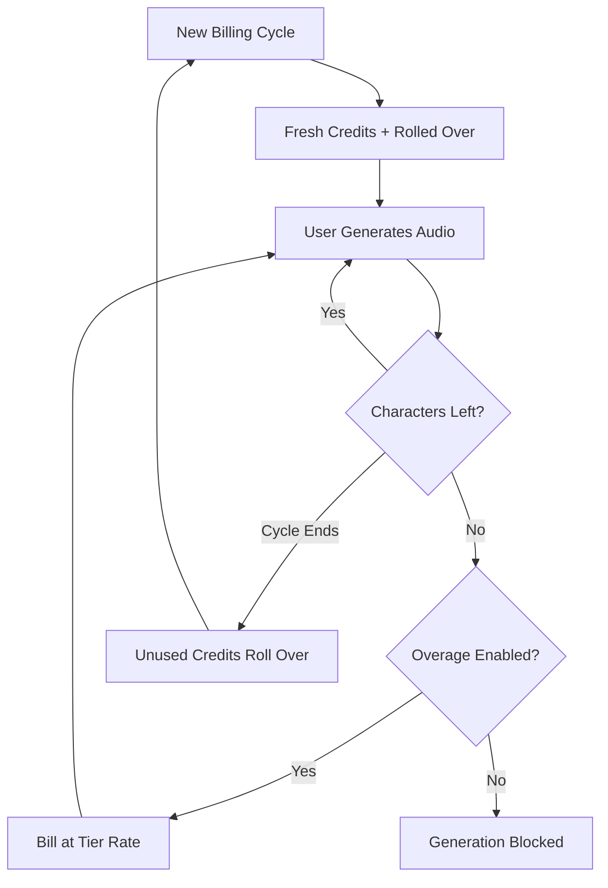

ElevenLabs ha conquistato una posizione dominante nel settore delle voci AI rendendo la propria fatturazione fluida quanto la sintesi vocale. Il modello si basa su una singola unità di valore: il carattere. Che tu stia generando testo in voce, clonando una voce o doppiando un video, consumi da un pool unificato di crediti carattere.

## Come fattura ElevenLabs

La struttura dei prezzi di ElevenLabs utilizza quote mensili fisse associate ai piani di abbonamento. Passando a piani superiori, gli utenti ottengono più caratteri e l'accesso a funzionalità più avanzate, come la clonazione vocale professionale o i diritti commerciali.

| Piano | Prezzo | Caratteri/mese | Tariffa utilizzi extra |
| :--- | :--- | :--- | :--- |
| Free | \$0 | 10.000 | Non disponibile |
| Starter | \$5/mese | 30.000 | ~\$0,30/1.000 caratteri |
| Creator | \$22/mese | 100.000 | ~\$0,24/1.000 caratteri |
| Pro | \$99/mese | 500.000 | ~\$0,15/1.000 caratteri |
| Scale | \$330/mese | 2.000.000 | ~\$0,10/1.000 caratteri |

1. **Prezzi basati sui caratteri**: i caratteri sono la valuta universale della piattaforma. Text-to-Speech, Dubbing e Voice Cloning attingono tutti dallo stesso saldo, semplificando il monitoraggio dell'utilizzo.
2. **Meccanismo di trasferimento**: i caratteri inutilizzati vengono trasferiti al ciclo di fatturazione successivo invece di scadere. ElevenLabs applica un limite per impedire l'accumulo infinito, assicurando che gli utenti conservino il valore del proprio abbonamento.
3. **Utilizzi extra a scaglioni**: gli utilizzi extra vengono gestiti in base al piano di abbonamento. Nei piani inferiori gli utilizzi extra sono disabilitati per impostazione predefinita, per maggiore sicurezza, mentre i piani superiori consentono di abilitare addebiti aggiuntivi per mantenere la continuità del servizio.

## Cosa lo rende unico

Diverse scelte strategiche rendono il modello di fatturazione di ElevenLabs particolarmente efficace nel fidelizzare gli utenti e incoraggiare gli upgrade.

- **Trasferimento dei caratteri**: i crediti trasferibili riducono l'ansia del tipo "usalo o perdilo", mantenendo l'investimento inutilizzato. In questo modo il valore dell'abbonamento resta invariato anche nei periodi di minore attività.
- **Prezzi degli utilizzi extra a scaglioni**: le tariffe degli utilizzi extra diminuiscono all'aumentare delle dimensioni del piano, creando un forte incentivo all'upgrade. Spesso gli utenti trovano i piani superiori più interessanti grazie al costo inferiore dell'utilizzo aggiuntivo.
- **Consumo unificato**: un singolo pool di caratteri per tutti i servizi elimina la complessità di gestire quote separate. Gli utenti devono monitorare un solo numero per comprendere la capacità residua.
- **Utilizzi extra attivabili**: gli utenti professionali possono abilitare gli utilizzi extra per garantire la continuità, mentre gli utenti occasionali beneficiano della sicurezza offerta da un limite rigido.



## Crea questo modello con Dodo Payments

Puoi replicare questo modello sofisticato usando la fatturazione basata sui crediti e il monitoraggio dell'utilizzo di Dodo Payments.

<Steps>
<Step title="Create a Custom Unit Credit Entitlement">
Per prima cosa, definisci l'unità "Characters", che fungerà da valuta della piattaforma.

1. Vai a **Entitlements** nel tuo dashboard Dodo.
2. Crea un nuovo **Credit Entitlement**.
3. Imposta **Credit Type** su **Custom Unit**.
4. Assegna all'unità il nome "Characters".
5. Imposta **Precision** su 0, poiché i caratteri sono sempre unità intere.
6. Imposta **Credit Expiry** su 30 giorni, in linea con il ciclo di fatturazione mensile.
7. Abilita **Rollover** con queste impostazioni:
    - **Max Rollover Percentage**: 100% (consente di trasferire tutti i caratteri inutilizzati).
    - **Rollover Timeframe**: 1 Month.
    - **Max Rollover Count**: 1 (i crediti possono essere trasferiti una volta, dopodiché scadono).
</Step>

<Step title="Create Tiered Subscription Products">
Crea cinque prodotti in abbonamento. Associa a ciascuno lo stesso entitlement "Characters", ma con configurazioni diverse per ogni livello.

| Prodotto | Prezzo | Crediti/ciclo | Utilizzi extra abilitati | Prezzo utilizzi extra (per 1.000 caratteri) |
| :--- | :--- | :--- | :--- | :--- |
| Free | \$0/mese | 10.000 | No | - |
| Starter | \$5/mese | 30.000 | Sì (attivabili) | \$0,30 |
| Creator | \$22/mese | 100.000 | Sì | \$0,24 |
| Pro | \$99/mese | 500.000 | Sì | \$0,15 |
| Scale | \$330/mese | 2.000.000 | Sì | \$0,10 |

Quando associ l'entitlement di crediti a ciascun prodotto, deseleziona **Import Default Credit Settings**. In questo modo puoi impostare il **Price Per Unit** specifico per gli utilizzi extra di quel livello. Imposta **Overage Behavior** su **Bill overage at billing** e configura una **Low Balance Threshold** pari al 10% della quota del livello.
</Step>

<Step title="Create a Usage Meter">
Il misuratore dell'utilizzo collega l'attività della tua applicazione al sistema di crediti.

1. Crea un nuovo misuratore denominato `tts.characters`.
2. Imposta **Aggregation** su **Sum**. In questo modo verrà sommata la proprietà `characters` di ogni evento inviato.
3. Collega questo misuratore all'entitlement di crediti "Characters".
4. Imposta **Meter units per credit** su 1. In questo modo un carattere utilizzato nell'app equivarrà a un credito detratto dal saldo.
</Step>

<Step title="Send Usage Events">
Integra il monitoraggio dell'utilizzo nel codice dell'applicazione. Ogni volta che un utente genera audio, invia un evento a Dodo.

```typescript
import DodoPayments from 'dodopayments';

async function trackGeneration(
  customerId: string,
  text: string, 
  service: 'tts' | 'dubbing' | 'cloning'
) {
  const characterCount = text.length;

  const client = new DodoPayments({
    bearerToken: process.env.DODO_PAYMENTS_API_KEY,
  });

  await client.usageEvents.ingest({
    events: [{
      event_id: `gen_${Date.now()}_${Math.random().toString(36).slice(2)}`,
      customer_id: customerId,
      event_name: 'tts.characters',
      timestamp: new Date().toISOString(),
      metadata: {
        characters: characterCount,
        service: service,
        voice_id: 'voice_abc123'
      }
    }]
  });
}
```

</Step>

<Step title="Handle Low Balance and Overage">
Usa i webhook per tenere aggiornati i tuoi utenti sul consumo dei caratteri.

```typescript
import DodoPayments from 'dodopayments';
import express from 'express';

const app = express();
app.use(express.raw({ type: 'application/json' }));

const client = new DodoPayments({
  bearerToken: process.env.DODO_PAYMENTS_API_KEY,
  webhookKey: process.env.DODO_PAYMENTS_WEBHOOK_KEY,
});

app.post('/webhooks/dodo', async (req, res) => {
  try {
    const event = client.webhooks.unwrap(req.body.toString(), {
      headers: {
        'webhook-id': req.headers['webhook-id'] as string,
        'webhook-signature': req.headers['webhook-signature'] as string,
        'webhook-timestamp': req.headers['webhook-timestamp'] as string,
      },
    });

    switch (event.type) {
      case 'credit.balance_low':
        await notifyUser(event.data.customer_id, 
          'You are running low on characters. Consider upgrading your plan for more characters and lower overage rates.'
        );
        break;
      case 'credit.deducted':
        await logUsage(event.data);
        break;
      case 'credit.overage_charged':
        await notifyUser(event.data.customer_id,
          'You have exceeded your character quota. Overage charges will appear on your next invoice.'
        );
        break;
    }

    res.json({ received: true });
  } catch (error) {
    res.status(401).json({ error: 'Invalid signature' });
  }
});
```

</Step>

<Step title="Create Checkout">
Quando un utente è pronto per abbonarsi, crea una sessione di checkout per il livello scelto.

```typescript
const session = await client.checkoutSessions.create({
  product_cart: [
    { product_id: 'prod_elevenlabs_pro', quantity: 1 }
  ],
  customer: { email: 'creator@example.com' },
  return_url: 'https://yourapp.com/dashboard'
});
```

</Step>
</Steps>

## Accelera con lo Stream Ingestion Blueprint

Per monitorare l'output audio insieme alla fatturazione basata sui caratteri, lo [Stream Ingestion Blueprint](/developer-resources/ingestion-blueprints/stream) offre un modo semplificato per misurare il consumo di larghezza di banda.

```bash
npm install @dodopayments/ingestion-blueprints
```

```typescript
import { Ingestion, trackStreamBytes } from '@dodopayments/ingestion-blueprints';

const ingestion = new Ingestion({
  apiKey: process.env.DODO_PAYMENTS_API_KEY,
  environment: 'live_mode',
  eventName: 'tts.audio_bytes',
});

// After generating audio, track the output size
const audioBuffer = await generateSpeech(text, voiceId);

await trackStreamBytes(ingestion, {
  customerId: customerId,
  bytes: audioBuffer.byteLength,
  metadata: {
    voice_id: voiceId,
    service: 'tts',
    format: 'mp3',
  },
});
```

Usa lo Stream Blueprint per monitorare la larghezza di banda audio insieme al sistema di crediti basato sui caratteri. In questo modo puoi conoscere i costi effettivi dell'infrastruttura per ogni generazione.

<Tip>
Lo Stream Blueprint supporta anche il batching per gli scenari ad alto volume. Consulta la [documentazione completa del blueprint](/developer-resources/ingestion-blueprints/stream) per scoprire modelli di utilizzo avanzati.
</Tip>

## Incentivo all'upgrade: prezzi degli utilizzi extra a scaglioni

La parte più brillante del modello di ElevenLabs è il modo in cui utilizza le tariffe degli utilizzi extra per incentivare gli upgrade. Rendendo più economico il costo per carattere nei piani superiori, sposta la domanda da "di quanto ho bisogno?" a "quanto posso risparmiare?".

| Livello | Caratteri inclusi | Utilizzo extra (per 1.000) | Costo effettivo a 500.000 caratteri |
| :--- | :--- | :--- | :--- |
| Creator | 100.000 | \$0,24 | \$22 + (400 * \$0,24) = \$118 |
| Pro | 500.000 | \$0,15 | \$99 (nessun utilizzo extra) |

Un utente che consuma regolarmente 500.000 caratteri con il piano Creator paga \$118 al mese tra abbonamento e utilizzi extra. Passando al piano Pro, lo stesso utilizzo è coperto a \$99, con un risparmio di \$19 al mese. La tariffa inferiore degli utilizzi extra nei piani superiori fa sì che, con l'aumentare dell'utilizzo, l'upgrade diventi la scelta finanziariamente più ovvia.

Con Dodo Payments, puoi implementare questo modello deselezionando la casella **Import Default Credit Settings** quando associ i crediti ai prodotti in abbonamento. In questo modo ottieni il pieno controllo sul **Price Per Unit** per ogni livello, consentendoti di premiare i clienti che spendono di più con le tariffe migliori.

## Funzionalità principali di Dodo utilizzate

<CardGroup cols={2}>
  <Card title="Credit-Based Billing" icon="coins" href="/features/credit-based-billing">
    Gestisci quote di caratteri, trasferimenti e scadenze.
  </Card>
  <Card title="Subscriptions" icon="calendar" href="/features/subscription">
    Configura i livelli ricorrenti che forniscono disponibilità mensili di caratteri.
  </Card>
  <Card title="Usage-Based Billing" icon="chart-line" href="/features/usage-based-billing/introduction">
    Monitora il consumo di caratteri in tempo reale tra i tuoi servizi.
  </Card>
  <Card title="Event Ingestion" icon="bolt" href="/features/usage-based-billing/event-ingestion">
    Invia dati di utilizzo ad alto volume a Dodo con latenza minima.
  </Card>
  <Card title="Webhooks" icon="webhook" href="/developer-resources/webhooks/intents/credit">
    Reagisci ai saldi ridotti e agli eventi di utilizzo extra in tempo reale.
  </Card>
  <Card title="Stream Ingestion Blueprint" icon="tower-broadcast" href="/developer-resources/ingestion-blueprints/stream">
    Monitora la larghezza di banda dello streaming audio per la fatturazione basata sull'utilizzo.
  </Card>
</CardGroup>
