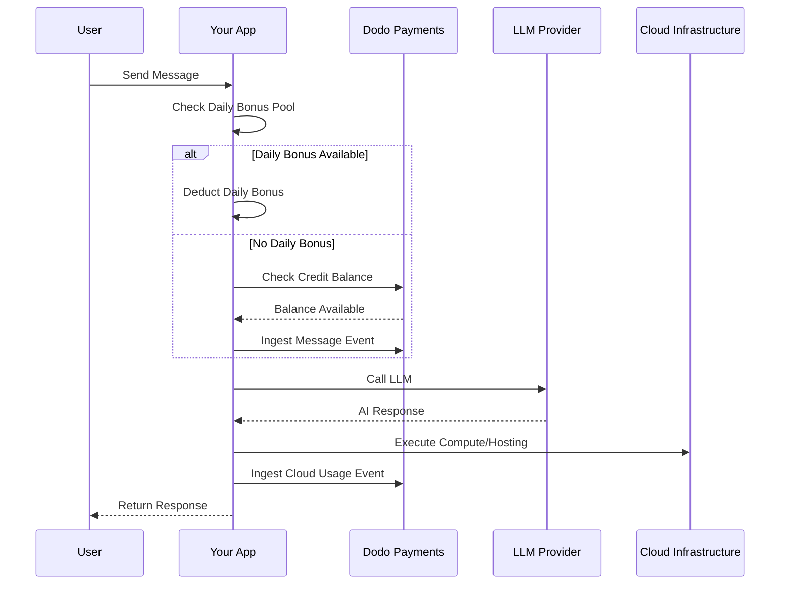

Lovable (lovable.dev) è un costruttore di app web AI che utilizza un modello di abbonamento basato su crediti. A differenza dei sistemi basati su token, Lovable semplifica l'esperienza utente addebitando un credito per messaggio. Questo modello combina una riserva mensile di crediti con un bonus giornaliero per incentivare l'interazione costante, consentendo allo stesso tempo un uso intensivo.

## Modello di Fatturazione di Lovable

Il prezzo di Lovable si basa su crediti di messaggi e fatturazione separata a consumo per l'infrastruttura cloud.

| Piano | Prezzo | Crediti Mensili | Bonus Giornaliero | Caratteristiche Principali |
| :--- | :--- | :--- | :--- | :--- |
| Gratis | \$0/mese | 0 | 5/giorno (fino a 30/mese) | Solo progetti pubblici |
| Pro | \$25/mese | 100 | 5/giorno (fino a 150/mese totali) | Ricariche on-demand, Cloud + AI a consumo, domini personalizzati |
| Business | \$50/mese | 100 | 5/giorno | SSO, spazio di lavoro del team, modelli di design, centro sicurezza |
| Enterprise | Personalizzato | Personalizzato | Personalizzato | SCIM, supporto dedicato, registri di controllo |

- **Abbonamento basato su crediti**: 1 credito = 1 messaggio/promemoria per l'AI.
- **Crediti condivisi tra utenti illimitati**: Riserva a livello di team, non per utente.
- **I crediti si azzerano ogni ciclo di fatturazione**: I crediti mensili si rinnovano al prosieguo del contratto.
- **Ricariche di crediti on-demand**: Gli utenti possono acquistare più crediti se li esauriscono.
- **Fatturazione Cloud + AI separata a consumo**: Fatturazione misurata per hosting e calcolo.
- **I crediti bonus giornalieri si azzerano ogni giorno**: Un flusso giornaliero di 5 crediti da usare o perdere.

## Cosa Lo Rende Unico

- **Semplicità basata sui messaggi**: 1 credito = 1 messaggio indipendentemente dalla complessità. Niente conteggio dei token o pesatura del modello.
- **Ibrido di flusso giornaliero + riserva mensile**: I 5 crediti bonus giornalieri creano un incentivo di interazione giornaliero, mentre i 100 crediti mensili consentono un uso intensivo.
- **Riserva condivisa a livello del team**: Crediti condivisi tra utenti illimitati a un prezzo fisso per team, non per sedile.
- **Fatturazione a due livelli**: Crediti per interazioni AI + fatturazione misurata separata per infrastruttura cloud.

## Costruisci Questo con Dodo Payments

Puoi replicare il modello ibrido di Lovable usando le autorizzazioni di credito e i contatori a consumo di Dodo Payments.

<Steps>
  <Step title="Create a Custom Unit Credit Entitlement">
    Definisci il sistema di crediti di messaggio nel tuo pannello di controllo Dodo Payments. Questa autorizzazione gestisce la riserva mensile di crediti.

    - **Tipo di Credito**: Unità Personalizzate
    - **Nome dell'Unità**: "Messaggi"
    - **Precisione**: 0
    - **Scadenza dei Crediti**: 30 giorni
    - **Sovrautilizzo**: Disabilitato (limite rigido quando i crediti raggiungono 0)
  </Step>

  <Step title="Create Subscription Products">
    Crea i tuoi piani e allega l'autorizzazione dei crediti. Per il piano Gratuito, gestirai il bonus giornaliero tramite la logica dell'applicazione.

    - **Gratis**: \$0/mese, 0 crediti (bonus giornaliero gestito dalla logica dell'app)
    - **Pro**: \$25/mese, 100 crediti/ciclo, allega autorizzazione dei crediti
    - **Business**: \$50/mese, 100 crediti/ciclo, allega autorizzazione dei crediti

    ```typescript
    import DodoPayments from 'dodopayments';

    const client = new DodoPayments({
      bearerToken: process.env.DODO_PAYMENTS_API_KEY,
    });

    const session = await client.checkoutSessions.create({
      product_cart: [
        { product_id: 'prod_lovable_pro', quantity: 1 }
      ],
      customer: { email: 'user@example.com' },
      return_url: 'https://lovable.dev/dashboard'
    });
    ```

  </Step>

  <Step title="Create a Usage Meter for Cloud + AI">
    Lovable fattura separatamente per l'infrastruttura cloud. Crea un contatore per tracciare questi costi.

    - **Nome del Contatore**: `cloud.compute_seconds`
    - **Aggregazione**: Somma sulla proprietà `compute_seconds`

    Allega questo contatore ai tuoi prodotti in abbonamento con prezzi per unità. Quando elabori l'uso, Dodo calcola il costo in base alle tue tariffe.

    ```typescript
    await client.usageEvents.ingest({
      events: [{
        event_id: `compute_${Date.now()}`,
        customer_id: 'cust_123',
        event_name: 'cloud.compute_seconds',
        timestamp: new Date().toISOString(),
        metadata: {
          compute_seconds: 3600,
          project_id: 'proj_abc'
        }
      }]
    });
    ```

  </Step>

  <Step title="Implement Daily Bonus Credits (Application Logic)">
    Il flusso bonus giornaliero è gestito a livello applicativo. Puoi usare un cron job per concedere questi crediti o tracciarli separatamente nel tuo database.

    Per tracciare l'uso di questi crediti bonus in Dodo senza esaurire immediatamente il saldo dell'autorizzazione principale, puoi usare un nome evento separato o gestire la logica nella tua app per controllare prima la riserva bonus.

    ```typescript
    // Example cron job logic (pseudo-code)
    // Every day at midnight UTC:
    // 1. Reset 'daily_bonus_used' to 0 for all users in your DB
    
    // When a user sends a message:
    async function handleMessage(userId: string) {
      const user = await db.users.findUnique({ where: { id: userId } });
      
      if (user.daily_bonus_used < 5) {
        // Use daily bonus
        await db.users.update({
          where: { id: userId },
          data: { daily_bonus_used: { increment: 1 } }
        });
        // Track for analytics but don't deduct from Dodo credits yet
        await client.usageEvents.ingest({
          events: [{
            event_id: `msg_bonus_${Date.now()}`,
            customer_id: userId,
            event_name: 'ai.message.bonus',
            timestamp: new Date().toISOString(),
            metadata: { type: 'daily_bonus' }
          }]
        });
      } else {
        // Deduct from Dodo credit entitlement
        await client.usageEvents.ingest({
          events: [{
            event_id: `msg_${Date.now()}`,
            customer_id: userId,
            event_name: 'ai.message',
            timestamp: new Date().toISOString(),
            metadata: { type: 'subscription_credit' }
          }]
        });
      }
    }
    ```

  </Step>

  <Step title="Send Usage Events for Messages">
    Traccia ogni messaggio AI come un evento di utilizzo. Collega l'evento `ai.message` all'autorizzazione crediti "Messaggi" nel pannello di controllo Dodo.

    ```typescript
    await client.usageEvents.ingest({
      events: [{
        event_id: `msg_${Date.now()}`,
        customer_id: 'cust_123',
        event_name: 'ai.message',
        timestamp: new Date().toISOString(),
        metadata: {
          content_length: 450,
          project_id: 'proj_abc',
          feature_type: 'editor'
        }
      }]
    });
    ```

  </Step>

  <Step title="Handle Webhooks for Low Balance">
    Notifica agli utenti quando i loro crediti stanno per finire in modo che possano ricaricare o eseguire l'upgrade.

    ```typescript
    import DodoPayments from 'dodopayments';
    import express from 'express';

    const app = express();
    app.use(express.raw({ type: 'application/json' }));

    const client = new DodoPayments({
      bearerToken: process.env.DODO_PAYMENTS_API_KEY,
      webhookKey: process.env.DODO_PAYMENTS_WEBHOOK_KEY,
    });

    app.post('/webhooks/dodo', async (req, res) => {
      try {
        const event = client.webhooks.unwrap(req.body.toString(), {
          headers: {
            'webhook-id': req.headers['webhook-id'] as string,
            'webhook-signature': req.headers['webhook-signature'] as string,
            'webhook-timestamp': req.headers['webhook-timestamp'] as string,
          },
        });

        if (event.type === 'credit.balance_low') {
          const { customer_id, available_balance } = event.data;
          await notifyUser(customer_id, `Your balance is low: ${available_balance} messages left.`);
        }

        res.json({ received: true });
      } catch (error) {
        res.status(401).json({ error: 'Invalid signature' });
      }
    });
    ```

  </Step>
</Steps>

## Accelera con il Blueprint di Ingestione LLM

Il [Blueprint di Ingestione LLM](/developer-resources/ingestion-blueprints/llm) semplifica il tracciamento avvolgendo il tuo client AI.

```typescript
import { createLLMTracker } from '@dodopayments/ingestion-blueprints';
import OpenAI from 'openai';

const tracker = createLLMTracker({
  apiKey: process.env.DODO_PAYMENTS_API_KEY,
  environment: 'live_mode',
  eventName: 'ai.message',
});

const trackedClient = tracker.wrap({
  client: new OpenAI(),
  customerId: 'cust_123',
});

// Automatically tracks the message and deducts 1 credit (if configured)
await trackedClient.chat.completions.create({
  model: 'gpt-4o',
  messages: [{ role: 'user', content: 'Build a landing page' }],
});
```

<Tip>
  Dai un'occhiata alla [documentazione completa del blueprint](/developer-resources/ingestion-blueprints/llm) per maggiori dettagli sul tracciamento automatico.
</Tip>

## Panoramica Dell'Architettura



## Caratteristiche Chiave di Dodo Utilizzate

Esplora le caratteristiche che rendono possibile questa implementazione.

<CardGroup cols={2}>
  <Card title="Credit-Based Billing" icon="coins" href="/features/credit-based-billing">
    Gestisci i crediti di messaggio e le riserve condivise del team.
  </Card>
  <Card title="Subscriptions" icon="calendar" href="/features/subscription">
    Imposta piani ricorrenti per i livelli Pro e Business.
  </Card>
  <Card title="Usage-Based Billing" icon="chart-line" href="/features/usage-based-billing/introduction">
    Misura separatamente l'uso dell'infrastruttura cloud rispetto ai crediti AI.
  </Card>
  <Card title="Event Ingestion" icon="bolt" href="/features/usage-based-billing/event-ingestion">
    Invia eventi di messaggi e calcoli ad alto volume a Dodo.
  </Card>
  <Card title="Webhooks" icon="webhook" href="/developer-resources/webhooks/intents/credit">
    Automatizza le notifiche per saldi di credito bassi.
  </Card>
  <Card title="LLM Ingestion Blueprint" icon="brain-circuit" href="/developer-resources/ingestion-blueprints/llm">
    Semplifica il tracciamento dell'uso dell'AI con integrazioni pre-costruite.
  </Card>
</CardGroup>
