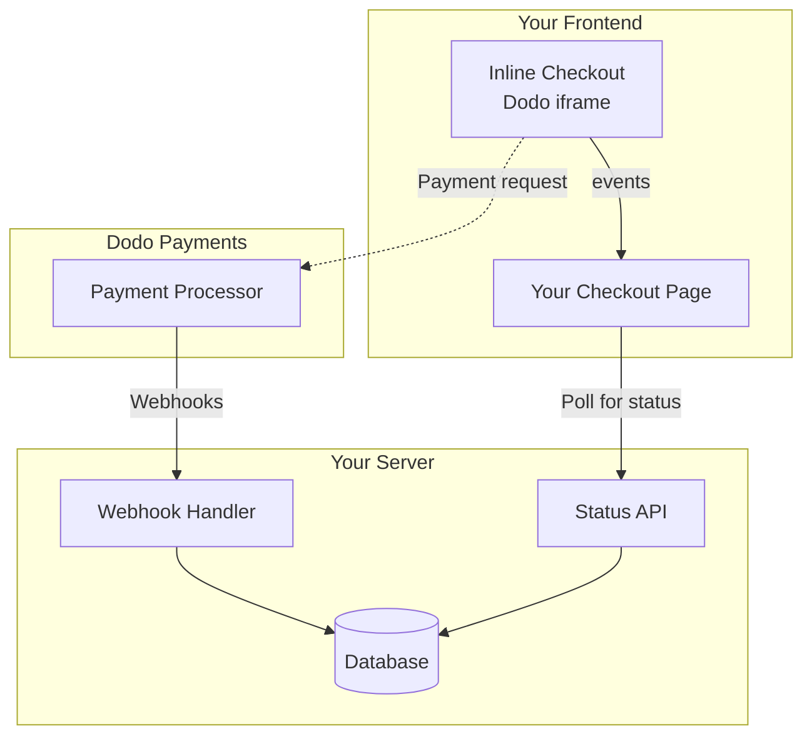

## Panoramica

Il checkout inline ti consente di creare esperienze di checkout completamente integrate che si fondono perfettamente con il tuo sito web o applicazione. A differenza del [checkout overlay](/developer-resources/overlay-checkout), che si apre come un modale sopra la tua pagina, il checkout inline incorpora il modulo di pagamento direttamente nel layout della tua pagina.

Utilizzando il checkout inline, puoi:

- Creare esperienze di checkout completamente integrate con la tua app o sito web
- Consentire a Dodo Payments di catturare in modo sicuro le informazioni sui clienti e sui pagamenti in un frame di checkout ottimizzato
- Visualizzare articoli, totali e altre informazioni da Dodo Payments sulla tua pagina
- Utilizzare metodi e eventi SDK per costruire esperienze di checkout avanzate

<Frame>
    
</Frame>

## Come Funziona

Il checkout inline funziona incorporando un frame sicuro di Dodo Payments nel tuo sito web o app.

Il frame di checkout gestisce la raccolta delle informazioni sui clienti e la cattura dei dettagli di pagamento. La tua pagina visualizza l'elenco degli articoli, i totali e le opzioni per modificare ciò che è presente nel checkout. L'SDK consente alla tua pagina e al frame di checkout di interagire tra loro.

Dodo Payments crea automaticamente un abbonamento quando un checkout viene completato, pronto per essere attivato da te.

<Note>
Il frame del checkout inline gestisce in modo sicuro tutte le informazioni di pagamento sensibili, garantendo la conformità PCI senza certificazioni aggiuntive da parte tua.
</Note>

## Cosa Rende un Buon Checkout Inline?

È importante che i clienti sappiano da chi stanno acquistando, cosa stanno acquistando e quanto stanno pagando.

Per costruire un checkout inline che sia conforme e ottimizzato per la conversione, la tua implementazione deve includere:

<Frame caption="Example inline checkout layout showing required elements">
    
</Frame>

1. **Informazioni ricorrenti**: Se ricorrente, con quale frequenza si ripete e il totale da pagare al rinnovo. Se è una prova, quanto dura la prova.
2. **Descrizioni degli articoli**: Una descrizione di ciò che viene acquistato.
3. **Totali delle transazioni**: Totali delle transazioni, inclusi subtotale, totale delle tasse e totale generale. Assicurati di includere anche la valuta.
4. **Footer di Dodo Payments**: L'intero frame di checkout inline, incluso il footer del checkout che contiene informazioni su Dodo Payments, i nostri termini di vendita e la nostra politica sulla privacy.
5. **Politica di rimborso**: Un link alla tua politica di rimborso, se differente dalla politica standard di rimborso di Dodo Payments.

<Warning>
Mostra sempre l'intero frame del checkout inline, compreso il footer. Rimuovere o nascondere le informazioni legali viola i requisiti di conformità.
</Warning>

## Percorso del Cliente

Il flusso di checkout è determinato dalla configurazione della tua sessione di checkout. A seconda di come configuri la sessione di checkout, i clienti vivranno un checkout che può presentare tutte le informazioni su una singola pagina o attraverso più passaggi.

<Steps>
<Step title="Customer opens checkout">

È possibile aprire il checkout inline passando articoli o una transazione esistente. Utilizza l'SDK per mostrare e aggiornare le informazioni sulla pagina e i metodi SDK per aggiornare gli articoli in base all'interazione del cliente.
    

</Step>

<Step title="Customer enters their details">

Il checkout inline chiede prima ai clienti di inserire il proprio indirizzo email, selezionare il proprio paese e (dove richiesto) inserire il proprio codice postale. Questo passaggio raccoglie tutte le informazioni necessarie per determinare le tasse e le opzioni di pagamento disponibili.

Puoi precompilare i dettagli del cliente e presentare indirizzi salvati per semplificare l'esperienza.

</Step>

<Step title="Customer selects payment method">

Dopo aver inserito i propri dettagli, ai clienti vengono presentati i metodi di pagamento disponibili e il modulo di pagamento. Le opzioni possono includere carta di credito o debito, PayPal, Apple Pay, Google Pay e altri metodi di pagamento locali in base alla loro posizione.

Visualizza i metodi di pagamento salvati se disponibili per accelerare il checkout.


</Step>

<Step title="Checkout completed">

Dodo Payments instrada ogni pagamento al miglior acquirente per quella vendita per ottenere la migliore possibilità di successo. I clienti entrano in un flusso di successo che puoi costruire.


</Step>

<Step title="Dodo Payments creates subscription">

Dodo Payments crea automaticamente un abbonamento per il cliente, pronto per essere attivato da te. Il metodo di pagamento utilizzato dal cliente viene mantenuto in archivio per i rinnovi o le modifiche all'abbonamento.


</Step>
</Steps>

## Inizio Veloce

Inizia con il Checkout Inline di Dodo Payments in poche righe di codice:

```typescript
import { DodoPayments } from "dodopayments-checkout";

// Initialize the SDK for inline mode
DodoPayments.Initialize({
  mode: "test",
  displayType: "inline",
  onEvent: (event) => {
    console.log("Checkout event:", event);
  },
});

// Open checkout in a specific container
DodoPayments.Checkout.open({
  checkoutUrl: "https://test.checkout.dodopayments.com/session/cks_123",
  elementId: "dodo-inline-checkout" // ID of the container element
});
```

<Tip>
Assicurati di avere un elemento contenitore con il corrispondente `id` sulla tua pagina: `<div id="dodo-inline-checkout"></div>`.
</Tip>

## Guida all'Integrazione Passo-Passo

<Steps>
<Step title="Install the SDK">

Installa l'SDK di Dodo Payments Checkout:

<CodeGroup>

```bash npm
npm install dodopayments-checkout
```

```bash yarn
yarn add dodopayments-checkout
```

```bash pnpm
pnpm add dodopayments-checkout
```

</CodeGroup>

</Step>

<Step title="Initialize the SDK for Inline Display">

Inizializza l'SDK e specifica `displayType: 'inline'`. Dovresti anche ascoltare l'evento `checkout.breakdown` per aggiornare la tua UI con i calcoli in tempo reale di tasse e totali.

```typescript
import { DodoPayments } from "dodopayments-checkout";

DodoPayments.Initialize({
  mode: "test",
  displayType: "inline",
  onEvent: (event) => {
    if (event.event_type === "checkout.breakdown") {
      const breakdown = event.data?.message;
      // Update your UI with breakdown.subTotal, breakdown.tax, breakdown.total, etc.
    }
  },
});
```

</Step>

<Step title="Create a Container Element">

Aggiungi un elemento al tuo HTML dove il frame del checkout sarà iniettato:

```html
<div id="dodo-inline-checkout"></div>
```

</Step>

<Step title="Open the Checkout">

Richiama `DodoPayments.Checkout.open()` con `checkoutUrl` e `elementId` del tuo contenitore:

```typescript
DodoPayments.Checkout.open({
  checkoutUrl: "https://test.checkout.dodopayments.com/session/cks_123",
  elementId: "dodo-inline-checkout"
});
```

</Step>

<Step title="Test Your Integration">

1. Avvia il tuo server di sviluppo:

```bash
npm run dev
```

2. Testa il flusso di checkout:
   - Inserisci i tuoi dettagli email e indirizzo nel frame inline.
   - Verifica che il tuo riepilogo ordine personalizzato si aggiorni in tempo reale.
   - Testa il flusso di pagamento utilizzando credenziali di test.
   - Conferma che i reindirizzamenti funzionino correttamente.

<Check>
Dovresti vedere eventi `checkout.breakdown` registrati nella console del browser se hai aggiunto un console log nel callback `onEvent`.
</Check>

</Step>

<Step title="Go Live">

Quando sei pronto per la produzione:

1. Cambia la modalità in `'live'`:

```typescript
DodoPayments.Initialize({
  mode: "live",
  displayType: "inline",
  onEvent: (event) => {
    // Handle events
  }
});
```

2. Aggiorna i tuoi URL di checkout per utilizzare sessioni di checkout live dal tuo backend.
3. Testa il flusso completo in produzione.

</Step>
</Steps>

## Esempio Completo in React

Questo esempio dimostra come implementare un riepilogo ordini personalizzato accanto al checkout inline, mantenendoli sincronizzati tramite l'evento `checkout.breakdown`.

```tsx
"use client";

import { useEffect, useState } from 'react';
import { DodoPayments, CheckoutBreakdownData } from 'dodopayments-checkout';

export default function CheckoutPage() {
  const [breakdown, setBreakdown] = useState<Partial<CheckoutBreakdownData>>({});

  useEffect(() => {
    // 1. Initialize the SDK
    DodoPayments.Initialize({
      mode: 'test',
      displayType: 'inline',
      onEvent: (event) => {
        // 2. Listen for the 'checkout.breakdown' event
        if (event.event_type === "checkout.breakdown") {
          const message = event.data?.message as CheckoutBreakdownData;
          if (message) setBreakdown(message);
        }
      }
    });

    // 3. Open the checkout in the specified container
    DodoPayments.Checkout.open({
      checkoutUrl: 'https://test.checkout.dodopayments.com/session/cks_123',
      elementId: 'dodo-inline-checkout'
    });

    return () => DodoPayments.Checkout.close();
  }, []);

  const format = (amt: number | null | undefined, curr: string | null | undefined) => 
    amt != null && curr ? `${curr} ${(amt/100).toFixed(2)}` : '0.00';

  const currency = breakdown.currency ?? breakdown.finalTotalCurrency ?? '';

  return (
    <div className="flex flex-col md:flex-row min-h-screen">
      {/* Left Side - Checkout Form */}
      <div className="w-full md:w-1/2 flex items-center">
        <div id="dodo-inline-checkout" className='w-full' />
      </div>

      {/* Right Side - Custom Order Summary */}
      <div className="w-full md:w-1/2 p-8 bg-gray-50">
        <h2 className="text-2xl font-bold mb-4">Order Summary</h2>
        <div className="space-y-2">
          {breakdown.subTotal && (
            <div className="flex justify-between">
              <span>Subtotal</span>
              <span>{format(breakdown.subTotal, currency)}</span>
            </div>
          )}
          {breakdown.discount && (
            <div className="flex justify-between">
              <span>Discount</span>
              <span>{format(breakdown.discount, currency)}</span>
            </div>
          )}
          {breakdown.tax != null && (
            <div className="flex justify-between">
              <span>Tax</span>
              <span>{format(breakdown.tax, currency)}</span>
            </div>
          )}
          <hr />
          {(breakdown.finalTotal ?? breakdown.total) && (
            <div className="flex justify-between font-bold text-xl">
              <span>Total</span>
              <span>{format(breakdown.finalTotal ?? breakdown.total, breakdown.finalTotalCurrency ?? currency)}</span>
            </div>
          )}
        </div>
      </div>
    </div>
  );
}

```

## Riferimento API

### Configurazione

#### Opzioni di Inizializzazione

```typescript
interface InitializeOptions {
  mode: "test" | "live";
  displayType: "inline"; // Required for inline checkout
  onEvent: (event: CheckoutEvent) => void;
}
```

| Opzione | Tipo | Obbligatorio | Descrizione |
|--------|------|----------|-------------|
| `mode` | `"test" \| "live"` | Sì | Modalità dell'ambiente. |
| `displayType` | `"inline" \| "overlay"` | Sì | Deve essere impostato su `"inline"` per incorporare il checkout. |
| `onEvent` | `function` | Sì | Funzione di callback per gestire gli eventi di checkout. |

#### Opzioni di Checkout

```typescript
export type FontSize = "xs" | "sm" | "md" | "lg" | "xl" | "2xl";
export type FontWeight = "normal" | "medium" | "bold" | "extraBold";

interface CheckoutOptions {
  checkoutUrl: string;
  elementId: string; // Required for inline checkout
  options?: {
    showTimer?: boolean;
    showSecurityBadge?: boolean;
    payButtonText?: string;
    fontSize?: FontSize;
    fontWeight?: FontWeight;
  };
}
```

| Opzione | Tipo | Necessario | Descrizione |
|--------|------|----------|-------------|
| `checkoutUrl` | `string` | Sì | URL della sessione di checkout. |
| `elementId` | `string` | Sì | Il `id` dell'elemento DOM dove il checkout dovrebbe essere visualizzato. |
| `options.showTimer` | `boolean` | No | Mostra o nasconde il timer del checkout. Il valore predefinito è `true`. Quando disabilitato, si riceverà l'evento `checkout.link_expired` quando la sessione scade. |
| `options.showSecurityBadge` | `boolean` | No | Mostra o nasconde il badge di sicurezza. Il valore predefinito è `true`. |
| `options.payButtonText` | `string` | No | Testo personalizzato da visualizzare sul pulsante di pagamento. |
| `options.fontSize` | `FontSize` | No | Dimensione globale del carattere per il checkout. |
| `options.fontWeight` | `FontWeight` | No | Peso globale del carattere per il checkout. |

### Metodi

#### Apri Checkout

Apre il frame di checkout nel contenitore specificato.

```typescript
DodoPayments.Checkout.open({
  checkoutUrl: "https://test.checkout.dodopayments.com/session/cks_123",
  elementId: "dodo-inline-checkout"
});
```

Puoi anche passare opzioni aggiuntive per personalizzare il comportamento del checkout:

```typescript
DodoPayments.Checkout.open({
  checkoutUrl: "https://test.checkout.dodopayments.com/session/cks_123",
  elementId: "dodo-inline-checkout",
  options: {
    showTimer: false,
    showSecurityBadge: false,
    payButtonText: "Pay Now",
  },
});
```

#### Chiudi Checkout

Rimuove programmaticamente il frame del checkout e pulisce i listener di eventi.

```typescript
DodoPayments.Checkout.close();
```

#### Verifica Stato

Restituisce se il frame del checkout è attualmente caricato.

```typescript
const isOpen = DodoPayments.Checkout.isOpen();
// Returns: boolean
```

### Eventi

L'SDK fornisce eventi in tempo reale tramite il callback `onEvent`. Per il checkout inline, `checkout.breakdown` è particolarmente utile per sincronizzare la tua UI.

| Tipo di Evento | Descrizione |
|------------|-------------|
| `checkout.opened` | Il frame del checkout è stato caricato. |
| `checkout.form_ready` | Il modulo di checkout è pronto per ricevere input dall'utente. Utile per nascondere stati di caricamento e mostrare l'interfaccia utente del checkout. |
| `checkout.breakdown` | Scattato quando i prezzi, le tasse o gli sconti vengono aggiornati. |
| `checkout.customer_details_submitted` | I dati del cliente sono stati inviati. |
| `checkout.pay_button_clicked` | Scattato quando il cliente clicca sul pulsante di pagamento. Utile per l'analisi e il monitoraggio dei funnel di conversione. |
| `checkout.redirect` | Il checkout eseguirà un reindirizzamento (ad es., verso una pagina della banca). |
| `checkout.error` | Si è verificato un errore durante il checkout. |
| `checkout.link_expired` | Scattato quando la sessione di checkout scade. Si riceve solo quando `showTimer` è impostato su `false`. |

#### Dati Breakdown del Checkout

L'evento `checkout.breakdown` fornisce i seguenti dati:

```typescript
interface CheckoutBreakdownData {
  subTotal?: number;          // Amount in cents
  discount?: number;         // Amount in cents
  tax?: number;              // Amount in cents
  total?: number;            // Amount in cents
  currency?: string;         // e.g., "USD"
  finalTotal?: number;       // Final amount including adjustments
  finalTotalCurrency?: string; // Currency for the final total
}
```

#### Comprensione dell'Evento Breakdown

L'evento `checkout.breakdown` è il modo principale per mantenere l'interfaccia utente della tua applicazione sincronizzata con lo stato del checkout di Dodo Payments.

**Quando si attiva:**
- **All'inizializzazione**: Immediatamente dopo che il frame del checkout è stato caricato e pronto.
- **Al cambio di indirizzo**: Ogni volta che il cliente seleziona un paese o inserisce un codice postale che richiede un ricalcolo delle tasse.

**Dettagli dei Campi:**

| Campo | Descrizione |
|-------|-------------|
| `subTotal` | La somma di tutte le voci nella sessione prima dell'applicazione di sconti o imposte. |
| `discount` | Il valore totale di tutti gli sconti applicati. |
| `tax` | L'importo dell'imposta calcolato. In modalità `inline`, questo valore viene aggiornato dinamicamente mentre l'utente interagisce con i campi dell'indirizzo. |
| `total` | Il risultato matematico di `subTotal - discount + tax` nella valuta di base della sessione. |
| `currency` | Il codice valuta ISO (ad es., `"USD"`) per i valori standard di subtotale, sconto e imposta. |
| `finalTotal` | L'importo effettivo addebitato al cliente. Questo può includere ulteriori adeguamenti del tasso di cambio o commissioni relative ai metodi di pagamento locali che non fanno parte della ripartizione di base del prezzo. |
| `finalTotalCurrency` | La valuta con cui il cliente sta effettivamente pagando. Può differire da `currency` se la [parità del potere d'acquisto](/features/purchasing-power-parity) o la conversione nella valuta locale è attiva. |

**Suggerimenti Chiave per l'Integrazione:**

1.  **Formattazione Valuta**: I prezzi sono sempre restituiti come interi nell'unità di valuta più piccola (ad esempio, centesimi per USD, yen per JPY). Per visualizzarli, dividere per 100 (o la potenza di 10 appropriata) o utilizzare una libreria di formattazione come `Intl.NumberFormat`.
2.  **Gestione degli Stati Iniziali**: Quando il checkout si carica per la prima volta, `tax` e `discount` possono essere `0` o `null` fino a quando l'utente non fornisce le proprie informazioni di fatturazione o applica un codice. La tua interfaccia utente dovrebbe gestire questi stati con grazia (ad esempio, mostrando un trattino `—` o nascondendo la riga).
3.  **Il "Totale Finale" vs "Totale"**: Mentre `total` ti offre il calcolo standard del prezzo, `finalTotal` è la fonte di verità per la transazione. Se `finalTotal` è presente, riflette esattamente cosa verrà addebitato alla carta del cliente, inclusi eventuali aggiustamenti dinamici.
4.  **Feedback in Tempo Reale**: Utilizza il campo `tax` per mostrare agli utenti che le tasse vengono calcolate in tempo reale. Questo fornisce un aspetto "live" alla tua pagina di checkout e riduce l'attrito durante il passaggio di inserimento indirizzo.

## Opzioni di Implementazione

### Installazione con Gestore Pacchetti

Installa tramite npm, yarn o pnpm come mostrato nella [Guida all'Integrazione Passo-Passo](#step-by-step-integration-guide).

### Implementazione via CDN

Per un'integrazione rapida senza un passaggio di build, puoi usare il nostro CDN:

```html
<!DOCTYPE html>
<html lang="en">
<head>
    <meta charset="UTF-8">
    <meta name="viewport" content="width=device-width, initial-scale=1.0">
    <title>Dodo Payments Inline Checkout</title>
    
    <!-- Load DodoPayments -->
    <script src="https://cdn.jsdelivr.net/npm/dodopayments-checkout@latest/dist/index.js"></script>
    <script>
        // Initialize the SDK
        DodoPaymentsCheckout.DodoPayments.Initialize({
            mode: "test",
            displayType: "inline",
            onEvent: (event) => {
                console.log('Checkout event:', event);
            }
        });
    </script>
</head>
<body>
    <div id="dodo-inline-checkout"></div>

    <script>
        // Open the checkout
        DodoPaymentsCheckout.DodoPayments.Checkout.open({
            checkoutUrl: "https://test.checkout.dodopayments.com/session/cks_123",
            elementId: "dodo-inline-checkout"
        });
    </script>
</body>
</html>
```

## Aggiorna Metodo di Pagamento

Il checkout inline supporta **aggiornamenti dei metodi di pagamento** per gli abbonamenti. Quando un cliente deve aggiornare il proprio metodo di pagamento, sia per un abbonamento attivo che per riattivare un abbonamento sospeso, puoi rendere disponibile il flusso di aggiornamento direttamente all'interno del layout della tua pagina.

### Come Funziona

1. Chiama l'[API di Aggiornamento Metodo di Pagamento](/features/subscription#update-payment-method-for-active-subscription) per ottenere un `payment_link`:

```typescript
const response = await client.subscriptions.updatePaymentMethod('sub_123', {
  payment_method: { type: 'new', return_url: 'https://example.com/return' }
});
```

2. Passa l'`payment_link` restituito come `checkoutUrl` per aprire il checkout inline:

```typescript
DodoPayments.Checkout.open({
  checkoutUrl: response.payment_link,
  elementId: "dodo-inline-checkout"
});
```

Il frame inline visualizza solo il modulo per la raccolta del metodo di pagamento. I clienti possono inserire nuovi dettagli delle carte o selezionare un metodo di pagamento salvato senza lasciare la tua pagina.

### Per Abbonamenti Sospesi

Quando si aggiorna il metodo di pagamento per un abbonamento in stato `on_hold`, Dodo Payments crea automaticamente un addebito per eventuali importi residui. Monitora i webhook `payment.succeeded` e `subscription.active` per confermare la riattivazione.

```typescript
const response = await client.subscriptions.updatePaymentMethod('sub_123', {
  payment_method: { type: 'new', return_url: 'https://example.com/return' }
});

if (response.payment_id) {
  // Charge created for remaining dues
  // Open inline checkout for payment collection
  DodoPayments.Checkout.open({
    checkoutUrl: response.payment_link,
    elementId: "dodo-inline-checkout"
  });
}
```

<Tip>
Puoi anche utilizzare un metodo di pagamento salvato esistente invece di raccogliere nuovi dettagli passando `type: 'existing'` con un `payment_method_id` all'API di Aggiornamento Metodo di Pagamento.
</Tip>

## Gestione Errori

L'SDK fornisce informazioni dettagliate sugli errori attraverso il sistema degli eventi. Implementa sempre un'adeguata gestione degli errori nel tuo callback `onEvent`:

```typescript
DodoPayments.Initialize({
  mode: "test",
  displayType: "inline",
  onEvent: (event: CheckoutEvent) => {
    if (event.event_type === "checkout.error") {
      console.error("Checkout error:", event.data?.message);
      // Handle error appropriately
    }
  }
});
```

<Warning>
Gestisci sempre l'evento `checkout.error` per fornire una buona esperienza utente quando si verificano problemi.
</Warning>

## Best Practices

1. **Design Reattivo**: Assicurati che il tuo elemento contenitore abbia abbastanza larghezza e altezza. L'iframe si espanderà tipicamente per riempire il suo contenitore.
2. **Sincronizzazione**: Usa l'evento `checkout.breakdown` per mantenere il tuo riepilogo ordine personalizzato o le tabelle dei prezzi sincronizzate con ciò che l'utente vede nel frame di checkout.
3. **Stati Skeleton**: Mostra un indicatore di caricamento nel tuo contenitore fino a quando l'evento `checkout.opened` viene attivato.
4. **Pulizia**: Chiama `DodoPayments.Checkout.close()` quando il tuo componente viene smontato per pulire l'iframe e i listener di eventi.

<Info>
Per le implementazioni in modalità scura, si consiglia di utilizzare `#0d0d0d` come colore di sfondo per un'integrazione visiva ottimale con il frame di checkout inline.
</Info>

## Validazione dello Stato di Pagamento

<Warning>
Non affidarti unicamente agli eventi di checkout inline per determinare il successo o il fallimento del pagamento. Implementa sempre una validazione server-side utilizzando webhook e/o polling.
</Warning>

### Perché la Validazione Server-Side è Essenziale

Sebbene gli eventi di checkout inline forniscano feedback in tempo reale, non dovrebbero **mai** essere la tua unica fonte di verità per lo stato dei pagamenti. Problemi di rete, crash del browser o chiusura della pagina da parte degli utenti possono causare la perdita di eventi. Per garantire una valida verifica del pagamento:

1. **Il tuo server dovrebbe ascoltare gli eventi webhook** - Dodo Payments invia webhook per le modifiche di stato del pagamento
2. **Implementa un meccanismo di polling** - Il tuo frontend dovrebbe eseguire il polling del tuo server per aggiornamenti di stato
3. **Combina entrambi gli approcci** - Usa i webhook come fonte principale e il polling come fallback

### Architettura Raccomandata



### Passaggi di Implementazione

**1. Ascolta gli eventi di checkout** - Quando l'utente clicca su paga, inizia a prepararti per verificare lo stato:

```typescript
onEvent: (event) => {
  if (event.event_type === 'checkout.pay_button_clicked') {
    // Start polling your server for confirmed status
    startPolling();
  }
}
```

**2. Polling del tuo server** - Crea un endpoint che controlla il tuo database per lo stato del pagamento (aggiornato dai webhook):

```typescript
// Poll every 2 seconds until status is confirmed
const interval = setInterval(async () => {
  const { status } = await fetch(`/api/payments/${paymentId}/status`).then(r => r.json());
  if (status === 'succeeded' || status === 'failed') {
    clearInterval(interval);
    handlePaymentResult(status);
  }
}, 2000);
```

**3. Gestisci i webhook lato server** - Aggiorna il tuo database quando Dodo invia i webhook `payment.succeeded` o `payment.failed`. Vedi la nostra [documentazione sui Webhook](/developer-resources/webhooks) per i dettagli.

## Risoluzione dei Problemi

<AccordionGroup>
<Accordion title="Checkout frame is not appearing">
- Verifica che `elementId` corrisponda al `id` di un `div` che esiste realmente nel DOM.
- Assicurati che `displayType: 'inline'` sia passato a `Initialize`.
- Controlla che `checkoutUrl` sia valido.
</Accordion>

<Accordion title="Taxes are not updating in my UI">
- Assicurati di ascoltare l'evento `checkout.breakdown`.
- Le tasse sono calcolate solo dopo che l'utente inserisce un paese e un codice postale validi nel frame del checkout.
</Accordion>
</AccordionGroup>

## Abilitazione dei Portafogli Digitali

Per informazioni dettagliate su come configurare Apple Pay, Google Pay e altri portafogli digitali, vedere la pagina sui <a href="/features/payment-methods/digital-wallets">Portafogli Digitali</a>.

### Configurazione Rapida per Apple Pay

<Info>
La verifica del dominio è richiesta solo per il **checkout inline (embedded)**. Non è richiesta per il checkout hosted.
</Info>

<Warning>
Apple Pay non è disponibile per il checkout overlay.
</Warning>

Apple Pay viene verificato per ogni dominio dalla dashboard.

<Steps>
<Step title="Open Wallet domains">
Vai a **Settings → Payment Methods** e, nella riga **Apple Pay**, fai clic su **Manage domains**.

<Frame caption="Open Wallet domains from the Apple Pay row">
  
</Frame>
</Step>

<Step title="Download the domain association file">
Dal pannello Wallet domains, scarica il file di associazione.

<Frame caption="Download the Apple Pay domain association file">
  
</Frame>
</Step>

<Step title="Register your domain">
Fai clic su **Register domain** e inserisci il dominio in cui incorpori il checkout inline (ad esempio `shop.example.com`), quindi fai clic su **Continue**.

<Frame caption="Register the domain where you embed inline checkout">
  
</Frame>
</Step>

<Step title="Host the file on your domain">
Ospitalo in corrispondenza di:

```
https://shop.example.com/.well-known/apple-developer-merchantid-domain-association
```

Deve essere fornito tramite HTTPS, essere raggiungibile senza reindirizzamenti e fornito con `Content-Type: application/octet-stream` o `text/plain`.
</Step>

<Step title="Verify the domain">
Fai clic su **Verify domain**. Dodo Payments conferma che il file è disponibile e invia il tuo dominio ad Apple.

<Frame caption="Verify the hosted association file">
  
</Frame>
</Step>

<Step title="Confirm it's active">
Quando lo stato mostra **Active**, Apple Pay è abilitato per quel dominio. Usa l'interruttore **Enabled** per attivarlo o disattivarlo per ciascun dominio.

<Frame caption="Verified domains show an Active status">
  
</Frame>
</Step>

<Step title="Test the integration">
1. Apri il checkout su un dispositivo Apple
2. Verifica che venga visualizzato il pulsante Apple Pay
3. Completa una transazione di test
</Step>
</Steps>

## Browser Support

Dodo Payments Checkout SDK supporta i seguenti browser:

- Chrome (latest)
- Firefox (latest)
- Safari (latest)
- Edge (latest)
- IE11+

## Inline vs Overlay Checkout

Scegli il tipo di checkout più adatto al tuo caso d'uso:

| Feature | Inline Checkout | Overlay Checkout |
|---------|-----------------|------------------|
| Profondità dell'integrazione | Completamente incorporato nella pagina | Modale sopra la pagina |
| Controllo del layout | Completo | Limitato |
| Branding | Integrato | Separato dalla pagina |
| Impegno di implementazione | Maggiore | Minore |
| Ideale per | Pagine di checkout personalizzate, flussi ad alta conversione | Integrazione rapida, pagine esistenti |

<Tip>
Usa il **checkout inline** quando desideri il massimo controllo sull'esperienza di checkout e un branding integrato. Usa il **checkout overlay** per un'integrazione più rapida con modifiche minime alle pagine esistenti.
</Tip>

## Risorse correlate

<CardGroup cols={2}>
<Card title="Overlay Checkout" icon="layer-group" href="/developer-resources/overlay-checkout">
    Usa il checkout overlay per una rapida integrazione basata su modale.
    </Card>

<Card title="Checkout Sessions API" icon="code" href="/api-reference/checkout-sessions/create">
    Crea sessioni di checkout per gestire le tue esperienze di checkout.
    </Card>

<Card title="Webhooks" icon="webhook" href="/developer-resources/webhooks">
    Gestisci gli eventi di pagamento lato server con i webhook.
    </Card>

<Card title="Integration Guide" icon="book" href="/developer-resources/integration-guide">
    Guida completa all'integrazione di Dodo Payments.
    </Card>
</CardGroup>

Per ulteriore assistenza, visita la nostra [community Discord](https://discord.gg/bYqAp4ayYh) o contatta il nostro team di supporto per sviluppatori.
