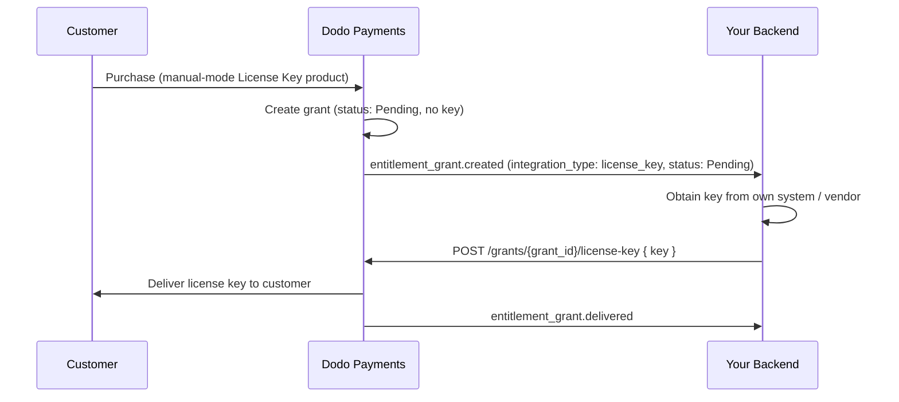

Questa guida illustra come creare end-to-end un sistema di **fulfillment manuale delle chiavi di licenza**. Anziché fare in modo che Dodo Payments generi automaticamente una chiave al momento del pagamento, ogni acquisto crea un grant `Pending` e attende che *tu* fornisca il valore della chiave dal tuo sistema, da un fornitore di terze parti o da un pool finito di codici.

Alla fine avrai:

- Un prodotto con un diritto alla chiave di licenza impostato per `manual`.
- Un listener webhook che rileva quando un cliente sta aspettando una chiave.
- Una chiamata di esecuzione che consegna la chiave e notifica automaticamente il cliente.

<CardGroup cols={2}>
<Card title="License Keys overview" icon="key" href="/features/license-keys">
Il ciclo di vita completo della chiave di licenza e l'impostazione `fulfillment_mode`.
</Card>
<Card title="Fulfill License Key Grant API" icon="code" href="/api-reference/entitlements/fulfill-license-key">
Riferimento API per l'endpoint che chiami per consegnare una chiave.
</Card>
</CardGroup>

## Come funziona



Il rilascio manuale cambia solo il passaggio di **emissione**. Attivazione, validazione, disattivazione, scadenza e revoca funzionano esattamente come una chiave generata automaticamente una volta consegnata.

## Prerequisiti

Per seguire questa guida avrai bisogno di:

- Un account merchant Dodo Payments.
- La tua API key (`DODO_PAYMENTS_API_KEY`) e la secret key del webhook dalla dashboard. Consulta la [guida alla generazione delle API key](/api-reference/introduction#api-key-management-and-authentication).
- Un endpoint backend in grado di ricevere webhook.

<Info>
Usa `https://test.dodopayments.com` e credenziali in modalità test durante la costruzione. Passa a `https://live.dodopayments.com` e chiavi live quando vai in produzione.
</Info>

## Passo 1 — Crea un Diritto alla Chiave di Licenza in Modalità Manuale

Un **diritto** è una definizione riutilizzabile di ciò che consegni. Crea un diritto alla chiave di licenza e imposta il suo `fulfillment_mode` su `manual`.

<Tabs>
<Tab title="Dashboard">
<Steps>
<Step title="Open Entitlements">
Vai a **Diritti** nel tuo pannello di controllo e clicca su **+** per creare un nuovo diritto.
</Step>
<Step title="Choose License Key">
Seleziona **Chiave di Licenza** come integrazione e assegnale un **Nome**. Il formulario espone questi campi:

- **Modalità di Rilascio** — `Automatic` di default. Questa è l'impostazione che abilita il rilascio manuale; la cambi nel passo successivo.
- **Durata della Licenza** — quanto tempo rimane valida ciascuna chiave emessa o **Nessuna scadenza**.
- **Limite di Attivazioni** — attivazioni massime per chiave o **Illimitato**.
- **Messaggio di Attivazione** — messaggio opzionale rivolto al cliente mostrato quando attivano la chiave.

<Frame>

</Frame>
</Step>
<Step title="Set Fulfillment Mode to Manual">
Apri il menu a discesa **Fulfillment Mode** e modificalo da **Automatic** a **Manual**. Questa è l'impostazione alla base dell'intera guida: senza di essa, le chiavi vengono generate e inviate automaticamente via email e non viene creato alcun grant in attesa. Con **Manual** selezionato, ogni acquisto crea un grant `Pending` che dovrai gestire. Fai clic su **Create Entitlement** per salvare.
</Step>
</Steps>
</Tab>

<Tab title="API">
Crea il diritto con `integration_config.fulfillment_mode` impostato su `manual`.
<CodeGroup>

```typescript Node.js theme={null}
import DodoPayments from 'dodopayments';

const client = new DodoPayments({
  bearerToken: process.env.DODO_PAYMENTS_API_KEY,
  environment: 'test_mode', // defaults to 'live_mode'
});

const entitlement = await client.entitlements.create({
  name: 'Pro License (Manual)',
  integration_type: 'license_key',
  integration_config: {
    fulfillment_mode: 'manual',
    activations_limit: 5,
    duration_count: 1,
    duration_interval: 'Year',
  },
});

console.log(entitlement.id); // ent_...
```

```python Python theme={null}
import os
from dodopayments import DodoPayments

client = DodoPayments(
    bearer_token=os.environ.get("DODO_PAYMENTS_API_KEY"),
    environment="test_mode",  # defaults to "live_mode"
)

entitlement = client.entitlements.create(
    name="Pro License (Manual)",
    integration_type="license_key",
    integration_config={
        "fulfillment_mode": "manual",
        "activations_limit": 5,
        "duration_count": 1,
        "duration_interval": "Year",
    },
)

print(entitlement.id)
```

```bash cURL theme={null}
curl -X POST https://test.dodopayments.com/entitlements \
  -H "Authorization: Bearer $DODO_PAYMENTS_API_KEY" \
  -H "Content-Type: application/json" \
  -d '{
    "name": "Pro License (Manual)",
    "integration_type": "license_key",
    "integration_config": {
      "fulfillment_mode": "manual",
      "activations_limit": 5,
      "duration_count": 1,
      "duration_interval": "Year"
    }
  }'
```

</CodeGroup>
</Tab>
</Tabs>

<Note>
`fulfillment_mode` predefinito su `auto`. Omesso, o lasciando un diritto esistente invariato, mantiene il comportamento automatico. Solo i diritti esplicitamente impostati su `manual` creano grant in sospeso.
</Note>

## Passo 2 — Collega il Diritto a un Prodotto

Apri il prodotto che vuoi vendere, espandi **Impostazioni Avanzate → Diritti e Crediti**, e seleziona il **diritto alla Chiave di Licenza che hai impostato su Manuale** nel Passo 1. Un singolo prodotto può consegnare questa chiave di licenza insieme ad altri diritti nello stesso acquisto.

<Frame caption="Selecting the License Key entitlement in the product entitlements panel.">

</Frame>

<Note>
La modalità di rilascio è una proprietà del **diritto**, non del prodotto. Poiché l'hai impostato su **Manuale** nel Passo 1, ogni prodotto a cui è collegato questo diritto crea grant di chiavi di licenza `pending` all'acquisto — non c'è nulla di extra da configurare qui.
</Note>

<Note>
La modalità di fulfillment è una proprietà dell'**entitlement**, non del prodotto. Poiché l'hai impostata su **Manual** nel Passaggio 1, ogni prodotto a cui questo entitlement è associato crea grant di chiavi di licenza `Pending` al momento dell'acquisto: non c'è altro da configurare qui.
</Note>

## Passo 3 — Rileva Grants in Sospeso

Quando un cliente acquista il prodotto, Dodo Payments crea un grant in stato `pending` con **nessuna chiave allegata** e attiva un webhook `entitlement_grant.created`. Questo è il tuo segnale che un cliente è in attesa di una chiave.

Quando un cliente acquista il prodotto, Dodo Payments crea un grant con stato `Pending`, **senza alcuna chiave associata**, e invia un webhook `entitlement_grant.created`. Questo è il segnale che indica che un cliente è in attesa di una chiave.

Configura un endpoint webhook (Sviluppatore → Webhooks nel pannello di controllo) e agisci sui grants di chiavi di licenza in attesa. L'implementazione segue la specifica [Standard Webhooks](https://standardwebhooks.com/).

```typescript theme={null}
import { Webhook } from 'standardwebhooks';

const webhook = new Webhook(process.env.DODO_WEBHOOK_KEY!);

export async function POST(request: Request) {
  const rawBody = await request.text();
  const headers = {
    'webhook-id': request.headers.get('webhook-id') || '',
    'webhook-signature': request.headers.get('webhook-signature') || '',
    'webhook-timestamp': request.headers.get('webhook-timestamp') || '',
  };

  await webhook.verify(rawBody, headers);
  const event = JSON.parse(rawBody);

  // A customer bought a manual-mode license key and is waiting for it.
  if (
    event.type === 'entitlement_grant.created' &&
    event.data.integration_type === 'license_key' &&
    event.data.status === 'pending'
  ) {
    await queueLicenseKeyFulfillment({
      grantId: event.data.id,
      customerId: event.data.customer_id,
    });
  }

  return new Response('ok');
}
```

```typescript theme={null}
import { Webhook } from 'standardwebhooks';

const webhook = new Webhook(process.env.DODO_WEBHOOK_KEY!);

export async function POST(request: Request) {
  const rawBody = await request.text();
  const headers = {
    'webhook-id': request.headers.get('webhook-id') || '',
    'webhook-signature': request.headers.get('webhook-signature') || '',
    'webhook-timestamp': request.headers.get('webhook-timestamp') || '',
  };

  await webhook.verify(rawBody, headers);
  const event = JSON.parse(rawBody);

  // A customer bought a manual-mode license key and is waiting for it.
  if (
    event.type === 'entitlement_grant.created' &&
    event.data.integration_type === 'license_key' &&
    event.data.status === 'Pending'
  ) {
    await queueLicenseKeyFulfillment({
      grantId: event.data.id,
      customerId: event.data.customer_id,
    });
  }

  return new Response('ok');
}
```

### O consulta l'API List Grants

Se preferisci non fare affidamento sui webhooks, elenca i grants per il diritto e filtra per `integration_type` e `status`:

Se preferisci non affidarti ai webhook, elenca le concessioni per la tua idoneità di License Key e filtra per `status`. Ogni concessione su un'idoneità di License Key è già una concessione di tipo license-key, quindi non è necessario alcun filtro `integration_type`:

```typescript Node.js theme={null}
const pending = await client.entitlements.grants.list('ent_license_key_id', {
  integration_type: 'license_key',
  status: 'pending',
});

for (const grant of pending.items) {
  console.log(`Grant ${grant.id} for customer ${grant.customer_id} needs a key`);
}
```

```typescript Node.js theme={null}
const pending = await client.entitlements.grants.list('ent_license_key_id', {
  status: 'Pending',
});

for (const grant of pending.items) {
  console.log(`Grant ${grant.id} for customer ${grant.customer_id} needs a key`);
}
```

```bash cURL theme={null}
curl -G https://test.dodopayments.com/entitlements/ent_license_key_id/grants \
  -H "Authorization: Bearer $DODO_PAYMENTS_API_KEY" \
  --data-urlencode "status=Pending"
```

## Passo 4 — Consegna la Chiave

Ottieni il valore della chiave dal tuo sistema, quindi invialo all'endpoint [Fulfill License Key Grant](/api-reference/entitlements/fulfill-license-key). Questo richiede la tua chiave API segreta (permesso Editor); non è uno degli endpoint di licenza pubblici.

<CodeGroup>

```typescript Node.js theme={null}
async function fulfill(grantId: string, key: string) {
  const res = await fetch(
    `https://test.dodopayments.com/grants/${grantId}/license-key`,
    {
      method: 'POST',
      headers: {
        'Content-Type': 'application/json',
        Authorization: `Bearer ${process.env.DODO_PAYMENTS_API_KEY}`,
      },
      body: JSON.stringify({
        key,
        // Optional — fall back to the entitlement config when omitted
        activations_limit: 5,
        expires_at: '2027-05-01T00:00:00Z',
      }),
    },
  );

  if (!res.ok) {
    // See the status code table below for handling
    throw new Error(`Fulfillment failed: ${res.status}`);
  }

  return res.json(); // updated grant, now status: "delivered"
}
```

```typescript Node.js theme={null}
async function fulfill(grantId: string, key: string) {
  const res = await fetch(
    `https://test.dodopayments.com/grants/${grantId}/license-key`,
    {
      method: 'POST',
      headers: {
        'Content-Type': 'application/json',
        Authorization: `Bearer ${process.env.DODO_PAYMENTS_API_KEY}`,
      },
      body: JSON.stringify({
        key,
        // Optional — fall back to the entitlement config when omitted
        activations_limit: 5,
        expires_at: '2027-05-01T00:00:00Z',
      }),
    },
  );

  if (!res.ok) {
    // See the status code table below for handling
    throw new Error(`Fulfillment failed: ${res.status}`);
  }

  return res.json(); // updated grant, now status: "Delivered"
}
```

</CodeGroup>

### Campi della richiesta

<ParamField body="key" type="string" required>
La stringa della chiave di licenza da consegnare al cliente. Gli spazi bianchi vengono rimossi; un valore vuoto o composto solo da spazi bianchi viene rifiutato.
</ParamField>

<ParamField body="activations_limit" type="integer">
Limite di attivazione per chiave. Torna alla configurazione del diritto quando è omesso.
</ParamField>

<ParamField body="expires_at" type="string">
Scadenza per chiave (ISO 8601). Torna alla durata della configurazione del diritto quando è omesso. Per grants emessi da abbonamenti, la validità rimane legata all'abbonamento indipendentemente.
</ParamField>

Al successo, il grant passa a `delivered`, il cliente riceve automaticamente la chiave (la stessa email che riceverebbero sotto rilascio automatico), e viene attivato `entitlement_grant.delivered`.

In caso di successo, il grant passa a `Delivered`, al cliente viene inviata automaticamente la chiave (la stessa email che riceverebbe con il fulfillment automatico) e vengono attivati gli eventi webhook `license_key.created` e `entitlement_grant.delivered`.

<Frame caption="The license key email the customer receives once you fulfill the grant.">

</Frame>

<Check>
Non è necessario inviare l'email della chiave da solo — la consegna avviene automaticamente quando il grant è soddisfatto.
</Check>

## Passo 5 — Gestisci Errori e Retry

L'endpoint valida il grant prima di consegnare qualsiasi cosa. Gestisci queste risposte:

| Stato | Significato | Cosa fare |
|---|---|---|
| `200` | Chiave consegnata, grant ora `delivered`. | Fatto. |
| `400` | Non è un grant di chiavi di licenza, o la chiave è vuota/bin bianca. | Correggi la richiesta; non riprovare così com'è. |
| `404` | Nessun grant con quell'ID per la tua azienda. | Verifica `grant_id`. |
| `409` | Grant non in attesa di rilascio (già consegnato o ha già una chiave), **o** il valore della chiave esiste già. | Se già consegnato, trattalo come successo. Se chiave duplicata, fornisci una chiave diversa. |
| `422` | Il corpo della richiesta ha fallito la validazione (e.g. `activations_limit < 1`). | Correggi il campo e riprova. |

| Stato | Significato | Cosa fare |
|---|---|---|
| `200` | Chiave consegnata, il grant è ora `Delivered`. | Completato. |
| `400` | Non è un grant di chiave di licenza oppure la chiave è vuota o contiene solo spazi. | Correggi la richiesta; non riprovare così com'è. |
| `404` | Nessun grant con quell'ID per la tua attività. | Verifica `grant_id`. |
| `409` | Il grant non è in attesa di fulfillment (è già stato consegnato o ha già una chiave), **oppure** il valore della chiave esiste già. | Se è già stato consegnato, consideralo un successo. Se la chiave è duplicata, fornisci una chiave diversa. |
| `422` | Il corpo della richiesta non ha superato la validazione (ad es. `activations_limit < 1`). | Correggi il campo e riprova. |

## Verifica il Flusso

1. Acquista il prodotto in modalità test (vedi le [guide al checkout](/developer-resources/integration-guide)).
2. Conferma che il tuo webhook ha ricevuto `entitlement_grant.created` con `status: "pending"` e `integration_type: "license_key"`, o che il grant appare nella risposta di List Grants con quei filtri.
3. Chiama l'endpoint fulfill con una chiave di test.
4. Conferma che la risposta mostri `status: "delivered"` con un `license_key` popolato, il cliente riceva l'email della chiave e venga attivato `entitlement_grant.delivered`.

1. Acquista il prodotto in modalità test (consulta le [guide al checkout](/developer-resources/integration-guide)).
2. Verifica che il tuo webhook abbia ricevuto `entitlement_grant.created` con `status: "Pending"` e `integration_type: "license_key"`, oppure che il grant compaia nella risposta di List Grants con questi filtri.
3. Chiama l'endpoint di fulfill con una chiave di test.
4. Verifica che la risposta mostri `status: "Delivered"` con un `license_key` valorizzato, che il cliente riceva l'email con la chiave e che venga attivato `entitlement_grant.delivered`.

## Riferimento API correlato

<CardGroup cols={2}>
<Card title="Create Entitlement" icon="plus" href="/api-reference/entitlements/create-entitlement">
Crea il diritto alla chiave di licenza con `fulfillment_mode: manual`.
</Card>
<Card title="List Grants" icon="users" href="/api-reference/entitlements/list-grants">
Filtra per `integration_type` e `status` per trovare grants in sospeso.
</Card>
<Card title="Fulfill License Key Grant" icon="code" href="/api-reference/entitlements/fulfill-license-key">
Consegna il valore della chiave e passa il grant a consegnato.
</Card>
<Card title="Entitlement Grant Webhooks" icon="webhook" href="/developer-resources/webhooks/intents/entitlement-grant">
Gli eventi `entitlement_grant.*` che segnalano grants in sospeso e consegnati.
</Card>
</CardGroup>

<CardGroup cols={2}>
<Card title="Create Entitlement" icon="plus" href="/api-reference/entitlements/create-entitlement">
Crea l'entitlement License Key con `fulfillment_mode: manual`.
</Card>
<Card title="List Grants" icon="users" href="/api-reference/entitlements/list-grants">
Filtra per `status` e `customer_id` per trovare i grant in attesa.
</Card>
<Card title="Fulfill License Key Grant" icon="code" href="/api-reference/entitlements/fulfill-license-key">
Fornisci il valore della chiave e porta il grant allo stato delivered.
</Card>
<Card title="Entitlement Grant Webhooks" icon="webhook" href="/developer-resources/webhooks/intents/entitlement-grant">
Gli eventi `entitlement_grant.*` che segnalano i grant in attesa e consegnati.
</Card>
</CardGroup>
