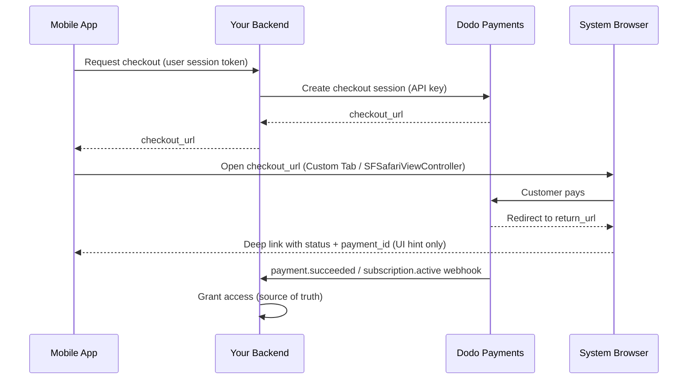

<CardGroup cols={4}>
<Card title="Quick Start" icon="rocket" href="#integration-workflow">
  Attiva l'integrazione dei pagamenti mobile in 4 semplici passaggi
</Card>

<Card title="Platform Examples" icon="code" href="#choose-your-sdk">
  Esempi di codice completi per Android, iOS, React Native e Flutter
</Card>

<Card title="Checkout Customization" icon="sliders" href="#checkout-page-customization">
  Configura temi, precompilazione e 14 parametri specifici per dispositivi mobili
</Card>

<Card title="Mobile Recipes" icon="flask" href="#mobile-optimized-recipes">
  Configurazioni del checkout da copiare e incollare per 5 scenari mobile comuni
</Card>
</CardGroup>

<Info>
Dodo Payments fornisce un SDK ufficiale per il checkout per **Android, iOS, React Native,
e Flutter**. Ognuno incapsula il pattern documentato di seguito (aprire l'URL del checkout,
acquisire il ritorno e analizzare il risultato) dietro una singola chiamata `start(...)`
tipizzata, con il recupero delle sessioni abbandonate integrato. Utilizza una WebView manuale solo
se nessuna di queste opzioni è adatta al tuo stack.
</Info>

## Prerequisiti

Prima di integrare Dodo Payments nella tua app mobile, assicurati di avere:

- **Account Dodo Payments**: account commerciante attivo con accesso API
- **Credenziali API**: chiave API e chiave segreta webhook dalla dashboard
- **Progetto dell'app mobile**: applicazione Android, iOS, React Native o Flutter
- **Server backend**: per gestire in modo sicuro la creazione delle sessioni di checkout

## Flusso di integrazione

L'integrazione mobile segue un processo sicuro in 4 passaggi, in cui il backend gestisce le chiamate API e l'app mobile gestisce l'esperienza utente.



<Info>
Il deep link `status` è solo un **suggerimento per l'interfaccia** su cosa mostrare all'utente. Concedi sempre l'accesso dal `payment.succeeded` / `subscription.active` **webhook** sul backend, mai dal solo risultato mobile.
</Info>

<Steps>
<Step title="Backend: Create Checkout Session">
<Card title="Checkout Session API Docs" icon="book" href="/developer-resources/checkout-session">
Scopri come creare una sessione di checkout nel backend usando Node.js, Python e altro. Consulta gli esempi completi e i riferimenti ai parametri nella documentazione dedicata dell'API <strong>Checkout Sessions</strong>.
</Card>
<Note>
**Sicurezza**: le sessioni di checkout devono essere create sul server backend, mai nell'app mobile. In questo modo proteggi le chiavi API e garantisci una validazione corretta.
</Note>

</Step>

<Step title="Mobile: Get Checkout URL">

La tua app mobile chiama il backend per ottenere l'URL del checkout. Autentica
questa richiesta con il token di sessione dell'utente che ha effettuato l'accesso.

<Tabs>
<Tab title="iOS (Swift)">

```swift
func getCheckoutURL(productId: String, customerEmail: String, customerName: String) async throws -> String {
    let url = URL(string: "https://your-backend.com/api/create-checkout-session")!
    var request = URLRequest(url: url)
    request.httpMethod = "POST"
    request.setValue("application/json", forHTTPHeaderField: "Content-Type")
    request.setValue("Bearer \(userSessionToken)", forHTTPHeaderField: "Authorization")
    
    let requestData: [String: Any] = [
        "productId": productId,
        "customerEmail": customerEmail,
        "customerName": customerName
    ]
    request.httpBody = try JSONSerialization.data(withJSONObject: requestData)
    
    let (data, _) = try await URLSession.shared.data(for: request)
    let response = try JSONDecoder().decode(CheckoutResponse.self, from: data)
    return response.checkout_url
}
```

</Tab>
<Tab title="Android (Kotlin)">

```kotlin
suspend fun getCheckoutURL(productId: String, customerEmail: String, customerName: String): String {
    val client = OkHttpClient()
    val requestBody = JSONObject().apply {
        put("productId", productId)
        put("customerEmail", customerEmail)
        put("customerName", customerName)
    }.toString().toRequestBody("application/json".toMediaType())
    
    val request = Request.Builder()
        .url("https://your-backend.com/api/create-checkout-session")
        .header("Authorization", "Bearer $userSessionToken")
        .post(requestBody)
        .build()
    
    val response = client.newCall(request).execute()
    val responseBody = response.body?.string()
    val jsonResponse = JSONObject(responseBody ?: "")
    return jsonResponse.getString("checkout_url")
}
```

</Tab>
<Tab title="React Native (JavaScript)">

```javascript
const getCheckoutURL = async (productId, customerEmail, customerName) => {
  try {
    const response = await fetch('https://your-backend.com/api/create-checkout-session', {
      method: 'POST',
      headers: {
        'Content-Type': 'application/json',
        'Authorization': `Bearer ${userSessionToken}`,
      },
      body: JSON.stringify({
        productId,
        customerEmail,
        customerName
      })
    });
    
    const data = await response.json();
    return data.checkout_url;
  } catch (error) {
    console.error('Failed to get checkout URL:', error);
    throw error;
  }
};
```

</Tab>
<Tab title="Flutter (Dart)">

```dart
import 'dart:convert';
import 'package:http/http.dart' as http;

Future<String> getCheckoutUrl({
  required String productId,
  required String customerEmail,
  required String customerName,
}) async {
  final response = await http.post(
    Uri.parse('https://your-backend.com/api/create-checkout-session'),
    headers: {
      'Content-Type': 'application/json',
      'Authorization': 'Bearer $userSessionToken',
    },
    body: jsonEncode({
      'productId': productId,
      'customerEmail': customerEmail,
      'customerName': customerName,
    }),
  );

  if (response.statusCode != 200) {
    throw Exception('Failed to get checkout URL: ${response.statusCode}');
  }
  return jsonDecode(response.body)['checkout_url'] as String;
}
```

</Tab>
</Tabs>
<Note>
**Sicurezza**: le app mobili comunicano solo con il backend, mai direttamente con l'API Dodo Payments.
</Note>
</Step>

<Step title="Mobile: Open Checkout in Browser">
Apri l'URL del checkout in un browser in-app sicuro per elaborare il pagamento.
Oppure evita del tutto la configurazione manuale usando l'SDK ufficiale per il checkout della tua
piattaforma.

<Card title="Pick your mobile SDK" icon="box" href="#choose-your-sdk">
  Passaggi di installazione e istruzioni di configurazione per Android, iOS, React Native e Flutter.
</Card>

</Step>

<Step title="Backend: Handle Payment Completion">
Gestisci il completamento del pagamento tramite webhook e URL di reindirizzamento per confermare lo stato del pagamento.
</Step>
</Steps>

## Scegli il tuo SDK

Ogni SDK mobile espone lo stesso contratto: una singola chiamata `start(...)` apre il
checkout ospitato di Dodo nella superficie browser nativa della piattaforma e restituisce un `CheckoutResult` tipizzato il cui `status` è `succeeded`, `failed`, `cancelled`,
`pending` o `expired`. Nessuno contiene una chiave API o chiama l'API Dodo
Payments e tutti e quattro supportano il recupero delle sessioni abbandonate.

<CardGroup cols={2}>
<Card title="Android" icon="android" href="/developer-resources/sdks/android">
  `com.dodopayments.api:checkout-android` apre una Chrome Custom Tab. Richiede `minSdk` 23.
</Card>
<Card title="iOS" icon="apple" href="/developer-resources/sdks/ios">
  `dodopayments-mobile-sdk-ios` apre `SFSafariViewController`. Richiede iOS 16+.
</Card>
<Card title="React Native" icon="react" href="/developer-resources/sdks/react-native">
  `@dodopayments/react-native-checkout`, un Turbo Module su entrambi i core nativi. Richiede React Native 0.76+.
</Card>
<Card title="Flutter" icon="layer-group" href="/developer-resources/sdks/flutter">
  `dodopayments_checkout`, un canale Pigeon su entrambi i core nativi. Richiede Flutter 3.44+.
</Card>
</CardGroup>

<Warning>
L'`status` restituito è un suggerimento per l'interfaccia, non una prova del pagamento. Conferma ogni
pagamento dal backend tramite il webhook `payment.succeeded` / `subscription.active`,
o recuperando il pagamento con la tua chiave segreta.
</Warning>

### Registrazione di uno schema URL di callback

Tutti e quattro gli SDK restituiscono il controllo alla tua app tramite uno schema URL personalizzato che
scegli tu, ad esempio `myapp://checkout/return`. Registralo una volta per
piattaforma:

<Tabs>
<Tab title="Android">

```kotlin android/app/build.gradle
android {
    defaultConfig {
        manifestPlaceholders["dodoCallbackScheme"] = "myapp"
    }
}
```

Il manifest dello SDK dichiara già l'attività di reindirizzamento, quindi non è necessario aggiungere XML al manifest.
</Tab>
<Tab title="iOS">

```xml Info.plist
<key>CFBundleURLTypes</key>
<array>
  <dict>
    <key>CFBundleURLName</key>
    <string>myapp</string>
    <key>CFBundleURLSchemes</key>
    <array>
      <string>myapp</string>
    </array>
  </dict>
</array>
```

Su iOS devi anche inoltrare gli URL in arrivo allo SDK, perché
`SFSafariViewController` non può intercettare il proprio URL di ritorno. Consulta la pagina
[iOS](/developer-resources/sdks/ios) o
[React Native](/developer-resources/sdks/react-native) per il gestore esatto.
</Tab>
<Tab title="Expo">
`@dodopayments/react-native-checkout` include un plugin di configurazione che registra lo
schema per entrambe le piattaforme in `prebuild`. Passagli un'opzione `scheme`:

```json app.json
{
  "expo": {
    "scheme": "myapp",
    "plugins": [
      [
        "@dodopayments/react-native-checkout",
        { "scheme": "myappcheckout" }
      ]
    ]
  }
}
```

`scheme` deve corrispondere a `returnUrl` e deve essere diverso da `expo.scheme`, che Expo
registra già su `MainActivity`. Consulta la pagina
[React Native SDK](/developer-resources/sdks/react-native) per i dettagli.

Se `android/app/build.gradle` viene gestito manualmente senza un blocco
`defaultConfig { }` standard, imposta invece manualmente il placeholder (consulta la scheda
Android).

Funziona solo con development build, non con Expo Go. Esegui
`npx expo prebuild --clean` dopo aver modificato `app.json`.
</Tab>
</Tabs>

<Note>
Preferisci costruirlo autonomamente? Apri `checkout_url` nel browser di sistema
della piattaforma (Android Custom Tabs / iOS `SFSafariViewController`) e intercetta la
navigazione verso `return_url`, quindi leggi i parametri di query `status` e `payment_id`. Gli SDK sopra indicati fanno esattamente questo per te.
</Note>

<Warning>
**Non aprire il checkout all'interno di una WebView incorporata (`WKWebView` / Android
`WebView`).** Questo è il problema più comune nelle integrazioni mobile: una
WebView incorporata **disabilita Apple Pay e Google Pay** e può anche interrompere le verifiche 3-D Secure
e la compilazione automatica delle carte salvate, così i clienti vedono meno opzioni di pagamento e più errori. Usa sempre lo SDK oppure apri `checkout_url` nel
browser di sistema (Custom Tabs / `SFSafariViewController`). Questa superficie browser
nativa è esattamente il motivo per cui Apple Pay e Google Pay continuano a funzionare.
</Warning>

## Personalizzazione dell'aspetto

Ogni SDK accetta un parametro opzionale `customization` su `start(...)` /
`CheckoutParams` che controlla l'aspetto e il comportamento della superficie browser nativa: barra degli strumenti, pulsanti e presentazione. È separato dal tema della
pagina di checkout, che configuri lato server tramite
[`customization.theme_config`](/developer-resources/checkout-session) nella
sessione di checkout.

Le opzioni sono raggruppate per piattaforma perché la Custom Tab di Android e
`SFSafariViewController` di iOS espongono controlli nativi diversi. Tutti i campi sono
opzionali; omettere completamente `customization` usa l'aspetto predefinito di ciascuna
piattaforma.

<AccordionGroup>
<Accordion title="Android - Custom Tab">

<ParamField body="toolbarColor" type="Color">
Colore di sfondo della barra degli strumenti.
</ParamField>

<ParamField body="navigationBarColor" type="Color">
Colore della barra di navigazione.
</ParamField>

<ParamField body="navigationBarDividerColor" type="Color">
Colore del divisore sopra la barra di navigazione.
</ParamField>

<ParamField body="closeButtonStyle" type="'default' | 'back'">
`default` mostra l'icona di sistema "X"; `back` disegna invece una freccia indietro.
</ParamField>

<ParamField body="closeButtonPosition" type="'start' | 'end'">
Lato della barra degli strumenti in cui appare il pulsante di chiusura.
</ParamField>

<ParamField body="shareButtonEnabled" type="boolean">
Mostra l'icona di condivisione della barra degli strumenti.
</ParamField>

<ParamField body="showTitleEnabled" type="boolean">
Mostra il titolo della pagina sotto l'URL nella barra degli strumenti.
</ParamField>

<ParamField body="urlBarHidingEnabled" type="boolean">
Consente alla barra degli strumenti di nascondersi automaticamente durante lo scorrimento della pagina.
</ParamField>

<ParamField body="bookmarksButtonEnabled" type="boolean">
Mostra "Aggiungi pagina ai preferiti" nel menu overflow.
</ParamField>

<ParamField body="downloadsButtonEnabled" type="boolean">
Mostra "Scarica pagina" nel menu overflow.
</ParamField>

<ParamField body="colorScheme" type="'system' | 'light' | 'dark'">
Forza l'aspetto chiaro o scuro indipendentemente dall'impostazione di sistema del dispositivo.
</ParamField>

</Accordion>

<Accordion title="iOS - SFSafariViewController">

<ParamField body="dismissButtonStyle" type="'done' | 'close' | 'cancel'">
Etichetta o icona per il pulsante di chiusura.
</ParamField>

<ParamField body="presentationStyle" type="'pageSheet' | 'fullScreen'">
`pageSheet` viene presentato come una scheda con scorrimento per chiudere; `fullScreen` copre l'intero schermo.
</ParamField>

<ParamField body="barCollapsingEnabled" type="boolean">
Consente alla barra degli strumenti di comprimersi durante lo scorrimento. Visibile solo quando `presentationStyle` è `fullScreen`; `pageSheet` mantiene le barre fissate indipendentemente da questa impostazione.
</ParamField>

<ParamField body="colorScheme" type="'system' | 'light' | 'dark'">
Forza l'aspetto chiaro o scuro indipendentemente dall'impostazione di sistema del dispositivo.
</ParamField>

</Accordion>
</AccordionGroup>

<Tabs>
<Tab title="React Native">

```typescript
const result = await DodoCheckout.start({
  checkoutUrl,
  returnUrl: 'myapp://checkout/return',
  customization: {
    android: { toolbarColor: '#6366F1', closeButtonStyle: 'back' },
    ios: { presentationStyle: 'fullScreen', colorScheme: 'dark' },
  },
});
```

</Tab>
<Tab title="Flutter">

```dart
final result = await DodoCheckout.instance.start(
  CheckoutParams(
    checkoutUrl: Uri.parse(checkoutUrl),
    returnUrl: Uri.parse('myapp://checkout/return'),
    customization: BrowserCustomization(
      android: AndroidBrowserOptions(
        toolbarColor: Color(0xFF6366F1),
        closeButtonStyle: CloseButtonStyle.back,
      ),
      ios: IosBrowserOptions(
        presentationStyle: PresentationStyle.fullScreen,
        colorScheme: BrowserColorScheme.dark,
      ),
    ),
  ),
);
```

</Tab>
<Tab title="Android (Kotlin)">

```kotlin
val result = DodoCheckout.start(
    activity,
    CheckoutParams(
        checkoutUrl = checkoutUrl,
        returnUrl = "myapp://checkout/return",
        customization = BrowserCustomization(
            toolbarColor = Color.parseColor("#6366F1"),
            closeButtonStyle = BrowserCustomization.CloseButtonStyle.BACK,
        )
    )
) { event -> }
```

</Tab>
<Tab title="iOS (Swift)">

```swift
let result = try await DodoCheckout.start(
    checkoutUrl: checkoutUrl,
    returnUrl: URL(string: "myapp://checkout/return")!,
    customization: BrowserCustomization(
        presentationStyle: .fullScreen,
        colorScheme: .dark
    )
)
```

</Tab>
</Tabs>

## Personalizzazione della pagina di checkout

La sezione [Personalizzazione dell'aspetto](#appearance-customization) precedente controlla la superficie browser nativa: barra degli strumenti, pulsanti e combinazione di colori. La *pagina* di checkout in sé, ovvero i campi visualizzati, il tema e i metodi di pagamento mostrati, viene configurata lato server quando crei la sessione di checkout. Questi parametri hanno il maggiore impatto sulla conversione mobile.

I parametri seguenti si trovano in tre posizioni diverse nella richiesta della sessione di checkout: la colonna **Dove va inserito** indica a quale oggetto appartiene ciascuno. Sbagliare questo punto è l'errore più comune: un parametro inserito nell'oggetto sbagliato viene ignorato silenziosamente.

| Parametro | Dove va inserito | Vantaggio mobile | Predefinito | Imposta quando… |
|-----------|------------------|------------------|-------------|----------------|
| `show_order_details` | `customization` | Comprimi il riepilogo dell'ordine per mostrare i metodi di pagamento nella parte superiore dello schermo | `true` | Imposta sempre `false` su mobile: spostare i metodi di pagamento above the fold riduce significativamente l'abbandono |
| `minimal_address` | top-level | Richiede solo un CAP; nasconde i campi per via, città e stato | `false` | Quasi sempre su mobile: ogni campo aggiuntivo riduce le conversioni |
| `theme` | `customization` | Controlla l'aspetto chiaro o scuro della pagina di checkout | Predefinito aziendale | Usa `"system"` per seguire la preferenza del sistema operativo del dispositivo |
| `theme_config` | `customization` | Palette completa del brand: colori, caratteri, raggio dei bordi ed etichetta del pulsante di pagamento | Nessuno | Quando il checkout deve sembrare parte della tua app |
| `force_language` | `customization` | Sostituisce il rilevamento della lingua del browser | Rilevamento automatico | Impostalo in base alla lingua della tua app invece di affidarti al browser |
| `show_on_demand_tag` | `customization` | Mostra o nasconde l'etichetta "on-demand" nella pagina di checkout | `true` | Imposta `false` quando usi la fatturazione on-demand esclusivamente per la tokenizzazione delle carte |
| `show_saved_payment_methods` | top-level | Mostra le carte salvate di un cliente abituale per pagare con un tocco | `false` | Abilitalo per gli utenti autenticati che hanno già effettuato un pagamento |
| `allow_discount_code` | `feature_flags` | Mostra il campo per inserire il codice promozionale | `true` | Imposta `false` per accorciare il modulo; gli utenti che escono per cercare un codice raramente ritornano |
| `allow_currency_selection` | `feature_flags` | Consente al cliente di cambiare la valuta di fatturazione | `true` | Imposta `false` quando blocchi la valuta con `billing_currency` |
| `redirect_immediately` | `feature_flags` | Salta la pagina di successo e passa direttamente a `return_url` | `false` | Abilitalo per un passaggio fluido alla tua app |
| `confirm` | top-level | Finalizza il pagamento senza un passaggio di conferma aggiuntivo | `false` | Usalo con `payment_method_id` per un checkout con un solo clic |
| `short_link` | top-level | Restituisce un URL di checkout più breve | `false` | Utile quando l'URL deve rientrare in una notifica push o in un SMS |
| `payment_method_id` | top-level | Preseleziona un metodo di pagamento salvato | - | Passalo insieme a `confirm: true` per un checkout con un solo clic |
| `allowed_payment_method_types` | top-level | Inserisce nella whitelist i metodi di pagamento visualizzati | Tutti abilitati | Limitalo ai metodi compatibili con il tipo di prodotto |

<Warning>
**Passa sempre `billing_currency` e `billing_address.country` insieme.** Se uno dei due viene omesso, Adaptive Currency può cambiare silenziosamente la valuta di fatturazione in base all'indirizzo IP del cliente. Un commerciante ha visto un abbonamento statunitense passare a EUR quando il cliente si è recato in Europa, perché il paese di fatturazione non era stato impostato esplicitamente.
</Warning>

<Tip>
**Il maggiore incremento singolo della conversione su mobile:** imposta `show_order_details: false` e `minimal_address: true`. Spostare i metodi di pagamento above the fold e ridurre i campi del modulo sono le due modifiche con il maggiore impatto.
</Tip>

<Frame caption="show_order_details: false moves the contact and payment fields above the fold, instead of behind the order summary.">
  
</Frame>

Imposta `minimal_address: true` per raccogliere solo un CAP invece dei campi completi per via, città e stato:

<Frame caption="minimal_address: true reduces the billing address to a single postcode field.">
  
</Frame>

Imposta `theme: "system"` affinché il checkout segua la preferenza del dispositivo per la modalità chiara o scura:

<Frame caption="With theme: system, the checkout follows the device's light or dark appearance automatically.">
  
</Frame>

<Info>
**La disponibilità dei metodi di pagamento varia in base al tipo di prodotto.** Apple Pay e Cash App sono supportati per gli abbonamenti ricorrenti non a importo zero. Per i pagamenti una tantum, sono disponibili tutti i metodi abilitati.
</Info>

<Card title="Full checkout session parameter reference" icon="book" href="/developer-resources/checkout-session">
  Consulta ogni parametro disponibile, il tipo e il valore predefinito nella guida Checkout Sessions.
</Card>

## Ricette ottimizzate per dispositivi mobili

Ogni ricetta seguente è un body completo della richiesta di una sessione di checkout. Copia quella corrispondente al tuo scenario, sostituisci il tuo ID prodotto e passala all'endpoint di creazione della sessione del backend.

<AccordionGroup>
<Accordion title="Minimal Mobile Checkout - fastest path to payment">

Usalo quando vuoi il modulo più breve possibile: metodi di pagamento in alto, solo il CAP richiesto per l'indirizzo, nessun campo per gli sconti e tema corrispondente al dispositivo.

<Tabs>
<Tab title="Node.js SDK">

```javascript expandable
import DodoPayments from 'dodopayments';

const client = new DodoPayments({
  bearerToken: process.env.DODO_PAYMENTS_API_KEY,
  environment: 'test_mode',
});

const session = await client.checkoutSessions.create({
  product_cart: [{ product_id: 'pdt_your_product_id', quantity: 1 }],
  customer: { email: 'user@example.com', name: 'Jane Smith' },
  billing_address: { country: 'US' },
  return_url: 'myapp://checkout/success',
  cancel_url: 'myapp://checkout/cancelled',
  billing_currency: 'USD',
  minimal_address: true,
  customization: {
    show_order_details: false,
    theme: 'system',
  },
  feature_flags: {
    allow_discount_code: false,
    allow_currency_selection: false,
  },
});

console.log(session.checkout_url);
```

</Tab>
<Tab title="Python SDK">

```python expandable
import os
import dodopayments

client = dodopayments.DodoPayments(
    bearer_token=os.environ.get("DODO_PAYMENTS_API_KEY"),
    environment="test_mode",
)

session = client.checkout_sessions.create(
    product_cart=[{"product_id": "pdt_your_product_id", "quantity": 1}],
    customer={"email": "user@example.com", "name": "Jane Smith"},
    billing_address={"country": "US"},
    return_url="myapp://checkout/success",
    cancel_url="myapp://checkout/cancelled",
    billing_currency="USD",
    minimal_address=True,
    customization={
        "show_order_details": False,
        "theme": "system",
    },
    feature_flags={
        "allow_discount_code": False,
        "allow_currency_selection": False,
    },
)

print(session.checkout_url)
```

</Tab>
</Tabs>

<Note>
Consulta [Checkout Sessions](/developer-resources/checkout-session) per tutti i parametri disponibili e i relativi valori predefiniti.
</Note>
</Accordion>

<Accordion title="Branded Mobile Checkout - custom colors, fonts, and button label">

Usalo quando la pagina di checkout deve sembrare parte della tua app. Imposta i colori del brand, un carattere personalizzato e un'etichetta localizzata per il pulsante di pagamento.

<Frame>
  
</Frame>

<Tabs>
<Tab title="Node.js SDK">

```javascript expandable
const session = await client.checkoutSessions.create({
  product_cart: [{ product_id: 'pdt_your_product_id', quantity: 1 }],
  customer: { email: 'user@example.com', name: 'Jane Smith' },
  billing_address: { country: 'US' },
  billing_currency: 'USD',
  return_url: 'myapp://checkout/success',
  minimal_address: true,
  customization: {
    show_order_details: false,
    theme: 'dark',
    theme_config: {
      dark: {
        button_primary: '#7C3AED',
        button_primary_hover: '#6D28D9',
        button_text_primary: '#FFFFFF',
        bg_primary: '#1A1A2E',
        bg_secondary: '#16213E',
        text_primary: '#E2E8F0',
      },
      pay_button_text: 'Complete Purchase',
      radius: '8px',
    },
  },
});
```

</Tab>
<Tab title="Python SDK">

```python expandable
session = client.checkout_sessions.create(
    product_cart=[{"product_id": "pdt_your_product_id", "quantity": 1}],
    customer={"email": "user@example.com", "name": "Jane Smith"},
    billing_address={"country": "US"},
    billing_currency="USD",
    return_url="myapp://checkout/success",
    minimal_address=True,
    customization={
        "show_order_details": False,
        "theme": "dark",
        "theme_config": {
            "dark": {
                "button_primary": "#7C3AED",
                "button_primary_hover": "#6D28D9",
                "button_text_primary": "#FFFFFF",
                "bg_primary": "#1A1A2E",
                "bg_secondary": "#16213E",
                "text_primary": "#E2E8F0",
            },
            "pay_button_text": "Complete Purchase",
            "radius": "8px",
        },
    },
)
```

</Tab>
</Tabs>

<Note>
`theme_config` accetta oggetti separati `dark` e `light`, così la palette si adatta all'aspetto attuale del dispositivo. Consulta [Checkout Sessions](/developer-resources/checkout-session) per il riferimento completo ai colori.
</Note>
</Accordion>

<Accordion title="One-Click Returning Customer - saved card, instant confirmation">

Usalo per gli utenti autenticati che hanno già effettuato un pagamento. Combina un ID cliente, il relativo metodo di pagamento salvato e `confirm: true` per saltare completamente il modulo di checkout.

<Tabs>
<Tab title="Node.js SDK">

```javascript expandable
const session = await client.checkoutSessions.create({
  product_cart: [{ product_id: 'pdt_your_product_id', quantity: 1 }],
  customer: { customer_id: 'cus_returning_customer_id' },
  billing_address: { country: 'US' },
  billing_currency: 'USD',
  return_url: 'myapp://checkout/success',
  payment_method_id: 'pm_saved_payment_method_id',
  confirm: true,
  show_saved_payment_methods: true,           // top-level parameter
  feature_flags: { redirect_immediately: true },
});
```

</Tab>
<Tab title="Python SDK">

```python expandable
session = client.checkout_sessions.create(
    product_cart=[{"product_id": "pdt_your_product_id", "quantity": 1}],
    customer={"customer_id": "cus_returning_customer_id"},
    billing_address={"country": "US"},
    billing_currency="USD",
    return_url="myapp://checkout/success",
    payment_method_id="pm_saved_payment_method_id",
    confirm=True,
    show_saved_payment_methods=True,           # top-level parameter
    feature_flags={"redirect_immediately": True},
)
```

</Tab>
</Tabs>

<Note>
L'`status` nel ritorno del deep link è solo un suggerimento per l'interfaccia. Conferma l'accesso ascoltando il webhook `payment.succeeded` sul backend.
</Note>
</Accordion>

<Accordion title="Subscription with Free Trial - trial before first charge">

Usalo per i prodotti in abbonamento che offrono un periodo di prova gratuito prima del primo ciclo di fatturazione.

<Tabs>
<Tab title="Node.js SDK">

```javascript expandable
const session = await client.checkoutSessions.create({
  product_cart: [{ product_id: 'pdt_your_subscription_product_id', quantity: 1 }],
  customer: { email: 'user@example.com', name: 'Jane Smith' },
  billing_address: { country: 'US' },
  billing_currency: 'USD',
  return_url: 'myapp://subscription/activated',
  cancel_url: 'myapp://subscription/cancelled',
  minimal_address: true,
  customization: {
    show_order_details: false,
    theme: 'system',
  },
  subscription_data: { trial_period_days: 14 },
});
```

</Tab>
<Tab title="Python SDK">

```python expandable
session = client.checkout_sessions.create(
    product_cart=[{"product_id": "pdt_your_subscription_product_id", "quantity": 1}],
    customer={"email": "user@example.com", "name": "Jane Smith"},
    billing_address={"country": "US"},
    billing_currency="USD",
    return_url="myapp://subscription/activated",
    cancel_url="myapp://subscription/cancelled",
    minimal_address=True,
    customization={"show_order_details": False, "theme": "system"},
    subscription_data={"trial_period_days": 14},
)
```

</Tab>
</Tabs>

<Note>
Concedi l'accesso alla funzionalità quando il backend riceve il webhook `subscription.active`, non quando ritorna lo SDK mobile. Consulta [Subscription Integration Guide](/developer-resources/subscription-integration-guide) per il flusso completo dei webhook.
</Note>
</Accordion>

<Accordion title="On-Demand Mandate - save a card for future variable charges">

Usalo per tokenizzare la carta di un cliente per addebiti futuri (ricariche del wallet, pay-as-you-go, BNPL) senza mostrare l'etichetta "subscription". Il cliente autorizza una volta il metodo di pagamento; in seguito addebiti importi variabili on demand.

<Info>
Questo è il pattern usato dalle app che addebitano in base all'utilizzo, ad esempio un'app di astrologia che addebita ogni sessione da una carta preautorizzata, anziché secondo una pianificazione fissa.
</Info>

<Tabs>
<Tab title="Node.js SDK">

```javascript expandable
// Step 1: Authorize the mandate (no charge yet)
const session = await client.checkoutSessions.create({
  product_cart: [{ product_id: 'pdt_your_subscription_product_id', quantity: 1 }],
  customer: { email: 'user@example.com', name: 'Jane Smith' },
  billing_address: { country: 'US' },
  billing_currency: 'USD',
  return_url: 'myapp://mandate/authorized',
  cancel_url: 'myapp://mandate/cancelled',
  minimal_address: true,
  customization: {
    show_order_details: false,
    show_on_demand_tag: false, // hides the "on-demand" / "subscription" label
    theme: 'system',
  },
  subscription_data: {
    on_demand: { mandate_only: true },
  },
});

// Step 2: Later, charge any amount using the subscription ID
// (received via the subscription.active webhook after mandate authorization)
// await client.subscriptions.charge(subscriptionId, {
//   product_price: 2000,         // $20.00 in cents
//   product_currency: 'USD',
//   product_description: 'Session credits',
// });
```

</Tab>
<Tab title="Python SDK">

```python expandable
# Step 1: Authorize the mandate (no charge yet)
session = client.checkout_sessions.create(
    product_cart=[{"product_id": "pdt_your_subscription_product_id", "quantity": 1}],
    customer={"email": "user@example.com", "name": "Jane Smith"},
    billing_address={"country": "US"},
    billing_currency="USD",
    return_url="myapp://mandate/authorized",
    cancel_url="myapp://mandate/cancelled",
    minimal_address=True,
    customization={
        "show_order_details": False,
        "show_on_demand_tag": False,  # hides the "on-demand" / "subscription" label
        "theme": "system",
    },
    subscription_data={"on_demand": {"mandate_only": True}},
)

# Step 2: Later, charge any amount using the subscription ID
# client.subscriptions.charge(subscription_id, {
#     "product_price": 2000,  # $20.00 in cents
#     "product_currency": "USD",
#     "product_description": "Session credits",
# })
```

</Tab>
</Tabs>

<Warning>
Gli addebiti on-demand richiedono un minimo di 1 USD (100 centesimi). Gli importi inferiori a 1 USD verranno rifiutati con `"value out of range"`. Per un'autorizzazione a importo zero, usa `mandate_only: true` come mostrato sopra, quindi addebita almeno 1 USD nelle chiamate successive.
</Warning>

<Note>
Consulta [On-Demand Subscriptions](/developer-resources/ondemand-subscriptions) per il flusso completo degli addebiti, gli eventi webhook e le policy di retry.
</Note>
</Accordion>
</AccordionGroup>

## Flussi di abbonamento da dispositivi mobili

Gli abbonamenti vengono creati tramite lo stesso flusso di sessione di checkout usato per i pagamenti una tantum: lo SDK mobile apre il checkout ospitato, il cliente sottoscrive l'abbonamento e l'app gestisce il ritorno del deep link. Il ciclo di vita dell'abbonamento viene quindi gestito interamente dal backend.

### Abbonamenti ricorrenti standard

Per la fatturazione a intervalli fissi (mensile, annuale), crea una sessione di checkout con un prodotto in abbonamento e un `return_url` deep link. Il backend riceve `subscription.active` quando l'abbonamento viene confermato.

<Info>
**Apple Pay** e **Cash App** sono supportati per gli abbonamenti ricorrenti non a importo zero.
</Info>

Per il flusso completo dei webhook backend, consulta la [Subscription Integration Guide](/developer-resources/subscription-integration-guide).

---

### Abbonamenti on-demand

Gli abbonamenti on-demand consentono di autorizzare una volta il metodo di pagamento del cliente e di addebitare in seguito importi variabili: sono ideali per ricariche del wallet, pay-as-you-go e qualsiasi scenario in cui l'importo dell'addebito non sia noto in anticipo. Consulta la ricetta **On-Demand Mandate** sopra per il body completo della richiesta.

Considerazioni mobile principali:

- Imposta `show_on_demand_tag: false` affinché la pagina di checkout non mostri il linguaggio "subscription" o "on-demand". Nei casi d'uso di tokenizzazione delle carte, i clienti non si aspettano la terminologia degli abbonamenti.
- Dopo l'autorizzazione del mandato, il backend riceve `subscription.active`. Salva `subscription_id`: lo userai per tutti gli addebiti futuri.

<Warning>
L'addebito minimo è di 1 USD (100 centesimi). Gli addebiti on-demand inferiori a 1 USD verranno rifiutati con `"value out of range"`. Addebita almeno 1 USD oppure usa `mandate_only: true` per autorizzare senza addebitare e riscuotere il primo importo effettivo in seguito.
</Warning>

<Warning>
**Evita i retry ravvicinati.** Se un addebito precedente è ancora in elaborazione, un nuovo addebito sullo stesso abbonamento fallisce con `"Cannot create new charge as previous payment is not successful yet"`. Questo è particolarmente comune con i metodi di pagamento indiani (UPI, carte di debito/credito indiane), per i quali le regole RBI possono mantenere una transazione nello stato di elaborazione fino a 48 ore. Aggiungi un controllo di cooldown alla logica degli addebiti prima di riprovare.
</Warning>

Consulta [On-Demand Subscriptions](/developer-resources/ondemand-subscriptions) per l'endpoint completo degli addebiti, gli eventi webhook e le policy di retry.

---

### Abbonamento con prova gratuita

Passa `subscription_data.trial_period_days` nella sessione di checkout per offrire una prova prima del primo ciclo di fatturazione. Il cliente autorizza il metodo di pagamento durante la registrazione alla prova; il primo addebito avviene automaticamente al termine della prova. Consulta la ricetta **Subscription with Free Trial** sopra per il body completo della richiesta.

---

### Upgrade e downgrade

Le modifiche al piano vengono effettuate tramite API sul backend, non attraverso una nuova sessione di checkout. Dodo Payments calcola automaticamente il prorating. Per offrire un'opzione self-service ai clienti, incorpora o collega al [Customer Portal](/features/customer-portal).

<CardGroup cols={2}>
<Card title="Subscription Integration Guide" icon="repeat" href="/developer-resources/subscription-integration-guide">
  Configurazione completa del backend: flusso webhook, concessione dell'accesso e annullamento
</Card>
<Card title="On-Demand Subscriptions" icon="bolt" href="/developer-resources/ondemand-subscriptions">
  Autorizzazione del mandato, addebiti variabili e policy di retry
</Card>
<Card title="Upgrade / Downgrade" icon="arrows-up-down" href="/developer-resources/subscription-upgrade-downgrade">
  Strategie di prorating, modifiche al piano e adeguamenti dei posti
</Card>
<Card title="Customer Portal" icon="user" href="/features/customer-portal">
  Gestione self-service degli abbonamenti per i clienti
</Card>
</CardGroup>

## Riduzione degli abbandoni durante il checkout

I checkout mobile registrano un abbandono maggiore rispetto al web: schermi più piccoli, più distrazioni e moduli più lunghi contribuiscono tutti al problema. I miglioramenti più rapidi derivano dalla configurazione della sessione di checkout stessa.

### Ottimizza il modulo

| Impostazione | Valore consigliato | Effetto |
|---------|------------------|--------|
| `show_order_details` | `false` | Comprimi il riepilogo dell'ordine; i metodi di pagamento appaiono in alto |
| `minimal_address` | `true` | È richiesto solo il CAP; rimuove via, città e stato |
| `show_saved_payment_methods` | `true` | Pagamento con un tocco per i clienti abituali |
| `allow_discount_code` | `false` | Rimuove il campo del codice promozionale |
| `theme` | `"system"` | Segue la preferenza chiara o scura del dispositivo |
| `force_language` | Lingua della tua app | Impedisce che il checkout utilizzi per errore la lingua del browser |

### Precompila i dati del cliente

Ogni campo che il cliente non deve digitare è un motivo in meno per abbandonare:

- **Nuovi clienti**: imposta `customer.email` e `customer.name` dalla sessione di autenticazione.
- **Clienti abituali**: imposta `customer.customer_id` per precompilare automaticamente tutti i dati salvati.
- **Valuta**: passa sempre `billing_currency` e `billing_address.country` insieme.

### Strumenti di recupero

<CardGroup cols={2}>
<Card title="Abandoned Cart Recovery" icon="cart-shopping" href="/features/recovery/abandoned-cart-recovery">
  Sequenze email automatizzate per checkout incompleti
</Card>
<Card title="Payment Retries" icon="rotate" href="/features/recovery/payment-retries">
  Logica di retry intelligente per rinnovi di abbonamenti falliti
</Card>
<Card title="Subscription Dunning" icon="envelope" href="/features/recovery/subscription-dunning">
  Email di re-engagement per abbonamenti scaduti
</Card>
<Card title="Recovery Overview" icon="chart-line" href="/features/recovery/overview">
  Tutti gli strumenti di recupero e il loro impatto combinato sui ricavi
</Card>
</CardGroup>

<Tip>
**Testa le email di abbandono del carrello prima di abilitarle.** Crea una sessione di checkout in modalità live e inserisci dati di una carta non validi. Il pagamento fallito attiva il flusso email di recupero, consentendoti di visualizzare in anteprima esattamente ciò che riceveranno i clienti.
</Tip>

## Best practice

- **Sicurezza**: non inserire mai una chiave API nella tua app. Crea le sessioni di checkout sul backend e passa al client solo il `checkout_url` risultante.
- **Autorità**: tratta `CheckoutResult.status` come un suggerimento per l'interfaccia. Concedi l'accesso solo dopo che il backend ha confermato il pagamento.
- **Esperienza utente**: mostra uno stato di caricamento mentre il backend crea la sessione e gestisci `cancelled` come un risultato normale, non come un errore.
- **Test**: usa la modalità test e le carte di test e verifica il percorso completo dell'URL di ritorno su un dispositivo reale e su un simulatore.
- **Conversione**: imposta `show_order_details: false` e `minimal_address: true` per ottenere i migliori tassi di completamento del checkout mobile. Spostare i metodi di pagamento above the fold e ridurre i campi del modulo sono le due modifiche con il maggiore impatto.
- **Valuta**: passa sempre esplicitamente `billing_currency` e `billing_address.country`; se manca uno dei due, Adaptive Currency può modificare la valuta di fatturazione in base all'indirizzo IP del cliente.
- **Fatturazione on-demand**: imposta `show_on_demand_tag: false` quando usi abbonamenti on-demand per la tokenizzazione delle carte. I clienti che utilizzano un flusso di ricarica del wallet non si aspettano di vedere il linguaggio "subscription".
- **Recupero**: abilita il recupero dei carrelli abbandonati nella dashboard di Dodo Payments per coinvolgere nuovamente in modo automatico i clienti che non completano il checkout.

## Risoluzione dei problemi

### Problemi comuni

- **Il callback non arriva mai**: lo schema in `returnUrl` deve corrispondere a quello registrato. Su Android è il placeholder del manifest `dodoCallbackScheme`; su iOS e React Native è il tipo URL `Info.plist`.
- **Il checkout torna al browser invece che all'app (iOS)**: non hai inoltrato l'URL in arrivo. Chiama `DodoCheckout.handleOpenURL(url)` da `.onOpenURL`, `scene(_:openURLContexts:)` o da un listener `Linking` di React Native.
- **`PLATFORM_ERROR` su Android**: nella maggior parte dei casi si tratta di una mancata corrispondenza dello schema. Può anche comparire se `MainActivity` imposta `android:taskAffinity=""` (il valore predefinito standard `flutter create`), consentendo ad alcune build OEM di perdere il checkout in corso.
- **`ALREADY_IN_PROGRESS`**: un checkout è ancora aperto. Attendi o chiudi quello precedente prima di avviarne un altro.
- **La build fallisce a causa di un placeholder non risolto**: hai aggiunto lo SDK Android ma non hai mai impostato `manifestPlaceholders["dodoCallbackScheme"]`.
- **Il pagamento è riuscito ma l'accesso non è stato concesso**: è previsto se utilizzi il risultato mobile come riferimento. Concedi invece l'accesso dal webhook `payment.succeeded` / `subscription.active`.
- **Apple Pay / Google Pay non vengono mostrati su mobile**: il checkout viene caricato in una WebView incorporata (`WKWebView` / Android `WebView`), che disabilita i wallet e può interrompere 3-D Secure. Aprilo invece con lo SDK o nel browser di sistema (Custom Tabs / `SFSafariViewController`).

## Risorse aggiuntive
- [Payment Integration Guide](/developer-resources/integration-guide)
- [Webhook Documentation](/developer-resources/webhooks/intents/webhook-events-guide)
- [Testing Process](/miscellaneous/testing-process)
- [Technical FAQs](/miscellaneous/faq)
- [Checkout Session Customization](/developer-resources/checkout-session)
- [On-Demand Subscriptions](/developer-resources/ondemand-subscriptions)
- [Subscription Upgrade/Downgrade](/developer-resources/subscription-upgrade-downgrade)
- [Abandoned Cart Recovery](/features/recovery/abandoned-cart-recovery)
- [Customer Portal](/features/customer-portal)

<Check>
Per domande o assistenza, contatta <a href="mailto:support@dodopayments.com">support@dodopayments.com</a>.
</Check>