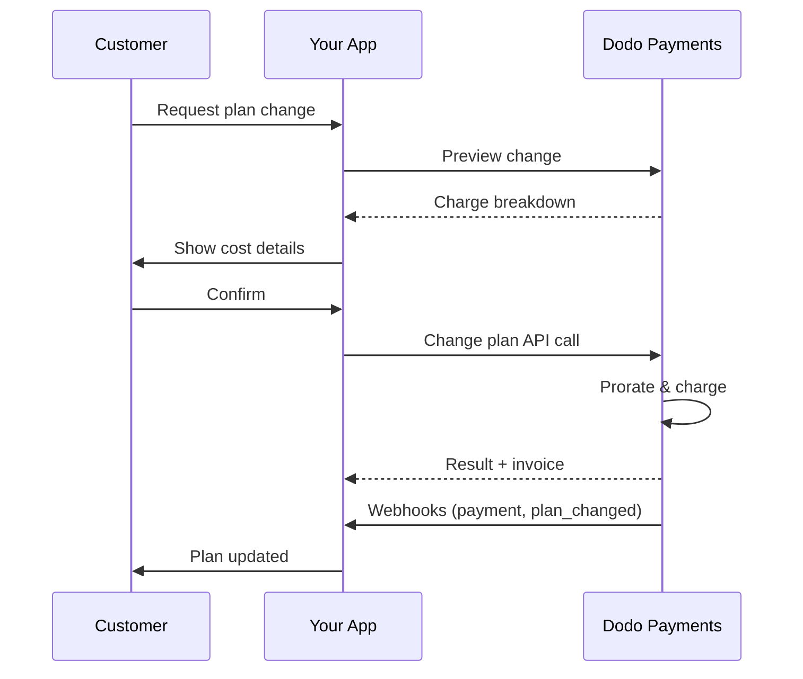
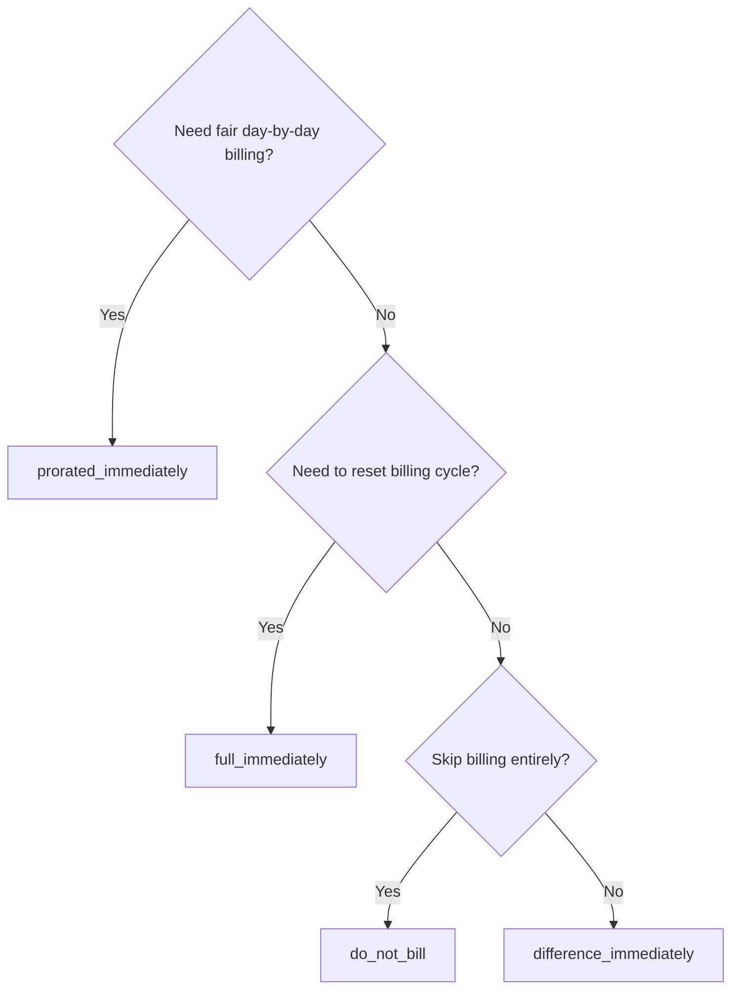
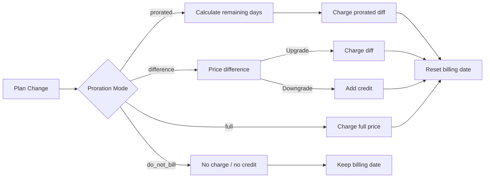

<CardGroup cols={3}>
<Card title="Change Plan API" icon="code" href="/api-reference/subscriptions/change-plan">
  Full API docs for updating subscriptions.
</Card>
<Card title="Plan Change Preview" icon="eye" href="/api-reference/subscriptions/preview-change-plan">
  See charge amounts before changing plans.
</Card>
<Card title="Integration Guide" icon="book" href="/developer-resources/subscription-integration-guide">
  Step-by-step subscription setup.
</Card>
</CardGroup>

## What is a subscription upgrade or downgrade?

Changing plans lets you move a customer between subscription tiers or quantities. Use it to:
- Align pricing with usage or features
- Move from monthly to annual (or vice versa)
- Adjust quantity for seat-based products

<Info>
Plan changes can trigger an immediate charge depending on the proration mode you choose.
</Info>

## When to use plan changes

- Upgrade when a customer needs more features, usage, or seats
- Downgrade when usage decreases
- Migrate users to a new product or price without cancelling their subscription

## Plan Change Flow



## Prerequisites

Before implementing subscription plan changes, ensure you have:

- A Dodo Payments merchant account with active subscription products
- API credentials (API key and webhook secret key) from the dashboard
- An existing active subscription to modify
- Webhook endpoint configured to handle subscription events

<Info>
For detailed setup instructions, see our [Integration Guide](/developer-resources/integration-guide#dashboard-setup).
</Info>

## Step-by-Step Implementation Guide

Follow this comprehensive guide to implement subscription plan changes in your application:

<Steps>
<Step title="Understand Plan Change Requirements">
Before implementing, determine:
- Which subscription products can be changed to which others
- What proration mode fits your business model
- How to handle failed plan changes gracefully
- Which webhook events to track for state management

<Tip>
Test plan changes thoroughly in test mode before implementing in production.
</Tip>
</Step>

<Step title="Choose Your Proration Strategy">
Select the billing approach that aligns with your business needs:

<Tabs>
<Tab title="prorated_immediately">
Best for: SaaS applications wanting to charge fairly for unused time
- Calculates exact prorated amount based on remaining cycle time
- Charges a prorated amount based on unused time remaining in the cycle
- Provides transparent billing to customers
</Tab>

<Tab title="difference_immediately">
Best for: Clear upgrade/downgrade scenarios
- Upgrade: Charge immediate difference (e.g., $30→$80 = charge $50)
- Downgrade: Credit remaining value for future renewals
- Simplifies billing logic and customer communication
</Tab>

<Tab title="full_immediately">
Best for: When you want to reset the billing cycle
- Charges full amount of new plan immediately
- Ignores remaining time from old plan
- Useful for annual to monthly transitions
</Tab>

<Tab title="do_not_bill">
Best for: Free migrations, courtesy switches, or absorbing cost differences
- No charges or credits calculated
- Customer moves to the new plan immediately without any billing adjustment
- Billing cycle remains unchanged
</Tab>
</Tabs>
</Step>

<Step title="Implement the Change Plan API">
Use the Change Plan API to modify subscription details:

<ParamField path="subscription_id" type="string" required>
The ID of the active subscription to modify.
</ParamField>

<ParamField path="product_id" type="string" required>
The new product ID to change the subscription to.
</ParamField>

<ParamField path="quantity" type="integer" required>
Number of units for the new plan (for seat-based products).
</ParamField>

<ParamField path="proration_billing_mode" type="string" required>
How to handle immediate billing: `prorated_immediately`, `full_immediately`, `difference_immediately`, or `do_not_bill`.
</ParamField>

<ParamField path="addons" type="array">
Optional addons for the new plan. Leaving this empty removes any existing addons.
</ParamField>

<ParamField path="on_payment_failure" type="string">
Controls behavior when the plan change payment fails:
- `prevent_change`: Keep subscription on current plan until payment succeeds
- `apply_change` (default): Apply plan change immediately regardless of payment outcome

If not specified, uses the business-level default setting.
</ParamField>

<ParamField path="collect_via_payment_link" type="boolean">
Raccogli l'importo della modifica del piano con un link di pagamento invece di addebitare il metodo di pagamento salvato dell'abbonamento. Il cliente paga su una pagina di checkout ospitata.

Richiede la capability `allow_plan_change_via_payment_link` dell'azienda (**Settings → Subscriptions → Collect Plan Change Payments by Payment Link**), `effective_at: immediately` e `on_payment_failure: prevent_change`. Consulta [Collecting Payment via a Checkout Link](#collecting-payment-via-a-checkout-link).

Ignorato dalla route di anteprima.
</ParamField>

<ParamField path="discount_codes" type="array">
Codici sconto **stacked** opzionali da applicare al nuovo piano (massimo 20, applicati nell'ordine dell'array). Il comportamento dipende da ciò che invii:

- **Non fornito / `null`** — gli sconti esistenti con `preserve_on_plan_change=true` vengono mantenuti, se applicabili al nuovo prodotto.
- **`[]` (array vuoto)** — rimuove tutti gli sconti esistenti dall'abbonamento.
- **`["CODE_A", "CODE_B", ...]`** — sostituisce gli eventuali sconti esistenti con questo insieme stacked.
</ParamField>

<ParamField path="discount_code" type="string" deprecated>
**Deprecato** — per le nuove integrazioni, preferisci `discount_codes`. Questo campo continua a funzionare per la compatibilità con le versioni precedenti, ma non può essere combinato con `discount_codes` nella stessa richiesta.
</ParamField>

<ParamField path="effective_at" type="string" default="immediately">
Quando applicare la modifica del piano:
- `immediately` (predefinito): applica subito la modifica del piano
- `next_billing_date`: pianifica la modifica per la prossima data di fatturazione. Il cliente mantiene il piano attuale fino alla fine del periodo di fatturazione.

Usa `next_billing_date` per i downgrade, così i clienti mantengono i vantaggi del piano attuale fino alla fine del periodo di fatturazione.
</ParamField>
</Step>

<Step title="Handle Webhook Events">
Configura la gestione dei webhook per monitorare gli esiti delle modifiche del piano:

- `subscription.active`: modifica del piano completata, abbonamento aggiornato
- `subscription.plan_changed`: piano dell'abbonamento modificato (upgrade/downgrade/aggiornamento dell'addon)
- `subscription.on_hold`: addebito della modifica del piano non riuscito, rinnovi interrotti
- `payment.succeeded`: addebito immediato della modifica del piano completato
- `payment.failed`: addebito immediato non riuscito

<Warning>
Verifica sempre le firme dei webhook e implementa l'elaborazione idempotente degli eventi.
</Warning>
</Step>

<Step title="Update Your Application State">
In base agli eventi webhook, aggiorna la tua applicazione:
- Concedi/revoca le funzionalità in base al nuovo piano
- Aggiorna il dashboard del cliente con i dettagli del nuovo piano
- Invia email di conferma sulle modifiche del piano
- Registra le modifiche di fatturazione per scopi di audit
</Step>

<Step title="Test and Monitor">
Testa accuratamente la tua implementazione:
- Testa tutte le modalità di prorazione con scenari diversi
- Verifica che la gestione dei webhook funzioni correttamente
- Monitora i tassi di successo delle modifiche del piano
- Configura avvisi per le modifiche del piano non riuscite

<Check>
L'implementazione della modifica del piano dell'abbonamento è ora pronta per l'uso in produzione.
</Check>
</Step>
</Steps>

## Anteprima delle modifiche del piano

Prima di confermare una modifica del piano, usa l'API Preview per mostrare ai clienti esattamente quanto verrà loro addebitato:

<Tabs>
<Tab title="Node.js SDK">

```javascript
const preview = await client.subscriptions.previewChangePlan('sub_123', {
  product_id: 'pdt_pro',
  quantity: 1,
  proration_billing_mode: 'prorated_immediately'
});

// Show customer the charge before confirming
console.log('Immediate charge:', preview.immediate_charge.summary);
console.log('New plan details:', preview.new_plan);
```

</Tab>

<Tab title="Python SDK">

```python
preview = client.subscriptions.preview_change_plan(
    subscription_id="sub_123",
    product_id="pdt_pro",
    quantity=1,
    proration_billing_mode="prorated_immediately"
)

# Show customer the charge before confirming
print("Immediate charge:", preview.immediate_charge.summary)
print("New plan details:", preview.new_plan)
```

</Tab>
</Tabs>

<Tip>
Usa l'API Preview per creare finestre di conferma che mostrino ai clienti l'importo esatto che verrà loro addebitato prima di confermare una modifica del piano.
</Tip>

## API Change Plan

Usa l'API Change Plan per modificare prodotto, quantità e comportamento della prorazione per un abbonamento attivo.

### Esempi per iniziare rapidamente

<Tabs>
  <Tab title="Node.js SDK">

    ```javascript
    import DodoPayments from 'dodopayments';

    const client = new DodoPayments({
      bearerToken: process.env.DODO_PAYMENTS_API_KEY,
      environment: 'test_mode', // defaults to 'live_mode'
    });

    async function changePlan() {
      // change-plan returns 200 with an empty body.
      await client.subscriptions.changePlan('sub_123', {
        product_id: 'pdt_new',
        quantity: 3,
        proration_billing_mode: 'prorated_immediately',
        on_payment_failure: 'prevent_change', // Optional: control behavior on payment failure
      });
      console.log('Plan change accepted; awaiting webhooks');
    }

    changePlan();
    ```

  </Tab>
  <Tab title="Python SDK">

    ```python
    import os
    from dodopayments import DodoPayments

    client = DodoPayments(
        bearer_token=os.environ.get("DODO_PAYMENTS_API_KEY"),
        environment="test_mode",  # defaults to "live_mode"
    )

    # change_plan returns 200 with an empty body.
    client.subscriptions.change_plan(
        subscription_id="sub_123",
        product_id="pdt_new",
        quantity=3,
        proration_billing_mode="prorated_immediately",
        on_payment_failure="prevent_change",  # Optional: control behavior on payment failure
    )
    print("Plan change accepted; awaiting webhooks")
    ```

  </Tab>
  <Tab title="Go SDK">

    ```go
    package main

    import (
      "context"
      "fmt"
      "github.com/dodopayments/dodopayments-go"
      "github.com/dodopayments/dodopayments-go/option"
    )

    func main() {
      client := dodopayments.NewClient(option.WithBearerToken("YOUR_TOKEN"))
      // ChangePlan returns no response body; a nil error means the change succeeded.
      err := client.Subscriptions.ChangePlan(context.TODO(), "sub_123", dodopayments.SubscriptionChangePlanParams{
        UpdateSubscriptionPlanReq: dodopayments.UpdateSubscriptionPlanReqParam{
          ProductID:            dodopayments.F("pdt_new"),
          Quantity:             dodopayments.F(int64(3)),
          ProrationBillingMode: dodopayments.F(dodopayments.UpdateSubscriptionPlanReqProrationBillingModeProratedImmediately),
          OnPaymentFailure:     dodopayments.F(dodopayments.UpdateSubscriptionPlanReqOnPaymentFailurePreventChange), // Optional
        },
      })
      if err != nil { panic(err) }
      fmt.Println("Plan change applied")
    }
    ```

  </Tab>
  <Tab title="HTTP">

    ```bash
    curl -X POST "$DODO_API_BASE/subscriptions/sub_123/change-plan" \
      -H "Authorization: Bearer $DODO_PAYMENTS_API_KEY" \
      -H "Content-Type: application/json" \
      -d '{
        "product_id": "pdt_new",
        "quantity": 3,
        "proration_billing_mode": "prorated_immediately",
        "on_payment_failure": "prevent_change"
      }'
    ```

  </Tab>
</Tabs>

Una modifica del piano completata restituisce immediatamente `200 OK`, prima che qualsiasi addebito sia stato effettivamente saldato. Il contenuto del body (`ChangePlanResponse`) dipende da come è stata riscossa la modifica:

| Caso | `payment_id` / `payment_link` / `client_secret` / `expires_on` |
|------|------------------------------------------------------------|
| Modifica pianificata (`effective_at: next_billing_date`) | Tutti `null` — non viene ancora addebitato nulla |
| `proration_billing_mode: do_not_bill` | Tutti `null` — nulla da addebitare |
| Addebito immediato ordinario (metodo di pagamento salvato) | Tutti `null` |
| `collect_via_payment_link: true` (link emesso) | Tutti **popolati** — riferimenti al checkout per il cliente |

<Note>
In ogni caso, questa risposta non è un risultato di pagamento: indica soltanto che la richiesta stessa è stata accettata. Non dice nulla sull'effettivo esito di un addebito immediato.

Per un **addebito immediato ordinario**, l'esito viene determinato fuori sessione subito dopo la chiamata.

Per una **richiesta `collect_via_payment_link`**, l'esito viene determinato più tardi e in modo asincrono: la risposta ti fornisce solo un link di checkout, l'abbonamento rimane sul piano attuale e l'esito non è noto finché il cliente non completa effettivamente il pagamento tramite quel link.

In entrambi i casi, non dedurre l'esito da questa risposta. Confermalo tramite webhook (<code>payment.succeeded</code>, <code>payment.failed</code>, <code>subscription.plan_changed</code>) oppure rileggendo l'abbonamento con <code>GET /subscriptions/&#123;subscription_id&#125;</code> — per il caso del payment link nello specifico, consulta [What Happens While the Link Is Unpaid](#what-happens-while-the-link-is-unpaid).
</Note>

<Warning>
Se l'addebito immediato non riesce, l'abbonamento può passare allo stato `subscription.on_hold` finché il pagamento non va a buon fine.
</Warning>

## Raccolta del pagamento tramite un link di checkout

Per impostazione predefinita, una modifica immediata del piano addebita direttamente il metodo di pagamento salvato dell'abbonamento. Imposta `collect_via_payment_link: true` per inviare il cliente a una pagina di checkout ospitata: è utile quando non esiste un metodo di pagamento salvato che puoi addebitare fuori sessione o quando vuoi che il cliente confermi attivamente il nuovo prezzo.

<Info>
Questo è anche ciò che alimenta l'opzione **Collect Plan Change Payments by Payment Link** in **Settings → Subscriptions**, che indirizza il flusso di modifica del piano del [Customer Portal](/features/customer-portal#collecting-plan-change-payments-by-payment-link) integrato al checkout invece che alla carta salvata.
</Info>

### Requisiti

`collect_via_payment_link: true` ha esito positivo solo quando sono soddisfatte **tutte** le condizioni seguenti; in caso contrario, la richiesta non va a buon fine con `422`:

- L'azienda ha abilitato la capability `allow_plan_change_via_payment_link` (**Settings → Subscriptions → Collect Plan Change Payments by Payment Link**).
- `effective_at` è `immediately` (il valore predefinito). Una modifica pianificata (`next_billing_date`) non richiede mai una pagina di checkout, poiché non viene addebitato nulla fino alla sua applicazione.
- `on_payment_failure` **effettivo** restituisce `prevent_change`. Non è necessario inviarlo esplicitamente: se il valore predefinito a livello aziendale (vedi **Business & Collection Defaults** di seguito) è già `prevent_change`, anche omettere il campo soddisfa questo requisito. Un `apply_change` esplicito, o un valore predefinito risolto in `apply_change`, non va a buon fine con `422`.

<Info>
`collect_via_payment_link` non è limitato agli upgrade: si applica a qualsiasi modifica immediata che comporti un addebito, inclusi i downgrade, purché siano soddisfatti i requisiti precedenti.
</Info>

Se la modifica risulta pari a **zero o a un credito** — `proration_billing_mode: do_not_bill`, oppure un'altra modalità che in questo ciclo risulti pari a zero — non c'è nulla da inserire in una pagina di checkout. Non viene emesso alcun payment link, `payment_link` e gli altri campi simili restituiscono `null`, e la modifica viene applicata immediatamente, proprio come avverrebbe senza `collect_via_payment_link`. Questo non è un `422`: il flag ha effetto solo quando c'è un importo positivo da riscuotere. Se imposti `collect_via_payment_link` sulle modifiche del piano in generale, anziché solo sugli upgrade evidenti, chiama prima [Preview Plan Change](/api-reference/subscriptions/preview-change-plan) e richiedi un link solo quando l'importo visualizzato in anteprima vale la pena di essere riscosso.

<Tabs>
<Tab title="Node.js SDK">

```javascript
const response = await client.subscriptions.changePlan('sub_123', {
  product_id: 'pdt_pro',
  quantity: 1,
  proration_billing_mode: 'prorated_immediately',
  effective_at: 'immediately',
  on_payment_failure: 'prevent_change',
  collect_via_payment_link: true,
});

// Hand response.payment_link to your frontend and send the customer there
console.log(response.payment_link);
```

</Tab>
<Tab title="Python SDK">

```python
response = client.subscriptions.change_plan(
    subscription_id="sub_123",
    product_id="pdt_pro",
    quantity=1,
    proration_billing_mode="prorated_immediately",
    effective_at="immediately",
    on_payment_failure="prevent_change",
    collect_via_payment_link=True,
)

# Hand response.payment_link to your frontend and send the customer there
print(response.payment_link)
```

</Tab>
<Tab title="HTTP">

```bash
curl -X POST "$DODO_API_BASE/subscriptions/sub_123/change-plan" \
  -H "Authorization: Bearer $DODO_PAYMENTS_API_KEY" \
  -H "Content-Type: application/json" \
  -d '{
    "product_id": "pdt_pro",
    "quantity": 1,
    "proration_billing_mode": "prorated_immediately",
    "effective_at": "immediately",
    "on_payment_failure": "prevent_change",
    "collect_via_payment_link": true
  }'
```

</Tab>
</Tabs>

Una richiesta completata restituisce i riferimenti al checkout:

```json
{
  "payment_id": "<payment_id>",
  "payment_link": "https://checkout.dodopayments.com/...",
  "client_secret": "<client_secret>",
  "expires_on": "<expires_on>"
}
```

### Cosa succede quando il link non è stato pagato

- L'abbonamento rimane sul piano **attuale**: `product_id`, `recurring_pre_tax_amount` e `next_billing_date` rimangono invariati finché il link non viene pagato.
- Un'ulteriore richiesta `change-plan` sullo stesso abbonamento viene rifiutata con `409 PendingPlanChangeExists` mentre il link è in attesa. Se necessario, annulla una modifica *pianificata* con `DELETE /subscriptions/{subscription_id}/change-plan/scheduled`, ma quell'endpoint non annulla una modifica tramite payment link in attesa: solo un pagamento completato o la scadenza possono farlo.
- Il cliente può ritentare il pagamento con la carta nella **stessa** sessione di checkout dopo un rifiuto; una nuova chiamata `change-plan` non è il percorso per ritentare il pagamento.
- Se il link non viene mai pagato, smette di funzionare dopo `expires_on`; poco dopo, l'abbonamento diventa automaticamente disponibile per accettare una nuova richiesta di modifica del piano.
- Se esisteva già una modifica *pianificata* (`next_billing_date`) e la sostituisci con `cancel_scheduled_change_plan: true`, la pianificazione originale rimane attiva mentre il link non è pagato e viene annullata solo dopo il pagamento del link, nella stessa transazione che applica il nuovo piano.

<Warning>
Una volta emessa una modifica immediata tramite payment link, ogni ulteriore richiesta di modifica del piano per quell'abbonamento, inclusa l'anteprima senza effetti collaterali, viene bloccata finché il link non viene risolto. Non emettere un link che non intendi far pagare subito al cliente.
</Warning>

## Gestione degli addon

Quando modifichi i piani degli abbonamenti, puoi modificare anche gli addon:

```javascript
// Add addons to the new plan
await client.subscriptions.changePlan('sub_123', {
  product_id: 'pdt_new',
  quantity: 1,
  proration_billing_mode: 'difference_immediately',
  addons: [
    { addon_id: 'addon_123', quantity: 2 }
  ]
});

// Remove all existing addons
await client.subscriptions.changePlan('sub_123', {
  product_id: 'pdt_new',
  quantity: 1,
  proration_billing_mode: 'difference_immediately',
  addons: [] // Empty array removes all existing addons
});
```

<Info>
Gli addon sono inclusi nel calcolo della prorazione e vengono addebitati in base alla modalità di prorazione selezionata.
</Info>

## Applicazione dei codici sconto

Puoi applicare uno o più **codici sconto stacked** quando modifichi i piani degli abbonamenti (massimo 20, applicati nell'ordine dell'array). È utile per offrire prezzi promozionali su upgrade o migrazioni.

<Tabs>
<Tab title="Node.js SDK">

```javascript
// Apply stacked discount codes during plan change
await client.subscriptions.changePlan('sub_123', {
  product_id: 'pdt_pro',
  quantity: 1,
  proration_billing_mode: 'prorated_immediately',
  discount_codes: ['UPGRADE20']
});
```

</Tab>
<Tab title="Python SDK">

```python
# Apply stacked discount codes during plan change
client.subscriptions.change_plan(
    subscription_id="sub_123",
    product_id="pdt_pro",
    quantity=1,
    proration_billing_mode="prorated_immediately",
    discount_codes=["UPGRADE20"]
)
```

</Tab>
<Tab title="HTTP">

```bash
curl -X POST "$DODO_API_BASE/subscriptions/sub_123/change-plan" \
  -H "Authorization: Bearer $DODO_PAYMENTS_API_KEY" \
  -H "Content-Type: application/json" \
  -d '{
    "product_id": "pdt_pro",
    "quantity": 1,
    "proration_billing_mode": "prorated_immediately",
    "discount_codes": ["UPGRADE20"]
  }'
```

</Tab>
</Tabs>

### Comportamento degli sconti durante la modifica del piano

| Valore di `discount_codes` | Comportamento |
|------------------------|----------|
| Non fornito / `null` | Gli sconti esistenti con `preserve_on_plan_change=true` vengono mantenuti automaticamente, se applicabili al nuovo prodotto. |
| `[]` (array vuoto) | **Tutti** gli sconti esistenti vengono rimossi dall'abbonamento. |
| `["CODE_A", "CODE_B", ...]` | Sostituisce gli eventuali sconti esistenti con questo insieme stacked, validato e applicato nell'ordine dell'array. |

<Info>
Il campo singolare `discount_code` su questo endpoint è **deprecato**, ma continua a funzionare per la compatibilità con le versioni precedenti: le integrazioni esistenti non devono essere modificate immediatamente. Non può essere combinato con `discount_codes` nella stessa richiesta. Esegui la migrazione al formato array quando preferisci.
</Info>

<Tip>
Usa la [Preview Plan Change API](/api-reference/subscriptions/preview-change-plan) con `discount_codes` per mostrare ai clienti esattamente quanto risparmieranno prima di confermare la modifica del piano.
</Tip>

## Modalità di prorazione

Scegli come addebitare il cliente quando modifichi i piani:

#### `prorated_immediately`
- Addebita la differenza parziale per il ciclo attuale
- Se il cliente è in prova, addebita immediatamente e passa subito al nuovo piano
- Downgrade: può generare un credito prorato applicato ai rinnovi futuri

#### `full_immediately`
- Addebita immediatamente l'intero importo del nuovo piano
- Ignora il tempo rimanente del vecchio piano

<Info>
I crediti creati dai downgrade usando <code>difference_immediately</code> sono associati all'abbonamento e distinti dalle entitlements di <a href="/features/credit-based-billing">Credit-Based Billing</a>. Vengono applicati automaticamente ai rinnovi futuri dello stesso abbonamento e non sono trasferibili tra abbonamenti.
</Info>

#### `difference_immediately`
- Upgrade: addebita immediatamente la differenza di prezzo tra il vecchio e il nuovo piano
- Downgrade: aggiunge il valore rimanente come credito interno all'abbonamento e lo applica automaticamente ai rinnovi

#### `do_not_bill`
- Non vengono calcolati addebiti o crediti
- Il cliente passa immediatamente al nuovo piano senza alcun adeguamento di fatturazione
- Il ciclo di fatturazione rimane invariato
- Ideale per migrazioni di cortesia, passaggi a piani gratuiti o assorbimento delle differenze di costo

| Funzionalità | `prorated_immediately` | `difference_immediately` | `full_immediately` | `do_not_bill` |
|---------|----------------------|------------------------|-------------------|--------------|
| **Addebito upgrade** | Differenza prorata per i giorni rimanenti | Differenza di prezzo completa tra i piani | Prezzo completo del nuovo piano | Nessun addebito |
| **Credito downgrade** | Credito prorato per i giorni rimanenti | Differenza di prezzo completa come credito | Nessun credito | Nessun credito |
| **Ciclo di fatturazione** | Si reimposta a oggi | Si reimposta a oggi | Si reimposta a oggi | Invariato |
| **Comportamento durante la prova** | Termina la prova, addebita immediatamente | Termina la prova, addebita immediatamente | Termina la prova, addebita l'intero importo | Termina la prova, nessun addebito |
| **Ideale per** | Fatturazione equa basata sul tempo | Calcolo semplice di upgrade/downgrade | Reimpostazione dei cicli di fatturazione | Migrazioni gratuite o passaggi di cortesia |
| **Complessità** | Media (calcolo dei giorni) | Bassa (semplice sottrazione) | Bassa (addebito completo) | Nessuna |



### Scenari di esempio

Usa questi valori canonici in modo coerente:
- Piano attuale: **Basic** a **$30/mese**
- Obiettivo dell'upgrade: **Pro** a **$80/mese**
- Obiettivo del downgrade (da Pro): **Starter** a **$20/mese**
- Ciclo di fatturazione: **30 giorni**, iniziato il **January 1**
- La modifica del piano avviene il **January 16** (15 giorni rimanenti, 15 giorni utilizzati)

<AccordionGroup>
  <Accordion title="Upgrade: Basic ($30) → Pro ($80) with prorated_immediately">

    ```
    Step 1: Calculate unused credit from current plan
      Unused days = 15 out of 30 days
      Credit = $30 × (15/30) = $15.00

    Step 2: Calculate prorated cost of new plan
      Remaining days = 15 out of 30 days
      New plan cost = $80 × (15/30) = $40.00

    Step 3: Calculate immediate charge
      Charge = New plan cost − Credit
      Charge = $40.00 − $15.00 = $25.00

    → Customer pays $25.00 now
    → Billing cycle resets to today (January 16)
    → Next renewal (Feb 15): $80.00/month
    ```

    ```javascript
    await client.subscriptions.changePlan('sub_123', {
      product_id: 'pdt_pro',
      quantity: 1,
      proration_billing_mode: 'prorated_immediately'
    })
    ```

  </Accordion>

  <Accordion title="Downgrade: Pro ($80) → Starter ($20) with prorated_immediately">

    ```
    Step 1: Calculate unused credit from current plan
      Unused days = 15 out of 30 days
      Credit = $80 × (15/30) = $40.00

    Step 2: Calculate prorated cost of new plan
      Remaining days = 15 out of 30 days
      New plan cost = $20 × (15/30) = $10.00

    Step 3: Calculate credit balance
      Credit = $40.00 − $10.00 = $30.00

    → No charge — $30.00 credit added to subscription
    → Billing cycle resets to today (January 16)
    → Credit auto-applies to future renewals
    → Next renewal (Feb 15): $20.00 − $20.00 (from credit) = $0.00 ($10.00 credit remaining)
    → Following renewal (Mar 15): $20.00 − $10.00 remaining credit = $10.00
    ```

    ```javascript
    await client.subscriptions.changePlan('sub_123', {
      product_id: 'pdt_starter',
      quantity: 1,
      proration_billing_mode: 'prorated_immediately'
    })
    ```

  </Accordion>

  <Accordion title="Upgrade: Basic ($30) → Pro ($80) with difference_immediately">

    ```
    Immediate charge = New plan price − Old plan price
                     = $80 − $30
                     = $50.00

    → Customer pays $50.00 now (regardless of cycle position)
    → Billing cycle resets to today (January 16)
    → Next renewal (Feb 15): $80.00/month
    ```

    ```javascript
    await client.subscriptions.changePlan('sub_123', {
      product_id: 'pdt_pro',
      quantity: 1,
      proration_billing_mode: 'difference_immediately'
    })
    ```

  </Accordion>

  <Accordion title="Downgrade: Pro ($80) → Starter ($20) with difference_immediately">

    ```
    Credit = Old plan price − New plan price
           = $80 − $20
           = $60.00

    → No charge — $60.00 credit added to subscription
    → Credit auto-applies to future renewals
    → Next renewal: $20.00 − $20.00 (from credit) = $0.00
    → Following renewal: $20.00 − $20.00 (from credit) = $0.00
    → Third renewal: $20.00 − $20.00 (from remaining credit) = $0.00
    ```

    ```javascript
    await client.subscriptions.changePlan('sub_123', {
      product_id: 'pdt_starter',
      quantity: 1,
      proration_billing_mode: 'difference_immediately'
    })
    ```

  </Accordion>

  <Accordion title="Upgrade: Basic ($30) → Pro ($80) with full_immediately">

    ```
    Immediate charge = Full new plan price = $80.00

    → Customer pays $80.00 now
    → No credit for unused time on old plan
    → Billing cycle resets to today (January 16)
    → Next renewal: February 16 at $80.00/month
    ```

    ```javascript
    await client.subscriptions.changePlan('sub_123', {
      product_id: 'pdt_pro',
      quantity: 1,
      proration_billing_mode: 'full_immediately'
    })
    ```

  </Accordion>

  <Accordion title="Mid-cycle upgrade with add-ons using prorated_immediately">

    ```
    Current: Basic plan ($30/month), no add-ons
    New: Pro plan ($80/month) + Extra Seats add-on ($10/seat × 3 seats = $30/month)
    Change on day 16 of 30 (15 days remaining)

    Step 1: Credit from current plan
      Credit = $30 × (15/30) = $15.00

    Step 2: Prorated cost of new plan + add-ons
      New plan = $80 × (15/30) = $40.00
      Add-ons = $30 × (15/30) = $15.00
      Total new = $55.00

    Step 3: Immediate charge
      Charge = $55.00 − $15.00 = $40.00

    → Customer pays $40.00 now
    → Next renewal: $80.00 + $30.00 = $110.00/month
    ```

    ```javascript
    await client.subscriptions.changePlan('sub_123', {
      product_id: 'pdt_pro',
      quantity: 1,
      proration_billing_mode: 'prorated_immediately',
      addons: [
        { addon_id: 'addon_seats', quantity: 3 }
      ]
    })
    ```

  </Accordion>
</AccordionGroup>

### Come ogni modalità gestisce la fatturazione



<Tip>
Scegli `prorated_immediately` per una contabilizzazione equa basata sul tempo; scegli `full_immediately` per riavviare la fatturazione; usa `difference_immediately` per upgrade semplici e crediti automatici sui downgrade; oppure usa `do_not_bill` per cambiare piano senza alcun adeguamento di fatturazione.
</Tip>

## Gestione dei pagamenti non riusciti

Controlla cosa succede quando il pagamento di una modifica del piano non riesce usando il parametro `on_payment_failure`.

### Modalità di pagamento non riuscito

<Tabs>
<Tab title="prevent_change (Recommended for critical upgrades)">
**Comportamento**: mantieni l'abbonamento sul piano attuale finché il pagamento non va a buon fine.

- La modifica del piano viene contrassegnata come "pending"
- Il cliente mantiene l'accesso al piano attuale
- L'abbonamento passa allo stato `active` solo dopo il pagamento completato
- Utile quando vuoi assicurarti del pagamento prima di concedere le funzionalità dell'upgrade

```javascript
await client.subscriptions.changePlan('sub_123', {
  product_id: 'pdt_pro',
  quantity: 1,
  proration_billing_mode: 'prorated_immediately',
  on_payment_failure: 'prevent_change'
});
```

</Tab>

<Tab title="apply_change (Default)">
**Comportamento**: applica immediatamente la modifica del piano indipendentemente dall'esito del pagamento.

- La modifica del piano viene applicata anche se il pagamento non riesce
- Il cliente ottiene immediatamente l'accesso al nuovo piano
- L'abbonamento può passare allo stato `on_hold` se il pagamento non riesce
- Adatto per upgrade non critici o quando ti fidi del cliente

```javascript
await client.subscriptions.changePlan('sub_123', {
  product_id: 'pdt_pro',
  quantity: 1,
  proration_billing_mode: 'prorated_immediately',
  on_payment_failure: 'apply_change' // This is the default
});
```

</Tab>
</Tabs>

<Info>
Se non specificato, il parametro `on_payment_failure` usa l'impostazione predefinita a livello aziendale configurata nel dashboard.
</Info>

### Quando usare ciascuna modalità

| Scenario | Modalità consigliata | Motivo |
|----------|------------------|--------|
| Upgrade a funzionalità premium | `prevent_change` | Assicurare il pagamento prima di concedere l'accesso |
| Aumento della quantità (più posti) | `prevent_change` | Evitare l'utilizzo senza pagamento |
| Downgrade dei piani | `apply_change` | Il cliente sta riducendo la spesa |
| Clienti enterprise affidabili | `apply_change` | Minor rischio di mancato pagamento |
| Conversione da prova a pagamento | `prevent_change` | Momento di pagamento critico |

## Impostazioni predefinite aziendali e di raccolta

Invece di passare i parametri di prorazione a ogni modifica del piano, puoi impostare una volta il **comportamento predefinito per upgrade e downgrade** a livello aziendale. Queste impostazioni predefinite si applicano a tutte le modifiche del piano dal portale clienti e possono essere **sostituite per ogni raccolta di prodotti**.

Esistono impostazioni predefinite separate per upgrade e downgrade:

| Impostazione | Campo (upgrade / downgrade) | Predefinito (upgrade) | Predefinito (downgrade) |
|---------|-----------------------------|-------------------|---------------------|
| Quando inizia il nuovo piano | `effective_at_on_upgrade` / `effective_at_on_downgrade` | `immediately` | `next_billing_date` |
| Come viene addebitato il cliente | `proration_billing_mode_on_upgrade` / `proration_billing_mode_on_downgrade` | `difference_immediately` | `difference_immediately` |
| Se il pagamento del cliente non riesce | `on_payment_failure` | `apply_change` | `apply_change` |

Configura le impostazioni predefinite aziendali in **Settings → Subscriptions** e le sostituzioni della raccolta in ogni raccolta di prodotti. Ogni campo della raccolta è indipendente: lascialo non impostato per **ereditare dall'impostazione predefinita aziendale**, oppure imposta un valore per sostituirlo solo per quella raccolta.

### Ordine di risoluzione

Per qualsiasi modifica del piano, ogni impostazione viene risolta nel seguente ordine:

```
per-request value (Change Plan API) → collection field (if set) → business field → system default
```

<Info>
Un valore passato esplicitamente alla [Change Plan API](/api-reference/subscriptions/change-plan) ha sempre la precedenza. Le impostazioni predefinite aziendali e della raccolta hanno effetto solo quando non viene fornito alcun valore esplicito, come avviene per tutte le modifiche del piano avviate dal portale clienti.
</Info>

<Tip>
Una configurazione comune: mantieni gli upgrade su `immediately` + `difference_immediately`, così i clienti pagano la differenza e ottengono subito l'accesso, e mantieni i downgrade su `next_billing_date`, così conservano il piano attuale fino alla fine del ciclo.
</Tip>

## Gestione dei webhook

Monitora lo stato dell'abbonamento tramite webhook per confermare le modifiche del piano e i pagamenti.

### Tipi di eventi da gestire
- `subscription.active`: abbonamento attivato
- `subscription.plan_changed`: piano dell'abbonamento modificato (modifiche di upgrade/downgrade/addon)
- `subscription.on_hold`: addebito non riuscito, rinnovi interrotti
- `subscription.renewed`: rinnovo completato
- `payment.succeeded`: pagamento della modifica del piano o del rinnovo completato
- `payment.failed`: pagamento non riuscito

<Info>
Ti consigliamo di basare la logica aziendale sugli eventi dell'abbonamento e di usare gli eventi di pagamento per la conferma e la riconciliazione.
</Info>

### Verifica delle firme e gestione degli intent

<Tabs>
  <Tab title="Next.js Route Handler">

    ```javascript
    import { NextRequest, NextResponse } from 'next/server';
    
    export async function POST(req) {
      const webhookId = req.headers.get('webhook-id');
      const webhookSignature = req.headers.get('webhook-signature');
      const webhookTimestamp = req.headers.get('webhook-timestamp');
      const secret = process.env.DODO_WEBHOOK_SECRET;
    
      const payload = await req.text();
      // verifySignature is a placeholder – in production, use a Standard Webhooks library
      const { valid, event } = await verifySignature(
        payload,
        { id: webhookId, signature: webhookSignature, timestamp: webhookTimestamp },
        secret
      );
      if (!valid) return NextResponse.json({ error: 'Invalid signature' }, { status: 400 });
    
      switch (event.type) {
        case 'subscription.active':
          // mark subscription active in your DB
          break;
        case 'subscription.plan_changed':
          // refresh entitlements and reflect the new plan in your UI
          break;
        case 'subscription.on_hold':
          // notify user to update payment method
          break;
        case 'subscription.renewed':
          // extend access window
          break;
        case 'payment.succeeded':
          // reconcile payment for plan change
          break;
        case 'payment.failed':
          // log and alert
          break;
        default:
          // ignore unknown events
          break;
      }
    
      return NextResponse.json({ received: true });
    }
    ```

  </Tab>
  <Tab title="Express.js">

    ```javascript
    import express from 'express';
    
    const app = express();
    app.post('/webhooks/dodo', express.raw({ type: 'application/json' }), async (req, res) => {
      const webhookId = req.header('webhook-id');
      const webhookSignature = req.header('webhook-signature');
      const webhookTimestamp = req.header('webhook-timestamp');
      const secret = process.env.DODO_WEBHOOK_SECRET;
      const payload = req.body.toString('utf8');
    
      const { valid, event } = await verifySignature(
        payload,
        { id: webhookId, signature: webhookSignature, timestamp: webhookTimestamp },
        secret
      );
      if (!valid) return res.status(400).send('Invalid signature');
    
      // handle events like above
      res.json({ received: true });
    });
    
    app.listen(3000);
    ```

  </Tab>
</Tabs>

<Note>
Per gli schemi dettagliati dei payload, consulta i <a href="/developer-resources/webhooks/intents/subscription">Subscription webhook payloads</a> e i <a href="/developer-resources/webhooks/intents/payment">Payment webhook payloads</a>.
</Note>

## Procedure consigliate

Segui queste raccomandazioni per modifiche affidabili dei piani degli abbonamenti:

### Strategia di modifica del piano
- **Testa accuratamente**: testa sempre le modifiche del piano in modalità test prima della produzione
- **Scegli attentamente la prorazione**: seleziona la modalità di prorazione in linea con il tuo modello aziendale
- **Gestisci correttamente gli errori**: implementa una gestione degli errori e una logica di retry adeguate
- **Monitora i tassi di successo**: monitora i tassi di successo/errore delle modifiche del piano e analizza i problemi

### Implementazione dei webhook
- **Verifica le firme**: convalida sempre le firme dei webhook per garantirne l'autenticità
- **Implementa l'idempotenza**: gestisci correttamente gli eventi webhook duplicati
- **Elabora in modo asincrono**: non bloccare le risposte dei webhook con operazioni pesanti
- **Registra tutto**: mantieni log dettagliati per il debug e gli audit

### Esperienza utente
- **Comunica chiaramente**: informa i clienti sulle modifiche di fatturazione e sulle tempistiche
- **Fornisci conferme**: invia email di conferma per le modifiche del piano completate
- **Gestisci i casi limite**: considera periodi di prova, prorazioni e pagamenti non riusciti
- **Aggiorna subito l'interfaccia**: rifletti le modifiche del piano nell'interfaccia della tua applicazione

## Problemi comuni e soluzioni

Risolvi i problemi tipici riscontrati durante le modifiche dei piani degli abbonamenti:

<AccordionGroup>
<Accordion title="Charge created but subscription not updated">
**Sintomi**: la chiamata API ha esito positivo, ma l'abbonamento rimane sul vecchio piano

**Cause comuni**:
- L'elaborazione del webhook non è riuscita o è stata ritardata
- Lo stato dell'applicazione non è stato aggiornato dopo la ricezione dei webhook
- Problemi nelle transazioni del database durante l'aggiornamento dello stato

**Soluzioni**:
- Implementa una gestione robusta dei webhook con logica di retry
- Usa operazioni idempotenti per gli aggiornamenti dello stato
- Aggiungi il monitoraggio per rilevare e segnalare gli eventi webhook mancanti
- Verifica che l'endpoint webhook sia accessibile e risponda correttamente
</Accordion>

<Accordion title="Credits not applied after downgrade">
**Sintomi**: il cliente effettua il downgrade, ma non vede il saldo dei crediti

**Cause comuni**:
- Aspettative sulla modalità di prorazione: i downgrade accreditano l'intera differenza di prezzo del piano con `difference_immediately`, mentre `prorated_immediately` crea un credito prorato basato sul tempo rimanente del ciclo
- I crediti sono specifici dell'abbonamento e non vengono trasferiti tra abbonamenti
- Il saldo dei crediti non è visibile nel dashboard del cliente

**Soluzioni**:
- Usa `difference_immediately` per i downgrade quando vuoi crediti automatici
- Spiega ai clienti che i crediti si applicano ai rinnovi futuri dello stesso abbonamento
- Implementa il portale clienti per mostrare i saldi dei crediti
- Controlla l'anteprima della prossima fattura per visualizzare i crediti applicati
</Accordion>

<Accordion title="Webhook signature verification fails">
**Sintomi**: gli eventi webhook vengono rifiutati a causa di una firma non valida

**Cause comuni**:
- Chiave segreta del webhook errata
- Body della richiesta raw modificato prima della verifica della firma
- Algoritmo di verifica della firma errato

**Soluzioni**:
- Verifica di usare il corretto `DODO_WEBHOOK_SECRET` dal dashboard
- Leggi il body raw della richiesta prima di qualsiasi middleware di parsing JSON
- Usa la libreria standard di verifica dei webhook per la tua piattaforma
- Testa la verifica della firma dei webhook nell'ambiente di sviluppo
</Accordion>

<Accordion title="Plan change fails with 422 error">
**Sintomi**: l'API restituisce un errore 422 Unprocessable Entity

**Cause comuni**:
- ID dell'abbonamento o ID del prodotto non validi
- Abbonamento non nello stato attivo
- Parametri obbligatori mancanti
- Prodotto non disponibile per le modifiche del piano

**Soluzioni**:
- Verifica che l'abbonamento esista e sia attivo
- Controlla che l'ID del prodotto sia valido e disponibile
- Assicurati che siano forniti tutti i parametri obbligatori
- Consulta la documentazione API per i requisiti dei parametri
</Accordion>

<Accordion title="Immediate charge fails during plan change">
**Sintomi**: la modifica del piano è stata avviata, ma l'addebito immediato non riesce

**Cause comuni**:
- Fondi insufficienti sul metodo di pagamento del cliente
- Metodo di pagamento scaduto o non valido
- La banca ha rifiutato la transazione
- Il rilevamento delle frodi ha bloccato l'addebito

**Soluzioni**:
- Gestisci opportunamente gli eventi webhook `payment.failed`
- Informa il cliente di aggiornare il metodo di pagamento
- Implementa una logica di retry per gli errori temporanei
- Valuta di consentire modifiche del piano con addebiti immediati non riusciti
</Accordion>

<Accordion title="Subscription on hold after plan change">
**Sintomi**: l'addebito della modifica del piano non riesce e l'abbonamento passa allo stato `on_hold`

**Cosa succede**:
Quando l'addebito di una modifica del piano non riesce, l'abbonamento viene automaticamente impostato sullo stato `on_hold`. L'abbonamento non verrà rinnovato automaticamente finché il metodo di pagamento non viene aggiornato.

**Soluzione**: aggiorna il metodo di pagamento per riattivare l'abbonamento

Per riattivare un abbonamento nello stato `on_hold` dopo una modifica del piano non riuscita:

1. **Aggiorna il metodo di pagamento** usando l'API Update Payment Method
2. **Creazione automatica dell'addebito**: l'API crea automaticamente un addebito per gli importi ancora dovuti
3. **Generazione della fattura**: viene generata una fattura per l'addebito
4. **Elaborazione del pagamento**: il pagamento viene elaborato usando il nuovo metodo di pagamento
5. **Riattivazione**: dopo il pagamento completato, l'abbonamento viene riattivato allo stato `active`

<CodeGroup>

```javascript Node.js
// Reactivate subscription from on_hold after failed plan change
async function reactivateAfterFailedPlanChange(subscriptionId) {
  // Update payment method - automatically creates charge for remaining dues
  const response = await client.subscriptions.updatePaymentMethod(subscriptionId, {
    payment_method: { type: 'new', return_url: 'https://example.com/return' }
  });
  
  if (response.payment_id) {
    console.log('Charge created for remaining dues:', response.payment_id);
    console.log('Payment link:', response.payment_link);
    
    // Redirect customer to payment_link to complete payment
    // Monitor webhooks for:
    // 1. payment.succeeded - charge succeeded
    // 2. subscription.active - subscription reactivated
  }
  
  return response;
}

// Or use existing payment method if available
async function reactivateWithExistingPaymentMethod(subscriptionId, paymentMethodId) {
  const response = await client.subscriptions.updatePaymentMethod(subscriptionId, {
    payment_method: { type: 'existing', payment_method_id: paymentMethodId }
  });
  
  // Monitor webhooks for payment.succeeded and subscription.active
  return response;
}
```

```python Python
# Reactivate subscription from on_hold after failed plan change
def reactivate_after_failed_plan_change(subscription_id):
    # Update payment method - automatically creates charge for remaining dues
    response = client.subscriptions.update_payment_method(
        subscription_id=subscription_id,
        payment_method={"type": "new", "return_url": "https://example.com/return"},
    )
    
    if response.payment_id:
        print("Charge created for remaining dues:", response.payment_id)
        print("Payment link:", response.payment_link)
        
        # Redirect customer to payment_link to complete payment
        # Monitor webhooks for:
        # 1. payment.succeeded - charge succeeded
        # 2. subscription.active - subscription reactivated
    
    return response

# Or use existing payment method if available
def reactivate_with_existing_payment_method(subscription_id, payment_method_id):
    response = client.subscriptions.update_payment_method(
        subscription_id=subscription_id,
        payment_method={"type": "existing", "payment_method_id": payment_method_id},
    )
    
    # Monitor webhooks for payment.succeeded and subscription.active
    return response
```

</CodeGroup>

**Eventi webhook da monitorare**:
- `subscription.on_hold`: abbonamento sospeso (ricevuto quando l'addebito della modifica del piano non riesce)
- `payment.succeeded`: pagamento degli importi ancora dovuti completato (dopo l'aggiornamento del metodo di pagamento)
- `subscription.active`: abbonamento riattivato dopo il pagamento completato

**Procedure consigliate**:
- Informa immediatamente i clienti quando l'addebito di una modifica del piano non riesce
- Fornisci istruzioni chiare su come aggiornare il metodo di pagamento
- Monitora gli eventi webhook per tenere traccia dello stato di riattivazione
- Valuta di implementare una logica di retry automatica per i pagamenti temporaneamente non riusciti

<Card title="Update Payment Method API Reference" icon="code" href="/api-reference/subscriptions/update-payment-method">
Consulta la documentazione API completa per aggiornare i metodi di pagamento e riattivare gli abbonamenti.
</Card>
</Accordion>
</AccordionGroup>

## Test della tua implementazione

Segui questi passaggi per testare accuratamente l'implementazione delle modifiche del piano degli abbonamenti:

<Steps>
<Step title="Set up test environment">
- Usa chiavi API di test e prodotti di test
- Crea abbonamenti di test con diversi tipi di piano
- Configura l'endpoint webhook di test
- Configura il monitoraggio e il logging
</Step>

<Step title="Test different proration modes">
- Testa `prorated_immediately` con diverse posizioni nel ciclo di fatturazione
- Testa `difference_immediately` per upgrade e downgrade
- Testa `full_immediately` per reimpostare i cicli di fatturazione
- Testa `do_not_bill` per passaggi di piano senza addebiti o crediti
- Verifica che i calcoli dei crediti siano corretti
</Step>

<Step title="Test webhook handling">
- Verifica che vengano ricevuti tutti gli eventi webhook pertinenti
- Testa la verifica delle firme dei webhook
- Gestisci correttamente gli eventi webhook duplicati
- Testa gli scenari di errore nell'elaborazione dei webhook
</Step>

<Step title="Test error scenarios">
- Testa con ID di abbonamento non validi
- Testa con metodi di pagamento scaduti
- Testa errori di rete e timeout
- Testa con fondi insufficienti
</Step>

<Step title="Monitor in production">
- Configura avvisi per le modifiche del piano non riuscite
- Monitora i tempi di elaborazione dei webhook
- Monitora i tassi di successo delle modifiche del piano
- Esamina i ticket dell'assistenza clienti relativi ai problemi delle modifiche del piano
</Step>
</Steps>

## Gestione degli errori

Gestisci correttamente gli errori API comuni nella tua implementazione:

### Codici di stato HTTP

<AccordionGroup>
<Accordion title="200 OK">
La richiesta di modifica del piano è stata elaborata correttamente. Il body della risposta è vuoto, ad eccezione di una richiesta `collect_via_payment_link` completata, che restituisce i riferimenti al checkout: consulta [Collecting Payment via a Checkout Link](#collecting-payment-via-a-checkout-link). Se `on_payment_failure=prevent_change`, la modifica del piano rimane in attesa finché il pagamento non va a buon fine.
</Accordion>

<Accordion title="400 Bad Request">
Parametri della richiesta non validi. Verifica che tutti i campi obbligatori siano forniti e formattati correttamente.
</Accordion>

<Accordion title="401 Unauthorized">
Chiave API non valida o mancante. Verifica che `DODO_PAYMENTS_API_KEY` sia corretto e disponga delle autorizzazioni appropriate.
</Accordion>

<Accordion title="404 Not Found">
ID dell'abbonamento non trovato o non appartenente al tuo account.
</Accordion>

<Accordion title="409 Conflict">
Esiste già una modifica del piano in attesa per questo abbonamento (`PendingPlanChangeExists`). Per una modifica *pianificata*, annullala con `DELETE /subscriptions/{subscription_id}/change-plan/scheduled` prima di inviarne una nuova. Per una modifica *payment link* in attesa, non esiste alcun endpoint di annullamento: l'abbonamento accetta una nuova richiesta di modifica del piano quando il cliente paga o il link scade.
</Accordion>

<Accordion title="422 Unprocessable Entity">
L'abbonamento è inattivo o on-demand, oppure la richiesta non è idonea per `collect_via_payment_link`: l'azienda non ha abilitato la capability, `effective_at` non è `immediately` oppure `on_payment_failure` non è `prevent_change`. Consulta [Requirements](#requirements).
</Accordion>

<Accordion title="500 Internal Server Error">
Si è verificato un errore del server. Riprova la richiesta dopo una breve attesa.
</Accordion>
</AccordionGroup>

### Formato della risposta di errore

```json
{
  "error": {
    "code": "subscription_not_found",
    "message": "The subscription with ID 'sub_123' was not found",
    "details": {
      "subscription_id": "sub_123"
    }
  }
}
```

## Passaggi successivi

- Consulta la <a href="/api-reference/subscriptions/change-plan">Change Plan API</a>
- Esplora <a href="/features/credit-based-billing">Credit-Based Billing</a>
- Implementa avvisi per `subscription.on_hold`
- Consulta la nostra <a href="/developer-resources/webhooks">Webhook Integration Guide</a>
