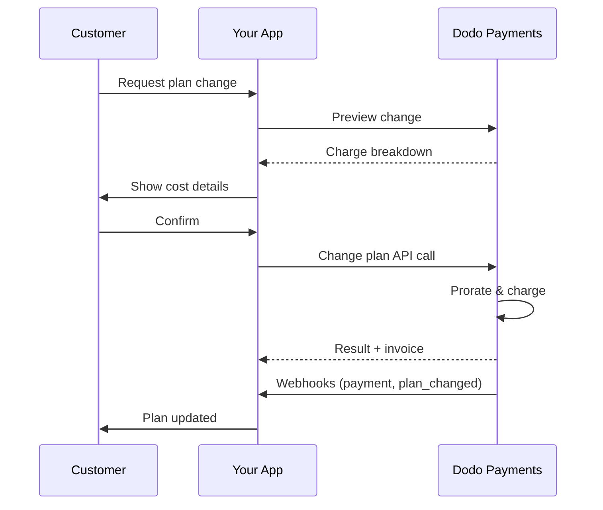
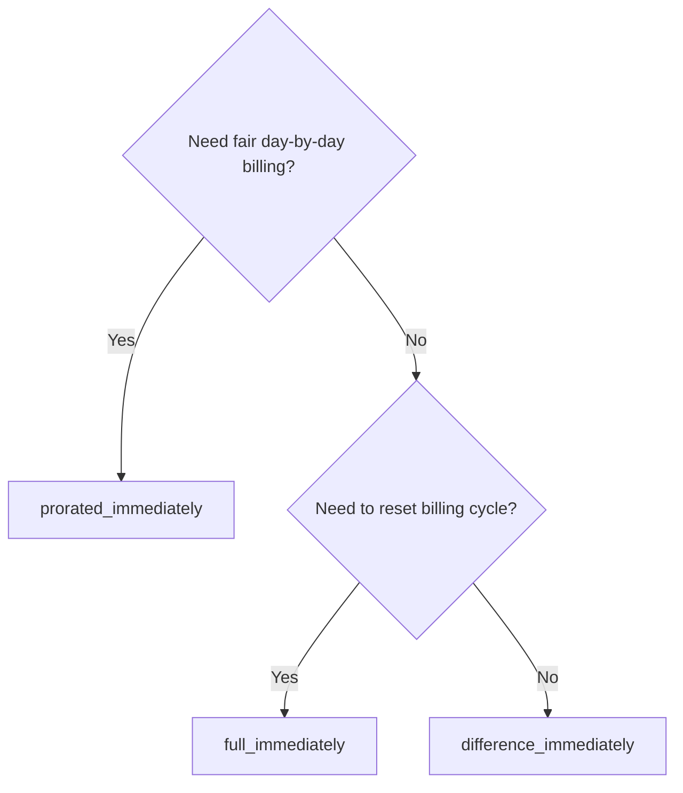
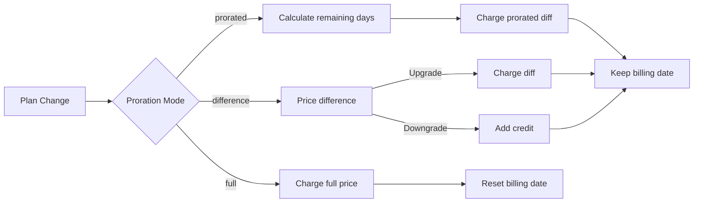

<CardGroup cols={3}>
<Card title="API per Cambiare Piano" icon="code" href="/api-reference/subscriptions/change-plan">
  Documentazione API completa per l'aggiornamento degli abbonamenti.
</Card>
<Card title="Anteprima Cambiamento Piano" icon="eye" href="/api-reference/subscriptions/preview-change-plan">
  Vedi gli importi delle spese prima di cambiare i piani.
</Card>
<Card title="Guida all'Integrazione" icon="book" href="/developer-resources/subscription-integration-guide">
  Guida passo-passo per la configurazione dell'abbonamento.
</Card>
</CardGroup>

## Cos'è un aggiornamento o un downgrade dell'abbonamento?

Cambiare piano permette di spostare un cliente tra i livelli di abbonamento o le quantità. Usalo per:
- Allineare i prezzi con l'uso o le funzionalità
- Passare da mensile ad annuale (o viceversa)
- Regolare la quantità per prodotti basati su posti

<Info>
I cambiamenti di piano possono attivare un addebito immediato in base alla modalità di ripartizione scelta.
</Info>

## Quando utilizzare i cambiamenti di piano

- Aggiorna quando un cliente ha bisogno di più funzionalità, utilizzo o posti
- Riduci quando l'uso diminuisce
- Migra gli utenti a un nuovo prodotto o prezzo senza annullare il loro abbonamento

## Flusso di Cambiamento del Piano



## Requisiti

Prima di implementare i cambiamenti di piano di abbonamento, assicurati di avere:

- Un account commerciante Dodo Payments con prodotti di abbonamento attivi
- Credenziali API (chiave API e chiave segreta webhook) dal dashboard
- Un abbonamento attivo esistente da modificare
- Endpoint webhook configurato per gestire eventi di abbonamento

<Info>
Per istruzioni dettagliate sulla configurazione, consulta la nostra [Guida all'Integrazione](/developer-resources/integration-guide#dashboard-setup).
</Info>

## Guida all'Implementazione Passo-Passo

Segui questa guida completa per implementare i cambiamenti di piano di abbonamento nella tua applicazione:

<Steps>
<Step title="Comprendere i Requisiti per il Cambiamento di Piano">
Prima di implementare, determina:
- Quali prodotti di abbonamento possono essere cambiati con quali altri
- Quale modalità di proration si adatta al tuo modello di business
- Come gestire i cambiamenti di piano falliti in modo elegante
- Quali eventi webhook monitorare per la gestione dello stato

<Tip>
Testa i cambiamenti di piano a fondo in modalità test prima di implementarli in produzione.
</Tip>
</Step>

<Step title="Scegli la Tua Strategia di Proration">
Seleziona l'approccio di fatturazione che si allinea con le tue esigenze aziendali:

<Tabs>
<Tab title="prorated_immediately">
Ideale per: applicazioni SaaS che vogliono addebitare equamente per il tempo non utilizzato
- Calcola l'importo esatto prorato in base al tempo rimanente del ciclo
- Addebita un importo prorato in base al tempo non utilizzato rimanente nel ciclo
- Fornisce una fatturazione trasparente ai clienti
</Tab>

<Tab title="difference_immediately">
Ideale per: scenari di upgrade/downgrade chiari
- Upgrade: addebita la differenza immediata (es. $30→$80 = addebita $50)
- Downgrade: accredita il valore rimanente per i rinnovi futuri
- Semplifica la logica di fatturazione e la comunicazione con i clienti
</Tab>

<Tab title="full_immediately">
Ideale per: quando vuoi resettare il ciclo di fatturazione
- Addebita l'importo totale del nuovo piano immediatamente
- Ignora il tempo rimanente dal vecchio piano
- Utile per transizioni da annuale a mensile
</Tab>
</Tabs>
</Step>

<Step title="Implementa l'API Cambia Piano">
Usa l'API Cambia Piano per modificare i dettagli dell'abbonamento:

<ParamField path="subscription_id" type="string" required>
L'ID dell'abbonamento attivo da modificare.
</ParamField>

<ParamField path="product_id" type="string" required>
Il nuovo ID prodotto a cui cambiare l'abbonamento.
</ParamField>

<ParamField path="quantity" type="integer" default="1">
Numero di unità per il nuovo piano (per prodotti basati su posti).
</ParamField>

<ParamField path="proration_billing_mode" type="string" required>
Come gestire la fatturazione immediata: `prorated_immediately`, `full_immediately`, o `difference_immediately`.
</ParamField>

<ParamField path="addons" type="array">
Addon opzionali per il nuovo piano. Lasciando questo vuoto verranno rimossi eventuali addon esistenti.
</ParamField>

<ParamField path="on_payment_failure" type="string">
Controlla il comportamento quando il pagamento del cambiamento di piano fallisce:
- `prevent_change`: Mantieni l'abbonamento sul piano attuale fino a quando il pagamento non riesce
- `apply_change` (predefinito): Applica immediatamente il cambiamento di piano indipendentemente dall'esito del pagamento

Se non specificato, utilizza l'impostazione predefinita a livello aziendale.

<Step title="Gestire Eventi Webhook">
Configura la gestione dei webhook per monitorare gli esiti dei cambiamenti di piano:

- `subscription.active`: Cambiamento di piano riuscito, abbonamento aggiornato
- `subscription.plan_changed`: Piano di abbonamento cambiato (upgrade/downgrade/aggiornamento addon)
- `subscription.on_hold`: Addebito per cambiamento di piano fallito, abbonamento in pausa
- `payment.succeeded`: Addebito immediato per cambiamento di piano riuscito
- `payment.failed`: Addebito immediato fallito

<Warning>
Verifica sempre le firme dei webhook e implementa un'adeguata elaborazione degli eventi idempotenti.
</Warning>
</Step>

<Step title="Aggiorna lo Stato della tua Applicazione">
In base agli eventi dei webhook, aggiorna la tua applicazione:
- Concedi/rimuovi funzionalità in base al nuovo piano
- Aggiorna il cruscotto cliente con i dettagli del nuovo piano
- Invia email di conferma sui cambiamenti di piano
- Registra i cambiamenti di fatturazione per fini di audit
</Step>

<Step title="Test e Monitoraggio">
Testa accuratamente la tua implementazione:
- Prova tutte le modalità di ripartizione con diversi scenari
- Verifica che la gestione dei webhook funzioni correttamente
- Monitora i tassi di successo dei cambiamenti di piano
- Imposta avvisi per i cambiamenti di piano falliti
</Step>

<Check>
La tua implementazione dei cambiamenti di piano dell'abbonamento è ora pronta per l'uso in produzione.
</Check>
</Step>
</Steps>

## Anteprima dei Cambiamenti di Piano

Prima di impegnarti in un cambiamento di piano, usa l'API di Anteprima per mostrare ai clienti esattamente cosa gli verrà addebitato:

<Tabs>
<Tab title="Node.js SDK">

```javascript
const preview = await client.subscriptions.previewChangePlan('sub_123', {
  product_id: 'prod_pro',
  quantity: 1,
  proration_billing_mode: 'prorated_immediately'
});

// Show customer the charge before confirming
console.log('Immediate charge:', preview.immediate_charge.summary);
console.log('New plan details:', preview.new_plan);
```

</Tab>

<Tab title="Python SDK">

```python
preview = client.subscriptions.preview_change_plan(
    subscription_id="sub_123",
    product_id="prod_pro",
    quantity=1,
    proration_billing_mode="prorated_immediately"
)

# Show customer the charge before confirming
print("Immediate charge:", preview.immediate_charge.summary)
print("New plan details:", preview.new_plan)
```

</Tab>
</Tabs>

<Tip>
Usa l'API di anteprima per costruire finestre di conferma che mostrano ai clienti l'importo esatto che verrà addebitato prima di confermare un cambiamento di piano.
</Tip>

## API per Cambiare Piano

Usa l'API per Cambiare Piano per modificare prodotto, quantità e comportamento di ripartizione per un abbonamento attivo.

### Esempi di avvio rapido

<Tabs>
  <Tab title="Node.js SDK">

    ```javascript
    import DodoPayments from 'dodopayments';

    const client = new DodoPayments({
      bearerToken: process.env.DODO_PAYMENTS_API_KEY,
      environment: 'test_mode', // defaults to 'live_mode'
    });

    async function changePlan() {
      const result = await client.subscriptions.changePlan('sub_123', {
        product_id: 'prod_new',
        quantity: 3,
        proration_billing_mode: 'prorated_immediately',
        on_payment_failure: 'prevent_change', // Optional: control behavior on payment failure
      });
      console.log(result.status, result.invoice_id, result.payment_id);
    }

    changePlan();
    ```

  </Tab>
  <Tab title="Python SDK">

    ```python
    import os
    from dodopayments import DodoPayments

    client = DodoPayments(
        bearer_token=os.environ.get("DODO_PAYMENTS_API_KEY"),
        environment="test_mode",  # defaults to "live_mode"
    )

    result = client.subscriptions.change_plan(
        subscription_id="sub_123",
        product_id="prod_new",
        quantity=3,
        proration_billing_mode="prorated_immediately",
        on_payment_failure="prevent_change",  # Optional: control behavior on payment failure
    )
    print(result.status, result.get("invoice_id"), result.get("payment_id"))
    ```

  </Tab>
  <Tab title="Go SDK">

    ```go
    package main

    import (
      "context"
      "fmt"
      "github.com/dodopayments/dodopayments-go"
      "github.com/dodopayments/dodopayments-go/option"
    )

    func main() {
      client := dodopayments.NewClient(option.WithBearerToken("YOUR_TOKEN"))
      res, err := client.Subscriptions.ChangePlan(context.TODO(), dodopayments.SubscriptionChangePlanParams{
        SubscriptionID: dodopayments.F("sub_123"),
        ProductID:             dodopayments.F("prod_new"),
        Quantity:              dodopayments.F(int64(3)),
        ProrationBillingMode:  dodopayments.F(dodopayments.SubscriptionChangePlanParamsProrationBillingModeProratedImmediately),
        OnPaymentFailure:      dodopayments.F(dodopayments.OnPaymentFailurePreventChange), // Optional
      })
      if err != nil { panic(err) }
      fmt.Println(res.Status, res.InvoiceID, res.PaymentID)
    }
    ```

  </Tab>
  <Tab title="HTTP">

    ```bash
    curl -X POST "$DODO_API_BASE/subscriptions/sub_123/change-plan" \
      -H "Authorization: Bearer $DODO_PAYMENTS_API_KEY" \
      -H "Content-Type: application/json" \
      -d '{
        "product_id": "prod_new",
        "quantity": 3,
        "proration_billing_mode": "prorated_immediately",
        "on_payment_failure": "prevent_change"
      }'
    ```

  </Tab>
</Tabs>

```json Success
{
  "status": "processing",
  "subscription_id": "sub_123",
  "invoice_id": "inv_789",
  "payment_id": "pay_456",
  "proration_billing_mode": "prorated_immediately"
}
```

<Note>
Campi come <code>invoice_id</code> e <code>payment_id</code> vengono restituiti solo quando viene creato un addebito immediato e/o una fattura durante il cambiamento di piano. Fare sempre riferimento agli eventi dei webhook (es. <code>payment.succeeded</code>, <code>subscription.plan_changed</code>) per confermare gli esiti.
</Note>

<Warning>
Se l'addebito immediato fallisce, l'abbonamento potrebbe passare a `subscription.on_hold` fino a quando il pagamento non riesce.
</Warning>

## Gestione degli Addon

Quando cambi i piani degli abbonamenti, puoi anche modificare gli addon:

```javascript
// Add addons to the new plan
await client.subscriptions.changePlan('sub_123', {
  product_id: 'prod_new',
  quantity: 1,
  proration_billing_mode: 'difference_immediately',
  addons: [
    { addon_id: 'addon_123', quantity: 2 }
  ]
});

// Remove all existing addons
await client.subscriptions.changePlan('sub_123', {
  product_id: 'prod_new',
  quantity: 1,
  proration_billing_mode: 'difference_immediately',
  addons: [] // Empty array removes all existing addons
});
```

<Info>
Gli addon sono inclusi nel calcolo della ripartizione e saranno addebitati in base alla modalità di ripartizione selezionata.
</Info>

## Modalità di ripartizione

Scegli come addebitare il cliente quando cambi piano:

#### `prorated_immediately`
- Addebiti per la differenza parziale nel ciclo corrente
- Se in prova, addebiti immediatamente e passa al nuovo piano ora
- Downgrade: potrebbe generare un credito ripartito applicato alle future rinnovazioni

#### `full_immediately`
- Addebita l'importo totale del nuovo piano immediatamente
- Ignora il tempo rimanente dal vecchio piano

<Info>
I crediti creati dai downgrade utilizzando <code>difference_immediately</code> sono specifici per l'abbonamento e distinti dai <a href="/features/customer-credit">Crediti Cliente</a>. Vengono automaticamente applicati alle future rinnovazioni dello stesso abbonamento e non sono trasferibili tra gli abbonamenti.
</Info>

#### `difference_immediately`
- Upgrade: addebita immediatamente la differenza di prezzo tra i vecchi e i nuovi piani
- Downgrade: aggiungi il valore rimanente come credito interno all'abbonamento e applicalo automaticamente alle rinnovazioni

| Funzione | `prorated_immediately` | `difference_immediately` | `full_immediately` |
|---------|----------------------|------------------------|-------------------|
| **Addebito per upgrade** | Differenza ripartita per i giorni rimanenti | Differenza di prezzo totale tra i piani | Prezzo totale del nuovo piano |
| **Credito per downgrade** | Credito ripartito per i giorni rimanenti | Differenza totale di prezzo come credito | Nessun credito |
| **Ciclo di fatturazione** | Invariato | Invariato | Ripristina a oggi |
| **Comportamento di prova** | Termina la prova, addebita immediatamente | Termina la prova, addebita immediatamente | Termina la prova, addebita l'importo totale |
| **Migliore per** | Fatturazione equa basata su tempo | Matematica di upgrade/downgrade semplice | Ripristino dei cicli di fatturazione |
| **Complessità** | Media (calcolo dei giorni) | Bassa (subtrazione semplice) | Bassa (addebito totale) |



### Scenari di esempio

Usa questi numeri canonici in modo coerente:
- Piano attuale: **Basic** a **$30/mese**
- Obiettivo di upgrade: **Pro** a **$80/mese**
- Obiettivo di downgrade (da Pro): **Starter** a **$20/mese**
- Ciclo di fatturazione: **30 giorni**, iniziato il **1 gennaio**
- Il cambiamento di piano avviene il **16 gennaio** (15 giorni rimanenti, 15 giorni utilizzati)

<AccordionGroup>
  <Accordion title="Upgrade: Basic ($30) → Pro ($80) con prorated_immediately">

    ```
    Step 1: Calculate unused credit from current plan
      Unused days = 15 out of 30 days
      Credit = $30 × (15/30) = $15.00

    Step 2: Calculate prorated cost of new plan
      Remaining days = 15 out of 30 days
      New plan cost = $80 × (15/30) = $40.00

    Step 3: Calculate immediate charge
      Charge = New plan cost − Credit
      Charge = $40.00 − $15.00 = $25.00

    → Customer pays $25.00 now
    → Next renewal (Feb 1): $80.00/month
    ```

    ```javascript
    await client.subscriptions.changePlan('sub_123', {
      product_id: 'prod_pro',
      quantity: 1,
      proration_billing_mode: 'prorated_immediately'
    })
    ```

  </Accordion>

  <Accordion title="Downgrade: Pro ($80) → Starter ($20) con prorated_immediately">

    ```
    Step 1: Calculate unused credit from current plan
      Unused days = 15 out of 30 days
      Credit = $80 × (15/30) = $40.00

    Step 2: Calculate prorated cost of new plan
      Remaining days = 15 out of 30 days
      New plan cost = $20 × (15/30) = $10.00

    Step 3: Calculate credit balance
      Credit = $40.00 − $10.00 = $30.00

    → No charge — $30.00 credit added to subscription
    → Credit auto-applies to future renewals
    → Next renewal (Feb 1): $20.00 − $30.00 credit = $0.00
    → Following renewal (Mar 1): $20.00 − $10.00 remaining credit = $10.00
    ```

    ```javascript
    await client.subscriptions.changePlan('sub_123', {
      product_id: 'prod_starter',
      quantity: 1,
      proration_billing_mode: 'prorated_immediately'
    })
    ```

  </Accordion>

  <Accordion title="Upgrade: Basic ($30) → Pro ($80) con difference_immediately">

    ```
    Immediate charge = New plan price − Old plan price
                     = $80 − $30
                     = $50.00

    → Customer pays $50.00 now (regardless of cycle position)
    → Next renewal (Feb 1): $80.00/month
    ```

    ```javascript
    await client.subscriptions.changePlan('sub_123', {
      product_id: 'prod_pro',
      quantity: 1,
      proration_billing_mode: 'difference_immediately'
    })
    ```

  </Accordion>

  <Accordion title="Downgrade: Pro ($80) → Starter ($20) con difference_immediately">

    ```
    Credit = Old plan price − New plan price
           = $80 − $20
           = $60.00

    → No charge — $60.00 credit added to subscription
    → Credit auto-applies to future renewals
    → Next renewal: $20.00 − $20.00 (from credit) = $0.00
    → Following renewal: $20.00 − $20.00 (from credit) = $0.00
    → Third renewal: $20.00 − $20.00 (from remaining credit) = $0.00
    ```

    ```javascript
    await client.subscriptions.changePlan('sub_123', {
      product_id: 'prod_starter',
      quantity: 1,
      proration_billing_mode: 'difference_immediately'
    })
    ```

  </Accordion>

  <Accordion title="Upgrade: Basic ($30) → Pro ($80) con full_immediately">

    ```
    Immediate charge = Full new plan price = $80.00

    → Customer pays $80.00 now
    → No credit for unused time on old plan
    → Billing cycle resets to today (January 16)
    → Next renewal: February 16 at $80.00/month
    ```

    ```javascript
    await client.subscriptions.changePlan('sub_123', {
      product_id: 'prod_pro',
      quantity: 1,
      proration_billing_mode: 'full_immediately'
    })
    ```

  </Accordion>

  <Accordion title="Upgrade a metà ciclo con addon utilizzando prorated_immediately">

    ```
    Current: Basic plan ($30/month), no add-ons
    New: Pro plan ($80/month) + Extra Seats add-on ($10/seat × 3 seats = $30/month)
    Change on day 16 of 30 (15 days remaining)

    Step 1: Credit from current plan
      Credit = $30 × (15/30) = $15.00

    Step 2: Prorated cost of new plan + add-ons
      New plan = $80 × (15/30) = $40.00
      Add-ons = $30 × (15/30) = $15.00
      Total new = $55.00

    Step 3: Immediate charge
      Charge = $55.00 − $15.00 = $40.00

    → Customer pays $40.00 now
    → Next renewal: $80.00 + $30.00 = $110.00/month
    ```

    ```javascript
    await client.subscriptions.changePlan('sub_123', {
      product_id: 'prod_pro',
      quantity: 1,
      proration_billing_mode: 'prorated_immediately',
      addons: [
        { addon_id: 'addon_seats', quantity: 3 }
      ]
    })
    ```

  </Accordion>
</AccordionGroup>

### Come ciascuna modalità gestisce la fatturazione



<Tip>
Scegli `prorated_immediately` per una contabilità equa; scegli `full_immediately` per ripristinare la fatturazione; usa `difference_immediately` per semplici aggiornamenti e credito automatico sui downgrade.
</Tip>

## Gestione dei Fallimenti di Pagamento

Controlla cosa succede quando un pagamento per il cambiamento di piano fallisce utilizzando il parametro `on_payment_failure`.

### Modalità di Fallimento del Pagamento

<Tabs>
<Tab title="prevent_change (Consigliato per aggiornamenti critici)">
**Comportamento**: Mantieni l'abbonamento sul piano attuale fino a quando il pagamento non riesce.

- Il cambiamento di piano è contrassegnato come "in attesa"
- Il cliente mantiene l'accesso al suo piano attuale
- L'abbonamento passa allo stato `active` solo dopo un pagamento riuscito
- Utile quando vuoi garantire il pagamento prima di concedere funzionalità di upgrade

```javascript
await client.subscriptions.changePlan('sub_123', {
  product_id: 'prod_pro',
  quantity: 1,
  proration_billing_mode: 'prorated_immediately',
  on_payment_failure: 'prevent_change'
});
```

</Tab>

<Tab title="apply_change (Predefinito)">
**Comportamento**: Applica immediatamente il cambiamento di piano indipendentemente dall'esito del pagamento.

- Il cambiamento di piano è applicato anche se il pagamento fallisce
- Il cliente ottiene accesso immediato al nuovo piano
- L'abbonamento può passare allo stato `on_hold` se il pagamento fallisce
- Buono per aggiornamenti non critici o quando ti fidi del cliente

```javascript
await client.subscriptions.changePlan('sub_123', {
  product_id: 'prod_pro',
  quantity: 1,
  proration_billing_mode: 'prorated_immediately',
  on_payment_failure: 'apply_change' // This is the default
});
```

</Tab>
</Tabs>

<Info>
Se non specificato, il parametro `on_payment_failure` utilizza la tua impostazione predefinita a livello aziendale configurata nel dashboard.
</Info>

### Quando Utilizzare Ciascuna Modalità

| Scenario | Modalità Consigliata | Motivo |
|----------|------------------|--------|
| Aggiornamento a funzionalità premium | `prevent_change` | Assicurati del pagamento prima di concedere accesso |
| Aumento della quantità (più posti) | `prevent_change` | Prevenire l'uso senza pagamento |
| Downgrade dei piani | `apply_change` | Il cliente sta riducendo la spesa |
| Clienti aziendali fidati | `apply_change` | Minore rischio di non pagamento |
| Conversione da prova a pagamento | `prevent_change` | Momento critico di pagamento |

## Gestione dei webhook

Monitora lo stato dell'abbonamento attraverso i webhook per confermare i cambiamenti di piano e i pagamenti.

### Tipi di eventi da gestire
- `subscription.active`: abbonamento attivato
- `subscription.plan_changed`: piano di abbonamento cambiato (upgrade/downgrade/cambiamenti addon)
- `subscription.on_hold`: addebito fallito, abbonamento in pausa
- `subscription.renewed`: rinnovo riuscito
- `payment.succeeded`: pagamento per cambiamento di piano o rinnovo riuscito
- `payment.failed`: pagamento fallito

<Info>
Raccomandiamo di gestire la logica aziendale dagli eventi di abbonamento e utilizzare gli eventi di pagamento per conferma e riconciliazione.
</Info>

### Verifica delle firme e gestione delle intenzioni

<Tabs>
  <Tab title="Route Handler di Next.js">

    ```javascript
    import { NextRequest, NextResponse } from 'next/server';
    
    export async function POST(req) {
      const webhookId = req.headers.get('webhook-id');
      const webhookSignature = req.headers.get('webhook-signature');
      const webhookTimestamp = req.headers.get('webhook-timestamp');
      const secret = process.env.DODO_WEBHOOK_SECRET;
    
      const payload = await req.text();
      // verifySignature is a placeholder – in production, use a Standard Webhooks library
      const { valid, event } = await verifySignature(
        payload,
        { id: webhookId, signature: webhookSignature, timestamp: webhookTimestamp },
        secret
      );
      if (!valid) return NextResponse.json({ error: 'Invalid signature' }, { status: 400 });
    
      switch (event.type) {
        case 'subscription.active':
          // mark subscription active in your DB
          break;
        case 'subscription.plan_changed':
          // refresh entitlements and reflect the new plan in your UI
          break;
        case 'subscription.on_hold':
          // notify user to update payment method
          break;
        case 'subscription.renewed':
          // extend access window
          break;
        case 'payment.succeeded':
          // reconcile payment for plan change
          break;
        case 'payment.failed':
          // log and alert
          break;
        default:
          // ignore unknown events
          break;
      }
    
      return NextResponse.json({ received: true });
    }
    ```

  </Tab>
  <Tab title="Express.js">

    ```javascript
    import express from 'express';
    
    const app = express();
    app.post('/webhooks/dodo', express.raw({ type: 'application/json' }), async (req, res) => {
      const webhookId = req.header('webhook-id');
      const webhookSignature = req.header('webhook-signature');
      const webhookTimestamp = req.header('webhook-timestamp');
      const secret = process.env.DODO_WEBHOOK_SECRET;
      const payload = req.body.toString('utf8');
    
      const { valid, event } = await verifySignature(
        payload,
        { id: webhookId, signature: webhookSignature, timestamp: webhookTimestamp },
        secret
      );
      if (!valid) return res.status(400).send('Invalid signature');
    
      // handle events like above
      res.json({ received: true });
    });
    
    app.listen(3000);
    ```

  </Tab>
</Tabs>

<Note>
Per schemi di payload dettagliati, vedi i <a href="/developer-resources/webhooks/intents/subscription">payloads del webhook di abbonamento</a> e i <a href="/developer-resources/webhooks/intents/payment">payloads del webhook di pagamento</a>.
</Note>

## Migliori Pratiche

Segui queste raccomandazioni per cambiamenti di piano di abbonamento affidabili:

### Strategia per il Cambiamento di Piano
- **Testa accuratamente**: Testa sempre i cambiamenti di piano in modalità di test prima di produzione
- **Scegli la ripartizione con attenzione**: Seleziona la modalità di ripartizione che si allinea al tuo modello di business
- **Gestisci i fallimenti in modo armonioso**: Implementa una gestione degli errori adeguata e una logica di ripetizione
- **Monitora i tassi di successo**: Monitora i tassi di successo/fallimento dei cambiamenti di piano e indaga sui problemi

### Implementazione del Webhook
- **Verifica le firme**: Verifica sempre le firme dei webhook per garantire l'autenticità
- **Implementa idempotenza**: Gestisci gli eventi dei webhook duplicati in modo armonioso
- **Elabora in modo asincrono**: Non bloccare le risposte dei webhook con operazioni pesanti
- **Logga tutto**: Mantenere registri dettagliati per il debugging e scopi di audit

### Esperienza Utente
- **Comunica chiaramente**: Informare i clienti sui cambiamenti di fatturazione e sui tempi
- **Fornisci conferme**: Inviare email di conferma per i cambiamenti di piano riusciti
- **Gestisci i casi limite**: Considera i periodi di prova, le ripartizioni e i pagamenti falliti
- **Aggiorna immediatamente l'interfaccia**: Riflettere i cambiamenti di piano nell'interfaccia della tua applicazione

## Problemi Comuni e Soluzioni

Risolvi i problemi tipici riscontrati durante i cambiamenti di piano di abbonamento:

<AccordionGroup>
<Accordion title="Addebito creato ma abbonamento non aggiornato">
**Sintomi**: La chiamata API ha successo ma l'abbonamento rimane sul piano vecchio

**Cause comuni**:
- Elaborazione del webhook fallita o ritardata
- Stato dell'applicazione non aggiornato dopo aver ricevuto i webhook
- Problemi di transazione nel database durante l'aggiornamento dello stato

**Soluzioni**:
- Implementa una gestione robusta dei webhook con logica di ripetizione
- Usa operazioni idempotenti per gli aggiornamenti di stato
- Aggiungi monitoraggio per rilevare e segnalare eventi webhook mancati
- Verifica che il tuo endpoint webhook sia accessibile e risponda correttamente
</Accordion>

<Accordion title="Crediti non applicati dopo il downgrade">
**Sintomi**: Il cliente effettua un downgrade ma non vede il saldo dei crediti

**Cause comuni**:
- Le aspettative della modalità di ripartizione: i downgrade accreditano la differenza totale del prezzo del piano con `difference_immediately`, mentre `prorated_immediately` crea un credito ripartito basato sul tempo rimanente nel ciclo
- I crediti sono specifici per l'abbonamento e non si trasferiscono tra abbonamenti
- Il saldo di credito non è visibile nel cruscotto clienti

**Soluzioni**:
- Usa `difference_immediately` per i downgrade quando desideri crediti automatici
- Spiega ai clienti che i crediti si applicano alle future rinnovazioni dello stesso abbonamento
- Implementa un portale clienti per mostrarne i saldi di credito
- Controlla l'anteprima della prossima fattura per vedere i crediti applicati
</Accordion>

<Accordion title="Verifica della firma del webhook fallita">
**Sintomi**: Gli eventi webhook vengono rifiutati a causa di una firma non valida

**Cause comuni**:
- Chiave segreta del webhook errata
- Corpo della richiesta grezza modificato prima della verifica della firma
- Algoritmo di verifica della firma errato

**Soluzioni**:
- Verifica di utilizzare la corretta `DODO_WEBHOOK_SECRET` dal dashboard
- Leggi il corpo della richiesta grezza prima di qualsiasi middleware di parsing JSON
- Usa la libreria standard di verifica dei webhook per la tua piattaforma
- Testa la verifica della firma del webhook nell'ambiente di sviluppo
</Accordion>

<Accordion title="Il cambiamento di piano fallisce con errore 422">
**Sintomi**: L'API restituisce errore 422 Entità non elaborabile

**Cause comuni**:
- ID abbonamento o ID prodotto non validi
- Abbonamento non attivo
- Mancanza di parametri richiesti
- Prodotto non disponibile per i cambiamenti di piano

**Soluzioni**:
- Verifica che l'abbonamento esista e sia attivo
- Controlla che l'ID prodotto sia valido e disponibile
- Assicurati di fornire tutti i parametri richiesti
- Rivedi la documentazione API per i requisiti dei parametri
</Accordion>

<Accordion title="Addebito immediato fallito durante il cambiamento di piano">
**Sintomi**: Cambiamento di piano avviato ma addebito immediato fallito

**Cause comuni**:
- Fondi insufficienti sul metodo di pagamento del cliente
- Metodo di pagamento scaduto o non valido
- La banca ha rifiutato la transazione
- La rilevazione delle frodi ha bloccato l'addebito

**Soluzioni**:
- Gestisci gli eventi webhook `payment.failed` in modo appropriato
- Notifica il cliente di aggiornare il metodo di pagamento
- Implementa la logica di ripetizione per i fallimenti temporanei
- Considera la possibilità di consentire cambiamenti di piano in caso di addebiti immediati falliti
</Accordion>

<Accordion title="Abbonamento sospeso dopo il cambiamento di piano">
**Sintomi**: Il cambiamento di piano fallisce e l'abbonamento passa allo stato `on_hold`

**Cosa succede**:
Quando un addebito per cambiamento di piano fallisce, l'abbonamento viene automaticamente inserito nello stato `on_hold`. L'abbonamento non si rinnoverà automaticamente fino a quando il metodo di pagamento non sarà aggiornato.

**Soluzione**: Aggiorna il metodo di pagamento per riattivare l'abbonamento

Per riattivare un abbonamento dallo stato `on_hold` dopo un cambiamento di piano fallito:

1. **Aggiorna il metodo di pagamento** utilizzando l'API di Aggiornamento del Metodo di Pagamento
2. **Creazione automatica degli addebiti**: l'API crea automaticamente un addebito per le spese rimanenti
3. **Generazione della fattura**: viene generata una fattura per l'addebito
4. **Elaborazione del pagamento**: il pagamento viene elaborato utilizzando il nuovo metodo di pagamento
5. **Riattivazione**: Dopo il pagamento riuscito, l'abbonamento viene riattivato nello stato `active`

<CodeGroup>

```javascript Node.js
// Reactivate subscription from on_hold after failed plan change
async function reactivateAfterFailedPlanChange(subscriptionId) {
  // Update payment method - automatically creates charge for remaining dues
  const response = await client.subscriptions.updatePaymentMethod(subscriptionId, {
    type: 'new',
    return_url: 'https://example.com/return'
  });
  
  if (response.payment_id) {
    console.log('Charge created for remaining dues:', response.payment_id);
    console.log('Payment link:', response.payment_link);
    
    // Redirect customer to payment_link to complete payment
    // Monitor webhooks for:
    // 1. payment.succeeded - charge succeeded
    // 2. subscription.active - subscription reactivated
  }
  
  return response;
}

// Or use existing payment method if available
async function reactivateWithExistingPaymentMethod(subscriptionId, paymentMethodId) {
  const response = await client.subscriptions.updatePaymentMethod(subscriptionId, {
    type: 'existing',
    payment_method_id: paymentMethodId
  });
  
  // Monitor webhooks for payment.succeeded and subscription.active
  return response;
}
```

```python Python
# Reactivate subscription from on_hold after failed plan change
def reactivate_after_failed_plan_change(subscription_id):
    # Update payment method - automatically creates charge for remaining dues
    response = client.subscriptions.update_payment_method(
        subscription_id=subscription_id,
        type="new",
        return_url="https://example.com/return"
    )
    
    if response.payment_id:
        print("Charge created for remaining dues:", response.payment_id)
        print("Payment link:", response.payment_link)
        
        # Redirect customer to payment_link to complete payment
        # Monitor webhooks for:
        # 1. payment.succeeded - charge succeeded
        # 2. subscription.active - subscription reactivated
    
    return response

# Or use existing payment method if available
def reactivate_with_existing_payment_method(subscription_id, payment_method_id):
    response = client.subscriptions.update_payment_method(
        subscription_id=subscription_id,
        type="existing",
        payment_method_id=payment_method_id
    )
    
    # Monitor webhooks for payment.succeeded and subscription.active
    return response
```

</CodeGroup>

**Eventi webhook da monitorare**:
- `subscription.on_hold`: Abbonamento posto in attesa (ricevuto quando l'addebito per il cambiamento di piano fallisce)
- `payment.succeeded`: Pagamento delle spese rimanenti riuscito (dopo l'aggiornamento del metodo di pagamento)
- `subscription.active`: Abbonamento riattivato dopo pagamento riuscito

**Migliori pratiche**:
- Notifica immediatamente i clienti quando l'addebito per il cambiamento di piano fallisce
- Fornisci istruzioni chiare su come aggiornare il loro metodo di pagamento
- Monitora gli eventi webhook per tracciare lo stato di riattivazione
- Considera l'implementazione di logica di ripetizione automatica per i fallimenti temporanei degli addebiti
</Accordion>
</AccordionGroup>

<Card title="Update Payment Method API Reference" icon="code" href="/api-reference/subscriptions/update-payment-method">
View the complete API documentation for updating payment methods and reactivating subscriptions.
</Card>
</Accordion>
</AccordionGroup>

## Testare la tua Implementazione

Segui questi passaggi per testare accuratamente la tua implementazione del cambiamento di piano dell'abbonamento:

<Steps>
<Step title="Configura l'ambiente di test">
- Usa chiavi API di test e prodotti di test
- Crea abbonamenti di test con diversi tipi di piano
- Configura l'endpoint webhook di test
- Imposta monitoraggio e registrazione
</Step>

<Step title="Testa diverse modalità di ripartizione">
- Prova `prorated_immediately` con varie posizioni nel ciclo di fatturazione
- Prova `difference_immediately` per aggiornamenti e downgrade
- Prova `full_immediately` per ripristinare i cicli di fatturazione
- Verifica che i calcoli dei crediti siano corretti
</Step>

<Step title="Testa la gestione dei webhook">
- Verifica che tutti gli eventi webhook pertinenti siano ricevuti
- Testa la verifica della firma del webhook
- Gestisci armoniosamente eventi webhook duplicati
- Testa gli scenari di fallimento dell'elaborazione dei webhook
</Step>

<Step title="Testa scenari di errore">
- Testa con ID abbonamenti non validi
- Testa con metodi di pagamento scaduti
- Testa con fallimenti e timeout di rete
- Testa con fondi insufficienti
</Step>

<Step title="Monitora in produzione">
- Imposta avvisi per i cambiamenti di piano falliti
- Monitora i tempi di elaborazione dei webhook
- Traccia i tassi di successo dei cambiamenti di piano
- Rivedi i ticket di supporto clienti per problemi di cambiamento di piano
</Step>
</Steps>

## Gestione degli Errori

Gestisci elegantemente gli errori comuni delle API nella tua implementazione:

### Codici di Stato HTTP

<AccordionGroup>
<Accordion title="200 OK">
Richiesta di cambiamento di piano elaborata con successo. L'abbonamento viene aggiornato e l'elaborazione del pagamento è iniziata.
</Accordion>

<Accordion title="400 Bad Request">
Parametri di richiesta non validi. Controlla che tutti i campi richiesti siano forniti e formattati correttamente.
</Accordion>

<Accordion title="401 Unauthorized">
Chiave API non valida o mancante. Verifica che la `DODO_PAYMENTS_API_KEY` sia corretta e abbia le autorizzazioni appropriate.
</Accordion>

<Accordion title="404 Not Found">
ID abbonamento non trovato o non appartiene al tuo account.
</Accordion>

<Accordion title="422 Unprocessable Entity">
L'abbonamento non può essere cambiato (ad es., già annullato, prodotto non disponibile, ecc.).
</Accordion>

<Accordion title="500 Internal Server Error">
Si è verificato un errore del server. Ripeti la richiesta dopo un breve intervallo.
</Accordion>
</AccordionGroup>

### Formato di Risposta agli Errori

```json
{
  "error": {
    "code": "subscription_not_found",
    "message": "The subscription with ID 'sub_123' was not found",
    "details": {
      "subscription_id": "sub_123"
    }
  }
}
```

## Prossimi Passi

- Rivedi la <a href="/api-reference/subscriptions/change-plan">API per Cambiare Piano</a>
- Esplora i <a href="/features/customer-credit">Crediti Cliente</a>
- Implementa avvisi per `subscription.on_hold`
- Dai un'occhiata alla nostra <a href="/developer-resources/webhooks">Guida all'Integrazione dei Webhook</a>
