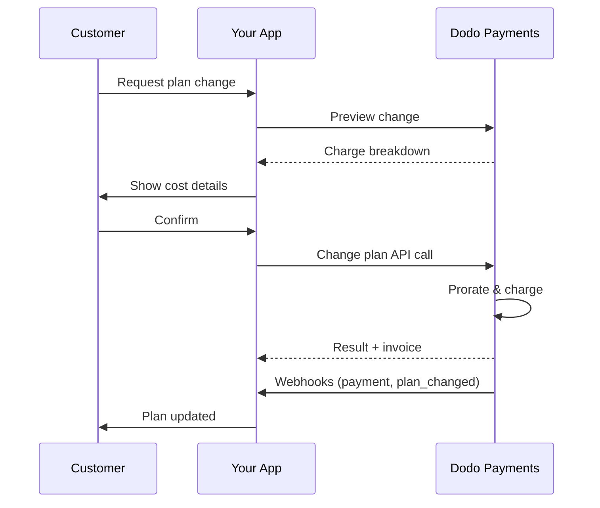
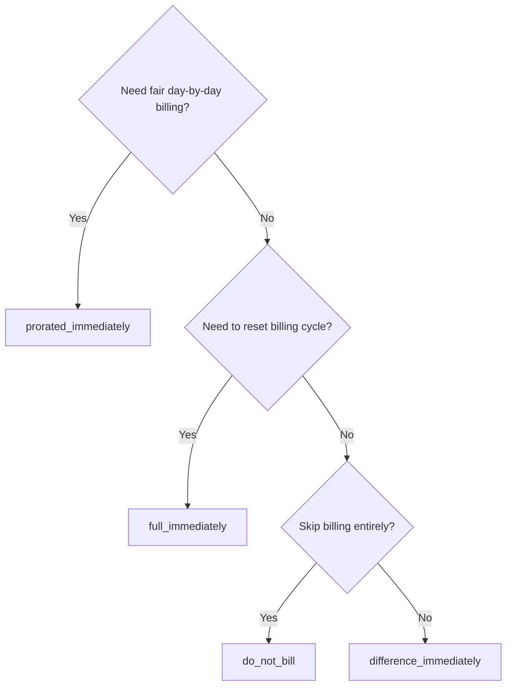
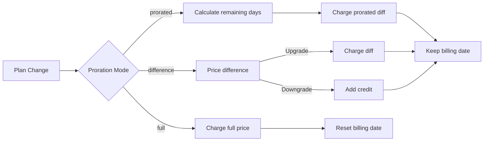

<CardGroup cols={3}>
<Card title="Change Plan API" icon="code" href="/api-reference/subscriptions/change-plan">
  Full API docs for updating subscriptions.
</Card>
<Card title="Plan Change Preview" icon="eye" href="/api-reference/subscriptions/preview-change-plan">
  See charge amounts before changing plans.
</Card>
<Card title="Integration Guide" icon="book" href="/developer-resources/subscription-integration-guide">
  Step-by-step subscription setup.
</Card>
</CardGroup>

## What is a subscription upgrade or downgrade?

Changing plans lets you move a customer between subscription tiers or quantities. Use it to:
- Align pricing with usage or features
- Move from monthly to annual (or vice versa)
- Adjust quantity for seat-based products

<Info>
Plan changes can trigger an immediate charge depending on the proration mode you choose.
</Info>

## When to use plan changes

- Upgrade when a customer needs more features, usage, or seats
- Downgrade when usage decreases
- Migrate users to a new product or price without cancelling their subscription

## Plan Change Flow



## Prerequisites

Before implementing subscription plan changes, ensure you have:

- A Dodo Payments merchant account with active subscription products
- API credentials (API key and webhook secret key) from the dashboard
- An existing active subscription to modify
- Webhook endpoint configured to handle subscription events

<Info>
For detailed setup instructions, see our [Integration Guide](/developer-resources/integration-guide#dashboard-setup).
</Info>

## Step-by-Step Implementation Guide

Follow this comprehensive guide to implement subscription plan changes in your application:

<Steps>
<Step title="Understand Plan Change Requirements">
Before implementing, determine:
- Which subscription products can be changed to which others
- What proration mode fits your business model
- How to handle failed plan changes gracefully
- Which webhook events to track for state management

<Tip>
Test plan changes thoroughly in test mode before implementing in production.
</Tip>
</Step>

<Step title="Choose Your Proration Strategy">
Select the billing approach that aligns with your business needs:

<Tabs>
<Tab title="prorated_immediately">
Best for: SaaS applications wanting to charge fairly for unused time
- Calculates exact prorated amount based on remaining cycle time
- Charges a prorated amount based on unused time remaining in the cycle
- Provides transparent billing to customers
</Tab>

<Tab title="difference_immediately">
Best for: Clear upgrade/downgrade scenarios
- Upgrade: Charge immediate difference (e.g., $30→$80 = charge $50)
- Downgrade: Credit remaining value for future renewals
- Simplifies billing logic and customer communication
</Tab>

<Tab title="full_immediately">
Best for: When you want to reset the billing cycle
- Charges full amount of new plan immediately
- Ignores remaining time from old plan
- Useful for annual to monthly transitions
</Tab>

<Tab title="do_not_bill">
Best for: Free migrations, courtesy switches, or absorbing cost differences
- No charges or credits calculated
- Customer moves to the new plan immediately without any billing adjustment
- Billing cycle remains unchanged
</Tab>
</Tabs>
</Step>

<Step title="Implement the Change Plan API">
Use the Change Plan API to modify subscription details:

<ParamField path="subscription_id" type="string" required>
The ID of the active subscription to modify.
</ParamField>

<ParamField path="product_id" type="string" required>
The new product ID to change the subscription to.
</ParamField>

<ParamField path="quantity" type="integer" default="1">
Number of units for the new plan (for seat-based products).
</ParamField>

<ParamField path="proration_billing_mode" type="string" required>
How to handle immediate billing: `prorated_immediately`, `full_immediately`, `difference_immediately`, or `do_not_bill`.
</ParamField>

<ParamField path="addons" type="array">
Optional addons for the new plan. Leaving this empty removes any existing addons.
</ParamField>

<ParamField path="on_payment_failure" type="string">
Controls behavior when the plan change payment fails:
- `prevent_change`: Keep subscription on current plan until payment succeeds
- `apply_change` (default): Apply plan change immediately regardless of payment outcome

If not specified, uses the business-level default setting.
</ParamField>

<ParamField path="discount_code" type="string">
Codice sconto opzionale da applicare al nuovo piano. Se fornito, valida e applica lo sconto al cambiamento del piano. Se non fornito e l'abbonamento ha già uno sconto con `preserve_on_plan_change=true`, verrà mantenuto lo sconto esistente (se applicabile al nuovo prodotto).
</ParamField>

<ParamField path="effective_at" type="string" default="immediately">
Quando applicare la modifica del piano:
- `immediately` (predefinito): Applica immediatamente la modifica del piano
- `next_billing_date`: Programma la modifica per la prossima data di fatturazione. Il cliente mantiene il piano corrente fino al termine del periodo di fatturazione.

Usa `next_billing_date` per il downgrade in modo che i clienti mantengano i benefici del piano corrente fino alla fine del periodo di fatturazione.
</ParamField>
</Step>

<Step title="Handle Webhook Events">
Configura la gestione dei webhook per monitorare i risultati delle modifiche del piano:

- `subscription.active`: Modifica del piano riuscita, abbonamento aggiornato
- `subscription.plan_changed`: Piano dell'abbonamento modificato (upgrade/downgrade/aggiornamento addon)
- `subscription.on_hold`: Addebito per la modifica del piano fallito, abbonamento sospeso
- `payment.succeeded`: Addebito immediato per la modifica del piano riuscito
- `payment.failed`: Addebito immediato fallito

<Warning>
Verifica sempre le firme dei webhook e implementa l'elaborazione degli eventi idempotente.
</Warning>
</Step>

<Step title="Update Your Application State">
Basato su eventi webhook, aggiorna la tua applicazione:
- Concedi/revoca funzionalità in base al nuovo piano
- Aggiorna il dashboard cliente con i dettagli del nuovo piano
- Invia email di conferma sui cambiamenti di piano
- Registra le modifiche di fatturazione per scopi di audit
</Step>

<Step title="Test and Monitor">
Testa accuratamente la tua implementazione:
- Testa tutte le modalità di proration con scenari diversi
- Verifica che la gestione dei webhook funzioni correttamente
- Monitora i tassi di successo delle modifiche di piano
- Imposta avvisi per le modifiche di piano fallite

<Check>
La tua implementazione del cambio piano di abbonamento è pronta per l'uso in produzione.
</Check>
</Step>
</Steps>

## Anteprima delle modifiche del piano

Prima di confermare una modifica del piano, utilizza l'API di Anteprima per mostrare ai clienti esattamente quanto verranno addebitati:

<Tabs>
<Tab title="Node.js SDK">

```javascript
const preview = await client.subscriptions.previewChangePlan('sub_123', {
  product_id: 'prod_pro',
  quantity: 1,
  proration_billing_mode: 'prorated_immediately'
});

// Show customer the charge before confirming
console.log('Immediate charge:', preview.immediate_charge.summary);
console.log('New plan details:', preview.new_plan);
```

</Tab>

<Tab title="Python SDK">

```python
preview = client.subscriptions.preview_change_plan(
    subscription_id="sub_123",
    product_id="prod_pro",
    quantity=1,
    proration_billing_mode="prorated_immediately"
)

# Show customer the charge before confirming
print("Immediate charge:", preview.immediate_charge.summary)
print("New plan details:", preview.new_plan)
```

</Tab>
</Tabs>

<Tip>
Usa l'API di anteprima per costruire finestre di dialogo di conferma che mostrano ai clienti l'importo esatto che verrà loro addebitato prima di confermare un cambio di piano.
</Tip>

## Cambio Piano API

Utilizza l'API di Cambio Piano per modificare prodotto, quantità e comportamento di proration per un abbonamento attivo.

### Esempi di avvio rapido

<Tabs>
  <Tab title="Node.js SDK">

    ```javascript
    import DodoPayments from 'dodopayments';

    const client = new DodoPayments({
      bearerToken: process.env.DODO_PAYMENTS_API_KEY,
      environment: 'test_mode', // defaults to 'live_mode'
    });

    async function changePlan() {
      const result = await client.subscriptions.changePlan('sub_123', {
        product_id: 'prod_new',
        quantity: 3,
        proration_billing_mode: 'prorated_immediately',
        on_payment_failure: 'prevent_change', // Optional: control behavior on payment failure
      });
      console.log(result.status, result.invoice_id, result.payment_id);
    }

    changePlan();
    ```

  </Tab>
  <Tab title="Python SDK">

    ```python
    import os
    from dodopayments import DodoPayments

    client = DodoPayments(
        bearer_token=os.environ.get("DODO_PAYMENTS_API_KEY"),
        environment="test_mode",  # defaults to "live_mode"
    )

    result = client.subscriptions.change_plan(
        subscription_id="sub_123",
        product_id="prod_new",
        quantity=3,
        proration_billing_mode="prorated_immediately",
        on_payment_failure="prevent_change",  # Optional: control behavior on payment failure
    )
    print(result.status, result.get("invoice_id"), result.get("payment_id"))
    ```

  </Tab>
  <Tab title="Go SDK">

    ```go
    package main

    import (
      "context"
      "fmt"
      "github.com/dodopayments/dodopayments-go"
      "github.com/dodopayments/dodopayments-go/option"
    )

    func main() {
      client := dodopayments.NewClient(option.WithBearerToken("YOUR_TOKEN"))
      res, err := client.Subscriptions.ChangePlan(context.TODO(), dodopayments.SubscriptionChangePlanParams{
        SubscriptionID: dodopayments.F("sub_123"),
        ProductID:             dodopayments.F("prod_new"),
        Quantity:              dodopayments.F(int64(3)),
        ProrationBillingMode:  dodopayments.F(dodopayments.SubscriptionChangePlanParamsProrationBillingModeProratedImmediately),
        OnPaymentFailure:      dodopayments.F(dodopayments.OnPaymentFailurePreventChange), // Optional
      })
      if err != nil { panic(err) }
      fmt.Println(res.Status, res.InvoiceID, res.PaymentID)
    }
    ```

  </Tab>
  <Tab title="HTTP">

    ```go
    package main

    import (
      "context"
      "fmt"
      "github.com/dodopayments/dodopayments-go"
      "github.com/dodopayments/dodopayments-go/option"
    )

    func main() {
      client := dodopayments.NewClient(option.WithBearerToken("YOUR_TOKEN"))
      // ChangePlan returns no response body; a nil error means the change succeeded.
      err := client.Subscriptions.ChangePlan(context.TODO(), "sub_123", dodopayments.SubscriptionChangePlanParams{
        UpdateSubscriptionPlanReq: dodopayments.UpdateSubscriptionPlanReqParam{
          ProductID:            dodopayments.F("prod_new"),
          Quantity:             dodopayments.F(int64(3)),
          ProrationBillingMode: dodopayments.F(dodopayments.UpdateSubscriptionPlanReqProrationBillingModeProratedImmediately),
          OnPaymentFailure:     dodopayments.F(dodopayments.UpdateSubscriptionPlanReqOnPaymentFailurePreventChange), // Optional
        },
      })
      if err != nil { panic(err) }
      fmt.Println("Plan change applied")
    }
    ```

  </Tab>
</Tabs>

```json Success
{
  "status": "processing",
  "subscription_id": "sub_123",
  "invoice_id": "inv_789",
  "payment_id": "pay_456",
  "proration_billing_mode": "prorated_immediately"
}
```

<Note>
Campi come <code>invoice_id</code> e <code>payment_id</code> vengono restituiti solo quando viene creato un addebito immediato e/o una fattura durante il cambio di piano. Affidati sempre agli eventi webhook (e.g., <code>payment.succeeded</code>, <code>subscription.plan_changed</code>) per confermare i risultati.
</Note>

<Warning>
Se l'addebito immediato fallisce, l'abbonamento potrebbe spostarsi a `subscription.on_hold` fino al successo del pagamento.
</Warning>

## Gestione degli Addon

Quando si cambiano i piani di abbonamento, è possibile anche modificare gli addon:

```javascript
// Add addons to the new plan
await client.subscriptions.changePlan('sub_123', {
  product_id: 'prod_new',
  quantity: 1,
  proration_billing_mode: 'difference_immediately',
  addons: [
    { addon_id: 'addon_123', quantity: 2 }
  ]
});

// Remove all existing addons
await client.subscriptions.changePlan('sub_123', {
  product_id: 'prod_new',
  quantity: 1,
  proration_billing_mode: 'difference_immediately',
  addons: [] // Empty array removes all existing addons
});
```

<Info>
Gli addon sono inclusi nel calcolo della proration e verranno addebitati secondo la modalità di proration selezionata.
</Info>

## Applicazione dei Codici Sconto

È possibile applicare un codice sconto quando si cambiano i piani di abbonamento. Questo è utile per offrire prezzi promozionali su upgrade o migrazioni.

<Tabs>
<Tab title="Node.js SDK">

```javascript
// Apply a discount code during plan change
await client.subscriptions.changePlan('sub_123', {
  product_id: 'prod_pro',
  quantity: 1,
  proration_billing_mode: 'prorated_immediately',
  discount_code: 'UPGRADE20'
});
```

</Tab>
<Tab title="Python SDK">

```python
# Apply a discount code during plan change
client.subscriptions.change_plan(
    subscription_id="sub_123",
    product_id="prod_pro",
    quantity=1,
    proration_billing_mode="prorated_immediately",
    discount_code="UPGRADE20"
)
```

</Tab>
<Tab title="HTTP">

```bash
curl -X POST "$DODO_API_BASE/subscriptions/sub_123/change-plan" \
  -H "Authorization: Bearer $DODO_PAYMENTS_API_KEY" \
  -H "Content-Type: application/json" \
  -d '{
    "product_id": "prod_pro",
    "quantity": 1,
    "proration_billing_mode": "prorated_immediately",
    "discount_code": "UPGRADE20"
  }'
```

</Tab>
</Tabs>

### Comportamento degli sconti nel cambio piano

| Scenari | Comportamento |
|----------|----------|
| `discount_code` fornito | Valida e applica lo sconto al nuovo piano. |
| Nessun codice fornito, sconto esistente con `preserve_on_plan_change=true` | Lo sconto esistente viene automaticamente mantenuto se applicabile al nuovo prodotto. |
| Nessun codice fornito, nessuno sconto conservabile | Nessuno sconto applicato al nuovo piano. |

<Tip>
Usa l'[API di Anteprima Cambio Piano](/api-reference/subscriptions/preview-change-plan) con un `discount_code` per mostrare ai clienti quanto risparmieranno esattamente prima di confermare la modifica del piano.
</Tip>

## Modalità di proration

Scegli come addebitare il cliente quando cambi piani:

#### `prorated_immediately`
- Addebiti per la differenza parziale nel ciclo attuale
- Se in prova, addebiti immediati e passa subito al nuovo piano
- Downgrade: può generare un credito proporzionale applicato ai futuri rinnovi

#### `full_immediately`
- Addebita l'intero importo del nuovo piano immediatamente
- Ignora il tempo rimanente del vecchio piano

<Info>
I crediti creati dai downgrade utilizzando <code>difference_immediately</code> sono legati all'abbonamento e distinti dai diritti di <a href="/features/credit-based-billing">Fatturazione Basata su Crediti</a>. Si applicano automaticamente ai futuri rinnovi dello stesso abbonamento e non sono trasferibili tra abbonamenti.
</Info>

#### `difference_immediately`
- Upgrade: addebita immediatamente la differenza di prezzo tra vecchio e nuovo piano
- Downgrade: aggiunge il valore restante come credito interno all'abbonamento e lo applica automaticamente ai rinnovi

#### `do_not_bill`
- Nessun addebito o accredito calcolato
- Il cliente passa immediatamente al nuovo piano senza alcun adeguamento di fatturazione
- Il ciclo di fatturazione rimane invariato
- Ideale per migrazioni di cortesia, passaggi a piani gratuiti o per assorbire differenze di costo

| Caratteristica | `prorated_immediately` | `difference_immediately` | `full_immediately` | `do_not_bill` |
|---------|----------------------|------------------------|-------------------|--------------|
| **Addebito Upgrade** | Differenza proporzionale per i giorni rimanenti | Intera differenza di prezzo tra i piani | Prezzo intero del nuovo piano | Nessun addebito |
| **Credito Downgrade** | Credito proporzionale per i giorni rimanenti | Intera differenza di prezzo come credito | Nessun credito | Nessun credito |
| **Ciclo di Fatturazione** | Invariato | Invariato | Si resetta a oggi | Invariato |
| **Comportamento del Periodo di Prova** | Termina prova, addebita immediatamente | Termina prova, addebita immediatamente | Termina prova, addebita l'intero importo | Termina prova, nessun addebito |
| **Ideale per** | Fatturazione basata sul tempo | Calcoli semplici di upgrade/downgrade | Resettare i cicli di fatturazione | Migrazioni gratuite o passaggi di cortesia |
| **Complessità** | Media (calcolo su base giornaliera) | Bassa (sottrazione semplice) | Bassa (addebito intero) | Nessuna |



### Esempi di casi

Usa questi numeri canonici in modo coerente:
- Piano attuale: **Basic** a **30$/mese**
- Obiettivo upgrade: **Pro** a **80$/mese**
- Obiettivo downgrade (da Pro): **Starter** a **20$/mese**
- Ciclo di fatturazione: **30 giorni**, iniziato il **1 gennaio**
- Cambio di piano avviene il **16 gennaio** (15 giorni rimanenti, 15 giorni utilizzati)

<AccordionGroup>
  <Accordion title="Upgrade: Basic ($30) → Pro ($80) with prorated_immediately">

    ```
    Step 1: Calculate unused credit from current plan
      Unused days = 15 out of 30 days
      Credit = $30 × (15/30) = $15.00

    Step 2: Calculate prorated cost of new plan
      Remaining days = 15 out of 30 days
      New plan cost = $80 × (15/30) = $40.00

    Step 3: Calculate immediate charge
      Charge = New plan cost − Credit
      Charge = $40.00 − $15.00 = $25.00

    → Customer pays $25.00 now
    → Next renewal (Feb 1): $80.00/month
    ```

    ```javascript
    await client.subscriptions.changePlan('sub_123', {
      product_id: 'prod_pro',
      quantity: 1,
      proration_billing_mode: 'prorated_immediately'
    })
    ```

  </Accordion>

  <Accordion title="Downgrade: Pro ($80) → Starter ($20) with prorated_immediately">

    ```
    Step 1: Calculate unused credit from current plan
      Unused days = 15 out of 30 days
      Credit = $80 × (15/30) = $40.00

    Step 2: Calculate prorated cost of new plan
      Remaining days = 15 out of 30 days
      New plan cost = $20 × (15/30) = $10.00

    Step 3: Calculate credit balance
      Credit = $40.00 − $10.00 = $30.00

    → No charge — $30.00 credit added to subscription
    → Credit auto-applies to future renewals
    → Next renewal (Feb 1): $20.00 − $30.00 credit = $0.00
    → Following renewal (Mar 1): $20.00 − $10.00 remaining credit = $10.00
    ```

    ```javascript
    await client.subscriptions.changePlan('sub_123', {
      product_id: 'prod_starter',
      quantity: 1,
      proration_billing_mode: 'prorated_immediately'
    })
    ```

  </Accordion>

  <Accordion title="Upgrade: Basic ($30) → Pro ($80) with difference_immediately">

    ```
    Immediate charge = New plan price − Old plan price
                     = $80 − $30
                     = $50.00

    → Customer pays $50.00 now (regardless of cycle position)
    → Next renewal (Feb 1): $80.00/month
    ```

    ```javascript
    await client.subscriptions.changePlan('sub_123', {
      product_id: 'prod_pro',
      quantity: 1,
      proration_billing_mode: 'difference_immediately'
    })
    ```

  </Accordion>

  <Accordion title="Downgrade: Pro ($80) → Starter ($20) with difference_immediately">

    ```
    Credit = Old plan price − New plan price
           = $80 − $20
           = $60.00

    → No charge — $60.00 credit added to subscription
    → Credit auto-applies to future renewals
    → Next renewal: $20.00 − $20.00 (from credit) = $0.00
    → Following renewal: $20.00 − $20.00 (from credit) = $0.00
    → Third renewal: $20.00 − $20.00 (from remaining credit) = $0.00
    ```

    ```javascript
    await client.subscriptions.changePlan('sub_123', {
      product_id: 'prod_starter',
      quantity: 1,
      proration_billing_mode: 'difference_immediately'
    })
    ```

  </Accordion>

  <Accordion title="Upgrade: Basic ($30) → Pro ($80) with full_immediately">

    ```
    Immediate charge = Full new plan price = $80.00

    → Customer pays $80.00 now
    → No credit for unused time on old plan
    → Billing cycle resets to today (January 16)
    → Next renewal: February 16 at $80.00/month
    ```

    ```javascript
    await client.subscriptions.changePlan('sub_123', {
      product_id: 'prod_pro',
      quantity: 1,
      proration_billing_mode: 'full_immediately'
    })
    ```

  </Accordion>

  <Accordion title="Mid-cycle upgrade with add-ons using prorated_immediately">

    ```
    Current: Basic plan ($30/month), no add-ons
    New: Pro plan ($80/month) + Extra Seats add-on ($10/seat × 3 seats = $30/month)
    Change on day 16 of 30 (15 days remaining)

    Step 1: Credit from current plan
      Credit = $30 × (15/30) = $15.00

    Step 2: Prorated cost of new plan + add-ons
      New plan = $80 × (15/30) = $40.00
      Add-ons = $30 × (15/30) = $15.00
      Total new = $55.00

    Step 3: Immediate charge
      Charge = $55.00 − $15.00 = $40.00

    → Customer pays $40.00 now
    → Next renewal: $80.00 + $30.00 = $110.00/month
    ```

    ```javascript
    await client.subscriptions.changePlan('sub_123', {
      product_id: 'prod_pro',
      quantity: 1,
      proration_billing_mode: 'prorated_immediately',
      addons: [
        { addon_id: 'addon_seats', quantity: 3 }
      ]
    })
    ```

  </Accordion>
</AccordionGroup>

### Come ogni modalità elabora la fatturazione



<Tip>
Scegli `prorated_immediately` per una contabilità basata sul tempo equa; scegli `full_immediately` per riavviare la fatturazione; usa `difference_immediately` per semplici upgrade e credito automatico sui downgrade; oppure usa `do_not_bill` per passare i piani senza alcun adeguamento di fatturazione.
</Tip>

## Gestione dei fallimenti di pagamento

Controlla cosa succede quando un pagamento per la modifica del piano fallisce usando il parametro `on_payment_failure`.

### Modalità di fallimento del pagamento

<Tabs>
<Tab title="prevent_change (Recommended for critical upgrades)">
**Comportamento**: Mantieni l'abbonamento sul piano attuale fino a quando il pagamento non ha successo.

- La modifica del piano è segnata come "in attesa"
- Il cliente mantiene l'accesso al suo piano attuale
- L'abbonamento passa allo stato `active` solo dopo il pagamento riuscito
- Utile quando si vuole garantire il pagamento prima di concedere funzionalità avanzate

```javascript
await client.subscriptions.changePlan('sub_123', {
  product_id: 'prod_pro',
  quantity: 1,
  proration_billing_mode: 'prorated_immediately',
  on_payment_failure: 'prevent_change'
});
```

</Tab>

<Tab title="apply_change (Default)">
**Comportamento**: Applica immediatamente la modifica del piano indipendentemente dal risultato del pagamento.

- La modifica del piano viene applicata anche se il pagamento fallisce
- Il cliente ottiene immediatamente l'accesso al nuovo piano
- L'abbonamento può passare allo stato `on_hold` se il pagamento fallisce
- Buono per upgrade non critici o quando si ha fiducia nel cliente

```javascript
await client.subscriptions.changePlan('sub_123', {
  product_id: 'prod_pro',
  quantity: 1,
  proration_billing_mode: 'prorated_immediately',
  on_payment_failure: 'apply_change' // This is the default
});
```

</Tab>
</Tabs>

<Info>
Se non specificato, il parametro `on_payment_failure` utilizza l'impostazione predefinita a livello aziendale configurata nel dashboard.
</Info>

### Quando utilizzare ogni modalità

| Scenario | Modalità consigliata | Motivo |
|----------|------------------|--------|
| Upgrade a funzionalità premium | `prevent_change` | Garantire il pagamento prima di concedere l'accesso |
| Aumento quantità (più posti) | `prevent_change` | Prevenire l'uso senza pagamento |
| Piani di downgrade | `apply_change` | Il cliente sta riducendo la spesa |
| Clienti aziendali affidabili | `apply_change` | Rischio più basso di mancato pagamento |
| Conversione da prova a pagamento | `prevent_change` | Momento critico per il pagamento |

## Gestione dei webhook

Monitora lo stato delle sottoscrizioni tramite webhook per confermare le modifiche di piano e i pagamenti.

### Tipi di evento da gestire
- `subscription.active`: abbonamento attivato
- `subscription.plan_changed`: piano di abbonamento modificato (upgrade/downgrade/modifiche addon)
- `subscription.on_hold`: addebito fallito, abbonamento sospeso
- `subscription.renewed`: rinnovo riuscito
- `payment.succeeded`: pagamento per modifica piano o rinnovo riuscito
- `payment.failed`: pagamento fallito

<Info>
Si consiglia di basare la logica aziendale sugli eventi di sottoscrizione e di utilizzare gli eventi di pagamento per conferma e riconciliazione.
</Info>

### Verifica delle firme e gestione delle intenzioni

<Tabs>
  <Tab title="Next.js Route Handler">

    ```javascript
    import { NextRequest, NextResponse } from 'next/server';
    
    export async function POST(req) {
      const webhookId = req.headers.get('webhook-id');
      const webhookSignature = req.headers.get('webhook-signature');
      const webhookTimestamp = req.headers.get('webhook-timestamp');
      const secret = process.env.DODO_WEBHOOK_SECRET;
    
      const payload = await req.text();
      // verifySignature is a placeholder – in production, use a Standard Webhooks library
      const { valid, event } = await verifySignature(
        payload,
        { id: webhookId, signature: webhookSignature, timestamp: webhookTimestamp },
        secret
      );
      if (!valid) return NextResponse.json({ error: 'Invalid signature' }, { status: 400 });
    
      switch (event.type) {
        case 'subscription.active':
          // mark subscription active in your DB
          break;
        case 'subscription.plan_changed':
          // refresh entitlements and reflect the new plan in your UI
          break;
        case 'subscription.on_hold':
          // notify user to update payment method
          break;
        case 'subscription.renewed':
          // extend access window
          break;
        case 'payment.succeeded':
          // reconcile payment for plan change
          break;
        case 'payment.failed':
          // log and alert
          break;
        default:
          // ignore unknown events
          break;
      }
    
      return NextResponse.json({ received: true });
    }
    ```

  </Tab>
  <Tab title="Express.js">

    ```javascript
    import express from 'express';
    
    const app = express();
    app.post('/webhooks/dodo', express.raw({ type: 'application/json' }), async (req, res) => {
      const webhookId = req.header('webhook-id');
      const webhookSignature = req.header('webhook-signature');
      const webhookTimestamp = req.header('webhook-timestamp');
      const secret = process.env.DODO_WEBHOOK_SECRET;
      const payload = req.body.toString('utf8');
    
      const { valid, event } = await verifySignature(
        payload,
        { id: webhookId, signature: webhookSignature, timestamp: webhookTimestamp },
        secret
      );
      if (!valid) return res.status(400).send('Invalid signature');
    
      // handle events like above
      res.json({ received: true });
    });
    
    app.listen(3000);
    ```

  </Tab>
</Tabs>

<Note>
Per gli schemi dettagliati dei payload, consulta i <a href="/developer-resources/webhooks/intents/subscription">Payload dei webhook per le sottoscrizioni</a> e i <a href="/developer-resources/webhooks/intents/payment">Payload dei webhook per i pagamenti</a>.
</Note>

## Migliori pratiche

Segui queste raccomandazioni per cambiamenti affidabili nei piani di abbonamento:

### Strategia di cambio piano
- **Testa a fondo**: Testa sempre i cambiamenti di piano in modalità test prima della produzione
- **Scegli attentamente la proration**: Seleziona la modalità di proration che si allinea con il tuo modello di business
- **Gestisci i fallimenti correttamente**: Implementa una corretta gestione degli errori e una logica di ritentativo
- **Monitora i tassi di successo**: Monitora i tassi di successo/fallimento delle modifiche di piano e indaga sui problemi

### Implementazione dei webhook
- **Verifica le firme**: Valida sempre le firme dei webhook per garantire l'autenticità
- **Implementa l'idempotenza**: Gestisci in modo indolore eventi webhook duplicati
- **Elabora in modo asincrono**: Non bloccare le risposte ai webhook con operazioni pesanti
- **Registra tutto**: Mantieni un log dettagliato per il debug e gli scopi di audit

### Esperienza utente
- **Comunica chiaramente**: Informa i clienti sui cambiamenti di fatturazione e tempi
- **Fornisci conferme**: Invia conferme via email per le modifiche di piano riuscite
- **Gestisci i casi di confine**: Considera i periodi di prova, le proration e i pagamenti falliti
- **Aggiorna l'interfaccia utente immediatamente**: Rifletti i cambiamenti di piano nell'interfaccia della tua applicazione

## Problemi comuni e soluzioni

Risolvere i problemi tipici incontrati durante i cambiamenti nei piani di abbonamento:

<AccordionGroup>
<Accordion title="Charge created but subscription not updated">
**Sintomi**: La chiamata API riesce ma l'abbonamento rimane sul vecchio piano

**Cause comuni**:
- Elaborazione dei webhook fallita o ritardata
- Stato dell'applicazione non aggiornato dopo aver ricevuto i webhook
- Problemi nelle transazioni del database durante l'aggiornamento dello stato

**Soluzioni**:
- Implementa una gestione robusta dei webhook con una logica di ritentativo
- Usa operazioni idempotenti per aggiornamenti di stato
- Aggiungi monitoraggio per rilevare e avvisare su eventi webhook mancati
- Verifica che l'endpoint del webhook sia accessibile e risponda correttamente
</Accordion>

<Accordion title="Credits not applied after downgrade">
**Sintomi**: Il cliente esegue un downgrade ma non vede il saldo del credito

**Cause comuni**:
- Aspettative della modalità di proration: i downgrade accreditano la differenza di prezzo completo con `difference_immediately`, mentre `prorated_immediately` crea un credito proporzionale basato sul tempo restante nel ciclo
- I crediti sono specifici per l'abbonamento e non trasferibili tra abbonamenti
- Il saldo del credito non è visibile nel dashboard del cliente

**Soluzioni**:
- Usa `difference_immediately` per i downgrade quando vuoi crediti automatici
- Spiega ai clienti che i crediti si applicano ai futuri rinnovi dello stesso abbonamento
- Implementa un portale clienti per mostrare i saldi dei crediti
- Controlla l'anteprima della prossima fattura per vedere i crediti applicati
</Accordion>

<Accordion title="Webhook signature verification fails">
**Sintomi**: Eventi webhook rifiutati a causa di firme non valide

**Cause comuni**:
- Chiave segreta del webhook non corretta
- Corpo della richiesta raw modificato prima della verifica della firma
- Algoritmo di verifica della firma errato

**Soluzioni**:
- Verifica di utilizzare il corretto `DODO_WEBHOOK_SECRET` dal dashboard
- Leggi il corpo della richiesta raw prima di qualsiasi middleware di parsing JSON
- Usa la libreria di verifica dei webhook standard per la tua piattaforma
- Testa la verifica della firma dei webhook in un ambiente di sviluppo
</Accordion>

<Accordion title="Plan change fails with 422 error">
**Sintomi**: L'API restituisce errore 422 Entità non importante

**Cause comuni**:
- ID dell'abbonamento o ID del prodotto non valido
- Abbonamento non in stato attivo
- Parametri richiesti mancanti
- Prodotto non disponibile per cambiamenti di piano

**Soluzioni**:
- Verifica che l'abbonamento esista ed è attivo
- Controlla che l'ID del prodotto sia valido e disponibile
- Assicurati che tutti i parametri richiesti siano forniti
- Rivedi la documentazione API per i requisiti dei parametri
</Accordion>

<Accordion title="Immediate charge fails during plan change">
**Sintomi**: Modifica del piano avviata ma addebito immediato fallisce

**Cause comuni**:
- Fondi insufficienti sul metodo di pagamento del cliente
- Metodo di pagamento scaduto o non valido
- La banca ha rifiutato la transazione
- Il rilevamento delle frodi ha bloccato l'addebito

**Soluzioni**:
- Gestisci gli eventi webhook `payment.failed` in modo appropriato
- Notifica al cliente di aggiornare il metodo di pagamento
- Implementa una logica di ritentativo per i fallimenti temporanei
- Considera la possibilità di consentire modifiche di piano con addebiti immediati falliti
</Accordion>

<Accordion title="Subscription on hold after plan change">
**Sintomi**: L'addebito della modifica del piano fallisce e l'abbonamento passa allo stato `on_hold`

**Cosa succede**:
Quando l'addebito per la modifica del piano fallisce, l'abbonamento viene automaticamente posto nello stato `on_hold`. L'abbonamento non si rinnoverà automaticamente fino a quando il metodo di pagamento non viene aggiornato.

**Soluzione**: Aggiorna il metodo di pagamento per riattivare l'abbonamento

Per riattivare un abbonamento dallo stato `on_hold` dopo un fallimento della modifica del piano:

1. **Aggiorna il metodo di pagamento** usando l'API di Aggiornamento Metodo di Pagamento
2. **Creazione automatica addebito**: L'API crea automaticamente un addebito per i saldi rimanenti
3. **Generazione fattura**: Una fattura viene generata per l'addebito
4. **Elaborazione del pagamento**: Il pagamento viene elaborato utilizzando il nuovo metodo di pagamento
5. **Riattivazione**: Al successo del pagamento, l'abbonamento viene riattivato allo stato `active`

<CodeGroup>

```javascript Node.js
// Reactivate subscription from on_hold after failed plan change
async function reactivateAfterFailedPlanChange(subscriptionId) {
  // Update payment method - automatically creates charge for remaining dues
  const response = await client.subscriptions.updatePaymentMethod(subscriptionId, {
    type: 'new',
    return_url: 'https://example.com/return'
  });
  
  if (response.payment_id) {
    console.log('Charge created for remaining dues:', response.payment_id);
    console.log('Payment link:', response.payment_link);
    
    // Redirect customer to payment_link to complete payment
    // Monitor webhooks for:
    // 1. payment.succeeded - charge succeeded
    // 2. subscription.active - subscription reactivated
  }
  
  return response;
}

// Or use existing payment method if available
async function reactivateWithExistingPaymentMethod(subscriptionId, paymentMethodId) {
  const response = await client.subscriptions.updatePaymentMethod(subscriptionId, {
    type: 'existing',
    payment_method_id: paymentMethodId
  });
  
  // Monitor webhooks for payment.succeeded and subscription.active
  return response;
}
```

```python Python
# Reactivate subscription from on_hold after failed plan change
def reactivate_after_failed_plan_change(subscription_id):
    # Update payment method - automatically creates charge for remaining dues
    response = client.subscriptions.update_payment_method(
        subscription_id=subscription_id,
        type="new",
        return_url="https://example.com/return"
    )
    
    if response.payment_id:
        print("Charge created for remaining dues:", response.payment_id)
        print("Payment link:", response.payment_link)
        
        # Redirect customer to payment_link to complete payment
        # Monitor webhooks for:
        # 1. payment.succeeded - charge succeeded
        # 2. subscription.active - subscription reactivated
    
    return response

# Or use existing payment method if available
def reactivate_with_existing_payment_method(subscription_id, payment_method_id):
    response = client.subscriptions.update_payment_method(
        subscription_id=subscription_id,
        type="existing",
        payment_method_id=payment_method_id
    )
    
    # Monitor webhooks for payment.succeeded and subscription.active
    return response
```

</CodeGroup>

**Eventi webhook da monitorare**:
- `subscription.on_hold`: Abbonamento messo in sospeso (ricevuto quando l'addebito per la modifica del piano fallisce)
- `payment.succeeded`: Pagamento per i saldi rimanenti riuscito (dopo aver aggiornato il metodo di pagamento)
- `subscription.active`: Abbonamento riattivato dopo il pagamento riuscito

**Migliori pratiche**:
- Notifica immediatamente i clienti quando un addebito per modifica piano fallisce
- Fornisci istruzioni chiare su come aggiornare il loro metodo di pagamento
- Monitora gli eventi webhook per tracciare lo stato di riattivazione
- Considera l'implementazione di una logica di ritentativo automatico per fallimenti di pagamento temporanei

<Card title="Update Payment Method API Reference" icon="code" href="/api-reference/subscriptions/update-payment-method">
Visualizza la documentazione API completa per aggiornare i metodi di pagamento e riattivare gli abbonamenti.
</Card>
</Accordion>
</AccordionGroup>

## Test della tua implementazione

Segui questi passaggi per testare a fondo la tua implementazione di cambio piano di abbonamento:

<Steps>
<Step title="Set up test environment">
- Usa chiavi API di test e prodotti di test
- Crea abbonamenti di test con diversi tipi di piano
- Configura l'endpoint del webhook di test
- Imposta monitoraggio e logging
</Step>

<Step title="Test different proration modes">
- Testa `prorated_immediately` con varie posizioni del ciclo di fatturazione
- Testa `difference_immediately` per upgrade e downgrade
- Testa `full_immediately` per resettare i cicli di fatturazione
- Testa `do_not_bill` per passaggi di piano senza addebito/credito
- Verifica che i calcoli dei crediti siano corretti
</Step>

<Step title="Test webhook handling">
- Verifica che tutti gli eventi webhook pertinenti siano ricevuti
- Testa la verifica della firma del webhook
- Gestisci in modo indolore eventi webhook duplicati
- Testa scenari di fallimento dell'elaborazione dei webhook
</Step>

<Step title="Test error scenarios">
- Testa con ID abbonamento non validi
- Testa con metodi di pagamento scaduti
- Testa fallimenti di rete e timeout
- Testa con fondi insufficienti
</Step>

<Step title="Monitor in production">
- Imposta avvisi per le modifiche di piano fallite
- Monitora i tempi di elaborazione dei webhook
- Traccia i tassi di successo delle modifiche di piano
- Rivedi i ticket di supporto clienti per problemi di modifica del piano
</Step>
</Steps>

## Gestione degli errori

Gestisci in modo indolore gli errori comuni dell'API nella tua implementazione:

### Codici di stato HTTP

<AccordionGroup>
<Accordion title="200 OK">
Richiesta di modifica del piano elaborata con successo. L'abbonamento è in fase di aggiornamento e l'elaborazione del pagamento è iniziata.
</Accordion>

<Accordion title="400 Bad Request">
Parametri di richiesta non validi. Verifica che tutti i campi richiesti siano forniti e correttamente formattati.
</Accordion>

<Accordion title="401 Unauthorized">
Chiave API non valida o mancante. Verifica che il tuo `DODO_PAYMENTS_API_KEY` sia corretto e abbia le dovute autorizzazioni.
</Accordion>

<Accordion title="404 Not Found">
ID abbonamento non trovato o non appartenente al tuo account.
</Accordion>

<Accordion title="422 Unprocessable Entity">
L'abbonamento non può essere modificato (e.g., già cancellato, prodotto non disponibile, ecc.).
</Accordion>

<Accordion title="500 Internal Server Error">
Si è verificato un errore del server. Riprova la richiesta dopo un breve ritardo.
</Accordion>
</AccordionGroup>

### Formato della risposta di errore

```json
{
  "error": {
    "code": "subscription_not_found",
    "message": "The subscription with ID 'sub_123' was not found",
    "details": {
      "subscription_id": "sub_123"
    }
  }
}
```

## Prossimi passi

- Rivedi l'<a href="/api-reference/subscriptions/change-plan">API di Cambio Piano</a>
- Esplora la <a href="/features/credit-based-billing">Fatturazione Basata su Crediti</a>
- Implementa avvisi per `subscription.on_hold`
- Consulta la nostra <a href="/developer-resources/webhooks">Guida all'Integrazione dei Webhook</a>

```json
{
  "error": {
    "code": "subscription_not_found",
    "message": "The subscription with ID 'sub_123' was not found",
    "details": {
      "subscription_id": "sub_123"
    }
  }
}
```

## Prossimi passi

- Rivedi l'<a href="/api-reference/subscriptions/change-plan">API di cambio piano</a>
- Esplora la <a href="/features/credit-based-billing">fatturazione basata su credito</a>
- Implementa avvisi per `subscription.on_hold`
- Dai un'occhiata alla nostra <a href="/developer-resources/webhooks">Guida all'integrazione dei webhook</a>

<AccordionGroup>
<Accordion title="200 OK">
Richiesta di cambio piano elaborata con successo. L'abbonamento è in fase di aggiornamento e l'elaborazione del pagamento è iniziata.
</Accordion>

<Accordion title="400 Bad Request">
Parametri della richiesta non validi. Verificare che tutti i campi richiesti siano forniti e correttamente formattati.
</Accordion>

<Accordion title="401 Unauthorized">
API key non valida o mancante. Verifica che il tuo `DODO_PAYMENTS_API_KEY` sia corretto e abbia le autorizzazioni appropriate.
</Accordion>

<Accordion title="404 Not Found">
ID dell'abbonamento non trovato o non appartenente al tuo account.
</Accordion>

<Accordion title="422 Unprocessable Entity">
L'abbonamento non può essere modificato (ad esempio, già cancellato, prodotto non disponibile, ecc.).
</Accordion>

<Accordion title="500 Internal Server Error">
Si è verificato un errore del server. Riprova la richiesta dopo un breve ritardo.
</Accordion>
</AccordionGroup>

### Formato di Errore di Risposta

```json
{
  "error": {
    "code": "subscription_not_found",
    "message": "The subscription with ID 'sub_123' was not found",
    "details": {
      "subscription_id": "sub_123"
    }
  }
}
```

## Prossimi passi

- Rivedi l'<a href="/api-reference/subscriptions/change-plan">API di Cambio Piano</a>
- Esplora la <a href="/features/credit-based-billing">Fatturazione Basata su Crediti</a>
- Implementa avvisi per `subscription.on_hold`
- Consulta la nostra <a href="/developer-resources/webhooks">Guida all'Integrazione dei Webhook</a>
