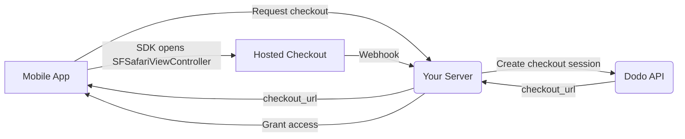

## Introduzione

Dodo Payments consente agli sviluppatori di vendere beni e servizi digitali nelle app iOS, gestendo aspetti complessi come la conformità fiscale, la conversione di valuta e i pagamenti. Questa guida completa dettaglia come integrare Dodo Payments nella tua app iOS, specificamente per strumenti SaaS, abbonamenti a contenuti e utilità digitali.

## Panoramica

Dodo Payments funge da **Merchant of Record (MoR)**, gestendo aspetti critici della tua attività digitale:

<Tabs>
<Tab title="What We Handle">
- Riscossione e versamento delle imposte (IVA, GST e altre imposte regionali)
- Pagamenti globali secondo le policy e i metodi di pagamento locali
- Conversione valuta e cambio
- Chargeback e prevenzione delle frodi
- Fatturazione e ricevute per il cliente finale
- Conformità alle normative regionali
</Tab>

<Tab title="What You Get">
- Un'API unificata per piattaforme web e mobile
- Supporto per check-out in-app (UPI, carte, portafogli, BNPL)
- Supporto globale per payout (Payoneer, Wise, bonifici bancari locali)
- Dashboard di analisi e reportistica
- Elaborazione dei pagamenti sicura
</Tab>
</Tabs>

## Casi d'uso

<CardGroup cols={2}>
<Card title="Subscriptions" icon="repeat">
- Accesso a contenuti o funzionalità premium
- Fatturazione ricorrente con opzioni flessibili, prove gratuite, proporzionalità o upgrade e downgrade
</Card>

<Card title="Courses and Learning" icon="graduation-cap">
- Accesso pay-per-course
- Pacchetti di contenuti raggruppati
- Licenze a vita o rinnovabili
- Integrazione del monitoraggio dei progressi
</Card>

<Card title="Digital Downloads" icon="download">
- Acquisti una tantum (PDF, musica, strumenti)
- Consegna di asset digitali
- Gestione delle chiavi di licenza
</Card>

<Card title="SaaS Tools" icon="screwdriver-wrench">
- Abbonamenti Software-as-a-Service
- Fatturazione basata sull'utilizzo
- Piani per team e aziende
</Card>
</CardGroup>

## Flusso di integrazione

La tua app apre il checkout ospitato da Dodo con
[iOS checkout SDK](/developer-resources/sdks/ios), che lo presenta in
`SFSafariViewController` e restituisce un risultato tipizzato.

<Warning>
Usa l'SDK invece di incorporare il checkout in un `WebView`. Apple Pay è disponibile solo
in una superficie browser reale, quindi un `WebView` riduce silenziosamente le conversioni
wallet — e i flussi di pagamento all'interno di un `WebView` sono una causa comune dei rifiuti durante la revisione sull'App
Store.
</Warning>

### Passaggi di integrazione

<Steps>
<Step title="Mobile App to Your Server">
La tua app richiede al tuo backend un URL di checkout, autenticato con il
token di sessione dell'utente autenticato.
</Step>

<Step title="Your Server to Dodo API">
Il tuo backend crea una [checkout session](/developer-resources/checkout-session)
con la tua API key e restituisce `checkout_url` all'app.

<Warning>
Crea le checkout session sul tuo server, mai nell'app. Una API key inclusa
a bordo dell'app può essere estratta dal bundle.
</Warning>
</Step>

<Step title="Mobile App Opens Checkout">
Passa `checkout_url` a `DodoCheckout.start(...)`. L'SDK lo presenta in
`SFSafariViewController` e restituisce un risultato tipizzato quando il cliente
completa o chiude il checkout.
</Step>

<Step title="Dodo Payments to Your Server">
Dodo Payments chiama il tuo endpoint webhook quando il pagamento va a buon fine o l'abbonamento
viene attivato.
</Step>

<Step title="Your Server Grants Access">
Sblocca il contenuto acquistato da quel webhook, non dal risultato ricevuto dall'app.
Il risultato dell'SDK è un'indicazione per l'interfaccia utente, non una prova del pagamento.
</Step>
</Steps>

<CardGroup cols={2}>
<Card title="iOS Checkout SDK" icon="apple" href="/developer-resources/sdks/ios">
  Passaggi di installazione e il contratto completo di `start(...)` per Swift.
</Card>
<Card title="Mobile Integration Guide" icon="mobile" href="/developer-resources/mobile-integration">
  Il flusso end-to-end, oltre allo stesso contratto per Android, React Native e Flutter.
</Card>
</CardGroup>

## Disponibilità regionale

Dodo Payments abilita flussi di acquisto alternativi in-app solo nelle regioni dell'App Store in cui Apple consente esplicitamente i pagamenti esterni o in cui un'autorità di regolamentazione o un'ordinanza del tribunale lo impone.

### Regioni supportate

<AccordionGroup>
<Accordion title="United States">
Supportato nella misura consentita dalle ordinanze dei tribunali attualmente in vigore e dalle linee guida aggiornate di Apple.

- Disponibile in base a specifiche disposizioni imposte dai tribunali
- Soggetto alla conformità di Apple ai requisiti legali
- Deve seguire le linee guida di implementazione di Apple
</Accordion>

<Accordion title="European Union (EU) App Store">
Supportato tramite gli EU Alternative Terms di Apple e l'External Purchase Entitlement.

- Abilitato tramite gli EU Alternative Terms di Apple
- Richiede l'approvazione dell'External Purchase Entitlement
- Deve essere conforme ai requisiti del Digital Markets Act dell'UE
</Accordion>

<Accordion title="South Korea">
Supportato tramite lo StoreKit External Purchase Entitlement per i binary destinati esclusivamente alla Corea.

- Disponibile tramite lo StoreKit External Purchase Entitlement
- Richiede un binary dell'app specifico per la Corea
- Deve essere conforme alla legislazione coreana sulle telecomunicazioni
</Accordion>
</AccordionGroup>

<Warning>
Esamina e rispetta sempre le entitlement specifiche per regione di Apple e i requisiti di App Store Connect prima di abilitare Dodo Payments per qualsiasi storefront. L'utilizzo di flussi di pagamento alternativi in regioni non supportate può comportare il rifiuto o la rimozione dell'app.
</Warning>

<Note>
Per alcuni modelli di business — come i servizi o determinate categorie di contenuti — Apple potrebbe non richiedere affatto l'uso dell'acquisto in-app (IAP). Dodo Payments supporta anche questi modelli. Verifica sempre la classificazione della tua app e le linee guida più recenti di Apple per determinare se l'IAP è obbligatorio per il tuo caso d'uso.
</Note>

### Scopri di più

Per una panoramica dettagliata delle policy globali, dei precedenti legali e degli approcci strategici per aggirare le commissioni dell'App Store, consulta la nostra guida completa:

<Card title="Bypassing App Store & Play Store Fees: A Strategic and Legal Playbook" icon="shield-check" href="/features/bypassing-app-store-fees">
Scopri dove e come puoi implementare legalmente flussi di pagamento alternativi, con indicazioni regionali aggiornate e suggerimenti sulla conformità.
</Card>