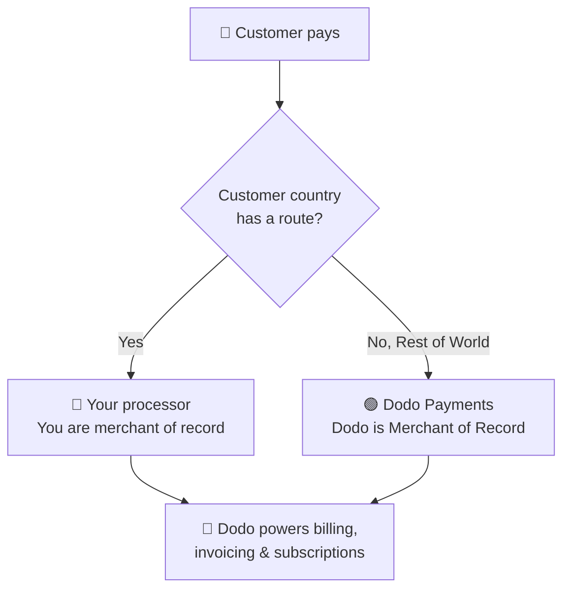

**Bring Your Own Processor (BYOP)** ti consente di collegare il tuo payment processor — attualmente **Stripe** o **Adyen**, con il supporto per altri processor in arrivo — e continuare a utilizzare Dodo Payments per tutto ciò che si trova al di sopra della transazione: prodotti, abbonamenti, chiavi di licenza e motore delle autorizzazioni, fatturazione, customer portal e analisi.

Decidi, per il paese di ciascun cliente, se un pagamento deve essere elaborato dal **tuo processor** (rimani il merchant of record per quella route) oppure da **Dodo Payments** come tuo Merchant of Record completo. I paesi che non instradi esplicitamente vengono automaticamente indirizzati a Dodo.

<CardGroup cols={2}>
<Card title="Route by geography" icon="globe">
Invia i pagamenti provenienti da paesi specifici al tuo processor e tutto il resto a Dodo.
</Card>

<Card title="Keep your processor accounts" icon="plug">
Continua a utilizzare i tuoi account e i tuoi rapporti esistenti con Stripe o Adyen.
</Card>

<Card title="Stay the merchant of record" icon="building">
Sulle tue route rimani il venditore legale e controlli imposte, contestazioni e pagamenti.
</Card>

<Card title="One billing layer" icon="layer-group">
Dodo gestisce prodotti, abbonamenti, fatture e analisi su entrambe le route.
</Card>
</CardGroup>

## BYOP vs. Dodo come Merchant of Record

Quando abiliti BYOP scegli come gestire ogni pagamento. I due modelli possono funzionare fianco a fianco, con instradamento in base al paese del cliente.

| Funzionalità | Dodo come Merchant of Record | Bring Your Own Processor |
|---------|----------------------------|--------------------------|
| Venditore legale ufficiale | Dodo Payments | La tua azienda |
| Imposte (VAT, GST e sales tax) | Calcolate, riscosse e versate per te | Ti registri, riscuoti e presenti le dichiarazioni |
| Chargeback e frodi | Responsabilità e protezione gestite da Dodo | Le gestisci con gli strumenti del tuo processor |
| Conformità PCI | Gestita da Dodo | La gestisci tu |
| Metodi di pagamento | Oltre 30 globali e locali, multi-valuta | Solo carte (credito/debito) |
| Pagamenti | Pagamenti globali aggregati | Direttamente dal tuo processor |
| Configurazione | Semplice, operativa in pochi minuti | Moderata, richiede chiavi e instradamento |
| Ideale per | Vendite globali e conformità senza gestione diretta | Processor esistente e controllo regionale |

<Tip>
Una configurazione comune è **ibrida**: instrada al tuo processor un paese in cui disponi già di un'entità registrata e di un processor (ad esempio il tuo mercato nazionale), e lascia che Dodo gestisca il resto del mondo come Merchant of Record.
</Tip>

## Processor supportati

Oggi puoi collegare **Stripe** o **Adyen**. Il supporto per altri processor è in arrivo.

<CardGroup cols={2}>
<Card title="Stripe" icon="stripe" />
<Card title="Adyen" icon="/images/logos/adyen.svg" />
</CardGroup>

<Note>
I pagamenti instradati attraverso il tuo processor attualmente supportano solo **carte di credito e debito**. Presto aggiungeremo altri metodi di pagamento.
</Note>

<Warning>
Sia **Stripe** sia **Adyen** richiedono che sul tuo account sia abilitato l'**accesso API alle carte raw**, affinché Dodo possa gestire la fatturazione al di sopra del tuo processor. Ogni processor lo abilita su richiesta: devi contattare il supporto del processor prima di effettuare il collegamento. Consulta le guide [Stripe](/features/byop/stripe) e [Adyen](/features/byop/adyen) per maggiori dettagli.
</Warning>

<Info>
Le connessioni sono configurate **per ambiente**. Il processor collegato in **test mode** (Sandbox) è separato da quello collegato in **live mode** (Production); configura entrambi se vuoi eseguire test prima di andare in produzione. La procedura guidata segue l'interruttore globale test/live del dashboard.
</Info>

## Configurare BYOP

Apri **Settings → BYOP** nel dashboard e seleziona **Configure** sulla scheda *Bring Your Own Processor* per avviare la procedura guidata di configurazione.

<Frame>

</Frame>

<Steps>
<Step title="Choose a payment processor">
Seleziona il processor che vuoi collegare, **Stripe** o **Adyen**, quindi continua.

<Frame>

</Frame>
</Step>

<Step title="Connect your account">
Assegna alla connessione un **Provider Name** (utile quando hai più account dello stesso processor, ad esempio *Stripe US* e *Stripe UK*), quindi inserisci la **Secret Key** del tuo processor (per Stripe, la chiave `sk_...`).

Per **Adyen**, inserisci anche l'identificativo del tuo **Merchant Account**.

<Frame>

</Frame>

Il salvataggio crea la connessione e genera un **Webhook Endpoint** univoco. Aggiungi quell'URL come destinazione webhook nel dashboard del tuo processor, quindi incolla il **Webhook Signing Secret** in Dodo per completare la procedura:

- **Stripe**: incolla il signing secret dell'endpoint webhook che hai aggiunto.
- **Adyen**: incolla la **HMAC key** da *Customer Area → Webhooks*.

<Note>
La tua secret key viene archiviata in modo sicuro e non può essere visualizzata o modificata dopo il salvataggio. Nel tuo processor configuri solo l'URL webhook generato da Dodo; non interagisci mai direttamente con l'infrastruttura sottostante.
</Note>

<Tip>
Dopo il salvataggio, usa **Verify connection** per eseguire una chiamata di test al tuo processor e verificare che le chiavi e il webhook secret siano validi prima di andare in produzione.
</Tip>
</Step>

<Step title="Configure payment routing">
Aggiungi **regole di instradamento** che associno i paesi dei clienti a un processor. Ogni paese può essere instradato verso un solo processor.

- Il **tuo processor** gestisce i pagamenti provenienti dai paesi che gli assegni.
- **Dodo Payments** gestisce il **Rest of the World** (ogni paese che non instradi esplicitamente) come Merchant of Record.

<Frame>

</Frame>

Usa **Add Route** per assegnare uno o più paesi a un processor.

<Frame>

</Frame>

<Info>
**Linee guida per l'instradamento**
- "Rest of World" comprende tutti i paesi non elencati sopra.
- Le route Dodo Payments MoR gestiscono automaticamente conformità e imposte.
- Le route del tuo processor richiedono una configurazione separata delle imposte, se necessaria.
</Info>
</Step>

<Step title="Configure invoice information">
Per i pagamenti instradati attraverso il tuo processor, **tu** sei il venditore indicato in fattura. Inserisci i dati aziendali che devono comparire su tali fatture:

- **Registered Business Name** (obbligatorio)
- **Tax ID** (EIN, SSN ecc.; facoltativo, con convalida del formato disponibile per gli EIN statunitensi)
- **Statement Descriptor** (obbligatorio): ciò che i clienti vedono sull'estratto conto bancario (da 5 a 22 caratteri)
- **Registered Business Address** (obbligatorio): inizia a digitare per cercare e compilare automaticamente il tuo indirizzo
- Link a **Privacy Policy** e **Terms of Service** (obbligatori)

Un'**Invoice Header Preview** in tempo reale mostra come appariranno i dati. Questi dati si applicano **solo** alle fatture delle route che gestisci tramite il tuo processor; i pagamenti instradati da Dodo continuano a utilizzare i dati di Merchant of Record di Dodo.

<Frame>

</Frame>
</Step>

<Step title="Review and finish">
Controlla la connessione del processor, le regole di instradamento e i dati della fattura. Verifica che i dati di instradamento e fatturazione siano corretti, quindi seleziona **Finish setup**.

<Frame>

</Frame>
</Step>
</Steps>

Una volta configurata, la scheda BYOP mostra **Edit Configuration** e puoi tornare in qualsiasi momento alle sole route MoR con **Edit routing rules**.

<Frame>

</Frame>

## Come funziona l'instradamento

L'instradamento è determinato dal **paese del cliente** al momento del pagamento. La stessa logica si applica ai pagamenti una tantum, alle checkout sessions e alle sottoscrizioni. I rinnovi riutilizzano il processor su cui è stata creata la sottoscrizione (vedi [Subscriptions](#subscriptions)).

Su una route gestita dal **tuo processor**:

- Il pagamento viene elaborato sul **tuo** account del processor nella valuta di fatturazione.
- Dodo **non calcola né riscuote imposte**; rimani responsabile delle imposte su quella route.
- Le fatture utilizzano i **dati aziendali e lo statement descriptor** che hai configurato, senza riferimenti a Merchant of Record.
- I pagamenti vengono accreditati **direttamente a te** dal tuo processor; nulla passa dal wallet di Dodo.

Su una route gestita da **Dodo** (Rest of World), Dodo opera esattamente come il tuo Merchant of Record completo, gestendo imposte, conformità, contestazioni, frodi e pagamenti aggregati.

## Abbonamenti

Le sottoscrizioni rimangono sul processor su cui sono state create. Al rinnovo, Dodo addebita lo stesso processor utilizzato per acquistare la sottoscrizione, riutilizzando il mandato di pagamento memorizzato su di esso. Le regole di instradamento non vengono rivalutate a ogni rinnovo.

## Visualizzare quale processor ha gestito un pagamento

Dopo aver configurato BYOP, le tabelle **Payments** e **Disputes** mostrano l'icona di un processor (Stripe, Adyen o Dodo) accanto a ogni riga, mentre le pagine dei dettagli del pagamento e della contestazione includono un campo **Payment Processor**, così puoi sempre sapere quale route ha gestito una determinata transazione.

## Rimborsi, contestazioni e pagamenti

<Tabs>
<Tab title="Refunds">
Avvii i rimborsi dal dashboard di Dodo come di consueto. Per i pagamenti instradati attraverso il tuo processor, il rimborso viene eseguito su quel processor; per i pagamenti instradati da Dodo, il rimborso viene elaborato da Dodo.
</Tab>

<Tab title="Disputes">
Il dashboard di Dodo mostra solo le contestazioni relative ai pagamenti **elaborati da Dodo**.

> Qui vengono mostrate solo le contestazioni elaborate da Dodo. Le contestazioni sul tuo processor (ad esempio Stripe) vengono gestite nel dashboard di quel processor.

Le azioni di caricamento delle prove, accettazione e contestazione sono disponibili solo per le contestazioni elaborate da Dodo. Le contestazioni sul tuo processor vengono gestite con gli strumenti del processor stesso.
</Tab>

<Tab title="Payouts">
Per le route sul tuo processor, il processor ti paga **direttamente**; tali pagamenti non vengono visualizzati in Dodo.

> Qui sono visibili solo i pagamenti di Dodo. I pagamenti sul tuo processor avvengono tramite quel processor.

I pagamenti di Dodo (volume delle route MoR Rest of World) seguono la [struttura dei pagamenti](/features/payouts/payout-structure) standard.
</Tab>
</Tabs>

## Analisi

Le analisi relative a ricavi, imposte e sottoscrizioni includono **entrambe** le route, così puoi avere una visione completa della fatturazione. I widget relativi a contestazioni e pagamenti mostrano solo le attività **elaborate da Dodo**, con un banner che indica che l'attività sul tuo processor è disponibile nel dashboard di quel processor.

## Commissione di fatturazione

Dodo applica una piccola **commissione di fatturazione BYOP** sui pagamenti instradati attraverso il tuo processor, poiché Dodo continua a gestire prodotti, sottoscrizioni, fatturazione e analisi relative a tali transazioni. La commissione compare come una riga `byop_fee` nel registro del saldo. L'aliquota predefinita è **0,5%**; l'aliquota esatta viene confermata durante l'abilitazione di BYOP per il tuo account. [Contattaci](mailto:founders@dodopayments.com) per maggiori dettagli.

## Domande frequenti

<AccordionGroup>
<Accordion title="Which processors can I connect?">
Stripe e Adyen sono supportati oggi, mentre il supporto per altri processor è in arrivo. Per entrambi è necessario abilitare l'**accesso API alle carte raw** sul tuo account; devi farlo contattando il supporto del processor. Consulta le guide [Stripe](/features/byop/stripe) e [Adyen](/features/byop/adyen) per maggiori dettagli.
</Accordion>

<Accordion title="Can I route only some countries to my processor?">
Sì. Assegna paesi specifici al tuo processor e lascia il resto come **Rest of the World**, che Dodo gestisce come Merchant of Record. Ogni paese viene instradato verso un solo processor.
</Accordion>

<Accordion title="Who is the merchant of record on BYOP routes?">
Sì. Sulle route gestite dal tuo processor rimani il venditore legale e sei responsabile di imposte, chargeback, conformità PCI e pagamenti relativi a tali transazioni.
</Accordion>

<Accordion title="Does Dodo calculate tax on my processor's routes?">
No. Le imposte non vengono calcolate né riscosse sulle route gestite tramite il tuo processor; sei tu a gestire le imposte per tali transazioni. Dodo continua a gestire le imposte sui pagamenti instradati da Dodo (pagamenti MoR).
</Accordion>

<Accordion title="What happens to active subscriptions if I disable a processor?">
I rinnovi su quel processor non andranno a buon fine e compariranno come pagamenti non riusciti nel dashboard. Riabilita il processor per ripristinare i rinnovi.
</Accordion>
</AccordionGroup>

## Per iniziare

<Card title="What is Merchant of Record?" icon="building-columns" href="/features/mor-introduction">
Scopri come funziona il modello MoR completo di Dodo.
</Card>
