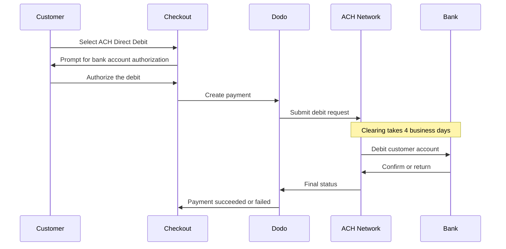

ACH Direct Debit consente ai clienti negli Stati Uniti di pagare direttamente dal proprio conto bancario invece di utilizzare una carta. Funziona sulla rete Automated Clearing House ed è offerto nei checkout in USD per i pagamenti una tantum.

## Perché offrire ACH Direct Debit?

<CardGroup cols={3}>
<Card title="Lower Processing Cost" icon="piggy-bank">
Gli addebiti bancari hanno in genere costi di elaborazione inferiori rispetto ai pagamenti con carta, soprattutto per gli ordini di valore elevato.
</Card>

<Card title="No Card Required" icon="building-columns">
Raggiungi i clienti statunitensi che preferiscono pagare da un conto bancario o che non vogliono utilizzare una carta per acquisti di grande valore.
</Card>

<Card title="Higher Value Orders" icon="chart-line">
Il vantaggio in termini di costi rispetto alle carte aumenta con il valore dell'ordine, rendendo ACH particolarmente adatto agli acquisti una tantum di grande valore.
</Card>
</CardGroup>

## Panoramica

| Dettaglio | Valore |
| :----- | :---- |
| **Valuta di fatturazione** | USD |
| **Paesi supportati** | Stati Uniti |
| **Abbonamenti** | No |
| **Importo minimo** | $0.50 |
| **Regolamento** | 4 giorni lavorativi |

<Warning>
ACH Direct Debit non è istantaneo. Un pagamento richiede **4 giorni lavorativi** per essere confermato, quindi non considerare l'autorizzazione come un regolamento: completa l'ordine solo quando il pagamento raggiunge lo stato succeeded.
</Warning>

## Come funziona



## Esperienza del cliente

1. Il cliente seleziona ACH Direct Debit al checkout
2. Il cliente autorizza l'addebito sul proprio conto bancario statunitense
3. Il pagamento viene inviato alla rete ACH ed entra in uno stato di elaborazione
4. Il clearing viene completato nei giorni lavorativi successivi
5. Il pagamento passa allo stato succeeded oppure non va a buon fine se la banca lo restituisce

<Info>
Poiché il clearing è asincrono, affidati ai [webhook](/developer-resources/webhooks) per conoscere l'esito finale invece che al reindirizzamento del checkout. Un reindirizzamento riuscito indica solo che il cliente ha autorizzato l'addebito.

Il pagamento emette `payment.processing` una volta inviato l'addebito, quindi `payment.succeeded` o `payment.failed` al completamento del clearing. Solo `payment.succeeded` è sicuro per completare l'ordine.
</Info>

## Disponibilità

ACH Direct Debit viene visualizzato al checkout quando sono vere tutte le seguenti condizioni:

- La **valuta di fatturazione** è `USD`
- Il **paese di fatturazione** è `US`
- La transazione è un **pagamento una tantum**

<Note>
ACH Direct Debit non è disponibile per gli abbonamenti. La finestra di clearing di più giorni lo rende inadatto ai cicli di fatturazione ricorrenti. Per i pagamenti ricorrenti, utilizza le carte o un altro metodo che supporti gli abbonamenti: consulta la [panoramica dei metodi di pagamento](/features/payment-methods).
</Note>

## Configurazione

```javascript
const session = await client.checkoutSessions.create({
  product_cart: [{ product_id: 'pdt_123', quantity: 1 }],
  allowed_payment_method_types: ['ach', 'credit', 'debit'],
  billing_currency: 'USD',
  billing_address: {
    country: 'US',
    zipcode: '94102'
  },
  return_url: 'https://example.com/success'
});
```

<Note>
ACH Direct Debit richiede la valuta di fatturazione **USD** e un indirizzo di fatturazione negli **Stati Uniti**. Se indichi i prezzi in un'altra valuta, abilita [Adaptive Currency](/features/adaptive-currency) affinché ai clienti statunitensi venga addebitato l'importo in USD e ACH diventi disponibile.
</Note>

## Tipo di metodo API

| Tipo | Metodo | Paese |
| :--- | :----- | :------ |
| `ach` | ACH Direct Debit | Stati Uniti |

## Rimborsi e contestazioni

I rimborsi e le contestazioni per i pagamenti ACH utilizzano le stesse API e gli stessi flussi della dashboard degli altri metodi di pagamento: non è necessario implementare una gestione specifica per ACH.

<Warning>
Poiché i pagamenti ACH possono essere restituiti dalla banca del cliente anche dopo essere apparentemente andati a buon fine, evita di emettere rimborsi finché il pagamento originale non ha raggiunto lo stato succeeded.
</Warning>

## Test

<Steps>
<Step title="Enable test mode">
Utilizza le chiavi API di test di Dodo Payments.
</Step>

<Step title="Set currency and billing address">
Imposta la valuta di fatturazione su `USD` e il paese dell'indirizzo di fatturazione su `US`.
</Step>

<Step title="Include `ach` in allowed methods">
Passa `ach` in `allowed_payment_method_types` oppure ometti completamente il campo per mostrare tutti i metodi idonei.
</Step>

<Step title="Enter the test bank details">
Inserisci una delle coppie di numeri di routing e di conto di test riportate di seguito, quindi verifica che il tuo gestore webhook riceva lo stato finale del pagamento.
</Step>
</Steps>

### Conti bancari di test

I clienti inseriscono il numero di conto e il numero di routing direttamente al checkout. In modalità di test, utilizza il numero di routing `110000000` con uno dei numeri di conto riportati di seguito per forzare un risultato specifico.

| Numero di conto | Numero di routing | Comportamento |
| :------------- | :------------- | :------- |
| `000123456789` | `110000000` | Il pagamento va a buon fine. |
| `000222222227` | `110000000` | Il pagamento non va a buon fine per fondi insufficienti. |
| `000111111113` | `110000000` | Il pagamento non va a buon fine perché il conto è chiuso. |
| `000111111116` | `110000000` | Il pagamento non va a buon fine perché non è stato trovato alcun conto. |
| `000333333335` | `110000000` | Il pagamento non va a buon fine perché gli addebiti non sono autorizzati sul conto. |
| `000444444440` | `110000000` | Il pagamento non va a buon fine a causa di una valuta non valida. |
| `000555555559` | `110000000` | Il pagamento va a buon fine e poi genera una contestazione. |
| `000000000009` | `110000000` | Il pagamento rimane indefinitamente in elaborazione, utile per testare un'interfaccia per lo stato pending. |

<Note>
La maggior parte dei pagamenti di test raggiunge uno stato finale molto più rapidamente rispetto alla finestra di clearing reale, quindi non è necessario attendere giorni per verificare l'integrazione. L'eccezione è `000000000009`, progettato per rimanere in elaborazione.
</Note>

## Procedure consigliate

<AccordionGroup>
<Accordion title="Don't fulfill on authorization">
L'autorizzazione ACH non equivale a un pagamento. Attendi che il pagamento raggiunga lo stato succeeded prima di concedere l'accesso o spedire l'ordine: la banca del cliente può ancora restituire l'addebito.
</Accordion>

<Accordion title="Set customer expectations at checkout">
Informa i clienti che i pagamenti bancari non vengono liquidati istantaneamente. In questo modo ridurrai le richieste all'assistenza relative agli ordini ancora in sospeso.
</Accordion>

<Accordion title="Provide card fallbacks">
Includi sempre `credit` e `debit` insieme a `ach`, così i clienti che hanno bisogno di un accesso immediato al prodotto possono scegliere un metodo più rapido.
</Accordion>

<Accordion title="Use ACH for high-value one-time purchases">
Il vantaggio in termini di costi di ACH aumenta con il valore dell'ordine, quindi è più utile per gli acquisti una tantum di grande valore che per quelli di piccolo importo.
</Accordion>
</AccordionGroup>

## Risoluzione dei problemi

<AccordionGroup>
<Accordion title="ACH not appearing at checkout">
**Verifica:**
1. La valuta di fatturazione è impostata su `USD`?
2. Il paese di fatturazione del cliente è `US`?
3. `ach` è incluso in `allowed_payment_method_types`?
4. Si tratta di un pagamento una tantum? ACH non è offerto per gli abbonamenti.

**Soluzione:** rimuovi temporaneamente `allowed_payment_method_types` per visualizzare tutti i metodi idonei, quindi verifica la valuta di fatturazione e il paese dell'indirizzo nella richiesta API.
</Accordion>

<Accordion title="ACH not appearing on a subscription checkout">
**Causa:** ACH Direct Debit è offerto solo per i pagamenti una tantum.

**Soluzione:** utilizza le carte o un altro metodo compatibile con gli abbonamenti per la fatturazione ricorrente.
</Accordion>

<Accordion title="Payment stuck in processing">
**Causa:** è un comportamento previsto. I pagamenti ACH restano nello stato di elaborazione per l'intera finestra di clearing, molto più a lungo rispetto ai pagamenti con carta.

**Soluzione:** attendi il webhook finale. Non ripetere il pagamento: un nuovo tentativo potrebbe addebitare due volte il cliente.
</Accordion>

<Accordion title="Payment failed after initially succeeding at checkout">
**Causa:** la banca del cliente ha restituito l'addebito, nella maggior parte dei casi per fondi insufficienti o perché il conto è chiuso.

**Soluzione:** considera il pagamento non riuscito e chiedi al cliente di riprovare con un altro metodo di pagamento. Per evitare questo problema, basa sempre l'evasione sullo stato succeeded.
</Accordion>
</AccordionGroup>

## Pagine correlate

<CardGroup cols={2}>
<Card title="Payment Methods Overview" icon="credit-card" href="/features/payment-methods">
Visualizza tutti i metodi di pagamento supportati.
</Card>

<Card title="Adaptive Currency" icon="globe" href="/features/adaptive-currency">
Supporto delle valute e conversione automatica.
</Card>

<Card title="Checkout Guide" icon="book" href="/developer-resources/checkout-session">
Guida completa all'implementazione del checkout.
</Card>

<Card title="Webhooks" icon="webhook" href="/developer-resources/webhooks">
Gestisci in modo asincrono le conferme ritardate dei pagamenti.
</Card>
</CardGroup>
