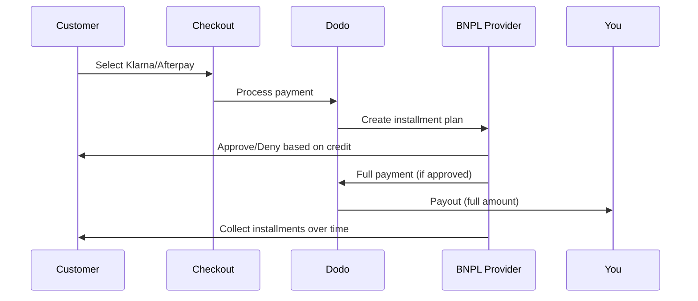

Compra Ora Paga Dopo (BNPL) consente ai clienti di suddividere gli acquisti in rate senza interessi, aumentando il valore medio degli ordini del 20-50% e i tassi di conversione del 10-30% per le transazioni idonee.

## Perché offrire BNPL?

<CardGroup cols={3}>
<Card title="Higher AOV" icon="chart-line">
I clienti spendono di più quando possono dilazionare i pagamenti nel tempo. Il valore medio dell'ordine aumenta dal 20 al 50%.
</Card>

<Card title="Better Conversion" icon="percent">
Eliminando gli attriti nei pagamenti al checkout. I tassi di conversione migliorano dal 10 al 30% per articoli di alto valore.
</Card>

<Card title="Zero Risk" icon="shield-check">
I fornitori BNPL gestiscono il rischio di credito e la riscossione. Ricevi il pagamento completo in anticipo.
</Card>
</CardGroup>

## Fornitori Supportati

### Klarna

| Funzionalità | Dettagli |
| :------ | :------ |
| **Disponibilità** | USA + 19 paesi europei |
| **Valute** | USD, EUR, GBP, DKK, NOK, SEK, CZK, RON, PLN, CHF |
| **Minimo** | $50,01 (o equivalente) |
| **Abbonamenti** | Sì |

**Paesi Supportati:** Austria, Belgio, Repubblica Ceca, Danimarca, Finlandia, Francia, Germania, Grecia, Irlanda, Italia, Paesi Bassi, Norvegia, Polonia, Portogallo, Romania, Spagna, Svezia, Svizzera, Regno Unito, Stati Uniti

**Opzioni di Pagamento:**
- **Paga in 4** — Suddividi in 4 pagamenti senza interessi
- **Paga in 30 giorni** — Pagamento completo dovuto in 30 giorni
- **Finanziamento** — Piani di rateizzazione a lungo termine

### Afterpay (Clearpay)

| Caratteristica | Dettagli |
| :------ | :------ |
| **Disponibilità** | USA, Regno Unito |
| **Valute** | USD, GBP |
| **Minimo** | $50.01 (o equivalente) |
| **Abbonamenti** | No |

**Opzioni di Pagamento:**
- **Paga in 4** — 4 pagamenti senza interessi ogni 2 settimane

<Note>
Nel Regno Unito, Afterpay opera come "Clearpay" ma utilizza lo stesso tipo di API (`afterpay_clearpay`).
</Note>

### Billie

| Caratteristica | Dettagli |
| :------ | :------ |
| **Disponibilità** | Globale |
| **Valute** | GBP |
| **Minimo** | Nessuno |
| **Abbonamenti** | No |

**Informazioni su Billie:**
Billie è una soluzione B2B Compra Ora Paga Dopo che consente alle aziende di offrire termini di pagamento flessibili ai propri clienti. È progettata per transazioni business-to-business dove gli acquirenti necessitano di opzioni di pagamento basate su fattura.

**Opzioni di Pagamento:**
- **Pagamento Fattura** — Paga entro i termini di pagamento concordati
- **Termini Flessibili** — Programmi di pagamento favorevoli per le aziende

### Sunbit

| Caratteristica | Dettagli |
| :------ | :------ |
| **Disponibilità** | US |
| **Valute** | USD |
| **Minimo** | $60.00 |
| **Massimo** | $19,999.00 |
| **Abbonamenti** | No |

**Opzioni di Pagamento:**
- **Finanziamento a Rate** — Suddividi gli acquisti in pagamenti mensili gestibili

## Configurazione

### Tipi di Metodi API

| Tipo | Fornitore |
| :--- | :------- |
| `klarna` | Klarna |
| `afterpay_clearpay` | Afterpay / Clearpay |
| `billie` | Billie (B2B) |
| `sunbit` | Sunbit |

### Esempio

```javascript
const session = await client.checkoutSessions.create({
  product_cart: [{ product_id: 'prod_123', quantity: 1 }],
  allowed_payment_method_types: [
    'klarna',
    'afterpay_clearpay',
    'credit',
    'debit'
  ],
  customer: {
    email: 'customer@example.com',
    name: 'Jane Smith'
  },
  billing_address: {
    country: 'US',
    zipcode: '10001'
  },
  return_url: 'https://example.com/success'
});
```

<Warning>
Includi sempre `credit` e `debit` come alternative. Non tutti i clienti sono idonei per BNPL e le transazioni sotto il minimo del fornitore non saranno valide.
</Warning>

## Limiti di Importo delle Transazioni

Ogni fornitore BNPL ha il proprio importo minimo (e talvolta massimo) per le transazioni:

| Fornitore | Minimo | Massimo |
| :------- | :------ | :------ |
| Klarna | $50.01 | — |
| Afterpay | $50.01 | — |
| Sunbit | $60.00 | $19,999.00 |

Transazioni fuori da queste soglie:
- Le opzioni BNPL non appariranno al checkout
- Non viene generato un errore — le opzioni semplicemente non appaiono
- I pagamenti con carta restano disponibili

Questo è il comportamento previsto. Non includere un metodo BNPL in `allowed_payment_method_types` se il prezzo del tuo prodotto è improbabile che rientri nell'intervallo supportato da quel fornitore.

## Come Funzionano le Rate



**Punti chiave:**
- Ricevi il **pagamento completo in anticipo** dal fornitore BNPL
- Il fornitore BNPL gestisce il **rischio di credito e le riscossioni**
- Il cliente paga direttamente al fornitore in **4 rate** (tipicamente)
- **Nessun chargeback** per fallimenti nelle rate — il rischio è del fornitore

## Test

### Dati di Test Klarna

Usa questi dettagli in modalità test:

| Campo | Approvato | Negato |
| :---- | :------- | :----- |
| **Data di Nascita** | 07-10-1970 | 07-10-1970 |
| **Nome** | Test | Test |
| **Cognome** | Person-us | Person-us |
| **Email** | customer@email.us | customer+denied@email.us |
| **Strada** | Amsterdam Ave | Amsterdam Ave |
| **Numero Civico** | 509 | 509 |
| **Città** | New York | New York |
| **Stato** | New York | New York |
| **CAP** | 10024-3941 | 10024-3941 |
| **Telefono** | +13106683312 | +13106354386 |

<Note>
La transazione deve essere di almeno $50 per far apparire Klarna come opzione.
</Note>

### Test Afterpay

<Steps>
<Step title="Select Afterpay">
Scegli Afterpay nel checkout e clicca su Pay.
</Step>

<Step title="Successful payment">
Usa qualsiasi email valida e indirizzo di spedizione.
</Step>

<Step title="Failed authentication">
Per testare un fallimento: chiudi il modal Afterpay nella pagina di reindirizzamento. Lo stato del pagamento passa a `requires_payment_method`.
</Step>
</Steps>

### Test Sunbit

<Steps>
<Step title="Set billing country and currency">
Assicurati che la sessione di checkout abbia `billing_address.country` impostato su `US` e `billing_currency` impostato su `USD`.
</Step>

<Step title="Use a qualifying amount">
Imposta l'importo della transazione tra **$60.00 e $19,999.00**. Sunbit non apparirà fuori da questo intervallo.
</Step>

<Step title="Select Sunbit">
Scegli Sunbit al checkout e completa il flusso di applicazione finanziaria nel modal Sunbit.
</Step>

<Step title="Test failure">
Per simulare un'applicazione declinata, chiudi il modal Sunbit prima di completare il flusso. Il pagamento passa a `requires_payment_method`.
</Step>
</Steps>

<Note>
Sunbit è disponibile solo per i clienti statunitensi che pagano in USD con un importo tra $60.00 e $19,999.00.
</Note>

## Migliori Pratiche

<AccordionGroup>
<Accordion title="Target high-ticket items">
BNPL funziona meglio per prodotti da $100 a $1000. La proposta di valore "paga nel tempo" è più convincente in questo intervallo.
</Accordion>

<Accordion title="Show installment amounts">
"4 pagamenti da $25" è più convincente di "$100 con Klarna". Mostra l'importo per rata quando possibile.
</Accordion>

<Accordion title="Don't force BNPL for low-value products">
Sotto i $50, BNPL non apparirà comunque. Sotto i $100, la maggior parte dei clienti preferisce le carte. Concentrati sulla promozione BNPL su articoli di valore più elevato.
</Accordion>

<Accordion title="Collect billing address">
I fornitori BNPL richiedono informazioni di fatturazione per i controlli di credito. Assicurati che il tuo checkout raccolga tutti i dettagli di indirizzo.
</Accordion>

<Accordion title="Set clear expectations">
I clienti devono capire che stanno entrando in un accordo di credito con Klarna/Afterpay, non con te.
</Accordion>
</AccordionGroup>

## Limitazioni

### Nessun Abbonamento
I metodi di pagamento BNPL **non supportano pagamenti ricorrenti**. Per i prodotti in abbonamento, usa carte o altri metodi compatibili con ricorrenti.

### Approvazione Basata sul Credito
I fornitori BNPL effettuano controlli di credito istantanei. Non tutti i clienti verranno approvati. I tassi di approvazione variano in base a:
- Storico del credito del cliente con il fornitore
- Importo della transazione
- Posizione del cliente

### Mappatura Valuta & Paese

Ogni valuta è limitata alla sua regione corrispondente:

| Valuta | Paesi Supportati |
| :------- | :------------------ |
| **USD** | Solo Stati Uniti |
| **EUR** | Tutti i paesi europei supportati (Austria, Belgio, Repubblica Ceca, Danimarca, Finlandia, Francia, Germania, Grecia, Irlanda, Italia, Paesi Bassi, Norvegia, Polonia, Portogallo, Romania, Spagna, Svezia, Svizzera) |
| **GBP** | Regno Unito e tutti i paesi europei supportati |

Altre valute supportate da Klarna (DKK, NOK, SEK, CZK, RON, PLN, CHF) funzionano nei rispettivi paesi.

<Info>
Ad esempio, una transazione in USD mostrerà le opzioni BNPL solo ai clienti negli Stati Uniti. Una transazione in EUR mostrerà le opzioni BNPL in tutti i paesi europei supportati. Una transazione in GBP mostrerà le opzioni BNPL ai clienti nel Regno Unito e in tutti i paesi europei supportati.
</Info>

| Fornitore | Valute Supportate |
| :------- | :------------------- |
| Klarna | USD, EUR, GBP, DKK, NOK, SEK, CZK, RON, PLN, CHF |
| Afterpay | USD (US), GBP (UK) |
| Sunbit | USD (US) |

## Risoluzione dei Problemi

<AccordionGroup>
<Accordion title="BNPL not appearing at checkout">
**Verifica:**
1. Importo della transazione nel range supportato dal fornitore? (Klarna/Afterpay: minimo $50.01; Sunbit: $60.00–$19,999.00)
2. Posizione del cliente nel paese supportato?
3. Valuta supportata dal fornitore BNPL?
4. Metodo BNPL incluso in `allowed_payment_method_types`?

**Soluzione:** Più comunemente, la transazione è al di sotto del minimo o al di sopra del massimo. Verifica che l'importo rientri nel range supportato dal fornitore.
</Accordion>

<Accordion title="Customer denied by BNPL provider">
**Cause:**
- Insufficiente storico del credito con il fornitore
- Troppi piani di rate attivi
- Verifica dell'identità fallita

**Soluzione:** Questo è previsto per alcuni clienti. Assicurati che ci siano alternative con carta disponibili. Non esporre ragioni specifiche di rifiuto.
</Accordion>

<Accordion title="Payment stuck in pending">
**Causa:** Il cliente non ha completato il flusso di autenticazione con il fornitore BNPL.

**Soluzione:** Il pagamento scadrà e fallirà. Il cliente può riprovare o utilizzare un metodo diverso.
</Accordion>
</AccordionGroup>

## Pagine Correlate

<CardGroup cols={2}>
<Card title="Payment Methods Overview" icon="credit-card" href="/features/payment-methods">
Vedi tutti i metodi di pagamento supportati.
</Card>

<Card title="Checkout Guide" icon="book" href="/developer-resources/checkout-session">
Guida completa all'implementazione del checkout.
</Card>

<Card title="Testing Process" icon="flask" href="/miscellaneous/testing-process">
Tutti i dati di test per i metodi di pagamento.
</Card>

<Card title="Adaptive Currency" icon="globe" href="/features/adaptive-currency">
Supporto valuta e conversione.
</Card>
</CardGroup>