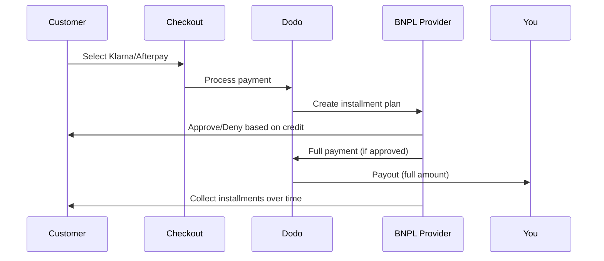

Compra Ora Paga Dopo (BNPL) consente ai clienti di suddividere gli acquisti in rate senza interessi, aumentando il valore medio degli ordini del 20-50% e i tassi di conversione del 10-30% per le transazioni idonee.

## Perché offrire BNPL?

<CardGroup cols={3}>
<Card title="Higher AOV" icon="chart-line">
I clienti spendono di più quando possono dilazionare i pagamenti nel tempo. Il valore medio dell'ordine aumenta dal 20 al 50%.
</Card>

<Card title="Better Conversion" icon="percent">
Eliminando gli attriti nei pagamenti al checkout. I tassi di conversione migliorano dal 10 al 30% per articoli di alto valore.
</Card>

<Card title="Zero Risk" icon="shield-check">
I fornitori BNPL gestiscono il rischio di credito e la riscossione. Ricevi il pagamento completo in anticipo.
</Card>
</CardGroup>

## Fornitori Supportati

### Klarna

| Funzionalità | Dettagli |
| :------ | :------ |
| **Disponibilità** | USA + 19 paesi europei |
| **Valute** | USD, EUR, GBP, DKK, NOK, SEK, CZK, RON, PLN, CHF |
| **Minimo** | $50,01 (o equivalente) |
| **Abbonamenti** | Sì |

**Paesi Supportati:** Austria, Belgio, Repubblica Ceca, Danimarca, Finlandia, Francia, Germania, Grecia, Irlanda, Italia, Paesi Bassi, Norvegia, Polonia, Portogallo, Romania, Spagna, Svezia, Svizzera, Regno Unito, Stati Uniti

**Opzioni di Pagamento:**
- **Paga in 4** — Suddividi in 4 pagamenti senza interessi
- **Paga in 30 giorni** — Pagamento completo dovuto in 30 giorni
- **Finanziamento** — Piani di rateizzazione a lungo termine

### Afterpay (Clearpay)

| Caratteristica | Dettagli |
| :------ | :------ |
| **Disponibilità** | USA, Regno Unito |
| **Valute** | USD, GBP |
| **Minimo** | $50.01 (o equivalente) |
| **Abbonamenti** | No |

**Opzioni di Pagamento:**
- **Paga in 4** — 4 pagamenti senza interessi ogni 2 settimane

<Note>
Nel Regno Unito, Afterpay opera come "Clearpay" ma utilizza lo stesso tipo di API (`afterpay_clearpay`).
</Note>

### Billie

| Caratteristica | Dettagli |
| :------ | :------ |
| **Disponibilità** | Globale |
| **Valute** | GBP |
| **Minimo** | Nessuno |
| **Abbonamenti** | No |

**Informazioni su Billie:**
Billie è una soluzione B2B Compra Ora Paga Dopo che consente alle aziende di offrire termini di pagamento flessibili ai propri clienti. È progettata per transazioni business-to-business dove gli acquirenti necessitano di opzioni di pagamento basate su fattura.

**Opzioni di Pagamento:**
- **Pagamento Fattura** — Paga entro i termini di pagamento concordati
- **Termini Flessibili** — Programmi di pagamento favorevoli per le aziende

## Configurazione

### Tipi di metodi API

| Tipo | Provider |
| :--- | :------- |
| `klarna` | Klarna |
| `afterpay_clearpay` | Afterpay / Clearpay |
| `billie` | Billie (B2B) |

### Esempio

```javascript
const session = await client.checkoutSessions.create({
  product_cart: [{ product_id: 'pdt_123', quantity: 1 }],
  allowed_payment_method_types: [
    'klarna',
    'afterpay_clearpay',
    'credit',
    'debit'
  ],
  customer: {
    email: 'customer@example.com',
    name: 'Jane Smith'
  },
  billing_address: {
    country: 'US',
    zipcode: '10001'
  },
  return_url: 'https://example.com/success'
});
```

<Warning>
Includi sempre `credit` e `debit` come fallback. Non tutti i clienti sono idonei per BNPL e le transazioni inferiori all'importo minimo del provider non saranno idonee.
</Warning>

## Limiti degli importi delle transazioni

Ogni provider BNPL ha un proprio importo minimo (e talvolta massimo) per le transazioni:

| Provider | Minimo | Massimo |
| :------- | :------ | :------ |
| Klarna | $50.01 | — |
| Afterpay | $50.01 | — |

Le transazioni al di fuori di queste soglie:
- Le opzioni BNPL non verranno visualizzate al checkout
- Non viene generato alcun errore: le opzioni semplicemente non vengono mostrate
- I pagamenti con carta restano disponibili

Questo comportamento è previsto. Non includere un metodo BNPL in `allowed_payment_method_types` se è improbabile che il prezzo del tuo prodotto rientri nell'intervallo supportato da quel provider.

## Come funzionano le rate



**Punti chiave:**
- Ricevi **l'intero pagamento in anticipo** dal provider BNPL
- Il provider BNPL gestisce il **rischio di credito e il recupero crediti**
- Il cliente paga direttamente il provider in **4 rate** (in genere)
- **Nessun chargeback** dovuto al mancato pagamento delle rate: questo rischio è a carico del provider

## Test

### Dati di test Klarna

Utilizza questi dati in modalità test:

| Campo | Approvato | Negato |
| :---- | :------- | :----- |
| **Data di nascita** | 07-10-1970 | 07-10-1970 |
| **Nome** | Test | Test |
| **Cognome** | Person-us | Person-us |
| **Email** | customer@email.us | customer+denied@email.us |
| **Via** | Amsterdam Ave | Amsterdam Ave |
| **Numero civico** | 509 | 509 |
| **Città** | New York | New York |
| **Stato** | New York | New York |
| **Codice postale** | 10024-3941 | 10024-3941 |
| **Telefono** | +13106683312 | +13106354386 |

<Note>
La transazione deve essere di almeno $50 affinché Klarna venga visualizzato come opzione.
</Note>

### Test di Afterpay

<Steps>
<Step title="Select Afterpay">
Seleziona Afterpay al checkout e fai clic su Pay.
</Step>

<Step title="Successful payment">
Utilizza un indirizzo email e un indirizzo di spedizione validi.
</Step>

<Step title="Failed authentication">
Per testare un errore: chiudi la finestra modale di Afterpay nella pagina di reindirizzamento. Lo stato del pagamento passa a `requires_payment_method`.
</Step>
</Steps>

## Best practice

<AccordionGroup>
<Accordion title="Target high-ticket items">
BNPL funziona al meglio per prodotti dal valore compreso tra $100 e $1000. In questa fascia, la proposta di valore del "pagare nel tempo" è particolarmente convincente.
</Accordion>

<Accordion title="Show installment amounts">
"4 pagamenti da $25" è più convincente di "$100 con Klarna". Quando possibile, mostra l'importo di ogni pagamento.
</Accordion>

<Accordion title="Don't force BNPL for low-value products">
Al di sotto di $50, BNPL non verrà comunque visualizzato. Al di sotto di $100, la maggior parte dei clienti preferisce le carte. Concentra la promozione di BNPL sui prodotti di valore più elevato.
</Accordion>

<Accordion title="Collect billing address">
I provider BNPL richiedono i dati di fatturazione per i controlli del credito. Assicurati che il checkout raccolga tutti i dati dell'indirizzo.
</Accordion>

<Accordion title="Set clear expectations">
I clienti devono comprendere che stanno stipulando un contratto di credito con Klarna/Afterpay, non con te.
</Accordion>
</AccordionGroup>

## Limitazioni

### Nessun abbonamento
I metodi di pagamento BNPL **non supportano i pagamenti ricorrenti**. Per i prodotti in abbonamento, utilizza le carte o altri metodi compatibili con i pagamenti ricorrenti.

### Approvazione basata sul credito
I provider BNPL eseguono controlli del credito istantanei. Non tutti i clienti verranno approvati. I tassi di approvazione variano in base a:
- Storico creditizio del cliente presso il provider
- Importo della transazione
- Posizione del cliente

### Mappatura di valute e Paesi

Ogni valuta è limitata alla regione corrispondente:

| Valuta | Paesi supportati |
| :------- | :------------------ |
| **USD** | Solo Stati Uniti |
| **EUR** | Tutti i Paesi europei supportati (Austria, Belgio, Repubblica Ceca, Danimarca, Finlandia, Francia, Germania, Grecia, Irlanda, Italia, Paesi Bassi, Norvegia, Polonia, Portogallo, Romania, Spagna, Svezia, Svizzera) |
| **GBP** | Regno Unito e tutti i Paesi europei supportati |

Le altre valute supportate da Klarna (DKK, NOK, SEK, CZK, RON, PLN, CHF) funzionano nei rispettivi Paesi.

<Info>
Ad esempio, una transazione in USD mostrerà le opzioni BNPL solo ai clienti negli Stati Uniti. Una transazione in EUR mostrerà le opzioni BNPL in tutti i Paesi europei supportati. Una transazione in GBP mostrerà le opzioni BNPL ai clienti nel Regno Unito e in tutti i Paesi europei supportati.
</Info>

| Provider | Valute supportate |
| :------- | :------------------- |
| Klarna | USD, EUR, GBP, DKK, NOK, SEK, CZK, RON, PLN, CHF |
| Afterpay | USD (US), GBP (UK) |

## Risoluzione dei problemi

<AccordionGroup>
<Accordion title="BNPL not appearing at checkout">
**Verifica:**
1. L'importo della transazione rientra nell'intervallo supportato dal provider? (Klarna/Afterpay: minimo $50.01)
2. La posizione del cliente è in un Paese supportato?
3. La valuta è supportata dal provider BNPL?
4. Il metodo BNPL è incluso in `allowed_payment_method_types`?

**Soluzione:** Nella maggior parte dei casi, la transazione è inferiore al minimo o superiore al massimo. Verifica che l'importo rientri nell'intervallo supportato dal provider.
</Accordion>

<Accordion title="Customer denied by BNPL provider">
**Cause:**
- Storico creditizio insufficiente presso il provider
- Troppi piani rateali attivi
- Verifica dell'identità non riuscita

**Soluzione:** Questo comportamento è previsto per alcuni clienti. Assicurati che siano disponibili fallback con carta. Non mostrare i motivi specifici del rifiuto.
</Accordion>

<Accordion title="Payment stuck in pending">
**Causa:** il cliente non ha completato il flusso di autenticazione con il provider BNPL.

**Soluzione:** Il pagamento andrà in timeout e non andrà a buon fine. Il cliente può riprovare o utilizzare un metodo diverso.
</Accordion>
</AccordionGroup>

## Pagine correlate

<CardGroup cols={2}>
<Card title="Payment Methods Overview" icon="credit-card" href="/features/payment-methods">
Visualizza tutti i metodi di pagamento supportati.
</Card>

<Card title="Checkout Guide" icon="book" href="/developer-resources/checkout-session">
Guida completa all'implementazione del checkout.
</Card>

<Card title="Testing Process" icon="flask" href="/miscellaneous/testing-process">
Tutti i dati di test per i metodi di pagamento.
</Card>

<Card title="Adaptive Currency" icon="globe" href="/features/adaptive-currency">
Supporto e conversione delle valute.
</Card>
</CardGroup>