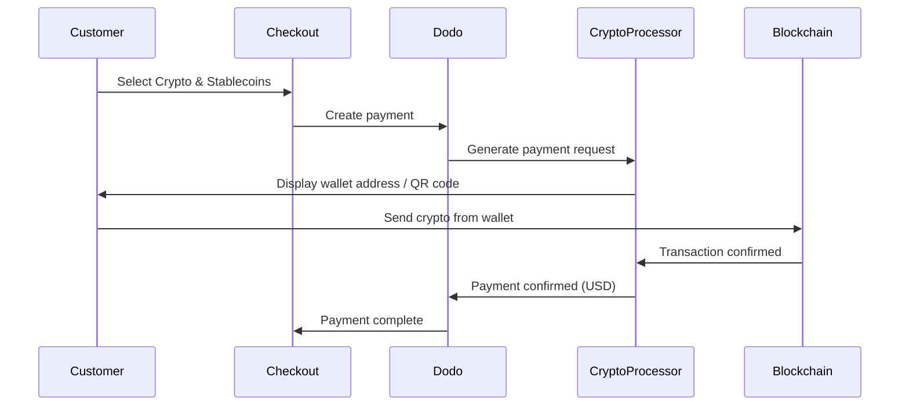

I pagamenti con Criptovalute e Stablecoin consentono ai clienti di pagare utilizzando criptovalute e stablecoin da qualsiasi parte del mondo (esclusa l'India). Le transazioni sono fatturate in USD, così ricevi valuta fiat mentre i clienti pagano con il loro portafoglio crypto preferito.

## Perché offrire Criptovalute e Stablecoin?

<CardGroup cols={3}>
<Card title="Global Reach" icon="globe">
Accetta pagamenti da qualsiasi paese — non è necessaria alcuna infrastruttura bancaria da parte del cliente.
</Card>

<Card title="No Chargebacks" icon="shield-check">
Le transazioni in cripto sono irreversibili, eliminando completamente le frodi con addebiti retroattivi.
</Card>

<Card title="USD Settlement" icon="dollar-sign">
Ricevi USD — non è necessario gestire la volatilità delle cripto o i portafogli.
</Card>
</CardGroup>

## Panoramica

| Dettaglio | Valore |
| :----- | :---- |
| **Valuta di Fatturazione** | USD |
| **Paesi Supportati** | Global (Escl. IN) |
| **Abbonamenti** | No |
| **Importo Minimo** | $0.50 |
| **Regolamento** | USD |

## Come Funziona



## Esperienza del Cliente

1. Il cliente seleziona Criptovalute e Stablecoin al checkout
2. Viene visualizzato un indirizzo di portafoglio e un codice QR con l'importo in cripto
3. Il cliente invia l'importo esatto dal suo portafoglio cripto
4. La transazione viene confermata sulla blockchain
5. Il cliente viene reindirizzato alla pagina di successo

<Info>
I pagamenti in cripto sono fatturati in USD. L'importo in cripto visualizzato al checkout riflette il tasso di cambio in tempo reale al momento del pagamento.
</Info>

## Valute e Reti Supportate

| Valuta | Reti |
| :------- | :------- |
| **USDC** | Ethereum, Solana, Polygon, Base |
| **USDP** | Ethereum, Solana |
| **USDG** | Ethereum |

## Configurazione

```javascript
const session = await client.checkoutSessions.create({
  product_cart: [{ product_id: 'prod_123', quantity: 1 }],
  allowed_payment_method_types: ['crypto', 'credit', 'debit'],
  return_url: 'https://example.com/success'
});
```

## Tipo di Metodo API

| Tipo | Metodo | Paese |
| :--- | :----- | :------ |
| `crypto` | Criptovalute e Stablecoin | Global (Escl. IN) |

## Test

<Steps>
<Step title="Enable test mode">
Usa le tue chiavi API di test di Dodo Payments.
</Step>

<Step title="Create a test checkout">
Crea una sessione di checkout con `crypto` nei metodi di pagamento consentiti.
</Step>

<Step title="Complete the test flow">
Segui il flusso di pagamento cripto simulato nell'ambiente di test.
</Step>
</Steps>

## Best Practices

<AccordionGroup>
<Accordion title="Always include card fallbacks">
Non tutti i clienti hanno portafogli cripto. Includi sempre `credit` e `debit` come metodi di pagamento alternativi.
</Accordion>

<Accordion title="Set clear expectations on confirmation time">
Le conferme blockchain possono richiedere minuti a seconda della rete. Assicurati che il tuo checkout comunichi questo ai clienti.
</Accordion>

<Accordion title="Handle underpayments and overpayments">
I pagamenti in cripto possono occasionalmente differire leggermente dall'importo esatto a causa delle commissioni di rete. Monitora i webhook per aggiornamenti sullo stato dei pagamenti.
</Accordion>
</AccordionGroup>

## Risoluzione dei Problemi

<AccordionGroup>
<Accordion title="Crypto not appearing at checkout">
**Verifica:**
1. `crypto` incluso in `allowed_payment_method_types`?
2. L'importo della transazione soddisfa il minimo ($0.50)?

**Soluzione:** Verifica che il tipo di metodo di pagamento sia correttamente passato nella tua richiesta API.
</Accordion>

<Accordion title="Payment not confirming">
**Causa:** I tempi di conferma della blockchain variano. Alcune reti impiegano più tempo di altre.

**Soluzione:** Attendi la conferma del webhook. Non considerare il pagamento come fallito fino alla fine della finestra di conferma.
</Accordion>

<Accordion title="Amount mismatch">
**Causa:** I tassi di cambio cripto fluttuano tra il momento in cui il pagamento viene avviato e quando viene inviato.

**Soluzione:** Monitora i webhook per l'importo finale confermato. Piccole discrepanze sono gestite automaticamente.
</Accordion>
</AccordionGroup>

## Pagine Correlate

<CardGroup cols={2}>
<Card title="Payment Methods Overview" icon="credit-card" href="/features/payment-methods">
Vedi tutti i metodi di pagamento supportati.
</Card>

<Card title="Checkout Guide" icon="book" href="/developer-resources/checkout-session">
Guida completa all'implementazione del checkout.
</Card>

<Card title="Webhooks" icon="webhook" href="/developer-resources/webhooks">
Gestisci le conferme di pagamento in modo asincrono.
</Card>

<Card title="Testing Process" icon="flask" href="/miscellaneous/testing-process">
Guida completa ai test per tutti i metodi di pagamento.
</Card>
</CardGroup>
