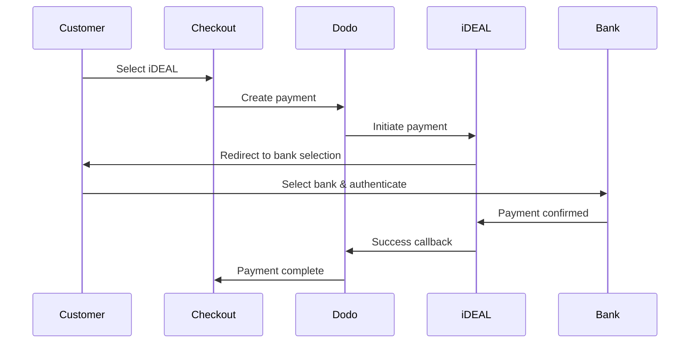
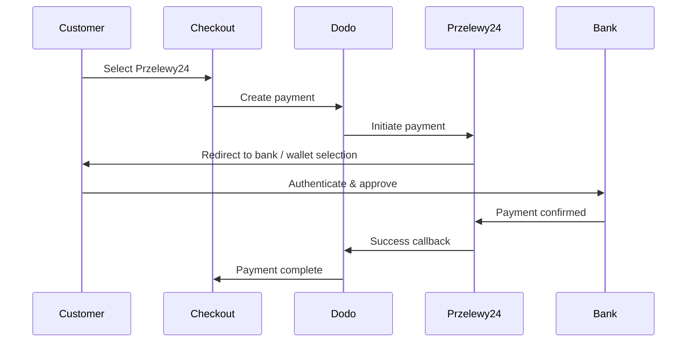

I clienti europei preferiscono fortemente i metodi di pagamento locali che si integrano con i loro sistemi bancari. Offrire questi metodi può aumentare i tassi di conversione dal 20 al 40% nei mercati di riferimento.

## Perché i Metodi di Pagamento Locali Europei?

<CardGroup cols={3}>
<Card title="Higher Conversion" icon="chart-line">
iDEAL cattura ~60% dei pagamenti online olandesi. Non offrirlo significa perdere clienti.
</Card>

<Card title="Lower Fraud" icon="shield-check">
i pagamenti autenticati dalla banca hanno tassi di frode quasi nulli e nessun chargeback.
</Card>

<Card title="Real-Time Settlement" icon="bolt">
La maggior parte dei metodi europei fornisce conferma immediata del pagamento.
</Card>
</CardGroup>

## Metodi Supportati

| Metodo | Paese | Quota di Mercato | Valuta | Abbonamenti |
| :----- | :------ | :----------- | :------- | :-----------: |
| **iDEAL** | Paesi Bassi | ~60% | EUR | No |
| **Bancontact** | Belgio | ~50% | EUR | No |
| **EPS** | Austria | ~30% | EUR | No |
| **Multibanco** | Portogallo | ~40% | EUR | No |
| **Przelewy24 (P24)** | Polonia | ~30% | PLN | No |

## iDEAL (Paesi Bassi)

iDEAL è il metodo di pagamento online dominante nei Paesi Bassi, collegandosi direttamente a tutte le principali banche olandesi.

### Come Funziona



### Banche Supportate

Tutte le principali banche olandesi sono supportate:
- ABN AMRO
- ASN Bank
- Bunq
- ING
- Knab
- Rabobank
- RegioBank
- Revolut
- SNS
- Triodos Bank
- Van Lanschot

### Configurazione

```javascript
const session = await client.checkoutSessions.create({
  product_cart: [{ product_id: 'prod_123', quantity: 1 }],
  allowed_payment_method_types: ['ideal', 'credit', 'debit'],
  billing_currency: 'EUR',
  billing_address: {
    country: 'NL',
    zipcode: '1012JS'
  },
  return_url: 'https://example.com/success'
});
```

## Bancontact (Belgio)

Bancontact è lo schema di pagamento nazionale del Belgio, utilizzato da praticamente tutte le banche belghe per i pagamenti online.

### Caratteristiche
- Funziona con le carte di debito belghe esistenti
- Supporto per app mobile (Payconiq by Bancontact)
- Conferma del pagamento istantanea
- Nessuna registrazione aggiuntiva necessaria per i clienti

### Configurazione

```javascript
const session = await client.checkoutSessions.create({
  product_cart: [{ product_id: 'prod_123', quantity: 1 }],
  allowed_payment_method_types: ['bancontact_card', 'credit', 'debit'],
  billing_currency: 'EUR',
  billing_address: {
    country: 'BE',
    zipcode: '1000'
  },
  return_url: 'https://example.com/success'
});
```

## EPS (Austria)

EPS (Standard di Pagamento Elettronico) consente trasferimenti bancari online diretti per i clienti austriaci.

### Caratteristiche
- Integrazione diretta con le banche austriache
- Conferma del pagamento in tempo reale
- Alta fiducia tra i consumatori austriaci
- Nessun chargeback

### Banche Supportate

Principali banche austriache, tra cui:
- Erste Bank
- Bank Austria
- Raiffeisen
- BAWAG
- Volksbank

### Configurazione

```javascript
const session = await client.checkoutSessions.create({
  product_cart: [{ product_id: 'prod_123', quantity: 1 }],
  allowed_payment_method_types: ['eps', 'credit', 'debit'],
  billing_currency: 'EUR',
  billing_address: {
    country: 'AT',
    zipcode: '1010'
  },
  return_url: 'https://example.com/success'
});
```

## Multibanco (Portogallo)

Multibanco è la rete interbancaria del Portogallo, che offre sia pagamenti online che pagamenti tramite ATM.

### Opzioni di Pagamento

1. **Online Banking** — Trasferimento diretto tramite internet banking
2. **Pagamento ATM** — Il cliente riceve un riferimento per pagare presso qualsiasi ATM Multibanco
3. **Mobile Banking** — Pagamento tramite app bancarie

### Come Funziona il Pagamento ATM

Per i pagamenti ATM, i clienti ricevono un riferimento per il pagamento:

```
Entity: 12345
Reference: 123 456 789
Amount: €50.00
Expiry: 24 hours
```

Il cliente può pagare presso qualsiasi ATM portoghese o tramite online banking utilizzando questo riferimento.

### Configurazione

```javascript
const session = await client.checkoutSessions.create({
  product_cart: [{ product_id: 'prod_123', quantity: 1 }],
  allowed_payment_method_types: ['multibanco', 'credit', 'debit'],
  billing_currency: 'EUR',
  billing_address: {
    country: 'PT',
    zipcode: '1000-001'
  },
  return_url: 'https://example.com/success'
});
```

<Note>
I pagamenti Multibanco presso ATM possono avere un ritardo tra il checkout e il pagamento effettivo. Monitora i webhook per la conferma del pagamento.
</Note>

## Przelewy24 (Polonia)

Przelewy24 (P24) è il principale metodo di pagamento online della Polonia, aggregando bonifici bancari e portafogli locali tra tutte le principali banche polacche. A differenza degli altri metodi europei, Przelewy24 è regolato in **PLN** (Złoty Polacco), non in EUR.

### Come Funziona



### Disponibilità

- **Valuta di fatturazione:** Solo PLN
- **Tipo di transazione:** Solo pagamenti una tantum (non disponibile per abbonamenti)
- **Copertura:** Tutte le principali banche polacche più i portafogli locali popolari

### Configurazione

```javascript
const session = await client.checkoutSessions.create({
  product_cart: [{ product_id: 'prod_123', quantity: 1 }],
  allowed_payment_method_types: ['przelewy24', 'credit', 'debit'],
  billing_currency: 'PLN',
  billing_address: {
    country: 'PL',
    zipcode: '00-001'
  },
  return_url: 'https://example.com/success'
});
```

<Note>
Przelewy24 richiede una valuta di fatturazione in **PLN**. Se citi i tuoi prezzi in EUR, abilita [Adaptive Currency](/features/adaptive-currency) affinché i clienti polacchi siano fatturati in PLN e Przelewy24 diventi disponibile.
</Note>

## Tipi di Metodi API

| Tipo | Metodo | Paese |
| :--- | :----- | :------ |
| `ideal` | iDEAL | Paesi Bassi |
| `bancontact_card` | Bancontact | Belgio |
| `eps` | EPS | Austria |
| `multibanco` | Multibanco | Portogallo |
| `przelewy24` | Przelewy24 (P24) | Polonia |

## Checkout Multipaese Europeo

Per le aziende che servono più paesi europei, includi tutti i metodi regionali:

```javascript
const session = await client.checkoutSessions.create({
  product_cart: [{ product_id: 'prod_123', quantity: 1 }],
  allowed_payment_method_types: [
    'ideal',           // Netherlands
    'bancontact_card', // Belgium
    'eps',             // Austria
    'multibanco',      // Portugal
    'przelewy24',      // Poland (requires PLN billing currency)
    'credit',          // Fallback
    'debit'            // Fallback
  ],
  billing_currency: 'EUR',
  return_url: 'https://example.com/success'
});
```

Dodo mostra automaticamente solo i metodi rilevanti in base alla posizione del cliente. Un cliente olandese vedrà iDEAL; un cliente belga vedrà Bancontact.

## Test

I metodi di pagamento europei possono essere testati in modalità sandbox. Il flusso di prova simula il processo di autenticazione della banca.

<Steps>
<Step title="Enable test mode">
Usa le tue chiavi API di test di Dodo Payments.
</Step>

<Step title="Set appropriate billing address">
Imposta il paese dell'indirizzo di fatturazione per abbinare il metodo di pagamento:
- `NL` per iDEAL
- `BE` per Bancontact
- `AT` per EPS
- `PT` per Multibanco
- `PL` per Przelewy24 (con valuta di fatturazione PLN)
</Step>

<Step title="Complete the test flow">
Segui il flusso di autenticazione bancaria simulato nell'ambiente di prova.
</Step>
</Steps>

## Migliori Pratiche

<AccordionGroup>
<Accordion title="Always include regional methods for target markets">
Se vendi a clienti olandesi, includi iDEAL. Non farlo è come non accettare Visa negli Stati Uniti: perderai vendite significative.
</Accordion>

<Accordion title="Match currency to region">
La maggior parte dei metodi di pagamento europei richiede EUR: assicurati che i tuoi prezzi supportino le transazioni in Euro. L'unica eccezione è Przelewy24, che è offerto solo con fatturazione **PLN** (Złoty Polacco).
</Accordion>

<Accordion title="Handle redirects gracefully">
Tutti i metodi europei prevedono reindirizzamenti ai siti delle banche. Assicurati che la gestione delle URL di ritorno sia robusta e tenga conto degli utenti che abbandonano a metà flusso.
</Accordion>

<Accordion title="Provide card fallbacks">
Non tutti i clienti europei hanno accesso a questi metodi regionali (turisti, espatriati, ecc.). Includi sempre `credit` e `debit` come opzioni alternative.
</Accordion>

<Accordion title="Consider Multibanco timing">
I pagamenti ATM Multibanco possono richiedere ore per essere completati. Non bloccare la realizzazione sull'immediato pagamento: usa webhook per la conferma asincrona.
</Accordion>
</AccordionGroup>

## Risoluzione dei Problemi

<AccordionGroup>
<Accordion title="European method not appearing">
**Controlla:**
1. Il paese di fatturazione del cliente corrisponde al paese del metodo?
2. La valuta è impostata su EUR?
3. Il metodo è incluso in `allowed_payment_method_types`?

**Soluzione:** I metodi europei sono strettamente regionali. Un cliente con paese di fatturazione `DE` (Germania) non vedrà iDEAL, che è solo nei Paesi Bassi.
</Accordion>

<Accordion title="Bank authentication failed">
**Cause:**
- Cliente annullato durante l'autenticazione bancaria
- Sistema di autenticazione della banca temporaneamente non disponibile
- Cliente ha inserito credenziali errate

**Soluzione:** Il cliente dovrebbe riprovare. Se il problema persiste, suggerisci di provare un metodo di pagamento diverso.
</Accordion>

<Accordion title="Redirect not completing">
**Cause:**
- Il cliente ha chiuso il browser durante il reindirizzamento bancario
- Problemi di rete durante l'autenticazione
- URL di ritorno mal configurato

**Soluzione:** Verificare che l'URL di ritorno sia corretto e accessibile. Assicurati che gestisca entrambi gli stati di successo e fallimento.
</Accordion>

<Accordion title="Multibanco payment pending">
**Causa:** Cliente ha ricevuto riferimento di pagamento ma non ha ancora pagato.

**Soluzione:** Questo è previsto per i pagamenti basati su ATM. Attendere la conferma via webhook. Il riferimento scade tipicamente in 24-72 ore.
</Accordion>
</AccordionGroup>

## Conformità PSD2

Tutti i metodi di pagamento europei sono conformi ai regolamenti PSD2 (Direttiva sui Servizi di Pagamento 2):

- **Autenticazione Forte del Cliente (SCA)** — Inclusa nel flusso di autenticazione bancaria
- **Comunicazione Sicura** — Tutti i dati trasmessi tramite canali sicuri
- **Protezione del Consumatore** — Piena conformità con i diritti dei consumatori dell'UE

## Pagine Correlate

<CardGroup cols={2}>
<Card title="Payment Methods Overview" icon="credit-card" href="/features/payment-methods">
Vedi tutti i metodi di pagamento supportati.
</Card>

<Card title="Adaptive Currency" icon="globe" href="/features/adaptive-currency">
Supporto per le valute e conversione automatica.
</Card>

<Card title="Checkout Guide" icon="book" href="/developer-resources/checkout-session">
Guida completa all'implementazione del checkout.
</Card>

<Card title="Webhooks" icon="webhook" href="/developer-resources/webhooks">
Gestisci le conferme di pagamento in modo asincrono.
</Card>
</CardGroup>