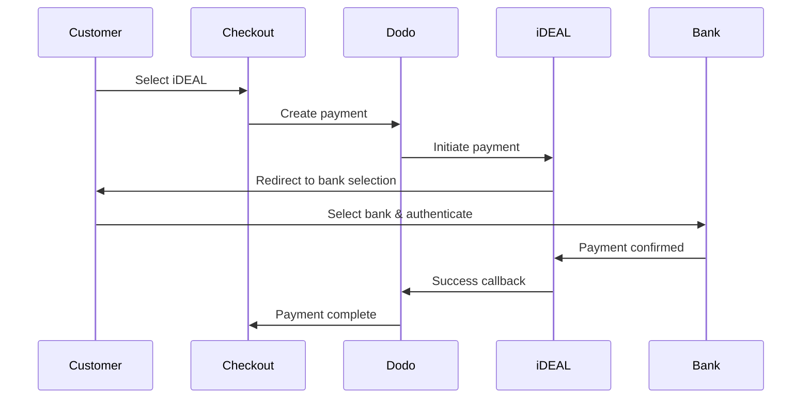
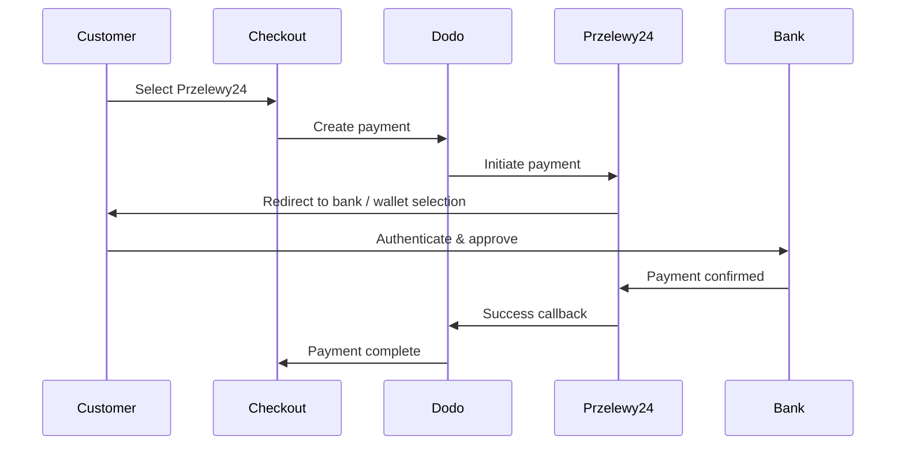
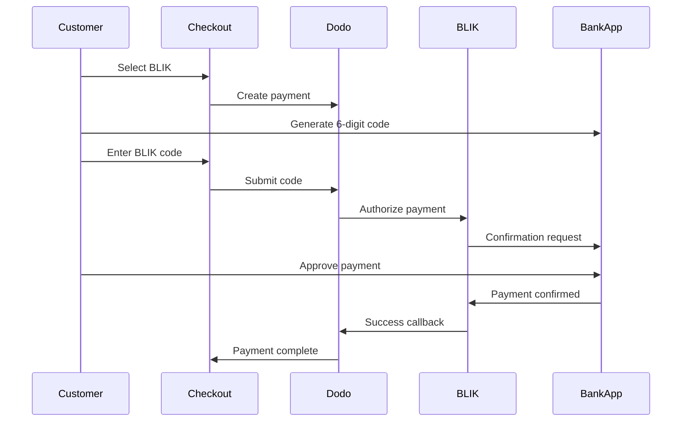

I clienti europei preferiscono fortemente i metodi di pagamento locali che si integrano con i loro sistemi bancari. Offrire questi metodi può aumentare i tassi di conversione dal 20 al 40% nei mercati di riferimento.

## Perché i Metodi di Pagamento Locali Europei?

<CardGroup cols={3}>
<Card title="Higher Conversion" icon="chart-line">
iDEAL cattura ~60% dei pagamenti online olandesi. Non offrirlo significa perdere clienti.
</Card>

<Card title="Lower Fraud" icon="shield-check">
i pagamenti autenticati dalla banca hanno tassi di frode quasi nulli e nessun chargeback.
</Card>

<Card title="Real-Time Settlement" icon="bolt">
La maggior parte dei metodi europei fornisce conferma immediata del pagamento.
</Card>
</CardGroup>

## Metodi Supportati

| Metodo | Paese | Quota di Mercato | Valuta | Abbonamenti |
| :----- | :------ | :-------------- | :----- | :-----------: |
| **iDEAL** | Paesi Bassi | ~60% | EUR | No |
| **Bancontact** | Belgio | ~50% | EUR | No |
| **EPS** | Austria | ~30% | EUR | No |
| **Multibanco** | Portogallo | ~40% | EUR | No |
| **Przelewy24 (P24)** | Polonia | ~30% | PLN | No |
| **BLIK** | Polonia | ~60% | PLN | No |
| **Satispay** | Europa (Italia) | In crescita | EUR | Sì |

## iDEAL (Paesi Bassi)

iDEAL è il metodo di pagamento online dominante nei Paesi Bassi, collegandosi direttamente a tutte le principali banche olandesi.

### Come Funziona



### Banche Supportate

Tutte le principali banche olandesi sono supportate:
- ABN AMRO
- ASN Bank
- Bunq
- ING
- Knab
- Rabobank
- RegioBank
- Revolut
- SNS
- Triodos Bank
- Van Lanschot

### Configurazione

```javascript
const session = await client.checkoutSessions.create({
  product_cart: [{ product_id: 'prod_123', quantity: 1 }],
  allowed_payment_method_types: ['ideal', 'credit', 'debit'],
  billing_currency: 'EUR',
  billing_address: {
    country: 'NL',
    zipcode: '1012JS'
  },
  return_url: 'https://example.com/success'
});
```

## Bancontact (Belgio)

Bancontact è lo schema di pagamento nazionale del Belgio, utilizzato da praticamente tutte le banche belghe per i pagamenti online.

### Caratteristiche
- Funziona con le carte di debito belghe esistenti
- Supporto per app mobile (Payconiq by Bancontact)
- Conferma del pagamento istantanea
- Nessuna registrazione aggiuntiva necessaria per i clienti

### Configurazione

```javascript
const session = await client.checkoutSessions.create({
  product_cart: [{ product_id: 'prod_123', quantity: 1 }],
  allowed_payment_method_types: ['bancontact_card', 'credit', 'debit'],
  billing_currency: 'EUR',
  billing_address: {
    country: 'BE',
    zipcode: '1000'
  },
  return_url: 'https://example.com/success'
});
```

## EPS (Austria)

EPS (Standard di Pagamento Elettronico) consente trasferimenti bancari online diretti per i clienti austriaci.

### Caratteristiche
- Integrazione diretta con le banche austriache
- Conferma del pagamento in tempo reale
- Alta fiducia tra i consumatori austriaci
- Nessun chargeback

### Banche Supportate

Principali banche austriache, tra cui:
- Erste Bank
- Bank Austria
- Raiffeisen
- BAWAG
- Volksbank

### Configurazione

```javascript
const session = await client.checkoutSessions.create({
  product_cart: [{ product_id: 'prod_123', quantity: 1 }],
  allowed_payment_method_types: ['eps', 'credit', 'debit'],
  billing_currency: 'EUR',
  billing_address: {
    country: 'AT',
    zipcode: '1010'
  },
  return_url: 'https://example.com/success'
});
```

## Multibanco (Portogallo)

Multibanco è la rete interbancaria del Portogallo, che offre sia pagamenti online che pagamenti tramite ATM.

### Opzioni di Pagamento

1. **Online Banking** — Trasferimento diretto tramite internet banking
2. **Pagamento ATM** — Il cliente riceve un riferimento per pagare presso qualsiasi ATM Multibanco
3. **Mobile Banking** — Pagamento tramite app bancarie

### Come Funziona il Pagamento ATM

Per i pagamenti ATM, i clienti ricevono un riferimento per il pagamento:

```
Entity: 12345
Reference: 123 456 789
Amount: €50.00
Expiry: 24 hours
```

Il cliente può pagare presso qualsiasi ATM portoghese o tramite online banking utilizzando questo riferimento.

### Configurazione

```javascript
const session = await client.checkoutSessions.create({
  product_cart: [{ product_id: 'prod_123', quantity: 1 }],
  allowed_payment_method_types: ['multibanco', 'credit', 'debit'],
  billing_currency: 'EUR',
  billing_address: {
    country: 'PT',
    zipcode: '1000-001'
  },
  return_url: 'https://example.com/success'
});
```

<Note>
I pagamenti Multibanco presso ATM possono avere un ritardo tra il checkout e il pagamento effettivo. Monitora i webhook per la conferma del pagamento.
</Note>

## Przelewy24 (Polonia)

Przelewy24 (P24) è il principale metodo di pagamento online della Polonia, aggregando bonifici bancari e portafogli locali tra tutte le principali banche polacche. A differenza degli altri metodi europei, Przelewy24 è regolato in **PLN** (Złoty Polacco), non in EUR.

### Come Funziona



### Disponibilità

- **Valuta di fatturazione:** Solo PLN
- **Tipo di transazione:** Solo pagamenti una tantum (non disponibile per abbonamenti)
- **Copertura:** Tutte le principali banche polacche più i portafogli locali popolari

### Configurazione

```javascript
const session = await client.checkoutSessions.create({
  product_cart: [{ product_id: 'prod_123', quantity: 1 }],
  allowed_payment_method_types: ['przelewy24', 'credit', 'debit'],
  billing_currency: 'PLN',
  billing_address: {
    country: 'PL',
    zipcode: '00-001'
  },
  return_url: 'https://example.com/success'
});
```

<Note>
Przelewy24 richiede una valuta di fatturazione in **PLN**. Se citi i tuoi prezzi in EUR, abilita [Adaptive Currency](/features/adaptive-currency) affinché i clienti polacchi siano fatturati in PLN e Przelewy24 diventi disponibile.
</Note>

## BLIK (Polonia)

BLIK è il metodo di pagamento mobile più popolare in Polonia, consentendo ai clienti di pagare utilizzando un codice unico a 6 cifre generato nella loro app bancaria. Come Przelewy24, BLIK regola in **PLN** (Złoty Polacco), non in EUR.

### Come Funziona



### Disponibilità

- **Valuta di fatturazione:** Solo PLN
- **Tipo di transazione:** Solo pagamenti one-time (non disponibile per abbonamenti)
- **Copertura:** Tutte le principali banche polacche che supportano BLIK

### Configurazione

```javascript
const session = await client.checkoutSessions.create({
  product_cart: [{ product_id: 'prod_123', quantity: 1 }],
  allowed_payment_method_types: ['blik', 'credit', 'debit'],
  billing_currency: 'PLN',
  billing_address: {
    country: 'PL',
    zipcode: '00-001'
  },
  return_url: 'https://example.com/success'
});
```

BLIK richiede una valuta di fatturazione in **PLN**. Se quotate i vostri prezzi in EUR, abilitate [Adaptive Currency](/features/adaptive-currency) affinché i clienti polacchi siano fatturati in PLN e BLIK diventi disponibile.

## Satispay (Europa)

Satispay è una rete di pagamenti mobile molto popolare in Europa, in particolare in Italia, che consente ai clienti di pagare direttamente dalla loro app Satispay senza condividere i dettagli della carta o della banca. Satispay regola in **EUR**.

### Caratteristiche

- Pagamenti basati su app indipendenti dalle reti di carta
- Forte adozione in Italia e in crescita in altri mercati europei
- Supporta sia pagamenti one-time che abbonamenti

### Disponibilità

- **Valuta di fatturazione:** EUR
- **Tipo di transazione:** Pagamenti one-time e abbonamenti

### Configurazione

```javascript
const session = await client.checkoutSessions.create({
  product_cart: [{ product_id: 'prod_123', quantity: 1 }],
  allowed_payment_method_types: ['satispay', 'credit', 'debit'],
  billing_currency: 'EUR',
  billing_address: {
    country: 'IT',
    zipcode: '00100'
  },
  return_url: 'https://example.com/success'
});
```

## Tipi di Metodo API

| Tipo | Metodo | Paese |
| :--- | :----- | :---- |
| `ideal` | iDEAL | Paesi Bassi |
| `bancontact_card` | Bancontact | Belgio |
| `eps` | EPS | Austria |
| `multibanco` | Multibanco | Portogallo |
| `przelewy24` | Przelewy24 (P24) | Polonia |
| `blik` | BLIK | Polonia |
| `satispay` | Satispay | Europa (Italia) |

## Checkout Europeo Multi-Paese

Per le aziende che servono più paesi europei, includere tutti i metodi regionali:

```javascript
const session = await client.checkoutSessions.create({
  product_cart: [{ product_id: 'prod_123', quantity: 1 }],
  allowed_payment_method_types: [
    'ideal',           // Netherlands
    'bancontact_card', // Belgium
    'eps',             // Austria
    'multibanco',      // Portugal
    'przelewy24',      // Poland (requires PLN billing currency)
    'blik',            // Poland (requires PLN billing currency)
    'satispay',        // Europe / Italy
    'credit',          // Fallback
    'debit'            // Fallback
  ],
  billing_currency: 'EUR',
  return_url: 'https://example.com/success'
});
```

Dodo mostra automaticamente solo i metodi rilevanti in base alla posizione del cliente. Un cliente olandese vedrà iDEAL; un cliente belga vedrà Bancontact.

## Testing

I metodi di pagamento europei possono essere testati in modalità sandbox. Il flusso di test simula il processo di autenticazione bancaria.

Usate le vostre chiavi API di test Dodo Payments.

Impostare il paese dell'indirizzo di fatturazione per corrispondere al metodo di pagamento:
- `NL` per iDEAL
- `BE` per Bancontact
- `AT` per EPS
- `PT` per Multibanco
- `PL` per Przelewy24 e BLIK (con valuta di fatturazione PLN)
- `IT` per Satispay

Seguite il flusso di autenticazione bancaria simulato nell'ambiente di test.

## Migliori Pratiche

Se vendete a clienti olandesi, includete iDEAL. Non farlo è come non accettare Visa negli Stati Uniti — perderete vendite significative.

La maggior parte dei metodi di pagamento europei richiede EUR — assicuratevi che la vostra strategia di pricing supporti le transazioni in Euro. L'unica eccezione è Przelewy24, che è offerto solo con fatturazione in **PLN** (Złoty Polacco).

Tutti i metodi europei comportano reindirizzamenti a siti bancari. Assicuratevi che la gestione dell'URL di ritorno sia robusta e consideri gli utenti che abbandonano a metà flusso.

Non tutti i clienti europei hanno accesso a questi metodi regionali (turisti, espatriati, ecc.). Includete sempre `credit` e `debit` come soluzioni di ripiego.

I pagamenti Bancomat Multibanco possono richiedere ore per essere completati. Non bloccate l'adempimento sul pagamento immediato — utilizzate webhook per la conferma asincrona.

## Risoluzione Problemi

**Verifica:**
1. Il paese di fatturazione del cliente corrisponde al paese del metodo?
2. La valuta è impostata su EUR?
3. Il metodo è incluso in `allowed_payment_method_types`?

**Soluzione:** I metodi europei sono strettamente regionali. Un cliente con paese di fatturazione `DE` (Germania) non vedrà iDEAL, che è solo per i Paesi Bassi.

**Cause:**
- Il cliente ha annullato durante l'autenticazione bancaria
- Sistema di autenticazione della banca temporaneamente non disponibile
- Il cliente ha inserito credenziali errate

**Soluzione:** Il cliente dovrebbe riprovare. Se il problema persiste, suggerire di provare un metodo di pagamento diverso.

**Cause:**
- Il cliente ha chiuso il browser durante il reindirizzamento bancario
- Problemi di rete durante l'autenticazione
- URL di ritorno mal configurato

**Soluzione:** Verificate che l'URL di ritorno sia corretto e accessibile. Assicuratevi che gestisca sia gli stati di successo che di fallimento.

**Causa:** Il cliente ha ricevuto il riferimento del pagamento ma non ha ancora pagato.

**Soluzione:** Questo è previsto per i pagamenti basati su Bancomat. Attendete la conferma del webhook. Il riferimento solitamente scade in 24-72 ore.

## Conformità PSD2

Tutti i metodi di pagamento europei sono conformi alle normative PSD2 (Direttiva sui Servizi di Pagamento 2):

- **Autenticazione Forte del Cliente (SCA)** — Parte integrante del flusso di autenticazione bancaria
- **Comunicazione Sicura** — Tutti i dati sono trasmessi tramite canali sicuri
- **Protezione dei Consumatori** — Piena conformità con i diritti dei consumatori dell'UE

## Pagine Correlate

Vedi tutti i metodi di pagamento supportati.

Supporto valutario e conversione automatica.

Guida completa all'implementazione del checkout.

Gestire le conferme di pagamento in modo asincrono.