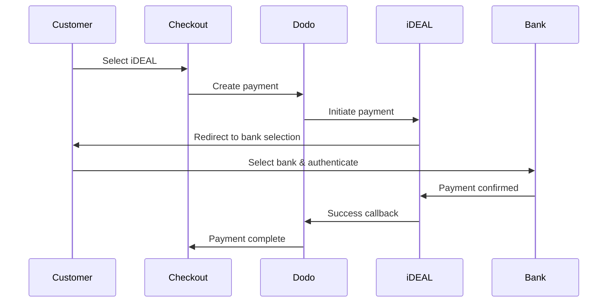
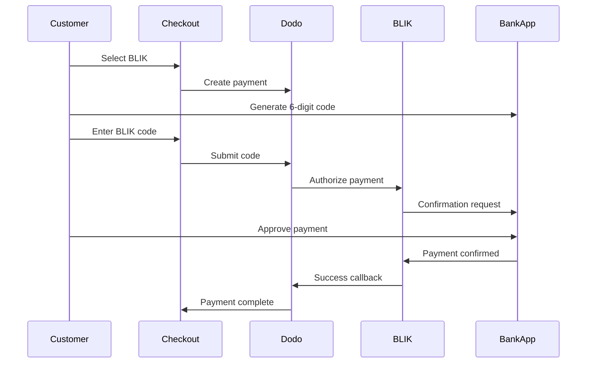

European customers strongly prefer local payment methods that integrate with their banking systems. Offering these methods can increase conversion rates by 20-40% in target markets.

## Why Local European Payment Methods?

<CardGroup cols={3}>
<Card title="Higher Conversion" icon="chart-line">
iDEAL captures ~60% of Dutch online payments. Not offering it means losing customers.
</Card>

<Card title="Lower Fraud" icon="shield-check">
Bank-authenticated payments have near-zero fraud rates and no chargebacks.
</Card>

<Card title="Real-Time Settlement" icon="bolt">
Most European methods provide instant payment confirmation.
</Card>
</CardGroup>

## Supported Methods

| Metodo | Paese | Quota di mercato | Valuta | Abbonamenti |
| :----- | :------ | :----------- | :------- | :-----------: |
| **iDEAL** | Paesi Bassi | ~60% | EUR | No |
| **Bancontact** | Belgio | ~50% | EUR | No |
| **EPS** | Austria | ~30% | EUR | No |
| **Multibanco** | Portogallo | ~40% | EUR | No |
| **BLIK** | Polonia | ~60% | PLN | No |
| **SEPA Direct Debit** | Eurozona | Ampiamente utilizzato | EUR | No |
| **Satispay** | Europa (Italia) | In crescita | EUR | Sì |

## iDEAL (Netherlands)

iDEAL is the dominant online payment method in the Netherlands, connecting directly to all major Dutch banks.

### How It Works



### Supported Banks

All major Dutch banks are supported:
- ABN AMRO
- ASN Bank
- Bunq
- ING
- Knab
- Rabobank
- RegioBank
- Revolut
- SNS
- Triodos Bank
- Van Lanschot

### Configuration

```javascript
const session = await client.checkoutSessions.create({
  product_cart: [{ product_id: 'pdt_123', quantity: 1 }],
  allowed_payment_method_types: ['ideal', 'credit', 'debit'],
  billing_currency: 'EUR',
  billing_address: {
    country: 'NL',
    zipcode: '1012JS'
  },
  return_url: 'https://example.com/success'
});
```

## Bancontact (Belgium)

Bancontact is Belgium's national payment scheme, used by virtually all Belgian banks for online payments.

### Features
- Works with existing Belgian debit cards
- Mobile app support (Payconiq by Bancontact)
- Instant payment confirmation
- No additional registration needed for customers

### Configuration

```javascript
const session = await client.checkoutSessions.create({
  product_cart: [{ product_id: 'pdt_123', quantity: 1 }],
  allowed_payment_method_types: ['bancontact_card', 'credit', 'debit'],
  billing_currency: 'EUR',
  billing_address: {
    country: 'BE',
    zipcode: '1000'
  },
  return_url: 'https://example.com/success'
});
```

## EPS (Austria)

EPS (Electronic Payment Standard) enables direct online bank transfers for Austrian customers.

### Features
- Direct integration with Austrian banks
- Real-time payment confirmation
- High trust among Austrian consumers
- No chargebacks

### Supported Banks

Major Austrian banks including:
- Erste Bank
- Bank Austria
- Raiffeisen
- BAWAG
- Volksbank

### Configuration

```javascript
const session = await client.checkoutSessions.create({
  product_cart: [{ product_id: 'pdt_123', quantity: 1 }],
  allowed_payment_method_types: ['eps', 'credit', 'debit'],
  billing_currency: 'EUR',
  billing_address: {
    country: 'AT',
    zipcode: '1010'
  },
  return_url: 'https://example.com/success'
});
```

## Multibanco (Portugal)

Multibanco is Portugal's interbank network, offering both online payments and ATM-based payments.

### Payment Options

1. **Online Banking** — Direct bank transfer via internet banking
2. **ATM Payment** — Customer receives a reference to pay at any Multibanco ATM
3. **Mobile Banking** — Payment via bank mobile apps

### How ATM Payment Works

For ATM payments, customers receive a payment reference:

```
Entity: 12345
Reference: 123 456 789
Amount: €50.00
Expiry: 24 hours
```

Customer can pay at any Portuguese ATM or via online banking using this reference.

### Configuration

```javascript
const session = await client.checkoutSessions.create({
  product_cart: [{ product_id: 'pdt_123', quantity: 1 }],
  allowed_payment_method_types: ['multibanco', 'credit', 'debit'],
  billing_currency: 'EUR',
  billing_address: {
    country: 'PT',
    zipcode: '1000-001'
  },
  return_url: 'https://example.com/success'
});
```

<Note>
Multibanco ATM payments may have a delay between checkout and actual payment. Monitor webhooks for payment confirmation.
</Note>

## BLIK (Polonia)

BLIK è il metodo di pagamento mobile più popolare in Polonia e consente ai clienti di pagare utilizzando un codice monouso di 6 cifre generato nell'app della propria banca. BLIK effettua il settlement in **PLN** (złoty polacco), non in EUR.

### How It Works



### Availability

- **Valuta di addebito:** solo PLN
- **Tipo di transazione:** solo pagamenti una tantum (non disponibile per gli abbonamenti)
- **Copertura:** tutte le principali banche polacche che supportano BLIK

### Configuration

```javascript
const session = await client.checkoutSessions.create({
  product_cart: [{ product_id: 'pdt_123', quantity: 1 }],
  allowed_payment_method_types: ['blik', 'credit', 'debit'],
  billing_currency: 'PLN',
  billing_address: {
    country: 'PL',
    zipcode: '00-001'
  },
  return_url: 'https://example.com/success'
});
```

<Note>
BLIK richiede una valuta di addebito in **PLN**. Se indichi i prezzi in EUR, abilita [Adaptive Currency](/features/adaptive-currency) in modo che ai clienti polacchi venga addebitato l'importo in PLN e BLIK diventi disponibile.
</Note>

## SEPA Direct Debit (Eurozona)

SEPA Direct Debit consente ai clienti in tutta l'Eurozona di pagare direttamente dal proprio conto bancario invece di utilizzare una carta. È disponibile nei checkout in EUR per i pagamenti una tantum.

### How It Works

Il cliente autorizza l'addebito durante il checkout e il pagamento viene riscosso dal suo conto bancario. A differenza della maggior parte dei metodi europei presenti in questa pagina, la conferma non è immediata.

<Warning>
SEPA Direct Debit non è istantaneo. La conferma di un pagamento richiede **6 giorni lavorativi**, quindi non considerare l'autorizzazione come settlement: completa l'evasione solo quando il pagamento raggiunge lo stato succeeded.
</Warning>

### Disponibilità

- **Valuta di addebito:** EUR
- **Tipo di transazione:** solo pagamenti una tantum (non disponibile per gli abbonamenti)

### Configurazione

```javascript
const session = await client.checkoutSessions.create({
  product_cart: [{ product_id: 'pdt_123', quantity: 1 }],
  allowed_payment_method_types: ['sepa', 'credit', 'debit'],
  billing_currency: 'EUR',
  billing_address: {
    country: 'DE',
    zipcode: '10115'
  },
  return_url: 'https://example.com/success'
});
```

### IBAN di test SEPA

In modalità test, inserisci uno degli IBAN riportati di seguito nel checkout per forzare un risultato specifico.

| IBAN di test | Comportamento |
| :-------- | :------- |
| `DE89370400440532013000` | Il pagamento va a buon fine. |
| `DE08370400440532013003` | Il pagamento va a buon fine dopo un ritardo di almeno tre minuti. |
| `DE62370400440532013001` | Il pagamento non va a buon fine. |
| `DE78370400440532013004` | Il pagamento non va a buon fine dopo un ritardo di almeno tre minuti. |
| `DE35370400440532013002` | Il pagamento va a buon fine e viene contestato immediatamente. |
| `DE65370400440002222227` | Il pagamento non va a buon fine per fondi insufficienti. |
| `DE18370400440000066666` | Il conto bancario non è utilizzabile, quindi non è possibile creare il metodo di pagamento. |

Per testare il comportamento specifico di un Paese, utilizza l'IBAN di successo equivalente per un altro Paese dell'Eurozona:

| Paese | IBAN di successo |
| :------ | :----------- |
| Austria | `AT611904300234573201` |
| Belgio | `BE62510007547061` |
| Estonia | `EE382200221020145685` |
| Finlandia | `FI2112345600000785` |
| Francia | `FR1420041010050500013M02606` |
| Irlanda | `IE29AIBK93115212345678` |
| Lussemburgo | `LU280019400644750000` |

<Note>
Gli IBAN di test con ritardo sono utili per verificare che sia il tuo webhook handler, e non il reindirizzamento del checkout, a concedere l'accesso, poiché i pagamenti SEPA vengono confermati molto tempo dopo che il cliente ha lasciato il checkout.
</Note>

## Satispay (Europa)

Satispay è una popolare rete europea di pagamenti mobile, particolarmente diffusa in Italia, che consente ai clienti di pagare direttamente dalla propria app Satispay senza condividere i dati della carta o del conto bancario. Satispay effettua il settlement in **EUR**.

### Funzionalità

- Pagamenti basati sull'app e indipendenti dai circuiti delle carte
- Forte diffusione in Italia e crescita in altri mercati europei
- Supporta sia i pagamenti una tantum sia gli abbonamenti

### Disponibilità

- **Valuta di addebito:** EUR
- **Tipo di transazione:** pagamenti una tantum e abbonamenti

### Configurazione

```javascript
const session = await client.checkoutSessions.create({
  product_cart: [{ product_id: 'pdt_123', quantity: 1 }],
  allowed_payment_method_types: ['satispay', 'credit', 'debit'],
  billing_currency: 'EUR',
  billing_address: {
    country: 'IT',
    zipcode: '00100'
  },
  return_url: 'https://example.com/success'
});
```

## Tipi di metodo API

| Tipo | Metodo | Paese |
| :--- | :----- | :------ |
| `ideal` | iDEAL | Paesi Bassi |
| `bancontact_card` | Bancontact | Belgio |
| `eps` | EPS | Austria |
| `multibanco` | Multibanco | Portogallo |
| `blik` | BLIK | Polonia |
| `sepa` | SEPA Direct Debit | Eurozona |
| `satispay` | Satispay | Europa (Italia) |

## Checkout europeo multi-Paese

Per le attività che servono più Paesi europei, includi tutti i metodi regionali:

```javascript
const session = await client.checkoutSessions.create({
  product_cart: [{ product_id: 'pdt_123', quantity: 1 }],
  allowed_payment_method_types: [
    'ideal',           // Netherlands
    'bancontact_card', // Belgium
    'eps',             // Austria
    'multibanco',      // Portugal
    'blik',            // Poland (requires PLN billing currency)
    'sepa',            // Eurozone (one-time payments only)
    'satispay',        // Europe / Italy
    'credit',          // Fallback
    'debit'            // Fallback
  ],
  billing_currency: 'EUR',
  return_url: 'https://example.com/success'
});
```

Dodo mostra automaticamente solo i metodi pertinenti in base alla posizione del cliente. Un cliente olandese vedrà iDEAL; un cliente belga vedrà Bancontact.

## Testing

I metodi di pagamento europei possono essere testati in Test Mode. Il flusso di test simula il processo di autenticazione bancaria.

<Note>
SEPA Direct Debit viene testato in modo diverso: invece di un flusso bancario simulato, inserisci direttamente un IBAN di test. Consulta [IBAN di test SEPA](#sepa-test-ibans).
</Note>

<Steps>
<Step title="Enable test mode">
Utilizza le tue chiavi API di test di Dodo Payments.
</Step>

<Step title="Set appropriate billing address">
Imposta il Paese dell'indirizzo di fatturazione in modo che corrisponda al metodo di pagamento:
- `NL` per iDEAL
- `BE` per Bancontact
- `AT` per EPS
- `PT` per Multibanco
- `PL` per BLIK (con valuta di addebito PLN)
- `IT` per Satispay
</Step>

<Step title="Complete the test flow">
Segui il flusso di autenticazione bancaria simulato nell'ambiente di test.
</Step>
</Steps>

## Best practice

<AccordionGroup>
<Accordion title="Always include regional methods for target markets">
Se vendi a clienti olandesi, includi iDEAL. Non farlo equivale a non accettare Visa negli Stati Uniti: perderai una quota significativa delle vendite.
</Accordion>

<Accordion title="Match currency to region">
La maggior parte dei metodi di pagamento europei richiede EUR: assicurati che i tuoi prezzi supportino le transazioni in euro. L'unica eccezione è BLIK, disponibile solo con addebito in **PLN** (złoty polacco).
</Accordion>

<Accordion title="Handle redirects gracefully">
Tutti i metodi europei prevedono reindirizzamenti ai siti delle banche. Assicurati che la gestione del return URL sia affidabile e tenga conto degli utenti che abbandonano il flusso a metà.
</Accordion>

<Accordion title="Provide card fallbacks">
Non tutti i clienti europei hanno accesso a questi metodi regionali (turisti, expat e così via). Includi sempre `credit` e `debit` come alternative.
</Accordion>

<Accordion title="Consider Multibanco timing">
I pagamenti ATM Multibanco possono richiedere ore per essere completati. Non bloccare l'evasione in attesa del pagamento immediato: utilizza i webhook per la conferma asincrona.
</Accordion>
</AccordionGroup>

## Risoluzione dei problemi

<AccordionGroup>
<Accordion title="European method not appearing">
**Verifica:**
1. Il Paese di fatturazione del cliente corrisponde al Paese del metodo?
2. La valuta è impostata su EUR?
3. Il metodo è incluso in `allowed_payment_method_types`?

**Soluzione:** i metodi europei sono strettamente regionali. Un cliente con Paese di fatturazione `DE` (Germania) non vedrà iDEAL, disponibile solo nei Paesi Bassi.
</Accordion>

<Accordion title="Bank authentication failed">
**Cause:**
- Il cliente ha annullato il processo durante l'autenticazione bancaria
- Il sistema di autenticazione della banca è temporaneamente non disponibile
- Il cliente ha inserito credenziali errate

**Soluzione:** il cliente deve riprovare. Se il problema persiste, suggerisci di provare un metodo di pagamento diverso.
</Accordion>

<Accordion title="Redirect not completing">
**Cause:**
- Il cliente ha chiuso il browser durante il reindirizzamento alla banca
- Problemi di rete durante l'autenticazione
- Return URL configurato in modo errato

**Soluzione:** verifica che il return URL sia corretto e accessibile. Assicurati che gestisca sia gli stati di successo sia quelli di errore.
</Accordion>

<Accordion title="Multibanco payment pending">
**Causa:** il cliente ha ricevuto il riferimento del pagamento, ma non ha ancora pagato.

**Soluzione:** questo comportamento è previsto per i pagamenti basati su ATM. Attendi la conferma tramite webhook. Il riferimento scade generalmente dopo 24-72 ore.
</Accordion>
</AccordionGroup>

## Conformità PSD2

Tutti i metodi di pagamento europei sono conformi alle normative PSD2 (Payment Services Directive 2):

- **Strong Customer Authentication (SCA)** — Integrata nel flusso di autenticazione bancaria
- **Comunicazione sicura** — Tutti i dati vengono trasmessi tramite canali sicuri
- **Protezione dei consumatori** — Piena conformità ai diritti dei consumatori dell'UE

## Pagine correlate

<CardGroup cols={2}>
<Card title="Payment Methods Overview" icon="credit-card" href="/features/payment-methods">
Visualizza tutti i metodi di pagamento supportati.
</Card>

<Card title="Adaptive Currency" icon="globe" href="/features/adaptive-currency">
Supporto delle valute e conversione automatica.
</Card>

<Card title="Checkout Guide" icon="book" href="/developer-resources/checkout-session">
Guida completa all'implementazione del checkout.
</Card>

<Card title="Webhooks" icon="webhook" href="/developer-resources/webhooks">
Gestisci le conferme dei pagamenti in modo asincrono.
</Card>
</CardGroup>