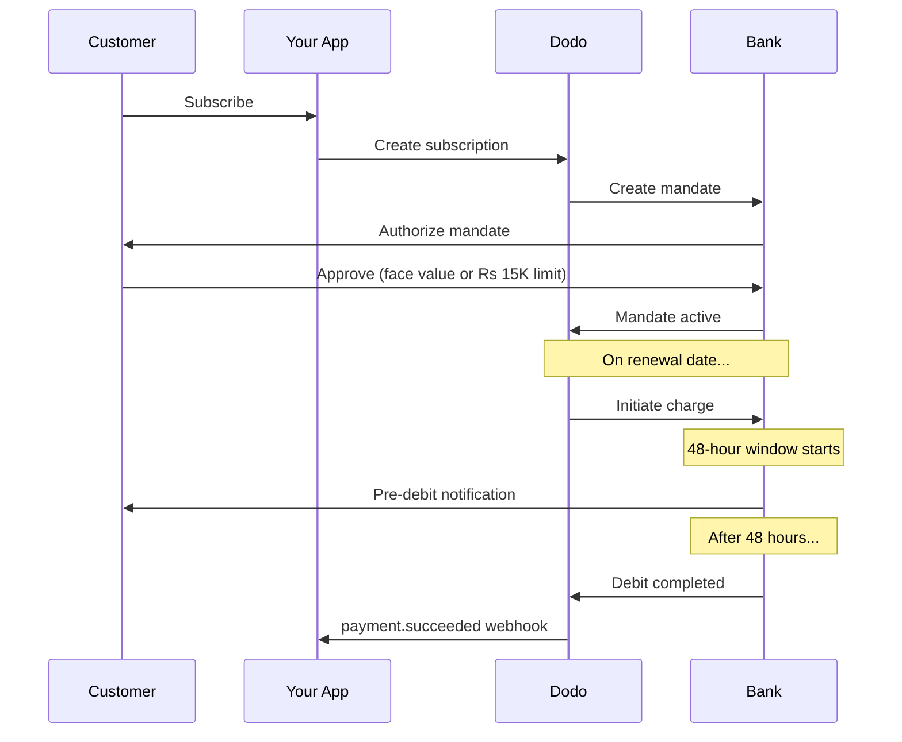

L'India dispone di un'infrastruttura di pagamento unica, dominata da UPI (oltre il 60% delle transazioni digitali) e dalle carte emesse in India (Visa, Mastercard, Rupay, ecc.). Dodo Payments supporta tutti questi metodi con piena conformità RBI per i mandati degli abbonamenti.

## Perché i metodi di pagamento in India sono importanti

<CardGroup cols={3}>
<Card title="UPI Dominance" icon="mobile">
UPI elabora oltre 10 miliardi di transazioni al mese. Molti clienti indiani non dispongono di carte internazionali.
</Card>

<Card title="Low Transaction Costs" icon="indian-rupee-sign">
UPI ha commissioni di transazione quasi nulle. È eccellente per transazioni ad alto volume e di valore inferiore.
</Card>

<Card title="Subscription Support" icon="repeat">
A differenza della maggior parte dei metodi di pagamento alternativi, UPI e tutte le carte emesse in India (Visa, Mastercard, Rupay, ecc.) supportano i pagamenti ricorrenti tramite mandati RBI.
</Card>
</CardGroup>

## Metodi supportati

| Metodo | Tipo | Abbonamenti | Importo minimo |
| :----- | :--- | :-----------: | :--------- |
| **UPI Collect** | Codice QR / VPA | Sì* | ₹1 |
| **Rupay Credit** | Carta | Sì* | ₹1 |
| **Rupay Debit** | Carta | Sì* | ₹1 |

*Gli abbonamenti richiedono mandati conformi alle normative RBI con regole di elaborazione specifiche. Il ritardo di elaborazione di 48 ore si applica a tutte le carte emesse in India e a UPI.

## Configurazione

### Tipi di metodi API

| Tipo | Descrizione |
| :--- | :---------- |
| `upi_collect` | UPI tramite codice QR o inserimento VPA |
| `credit` | Carte di credito, incluse le carte Rupay |
| `debit` | Carte di debito, incluse le carte Rupay |

### Esempio: checkout incentrato sull'India

```javascript
const session = await client.checkoutSessions.create({
  product_cart: [{ product_id: 'prod_123', quantity: 1 }],
  allowed_payment_method_types: [
    'upi_collect',
    'credit',
    'debit'
  ],
  billing_currency: 'INR',
  customer: {
    email: 'customer@example.in',
    name: 'Priya Sharma',
    phone_number: '+919876543210'
  },
  billing_address: {
    country: 'IN',
    zipcode: '560001'
  },
  return_url: 'https://example.com/success'
});
```

### Requisiti per UPI

Affinché UPI venga visualizzato al checkout:
1. Il **paese di fatturazione** deve essere l'India (`IN`)
2. La **valuta** deve essere INR
3. Per i merchant non indiani: **Adaptive Currency** deve essere abilitato

<Warning>
Se sei un merchant non indiano e Adaptive Currency non è abilitato, UPI non sarà disponibile per i tuoi clienti.
</Warning>

## Abbonamenti con mandati RBI

Gli abbonamenti con metodi di pagamento indiani sono soggetti alle normative RBI (Reserve Bank of India) e a requisiti specifici.

### Come funzionano i mandati RBI



### Tipi di mandato

| Importo dell'abbonamento | Tipo di mandato | Limite |
| :------------------ | :----------- | :---- |
| **Inferiore alla soglia del mandato** | Mandato on-demand | Soglia del mandato (₹15.000 per impostazione predefinita) |
| **Uguale o superiore alla soglia del mandato** | Mandato di importo fisso | Importo esatto dell'abbonamento |

L'importo registrato presso la banca del cliente è `max(mandate_floor, billing_amount)`. Pertanto, la soglia rappresenta effettivamente il **massimale di autorizzazione** visibile al cliente quando la fatturazione è inferiore alla soglia.

**Importante per le modifiche al piano:** se un upgrade genera un addebito superiore al limite del mandato esistente, l'addebito non andrà a buon fine e il cliente dovrà autorizzarlo nuovamente.

### Soglia del mandato configurabile

La soglia del mandato per gli e-mandate INR è configurabile tramite il campo `mandate_min_amount_inr_paise` (in **paise INR** — 1 INR = 100 paise). Puoi sostituire il valore predefinito di sistema di ₹15.000 a tre livelli:

| Livello | Dove impostarlo | Ambito |
|-------|--------------|-------|
| **Per richiesta** | `mandate_min_amount_inr_paise` in una sessione di checkout, un pagamento o un abbonamento | Una transazione |
| **Merchant** | Impostazioni dell'attività | Tutti i tuoi abbonamenti INR |
| **Sistema** | — | Predefinito: ₹15.000 |

Priorità di risoluzione: sostituzione per richiesta → impostazione del merchant → valore predefinito di sistema.

```typescript
// Per-checkout override
const session = await client.checkoutSessions.create({
  product_cart: [{ product_id: 'prod_inr_monthly', quantity: 1 }],
  mandate_min_amount_inr_paise: 2_000_000, // ₹20,000 ceiling
  return_url: 'https://yoursite.com/return'
});

// Per-subscription override
const subscription = await client.subscriptions.create({
  product_id: 'prod_inr_monthly',
  customer: { email: 'customer@example.in' },
  billing: { country: 'IN', /* ... */ },
  mandate_min_amount_inr_paise: 2_000_000
});
```

| Campo | Tipo | Convalida | Si applica a |
|-------|------|------------|------------|
| `mandate_min_amount_inr_paise` | `integer` (paise INR) | `>= 1` | Abbonamenti INR con carte indiane su connettori non Airwallex |

<Info>
Impostare una soglia più alta consente di supportare in seguito addebiti una tantum più elevati (ad esempio upgrade del piano o eccedenze basate sull'utilizzo) senza costringere i clienti a una nuova autorizzazione. Una soglia più bassa avvicina l'autorizzazione del cliente all'importo effettivamente fatturato, ma riduce il margine disponibile per futuri addebiti variabili.
</Info>

<Warning>
Questa impostazione influisce solo sugli e-mandate registrati per carte emesse in India (Visa, Mastercard, RuPay) con abbonamenti INR. Gli abbonamenti UPI seguono il proprio flusso AutoPay e non sono interessati.
</Warning>

### Il ritardo di elaborazione di 48 ore

Questa è la differenza più importante rispetto ai pagamenti con carte internazionali:

<Steps>
<Step title="Charge Initiated (Day 0)">
Alla data di rinnovo programmata, Dodo avvia l'addebito presso la banca.
</Step>

<Step title="Pre-Debit Notification">
Il cliente riceve una notifica dalla propria banca relativa all'addebito imminente.
</Step>

<Step title="48-Hour Window">
Durante questo periodo il cliente può annullare il mandato tramite la propria app bancaria.
</Step>

<Step title="Debit Completed (~48-51 hours)">
Dopo 48 ore (più un massimo di 3 ore aggiuntive per l'elaborazione bancaria), i fondi vengono addebitati.
</Step>

<Step title="Webhook Sent">
Il webhook `payment.succeeded` viene inviato dopo l'addebito effettivo, non al momento dell'avvio.
</Step>
</Steps>

<Warning>
**Non concedere i vantaggi al momento dell'avvio dell'addebito.** Attendi il webhook `payment.succeeded`, che arriva circa 48-51 ore dopo la data programmata dell'addebito.
</Warning>

### Gestione della finestra di 48 ore

```javascript
// DON'T do this:
async function handleSubscriptionRenewal(subscription) {
  // ❌ Bad: Granting access immediately when charge is initiated
  grantPremiumAccess(subscription.customer_id);
}

// DO this:
async function handlePaymentWebhook(event) {
  if (event.type === 'payment.succeeded') {
    // ✅ Good: Only grant access after payment is confirmed
    grantPremiumAccess(event.data.customer_id);
  }
  
  if (event.type === 'payment.failed') {
    // Handle failed payment (mandate cancelled, insufficient funds)
    revokePremiumAccess(event.data.customer_id);
  }
}
```

### Eventi webhook per gli abbonamenti indiani

| Evento | Quando | Azione |
| :---- | :--- | :----- |
| `subscription.active` | Mandato autorizzato | Registra l'inizio dell'abbonamento |
| `payment.succeeded` | Circa 48 ore dopo la data dell'addebito | Concedi/mantieni l'accesso |
| `payment.failed` | Addebito non riuscito | Informa il cliente, sospendi l'accesso |
| `subscription.on_hold` | Pagamento non riuscito | Richiedi l'aggiornamento del metodo di pagamento |
| `subscription.active` | Riattivato dopo il pagamento | Ripristina l'accesso |

## Test

### ID di test UPI

| Stato | ID UPI |
| :----- | :----- |
| Riuscito | `success@upi` |
| Non riuscito | `failure@upi` |

### Numeri di test delle carte indiane

| Brand | Scenario | Numero della carta | Scadenza | CVV |
| :---- | :------- | :---------- | :----- | :-- |
| Visa | Riuscito | `4576238912771450` | 06/32 | 123 |
| Visa | Rifiutato | `4706131211212123` | 06/32 | 123 |
| Mastercard | Riuscito | `5409162669381034` | 06/32 | 123 |
| Mastercard | Rifiutato | `5105105105105100` | 06/32 | 123 |

## Best practice

<AccordionGroup>
<Accordion title="Plan for the 48-hour delay">
Progetta la tua applicazione per gestire l'intervallo tra l'avvio dell'addebito e il pagamento effettivo. Considera:
- Periodi di tolleranza per l'accesso agli abbonamenti
- Comunicazioni chiare ai clienti sui tempi di elaborazione
- Evasione guidata dai webhook, non dalle date
</Accordion>

<Accordion title="Handle mandate cancellations">
I clienti possono annullare i mandati tramite le app bancarie in qualsiasi momento. Monitora i webhook `subscription.on_hold` e invita i clienti a sottoscrivere nuovamente l'abbonamento o ad aggiornare i metodi di pagamento.
</Accordion>

<Accordion title="Set appropriate mandate amounts">
Per i prezzi variabili (ad esempio, basati sull'utilizzo), valuta se un mandato on-demand di 15.000 Rs sia sufficiente. Se gli addebiti potrebbero superare questo importo, i clienti dovranno autorizzare nuovamente il mandato.
</Accordion>

<Accordion title="Offer UPI prominently">
Per i clienti indiani, UPI dovrebbe essere l'opzione di pagamento principale. Molti utenti lo preferiscono alle carte per la familiarità e la maggiore semplicità.
</Accordion>
</AccordionGroup>

## Risoluzione dei problemi

<AccordionGroup>
<Accordion title="UPI not appearing at checkout">
**Verifica:**
1. Il paese di fatturazione è impostato su `IN`?
2. La valuta è impostata su `INR`?
3. Se il merchant non è indiano: Adaptive Currency è abilitato?
4. `upi_collect` è incluso in `allowed_payment_method_types`?

**Soluzione:** verifica che l'indirizzo di fatturazione contenga `country: "IN"` e `billing_currency: "INR"`.
</Accordion>

<Accordion title="Subscription charge failed after upgrade">
**Causa:** il nuovo importo dell'addebito supera il limite del mandato esistente (soglia di 15.000 Rs).

**Soluzione:** il cliente deve aggiornare il metodo di pagamento per stabilire un nuovo mandato con il limite corretto.
</Accordion>

<Accordion title="Subscription on hold but customer claims they didn't cancel">
**Causa:** il cliente potrebbe aver annullato il mandato durante la finestra di 48 ore oppure la banca potrebbe aver rifiutato l'addebito.

**Soluzione:** il cliente deve autorizzare nuovamente il mandato o aggiornare il metodo di pagamento.
</Accordion>

<Accordion title="Payment deduction delayed beyond 48 hours">
**Causa:** i ritardi dell'API bancaria possono prolungare l'elaborazione di altre 2-3 ore.

**Soluzione:** è un comportamento previsto. Progetta il sistema per gestire ritardi variabili fino a circa 51 ore complessive.
</Accordion>

<Accordion title="Mandate cancelled but subscription still active">
**Causa:** caso limite nelle normative RBI: l'annullamento del mandato durante la finestra di elaborazione non annulla immediatamente l'abbonamento.

**Soluzione:** il prossimo addebito non andrà a buon fine e l'abbonamento passerà a `on_hold`. Monitora i webhook per `payment.failed`.
</Accordion>
</AccordionGroup>

## Pagine correlate

<CardGroup cols={2}>
<Card title="Payment Methods Overview" icon="credit-card" href="/features/payment-methods">
Visualizza tutti i metodi di pagamento supportati.
</Card>

<Card title="Subscriptions" icon="repeat" href="/features/subscription">
Documentazione completa sugli abbonamenti, inclusi i mandati RBI.
</Card>

<Card title="Webhooks" icon="webhook" href="/developer-resources/webhooks">
Gestione dei webhook per gli eventi di pagamento.
</Card>

<Card title="Testing Process" icon="flask" href="/miscellaneous/testing-process">
Tutti i dati di test, inclusi gli ID UPI e le carte indiane.
</Card>
</CardGroup>