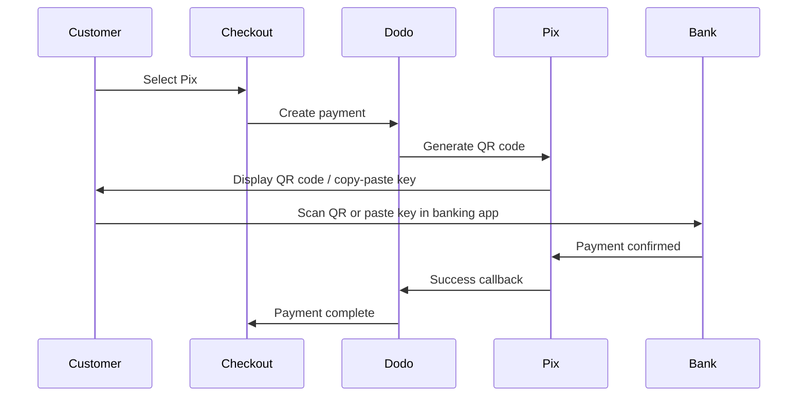

Pix è il sistema di pagamento istantaneo del Brasile creato dalla Banca Centrale del Brasile (Banco Central do Brasil). Consente trasferimenti in tempo reale 24 ore su 24, 7 giorni su 7, inclusi weekend e festivi, ed è diventato il metodo di pagamento più popolare in Brasile.

## Perché Offrire Pix?

Pix è il metodo di pagamento più utilizzato in Brasile, superando carte di credito e boleto.

I pagamenti si confermano in pochi secondi, 24/7/365 — nessuna attesa per finestre di elaborazione bancaria.

I clienti pagano tramite QR code o chiave copia-incolla — nessun numero di carta o dettagli bancari richiesti.

## Panoramica

| Dettaglio | Valore |
| :----- | :---- |
| **Valuta di Fatturazione** | BRL |
| **Paesi Supportati** | Brasile |
| **Abbonamenti** | No |
| **Importo Minimo** | $0.50 |
| **Regolamento** | Immediato |

## Come Funziona



## Esperienza del Cliente

1. Il cliente seleziona Pix al momento del checkout
2. Viene visualizzato un QR code e una chiave copia-incolla
3. Il cliente apre la sua app bancaria e scansiona il QR code o incolla la chiave
4. Il pagamento si conferma istantaneamente
5. Il cliente viene reindirizzato alla pagina di successo

I QR code Pix in genere scadono dopo un periodo impostato. Se il cliente non completa il pagamento in tempo, deve ricominciare il checkout.

## Configurazione

```javascript
const session = await client.checkoutSessions.create({
  product_cart: [{ product_id: 'prod_123', quantity: 1 }],
  allowed_payment_method_types: ['pix', 'credit', 'debit'],
  billing_currency: 'BRL',
  return_url: 'https://example.com/success'
});
```

## Tipo di Metodo API

| Tipo | Metodo | Paese |
| :--- | :----- | :------ |
| `pix` | Pix | Brasile |

## Test

Usa le tue chiavi API di test di Dodo Payments.

Assicurati che la valuta di fatturazione sia impostata su `BRL` nella tua richiesta di checkout.

Quando richiesto un CPF Pix, inserisci `1234567890`. Verrà generato un QR code di test — scansiona con la fotocamera del telefono normale (non serve l'app Pix). Verrai reindirizzato a una pagina di test Stripe dove puoi simulare la transazione come successo o fallimento.

## Migliori Pratiche

Pix funziona solo con BRL. Assicurati che i tuoi prezzi supportino transazioni in Real brasiliani per il mercato brasiliano.

Non tutti i clienti brasiliani potrebbero preferire Pix. Includi sempre `credit` e `debit` come opzioni di riserva.

I QR code Pix scadono dopo un periodo impostato. Assicurati che il tuo checkout gestisca la scadenza in modo elegante e consenta ai clienti di rigenerare il codice.

## Risoluzione dei Problemi

**Verifica:**
1. La valuta di fatturazione è impostata su `BRL`?
2. `pix` inclusa in `allowed_payment_method_types`?
3. Il paese di fatturazione del cliente è il Brasile?

**Soluzione:** Pix è disponibile solo per transazioni in BRL. Verifica la valuta e l'indirizzo di fatturazione nella tua richiesta API.

**Causa:** Il cliente non ha completato il pagamento entro il termine di scadenza.

**Soluzione:** Il cliente deve ricominciare il checkout per generare un nuovo QR code.

**Causa:** I pagamenti Pix si confermano istantaneamente nella maggior parte dei casi, ma possono verificarsi occasionali ritardi da parte delle banche.

**Soluzione:** Monitora i webhook per la conferma del pagamento. Se il pagamento non si conferma entro pochi minuti, trattalo come fallito.

## Pagine Correlate

Vedi tutti i metodi di pagamento supportati.

Supporto valute e conversione automatica.

Guida completa all'implementazione del checkout.

Gestisci le conferme dei pagamenti in modo asincrono.
