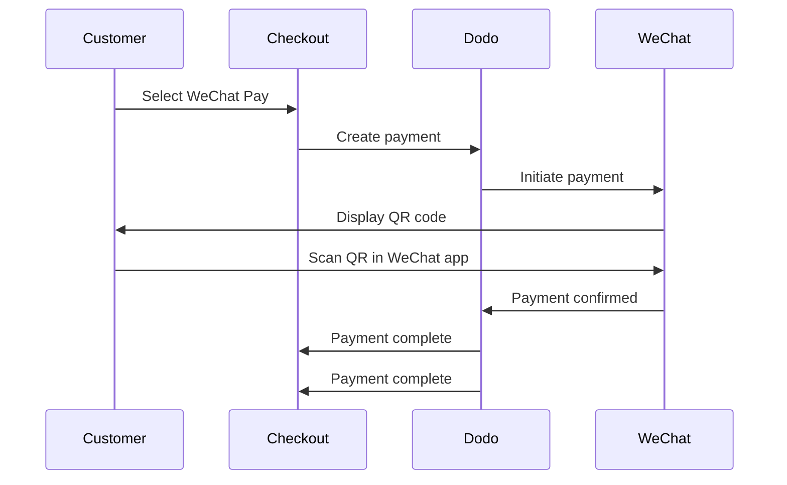

WeChat Pay è una delle due principali piattaforme di pagamento mobile in Cina, utilizzata da oltre un miliardo di persone. Permette pagamenti tramite codici QR all'interno dell'app WeChat, rendendola essenziale per le aziende che mirano ai consumatori cinesi.

## Perché Offrire WeChat Pay?

<CardGroup cols={3}>
<Card title="1B+ Users" icon="users">
WeChat Pay è utilizzato da oltre un miliardo di persone, rendendola una delle piattaforme di pagamento più grandi al mondo.
</Card>

<Card title="Mobile-First" icon="mobile">
I pagamenti vengono completati interamente all'interno dell'app WeChat — veloce, familiare e senza attriti per i clienti cinesi.
</Card>

<Card title="Dual Currency" icon="money-bill-transfer">
Accetta pagamenti in USD e CNY, offrendo flessibilità per transazioni transfrontaliere e nazionali.
</Card>
</CardGroup>

## Panoramica

| Dettaglio | Valore |
| :----- | :---- |
| **Valuta di Fatturazione** | USD, CNY |
| **Abbonamenti** | No |
| **Importo Minimo** | $0.50 / ¥1.00 |
| **Regolamento** | USD |

## Come Funziona



## Esperienza del Cliente

1. Il cliente seleziona WeChat Pay al checkout
2. Un codice QR viene visualizzato nella pagina di checkout
3. Il cliente apre WeChat sul suo telefono e scansiona il codice QR
4. Il cliente conferma il pagamento nell'app WeChat
5. Il pagamento viene confermato istantaneamente e il cliente viene reindirizzato alla pagina di successo

<Info>
I clienti pagano in USD o CNY, e ricevi il regolamento in USD.
</Info>

## Configurazione

```javascript
const session = await client.checkoutSessions.create({
  product_cart: [{ product_id: 'prod_123', quantity: 1 }],
  allowed_payment_method_types: ['wechat_pay', 'credit', 'debit'],
  return_url: 'https://example.com/success'
});
```

## Tipo di Metodo API

| Tipo | Metodo | Valute |
| :--- | :----- | :--------- |
| `wechat_pay` | WeChat Pay | USD, CNY |

## Testing

<Steps>
<Step title="Enable test mode">
Usa le tue chiavi API di test di Dodo Payments.
</Step>

<Step title="Create a test checkout">
Crea una sessione di checkout con `wechat_pay` nei metodi di pagamento consentiti.
</Step>

<Step title="Scan the QR code">
Sarà generato un codice QR di test — scansionarlo con la fotocamera del telefono normale (nessuna app WeChat necessaria). Verrai reindirizzato a una pagina di test dove puoi simulare la transazione come successo o fallimento.
</Step>
</Steps>

## Best Practices

<AccordionGroup>
<Accordion title="Target Chinese customers">
WeChat Pay è usato principalmente dai consumatori cinesi. Includilo quando la tua base clienti include acquirenti cinesi o stai mirando al mercato cinese.
</Accordion>

<Accordion title="Always include card fallbacks">
Non tutti i clienti hanno WeChat. Includi sempre `credit` e `debit` come metodi di pagamento di riserva.
</Accordion>

<Accordion title="Optimize for mobile">
Molti utenti di WeChat Pay navigano su mobile. Assicurati che la tua pagina di checkout sia reattiva — la scansione del codice QR funziona meglio quando il checkout è visualizzato su un desktop o tablet mentre il cliente scansiona con il suo telefono.
</Accordion>

<Accordion title="Consider both currencies">
WeChat Pay supporta sia USD che CNY. Scegli la valuta di fatturazione che meglio si adatta al tuo mercato target — USD per transazioni transfrontaliere, CNY per transazioni interne cinesi.
</Accordion>
</AccordionGroup>

## Risoluzione dei Problemi

<AccordionGroup>
<Accordion title="WeChat Pay not appearing at checkout">
**Controlla:**
1. `wechat_pay` incluso in `allowed_payment_method_types`?
2. La valuta di fatturazione è impostata su USD o CNY?
3. L'importo della transazione soddisfa il minimo?

**Soluzione:** Verifica che il tipo di metodo di pagamento e la valuta siano correttamente passati nella tua richiesta API.
</Accordion>

<Accordion title="QR code not scanning">
**Causa:** Il codice QR potrebbe essere scaduto, o la versione di WeChat del cliente è obsoleta.

**Soluzione:** Aggiorna la pagina di checkout per generare un nuovo codice QR. Assicurati che il cliente stia usando una versione corrente di WeChat.
</Accordion>

<Accordion title="Payment not confirming">
**Causa:** WeChat Pay tipicamente conferma istantaneamente, ma possono verificarsi ritardi di rete.

**Soluzione:** Monitora i webhook per la conferma del pagamento. Se il pagamento non viene confermato entro pochi minuti, il cliente potrebbe dover riprovare.
</Accordion>
</AccordionGroup>

## Pagine Correlate

<CardGroup cols={2}>
<Card title="Payment Methods Overview" icon="credit-card" href="/features/payment-methods">
Visualizza tutti i metodi di pagamento supportati.
</Card>

<Card title="Checkout Guide" icon="book" href="/developer-resources/checkout-session">
Guida completa all'implementazione del checkout.
</Card>

<Card title="Webhooks" icon="webhook" href="/developer-resources/webhooks">
Gestisci le conferme di pagamento in modo asincrono.
</Card>

<Card title="Testing Process" icon="flask" href="/miscellaneous/testing-process">
Guida completa al testing di tutti i metodi di pagamento.
</Card>
</CardGroup>
