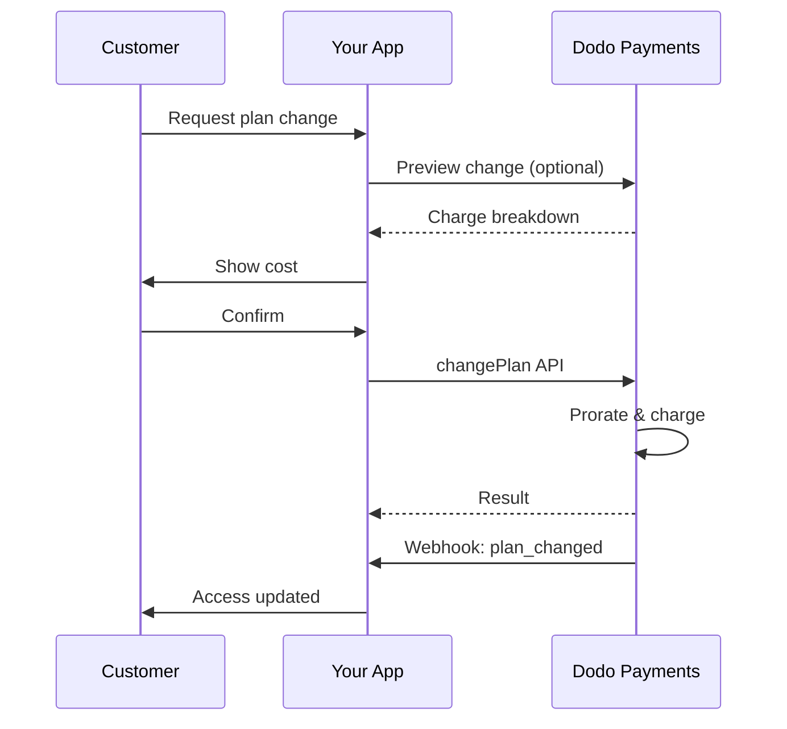
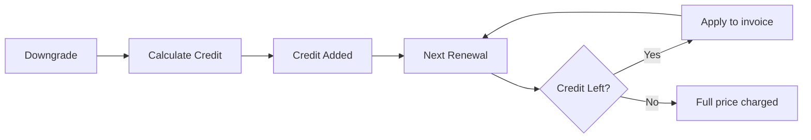

<Info>
Le sottoscrizioni ti consentono di vendere accesso continuativo con rinnovi automatici. Usa cicli di fatturazione flessibili, prove gratuite, modifiche ai piani e componenti aggiuntivi per personalizzare i prezzi per ogni cliente.
</Info>

<CardGroup cols={2}>
<Card title="Upgrade & Downgrade" icon="repeat" href="/developer-resources/subscription-upgrade-downgrade">
Controlla le modifiche dei piani con prorata e aggiornamenti di quantità.
</Card>

<Card title="On‑Demand Subscriptions" icon="bolt" href="/developer-resources/ondemand-subscriptions">
Autorizza un mandato ora e addebita più tardi con importi personalizzati.
</Card>

<Card title="Customer Portal" icon="id-card" href="/features/customer-portal">
Consenti ai clienti di gestire piani, fatturazione e cancellazioni.
</Card>

<Card title="Subscription Webhooks" icon="code" href="/developer-resources/webhooks/intents/subscription">
Reagisci agli eventi del ciclo di vita come creato, rinnovato e annullato.
</Card>
</CardGroup>

## Cosa Sono gli Abbonamenti?

Gli abbonamenti sono prodotti ricorrenti che i clienti acquistano secondo un programma. Sono ideali per:

- **Licenze SaaS**: App, API o accesso alla piattaforma
- **Abbonamenti**: Comunità, programmi o club
- **Contenuti digitali**: Corsi, media o contenuti premium
- **Piani di supporto**: SLA, pacchetti di successo o manutenzione

## Vantaggi Chiave

- **Entrate prevedibili**: Fatturazione ricorrente con rinnovi automatici
- **Cicli flessibili**: Mensili, annuali, intervalli personalizzati e prove
- **Agilità del piano**: Ripartizione per aggiornamenti e riduzioni
- **Add-on e posti**: Allegare aggiornamenti opzionali e quantificabili
- **Checkout senza soluzione di continuità**: Checkout ospitato e portale clienti
- **Sviluppatore-first**: API chiare per creazione, modifiche e tracciamento dell'uso

## Creazione di Abbonamenti

Crea prodotti in abbonamento nel tuo dashboard di Dodo Payments, quindi vendili tramite checkout o la tua API. Separare i prodotti dagli abbonamenti attivi ti consente di versionare i prezzi, allegare add-on e monitorare le prestazioni in modo indipendente.

### Creazione di un prodotto in abbonamento

Configura i campi nel dashboard per definire come il tuo abbonamento viene venduto, rinnovato e fatturato. Le sezioni di seguito corrispondono direttamente a ciò che vedi nel modulo di creazione.

#### Dettagli del prodotto

- **Nome del prodotto** (obbligatorio): Il nome visualizzato nel checkout, nel portale clienti e nelle fatture.
- **Descrizione del prodotto** (obbligatoria): Una chiara dichiarazione di valore che appare nel checkout e nelle fatture.
- **Immagine del prodotto** (obbligatoria): PNG/JPG/WebP fino a 3 MB. Utilizzata nel checkout e nelle fatture.
- **Marca**: Associa il prodotto a un marchio specifico per la tematizzazione e le email.
- **Categoria fiscale** (obbligatoria): Scegli la categoria (ad esempio, SaaS) per determinare le regole fiscali.

<Tip>
Scegli la categoria fiscale più accurata per garantire la corretta riscossione delle tasse per area geografica.
</Tip>

#### Prezzi

- **Tipo di Prezzo**: Scegli <b>Abbonamento</b> (questa guida). Le alternative sono Pagamento Singolo e Fatturazione Basata sull'Uso.
- **Prezzo** (obbligatorio): Prezzo ricorrente base con valuta.
- **Sconto Applicabile (%)**: Percentuale di sconto opzionale applicata al prezzo base; riflessa nel checkout e nelle fatture.
- **Ripeti pagamento ogni** (obbligatorio): Intervallo per i rinnovi, ad esempio, ogni 1 Mese. Seleziona la cadenza (mesi o anni) e la quantità.
- **Periodo di Abbonamento** (obbligatorio): Termine totale per il quale l'abbonamento rimane attivo (ad esempio, 10 Anni). Dopo la scadenza di questo periodo, i rinnovi si fermano a meno che non vengano estesi.
- **Giorni di Periodo di Prova** (obbligatorio): Imposta la durata della prova in giorni. Usa 0 per disabilitare le prove. Il primo addebito avviene automaticamente al termine della prova.
- **Seleziona add-on**: Allegare fino a 10 add-on che i clienti possono acquistare insieme al piano base.

<Warning>
Modificare i prezzi di un prodotto attivo influisce sugli acquisti futuri. Le sottoscrizioni esistenti seguono le impostazioni di cambio piano e prorata configurate.
</Warning>

<Info>
I componenti aggiuntivi sono ideali per extra quantificabili come posti o spazio di archiviazione. Puoi controllare le quantità consentite e il comportamento della prorata quando i clienti li modificano.
</Info>

#### Impostazioni avanzate

- **Prezzi inclusivi di tasse**: Visualizza i prezzi inclusivi delle tasse applicabili. Il calcolo finale delle tasse varia comunque in base alla posizione del cliente.
- **Genera chiavi di licenza**: Emissione di una chiave unica a ciascun cliente dopo l'acquisto. Vedi la guida sulle <a href="/features/license-keys">Chiavi di Licenza</a>.
- **Consegna di prodotti digitali**: Consegna automatica di file o contenuti dopo l'acquisto. Scopri di più in <a href="/features/digital-product-delivery">Consegna di Prodotti Digitali</a>.
- **Metadati**: Allegare coppie chiave-valore personalizzate per tagging interno o integrazioni client. Vedi <a href="/api-reference/metadata">Metadati</a>.

<Tip>
Usa i metadati per memorizzare identificatori dal tuo sistema (es. accountId) in modo da poter riconciliare eventi e fatture successivamente.
</Tip>

## Prove di Abbonamento

Le prove consentono ai clienti di accedere agli abbonamenti senza pagamento immediato. Il primo addebito avviene automaticamente al termine della prova.

### Configurazione delle Prove

Imposta **Trial Period Days** nella sezione prezzi del prodotto (usa `0` per disabilitare). Puoi sovrascriverlo durante la creazione delle sottoscrizioni:

```typescript
// Via subscription creation
const subscription = await client.subscriptions.create({
  customer_id: 'cus_123',
  product_id: 'prod_monthly',
  trial_period_days: 14  // Overrides product's trial period
});

// Via checkout session
const session = await client.checkoutSessions.create({
  product_cart: [{ product_id: 'prod_monthly', quantity: 1 }],
  subscription_data: { trial_period_days: 14 }
});
```

<Warning>
Il valore `trial_period_days` deve essere compreso tra 0 e 10.000 giorni.
</Warning>

### Rilevamento dello Stato della Prova

<Warning>
Attualmente non esiste un campo diretto per rilevare lo stato della prova. La seguente è una soluzione alternativa che richiede la richiesta dei pagamenti, il che è inefficiente. Stiamo lavorando a una soluzione più efficiente.
</Warning>

Per determinare se un abbonamento è in prova, recupera l'elenco dei pagamenti per l'abbonamento. Se c'è esattamente un pagamento con importo 0, l'abbonamento è in periodo di prova:

```typescript
const subscription = await client.subscriptions.retrieve('sub_123');
const payments = await client.payments.list({
  subscription_id: subscription.subscription_id
});

// Check if subscription is in trial
const isInTrial = payments.items.length === 1 && 
                  payments.items[0].total_amount === 0;
```

### Aggiornamento del Periodo di Prova

Estendi la prova aggiornando `next_billing_date`:

```typescript
await client.subscriptions.update('sub_123', {
  next_billing_date: '2025-02-15T00:00:00Z'  // New trial end date
});
```

<Warning>
Non puoi impostare `next_billing_date` su un tempo passato. La data deve essere nel futuro.
</Warning>

## Modifiche ai Piani di Abbonamento

Le modifiche al piano consentono di aggiornare o eseguire il downgrade degli abbonamenti, regolare le quantità o migrare verso prodotti diversi. A seconda della modalità di proration che selezioni, una modifica può attivare un addebito immediato, creare un credito o non applicare alcuna modifica alla fatturazione.

<Tip>
Puoi cambiare i piani di sottoscrizione e aggiornare la prossima data di fatturazione direttamente dalla dashboard Dodo Payments. Questo offre un modo rapido per modificare le sottoscrizioni in risposta a richieste di supporto clienti, upgrade promozionali o migrazioni di piano senza effettuare chiamate API.
</Tip>

<Tip>
**Abilita i cambi piano self-service:** Vuoi che i clienti possano effettuare upgrade o downgrade delle proprie sottoscrizioni tramite il Customer Portal? Aggiungi i tuoi prodotti di sottoscrizione a una Product Collection e attiva "Allow Subscription Updates" nelle impostazioni di sottoscrizione.
</Tip>



<Card title="Product Collections" icon="layer-group" href="/features/product-collections">
  Raggruppa i prodotti correlati in collezioni per abilitare percorsi di upgrade/downgrade fluidi nel Customer Portal.
</Card>

### Modalità di prorata

Scegli come vengono fatturati i clienti quando cambiano piano:

<Info>
**Confronto rapido delle quattro modalità di proration:**

| | `prorated_immediately` | `difference_immediately` | `full_immediately` | `do_not_bill` |
|---|---|---|---|---|
| **Upgrade** | Addebito prorato per i giorni rimanenti | Addebitata la differenza a prezzo pieno | Addebitato il prezzo pieno del nuovo piano | Nessun addebito — cambia immediatamente |
| **Downgrade** | Credito prorato per i giorni rimanenti | L'intera differenza di prezzo come credito | Nessun credito, addebito completo | Nessun credito — cambia immediatamente |
| **Ciclo di fatturazione** | Rimane lo stesso | Rimane lo stesso | Si azzera al giorno attuale | Rimane lo stesso |
| **Ideale per** | Fatturazione equa basata sul tempo | Cambiamenti di livello semplici | Reset del ciclo di fatturazione | Migrazioni gratuite o cambi per cortesia |

#### `prorated_immediately`
Addebita un importo proporzionale in base al tempo rimanente nell'attuale ciclo di fatturazione. Ideale per una fatturazione equa che tiene conto del tempo inutilizzato.

```typescript
await client.subscriptions.changePlan('sub_123', {
  product_id: 'prod_pro',
  quantity: 1,
  proration_billing_mode: 'prorated_immediately'
});
```

#### `difference_immediately`
Addebita immediatamente la differenza di prezzo (upgrade) o aggiunge credito per i rinnovi futuri (downgrade). Ideale per scenari semplici di upgrade/downgrade.

```typescript
// Upgrade: charges $50 (difference between $30 and $80)
// Downgrade: credits remaining value, auto-applied to renewals
await client.subscriptions.changePlan('sub_123', {
  product_id: 'prod_pro',
  quantity: 1,
  proration_billing_mode: 'difference_immediately'
});
```

<Info>
I crediti derivanti da downgrade effettuati usando `difference_immediately` sono limitati all'abbonamento e vengono applicati automaticamente ai rinnovi futuri. Sono distinti dalle autorizzazioni di <a href="/features/credit-based-billing">Credit-Based Billing</a>.
</Info>

Quando un cliente effettua un downgrade con `difference_immediately`, il valore inutilizzato diventa un credito riferito alla sottoscrizione che compensa automaticamente i rinnovi futuri:



#### `full_immediately`
Addebita immediatamente l'importo completo del nuovo piano, ignorando il tempo restante. Ideale per ripristinare i cicli di fatturazione.

```typescript
await client.subscriptions.changePlan('sub_123', {
  product_id: 'prod_monthly',
  quantity: 1,
  proration_billing_mode: 'full_immediately'
});
```

#### `do_not_bill`
Passa al nuovo piano senza alcuna regolazione di fatturazione. Nessun addebito di proration, nessun credito: il cliente semplicemente passa al nuovo piano. Ideale per migrazioni di cortesia, cambi di piano gratuiti o scenari in cui si desidera assorbire la differenza di costo.

```typescript
await client.subscriptions.changePlan('sub_123', {
  product_id: 'prod_new_plan',
  quantity: 1,
  proration_billing_mode: 'do_not_bill'
});
```

<AccordionGroup>
<Accordion title="Example: Prorated upgrade calculation">

**Scenario**: Cliente su Basic ($30/mese) effettua un upgrade a Pro ($80/mese) al giorno 16 di un ciclo di 30 giorni utilizzando `prorated_immediately`.

```
Unused credit from Basic = $30 × (15 remaining / 30 total) = $15.00
Prorated cost of Pro     = $80 × (15 remaining / 30 total) = $40.00
────────────────────────────────────────────────────────────────────
Immediate charge         = $40.00 − $15.00 = $25.00
```

Prossimo rinnovo alla data di fatturazione originale: **$80.00/mese**.

<Tip>
Per esempi di calcolo dettagliati e casi limite, vedi la nostra [Guida all'Aggiornamento e al Downgrade](/developer-resources/subscription-upgrade-downgrade).
</Tip>

</Accordion>
<Accordion title="Example: Downgrade credit calculation">

**Scenario**: Cliente su Pro ($80/mese) effettua un downgrade a Starter ($20/mese) utilizzando `difference_immediately`.

```
Credit = Old plan − New plan = $80 − $20 = $60.00
```

Il credito di $60 viene applicato automaticamente ai rinnovi futuri:
- Rinnovo 1: $20 − $20 (credito) = **$0.00** ($40 di credito rimanente)
- Rinnovo 2: $20 − $20 (credito) = **$0.00** ($20 di credito rimanente)
- Rinnovo 3: $20 − $20 (credito) = **$0.00** (credito esaurito)
- Rinnovo 4: **$20.00** (prezzo pieno)

<Info>
Per saperne di più sulla gestione dei crediti, consulta la [Guida all'Aggiornamento e al Downgrade](/developer-resources/subscription-upgrade-downgrade).
{/* LOCKED_PATTERN_07427f62e4e59df6149a8a60508baae30ae */}

</Accordion>
</AccordionGroup>

### Modifica dei Piani con Componenti Aggiuntivi

Modifica i componenti aggiuntivi quando cambi i piani. I componenti aggiuntivi sono inclusi nei calcoli di proration:

```typescript
await client.subscriptions.changePlan('sub_123', {
  product_id: 'prod_pro',
  quantity: 1,
  proration_billing_mode: 'difference_immediately',
  addons: [{ addon_id: 'addon_extra_seats', quantity: 2 }]  // Add add-ons
  // addons: []  // Empty array removes all existing add-ons
});
```

<Info>
Le modifiche ai piani generano addebiti immediati. Gli addebiti non riusciti potrebbero spostare l'abbonamento allo stato `on_hold`. Monitora le modifiche tramite eventi webhook `subscription.plan_changed`.
{/* LOCKED_PATTERN_07427f62e4e59df6149a8a60508baae30ae */}

### Anteprima delle Modifiche al Piano

Prima di impegnarsi in una modifica del piano, visualizza in anteprima l'addebito esatto e l'abbonamento risultante:

```typescript
const preview = await client.subscriptions.previewChangePlan('sub_123', {
  product_id: 'prod_pro',
  quantity: 1,
  proration_billing_mode: 'prorated_immediately'
});

// Show customer the charge before confirming
console.log('You will be charged:', preview.immediate_charge.summary);
```

<Card title="Preview Change Plan API" icon="eye" href="/api-reference/subscriptions/preview-change-plan">
  Visualizza in anteprima le modifiche al piano prima di impegnarti.
</Card>

## Stati dell'Abbonamento

Gli abbonamenti possono trovarsi in diversi stati durante il loro ciclo di vita:

- **`active`**: L'abbonamento è attivo e si rinnoverà automaticamente
- **`on_hold`**: L'abbonamento è in pausa a causa di un pagamento non riuscito. È necessario aggiornare il metodo di pagamento per riattivarlo
- **`cancelled`**: L'abbonamento è cancellato e non si rinnoverà
- **`expired`**: L'abbonamento ha raggiunto la sua data di fine
- **`pending`**: L'abbonamento è in fase di creazione o elaborazione

### Stato di Sospensione

Un abbonamento entra nello stato `on_hold` quando:

- Un pagamento di rinnovo fallisce (fondi insufficienti, carta scaduta, ecc.)
- L'addebito per un cambio di piano fallisce
- L'autorizzazione del metodo di pagamento fallisce

<Warning>
Quando un abbonamento è nello stato `on_hold`, non si rinnoverà automaticamente. Devi aggiornare il metodo di pagamento per riattivare l'abbonamento.
</Warning>

### Riattivare dalla Sospensione

Per riattivare un abbonamento dallo stato `on_hold`, aggiorna il metodo di pagamento. Questo automaticamente:

1. Crea un addebito per i restanti debiti
2. Genera una fattura
3. Elabora il pagamento utilizzando il nuovo metodo di pagamento
4. Riattiva l'abbonamento allo stato `active` al successo del pagamento

```typescript
// Reactivate subscription from on_hold
const response = await client.subscriptions.updatePaymentMethod('sub_123', {
  type: 'new',
  return_url: 'https://example.com/return'
});

// For on_hold subscriptions, a charge is automatically created
if (response.payment_id) {
  console.log('Charge created:', response.payment_id);
  // Redirect customer to response.payment_link to complete payment
  // Monitor webhooks for payment.succeeded and subscription.active
}
```

<Info>
Dopo aver aggiornato con successo il metodo di pagamento per un abbonamento `on_hold`, riceverai eventi webhook `payment.succeeded` seguiti da `subscription.active`.
{/* LOCKED_PATTERN_07427f62e4e59df6149a8a60508baae30ae */}

## Gestione dell'API

<AccordionGroup>
<Accordion title="Create subscriptions">
Usa `POST /subscriptions` per creare abbonamenti programmaticamente dai prodotti, con prove gratuite e componenti aggiuntivi opzionali.

<Card title="API Reference" icon="code" href="/api-reference/subscriptions/post-subscriptions">
Visualizza l'API di creazione dell'abbonamento.
</Card>
</Accordion>

<Accordion title="Update subscriptions">
Usa `PATCH /subscriptions/{id}` per aggiornare le quantità, cancellare alla prossima data di fatturazione o modificare i metadati.

<Card title="API Reference" icon="code" href="/api-reference/subscriptions/patch-subscriptions">
Scopri come aggiornare i dettagli dell'abbonamento.
</Card>
</Accordion>

<Accordion title="Change plans (proration)">
Cambia il prodotto attivo e le quantità con controlli di proration.

<Card title="API Reference" icon="code" href="/api-reference/subscriptions/change-plan">
Rivedi le opzioni di cambio piano.
</Card>
</Accordion>

<Accordion title="On‑demand charges">
Per abbonamenti on‑demand, addebita importi specifici su richiesta.

<Card title="API Reference" icon="code" href="/api-reference/subscriptions/create-charge">
Addebita un abbonamento on‑demand.
</Card>
</Accordion>

<Accordion title="List and retrieve">
Usa `GET /subscriptions` per elencare tutti gli abbonamenti e `GET /subscriptions/{id}` per recuperarne uno.

<Card title="API Reference" icon="code" href="/api-reference/subscriptions/get-subscriptions">
Sfoglia le API di elencazione e recupero.
</Card>
</Accordion>

<Accordion title="Usage history">
Recupera l'uso registrato per modelli di prezzo misurati o ibridi.

<Card title="API Reference" icon="code" href="/api-reference/subscriptions/get-usage-history">
Consulta l'API della cronologia dell'uso.
</Card>
</Accordion>

<Accordion title="Update payment method">
Aggiorna il metodo di pagamento per un abbonamento. Per gli abbonamenti attivi, questo aggiorna il metodo di pagamento per i rinnovi futuri. Per gli abbonamenti nello stato `on_hold`, ciò riattiva l'abbonamento creando un addebito per i restanti debiti.

<Card title="API Reference" icon="code" href="/api-reference/subscriptions/update-payment-method">
Scopri come aggiornare i metodi di pagamento e riattivare gli abbonamenti.
</Card>
</Accordion>
</AccordionGroup>

## Casi d'Uso Comuni

- **SaaS e API**: Accesso a livelli con componenti aggiuntivi per posti o utilizzo
- **Contenuti e media**: Accesso mensile con prove introduttive
- **Piani di supporto B2B**: Contratti annuali con componenti aggiuntivi di supporto premium
- **Strumenti e plugin**: Chiavi di licenza e versioni

## Esempi di Integrazione

### Checkout Sessions (abbonamenti)
Quando si creano sessioni di checkout, includi il prodotto di abbonamento e i componenti aggiuntivi opzionali:

```typescript
const session = await client.checkoutSessions.create({
  product_cart: [
    {
      product_id: 'prod_subscription',
      quantity: 1
    }
  ]
});
```

### Cambi di piano con proration
Aggiorna o riduci un abbonamento e controlla il comportamento della proration:

```typescript
await client.subscriptions.changePlan('sub_123', {
  product_id: 'prod_new',
  quantity: 1,
  proration_billing_mode: 'difference_immediately'
});
```

### Cancellazione alla prossima data di fatturazione
Pianifica una cancellazione che entra in vigore alla fine del periodo di fatturazione corrente:

```typescript
await client.subscriptions.update('sub_123', {
  cancel_at_next_billing_date: true
});
```

### Abbonamenti on-demand
Crea un abbonamento on-demand e addebita successivamente secondo necessità:

```typescript
const onDemand = await client.subscriptions.create({
  customer_id: 'cus_123',
  product_id: 'prod_on_demand',
  on_demand: true
});

await client.subscriptions.createCharge(onDemand.id, {
  amount: 4900,
  currency: 'USD',
  description: 'Extra usage for September'
});
```

### Aggiorna il metodo di pagamento per l'abbonamento attivo
Aggiorna il metodo di pagamento per un abbonamento attivo:

```typescript
// Update with new payment method
const response = await client.subscriptions.updatePaymentMethod('sub_123', {
  type: 'new',
  return_url: 'https://example.com/return'
});

// Or use existing payment method
await client.subscriptions.updatePaymentMethod('sub_123', {
  type: 'existing',
  payment_method_id: 'pm_abc123'
});
```

### Riattiva abbonamento da on_hold
Riattiva un abbonamento che è andato in sospeso a causa di un pagamento non riuscito:

```typescript
// Update payment method - automatically creates charge for remaining dues
const response = await client.subscriptions.updatePaymentMethod('sub_123', {
  type: 'new',
  return_url: 'https://example.com/return'
});

if (response.payment_id) {
  // Charge created for remaining dues
  // Redirect customer to response.payment_link
  // Monitor webhooks: payment.succeeded → subscription.active
}
```

## Abbonamenti con Mandati Conformi RBI

  Le sottoscrizioni UPI e con carta indiana vengono gestite in conformità con le normative RBI (Reserve Bank of India) e con requisiti specifici di mandato:

  ### Limiti del Mandato

  Il tipo e l'importo del mandato dipendono dalla carica ricorrente dell'abbonamento:

  - **Addebiti inferiori a Rs 15.000:** Creiamo un mandato on demand per Rs 15.000 INR. L'importo dell'abbonamento è addebitato periodicamente secondo la frequenza dell'abbonamento, fino al limite del mandato.
  - **Addebiti di Rs 15.000 o superiori:** Creiamo un mandato di abbonamento (o un mandato on demand) per l'importo esatto dell'abbonamento.

Per informazioni dettagliate sui mandati conformi a RBI per i metodi di pagamento indiani, consulta la pagina <a href="/features/payment-methods/india">Metodi di Pagamento in India</a>.

  ### Considerazioni su Upgrade e Downgrade

  **Importante:** Quando si eseguono upgrade o downgrade degli abbonamenti, valuta attentamente i limiti del mandato:

  - Se un upgrade/downgrade comporta un importo di addebito che supera Rs 15.000 e va oltre il limite del pagamento on demand esistente, l'addebito della transazione può fallire.
  - In tali casi, il cliente potrebbe dover aggiornare il proprio metodo di pagamento o modificare nuovamente l'abbonamento per stabilire un nuovo mandato con il limite corretto.

  ### Autorizzazione per Addebiti di Alto Valore

  Per gli addebiti di abbonamento pari o superiori a Rs 15.000:

  - Il cliente verrà invitato dalla propria banca ad autorizzare la transazione.
  - Se il cliente non riesce ad autorizzare la transazione, quest'ultima fallirà e l'abbonamento verrà messo in pausa.

  ### Ritardo di Elaborazione di 48 Ore

  **Tempistica di Elaborazione:** Gli addebiti ricorrenti su carte indiane e abbonamenti UPI seguono un modello di elaborazione unico:

  - Gli addebiti vengono **iniziati** alla data pianificata secondo la frequenza dell'abbonamento.
  - La reale **deduzione** dal conto del cliente avviene solo dopo **48 ore** dall'iniziazione del pagamento.
  - Questa finestra di 48 ore può estendersi fino a **2-3 ore aggiuntive** a seconda delle risposte delle API bancarie.

  ### Finestra di Cancellazione del Mandato

  Durante la finestra di elaborazione di 48 ore:

  - I clienti possono cancellare il mandato tramite le loro app bancarie.
  - Se un cliente cancella il mandato durante questo periodo, l'abbonamento rimarrà **attivo** (questo è un caso limite specifico degli abbonamenti con carta indiana e UPI AutoPay).
  - Tuttavia, la reale deduzione potrebbe fallire e in tal caso l'abbonamento verrà **messo in pausa**.

  **Gestione dei Casi Limite:** Se fornisci benefici, crediti o utilizzi di abbonamenti ai clienti immediatamente all'inizio dell'addebito, è necessario gestire questa finestra di 48 ore in modo appropriato nella tua applicazione. Considera:

  - Ritardare l'attivazione dei benefici fino alla conferma del pagamento
  - Implementare periodi di grazia o accessi temporanei
  - Monitorare lo stato dell'abbonamento per cancellazioni del mandato
  - Gestire gli stati di sospensione dell'abbonamento nella logica dell'applicazione

  <Tip>
  Monitora i webhook dell'abbonamento per tracciare i cambiamenti di stato del pagamento e gestire i casi limite in cui i mandati vengono cancellati durante la finestra di 48 ore.
  </Tip>

## Best Practices

- **Inizia con livelli chiari**: 2–3 piani con differenze evidenti
- **Comunica i prezzi**: Mostra i totali, la proration e il prossimo rinnovo
- **Usa con saggezza le prove**: Converti con l'onboarding, non solo con il tempo
- **Sfrutta i componenti aggiuntivi**: Mantieni i piani base semplici e vendi extra
- **Testa le modifiche**: Valida le modifiche ai piani e la proration in modalità test

<Info>
Gli abbonamenti sono una base flessibile per il reddito ricorrente. Inizia in modo semplice, testa accuratamente e itera basandoti su metriche di adozione, churn ed espansione.
{/* LOCKED_PATTERN_07427f62e4e59df6149a8a60508baae30ae */}