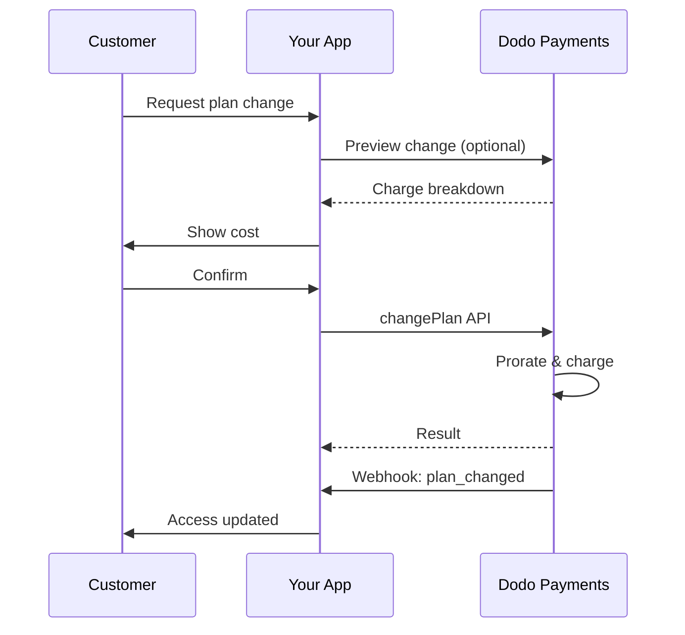
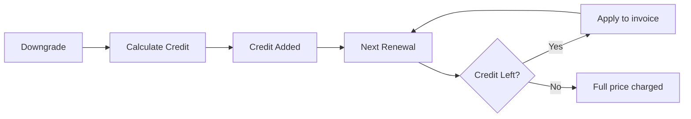

<Info>
Gli abbonamenti ti consentono di vendere accesso continuo con rinnovi automatici. Utilizza cicli di fatturazione flessibili, prove gratuite, cambi di piano e add-on per personalizzare i prezzi per ogni cliente.
</Info>

<CardGroup cols={2}>
<Card title="Aggiorna & Riduci" icon="repeat" href="/developer-resources/subscription-upgrade-downgrade">
Controlla i cambi di piano con ripartizione e aggiornamenti di quantità.
</Card>

<Card title="Abbonamenti On-Demand" icon="bolt" href="/developer-resources/ondemand-subscriptions">
Autorizza un mandato ora e addebita in seguito con importi personalizzati.
</Card>

<Card title="Portale Clienti" icon="id-card" href="/features/customer-portal">
Consenti ai clienti di gestire piani, fatturazione e cancellazioni.
</Card>

<Card title="Webhook per Abbonamenti" icon="code" href="/developer-resources/webhooks/intents/subscription">
Reagisci agli eventi del ciclo di vita come creato, rinnovato e annullato.
</Card>
</CardGroup>

## Cosa Sono gli Abbonamenti?

Gli abbonamenti sono prodotti ricorrenti che i clienti acquistano secondo un programma. Sono ideali per:

- **Licenze SaaS**: App, API o accesso alla piattaforma
- **Abbonamenti**: Comunità, programmi o club
- **Contenuti digitali**: Corsi, media o contenuti premium
- **Piani di supporto**: SLA, pacchetti di successo o manutenzione

## Vantaggi Chiave

- **Entrate prevedibili**: Fatturazione ricorrente con rinnovi automatici
- **Cicli flessibili**: Mensili, annuali, intervalli personalizzati e prove
- **Agilità del piano**: Ripartizione per aggiornamenti e riduzioni
- **Add-on e posti**: Allegare aggiornamenti opzionali e quantificabili
- **Checkout senza soluzione di continuità**: Checkout ospitato e portale clienti
- **Sviluppatore-first**: API chiare per creazione, modifiche e tracciamento dell'uso

## Creazione di Abbonamenti

Crea prodotti in abbonamento nel tuo dashboard di Dodo Payments, quindi vendili tramite checkout o la tua API. Separare i prodotti dagli abbonamenti attivi ti consente di versionare i prezzi, allegare add-on e monitorare le prestazioni in modo indipendente.

### Creazione di un prodotto in abbonamento

Configura i campi nel dashboard per definire come il tuo abbonamento viene venduto, rinnovato e fatturato. Le sezioni di seguito corrispondono direttamente a ciò che vedi nel modulo di creazione.

#### Dettagli del prodotto

- **Nome del prodotto** (obbligatorio): Il nome visualizzato nel checkout, nel portale clienti e nelle fatture.
- **Descrizione del prodotto** (obbligatoria): Una chiara dichiarazione di valore che appare nel checkout e nelle fatture.
- **Immagine del prodotto** (obbligatoria): PNG/JPG/WebP fino a 3 MB. Utilizzata nel checkout e nelle fatture.
- **Marca**: Associa il prodotto a un marchio specifico per la tematizzazione e le email.
- **Categoria fiscale** (obbligatoria): Scegli la categoria (ad esempio, SaaS) per determinare le regole fiscali.

<Tip>
Scegli la categoria fiscale più accurata per garantire una corretta raccolta delle tasse per regione.
</Tip>

#### Prezzi

- **Tipo di Prezzo**: Scegli <b>Abbonamento</b> (questa guida). Le alternative sono Pagamento Singolo e Fatturazione Basata sull'Uso.
- **Prezzo** (obbligatorio): Prezzo ricorrente base con valuta.
- **Sconto Applicabile (%)**: Percentuale di sconto opzionale applicata al prezzo base; riflessa nel checkout e nelle fatture.
- **Ripeti pagamento ogni** (obbligatorio): Intervallo per i rinnovi, ad esempio, ogni 1 Mese. Seleziona la cadenza (mesi o anni) e la quantità.
- **Periodo di Abbonamento** (obbligatorio): Termine totale per il quale l'abbonamento rimane attivo (ad esempio, 10 Anni). Dopo la scadenza di questo periodo, i rinnovi si fermano a meno che non vengano estesi.
- **Giorni di Periodo di Prova** (obbligatorio): Imposta la durata della prova in giorni. Usa 0 per disabilitare le prove. Il primo addebito avviene automaticamente al termine della prova.
- **Seleziona add-on**: Allegare fino a 10 add-on che i clienti possono acquistare insieme al piano base.

<Warning>
Modificare il prezzo di un prodotto attivo influisce sui nuovi acquisti. Gli abbonamenti esistenti seguono le impostazioni di modifica del piano e di ripartizione.
</Warning>

<Info>
Gli add-on sono ideali per extra quantificabili come posti o spazio di archiviazione. Puoi controllare le quantità consentite e il comportamento di ripartizione quando i clienti li modificano.
</Info>

#### Impostazioni avanzate

- **Prezzi inclusivi di tasse**: Visualizza i prezzi inclusivi delle tasse applicabili. Il calcolo finale delle tasse varia comunque in base alla posizione del cliente.
- **Genera chiavi di licenza**: Emissione di una chiave unica a ciascun cliente dopo l'acquisto. Vedi la guida sulle <a href="/features/license-keys">Chiavi di Licenza</a>.
- **Consegna di prodotti digitali**: Consegna automatica di file o contenuti dopo l'acquisto. Scopri di più in <a href="/features/digital-product-delivery">Consegna di Prodotti Digitali</a>.
- **Metadati**: Allegare coppie chiave-valore personalizzate per tagging interno o integrazioni client. Vedi <a href="/api-reference/metadata">Metadati</a>.

<Tip>
Usa i metadati per memorizzare identificatori dal tuo sistema (ad es. accountId) in modo da poter riconciliare eventi e fatture in seguito.
</Tip>

## Prove di Abbonamento

Le prove consentono ai clienti di accedere agli abbonamenti senza pagamento immediato. Il primo addebito avviene automaticamente al termine della prova.

### Configurazione delle Prove

Imposta **Giorni del Periodo di Prova** nella sezione di prezzo del prodotto (usa `0` per disabilitare). Puoi sovrascrivere questo durante la creazione delle sottoscrizioni:

```typescript
// Via subscription creation
const subscription = await client.subscriptions.create({
  customer_id: 'cus_123',
  product_id: 'prod_monthly',
  trial_period_days: 14  // Overrides product's trial period
});

// Via checkout session
const session = await client.checkoutSessions.create({
  product_cart: [{ product_id: 'prod_monthly', quantity: 1 }],
  subscription_data: { trial_period_days: 14 }
});
```

<Warning>
Il valore `trial_period_days` deve essere compreso tra 0 e 10.000 giorni.
</Warning>

### Rilevamento dello Stato della Prova

<Warning>
Attualmente, non esiste un campo diretto per rilevare lo stato della prova. Il seguente è un workaround che richiede di interrogare i pagamenti, il che è inefficiente. Stiamo lavorando a una soluzione più efficiente.
</Warning>

Per determinare se un abbonamento è in prova, recupera l'elenco dei pagamenti per l'abbonamento. Se c'è esattamente un pagamento con importo 0, l'abbonamento è in periodo di prova:

```typescript
const subscription = await client.subscriptions.retrieve('sub_123');
const payments = await client.payments.list({
  subscription_id: subscription.subscription_id
});

// Check if subscription is in trial
const isInTrial = payments.items.length === 1 && 
                  payments.items[0].total_amount === 0;
```

### Aggiornamento del Periodo di Prova

Estendi il periodo di prova aggiornando `next_billing_date`:

```typescript
await client.subscriptions.update('sub_123', {
  next_billing_date: '2025-02-15T00:00:00Z'  // New trial end date
});
```

<Warning>
Non puoi impostare `next_billing_date` a un tempo passato. La data deve essere nel futuro.
</Warning>

## Modifiche ai Piani di Abbonamento

Le modifiche ai piani ti consentono di aggiornare o ridurre gli abbonamenti, regolare le quantità o migrare a prodotti diversi. Ogni modifica attiva un addebito immediato in base alla modalità di ripartizione che selezioni.

<Tip>
Puoi cambiare i piani di abbonamento e aggiornare la prossima data di fatturazione direttamente dal dashboard di Dodo Payments. Questo fornisce un modo rapido per regolare gli abbonamenti per richieste di supporto clienti, aggiornamenti promozionali o migrazioni di piano senza effettuare chiamate API.
</Tip>

<Tip>
**Abilita le modifiche ai piani in self-service:** Vuoi che i clienti possano aggiornare o ridurre le loro sottoscrizioni tramite il Portale Clienti? Aggiungi i tuoi prodotti in sottoscrizione a una Collezione di Prodotti e abilita "Consenti Aggiornamenti di Sottoscrizione" nelle tue Impostazioni di Sottoscrizione.
</Tip>



<Card title="Collezioni di Prodotti" icon="layer-group" href="/features/product-collections">
  Raggruppa prodotti correlati in collezioni per abilitare percorsi di aggiornamento/riduzione senza soluzione di continuità nel Portale Clienti.
</Card>

### Modi di Prorata

Scegli come i clienti vengono fatturati quando cambiano piano:

<Info>
**Confronto rapido dei tre modi di prorata:**

| | `prorated_immediately` | `difference_immediately` | `full_immediately` |
|---|---|---|---|
| **Aggiornamento** | Addebito prorato per i giorni rimanenti | Differenza di prezzo totale addebitata | Prezzo totale del nuovo piano addebitato |
| **Riduzione** | Credito prorato per i giorni rimanenti | Differenza di prezzo totale come credito | Nessun credito, addebito totale |
| **Ciclo di fatturazione** | Rimane lo stesso | Rimane lo stesso | Si resetta a oggi |
| **Meglio per** | Fatturazione equa basata sul tempo | Modifiche semplici ai livelli | Reset dei cicli di fatturazione |
</Info>

#### `prorated_immediately`
Addebita importo prorato in base al tempo rimanente nel ciclo di fatturazione attuale. Meglio per una fatturazione equa che tiene conto del tempo non utilizzato.

```typescript
await client.subscriptions.changePlan('sub_123', {
  product_id: 'prod_pro',
  quantity: 1,
  proration_billing_mode: 'prorated_immediately'
});
```

#### `difference_immediately`
Addebita immediatamente la differenza di prezzo (aggiornamento) o aggiunge credito per i rinnovi futuri (riduzione). Meglio per scenari di aggiornamento/riduzione semplici.

```typescript
// Upgrade: charges $50 (difference between $30 and $80)
// Downgrade: credits remaining value, auto-applied to renewals
await client.subscriptions.changePlan('sub_123', {
  product_id: 'prod_pro',
  quantity: 1,
  proration_billing_mode: 'difference_immediately'
});
```

<Info>
I crediti derivanti da riduzioni utilizzando `difference_immediately` sono limitati all'abbonamento e si applicano automaticamente ai rinnovi futuri. Sono distinti da <a href="/features/customer-credit">Crediti Clienti</a>.
</Info>

Quando un cliente riduce con `difference_immediately`, il valore non utilizzato diventa un credito limitato all'abbonamento che compensa automaticamente i rinnovi futuri:



#### `full_immediately`
Addebita immediatamente l'importo totale del nuovo piano, ignorando il tempo rimanente. Meglio per il ripristino dei cicli di fatturazione.

```typescript
await client.subscriptions.changePlan('sub_123', {
  product_id: 'prod_monthly',
  quantity: 1,
  proration_billing_mode: 'full_immediately'
});
```

<AccordionGroup>
<Accordion title="Esempio: Calcolo dell'aggiornamento prorato">

**Scenario**: Cliente su Basic ($30/mese) aggiorna a Pro ($80/mese) nel giorno 16 di un ciclo di 30 giorni utilizzando `prorated_immediately`.

```
Unused credit from Basic = $30 × (15 remaining / 30 total) = $15.00
Prorated cost of Pro     = $80 × (15 remaining / 30 total) = $40.00
────────────────────────────────────────────────────────────────────
Immediate charge         = $40.00 − $15.00 = $25.00
```

Prossimo rinnovo alla data di fatturazione originale: **$80,00/mese**.

<Tip>
Per esempi di calcolo più dettagliati e casi limite, vedi la nostra [Guida all'Aggiornamento e Riduzione](/developer-resources/subscription-upgrade-downgrade).
</Tip>

</Accordion>
<Accordion title="Esempio: Calcolo del credito per riduzione">

**Scenario**: Cliente su Pro ($80/mese) riduce a Starter ($20/mese) utilizzando `difference_immediately`.

```
Credit = Old plan − New plan = $80 − $20 = $60.00
```

Il credito di $60 si applica automaticamente ai rinnovi futuri:
- Rinnovo 1: $20 − $20 (credito) = **$0,00** ($40 di credito rimasto)
- Rinnovo 2: $20 − $20 (credito) = **$0,00** ($20 di credito rimasto)  
- Rinnovo 3: $20 − $20 (credito) = **$0,00** (credito esaurito)
- Rinnovo 4: **$20,00** (prezzo totale)

<Info>
Scopri di più su come vengono gestiti i crediti nella [Guida all'Aggiornamento e Riduzione](/developer-resources/subscription-upgrade-downgrade).
</Info>

</Accordion>
</AccordionGroup>

### Modifica dei Piani con Add-on

Modifica gli add-on quando cambi piano. Gli add-on sono inclusi nei calcoli di prorata:

```typescript
await client.subscriptions.changePlan('sub_123', {
  product_id: 'prod_pro',
  quantity: 1,
  proration_billing_mode: 'difference_immediately',
  addons: [{ addon_id: 'addon_extra_seats', quantity: 2 }]  // Add add-ons
  // addons: []  // Empty array removes all existing add-ons
});
```

<Info>
Le modifiche ai piani attivano addebiti immediati. Gli addebiti falliti possono spostare l'abbonamento allo stato `on_hold`. Tieni traccia delle modifiche tramite eventi webhook `subscription.plan_changed`.
</Info>

### Anteprima delle Modifiche di Piano

Prima di confermare una modifica di piano, visualizza l'esatto addebito e l'abbonamento risultante:

```typescript
const preview = await client.subscriptions.previewChangePlan('sub_123', {
  product_id: 'prod_pro',
  quantity: 1,
  proration_billing_mode: 'prorated_immediately'
});

// Show customer the charge before confirming
console.log('You will be charged:', preview.immediate_charge.summary);
```

<Card title="Anteprima Cambiamento Piano API" icon="eye" href="/api-reference/subscriptions/preview-change-plan">
  Anteprima delle modifiche ai piani prima di confermarle.
</Card>

## Stati dell'Abbonamento

Le sottoscrizioni possono trovarsi in stati diversi durante il loro ciclo di vita:

- **`active`**: La sottoscrizione è attiva e si rinnoverà automaticamente
- **`on_hold`**: La sottoscrizione è in pausa a causa di un pagamento fallito. È necessario aggiornare il metodo di pagamento per riattivare
- **`cancelled`**: La sottoscrizione è annullata e non si rinnoverà
- **`expired`**: La sottoscrizione ha raggiunto la sua data di scadenza
- **`pending`**: La sottoscrizione è in fase di creazione o lavorazione

### Stato in Pausa

Una sottoscrizione entra nello stato `on_hold` quando:

- Un pagamento di rinnovo fallisce (fondi insufficienti, carta scaduta, ecc.)
- Un addebito per modifica del piano fallisce
- L'autorizzazione del metodo di pagamento fallisce

<Warning>
Quando una sottoscrizione è nello stato `on_hold`, non si rinnoverà automaticamente. Devi aggiornare il metodo di pagamento per riattivare la sottoscrizione.
</Warning>

### Riattivazione da Pausa

Per riattivare una sottoscrizione dallo stato `on_hold`, aggiorna il metodo di pagamento. Ciò automatizza:

1. Crea un addebito per le scadenze rimanenti
2. Genera una fattura
3. Elabora il pagamento utilizzando il nuovo metodo di pagamento
4. Riattiva la sottoscrizione allo stato `active` dopo un pagamento riuscito

```typescript
// Reactivate subscription from on_hold
const response = await client.subscriptions.updatePaymentMethod('sub_123', {
  type: 'new',
  return_url: 'https://example.com/return'
});

// For on_hold subscriptions, a charge is automatically created
if (response.payment_id) {
  console.log('Charge created:', response.payment_id);
  // Redirect customer to response.payment_link to complete payment
  // Monitor webhooks for payment.succeeded and subscription.active
}
```

<Info>
Dopo aver aggiornato con successo il metodo di pagamento per una sottoscrizione `on_hold`, riceverai `payment.succeeded` seguito da eventi webhook `subscription.active`.
</Info>

## Gestione API

<AccordionGroup>
<Accordion title="Crea sottoscrizioni">
Usa `POST /subscriptions` per creare sottoscrizioni programmaticamente da prodotti, con prove e add-on opzionali.

<Card title="Riferimento API" icon="code" href="/api-reference/subscriptions/post-subscriptions">
Visualizza l'API per la creazione di sottoscrizioni.
</Card>
</Accordion>

<Accordion title="Aggiorna sottoscrizioni">
Usa `PATCH /subscriptions/{id}` per aggiornare quantità, annullare alla prossima data di fatturazione o modificare i metadata.

<Card title="Riferimento API" icon="code" href="/api-reference/subscriptions/patch-subscriptions">
Scopri come aggiornare i dettagli della sottoscrizione.
</Card>
</Accordion>

<Accordion title="Cambia piani (prorata)">
Cambia il prodotto attivo e le quantità con controlli di prorata.

<Card title="Riferimento API" icon="code" href="/api-reference/subscriptions/change-plan">
Rivedi le opzioni di cambiamento piano.
</Card>
</Accordion>

<Accordion title="Addebiti on-demand">
Per le sottoscrizioni on-demand, addebita importi specifici su richiesta.

<Card title="Riferimento API" icon="code" href="/api-reference/subscriptions/create-charge">
Addebita una sottoscrizione on-demand.
</Card>
</Accordion>

<Accordion title="Elenca e recupera">
Usa `GET /subscriptions` per elencare tutte le sottoscrizioni e `GET /subscriptions/{id}` per recuperarne una.

<Card title="Riferimento API" icon="code" href="/api-reference/subscriptions/get-subscriptions">
Esplora le API di elencazione e recupero.
</Card>
</Accordion>

<Accordion title="Storia dell'uso">
Recupera l'uso registrato per modelli di prezzo misurati o ibridi.

<Card title="Riferimento API" icon="code" href="/api-reference/subscriptions/get-usage-history">
Guarda l'API della storia d'uso.
</Card>
</Accordion>

<Accordion title="Aggiorna metodo di pagamento">
Aggiorna il metodo di pagamento per una sottoscrizione. Per le sottoscrizioni attive, questo aggiorna il metodo di pagamento per i rinnovi futuri. Per le sottoscrizioni nello stato `on_hold`, questo riattiva la sottoscrizione creando un addebito per le scadenze rimanenti.

<Card title="Riferimento API" icon="code" href="/api-reference/subscriptions/update-payment-method">
Scopri come aggiornare i metodi di pagamento e riattivare le sottoscrizioni.
</Card>
</Accordion>
</AccordionGroup>

## Casi d'uso comuni

- **SaaS e API**: Accesso tiered con add-on per posti o utilizzo
- **Contenuti e media**: Accesso mensile con prove introduttive
- **Piani di supporto B2B**: Contratti annuali con add-on di supporto premium
- **Strumenti e plugin**: Chiavi di licenza e versioni rilasciate

## Esempi di integrazione

### Sessioni di Checkout (sottoscrizioni)
Quando crei sessioni di checkout, includi il tuo prodotto in sottoscrizione e gli add-on opzionali:

```typescript
const session = await client.checkoutSessions.create({
  product_cart: [
    {
      product_id: 'prod_subscription',
      quantity: 1
    }
  ]
});
```

### Modifiche ai piani con prorata
Aggiorna o riduci una sottoscrizione e controlla il comportamento di prorata:

```typescript
await client.subscriptions.changePlan('sub_123', {
  product_id: 'prod_new',
  quantity: 1,
  proration_billing_mode: 'difference_immediately'
});
```

### Annulla alla prossima data di fatturazione
Pianifica un'annullamento che avrà effetto alla fine dell'attuale periodo di fatturazione:

```typescript
await client.subscriptions.update('sub_123', {
  cancel_at_next_billing_date: true
});
```

### Sottoscrizioni on-demand
Crea una sottoscrizione on-demand e addebita in seguito se necessario:

```typescript
const onDemand = await client.subscriptions.create({
  customer_id: 'cus_123',
  product_id: 'prod_on_demand',
  on_demand: true
});

await client.subscriptions.createCharge(onDemand.id, {
  amount: 4900,
  currency: 'USD',
  description: 'Extra usage for September'
});
```

### Aggiorna il metodo di pagamento per la sottoscrizione attiva
Aggiorna il metodo di pagamento per una sottoscrizione attiva:

```typescript
// Update with new payment method
const response = await client.subscriptions.updatePaymentMethod('sub_123', {
  type: 'new',
  return_url: 'https://example.com/return'
});

// Or use existing payment method
await client.subscriptions.updatePaymentMethod('sub_123', {
  type: 'existing',
  payment_method_id: 'pm_abc123'
});
```

### Riattiva la sottoscrizione da on_hold
Riattiva una sottoscrizione che è andata in pausa a causa di un pagamento fallito:

```typescript
// Update payment method - automatically creates charge for remaining dues
const response = await client.subscriptions.updatePaymentMethod('sub_123', {
  type: 'new',
  return_url: 'https://example.com/return'
});

if (response.payment_id) {
  // Charge created for remaining dues
  // Redirect customer to response.payment_link
  // Monitor webhooks: payment.succeeded → subscription.active
}
```

## Sottoscrizioni con Mandati Conformi RBI

Le sottoscrizioni UPI e con carte indiane operano sotto le normative RBI (Reserve Bank of India) con requisiti di mandato specifici:

### Limiti del Mandato

Il tipo e l'importo del mandato dipendono dall'addebito ricorrente della tua sottoscrizione:

- **Addebiti inferiori a Rs 15.000:** Creiamo un mandato on-demand per Rs 15.000 INR. L'importo della sottoscrizione viene addebitato periodicamente in base alla tua frequenza di sottoscrizione, fino al limite del mandato.
- **Addebiti di Rs 15.000 o superiori:** Creiamo un mandato di sottoscrizione (o un mandato on-demand) per l'importo esatto della sottoscrizione.

Per informazioni dettagliate sui mandati conformi RBI per i metodi di pagamento indiani, consulta la pagina <a href="/features/payment-methods/india">Metodi di Pagamento in India</a>.

### Considerazioni su Aggiornamenti e Riduzioni

**Importante:** Quando aggiorni o riduci le sottoscrizioni, considera attentamente i limiti del mandato:

- Se un aggiornamento/riduzione determina un importo di addebito che supera Rs 15.000 e va oltre il limite attuale del pagamento on-demand, l'addebito potrebbe fallire.
- In tal caso, il cliente potrebbe dover aggiornare il proprio metodo di pagamento o cambiare nuovamente la sottoscrizione per stabilire un nuovo mandato con il limite corretto.

### Autorizzazione per Addebiti di Alto Valore

Per addebiti di sottoscrizione di Rs 15.000 o superiori:

- Il cliente verrà invitato dalla propria banca ad autorizzare la transazione.
- Se il cliente non autorizza la transazione, questa fallirà e la sottoscrizione verrà messa in pausa.

### Ritardo di Elaborazione di 48 Ore

**Tempistiche di Elaborazione:** Gli addebiti ricorrenti su carte indiane e sottoscrizioni UPI seguono un modello di elaborazione unico:

- Gli addebiti vengono **iniziati** alla data programmata in base alla tua frequenza di sottoscrizione.
- La **detrazione** effettiva dal conto del cliente avviene solo dopo **48 ore** dall'inizio del pagamento.
- Questo intervallo di 48 ore può estendersi fino a **2-3 ore aggiuntive** a seconda delle risposte API della banca.

### Finestra di Cancellazione del Mandato

Durante la finestra di elaborazione di 48 ore:

- I clienti possono cancellare il mandato tramite le loro app bancarie.
- Se un cliente cancella il mandato durante questo periodo, la sottoscrizione rimarrà **attiva** (questo è un caso limite specifico per le sottoscrizioni AutoPay con carte indiane e UPI).
- Tuttavia, la detrazione effettiva può fallire e, in tal caso, metteremo la sottoscrizione **in attesa**.

**Gestione dei Casi Limite:** Se fornisci benefici, crediti o utilizzo della sottoscrizione ai clienti immediatamente dopo l'inizio dell'addebito, devi gestire questo intervallo di 48 ore in modo appropriato nella tua applicazione. Considera:

- Ritardare l'attivazione dei benefici fino alla conferma del pagamento
- Implementare periodi di grazia o accesso temporaneo
- Monitorare lo stato dell'abbonamento per le cancellazioni del mandato
- Gestire gli stati di attesa della sottoscrizione nella logica della tua applicazione

<Tip>
Monitora i webhook delle sottoscrizioni per tenere traccia delle modifiche allo stato del pagamento e gestire i casi limite in cui i mandati vengono cancellati durante la finestra di 48 ore.
</Tip>

## Migliori Pratiche

- **Inizia con livelli chiari**: 2–3 piani con differenze ovvie
- **Comunica i prezzi**: Mostra totali, prorata e prossimo rinnovo
- **Usa le prove in modo intelligente**: Converti con l'onboarding, non solo con il tempo
- **Sfrutta gli add-on**: Mantieni semplici i piani base e promuovi extra
- **Testa le modifiche**: Valida le modifiche ai piani e il prorata in modalità test

<Info>
Le sottoscrizioni sono una base flessibile per il reddito ricorrente. Inizia in modo semplice, testa a fondo e iterare in base all'adozione, al churn e alle metriche di espansione.
</Info>