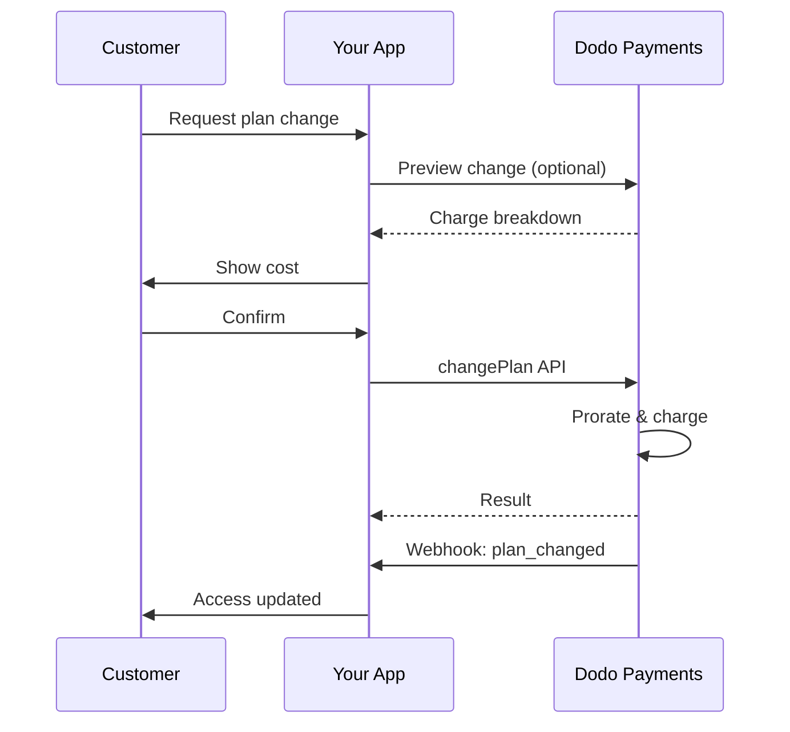
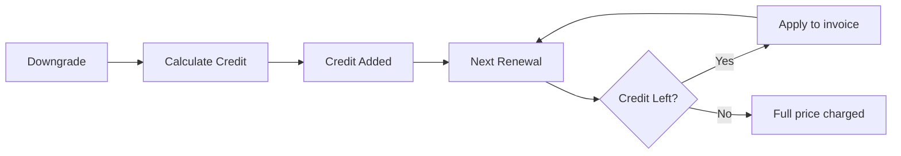
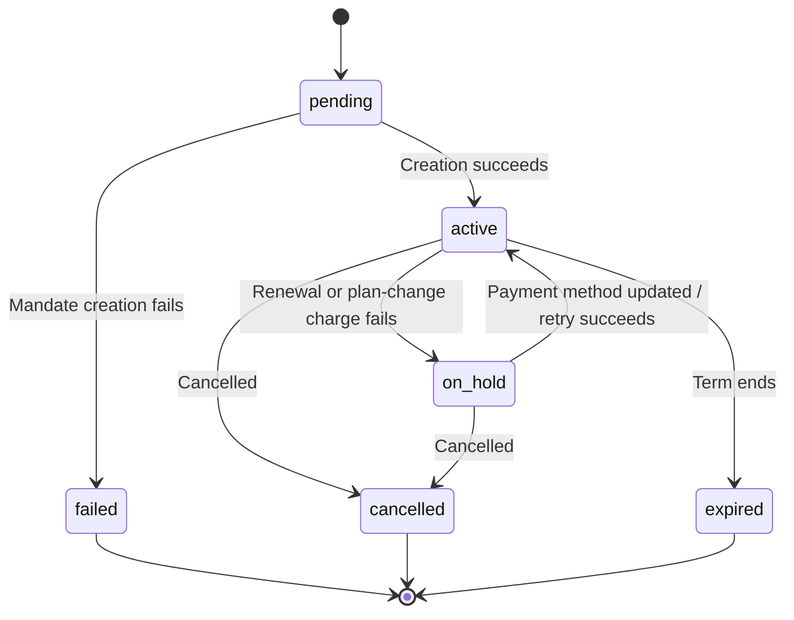

<Info>
Gli abbonamenti ti consentono di vendere accesso continuativo con rinnovi automatici. Usa cicli di fatturazione flessibili, periodi di prova gratuiti, modifiche dei piani e add-on per personalizzare i prezzi per ogni cliente.
</Info>

<CardGroup cols={2}>
<Card title="Upgrade & Downgrade" icon="repeat" href="/developer-resources/subscription-upgrade-downgrade">
Gestisci le modifiche dei piani con la proratazione e gli aggiornamenti delle quantità.
</Card>

<Card title="On‑Demand Subscriptions" icon="bolt" href="/developer-resources/ondemand-subscriptions">
Autorizza ora un mandato e addebita in seguito importi personalizzati.
</Card>

<Card title="Customer Portal" icon="id-card" href="/features/customer-portal">
Consenti ai clienti di gestire piani, fatturazione e cancellazioni.
</Card>

<Card title="Subscription Webhooks" icon="code" href="/developer-resources/webhooks/intents/subscription">
Reagisci agli eventi del ciclo di vita, come creazione, rinnovo e cancellazione.
</Card>
</CardGroup>

## Cosa sono gli abbonamenti?

Gli abbonamenti sono prodotti ricorrenti che i clienti acquistano secondo una determinata pianificazione. Sono ideali per:

- **Licenze SaaS**: app, API o accesso alla piattaforma
- **Membership**: community, programmi o club
- **Contenuti digitali**: corsi, media o contenuti premium
- **Piani di assistenza**: SLA, pacchetti di successo o manutenzione

## Vantaggi principali

- **Ricavi prevedibili**: fatturazione ricorrente con rinnovi automatici
- **Cicli flessibili**: intervalli mensili, annuali o personalizzati e periodi di prova
- **Flessibilità dei piani**: proratazione per upgrade e downgrade
- **Add-on e postazioni**: aggiungi upgrade opzionali e quantificabili
- **Checkout fluido**: checkout ospitato e Customer Portal
- **Developer-first**: API chiare per creazione, modifiche e monitoraggio dell'utilizzo

## Creazione degli abbonamenti

Crea i prodotti in abbonamento nella dashboard di Dodo Payments, quindi vendili tramite checkout o la tua API. Separare i prodotti dagli abbonamenti attivi ti consente di gestire le versioni dei prezzi, aggiungere add-on e monitorare le prestazioni in modo indipendente.

### Creazione di un prodotto in abbonamento

Configura i campi nella dashboard per definire come il tuo abbonamento viene venduto, rinnovato e fatturato. Le sezioni seguenti corrispondono direttamente a ciò che vedi nel modulo di creazione.

#### Dettagli del prodotto

- **Nome del prodotto** (obbligatorio): il nome visualizzato nel checkout, nel Customer Portal e nelle fatture.
- **Descrizione del prodotto** (obbligatorio): una descrizione chiara del valore offerto, visualizzata nel checkout e nelle fatture.
- **Immagine del prodotto** (obbligatorio): PNG/JPG/WebP fino a 3 MB. Utilizzata nel checkout e nelle fatture.
- **Brand**: associa il prodotto a un brand specifico per personalizzare tema ed email.
- **Categoria fiscale** (obbligatorio): scegli la categoria (ad esempio, SaaS) per determinare le regole fiscali.

<Tip>
Scegli la categoria fiscale più accurata per garantire una corretta riscossione delle imposte per ogni area geografica.
</Tip>

#### Prezzi

- **Tipo di prezzo**: scegli <b>Subscription</b> (questa guida). Le alternative sono Single Payment e Usage Based Billing.
- **Prezzo** (obbligatorio): prezzo ricorrente di base con valuta. Il prezzo deve essere almeno **$1** (o l'equivalente nella valuta scelta). Gli importi inferiori a questo minimo non sono supportati e l'abbonamento non funzionerà.
- **Sconto applicabile (%)**: sconto percentuale opzionale applicato al prezzo di base; visualizzato nel checkout e nelle fatture.
- **Ripeti il pagamento ogni** (obbligatorio): intervallo per i rinnovi, ad esempio ogni 1 Month. Seleziona la frequenza (mesi o anni) e la quantità.
- **Periodo dell'abbonamento** (obbligatorio): durata totale durante la quale l'abbonamento rimane attivo (ad esempio, 10 Years). Al termine di questo periodo, i rinnovi si interrompono salvo proroga.
- **Giorni del periodo di prova** (obbligatorio): imposta la durata del periodo di prova in giorni. Usa 0 per disabilitare i periodi di prova. Il primo addebito viene effettuato automaticamente al termine del periodo di prova.
- **Seleziona add-on**: associa fino a 10 add-on che i clienti possono acquistare insieme al piano base.

<Warning>
La modifica dei prezzi di un prodotto attivo influisce sui nuovi acquisti. Gli abbonamenti esistenti seguono le impostazioni di modifica del piano e di proratazione.
</Warning>

<Info>
Gli add-on sono ideali per extra quantificabili, come postazioni o spazio di archiviazione. Puoi controllare le quantità consentite e il comportamento della proratazione quando i clienti li modificano.
</Info>

#### Impostazioni avanzate

- **Prezzi con imposte incluse**: visualizza i prezzi comprensivi delle imposte applicabili. Il calcolo fiscale finale varia comunque in base alla posizione del cliente.
- **Genera chiavi di licenza**: emetti una chiave univoca per ogni cliente dopo l'acquisto. Consulta la guida <a href="/features/license-keys">License Keys</a>.
- **Distribuzione dei prodotti digitali**: distribuisci automaticamente file o contenuti dopo l'acquisto. Scopri di più in <a href="/features/digital-product-delivery">Digital Product Delivery</a>.
- **Metadati**: aggiungi coppie chiave-valore personalizzate per tag interni o integrazioni client. Consulta <a href="/api-reference/metadata">Metadata</a>.

<Tip>
Usa i metadati per memorizzare gli identificatori del tuo sistema (ad esempio, accountId), così potrai riconciliare in seguito eventi e fatture.
</Tip>

## Periodi di prova degli abbonamenti

I periodi di prova consentono ai clienti di accedere agli abbonamenti senza un pagamento immediato. Il primo addebito viene effettuato automaticamente al termine del periodo di prova.

### Configurazione dei periodi di prova

Imposta **Giorni del periodo di prova** nella sezione dei prezzi del prodotto (usa `0` per disabilitare). Puoi sostituire questo valore durante la creazione degli abbonamenti:

```typescript
// Via subscription creation
const subscription = await client.subscriptions.create({
  customer_id: 'cus_123',
  product_id: 'prod_monthly',
  trial_period_days: 14  // Overrides product's trial period
});

// Via checkout session
const session = await client.checkoutSessions.create({
  product_cart: [{ product_id: 'prod_monthly', quantity: 1 }],
  subscription_data: { trial_period_days: 14 }
});
```

<Warning>
Il valore `trial_period_days` deve essere compreso tra 0 e 10.000 giorni.
</Warning>

### Rilevamento dello stato del periodo di prova

<Warning>
Attualmente non esiste un campo diretto per rilevare lo stato del periodo di prova. La soluzione alternativa seguente richiede di interrogare i pagamenti, un'operazione inefficiente. Stiamo lavorando a una soluzione più efficiente.
</Warning>

Per determinare se un abbonamento è in periodo di prova, recupera l'elenco dei pagamenti dell'abbonamento. Se esiste esattamente un pagamento con importo 0, l'abbonamento è in periodo di prova:

```typescript
const subscription = await client.subscriptions.retrieve('sub_123');
const payments = await client.payments.list({
  subscription_id: subscription.subscription_id
});

// Check if subscription is in trial
const isInTrial = payments.items.length === 1 && 
                  payments.items[0].total_amount === 0;
```

### Aggiornamento del periodo di prova

Estendi il periodo di prova aggiornando `next_billing_date`:

```typescript
await client.subscriptions.update('sub_123', {
  next_billing_date: '2025-02-15T00:00:00Z'  // New trial end date
});
```

<Warning>
Non puoi impostare `next_billing_date` su un momento passato. La data deve essere futura.
</Warning>

## Modifiche dei piani degli abbonamenti

Le modifiche dei piani consentono di effettuare upgrade o downgrade degli abbonamenti, adeguare le quantità o passare a prodotti diversi. A seconda della modalità di proratazione selezionata, una modifica può attivare un addebito immediato, creare un credito oppure non applicare alcun adeguamento alla fatturazione.

<Tip>
Puoi modificare i piani degli abbonamenti e aggiornare direttamente la data di fatturazione successiva dalla dashboard di Dodo Payments. Questo offre un modo rapido per adeguare gli abbonamenti in risposta alle richieste dell'assistenza clienti, per upgrade promozionali o migrazioni di piano senza effettuare chiamate API.
</Tip>

<Tip>
**Abilita le modifiche dei piani self-service:** vuoi consentire ai clienti di effettuare autonomamente l'upgrade o il downgrade dei propri abbonamenti tramite Customer Portal? Aggiungi i prodotti in abbonamento a una Product Collection e abilita "Allow Subscription Updates" nelle Subscription Settings.
</Tip>



<Card title="Product Collections" icon="layer-group" href="/features/product-collections">
  Raggruppa i prodotti correlati in raccolte per abilitare percorsi fluidi di upgrade/downgrade nel Customer Portal.
</Card>

### Modalità di proratazione

Scegli come fatturare i clienti quando modificano i piani:

<Info>
**Confronto rapido delle quattro modalità di proratazione:**

| | `prorated_immediately` | `difference_immediately` | `full_immediately` | `do_not_bill` |
|---|---|---|---|---|
| **Upgrade** | Addebito proporzionato per i giorni rimanenti | Addebito dell'intera differenza di prezzo | Addebito dell'intero prezzo del nuovo piano | Nessun addebito — cambio immediato |
| **Downgrade** | Credito proporzionato per i giorni rimanenti | Intera differenza di prezzo come credito | Nessun credito, addebito completo | Nessun credito — cambio immediato |
| **Ciclo di fatturazione** | Si reimposta a oggi | Si reimposta a oggi | Si reimposta a oggi | Rimane invariato |
| **Ideale per** | Fatturazione equa basata sul tempo | Semplici modifiche di livello | Reimpostazione del ciclo di fatturazione | Migrazioni gratuite o cambi di cortesia |
</Info>

#### `prorated_immediately`
Addebita un importo proporzionato in base al tempo rimanente nel ciclo di fatturazione corrente. Ideale per una fatturazione equa che tenga conto del tempo non utilizzato.

```typescript
await client.subscriptions.changePlan('sub_123', {
  product_id: 'prod_pro',
  quantity: 1,
  proration_billing_mode: 'prorated_immediately'
});
```

#### `difference_immediately`
Addebita immediatamente la differenza di prezzo (upgrade) oppure aggiunge un credito ai rinnovi futuri (downgrade). Ideale per semplici scenari di upgrade/downgrade.

```typescript
// Upgrade: charges $50 (difference between $30 and $80)
// Downgrade: credits remaining value, auto-applied to renewals
await client.subscriptions.changePlan('sub_123', {
  product_id: 'prod_pro',
  quantity: 1,
  proration_billing_mode: 'difference_immediately'
});
```

<Info>
I crediti derivanti dai downgrade che utilizzano `difference_immediately` sono associati all'abbonamento e vengono applicati automaticamente ai rinnovi futuri. Sono distinti dalle disponibilità di <a href="/features/credit-based-billing">Credit-Based Billing</a>.
</Info>

Quando un cliente effettua un downgrade con `difference_immediately`, il valore non utilizzato diventa un credito associato all'abbonamento che compensa automaticamente i rinnovi futuri:



#### `full_immediately`
Addebita immediatamente l'intero importo del nuovo piano, ignorando il tempo rimanente. Ideale per reimpostare i cicli di fatturazione.

```typescript
await client.subscriptions.changePlan('sub_123', {
  product_id: 'prod_monthly',
  quantity: 1,
  proration_billing_mode: 'full_immediately'
});
```

#### `do_not_bill`
Passa al nuovo piano senza alcun adeguamento della fatturazione. Nessun addebito di proratazione e nessun credito: il cliente passa semplicemente al nuovo piano. Ideale per migrazioni di cortesia, passaggi a piani gratuiti o situazioni in cui vuoi assorbire la differenza di costo.

```typescript
await client.subscriptions.changePlan('sub_123', {
  product_id: 'prod_new_plan',
  quantity: 1,
  proration_billing_mode: 'do_not_bill'
});
```

<AccordionGroup>
<Accordion title="Example: Prorated upgrade calculation">

**Scenario**: un cliente con il piano Basic ($30/mese) effettua l'upgrade al piano Pro ($80/mese) il giorno 16 di un ciclo di 30 giorni utilizzando `prorated_immediately`.

```
Unused credit from Basic = $30 × (15 remaining / 30 total) = $15.00
Prorated cost of Pro     = $80 × (15 remaining / 30 total) = $40.00
────────────────────────────────────────────────────────────────────
Immediate charge         = $40.00 − $15.00 = $25.00
```

Il rinnovo successivo è il **15 febbraio** (16 gennaio + 30 giorni): **$80.00/mese**.

<Tip>
Per esempi di calcolo più dettagliati e casi limite, consulta la nostra [Guida a upgrade e downgrade](/developer-resources/subscription-upgrade-downgrade).
</Tip>

</Accordion>
<Accordion title="Example: Downgrade credit calculation">

**Scenario**: un cliente con il piano Pro ($80/mese) effettua il downgrade al piano Starter ($20/mese) utilizzando `difference_immediately`.

```
Credit = Old plan − New plan = $80 − $20 = $60.00
```

Il credito di $60 viene applicato automaticamente ai rinnovi futuri:
- Rinnovo 1: $20 − $20 (credito) = **$0.00** (credito residuo: $40)
- Rinnovo 2: $20 − $20 (credito) = **$0.00** (credito residuo: $20)  
- Rinnovo 3: $20 − $20 (credito) = **$0.00** (credito esaurito)
- Rinnovo 4: **$20.00** (prezzo completo)

<Info>
Scopri di più sulla gestione dei crediti nella [Guida a upgrade e downgrade](/developer-resources/subscription-upgrade-downgrade).
</Info>

</Accordion>
</AccordionGroup>

### Modifica dei piani con add-on

Modifica gli add-on quando cambi piano. Gli add-on sono inclusi nei calcoli della proratazione:

```typescript
await client.subscriptions.changePlan('sub_123', {
  product_id: 'prod_pro',
  quantity: 1,
  proration_billing_mode: 'difference_immediately',
  addons: [{ addon_id: 'addon_extra_seats', quantity: 2 }]  // Add add-ons
  // addons: []  // Empty array removes all existing add-ons
});
```

<Info>
Le modifiche dei piani attivano addebiti immediati. Gli addebiti non riusciti possono portare l'abbonamento allo stato `on_hold`. Monitora le modifiche tramite gli eventi webhook `subscription.plan_changed`.
</Info>

### Anteprima delle modifiche dei piani

Prima di confermare una modifica del piano, visualizza in anteprima l'addebito esatto e l'abbonamento risultante:

```typescript
const preview = await client.subscriptions.previewChangePlan('sub_123', {
  product_id: 'prod_pro',
  quantity: 1,
  proration_billing_mode: 'prorated_immediately'
});

// Show customer the charge before confirming
console.log('You will be charged:', preview.immediate_charge.summary);
```

<Card title="Preview Change Plan API" icon="eye" href="/api-reference/subscriptions/preview-change-plan">
  Visualizza in anteprima le modifiche del piano prima di confermarle.
</Card>

## Stati degli abbonamenti

Nel corso del suo ciclo di vita, un abbonamento attraversa un insieme definito di stati. Questa tabella è il riferimento per ogni stato, per le cause che lo determinano e per le modalità di recupero, ove disponibili.

| Stato | Significato | Recuperabile? | Percorso di recupero / passaggio successivo |
|--------|---------------|--------------|---------------------------|
| `pending` | L'abbonamento è in fase di creazione o elaborazione | — | Attendi `subscription.active` (o `subscription.failed`) |
| `active` | L'abbonamento è attivo e si rinnoverà automaticamente | — | Nessuna azione necessaria |
| `on_hold` | Un pagamento di rinnovo (o un addebito per la modifica del piano) non è riuscito; l'abbonamento è sospeso | **Sì** | Aggiorna il metodo di pagamento per riattivarlo — automaticamente tramite [Payment Retries](/features/recovery/payment-retries) e [Dunning](/features/recovery/subscription-dunning), oppure manualmente tramite la [Update Payment Method API](/api-reference/subscriptions/update-payment-method) |
| `cancelled` | L'abbonamento è stato cancellato e non verrà rinnovato | Solo nuovo acquisto | Il cliente deve avviare un nuovo abbonamento; [Dunning](/features/recovery/subscription-dunning) può sollecitare un nuovo acquisto |
| `failed` | La **creazione** dell'abbonamento non è riuscita (il mandato iniziale o il pagamento non è andato a buon fine) | **No — terminale** | Il cliente deve creare un nuovo abbonamento con un metodo di pagamento funzionante |
| `expired` | L'abbonamento ha raggiunto la fine del periodo | — | Il cliente deve avviare un nuovo abbonamento, se lo desidera |

<Warning>
`on_hold` e `failed` vengono spesso confusi. `on_hold` è uno stato **recuperabile** per un abbonamento già attivo il cui rinnovo non è riuscito. `failed` è uno stato **terminale** che si verifica solo quando la **creazione iniziale** dell'abbonamento non riesce: non può essere riattivato.
</Warning>

### Macchina a stati



### Stato On Hold

Un abbonamento entra nello stato `on_hold` quando:

- Un pagamento di rinnovo non riesce (fondi insufficienti, carta scaduta ecc.)
- Un addebito per la modifica del piano non riesce
- L'autorizzazione del metodo di pagamento non riesce

<Warning>
Quando un abbonamento si trova nello stato `on_hold`, non si rinnoverà automaticamente. Devi aggiornare il metodo di pagamento per riattivarlo.
</Warning>

### Riattivazione dallo stato On Hold

Per riattivare un abbonamento dallo stato `on_hold`, aggiorna il metodo di pagamento. Questa operazione automaticamente:

1. Crea un addebito per gli importi ancora dovuti
2. Genera una fattura
3. Elabora il pagamento utilizzando il nuovo metodo di pagamento
4. Riattiva l'abbonamento allo stato `active` dopo il pagamento riuscito

```typescript
// Reactivate subscription from on_hold
const response = await client.subscriptions.updatePaymentMethod('sub_123', {
  payment_method: {
    type: 'new',
    return_url: 'https://example.com/return'
  }
});

// For on_hold subscriptions, a charge is automatically created
if (response.payment_id) {
  console.log('Charge created:', response.payment_id);
  // Redirect customer to response.payment_link to complete payment
  // Monitor webhooks for payment.succeeded and subscription.active
}
```

<Info>
Dopo aver aggiornato correttamente il metodo di pagamento per un abbonamento `on_hold`, riceverai gli eventi webhook `payment.succeeded` seguiti da `subscription.active`.
</Info>

### Eventi webhook per transizione

Ogni transizione genera un webhook, così puoi gestire la logica delle autorizzazioni senza ricorrere al polling:

| Transizione | Evento |
|------------|-------|
| Abbonamento attivato | `subscription.active` |
| Rinnovo riuscito | `subscription.renewed` |
| Rinnovo non riuscito → sospeso | `subscription.on_hold` |
| Creazione non riuscita | `subscription.failed` |
| Piano aumentato/ridotto | `subscription.plan_changed` |
| Cancellato | `subscription.cancelled` |
| Periodo terminato | `subscription.expired` |
| Modifica di qualsiasi campo | `subscription.updated` |

<Card title="Subscription Webhook Payloads" icon="webhook" href="/developer-resources/webhooks/intents/subscription">
Visualizza lo schema completo del payload per gli eventi del ciclo di vita degli abbonamenti.
</Card>

## Gestione tramite API

<AccordionGroup>
<Accordion title="Create subscriptions">
Usa `POST /subscriptions` per creare abbonamenti programmaticamente a partire dai prodotti, con periodi di prova e add-on opzionali.

<Card title="API Reference" icon="code" href="/api-reference/subscriptions/post-subscriptions">
Visualizza l'API per la creazione degli abbonamenti.
</Card>
</Accordion>

<Accordion title="Update subscriptions">
Usa `PATCH /subscriptions/{id}` per aggiornare le quantità, cancellare alla data di fatturazione successiva o modificare i metadati.

<Card title="API Reference" icon="code" href="/api-reference/subscriptions/patch-subscriptions">
Scopri come aggiornare i dettagli dell'abbonamento.
</Card>
</Accordion>

<Accordion title="Change plans (proration)">
Modifica il prodotto attivo e le quantità con i controlli di proratazione.

<Card title="API Reference" icon="code" href="/api-reference/subscriptions/change-plan">
Esamina le opzioni di modifica del piano.
</Card>
</Accordion>

<Accordion title="On‑demand charges">
Per gli abbonamenti on-demand, addebita importi specifici su richiesta.

<Card title="API Reference" icon="code" href="/api-reference/subscriptions/create-charge">
Addebita un abbonamento on-demand.
</Card>
</Accordion>

<Accordion title="List and retrieve">
Usa `GET /subscriptions` per elencare tutti gli abbonamenti e `GET /subscriptions/{id}` per recuperarne uno.

<Card title="API Reference" icon="code" href="/api-reference/subscriptions/get-subscriptions">
Consulta le API di elenco e recupero.
</Card>
</Accordion>

<Accordion title="Usage history">
Recupera l'utilizzo registrato per i modelli di prezzo a consumo o ibridi.

<Card title="API Reference" icon="code" href="/api-reference/subscriptions/get-usage-history">
Consulta l'API della cronologia dell'utilizzo.
</Card>
</Accordion>

<Accordion title="Update payment method">
Aggiorna il metodo di pagamento per un abbonamento. Per gli abbonamenti attivi, questa operazione aggiorna il metodo di pagamento per i rinnovi futuri. Per gli abbonamenti nello stato `on_hold`, riattiva l'abbonamento creando un addebito per gli importi ancora dovuti.

Quando generi un nuovo link per il metodo di pagamento (il tipo di richiesta `New`), puoi passare `allowed_payment_method_types` per limitare i metodi di pagamento visualizzati dal cliente in quella pagina. I clienti non vedranno mai un metodo che non è incluso nell'elenco, anche se l'inclusione di un metodo non ne garantisce la visualizzazione (la disponibilità dipende comunque da fattori come la posizione del cliente e le impostazioni della tua attività).

<Card title="API Reference" icon="code" href="/api-reference/subscriptions/update-payment-method">
Scopri come aggiornare i metodi di pagamento e riattivare gli abbonamenti.
</Card>
</Accordion>
</AccordionGroup>

## Casi d'uso comuni

- **SaaS e API**: accesso a livelli con add-on per postazioni o utilizzo
- **Contenuti e media**: accesso mensile con periodi di prova introduttivi
- **Piani di assistenza B2B**: contratti annuali con add-on di assistenza premium
- **Strumenti e plugin**: chiavi di licenza e release versionate

## Esempi di integrazione

### Checkout Sessions (subscriptions)
Quando crei checkout sessions, includi il prodotto in abbonamento e gli eventuali add-on:

```typescript
const session = await client.checkoutSessions.create({
  product_cart: [
    {
      product_id: 'prod_subscription',
      quantity: 1
    }
  ]
});
```

### Modifiche dei piani con proratazione
Effettua l'upgrade o il downgrade di un abbonamento e controlla il comportamento della proratazione:

```typescript
await client.subscriptions.changePlan('sub_123', {
  product_id: 'prod_new',
  quantity: 1,
  proration_billing_mode: 'difference_immediately'
});
```

### Cancellazione alla data di fatturazione successiva
Pianifica una cancellazione che avrà effetto al termine del periodo di fatturazione corrente:

```typescript
await client.subscriptions.update('sub_123', {
  cancel_at_next_billing_date: true
});
```

### Estensione del periodo dell'abbonamento
Estendi la durata di un abbonamento passando un nuovo `subscription_period_count` e `subscription_period_interval` a `PATCH /subscriptions/{id}`. La scadenza dell'abbonamento viene ricalcolata in base al nuovo conteggio e intervallo — ad esempio, per concedere a un cliente tempo aggiuntivo sul piano corrente:

```typescript
await client.subscriptions.update('sub_123', {
  subscription_period_count: 5,
  subscription_period_interval: 'Month'
});
```

<Note>
Il periodo di un abbonamento può solo essere **aumentato**, mai ridotto.
</Note>

### Abbonamenti on-demand
Crea un abbonamento on-demand e addebita in seguito secondo necessità:

```typescript
const onDemand = await client.subscriptions.create({
  customer_id: 'cus_123',
  product_id: 'prod_on_demand',
  on_demand: { mandate_only: true }
});

await client.subscriptions.charge(onDemand.id, {
  product_price: 4900,
  product_currency: 'USD',
  product_description: 'Extra usage for September'
});
```

### Aggiornamento del metodo di pagamento per un abbonamento attivo
Aggiorna il metodo di pagamento per un abbonamento attivo:

```typescript
// Update with new payment method
const response = await client.subscriptions.updatePaymentMethod('sub_123', {
  payment_method: {
    type: 'new',
    return_url: 'https://example.com/return'
  }
});

// Or use existing payment method
await client.subscriptions.updatePaymentMethod('sub_123', {
  payment_method: {
    type: 'existing',
    payment_method_id: 'pm_abc123'
  }
});
```

### Riattivazione di un abbonamento dallo stato on_hold
Riattiva un abbonamento sospeso a causa di un pagamento non riuscito:

```typescript
// Update payment method - automatically creates charge for remaining dues
const response = await client.subscriptions.updatePaymentMethod('sub_123', {
  payment_method: {
    type: 'new',
    return_url: 'https://example.com/return'
  }
});

if (response.payment_id) {
  // Charge created for remaining dues
  // Redirect customer to response.payment_link
  // Monitor webhooks: payment.succeeded → subscription.active
}
```

## Abbonamenti con mandati conformi alle norme RBI

  Gli abbonamenti UPI e con carte indiane operano secondo le normative RBI (Reserve Bank of India), con requisiti specifici per i mandati:

  ### Limiti dei mandati

  Il tipo e l'importo del mandato dipendono dall'addebito ricorrente del tuo abbonamento:

  - **Addebiti inferiori alla soglia del mandato (₹15.000 per impostazione predefinita):** creiamo un mandato on-demand per l'importo della soglia. L'importo dell'abbonamento viene addebitato periodicamente in base alla frequenza dell'abbonamento, fino al limite del mandato.
  - **Addebiti pari o superiori alla soglia del mandato:** creiamo un mandato per abbonamento (o un mandato on-demand) per l'importo esatto dell'abbonamento.

  La soglia del mandato è configurabile per merchant o per richiesta tramite `mandate_min_amount_inr_paise` (paise INR). L'importo registrato presso la banca è `max(mandate_floor, billing_amount)` — pertanto la soglia diventa di fatto il limite di autorizzazione visibile al cliente ogni volta che la fatturazione è inferiore.

Per informazioni dettagliate sui mandati conformi alle norme RBI e sulla soglia del mandato configurabile per i metodi di pagamento indiani, consulta la pagina <a href="/features/payment-methods/india#configurable-mandate-floor">India Payment Methods</a>.

  ### Considerazioni su upgrade e downgrade

  **Importante:** quando effettui l'upgrade o il downgrade degli abbonamenti, considera attentamente i limiti dei mandati:

  - Se un upgrade o downgrade produce un importo di addebito superiore a Rs 15.000 e oltrepassa il limite di pagamento on-demand esistente, l'addebito della transazione potrebbe non riuscire.
  - In questi casi, il cliente potrebbe dover aggiornare il metodo di pagamento o modificare nuovamente l'abbonamento per stabilire un nuovo mandato con il limite corretto.

  ### Autorizzazione per addebiti di importo elevato

  Per addebiti dell'abbonamento pari o superiori a Rs 15.000:

  - La banca chiederà al cliente di autorizzare la transazione.
  - Se il cliente non autorizza la transazione, questa non andrà a buon fine e l'abbonamento verrà sospeso.

  ### Ritardo di elaborazione di 48 ore

  **Tempistiche di elaborazione:** gli addebiti ricorrenti sulle carte indiane e sugli abbonamenti UPI seguono un modello di elaborazione specifico:

  - Gli addebiti vengono **avviati** nella data prevista in base alla frequenza dell'abbonamento.
  - L'effettiva **detrazione** dal conto del cliente avviene solo dopo **48 ore** dall'avvio del pagamento.
  - Questa finestra di 48 ore può estendersi fino a **2-3 ore aggiuntive** a seconda delle risposte delle API bancarie.

  ### Finestra di cancellazione del mandato

  Durante la finestra di elaborazione di 48 ore:

  - I clienti possono cancellare il mandato tramite le proprie app bancarie.
  - Se un cliente cancella il mandato durante questo periodo, l'abbonamento rimarrà **attivo** (si tratta di un caso limite specifico per gli abbonamenti Indian card e UPI AutoPay).
  - Tuttavia, la detrazione effettiva potrebbe non riuscire e, in tal caso, metteremo l'abbonamento **on hold**.

  **Gestione dei casi limite:** se fornisci vantaggi, crediti o utilizzo dell'abbonamento ai clienti immediatamente dopo l'avvio dell'addebito, devi gestire adeguatamente questa finestra di 48 ore nella tua applicazione. Valuta di:

  - Ritardare l'attivazione dei vantaggi fino alla conferma del pagamento
  - Implementare periodi di tolleranza o accesso temporaneo
  - Monitorare lo stato dell'abbonamento per rilevare le cancellazioni dei mandati
  - Gestire gli stati di sospensione dell'abbonamento nella logica dell'applicazione

  <Tip>
  Monitora i webhook degli abbonamenti per seguire le modifiche dello stato dei pagamenti e gestire i casi limite in cui i mandati vengono cancellati durante la finestra di 48 ore.
  </Tip>

## Best practice

- **Inizia con livelli chiari**: 2–3 piani con differenze evidenti
- **Comunica i prezzi**: mostra i totali, la proratazione e il rinnovo successivo
- **Usa i periodi di prova con criterio**: converti con l'onboarding, non solo con il tempo
- **Sfrutta gli add-on**: mantieni semplici i piani base e proponi extra aggiuntivi
- **Testa le modifiche**: convalida le modifiche dei piani e la proratazione in modalità di test

<Info>
Gli abbonamenti sono una base flessibile per i ricavi ricorrenti. Inizia in modo semplice, testa accuratamente e migliora iterativamente in base alle metriche di adozione, churn ed espansione.
</Info>