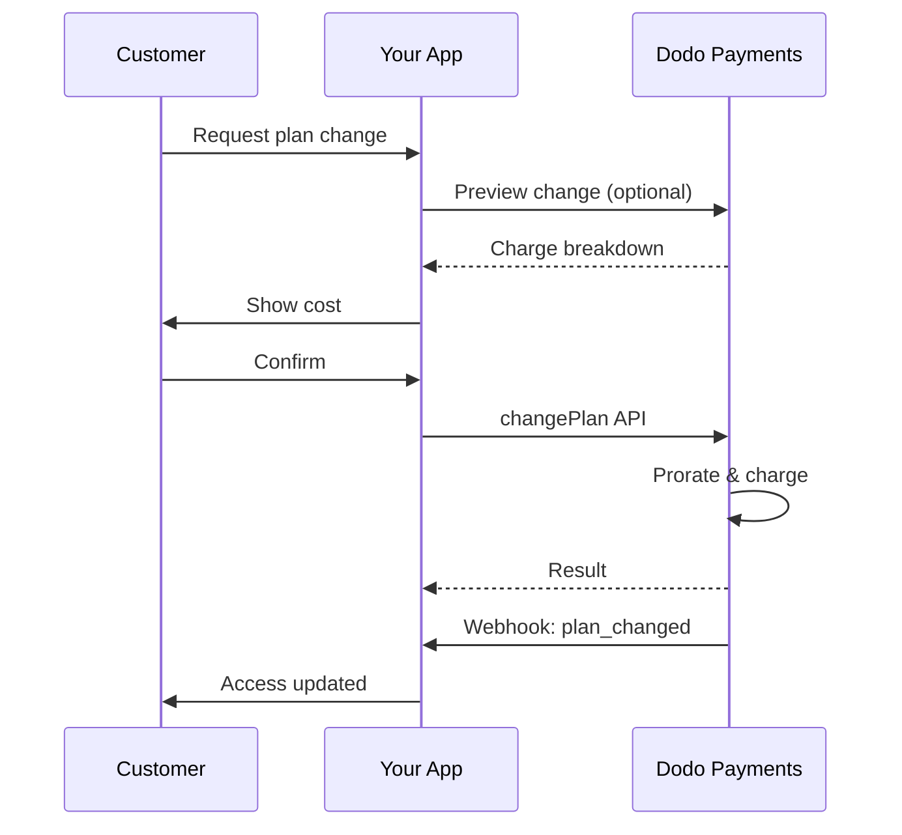
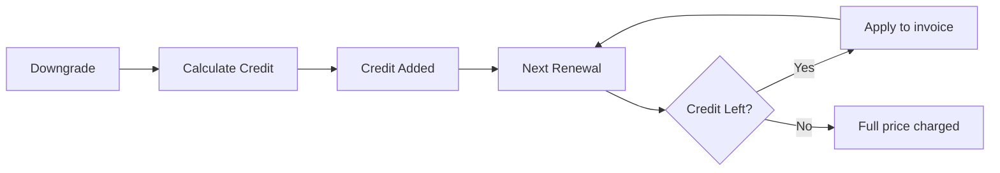
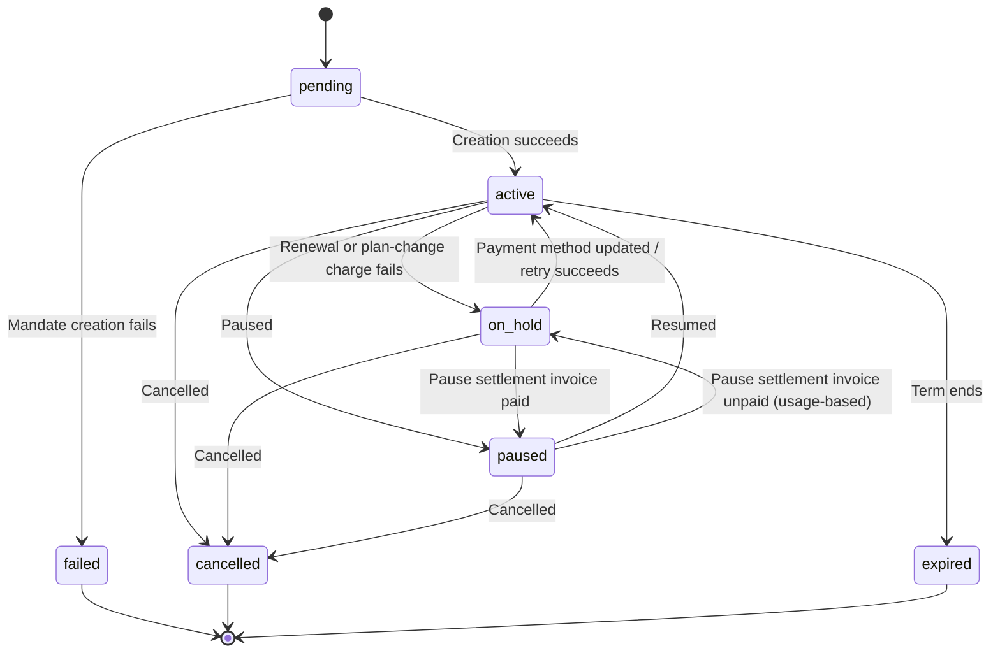

<Info>
Gli abbonamenti ti consentono di vendere accesso continuativo con rinnovi automatici. Usa cicli di fatturazione flessibili, periodi di prova gratuiti, modifiche dei piani e add-on per personalizzare i prezzi per ogni cliente.
</Info>

<CardGroup cols={2}>
<Card title="Upgrade & Downgrade" icon="repeat" href="/developer-resources/subscription-upgrade-downgrade">
Gestisci le modifiche dei piani con la proratazione e gli aggiornamenti delle quantità.
</Card>

<Card title="On‑Demand Subscriptions" icon="bolt" href="/developer-resources/ondemand-subscriptions">
Autorizza ora un mandato e addebita in seguito importi personalizzati.
</Card>

<Card title="Customer Portal" icon="id-card" href="/features/customer-portal">
Consenti ai clienti di gestire piani, fatturazione e cancellazioni.
</Card>

<Card title="Subscription Webhooks" icon="code" href="/developer-resources/webhooks/intents/subscription">
Reagisci agli eventi del ciclo di vita, come creazione, rinnovo e cancellazione.
</Card>
</CardGroup>

## Cosa sono gli abbonamenti?

Gli abbonamenti sono prodotti ricorrenti che i clienti acquistano secondo una determinata pianificazione. Sono ideali per:

- **Licenze SaaS**: app, API o accesso alla piattaforma
- **Membership**: community, programmi o club
- **Contenuti digitali**: corsi, media o contenuti premium
- **Piani di assistenza**: SLA, pacchetti di successo o manutenzione

## Vantaggi principali

- **Ricavi prevedibili**: fatturazione ricorrente con rinnovi automatici
- **Cicli flessibili**: intervalli mensili, annuali o personalizzati e periodi di prova
- **Flessibilità dei piani**: proratazione per upgrade e downgrade
- **Add-on e postazioni**: aggiungi upgrade opzionali e quantificabili
- **Checkout fluido**: checkout ospitato e Customer Portal
- **Developer-first**: API chiare per creazione, modifiche e monitoraggio dell'utilizzo

## Creazione degli abbonamenti

Crea i prodotti in abbonamento nella dashboard di Dodo Payments, quindi vendili tramite checkout o la tua API. Separare i prodotti dagli abbonamenti attivi ti consente di gestire le versioni dei prezzi, aggiungere add-on e monitorare le prestazioni in modo indipendente.

### Creazione di un prodotto in abbonamento

Configura i campi nella dashboard per definire come il tuo abbonamento viene venduto, rinnovato e fatturato. Le sezioni seguenti corrispondono direttamente a ciò che vedi nel modulo di creazione.

#### Dettagli del prodotto

- **Nome del prodotto** (obbligatorio): il nome visualizzato nel checkout, nel Customer Portal e nelle fatture.
- **Descrizione del prodotto** (obbligatorio): una descrizione chiara del valore offerto, visualizzata nel checkout e nelle fatture.
- **Immagine del prodotto** (obbligatorio): PNG/JPG/WebP fino a 3 MB. Utilizzata nel checkout e nelle fatture.
- **Brand**: associa il prodotto a un brand specifico per personalizzare tema ed email.
- **Categoria fiscale** (obbligatorio): scegli la categoria (ad esempio, SaaS) per determinare le regole fiscali.

<Tip>
Scegli la categoria fiscale più accurata per garantire una corretta riscossione delle imposte per ogni area geografica.
</Tip>

#### Prezzi

- **Tipo di prezzo**: scegli <b>Subscription</b> (questa guida). Le alternative sono Pagamento singolo e Fatturazione basata sull'utilizzo.
- **Prezzo** (obbligatorio): prezzo ricorrente di base con valuta. Il prezzo deve essere almeno **$1** (o l'equivalente nella valuta scelta). Gli importi inferiori a questo minimo non sono supportati e la subscription non funzionerà.
- **Sconto applicabile (%)**: percentuale di sconto facoltativa applicata al prezzo di base; viene mostrata nel checkout e nelle fatture.
- **Ripeti il pagamento ogni** (obbligatorio): intervallo per i rinnovi, ad esempio ogni 1 mese. Seleziona la frequenza (mesi o anni) e la quantità.
- **Periodo della subscription** (obbligatorio): durata totale per cui la subscription rimane attiva (ad esempio 10 anni). Al termine di questo periodo, i rinnovi si interrompono se non vengono estesi.
- **Giorni del periodo di prova** (obbligatorio): imposta la durata della prova in giorni. Usa 0 per disabilitare le prove. Il primo addebito avviene automaticamente al termine della prova.
- **Importo della prova**: addebito anticipato facoltativo per una prova a pagamento. Lascialo non impostato per una prova gratuita. Consulta [Prove a pagamento](#paid-trials).
- **Seleziona add-on**: associa fino a 10 add-on che i clienti possono acquistare insieme al piano di base.

<Warning>
La modifica dei prezzi di un prodotto attivo influisce sui nuovi acquisti. Gli abbonamenti esistenti seguono le impostazioni di modifica del piano e di proratazione.
</Warning>

<Info>
Gli add-on sono ideali per extra quantificabili, come postazioni o spazio di archiviazione. Puoi controllare le quantità consentite e il comportamento della proratazione quando i clienti li modificano.
</Info>

#### Impostazioni avanzate

- **Prezzi con imposte incluse**: visualizza i prezzi comprensivi delle imposte applicabili. Il calcolo fiscale finale varia comunque in base alla posizione del cliente.
- **Genera chiavi di licenza**: emetti una chiave univoca per ogni cliente dopo l'acquisto. Consulta la guida <a href="/features/license-keys">License Keys</a>.
- **Distribuzione dei prodotti digitali**: distribuisci automaticamente file o contenuti dopo l'acquisto. Scopri di più in <a href="/features/digital-product-delivery">Digital Product Delivery</a>.
- **Metadati**: aggiungi coppie chiave-valore personalizzate per tag interni o integrazioni client. Consulta <a href="/api-reference/metadata">Metadata</a>.

<Tip>
Usa i metadati per memorizzare gli identificatori del tuo sistema (ad esempio, accountId), così potrai riconciliare in seguito eventi e fatture.
</Tip>

## Periodi di prova degli abbonamenti

Le prove consentono ai clienti di valutare una subscription prima di pagare il prezzo ricorrente completo. Una prova può essere **gratuita**, senza alcun addebito fino alla sua scadenza, oppure **a pagamento**, con un importo ridotto addebitato in anticipo. In entrambi i casi, il prezzo completo entra in vigore al primo rinnovo successivo alla fine della prova.

### Configurazione dei periodi di prova

Imposta **Giorni del periodo di prova** nella sezione dei prezzi del prodotto (usa `0` per disabilitare). Puoi sostituire questo valore durante la creazione degli abbonamenti:

```typescript
// Via subscription creation
const subscription = await client.subscriptions.create({
  customer: { customer_id: 'cus_123' },
  billing: { country: 'US' },
  product_id: 'pdt_monthly',
  quantity: 1,
  trial_period_days: 14  // Overrides product's trial period
});

// Via checkout session
const session = await client.checkoutSessions.create({
  product_cart: [{ product_id: 'pdt_monthly', quantity: 1 }],
  subscription_data: { trial_period_days: 14 }
});
```

<Warning>
Il valore `trial_period_days` deve essere compreso tra 0 e 10.000 giorni.
</Warning>

### Prove a pagamento

Le prove non devono necessariamente essere gratuite. Imposta un **Importo della prova** sul prezzo ricorrente di un prodotto in subscription per addebitare una tariffa anticipata ridotta durante il periodo di prova. Il prezzo ricorrente completo subentra al primo rinnovo.

<Frame>

</Frame>

Le prove a pagamento vengono configurate sul prezzo del prodotto, non per subscription o sessione di checkout:

| Campo | Tipo | Descrizione |
|-------|------|-------------|
| `trial_amount` | integer | Importo addebitato oggi per la prova, nelle unità minori della valuta del prezzo (ad esempio `500` per $5.00). Richiede `trial_period_days > 0`. Ometti il valore o impostalo su `null` per una prova gratuita. |
| `trial_apply_discounts` | boolean | Indica se i codici sconto del checkout riducono l'addebito della prova. Il valore predefinito è `false`, quindi l'importo della prova viene addebitato per intero anche quando lo sconto si applica al prezzo ricorrente. |

```typescript
const product = await client.products.create({
  name: 'Pro Plan',
  tax_category: 'saas',
  price: {
    type: 'recurring_price',
    price: 2900,                      // $29.00 per month after the trial
    currency: 'USD',
    discount: 0,
    purchasing_power_parity: false,
    payment_frequency_count: 1,
    payment_frequency_interval: 'Month',
    subscription_period_count: 1,
    subscription_period_interval: 'Year',
    trial_period_days: 14,            // A paid trial requires a positive trial period
    trial_amount: 500,                // $5.00 charged today
    trial_apply_discounts: false      // Discounts apply to the recurring price only
  }
});
```

Anche le prove a pagamento passano dal checkout. L'importo della prova è soggetto a imposte, viene mostrato nei calcoli della sessione di checkout e nei prezzi dei payment link, e il markup di Adaptive Currency viene applicato per valuta. L'[endpoint di anteprima](/developer-resources/checkout-session) restituisce `trial_amount` e `trial_period_days`, così puoi mostrare l'importo dovuto oggi prima della creazione della subscription.

<Info>
Le prove gratuite non cambiano. Lasciare non impostato **Importo della prova** mantiene il comportamento esistente: il primo addebito è `0` e il prezzo completo viene addebitato al termine della prova.
</Info>

### Prevenire l'uso improprio delle prove

**Previeni l'uso improprio delle prove** impedisce ai clienti di richiedere ripetutamente prove per la stessa attività. Quando è abilitata, un cliente che ha già usufruito di una prova viene automaticamente convertito in un **acquisto a pagamento senza prova**, invece di ricevere una nuova prova.

<Frame>

</Frame>

Abilitalo dalla scheda **Subscriptions** in **Impostazioni**. Dopo l'abilitazione:

- I clienti vengono associati tramite **email normalizzata**, rimuovendo gli alias con il simbolo +; quindi `user+trial@example.com` e `user@example.com` vengono considerati la stessa persona.
- Le registrazioni vengono effettuate all'**attivazione della prova**, quindi un cliente che annulla nello stesso giorno ha comunque consumato la prova.
- I clienti esistenti vengono recuperati in base alle prove storiche tramite email, per riconoscere immediatamente gli utenti che hanno usufruito di prove in passato.

<Info>
L'impostazione è **disattivata per impostazione predefinita**. Consulta [Impostazioni delle Subscriptions](/features/product-collections#subscription-settings) per l'elenco completo dei controlli delle subscription a livello di attività.
</Info>

### Rilevare lo stato della prova

<Warning>
Al momento non esiste un campo diretto per rilevare lo stato della prova. La soluzione alternativa seguente richiede l'interrogazione dei pagamenti, che è inefficiente. Stiamo lavorando a una soluzione più efficiente.
</Warning>

Per determinare se una subscription con **prova gratuita** è in prova, recupera l'elenco dei pagamenti della subscription. Se esiste esattamente un pagamento con importo 0, la subscription si trova nel periodo di prova:

```typescript
const subscription = await client.subscriptions.retrieve('sub_123');
const payments = await client.payments.list({
  subscription_id: subscription.subscription_id
});

// Check if subscription is in trial
const isInTrial = payments.items.length === 1 && 
                  payments.items[0].total_amount === 0;
```

<Warning>
Questo controllo dell'importo zero funziona solo per le prove gratuite. Per una [prova a pagamento](#paid-trials), il primo pagamento è uguale all'importo della prova, non a `0`. Confronta invece il primo pagamento con `trial_amount` della subscription, oppure verifica se `next_billing_date` rientra ancora nel periodo di prova.
</Warning>

### Aggiornare il periodo di prova

Estendi la prova aggiornando `next_billing_date`:

```typescript
await client.subscriptions.update('sub_123', {
  next_billing_date: '2025-02-15T00:00:00Z'  // New trial end date
});
```

<Warning>
Non puoi impostare `next_billing_date` su un momento passato. La data deve essere futura.
</Warning>

## Modifiche al piano della subscription

Le modifiche al piano consentono di effettuare upgrade o downgrade delle subscription, modificare le quantità o migrare a prodotti diversi. A seconda della modalità di proratazione selezionata, una modifica può generare un addebito immediato, creare un credito oppure non applicare alcun adeguamento di fatturazione.

<Tip>
Puoi modificare i piani delle subscription e aggiornare la data della fatturazione successiva direttamente dalla dashboard di Dodo Payments. In questo modo puoi adeguare rapidamente le subscription per richieste all'assistenza clienti, upgrade promozionali o migrazioni di piano senza effettuare chiamate API.
</Tip>

<Tip>
**Abilita le modifiche al piano self-service:** vuoi consentire ai clienti di effettuare autonomamente upgrade o downgrade delle proprie subscription tramite il Customer Portal? Aggiungi i prodotti in subscription a una Product Collection e abilita "Allow Subscription Updates" nelle impostazioni della subscription.
</Tip>



<Card title="Product Collections" icon="layer-group" href="/features/product-collections">
  Raggruppa i prodotti correlati in raccolte per abilitare percorsi fluidi di upgrade e downgrade nel Customer Portal.
</Card>

### Modalità di proratazione

Scegli come addebitare i clienti quando modificano il piano:

<Info>
**Confronto rapido delle quattro modalità di proratazione:**

| | `prorated_immediately` | `difference_immediately` | `full_immediately` | `do_not_bill` |
|---|---|---|---|---|
| **Upgrade** | Addebito proporzionato per i giorni restanti | Addebito della differenza di prezzo completa | Addebito del prezzo completo del nuovo piano | Nessun addebito — cambio immediato |
| **Downgrade** | Credito proporzionato per i giorni restanti | Differenza di prezzo completa come credito | Nessun credito, addebito completo | Nessun credito — cambio immediato |
| **Ciclo di fatturazione** | Si reimposta a oggi | Si reimposta a oggi | Si reimposta a oggi | Rimane invariato |
| **Ideale per** | Fatturazione equa basata sul tempo | Semplici modifiche di livello | Reimpostazione del ciclo di fatturazione | Migrazioni gratuite o cambi omaggio |
</Info>

#### `prorated_immediately`
Addebita un importo proporzionato in base al tempo rimanente nel ciclo di fatturazione corrente. Ideale per una fatturazione equa che tenga conto del tempo non utilizzato.

```typescript
await client.subscriptions.changePlan('sub_123', {
  product_id: 'pdt_pro',
  quantity: 1,
  proration_billing_mode: 'prorated_immediately'
});
```

#### `difference_immediately`
Addebita immediatamente la differenza di prezzo (upgrade) oppure aggiunge un credito per i rinnovi futuri (downgrade). Ideale per semplici scenari di upgrade e downgrade.

```typescript
// Upgrade: charges $50 (difference between $30 and $80)
// Downgrade: credits remaining value, auto-applied to renewals
await client.subscriptions.changePlan('sub_123', {
  product_id: 'pdt_pro',
  quantity: 1,
  proration_billing_mode: 'difference_immediately'
});
```

<Info>
I crediti derivanti dai downgrade che usano `difference_immediately` sono associati alla subscription e vengono applicati automaticamente ai rinnovi futuri. Sono distinti dai vantaggi di <a href="/features/credit-based-billing">Credit-Based Billing</a>.
</Info>

Quando un cliente effettua un downgrade con `difference_immediately`, il valore non utilizzato diventa un credito associato alla subscription, che compensa automaticamente i rinnovi futuri:



#### `full_immediately`
Addebita immediatamente l'intero importo del nuovo piano, ignorando il tempo rimanente. Ideale per reimpostare i cicli di fatturazione.

```typescript
await client.subscriptions.changePlan('sub_123', {
  product_id: 'pdt_monthly',
  quantity: 1,
  proration_billing_mode: 'full_immediately'
});
```

#### `do_not_bill`
Passa al nuovo piano senza alcun adeguamento di fatturazione. Nessun addebito di proratazione e nessun credito: il cliente passa semplicemente al nuovo piano. Ideale per migrazioni omaggio, cambi a piani gratuiti o scenari in cui vuoi assorbire la differenza di costo.

```typescript
await client.subscriptions.changePlan('sub_123', {
  product_id: 'pdt_new_plan',
  quantity: 1,
  proration_billing_mode: 'do_not_bill'
});
```

<AccordionGroup>
<Accordion title="Example: Prorated upgrade calculation">

**Scenario**: un cliente con Basic ($30/mese) effettua l'upgrade a Pro ($80/mese) il giorno 16 di un ciclo di 30 giorni usando `prorated_immediately`.

```
Unused credit from Basic = $30 × (15 remaining / 30 total) = $15.00
Prorated cost of Pro     = $80 × (15 remaining / 30 total) = $40.00
────────────────────────────────────────────────────────────────────
Immediate charge         = $40.00 − $15.00 = $25.00
```

Il rinnovo successivo è il **15 febbraio** (16 gennaio + 30 giorni): **$80.00/mese**.

<Tip>
Per esempi di calcolo e casi limite più dettagliati, consulta la [Guida completa a upgrade e downgrade](/developer-resources/subscription-upgrade-downgrade).
</Tip>

</Accordion>
<Accordion title="Example: Downgrade credit calculation">

**Scenario**: un cliente con Pro ($80/mese) effettua il downgrade a Starter ($20/mese) usando `difference_immediately`.

```
Credit = Old plan − New plan = $80 − $20 = $60.00
```

Il credito di $60 viene applicato automaticamente ai rinnovi futuri:
- Rinnovo 1: $20 − $20 (credito) = **$0.00** (credito residuo: $40)
- Rinnovo 2: $20 − $20 (credito) = **$0.00** (credito residuo: $20)  
- Rinnovo 3: $20 − $20 (credito) = **$0.00** (credito esaurito)
- Rinnovo 4: **$20.00** (prezzo completo)

<Info>
Scopri di più sulla gestione dei crediti nella [Guida a upgrade e downgrade](/developer-resources/subscription-upgrade-downgrade).
</Info>

</Accordion>
</AccordionGroup>

### Modificare i piani con gli add-on

Modifica gli add-on quando cambi piano. Gli add-on sono inclusi nei calcoli della proratazione:

```typescript
await client.subscriptions.changePlan('sub_123', {
  product_id: 'pdt_pro',
  quantity: 1,
  proration_billing_mode: 'difference_immediately',
  addons: [{ addon_id: 'addon_extra_seats', quantity: 2 }]  // Add add-ons
  // addons: []  // Empty array removes all existing add-ons
});
```

<Info>
Per impostazione predefinita (`effective_at: 'immediately'`), le modifiche al piano comportano addebiti immediati. Passa `effective_at: 'next_billing_date'` per programmare la modifica alla prossima data di fatturazione; la modifica in sospeso viene restituita sulla subscription come `scheduled_change` e puoi annullarla con [Annulla modifica del piano programmata](/api-reference/subscriptions/cancel-change-plan). Gli addebiti non riusciti possono spostare la subscription allo stato `on_hold`, a meno che tu non passi `on_payment_failure: 'prevent_change'`, che mantiene la subscription sul piano attuale finché il pagamento non va a buon fine. Monitora le modifiche tramite gli eventi webhook `subscription.plan_changed`.
</Info>

### Visualizzare in anteprima le modifiche al piano

Prima di confermare una modifica al piano, visualizza in anteprima l'addebito esatto e la subscription risultante:

```typescript
const preview = await client.subscriptions.previewChangePlan('sub_123', {
  product_id: 'pdt_pro',
  quantity: 1,
  proration_billing_mode: 'prorated_immediately'
});

// Show customer the charge before confirming
console.log('You will be charged:', preview.immediate_charge.summary);
```

<Card title="Preview Change Plan API" icon="eye" href="/api-reference/subscriptions/preview-change-plan">
  Visualizza in anteprima le modifiche al piano prima di confermarle.
</Card>

## Sospensione e ripresa degli abbonamenti

La sospensione blocca un abbonamento invece di terminarlo. La fatturazione si interrompe, l'accesso viene revocato e l'abbonamento conserva il piano e la cronologia, così il cliente può riprendere esattamente da dove aveva interrotto. Usala come alternativa alla cancellazione per favorire la fidelizzazione.

Apri un abbonamento attivo qualsiasi in **Sales → Subscriptions** e fai clic su **Pause subscription**. Lo stato cambia in `paused` e i rinnovi si interrompono finché l'abbonamento non viene ripreso.

<Frame>
    
</Frame>

### Cosa succede quando sospendi un abbonamento

- **I rinnovi si interrompono.** Durante la sospensione non viene generata alcuna fattura e non viene effettuato alcun tentativo di addebito per il rinnovo.
- **L'accesso viene revocato immediatamente.** La sospensione revoca ogni [entitlement grant](/features/entitlements/introduction) già erogato o in sospeso sull'abbonamento, disabilitando le relative [license keys](/features/license-keys) e impedendo l'emissione di nuovi URL per il download di [digital product](/features/digital-product-delivery). Quando riprendi l'abbonamento, questi elementi vengono assegnati nuovamente, come avviene durante il recupero da `on_hold`.
- **L'orologio di fatturazione si blocca.** `next_billing_date` e `expires_at` avanzano entrambi esattamente per la durata della sospensione, così il cliente conserva il tempo già pagato.
- **Non esiste un limite alla durata della sospensione.** Un abbonamento sospeso rimane tale finché qualcuno non lo riprende. Non è necessario impostare in anticipo la durata della sospensione.

<Warning>
La sospensione revoca immediatamente l'accesso, non al termine del periodo di fatturazione. Se il tuo prodotto è vincolato a un abbonamento, comunicalo chiaramente al cliente prima che confermi.
</Warning>

La ripresa riporta l'abbonamento a `active` e ripristina i relativi entitlement. Poiché l'orologio era bloccato, il rinnovo successivo avviene con un ritardo pari alla durata della sospensione rispetto alla data originariamente prevista: un abbonamento sospeso per 12 giorni si rinnova 12 giorni più tardi.

### Sospensione degli abbonamenti basati sull'utilizzo

Un abbonamento [basato sull'utilizzo](/features/usage-based-billing/introduction) può avere un utilizzo registrato ma non ancora fatturato al momento della sospensione. L'impostazione **Bill Usage at Pause** in **Settings → Subscriptions** determina cosa accade a tale utilizzo:

| Impostazione | Comportamento |
|---------|----------|
| **On** (predefinita) | Dodo Payments emette una fattura per l'utilizzo maturato dall'ultima data di fatturazione e la riscuote immediatamente. |
| **Off** | L'utilizzo dovuto viene riportato e fatturato nella prossima fattura regolare dell'abbonamento. |

In questo modo viene regolato solo l'utilizzo misurato: la tariffa base ricorrente non viene mai addebitata al momento della sospensione. Gli abbonamenti standard e on-demand non hanno importi da regolare, quindi questa impostazione non li riguarda.

<Info>
**Bill Usage at Pause** viene registrato per ciclo di fatturazione. Modificarlo a metà ciclo non cambia il modo in cui viene regolato il ciclo già iniziato; il nuovo valore si applica dal ciclo successivo.
</Info>

<Warning>
La fattura di regolazione viene riscossa come qualsiasi altra fattura, quindi il pagamento può non riuscire. Se rimane insoluta oltre il periodo di tolleranza del [dunning](/features/recovery/subscription-dunning), l'abbonamento passa a `on_hold`, pur rimanendo contrassegnato come sospeso.
</Warning>

Un abbonamento in questo stato ha due possibili vie d'uscita, che differiscono per il soggetto che assorbe l'utilizzo dovuto:

| Uscita | Risultato |
|------|--------|
| La fattura di regolazione viene pagata | L'abbonamento torna a `paused`, non a `active`. Riprendilo esplicitamente quando il cliente è pronto. |
| Lo riprendi direttamente | L'abbonamento passa direttamente a `active` e la fattura di regolazione non pagata viene **annullata**, insieme ai relativi tentativi di pagamento in sospeso. L'utilizzo dovuto viene stornato. |

<Info>
La ripresa è una via d'uscita valida da questo blocco: non è necessario riscuotere prima la fattura di regolazione. Tieni presente che la ripresa annulla l'utilizzo dovuto invece di rimandarne la fatturazione.
</Info>

### Consentire ai clienti di sospendere autonomamente i propri abbonamenti

**Allow Subscription Pause** in **Settings → Subscriptions** determina se i clienti possono sospendere e riprendere l'abbonamento dal Customer Portal. È **disattivata per impostazione predefinita**, quindi la sospensione self-service è facoltativa.

<Frame>
    
</Frame>

Questa impostazione riguarda solo il Customer Portal. Puoi sempre sospendere e riprendere un abbonamento dalla dashboard o dall'API, indipendentemente dal valore del toggle.

Disattivarla impedisce ai clienti di avviare nuove sospensioni, ma non blocca un cliente che ha già sospeso il proprio abbonamento: può comunque riprendere la sospensione avviata autonomamente. Le sospensioni avviate da te rimangono sotto il tuo controllo.

<Card title="Pausing from the Customer Portal" icon="id-card" href="/features/customer-portal#pausing-a-subscription">
Scopri cosa vede il cliente, inclusa la finestra di conferma.
</Card>

### Sospensione tramite API

La pausa e la ripresa vengono gestite tramite il campo `status` nell'endpoint di aggiornamento dell'abbonamento. Non esiste un endpoint separato per la pausa.

```typescript
// Pause
await client.subscriptions.update('sub_123', { status: 'paused' });

// Resume
await client.subscriptions.update('sub_123', { status: 'active' });
```

<Warning>
Invia `paused` o `active` da solo: se ne combini uno qualsiasi con un altro campo, la richiesta viene rifiutata con `422`. Il precedente campo booleano `pause` è stato rimosso e ora restituisce sempre `422`, quindi un chiamante che lo utilizza ancora riceve un errore esplicito anziché un'operazione ignorata silenziosamente.
</Warning>

La sospensione emette `subscription.paused` e la ripresa emette `subscription.unpaused`. Entrambi contengono l'oggetto completo dell'abbonamento, con `paused_at` impostato durante la sospensione e `null` dopo la ripresa.

### Sospensione e altre azioni sull'abbonamento

- **La cancellazione continua a funzionare.** Puoi cancellare un abbonamento sospeso esattamente come uno attivo. L'eventuale fattura di regolazione aperta derivante dalla sospensione viene annullata al momento della cancellazione.
- **Le modifiche pianificate del piano vengono posticipate, non eliminate.** Una [modifica del piano](#subscription-plan-changes) pianificata per la prossima data di fatturazione rimane invariata durante la sospensione e viene applicata alla data di fatturazione posticipata quando l'abbonamento riprende. Il relativo `scheduled_change.effective_at` è uno snapshot del momento in cui è stata pianificata e non viene aggiornato in base alla sospensione, quindi può mostrare una data passata: interpretalo come "era pianificata per", non come una data garantita. Per eliminare la modifica invece di mantenerla, usa [Cancel Scheduled Plan Change](/api-reference/subscriptions/cancel-change-plan).

## Stati dell'abbonamento

Nel corso della sua durata, un abbonamento attraversa un insieme definito di stati. Questa tabella è il riferimento per ogni stato, per le cause che lo determinano e per il modo in cui è possibile, o meno, recuperarlo.

| Stato | Significato | Recuperabile? | Percorso di recupero / passaggio successivo |
|--------|---------------|--------------|---------------------------|
| `pending` | L'abbonamento è in fase di creazione o elaborazione | — | Attendi `subscription.active` (o `subscription.failed`) |
| `active` | L'abbonamento è attivo e si rinnoverà automaticamente | — | Nessuna azione necessaria |
| `on_hold` | Un pagamento di rinnovo (o un addebito per il cambio di piano) non è riuscito; i rinnovi sono stati interrotti | **Sì** | Aggiorna il metodo di pagamento per riattivare l'abbonamento — automaticamente tramite [Payment Retries](/features/recovery/payment-retries) e [Dunning](/features/recovery/subscription-dunning), oppure manualmente tramite [Update Payment Method API](/api-reference/subscriptions/update-payment-method) |
| `paused` | L'abbonamento è stato messo deliberatamente in pausa da te o dal cliente; la fatturazione è bloccata e l'accesso è revocato | **Sì** | Riprendilo con `status: active` o dal Customer Portal quando la pausa self-service è abilitata — consulta [Pausing and Resuming Subscriptions](#pausing-and-resuming-subscriptions) |
| `cancelled` | L'abbonamento è stato annullato e non verrà rinnovato | Solo nuovo acquisto | Il cliente deve avviare un nuovo abbonamento; [Dunning](/features/recovery/subscription-dunning) può sollecitare un nuovo acquisto |
| `failed` | La **creazione** dell'abbonamento non è riuscita (il mandato iniziale o il pagamento non è andato a buon fine) | **No — terminale** | Il cliente deve creare un nuovo abbonamento con un metodo di pagamento valido |
| `expired` | L'abbonamento ha raggiunto la fine del suo periodo | — | Il cliente deve avviare un nuovo abbonamento, se lo desidera |

<Warning>
`on_hold` e `failed` vengono spesso confusi. `on_hold` è uno stato **recuperabile** per un abbonamento già attivo il cui rinnovo non è riuscito. `failed` è uno stato **terminale** che si verifica solo quando non riesce la **creazione iniziale** dell'abbonamento: non può essere riattivato.
</Warning>

<Info>
Anche `on_hold` e `paused` sono distinti. `on_hold` è involontario: un pagamento non è riuscito. `paused` è deliberato: tu o il cliente avete scelto di bloccare l'abbonamento e, finché rimane sospeso, non viene effettuato alcun tentativo di rinnovo. Un abbonamento basato sull'utilizzo può comunque avere una fattura di regolazione una tantum dovuta al momento della sospensione; consulta [Sospensione degli abbonamenti basati sull'utilizzo](#pausing-usage-based-subscriptions).
</Info>

### Macchina a stati



### Stato in attesa

Un abbonamento entra nello stato `on_hold` quando:

- Un pagamento di rinnovo non riesce (fondi insufficienti, carta scaduta e così via)
- Un addebito per la modifica del piano non riesce
- L'autorizzazione del metodo di pagamento non riesce
- Una [fattura di regolazione della sospensione](#pausing-usage-based-subscriptions) per un abbonamento basato sull'utilizzo rimane insoluta

<Warning>
Quando un abbonamento è nello stato `on_hold`, non si rinnoverà automaticamente. Devi aggiornare il metodo di pagamento per riattivarlo.
</Warning>

### Riattivazione dallo stato in attesa

Per riattivare un abbonamento dallo stato `on_hold`, aggiorna il metodo di pagamento. Questa operazione automaticamente:

1. Crea un addebito per gli importi ancora dovuti
2. Genera una fattura
3. Elabora il pagamento utilizzando il nuovo metodo di pagamento
4. Riattiva l'abbonamento nello stato `active` quando il pagamento va a buon fine

<Note>
L'unica eccezione è un blocco causato da una fattura di regolazione della sospensione non pagata. Saldare quella fattura riporta l'abbonamento a `paused`, non a `active`, perché la sospensione era lo stato precedente al fallimento del pagamento. Riprendilo esplicitamente dopo aver saldato la fattura.
</Note>

```typescript
// Reactivate subscription from on_hold
const response = await client.subscriptions.updatePaymentMethod('sub_123', {
  payment_method: {
    type: 'new',
    return_url: 'https://example.com/return'
  }
});

// For on_hold subscriptions, a charge is automatically created
if (response.payment_id) {
  console.log('Charge created:', response.payment_id);
  // Redirect customer to response.payment_link to complete payment
  // Monitor webhooks for payment.succeeded and subscription.active
}
```

<Info>
Dopo aver aggiornato correttamente il metodo di pagamento per un abbonamento `on_hold`, riceverai gli eventi webhook `payment.succeeded` seguiti da `subscription.active`.
</Info>

### Eventi webhook per transizione

Ogni transizione emette un webhook, così puoi gestire la logica degli entitlement senza polling:

| Transizione | Evento |
|------------|-------|
| Abbonamento attivato | `subscription.active` |
| Rinnovo riuscito | `subscription.renewed` |
| Rinnovo non riuscito → in attesa | `subscription.on_hold` |
| Abbonamento sospeso | `subscription.paused` |
| Abbonamento sospeso ripreso | `subscription.unpaused` |
| Creazione non riuscita | `subscription.failed` |
| Piano aggiornato/declassato | `subscription.plan_changed` |
| Cancellato | `subscription.cancelled` |
| Periodo terminato | `subscription.expired` |
| Modifica di qualsiasi campo | `subscription.updated` |

<Card title="Subscription Webhook Payloads" icon="webhook" href="/developer-resources/webhooks/intents/subscription">
Visualizza lo schema completo del payload per gli eventi del ciclo di vita degli abbonamenti.
</Card>

## Gestione tramite API

<AccordionGroup>
<Accordion title="Create subscriptions">
Usa `POST /checkouts` per creare abbonamenti programmaticamente a partire dai prodotti, con prove facoltative (`subscription_data.trial_period_days`) e add-on (`product_cart[].addons`).

<Warning>
`POST /subscriptions` è deprecato. Le integrazioni esistenti continuano a funzionare, ma per le nuove integrazioni devi usare [Checkout Sessions](/api-reference/checkout-sessions/create).
</Warning>

<Card title="API Reference" icon="code" href="/api-reference/checkout-sessions/create">
Visualizza l'API per creare una sessione di checkout.
</Card>
</Accordion>

<Accordion title="Update subscriptions">
Usa `PATCH /subscriptions/{subscription_id}` per cancellare alla prossima data di fatturazione, estendere il periodo dell'abbonamento, aggiornare i dettagli di fatturazione o modificare i metadati. Per cambiare la quantità, usa invece la [Change Plan API](/api-reference/subscriptions/change-plan): `PATCH` non accetta `quantity`.

<Card title="API Reference" icon="code" href="/api-reference/subscriptions/patch-subscriptions">
Scopri come aggiornare i dettagli dell'abbonamento.
</Card>
</Accordion>

<Accordion title="Pause and resume subscriptions">
La pausa e la ripresa vengono gestite tramite lo stesso endpoint `PATCH /subscriptions/{subscription_id}`, utilizzando il campo `status`: `status: paused` mette in pausa un abbonamento attivo e `status: active` lo riprende. Nessuno dei due valori può essere combinato con altri campi nella stessa richiesta. Per il comportamento completo, gli effetti sulla fatturazione e le impostazioni aziendali correlate, consulta [Pausing and Resuming Subscriptions](#pausing-and-resuming-subscriptions).

<Card title="API Reference" icon="code" href="/api-reference/subscriptions/patch-subscriptions">
Visualizza l'API di aggiornamento dell'abbonamento, incluso il campo `status`.
</Card>
</Accordion>

<Accordion title="Change plans (proration)">
Modifica il prodotto attivo e le quantità con i controlli di proroga.

<Card title="API Reference" icon="code" href="/api-reference/subscriptions/change-plan">
Esamina le opzioni per la modifica del piano.
</Card>
</Accordion>

<Accordion title="On‑demand charges">
Per gli abbonamenti on-demand, addebita importi specifici su richiesta.

<Card title="API Reference" icon="code" href="/api-reference/subscriptions/create-charge">
Addebita un abbonamento on-demand.
</Card>
</Accordion>

<Accordion title="List and retrieve">
Usa `GET /subscriptions` per elencare tutti gli abbonamenti e `GET /subscriptions/{id}` per recuperarne uno.

<Card title="API Reference" icon="code" href="/api-reference/subscriptions/get-subscriptions">
Esplora le API per l'elenco e il recupero.
</Card>
</Accordion>

<Accordion title="Usage history">
Recupera l'utilizzo registrato per i modelli di prezzo misurati o ibridi.

<Card title="API Reference" icon="code" href="/api-reference/subscriptions/get-usage-history">
Consulta l'API della cronologia di utilizzo.
</Card>
</Accordion>

<Accordion title="Update payment method">
Aggiorna il metodo di pagamento per un abbonamento. Per gli abbonamenti attivi, questa operazione aggiorna il metodo di pagamento per i rinnovi futuri. Per gli abbonamenti nello stato `on_hold`, riattiva l'abbonamento creando un addebito per gli importi ancora dovuti.

Quando generi un nuovo link per il metodo di pagamento (il tipo di richiesta `New`), puoi passare `allowed_payment_method_types` per limitare i metodi di pagamento visualizzati dal cliente in quella pagina. I clienti non vedranno mai un metodo che non è incluso nell'elenco, anche se includere un metodo non garantisce che venga visualizzato: la disponibilità dipende ancora da fattori come la posizione del cliente e le impostazioni della tua attività.

<Card title="API Reference" icon="code" href="/api-reference/subscriptions/update-payment-method">
Scopri come aggiornare i metodi di pagamento e riattivare gli abbonamenti.
</Card>
</Accordion>
</AccordionGroup>

## Casi d'uso comuni

- **SaaS e API**: accesso a livelli con add-on per postazioni o utilizzo
- **Contenuti e media**: accesso mensile con prove introduttive
- **Piani di supporto B2B**: contratti annuali con add-on di supporto premium
- **Strumenti e plugin**: chiavi di licenza e release con versionamento

## Esempi di integrazione

### Checkout Sessions (abbonamenti)
Quando crei sessioni di checkout, includi il prodotto in abbonamento e gli eventuali add-on:

```typescript
const session = await client.checkoutSessions.create({
  product_cart: [
    {
      product_id: 'pdt_subscription',
      quantity: 1
    }
  ]
});
```

### Modifiche del piano con proroga
Esegui l'upgrade o il downgrade di un abbonamento e controlla il comportamento della proroga:

```typescript
await client.subscriptions.changePlan('sub_123', {
  product_id: 'pdt_new',
  quantity: 1,
  proration_billing_mode: 'difference_immediately'
});
```

### Cancellazione alla prossima data di fatturazione
Pianifica una cancellazione effettiva al termine del periodo di fatturazione corrente:

```typescript
await client.subscriptions.update('sub_123', {
  cancel_at_next_billing_date: true
});
```

### Estensione del periodo dell'abbonamento
Estendi la durata di un abbonamento passando un nuovo `subscription_period_count` e `subscription_period_interval` a `PATCH /subscriptions/{subscription_id}`. La scadenza dell'abbonamento viene ricalcolata in base al nuovo conteggio e all'intervallo; ad esempio, per concedere a un cliente tempo aggiuntivo sul piano corrente:

```typescript
await client.subscriptions.update('sub_123', {
  subscription_period_count: 5,
  subscription_period_interval: 'Month'
});
```

<Note>
Il periodo di un abbonamento può essere solo **aumentato**, mai abbreviato.
</Note>

### Abbonamenti on-demand
Crea un abbonamento on-demand e addebita in seguito quando necessario:

```typescript
const onDemand = await client.subscriptions.create({
  customer: { customer_id: 'cus_123' },
  billing: { country: 'US' },
  product_id: 'pdt_on_demand',
  quantity: 1,
  on_demand: { mandate_only: true }
});

await client.subscriptions.charge(onDemand.subscription_id, {
  product_price: 4900,
  product_currency: 'USD',
  product_description: 'Extra usage for September'
});
```

### Aggiornamento del metodo di pagamento per un abbonamento attivo
Aggiorna il metodo di pagamento per un abbonamento attivo:

```typescript
// Update with new payment method
const response = await client.subscriptions.updatePaymentMethod('sub_123', {
  payment_method: {
    type: 'new',
    return_url: 'https://example.com/return'
  }
});

// Or use existing payment method
await client.subscriptions.updatePaymentMethod('sub_123', {
  payment_method: {
    type: 'existing',
    payment_method_id: 'pm_abc123'
  }
});
```

### Riattivazione di un abbonamento dallo stato on_hold
Riattiva un abbonamento entrato nello stato in attesa a causa di un pagamento non riuscito:

```typescript
// Update payment method - automatically creates charge for remaining dues
const response = await client.subscriptions.updatePaymentMethod('sub_123', {
  payment_method: {
    type: 'new',
    return_url: 'https://example.com/return'
  }
});

if (response.payment_id) {
  // Charge created for remaining dues
  // Redirect customer to response.payment_link
  // Monitor webhooks: payment.succeeded → subscription.active
}
```

## Abbonamenti con mandati conformi alle normative RBI

  Gli abbonamenti UPI e con carte indiane sono soggetti alle normative RBI (Reserve Bank of India), che prevedono requisiti specifici per i mandati:

  ### Limiti dei mandati

  Il tipo e l'importo del mandato dipendono dall'addebito ricorrente dell'abbonamento:

  - **Addebiti inferiori alla soglia del mandato (₹15.000 per impostazione predefinita):** creiamo un mandato on-demand per l'importo della soglia. L'importo dell'abbonamento viene addebitato periodicamente in base alla frequenza dell'abbonamento, fino al limite del mandato.
  - **Addebiti pari o superiori alla soglia del mandato:** creiamo un mandato per abbonamento (o un mandato on-demand) per l'importo esatto dell'abbonamento.

  La soglia del mandato è configurabile per merchant o per richiesta tramite `mandate_min_amount_inr_paise` (paise INR). L'importo registrato presso la banca è `max(mandate_floor, billing_amount)`: pertanto, quando la fatturazione è inferiore, la soglia diventa di fatto il limite di autorizzazione visibile al cliente.

Per informazioni dettagliate sui mandati conformi alle normative RBI e sulla soglia configurabile dei mandati per i metodi di pagamento indiani, consulta la pagina <a href="/features/payment-methods/india#configurable-mandate-floor">India Payment Methods</a>.

  ### Considerazioni su upgrade e downgrade

  **Importante:** quando esegui l'upgrade o il downgrade degli abbonamenti, considera attentamente i limiti dei mandati:

  - Se un upgrade o downgrade produce un importo di addebito superiore a Rs 15.000 e oltre il limite di pagamento on-demand esistente, l'addebito della transazione potrebbe non riuscire.
  - In questi casi, il cliente potrebbe dover aggiornare il metodo di pagamento o modificare nuovamente l'abbonamento per creare un nuovo mandato con il limite corretto.

  ### Autorizzazione per addebiti di importo elevato

  Per addebiti di abbonamento pari o superiori a Rs 15.000:

  - La banca chiederà al cliente di autorizzare la transazione.
  - Se il cliente non autorizza la transazione, questa non andrà a buon fine e l'abbonamento verrà messo in attesa.

  ### Ritardo di elaborazione di 48 ore

  **Tempistiche di elaborazione:** gli addebiti ricorrenti sulle carte indiane e gli abbonamenti UPI seguono un processo particolare:

  - Gli addebiti vengono **avviati** nella data pianificata, in base alla frequenza dell'abbonamento.
  - La **detrazione** effettiva dall'account del cliente avviene solo dopo **48 ore** dall'avvio del pagamento.
  - Questa finestra di 48 ore può estendersi di ulteriori **2-3 ore** a seconda delle risposte delle API bancarie.

  ### Finestra per la cancellazione del mandato

  Durante la finestra di elaborazione di 48 ore:

  - I clienti possono cancellare il mandato tramite le proprie app bancarie.
  - Se un cliente cancella il mandato durante questo periodo, l'abbonamento rimarrà **attivo** (si tratta di un caso limite specifico degli abbonamenti AutoPay con carte indiane e UPI).
  - Tuttavia, la detrazione effettiva potrebbe non riuscire e, in tal caso, metteremo l'abbonamento **in attesa**.

  **Gestione dei casi limite:** se fornisci immediatamente ai clienti vantaggi, crediti o utilizzo dell'abbonamento all'avvio dell'addebito, devi gestire correttamente questa finestra di 48 ore nella tua applicazione. Valuta di:

  - Ritardare l'attivazione dei vantaggi fino alla conferma del pagamento
  - Implementare periodi di tolleranza o accesso temporaneo
  - Monitorare lo stato dell'abbonamento per rilevare le cancellazioni dei mandati
  - Gestire gli stati di attesa dell'abbonamento nella logica dell'applicazione

  <Tip>
  Monitora i webhook degli abbonamenti per tenere traccia delle modifiche allo stato dei pagamenti e gestire i casi limite in cui i mandati vengono cancellati durante la finestra di 48 ore.
  </Tip>

## Best practice

- **Inizia con livelli chiari**: 2–3 piani con differenze evidenti
- **Comunica i prezzi**: mostra totali, proroga e prossimo rinnovo
- **Usa le prove con criterio**: converti con l'onboarding, non solo con il tempo
- **Sfrutta gli add-on**: mantieni semplici i piani base e proponi extra
- **Testa le modifiche**: convalida le modifiche dei piani e la proroga in modalità test

<Info>
Gli abbonamenti sono una base flessibile per le entrate ricorrenti. Inizia in modo semplice, esegui test approfonditi e migliora iterativamente in base alle metriche di adozione, churn ed espansione.
</Info>