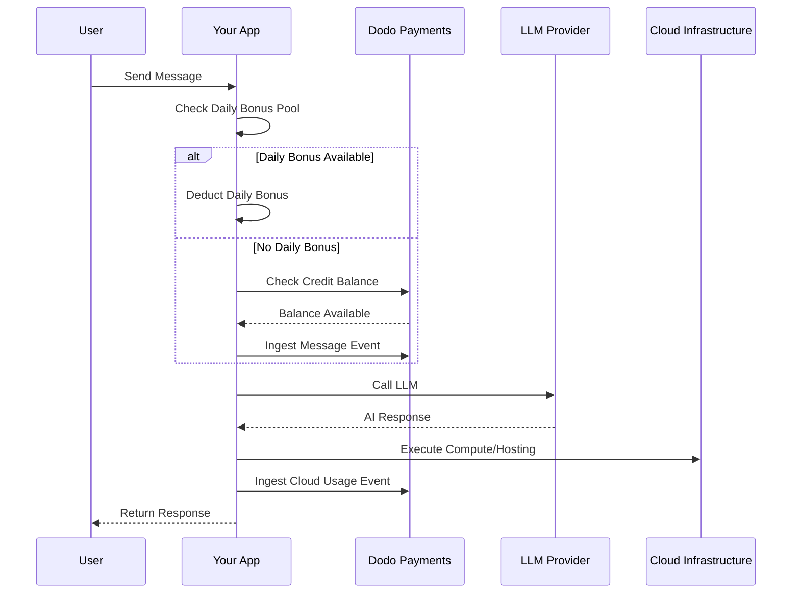

Lovable (lovable.dev)は、クレジットベースのサブスクリプションモデルを使用するAIウェブアプリビルダーです。トークンベースのシステムとは異なり、Lovableはユーザー体験を簡素化し、1メッセージにつき1クレジットを請求します。このモデルは、月ごとのクレジットプールと日次ボーナスドリップを組み合わせて、一貫したエンゲージメントを促進しつつ、一時的な使用を可能にします。

## Lovableの課金モデル

Lovableの価格設定は、メッセージクレジットとクラウドインフラの個別のメータリング課金を基にしています。

| プラン | 価格 | 月間クレジット | 日次ボーナス | 主な機能 |
| :--- | :--- | :--- | :--- | :--- |
| 無料 | \$0/月 | 0 | 5/日 (最大30/月) | 公開プロジェクトのみ |
| プロ | \$25/月 | 100 | 5/日 (最大150/月) | オンデマンドトップアップ、使用量ベースのクラウド+AI、カスタムドメイン |
| ビジネス | \$50/月 | 100 | 5/日 | SSO、チームワークスペース、デザインテンプレート、セキュリティセンター |
| エンタープライズ | カスタム | カスタム | カスタム | SCIM、専用サポート、監査ログ |

- **クレジットベースのサブスクリプション**: 1クレジット = AIへの1メッセージ/プロンプト。
- **クレジットは無制限のユーザーで共有**: チーム全体でのプール、座席ごとではない。
- **クレジットは各課金サイクルでリセット**: 月間クレジットは更新時にリフレッシュされる。
- **オンデマンドクレジットトップアップ**: クレジットがなくなった場合に購入可能。
- **使用量ベースのクラウド+AI課金**: ホスティングおよびコンピュート用のメータリング課金。
- **日次ボーナスクレジットは毎日リセット**: 毎日5クレジットの「使わなければ失う」ドリップ。

## これをユニークにするもの

- **メッセージベースの簡単さ**: 1クレジット = 複雑さに関係なく1メッセージ。トークンカウントやモデル重み付けはしない。
- **日次ドリップ + 月間プールのハイブリッド**: 日次ボーナス5クレジットは日々のエンゲージメントを促進し、月間100クレジットは急な使用を許可。
- **チーム全体の共有プール**: クレジットは、座席ごとの料金ではなく、無制限のユーザーで共有される。
- **2層課金**: AIインタラクションのためのクレジット+クラウドインフラのための個別メータリング課金。

## Dodo Paymentsでこれを構築

Dodo Paymentsのクレジット権利と使用量ベースのメーターを使用して、Lovableのハイブリッドモデルを再現できます。

<Steps>
  <Step title="Create a Custom Unit Credit Entitlement">
    Dodo Paymentsダッシュボードでメッセージクレジットシステムを定義します。この権利は、月間クレジットプールを管理します。

    - **クレジットタイプ**: カスタム単位
  - **単位名**: "メッセージ"
  - **精度**: 0
  - **クレジット有効期限**: 30日
  - **超過**: 無効 (クレジットが0になった場合のハードキャップ)
  </Step>

  <Step title="Create Subscription Products">
    プランを作成し、クレジット権利を添付します。無料プランでは、日次ボーナスをアプリケーションロジックで処理します。

    - **無料**: \$0/月、0クレジット (日次ボーナスはアプリロジックにより処理される)
    - **プロ**: \$25/月、100クレジット/サイクル、クレジット権利を添付
    - **ビジネス**: \$50/月、100クレジット/サイクル、クレジット権利を添付

    ```typescript
    import DodoPayments from 'dodopayments';

    const client = new DodoPayments({
      bearerToken: process.env.DODO_PAYMENTS_API_KEY,
    });

    const session = await client.checkoutSessions.create({
      product_cart: [
        { product_id: 'pdt_lovable_pro', quantity: 1 }
      ],
      customer: { email: 'user@example.com' },
      return_url: 'https://lovable.dev/dashboard'
    });
    ```

  </Step>

  <Step title="Create a Usage Meter for Cloud + AI">
    Lovableはクラウドインフラを別途課金します。これらのコストを追跡するメーターを作成します。

    - **メーター名**: `cloud.compute_seconds`
    - **集計**: Sum on `compute_seconds` property

    このメーターをサブスクリプション製品に単位ごとの価格で添付します。使用量をインジェストすると、Dodoは設定したレートに基づいてコストを計算します。

    ```typescript
    await client.usageEvents.ingest({
      events: [{
        event_id: `compute_${Date.now()}`,
        customer_id: 'cust_123',
        event_name: 'cloud.compute_seconds',
        timestamp: new Date().toISOString(),
        metadata: {
          compute_seconds: 3600,
          project_id: 'proj_abc'
        }
      }]
    });
    ```

  </Step>

  <Step title="Implement Daily Bonus Credits (Application Logic)">
    日次ボーナスドリップはアプリケーションレベルで処理されます。これらのクレジットを付与するためにcronジョブを使用するか、データベースで別途追跡できます。

    Dodoでこれらの日次ボーナスクレジットの使用をメイン権利バランスを即座に消耗せずに追跡するには、別のイベント名を使用するか、アプリでロジックを処理し、まずボーナスプールを確認できます。

    ```typescript
    // Example cron job logic (pseudo-code)
    // Every day at midnight UTC:
    // 1. Reset 'daily_bonus_used' to 0 for all users in your DB
    
    // When a user sends a message:
    async function handleMessage(userId: string) {
      const user = await db.users.findUnique({ where: { id: userId } });
      
      if (user.daily_bonus_used < 5) {
        // Use daily bonus
        await db.users.update({
          where: { id: userId },
          data: { daily_bonus_used: { increment: 1 } }
        });
        // Track for analytics but don't deduct from Dodo credits yet
        await client.usageEvents.ingest({
          events: [{
            event_id: `msg_bonus_${Date.now()}`,
            customer_id: userId,
            event_name: 'ai.message.bonus',
            timestamp: new Date().toISOString(),
            metadata: { type: 'daily_bonus' }
          }]
        });
      } else {
        // Deduct from Dodo credit entitlement
        await client.usageEvents.ingest({
          events: [{
            event_id: `msg_${Date.now()}`,
            customer_id: userId,
            event_name: 'ai.message',
            timestamp: new Date().toISOString(),
            metadata: { type: 'subscription_credit' }
          }]
        });
      }
    }
    ```

  </Step>

  <Step title="Send Usage Events for Messages">
    各AIメッセージを使用イベントとして追跡します。Dodoダッシュボードでこの`ai.message`イベントを「メッセージ」クレジット権利にリンクします。

    ```typescript
    await client.usageEvents.ingest({
      events: [{
        event_id: `msg_${Date.now()}`,
        customer_id: 'cust_123',
        event_name: 'ai.message',
        timestamp: new Date().toISOString(),
        metadata: {
          content_length: 450,
          project_id: 'proj_abc',
          feature_type: 'editor'
        }
      }]
    });
    ```

  </Step>

  <Step title="Handle Webhooks for Low Balance">
    クレジットが少なくなったときにユーザーに通知し、トップアップやアップグレードを促す。

    ```typescript
    import DodoPayments from 'dodopayments';
    import express from 'express';

    const app = express();
    app.use(express.raw({ type: 'application/json' }));

    const client = new DodoPayments({
      bearerToken: process.env.DODO_PAYMENTS_API_KEY,
      webhookKey: process.env.DODO_PAYMENTS_WEBHOOK_KEY,
    });

    app.post('/webhooks/dodo', async (req, res) => {
      try {
        const event = client.webhooks.unwrap(req.body.toString(), {
          headers: {
            'webhook-id': req.headers['webhook-id'] as string,
            'webhook-signature': req.headers['webhook-signature'] as string,
            'webhook-timestamp': req.headers['webhook-timestamp'] as string,
          },
        });

        if (event.type === 'credit.balance_low') {
          const { customer_id, available_balance } = event.data;
          await notifyUser(customer_id, `Your balance is low: ${available_balance} messages left.`);
        }

        res.json({ received: true });
      } catch (error) {
        res.status(401).json({ error: 'Invalid signature' });
      }
    });
    ```

  </Step>
</Steps>

## LLMイングレスブループリントで加速

[LLMイングレスブループリント](/developer-resources/ingestion-blueprints/llm)は、AIクライアントをラッピングすることでトラッキングを簡素化します。

```typescript
import { createLLMTracker } from '@dodopayments/ingestion-blueprints';
import OpenAI from 'openai';

const tracker = createLLMTracker({
  apiKey: process.env.DODO_PAYMENTS_API_KEY,
  environment: 'live_mode',
  eventName: 'ai.message',
});

const trackedClient = tracker.wrap({
  client: new OpenAI(),
  customerId: 'cust_123',
});

// Automatically tracks the message and deducts 1 credit (if configured)
await trackedClient.chat.completions.create({
  model: 'gpt-4o',
  messages: [{ role: 'user', content: 'Build a landing page' }],
});
```

<Tip>
  自動トラッキングに関する詳細は、[フルブループリントドキュメンテーション](/developer-resources/ingestion-blueprints/llm)をご覧ください。
</Tip>

## アーキテクチャ概要



## 使用されるDodoの主な機能

この実装を可能にする機能を探ります。

<CardGroup cols={2}>
  <Card title="Credit-Based Billing" icon="coins" href="/features/credit-based-billing">
    メッセージクレジットと共有チームプールを管理します。
  </Card>
  <Card title="Subscriptions" icon="calendar" href="/features/subscription">
    プロとビジネスタイアズのための定期プランを設定します。
  </Card>
  <Card title="Usage-Based Billing" icon="chart-line" href="/features/usage-based-billing/introduction">
    AIクレジットとは別にクラウドインフラ使用量をメーターリングします。
  </Card>
  <Card title="Event Ingestion" icon="bolt" href="/features/usage-based-billing/event-ingestion">
    大量のメッセージとコンピューティングイベントをDodoへ送信します。
  </Card>
  <Card title="Webhooks" icon="webhook" href="/developer-resources/webhooks/intents/credit">
    低クレジット残高の自動通知を行います。
  </Card>
  <Card title="LLM Ingestion Blueprint" icon="brain-circuit" href="/developer-resources/ingestion-blueprints/llm">
    事前構築された統合でAI使用のトラッキングを簡素化します。
  </Card>
</CardGroup>
