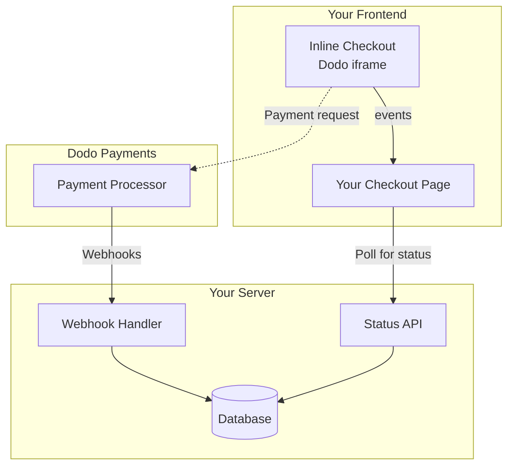

## 概要

インラインチェックアウトを使用すると、ウェブサイトやアプリケーションにシームレスに統合されたチェックアウト体験を作成できます。[オーバーレイチェックアウト](/developer-resources/overlay-checkout)とは異なり、インラインチェックアウトは支払いフォームをページレイアウトに直接埋め込みます。

インラインチェックアウトを使用すると、次のことができます：

- アプリやウェブサイトと完全に統合されたチェックアウト体験を作成する
- Dodo Paymentsが顧客と支払い情報を安全にキャプチャする最適化されたチェックアウトフレームを提供する
- Dodo Paymentsからのアイテム、合計、その他の情報をページに表示する
- SDKメソッドとイベントを使用して高度なチェックアウト体験を構築する

<Frame>
    
</Frame>

## 仕組み

インラインチェックアウトは、ウェブサイトやアプリに安全なDodo Paymentsフレームを埋め込むことで機能します。

チェックアウトフレームは、顧客情報の収集と支払い詳細のキャプチャを処理します。あなたのページには、アイテムリスト、合計、チェックアウトの内容を変更するためのオプションが表示されます。SDKを使用すると、ページとチェックアウトフレームが相互にやり取りできます。

Dodo Paymentsは、チェックアウトが完了すると自動的にサブスクリプションを作成し、あなたがプロビジョニングできるようにします。

<Note>
インラインチェックアウトフレームは、すべての機密支払い情報を安全に処理し、あなたの側での追加認証なしにPCI準拠を保証します。
</Note>

## 良いインラインチェックアウトとは？

顧客が誰から購入しているのか、何を購入しているのか、いくら支払っているのかを知ることが重要です。

コンプライアンスがあり、コンバージョンに最適化されたインラインチェックアウトを構築するには、実装に次の要素を含める必要があります：

<Frame caption="必要な要素がラベル付けされたインラインチェックアウトレイアウトの例">
    
</Frame>

1. **定期情報**：定期的な場合、どのくらいの頻度で繰り返されるかと更新時の合計金額。トライアルの場合、トライアルの期間。
2. **アイテムの説明**：購入されるものの説明。
3. **取引合計**：小計、総税、合計金額を含む取引合計。通貨も含めることを忘れないでください。
4. **Dodo Paymentsのフッター**：Dodo Paymentsに関する情報、販売条件、プライバシーポリシーを含む完全なインラインチェックアウトフレーム。
5. **返金ポリシー**：Dodo Paymentsの標準返金ポリシーと異なる場合は、返金ポリシーへのリンク。

<Warning>
常に完全なインラインチェックアウトフレームを表示してください。法的情報を削除または隠すことは、コンプライアンス要件に違反します。
</Warning>

## 顧客の旅

チェックアウトフローは、チェックアウトセッションの設定によって決まります。チェックアウトセッションをどのように設定するかによって、顧客はすべての情報が1ページに表示されるか、複数のステップに分かれるチェックアウトを体験します。

<Steps>
<Step title="顧客がチェックアウトを開く">

アイテムまたは既存のトランザクションを渡すことでインラインチェックアウトを開くことができます。SDKを使用してページ上の情報を表示および更新し、顧客のインタラクションに基づいてアイテムを更新するためのSDKメソッドを使用します。
    

</Step>

<Step title="顧客が詳細を入力する">

インラインチェックアウトは、最初に顧客にメールアドレスを入力し、国を選択し、（必要に応じて）郵便番号を入力するように求めます。このステップでは、税金と利用可能な支払いオプションを決定するために必要なすべての情報を収集します。

顧客の詳細を事前に入力し、保存された住所を提示して体験をスムーズにすることができます。

</Step>

<Step title="顧客が支払い方法を選択する">

詳細を入力した後、顧客には利用可能な支払い方法と支払いフォームが表示されます。オプションには、クレジットカードまたはデビットカード、PayPal、Apple Pay、Google Pay、そして顧客の所在地に基づくその他のローカル支払い方法が含まれる場合があります。

利用可能な場合は、保存された支払い方法を表示してチェックアウトを迅速化します。


</Step>

<Step title="チェックアウト完了">

Dodo Paymentsは、すべての支払いをその販売に最適なアクワイアラーにルーティングし、成功の可能性を最大限に高めます。顧客は、あなたが構築できる成功ワークフローに入ります。


</Step>

<Step title="Dodo Paymentsがサブスクリプションを作成">

Dodo Paymentsは、顧客のために自動的にサブスクリプションを作成し、あなたがプロビジョニングできるようにします。顧客が使用した支払い方法は、更新やサブスクリプションの変更のためにファイルに保持されます。


</Step>
</Steps>

## クイックスタート

Dodo Paymentsのインラインチェックアウトを数行のコードで始めましょう：

```typescript
import { DodoPayments } from "dodopayments-checkout";

// Initialize the SDK for inline mode
DodoPayments.Initialize({
  mode: "test",
  displayType: "inline",
  onEvent: (event) => {
    console.log("Checkout event:", event);
  },
});

// Open checkout in a specific container
DodoPayments.Checkout.open({
  checkoutUrl: "https://test.dodopayments.com/session/cks_123",
  elementId: "dodo-inline-checkout" // ID of the container element
});
```

<Tip>
自分のページに対応する `id` を持つコンテナ要素があることを確認してください: `<div id="dodo-inline-checkout"></div>`.
</Tip>

## ステップバイステップの統合ガイド

<Steps>
<Step title="SDKをインストール">

Dodo Payments Checkout SDKをインストールします：

<CodeGroup>

```bash npm
npm install dodopayments-checkout
```

```bash yarn
yarn add dodopayments-checkout
```

```bash pnpm
pnpm add dodopayments-checkout
```

</CodeGroup>

</Step>

<Step title="インライン表示のためにSDKを初期化">

SDKを初期化し、`displayType: 'inline'`を指定します。また、リアルタイムの税金と合計計算でUIを更新するために、 `checkout.breakdown` イベントをリッスンすることも必要です。

```typescript
import { DodoPayments } from "dodopayments-checkout";

DodoPayments.Initialize({
  mode: "test",
  displayType: "inline",
  onEvent: (event) => {
    if (event.event_type === "checkout.breakdown") {
      const breakdown = event.data?.message;
      // Update your UI with breakdown.subTotal, breakdown.tax, breakdown.total, etc.
    }
  },
});
```

</Step>

<Step title="コンテナ要素を作成">

チェックアウトフレームが挿入されるHTMLに要素を追加します：

```html
<div id="dodo-inline-checkout"></div>
```

</Step>

<Step title="チェックアウトを開く">

`DodoPayments.Checkout.open()` を呼び出し、コンテナの `checkoutUrl` と `elementId` を渡します:

```typescript
DodoPayments.Checkout.open({
  checkoutUrl: "https://test.dodopayments.com/session/cks_123",
  elementId: "dodo-inline-checkout"
});
```

</Step>

<Step title="統合をテスト">

1. 開発サーバーを起動します：

```bash
npm run dev
```

2. チェックアウトフローをテストします：
   - インラインフレームにメールアドレスと住所の詳細を入力します。
   - カスタム注文概要がリアルタイムで更新されることを確認します。
   - テスト資格情報を使用して支払いフローをテストします。
   - リダイレクトが正しく機能することを確認します。

<Check>
`onEvent` コールバック内でコンソールログを追加した場合、ブラウザコンソールに `checkout.breakdown` イベントがログされているのを見ることができるはずです。
</Check>

</Step>

<Step title="本番環境に移行">

本番環境の準備ができたら：

1. モードを `'live'` に変更します:

```typescript
DodoPayments.Initialize({
  mode: "live",
  displayType: "inline",
  onEvent: (event) => {
    // Handle events
  }
});
```

2. チェックアウトURLをバックエンドからのライブチェックアウトセッションを使用するように更新します。
3. 本番環境で完全なフローをテストします。

</Step>
</Steps>

## 完全なReactの例

この例は、インラインチェックアウトに合わせてカスタムオーダーサマリーを実装し、`checkout.breakdown` イベントを使用して同期を保つ方法を示しています。

```tsx
"use client";

import { useEffect, useState } from 'react';
import { DodoPayments, CheckoutBreakdownData } from 'dodopayments-checkout';

export default function CheckoutPage() {
  const [breakdown, setBreakdown] = useState<Partial<CheckoutBreakdownData>>({});

  useEffect(() => {
    // 1. Initialize the SDK
    DodoPayments.Initialize({
      mode: 'test',
      displayType: 'inline',
      onEvent: (event) => {
        // 2. Listen for the 'checkout.breakdown' event
        if (event.event_type === "checkout.breakdown") {
          const message = event.data?.message as CheckoutBreakdownData;
          if (message) setBreakdown(message);
        }
      }
    });

    // 3. Open the checkout in the specified container
    DodoPayments.Checkout.open({
      checkoutUrl: 'https://test.dodopayments.com/session/cks_123',
      elementId: 'dodo-inline-checkout'
    });

    return () => DodoPayments.Checkout.close();
  }, []);

  const format = (amt: number | null | undefined, curr: string | null | undefined) => 
    amt != null && curr ? `${curr} ${(amt/100).toFixed(2)}` : '0.00';

  const currency = breakdown.currency ?? breakdown.finalTotalCurrency ?? '';

  return (
    <div className="flex flex-col md:flex-row min-h-screen">
      {/* Left Side - Checkout Form */}
      <div className="w-full md:w-1/2 flex items-center">
        <div id="dodo-inline-checkout" className='w-full' />
      </div>

      {/* Right Side - Custom Order Summary */}
      <div className="w-full md:w-1/2 p-8 bg-gray-50">
        <h2 className="text-2xl font-bold mb-4">Order Summary</h2>
        <div className="space-y-2">
          {breakdown.subTotal && (
            <div className="flex justify-between">
              <span>Subtotal</span>
              <span>{format(breakdown.subTotal, currency)}</span>
            </div>
          )}
          {breakdown.discount && (
            <div className="flex justify-between">
              <span>Discount</span>
              <span>{format(breakdown.discount, currency)}</span>
            </div>
          )}
          {breakdown.tax != null && (
            <div className="flex justify-between">
              <span>Tax</span>
              <span>{format(breakdown.tax, currency)}</span>
            </div>
          )}
          <hr />
          {(breakdown.finalTotal ?? breakdown.total) && (
            <div className="flex justify-between font-bold text-xl">
              <span>Total</span>
              <span>{format(breakdown.finalTotal ?? breakdown.total, breakdown.finalTotalCurrency ?? currency)}</span>
            </div>
          )}
        </div>
      </div>
    </div>
  );
}

```

## APIリファレンス

### 設定

#### 初期化オプション

```typescript
interface InitializeOptions {
  mode: "test" | "live";
  displayType: "inline"; // Required for inline checkout
  onEvent: (event: CheckoutEvent) => void;
}
```

| オプション | タイプ | 必須 | 説明 |
|--------|------|----------|-------------|
| `mode` | `"test" \| "live"` | はい | 環境モードです。 |
| `displayType` | `"inline" \| "overlay"` | はい | チェックアウトを埋め込むためには `"inline"` に設定する必要があります。 |
| `onEvent` | `function` | はい | チェックアウトイベントを処理するためのコールバック関数です。 |

#### チェックアウトオプション

```typescript
export type FontSize = "xs" | "sm" | "md" | "lg" | "xl" | "2xl";
export type FontWeight = "normal" | "medium" | "bold" | "extraBold";

interface CheckoutOptions {
  checkoutUrl: string;
  elementId: string; // Required for inline checkout
  options?: {
    showTimer?: boolean;
    showSecurityBadge?: boolean;
    manualRedirect?: boolean;
    themeConfig?: ThemeConfig;
    payButtonText?: string;
    fontSize?: FontSize;
    fontWeight?: FontWeight;
  };
}
```

| オプション | タイプ | 必須 | 説明 |
|--------|------|----------|-------------|
| `checkoutUrl` | `string` | はい | チェックアウトセッションのURLです。 |
| `elementId` | `string` | はい | チェックアウトが表示されるDOM要素の `id` です。 |
| `options.showTimer` | `boolean` | いいえ | チェックアウトタイマーを表示または非表示にします。デフォルトは `true` です。無効にすると、セッションが期限切れになったときに `checkout.link_expired` イベントを受け取ります。 |
| `options.showSecurityBadge` | `boolean` | いいえ | セキュリティバッジを表示または非表示にします。デフォルトは `true` です。 |
| `options.manualRedirect` | `boolean` | いいえ | 有効にすると、チェックアウトの完了後に自動的にリダイレクトされません。その代わり、リダイレクトを自分で処理するための `checkout.status` と `checkout.redirect_requested` イベントを受け取ります。 |
| `options.themeConfig` | `ThemeConfig` | いいえ | カスタムテーマの構成です。 |
| `options.payButtonText` | `string` | いいえ | 支払いボタンに表示するカスタムテキストです。 |
| `options.fontSize` | `FontSize` | いいえ | チェックアウトのグローバルフォントサイズです。 |
| `options.fontWeight` | `FontWeight` | いいえ | チェックアウトのグローバルフォントの太さです。

### メソッド

#### チェックアウトを開く

指定されたコンテナにチェックアウトフレームを開きます。

```typescript
DodoPayments.Checkout.open({
  checkoutUrl: "https://test.dodopayments.com/session/cks_123",
  elementId: "dodo-inline-checkout"
});
```

チェックアウトの動作をカスタマイズするために追加のオプションを渡すこともできます:

```typescript
DodoPayments.Checkout.open({
  checkoutUrl: "https://test.dodopayments.com/session/cks_123",
  elementId: "dodo-inline-checkout",
  options: {
    showTimer: false,
    showSecurityBadge: false,
    manualRedirect: true,
    payButtonText: "Pay Now",
  },
});
```

`manualRedirect` を使用する場合、 `onEvent` コールバック内でチェックアウトの完了を処理します:

```typescript
DodoPayments.Initialize({
  mode: "test",
  displayType: "inline",
  onEvent: (event) => {
    if (event.event_type === "checkout.status") {
      const status = event.data?.message?.status;
      // Handle status: "succeeded", "failed", or "processing"
    }
    if (event.event_type === "checkout.redirect_requested") {
      const redirectUrl = event.data?.message?.redirect_to;
      // Redirect the customer manually
      window.location.href = redirectUrl;
    }
    if (event.event_type === "checkout.link_expired") {
      // Handle expired checkout session
    }
  },
});
```

#### チェックアウトを閉じる

プログラムでチェックアウトフレームを削除し、イベントリスナーをクリーンアップします。

```typescript
DodoPayments.Checkout.close();
```

#### ステータスを確認

チェックアウトフレームが現在注入されているかどうかを返します。

```typescript
const isOpen = DodoPayments.Checkout.isOpen();
// Returns: boolean
```

### イベント

SDKは、`onEvent` コールバックを介してリアルタイムイベントを提供します。インラインチェックアウトの場合、`checkout.breakdown` はUIを同期させるのに特に便利です。

| イベントタイプ | 説明 |
|------------|-------------|
| `checkout.opened` | チェックアウトフレームが読み込まれました。 |
| `checkout.form_ready` | チェックアウトフォームがユーザー入力を受け取る準備ができました。ローディング状態を隠し、チェックアウトUIを表示するのに便利です。 |
| `checkout.breakdown` | 価格、税、または割引が更新された時に発生します。 |
| `checkout.customer_details_submitted` | 顧客の詳細が送信されました。 |
| `checkout.pay_button_clicked` | 顧客が支払いボタンをクリックしたときに発生します。分析やコンバージョンファunnelの追跡に役立ちます。 |
| `checkout.redirect` | チェックアウトがリダイレクトを実行する予定です（例：銀行ページへ）。 |
| `checkout.error` | チェックアウト中にエラーが発生しました。 |
| `checkout.link_expired` | チェックアウトセッションが期限切れになった時に発生します。`showTimer` が `false` に設定されている場合のみ受け取ります。 |
| `checkout.status` | `manualRedirect` が有効になっている時に発生します。チェックアウトの状態（`succeeded`、 `failed`、または `processing`）を含みます。 |
| `checkout.redirect_requested` | `manualRedirect` が有効になっている時に発生します。顧客をリダイレクトするためのURLを含みます。

#### チェックアウトの内訳データ

`checkout.breakdown` イベントは、次のデータを提供します:

```typescript
interface CheckoutBreakdownData {
  subTotal?: number;          // Amount in cents
  discount?: number;         // Amount in cents
  tax?: number;              // Amount in cents
  total?: number;            // Amount in cents
  currency?: string;         // e.g., "USD"
  finalTotal?: number;       // Final amount including adjustments
  finalTotalCurrency?: string; // Currency for the final total
}
```

#### チェックアウトステータスイベントデータ

`manualRedirect` が有効な場合、以下のデータを持つ `checkout.status` イベントが受け取られます:

```typescript
interface CheckoutStatusEventData {
  message: {
    status?: "succeeded" | "failed" | "processing";
  };
}
```

#### チェックアウトリダイレクト要求イベントデータ

`manualRedirect` が有効な場合、以下のデータを持つ `checkout.redirect_requested` イベントが受け取られます:

```typescript
interface CheckoutRedirectRequestedEventData {
  message: {
    redirect_to?: string;
  };
}
```

#### 内訳イベントの理解

`checkout.breakdown` イベントは、アプリケーションのUIをDodo Paymentsチェックアウトの状態に同期させる主な方法です。

**発火するタイミング:**
- **初期化時**: チェックアウトフレームが読み込まれ、準備が整った直後。
- **住所変更時**: 顧客が国を選択したり、税金の再計算を引き起こす郵便番号を入力したとき。

**フィールドの詳細:**

| フィールド | 説明 |
|-------|-------------|
| `subTotal` | 割引や税金が適用される前のセッションのすべてのラインアイテムの合計です。 |
| `discount` | 適用された割引の総額です。 |
| `tax` | 計算された税額です。`inline` モードでは、ユーザーが住所フィールドに入力する際に動的に更新されます。 |
| `total` | セッションの基本通貨での `subTotal - discount + tax` の数学的結果です。 |
| `currency` | 標準の小計、割引、税額のためのISO通貨コード（例: `"USD"`）です。 |
| `finalTotal` | 顧客が実際に請求される金額です。これは基本的な価格内訳の一部ではない追加の外国為替調整やローカルの支払い方法手数料を含む場合があります。 |
| `finalTotalCurrency` | 顧客が実際に支払っている通貨です。購買力平価またはローカル通貨変換がアクティブな場合、`currency` とは異なる場合があります。

**統合のための重要なヒント:**

1. **通貨の書式設定**: 価格は常に最小通貨単位（例: USD のセント、JPY の円）で整数として返されます。それらを表示するには、100（または適切な10の冪）で割るか、`Intl.NumberFormat` のようなフォーマットライブラリを使用します。
2. **初期状態の処理**: チェックアウトが初めて読み込まれるとき、 `tax` と `discount` は、ユーザーが請求情報を提供したり、コードを適用したりするまで `0` または `null` になる場合があります。UIはこれらの状態を適切に処理する必要があります（例: ダッシュ `—` を表示したり、行を隠したりするなど）。
3. **「最終合計」と「合計」**: `total` は標準価格計算を提供しますが、 `finalTotal` は取引の真実の源です。 `finalTotal` が存在すれば、それが顧客のカードに請求される正確な金額を反映しているため、動的な調整も含まれます。
4. **リアルタイムフィードバック**: `tax` フィールドを使用して、ユーザーに対して税金がリアルタイムに計算されていることを示します。これにより、チェックアウトページに「ライブ」感を与え、住所入力ステップ中の摩擦を減少させます。

## 実装オプション

### パッケージマネージャーのインストール

npm、yarn、またはpnpmを使用して、[ステップバイステップの統合ガイド](#step-by-step-integration-guide)に示されているようにインストールします。

### CDN実装

ビルドステップなしで迅速に統合するには、CDNを使用できます:

```html
<!DOCTYPE html>
<html lang="en">
<head>
    <meta charset="UTF-8">
    <meta name="viewport" content="width=device-width, initial-scale=1.0">
    <title>Dodo Payments Inline Checkout</title>
    
    <!-- Load DodoPayments -->
    <script src="https://cdn.jsdelivr.net/npm/dodopayments-checkout@latest/dist/index.js"></script>
    <script>
        // Initialize the SDK
        DodoPaymentsCheckout.DodoPayments.Initialize({
            mode: "test",
            displayType: "inline",
            onEvent: (event) => {
                console.log('Checkout event:', event);
            }
        });
    </script>
</head>
<body>
    <div id="dodo-inline-checkout"></div>

    <script>
        // Open the checkout
        DodoPaymentsCheckout.DodoPayments.Checkout.open({
            checkoutUrl: "https://test.dodopayments.com/session/cks_123",
            elementId: "dodo-inline-checkout"
        });
    </script>
</body>
</html>
```

### テーマのカスタマイズ

チェックアウトの外観を、チェックアウトを開く際に `options` パラメータに `themeConfig` オブジェクトを渡すことによってカスタマイズできます。テーマ構成はライトモードとダークモードの両方をサポートしており、色、ボーダー、テキスト、ボタン、ボーダー半径をカスタマイズできます。

<Info>
このセクションでは、Checkout SDKを使用した**クライアントサイド**のテーマ構成について説明します。APIを介してチェックアウトセッションを作成する際に、`theme_config` パラメータを使用して、**サーバーサイド**でもテーマを構成できます。[チェックアウトテーマのカスタマイズ](/features/checkout#checkout-theme-customization)を参照して、APIレベルの構成について確認してください。
</Info>

#### 基本テーマ構成

```typescript
DodoPayments.Checkout.open({
  checkoutUrl: "https://checkout.dodopayments.com/session/cks_123",
  options: {
    themeConfig: {
      light: {
        bgPrimary: "#FFFFFF",
        textPrimary: "#344054",
        buttonPrimary: "#A6E500",
      },
      dark: {
        bgPrimary: "#0D0D0D",
        textPrimary: "#FFFFFF",
        buttonPrimary: "#A6E500",
      },
      radius: "8px",
    },
  },
});
```

#### 完全なテーマ構成

すべての利用可能なテーマプロパティ:

```typescript
DodoPayments.Checkout.open({
  checkoutUrl: "https://checkout.dodopayments.com/session/cks_123",
  options: {
    themeConfig: {
      light: {
        // Background colors
        bgPrimary: "#FFFFFF",        // Primary background color
        bgSecondary: "#F9FAFB",      // Secondary background color (e.g., tabs)
        
        // Border colors
        borderPrimary: "#D0D5DD",     // Primary border color
        borderSecondary: "#6B7280",  // Secondary border color
        inputFocusBorder: "#D0D5DD", // Input focus border color
        
        // Text colors
        textPrimary: "#344054",       // Primary text color
        textSecondary: "#6B7280",    // Secondary text color
        textPlaceholder: "#667085",  // Placeholder text color
        textError: "#D92D20",        // Error text color
        textSuccess: "#10B981",      // Success text color
        
        // Button colors
        buttonPrimary: "#A6E500",           // Primary button background
        buttonPrimaryHover: "#8CC500",      // Primary button hover state
        buttonTextPrimary: "#0D0D0D",       // Primary button text color
        buttonSecondary: "#F3F4F6",         // Secondary button background
        buttonSecondaryHover: "#E5E7EB",     // Secondary button hover state
        buttonTextSecondary: "#344054",     // Secondary button text color
      },
      dark: {
        // Background colors
        bgPrimary: "#0D0D0D",
        bgSecondary: "#1A1A1A",
        
        // Border colors
        borderPrimary: "#323232",
        borderSecondary: "#D1D5DB",
        inputFocusBorder: "#323232",
        
        // Text colors
        textPrimary: "#FFFFFF",
        textSecondary: "#909090",
        textPlaceholder: "#9CA3AF",
        textError: "#F97066",
        textSuccess: "#34D399",
        
        // Button colors
        buttonPrimary: "#A6E500",
        buttonPrimaryHover: "#8CC500",
        buttonTextPrimary: "#0D0D0D",
        buttonSecondary: "#2A2A2A",
        buttonSecondaryHover: "#3A3A3A",
        buttonTextSecondary: "#FFFFFF",
      },
      radius: "8px", // Border radius for inputs, buttons, and tabs
    },
  },
});
```

#### ライトモード専用

ライトテーマのみをカスタマイズしたい場合:

```typescript
DodoPayments.Checkout.open({
  checkoutUrl: "https://checkout.dodopayments.com/session/cks_123",
  options: {
    themeConfig: {
      light: {
        bgPrimary: "#FFFFFF",
        textPrimary: "#000000",
        buttonPrimary: "#0070F3",
      },
      radius: "12px",
    },
  },
});
```

#### ダークモード専用

ダークテーマのみをカスタマイズしたい場合:

```typescript
DodoPayments.Checkout.open({
  checkoutUrl: "https://checkout.dodopayments.com/session/cks_123",
  options: {
    themeConfig: {
      dark: {
        bgPrimary: "#000000",
        textPrimary: "#FFFFFF",
        buttonPrimary: "#0070F3",
      },
      radius: "12px",
    },
  },
});
```

#### 部分的なテーマオーバーライド

特定のプロパティのみをオーバーライドできます。指定しないプロパティにはデフォルト値が使用されます:

```typescript
DodoPayments.Checkout.open({
  checkoutUrl: "https://checkout.dodopayments.com/session/cks_123",
  options: {
    themeConfig: {
      light: {
        buttonPrimary: "#FF6B6B", // Only override primary button color
      },
      radius: "16px", // Override border radius
    },
  },
});
```

#### 他のオプションとのテーマ構成

テーマ構成を他のチェックアウトオプションと組み合わせることができます:

```typescript
DodoPayments.Checkout.open({
  checkoutUrl: "https://checkout.dodopayments.com/session/cks_123",
  options: {
    showTimer: true,
    showSecurityBadge: true,
    manualRedirect: false,
    themeConfig: {
      light: {
        bgPrimary: "#FFFFFF",
        buttonPrimary: "#A6E500",
      },
      dark: {
        bgPrimary: "#0D0D0D",
        buttonPrimary: "#A6E500",
      },
      radius: "8px",
    },
  },
});
```

#### TypeScript タイプ

TypeScriptユーザーのために、すべてのテーマ構成タイプがエクスポートされています:

```typescript
import { ThemeConfig, ThemeModeConfig } from "dodopayments-checkout";

const themeConfig: ThemeConfig = {
  light: {
    bgPrimary: "#FFFFFF",
    // ... other properties
  },
  dark: {
    bgPrimary: "#0D0D0D",
    // ... other properties
  },
  radius: "8px",
};
```

## 支払い方法の更新

インラインチェックアウトでは、サブスクリプションの**支払い方法の更新**をサポートしています。顧客が支払い方法を更新する必要があるとき（アクティブなサブスクリプションのため、または保留中のサブスクリプションを再アクティブにするため）、ページレイアウト内に直接更新フローを表示できます。

### 仕組み

1. [支払い方法更新API](/features/subscription#update-payment-method-for-active-subscription)を呼び出して、 `payment_link` を取得します:

```typescript
const response = await client.subscriptions.updatePaymentMethod('sub_123', {
  type: 'new',
  return_url: 'https://example.com/return'
});
```

2. 返された `payment_link` を `checkoutUrl` として渡して、インラインチェックアウトを開きます:

```typescript
DodoPayments.Checkout.open({
  checkoutUrl: response.payment_link,
  elementId: "dodo-inline-checkout"
});
```

インラインフレームは、支払い方法の収集フォームのみをレンダリングします。顧客は新しいカードの詳細を入力するか、ページを離れることなく保存された支払い方法を選択できます。

### 保留中のサブスクリプション向け

`on_hold` ステータスのサブスクリプションの支払い方法を更新する際、Dodo Payments は残りの未払い料金に対して自動的に請求を作成します。再アクティブ化を確認するためには、`payment.succeeded` および `subscription.active` ウェブフックをモニターしてください。

```typescript
const response = await client.subscriptions.updatePaymentMethod('sub_123', {
  type: 'new',
  return_url: 'https://example.com/return'
});

if (response.payment_id) {
  // Charge created for remaining dues
  // Open inline checkout for payment collection
  DodoPayments.Checkout.open({
    checkoutUrl: response.payment_link,
    elementId: "dodo-inline-checkout"
  });
}
```

<Tip>
新しい詳細を収集する代わりに、既存の保存された支払い方法を使用することもできます。これは、`type: 'existing'` と `payment_method_id` を Update Payment Method API に渡すことによって行います。
</Tip>

## エラーハンドリング

SDK はイベントシステムを介して詳細なエラー情報を提供します。常に、 `onEvent` コールバック内で適切なエラーハンドリングを実装してください:

```typescript
DodoPayments.Initialize({
  mode: "test",
  displayType: "inline",
  onEvent: (event: CheckoutEvent) => {
    if (event.event_type === "checkout.error") {
      console.error("Checkout error:", event.data?.message);
      // Handle error appropriately
    }
  }
});
```

<Warning>
問題が発生した場合、良好なユーザー体験を提供するために、常に `checkout.error` イベントを処理してください。
</Warning>

## ベストプラクティス

1. **レスポンシブデザイン**: コンテナ要素に十分な幅と高さがあることを確認してください。iframeは通常、そのコンテナに収まるように拡張されます。
2. **同期化**: `checkout.breakdown` イベントを利用して、カスタムオーダーサマリーや価格表を、ユーザーがチェックアウトフレームで目にしている内容と同期させます。
3. **スケルトン状態**: `checkout.opened` イベントが発生するまで、コンテナ内にローディングインジケーターを表示します。
4. **クリーンアップ**: コンポーネントがアンマウントされたときに `DodoPayments.Checkout.close()` を呼び出して、iframe とイベントリスナーをクリーンアップします。

<Info>
ダークモードの実装において、インラインチェックアウトフレームとの最適な視覚統合のために、背景色として `#0d0d0d` を使用することをお勧めします。
</Info>

## 支払いステータスの検証

<Warning>
支払いの成功または失敗を判断するためにインラインチェックアウトイベントのみに依存しないでください。ウェブフックやポーリングを利用してサーバー側の検証を常に実施してください。
</Warning>

### サーバー側の検証が不可欠な理由

`checkout.status` のようなインラインチェックアウトイベントはリアルタイムフィードバックを提供しますが、支払いステータスの唯一の情報源としては**適していません**。ネットワークの問題、ブラウザのクラッシュ、ユーザーがページを閉じることでイベントが見逃される可能性があります。信頼できる支払い検証を確保するために：

1. **サーバーがウェブフックイベントをリッスンする** - Dodo Payments は支払いステータスの変更に対してウェブフックを送信します。
2. **ポーリングメカニズムを実装する** - フロントエンドは、ステータスアップデートのためにサーバーをポーリングする必要があります。
3. **両方のアプローチを組み合わせる** - ウェブフックを主要な情報源として利用し、ポーリングをフォールバックとして利用します。

### 推奨アーキテクチャ



### 実装手順

**1. チェックアウトイベントをリッスンする** - ユーザーが支払いをクリックしたら、ステータス確認の準備を始めます:

```typescript
onEvent: (event) => {
  if (event.event_type === 'checkout.status') {
    // Start polling your server for confirmed status
    startPolling();
  }
}
```

**2. サーバーをポーリングする** - データベースで支払いステータスをチェックするエンドポイントを作成します（ウェブフックによって更新されます）:

```typescript
// Poll every 2 seconds until status is confirmed
const interval = setInterval(async () => {
  const { status } = await fetch(`/api/payments/${paymentId}/status`).then(r => r.json());
  if (status === 'succeeded' || status === 'failed') {
    clearInterval(interval);
    handlePaymentResult(status);
  }
}, 2000);
```

**3. サーバー側でウェブフックを処理する** - Dodo が `payment.succeeded` または `payment.failed` ウェブフックを送信したときに、データベースを更新します。詳細については、[ウェブフックのドキュメント](/developer-resources/webhooks)を参照してください。

### リダイレクトの処理（3DS、Google Pay、UPI）

`manualRedirect: true` を使用する場合、特定の支払い方法では、認証のためにユーザーをページからリダイレクトする必要があります:

- **3D セキュア (3DS)** - カード認証
- **Google Pay** - 一部のフローでのウォレット認証
- **UPI** - インドの支払い方法のリダイレクト

リダイレクトが必要な場合、`checkout.redirect_requested` イベントが受信されます。提供されたURLにユーザーをリダイレクトしてください:

```typescript
if (event.event_type === 'checkout.redirect_requested') {
  const redirectUrl = event.data?.message?.redirect_to;
  // Save payment ID before redirect, then redirect
  sessionStorage.setItem('pendingPaymentId', paymentId);
  window.location.href = redirectUrl;
}
```

認証が完了した後（成功または失敗）、ユーザーはページに戻ります。**ユーザーが戻ったからといって、成功したとみなさないでください。** 代わりに：

1. ユーザーがリダイレクトから戻ってきたかどうかを確認します（例： `sessionStorage` を介して）
2. 確認された支払いステータスのためにサーバーをポーリングし始めます。
3. ポーリング中は「支払いを確認中...」状態を表示します。
4. サーバーが確認したステータスに基づいて、成功/失敗のUIを表示します。

<Tip>
必ずリダイレクト後の支払いステータスをサーバー側で確認してください。ユーザーがページに戻ることは、認証が完了したことを示すだけで、支払いが成功したか失敗したかは示しません。
</Tip>

## トラブルシューティング

<AccordionGroup>
<Accordion title="チェックアウトフレームが表示されない">
- `elementId` が実際にDOM に存在する `id` の要素と一致していることを確認してください。
- `displayType: 'inline'` が `Initialize` に渡されたことを確認してください。
- `checkoutUrl` が有効であることを確認してください。
</Accordion>

<Accordion title="税金がUIで更新されない">
- `checkout.breakdown` イベントをリッスンしていることを確認してください。
- 税金は、ユーザーがチェックアウトフレームに有効な国および郵便番号を入力した後にのみ計算されます。
</Accordion>
</AccordionGroup>

## デジタルウォレットの有効化

Apple Pay、Google Pay、その他のデジタルウォレットの設定に関する詳細情報については、 <a href="/features/payment-methods/digital-wallets">デジタルウォレット</a>ページを参照してください。

### Apple Pay のクイックセットアップ

<Steps>
<Step title="ドメイン関連ファイルのダウンロード">
[Apple Pay ドメイン関連ファイル](http://checkout.dodopayments.com/.well-known/apple-developer-merchantid-domain-association)をダウンロードします。
</Step>

<Step title="アクティベーションリクエスト">
**support@dodopayments.com** にプロダクションドメインURLを記載して、Apple Payのアクティベーションをリクエストします。
</Step>

<Step title="確認後にテスト">
確認後、チェックアウトにApple Payが表示されるか確認し、完全なフローをテストします。
</Step>
</Steps>

<Warning>
Apple Pay は、プロダクションで表示される前にドメインの検証が必要です。Apple Payを提供する予定がある場合は、ライブにする前にサポートに連絡してください。
</Warning>

## ブラウザサポート

Dodo Payments Checkout SDK は次のブラウザをサポートしています:

- Chrome（最新）
- Firefox（最新）
- Safari（最新）
- Edge（最新）
- IE11+

## インラインチェックアウトとオーバーレイチェックアウト

使用ケースに適したチェックアウトタイプを選択してください:

| 機能 | インラインチェックアウト | オーバーレイチェックアウト |
|---------|-----------------|------------------|
| 統合の深さ | ページ内に完全に埋め込まれています | ページの上にモーダル |
| レイアウト制御 | 完全な制御 | 限定的 |
| ブランド | シームレス | ページから独立 |
| 実装の労力 | 高い | 低い |
| 最適な対象 | カスタムチェックアウトページ、高コンバージョンフロー | クイック統合、既存のページ |

<Tip>
最大限のチェックアウト体験とシームレスなブランディングを望む場合は、**インラインチェックアウト**を使用してください。既存のページへの最小限の変更で迅速な統合を望む場合は、**オーバーレイチェックアウト**を使用してください。
</Tip>

## 関連リソース

<CardGroup cols={2}>
<Card title="オーバーレイチェックアウト" icon="layer-group" href="/developer-resources/overlay-checkout">
    クイックモーダルベースの統合のためにオーバーレイチェックアウトを使用します。
</Card>

<Card title="チェックアウトセッションAPI" icon="code" href="/api-reference/checkout-sessions/create">
    チェックアウト体験を強化するためのチェックアウトセッションを作成します。
</Card>

<Card title="ウェブフック" icon="webhook" href="/developer-resources/webhooks">
    サーバーサイドで支払いイベントを扱います。
</Card>

<Card title="統合ガイド" icon="book" href="/developer-resources/integration-guide">
    Dodo Paymentsを統合するための完全ガイド。
</Card>
</CardGroup>

さらにサポートが必要な場合は、[Discordコミュニティ](https://discord.gg/bYqAp4ayYh)をご覧いただくか、開発者サポートチームにお問い合わせください。
