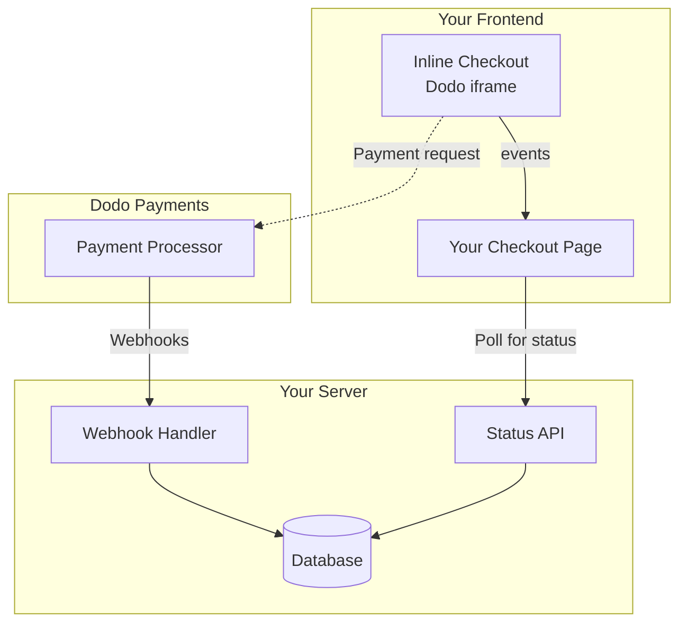

## 概要

Inline checkout を使用すると、ウェブサイトやアプリケーションとシームレスに統合された、完全なチェックアウト体験を作成できます。ページ上にモーダルとして開く [overlay checkout](/developer-resources/overlay-checkout) とは異なり、inline checkout は決済フォームをページレイアウトに直接埋め込みます。

Inline checkout を使用すると、次のことができます。

- アプリやウェブサイトに完全に統合されたチェックアウト体験を作成する
- Dodo Payments が最適化されたチェックアウトフレーム内で顧客情報と決済情報を安全に取得できるようにする
- ページ上に Dodo Payments の商品、合計金額、その他の情報を表示する
- SDK のメソッドとイベントを使用して高度なチェックアウト体験を構築する

<Frame>
    
</Frame>

## 仕組み

Inline checkout は、安全な Dodo Payments フレームをウェブサイトやアプリに埋め込むことで機能します。

チェックアウトフレームは、顧客情報の収集と決済情報の取得を処理します。ページには商品一覧、合計金額、チェックアウト内容を変更するためのオプションが表示されます。SDK により、ページとチェックアウトフレームが相互に連携できます。

Dodo Payments は、チェックアウト完了時にサブスクリプションを自動作成します。作成後はプロビジョニングできます。

<Note>
Inline checkout フレームは、機密性の高い決済情報をすべて安全に処理するため、お客様側で追加の認証を取得しなくても PCI 準拠を実現できます。
</Note>

## 優れた Inline Checkout とは

顧客が、誰から何を購入し、いくら支払うのかを把握できることが重要です。

コンプライアンスに準拠し、コンバージョンに最適化された inline checkout を構築するには、実装に次の要素を含める必要があります。

<Frame caption="Example inline checkout layout showing required elements">
    
</Frame>

1. **継続課金情報**: 継続課金の場合は、請求頻度と更新時の支払総額。トライアルの場合は、トライアル期間。
2. **商品の説明**: 購入内容の説明。
3. **取引合計**: 小計、税額、総合計を含む取引合計。通貨も必ず表示してください。
4. **Dodo Payments フッター**: Dodo Payments、販売規約、プライバシーポリシーの情報を含む、フッターまで完全な inline checkout フレーム。
5. **返金ポリシー**: Dodo Payments の標準返金ポリシーと異なる場合は、お客様の返金ポリシーへのリンク。

<Warning>
フッターを含む完全な inline checkout フレームを常に表示してください。法的情報を削除または非表示にすると、コンプライアンス要件に違反します。
</Warning>

## 顧客の利用フロー

チェックアウトフローは、checkout session の設定によって決まります。設定によっては、すべての情報が1ページに表示される場合と、複数のステップに分かれて表示される場合があります。

<Steps>
<Step title="Customer opens checkout">

商品または既存のトランザクションを渡して inline checkout を開くことができます。SDK を使用してページ上の情報を表示・更新し、顧客の操作に応じて商品を更新するには SDK のメソッドを使用します。
    

</Step>

<Step title="Customer enters their details">

Inline checkout ではまず、顧客にメールアドレスと国を入力してもらい、必要に応じて ZIP または郵便番号を入力してもらいます。このステップで必要な情報を収集し、税額と利用可能な決済オプションを決定します。

顧客情報を事前入力し、保存済みの住所を表示することで、利用体験を効率化できます。

</Step>

<Step title="Customer selects payment method">

情報を入力すると、利用可能な決済方法と決済フォームが表示されます。場所に応じて、クレジットカードまたはデビットカード、PayPal、Apple Pay、Google Pay、その他の現地の決済方法が選択肢に含まれる場合があります。

保存済みの決済方法がある場合は表示すると、チェックアウトを迅速化できます。


</Step>

<Step title="Checkout completed">

Dodo Payments は、取引ごとに最適な acquirer へ決済をルーティングし、成功する可能性を最大化します。顧客には、構築可能な成功時のワークフローが表示されます。


</Step>

<Step title="Dodo Payments creates subscription">

Dodo Payments は顧客のサブスクリプションを自動作成します。作成後はプロビジョニングできます。顧客が使用した決済方法は、更新やサブスクリプション変更のために保存されます。


</Step>
</Steps>

## クイックスタート

数行のコードで Dodo Payments Inline Checkout を始められます。

```typescript
import { DodoPayments } from "dodopayments-checkout";

// Initialize the SDK for inline mode
DodoPayments.Initialize({
  mode: "test",
  displayType: "inline",
  onEvent: (event) => {
    console.log("Checkout event:", event);
  },
});

// Open checkout in a specific container
DodoPayments.Checkout.open({
  checkoutUrl: "https://test.checkout.dodopayments.com/session/cks_123",
  elementId: "dodo-inline-checkout" // ID of the container element
});
```

<Tip>
ページに対応する `id` を持つコンテナ要素があることを確認してください: `<div id="dodo-inline-checkout"></div>`。
</Tip>

## ステップごとの統合ガイド

<Steps>
<Step title="Install the SDK">

Dodo Payments Checkout SDK をインストールします。

<CodeGroup>

```bash npm
npm install dodopayments-checkout
```

```bash yarn
yarn add dodopayments-checkout
```

```bash pnpm
pnpm add dodopayments-checkout
```

</CodeGroup>

</Step>

<Step title="Initialize the SDK for Inline Display">

SDK を初期化し、`displayType: 'inline'` を指定します。また、`checkout.breakdown` イベントをリッスンして、リアルタイムの税額と合計金額で UI を更新してください。

```typescript
import { DodoPayments } from "dodopayments-checkout";

DodoPayments.Initialize({
  mode: "test",
  displayType: "inline",
  onEvent: (event) => {
    if (event.event_type === "checkout.breakdown") {
      const breakdown = event.data?.message;
      // Update your UI with breakdown.subTotal, breakdown.tax, breakdown.total, etc.
    }
  },
});
```

</Step>

<Step title="Create a Container Element">

チェックアウトフレームを挿入する HTML 要素を追加します。

```html
<div id="dodo-inline-checkout"></div>
```

</Step>

<Step title="Open the Checkout">

コンテナの `checkoutUrl` と `elementId` を指定して `DodoPayments.Checkout.open()` を呼び出します。

```typescript
DodoPayments.Checkout.open({
  checkoutUrl: "https://test.checkout.dodopayments.com/session/cks_123",
  elementId: "dodo-inline-checkout"
});
```

</Step>

<Step title="Test Your Integration">

1. 開発サーバーを起動します。

```bash
npm run dev
```

2. チェックアウトフローをテストします。
   - inline frame にメールアドレスと住所を入力します。
   - カスタム注文概要がリアルタイムで更新されることを確認します。
   - テスト用の認証情報で決済フローをテストします。
   - リダイレクトが正しく機能することを確認します。

<Check>
`onEvent` コールバックに console log を追加している場合、ブラウザのコンソールに `checkout.breakdown` イベントが記録されます。
</Check>

</Step>

<Step title="Go Live">

本番環境に移行する準備ができたら、次の手順を実行します。

1. モードを `'live'` に変更します。

```typescript
DodoPayments.Initialize({
  mode: "live",
  displayType: "inline",
  onEvent: (event) => {
    // Handle events
  }
});
```

2. checkout URL をバックエンドの本番 checkout session に更新します。
3. 本番環境で完全なフローをテストします。

</Step>
</Steps>

## 完全な React の例

この例では、inline checkout とともにカスタム注文概要を実装し、`checkout.breakdown` イベントを使用して両者を同期する方法を示します。

```tsx
"use client";

import { useEffect, useState } from 'react';
import { DodoPayments, CheckoutBreakdownData } from 'dodopayments-checkout';

export default function CheckoutPage() {
  const [breakdown, setBreakdown] = useState<Partial<CheckoutBreakdownData>>({});

  useEffect(() => {
    // 1. Initialize the SDK
    DodoPayments.Initialize({
      mode: 'test',
      displayType: 'inline',
      onEvent: (event) => {
        // 2. Listen for the 'checkout.breakdown' event
        if (event.event_type === "checkout.breakdown") {
          const message = event.data?.message as CheckoutBreakdownData;
          if (message) setBreakdown(message);
        }
      }
    });

    // 3. Open the checkout in the specified container
    DodoPayments.Checkout.open({
      checkoutUrl: 'https://test.checkout.dodopayments.com/session/cks_123',
      elementId: 'dodo-inline-checkout'
    });

    return () => DodoPayments.Checkout.close();
  }, []);

  const format = (amt: number | null | undefined, curr: string | null | undefined) => 
    amt != null && curr ? `${curr} ${(amt/100).toFixed(2)}` : '0.00';

  const currency = breakdown.currency ?? breakdown.finalTotalCurrency ?? '';

  return (
    <div className="flex flex-col md:flex-row min-h-screen">
      {/* Left Side - Checkout Form */}
      <div className="w-full md:w-1/2 flex items-center">
        <div id="dodo-inline-checkout" className='w-full' />
      </div>

      {/* Right Side - Custom Order Summary */}
      <div className="w-full md:w-1/2 p-8 bg-gray-50">
        <h2 className="text-2xl font-bold mb-4">Order Summary</h2>
        <div className="space-y-2">
          {breakdown.subTotal && (
            <div className="flex justify-between">
              <span>Subtotal</span>
              <span>{format(breakdown.subTotal, currency)}</span>
            </div>
          )}
          {breakdown.discount && (
            <div className="flex justify-between">
              <span>Discount</span>
              <span>{format(breakdown.discount, currency)}</span>
            </div>
          )}
          {breakdown.tax != null && (
            <div className="flex justify-between">
              <span>Tax</span>
              <span>{format(breakdown.tax, currency)}</span>
            </div>
          )}
          <hr />
          {(breakdown.finalTotal ?? breakdown.total) && (
            <div className="flex justify-between font-bold text-xl">
              <span>Total</span>
              <span>{format(breakdown.finalTotal ?? breakdown.total, breakdown.finalTotalCurrency ?? currency)}</span>
            </div>
          )}
        </div>
      </div>
    </div>
  );
}

```

## API リファレンス

### 設定

#### 初期化オプション

```typescript
interface InitializeOptions {
  mode: "test" | "live";
  displayType: "inline"; // Required for inline checkout
  onEvent: (event: CheckoutEvent) => void;
}
```

| オプション | 型 | 必須 | 説明 |
|--------|------|----------|-------------|
| `mode` | `"test" \| "live"` | はい | 環境モード。 |
| `displayType` | `"inline" \| "overlay"` | はい | チェックアウトを埋め込むには `"inline"` に設定する必要があります。 |
| `onEvent` | `function` | はい | checkout event を処理する callback function。 |

#### Checkout オプション

```typescript
export type FontSize = "xs" | "sm" | "md" | "lg" | "xl" | "2xl";
export type FontWeight = "normal" | "medium" | "bold" | "extraBold";

interface CheckoutOptions {
  checkoutUrl: string;
  elementId: string; // Required for inline checkout
  options?: {
    showTimer?: boolean;
    showSecurityBadge?: boolean;
    payButtonText?: string;
    fontSize?: FontSize;
    fontWeight?: FontWeight;
  };
}
```

| オプション | 型 | 必須 | 説明 |
|--------|------|----------|-------------|
| `checkoutUrl` | `string` | はい | Checkout session URL。 |
| `elementId` | `string` | はい | checkout をレンダリングする DOM 要素の `id`。 |
| `options.showTimer` | `boolean` | いいえ | checkout timer を表示または非表示にします。デフォルトは `true` です。無効にすると、session の有効期限切れ時に `checkout.link_expired` event を受け取ります。 |
| `options.showSecurityBadge` | `boolean` | いいえ | security badge を表示または非表示にします。デフォルトは `true` です。 |
| `options.payButtonText` | `string` | いいえ | pay button に表示するカスタムテキスト。 |
| `options.fontSize` | `FontSize` | いいえ | checkout のグローバルフォントサイズ。 |
| `options.fontWeight` | `FontWeight` | いいえ | checkout のグローバルフォントウェイト。 |

### メソッド

#### Checkout を開く

指定したコンテナに checkout frame を開きます。

```typescript
DodoPayments.Checkout.open({
  checkoutUrl: "https://test.checkout.dodopayments.com/session/cks_123",
  elementId: "dodo-inline-checkout"
});
```

追加のオプションを渡して checkout の動作をカスタマイズすることもできます。

```typescript
DodoPayments.Checkout.open({
  checkoutUrl: "https://test.checkout.dodopayments.com/session/cks_123",
  elementId: "dodo-inline-checkout",
  options: {
    showTimer: false,
    showSecurityBadge: false,
    payButtonText: "Pay Now",
  },
});
```

#### Checkout を閉じる

checkout frame をプログラムで削除し、event listener をクリーンアップします。

```typescript
DodoPayments.Checkout.close();
```

#### ステータスを確認する

checkout frame が現在挿入されているかどうかを返します。

```typescript
const isOpen = DodoPayments.Checkout.isOpen();
// Returns: boolean
```

### Events

SDK は `onEvent` callback を通じてリアルタイムイベントを提供します。Inline checkout では、`checkout.breakdown` が UI の同期に特に役立ちます。

| イベントタイプ | 説明 |
|------------|-------------|
| `checkout.opened` | Checkout frame が読み込まれました。 |
| `checkout.form_ready` | Checkout form がユーザー入力を受け付ける準備ができました。ローディング状態を非表示にし、checkout UI を表示する際に便利です。 |
| `checkout.breakdown` | 価格、税、割引が更新されたときに発生します。 |
| `checkout.customer_details_submitted` | 顧客情報が送信されました。 |
| `checkout.pay_button_clicked` | 顧客が pay button をクリックしたときに発生します。分析やコンバージョンファネルの追跡に便利です。 |
| `checkout.redirect` | Checkout がリダイレクトを実行します（例: 銀行ページへの移動）。 |
| `checkout.error` | Checkout 中にエラーが発生しました。 |
| `checkout.link_expired` | Checkout session の有効期限が切れたときに発生します。`showTimer` が `false` に設定されている場合のみ受信します。 |

#### Checkout Breakdown Data

`checkout.breakdown` event は次のデータを提供します。

```typescript
interface CheckoutBreakdownData {
  subTotal?: number;          // Amount in cents
  discount?: number;         // Amount in cents
  tax?: number;              // Amount in cents
  total?: number;            // Amount in cents
  currency?: string;         // e.g., "USD"
  finalTotal?: number;       // Final amount including adjustments
  finalTotalCurrency?: string; // Currency for the final total
}
```

#### Breakdown Event の理解

`checkout.breakdown` event は、アプリケーションの UI を Dodo Payments checkout state と同期する主な方法です。

**発生するタイミング:**
- **初期化時**: checkout frame が読み込まれ、準備が完了した直後。
- **住所変更時**: 顧客が国を選択したとき、または税額の再計算につながる郵便番号を入力したとき。

**フィールドの詳細:**

| フィールド | 説明 |
|-------|-------------|
| `subTotal` | 割引や税金が適用される前の、セッション内のすべての項目の合計。 |
| `discount` | 適用されたすべての割引の合計額。 |
| `tax` | 計算された税額。`inline` モードでは、ユーザーが住所フィールドを操作すると動的に更新されます。 |
| `total` | セッションの基準通貨における `subTotal - discount + tax` の計算結果。 |
| `currency` | 標準の小計、割引、税額に使用される ISO 通貨コード（例：`"USD"`）。 |
| `finalTotal` | 顧客に実際に請求される金額。基本的な価格内訳には含まれない、追加の foreign exchange 調整や現地の payment method 手数料が含まれる場合があります。 |
| `finalTotalCurrency` | 顧客が実際に支払う通貨。 [purchasing power parity](/features/purchasing-power-parity) または現地通貨への変換が有効な場合、`currency` と異なることがあります。 |

**主な統合のヒント:**

1. **通貨のフォーマット**: 価格は常に最小通貨単位の整数で返されます（例: USD のセント、JPY の円）。表示するには 100（または適切な 10 の累乗）で割るか、`Intl.NumberFormat` のような formatting library を使用してください。
2. **初期状態の処理**: checkout の初回読み込み時、ユーザーが請求先情報を入力するかコードを適用するまで、`tax` と `discount` は `0` または `null` になる場合があります。UI でこれらの状態を適切に処理してください（例: ダッシュ `—` を表示する、または行を非表示にする）。
3. **「Final Total」と「Total」**: `total` は標準価格の計算結果ですが、取引の信頼できる値は `finalTotal` です。`finalTotal` が存在する場合、動的な調整を含め、顧客のカードに実際に請求される金額を正確に反映します。
4. **リアルタイムのフィードバック**: `tax` field を使用して、税がリアルタイムで計算されていることをユーザーに示します。これにより checkout page に「ライブ感」が生まれ、住所入力時の離脱を減らせます。

## 実装オプション

### Package Manager によるインストール

[Step-by-Step Integration Guide](#step-by-step-integration-guide) に従い、npm、yarn、または pnpm でインストールします。

### CDN による実装

ビルド手順なしですばやく統合するには、次の CDN を使用できます。

```html
<!DOCTYPE html>
<html lang="en">
<head>
    <meta charset="UTF-8">
    <meta name="viewport" content="width=device-width, initial-scale=1.0">
    <title>Dodo Payments Inline Checkout</title>
    
    <!-- Load DodoPayments -->
    <script src="https://cdn.jsdelivr.net/npm/dodopayments-checkout@latest/dist/index.js"></script>
    <script>
        // Initialize the SDK
        DodoPaymentsCheckout.DodoPayments.Initialize({
            mode: "test",
            displayType: "inline",
            onEvent: (event) => {
                console.log('Checkout event:', event);
            }
        });
    </script>
</head>
<body>
    <div id="dodo-inline-checkout"></div>

    <script>
        // Open the checkout
        DodoPaymentsCheckout.DodoPayments.Checkout.open({
            checkoutUrl: "https://test.checkout.dodopayments.com/session/cks_123",
            elementId: "dodo-inline-checkout"
        });
    </script>
</body>
</html>
```

## 決済方法の更新

Inline checkout は、サブスクリプションの **決済方法の更新** に対応しています。アクティブなサブスクリプションの更新や保留中のサブスクリプションの再有効化など、顧客が決済方法を更新する必要がある場合、ページレイアウト内に更新フローを直接表示できます。

### 仕組み

1. [Update Payment Method API](/features/subscription#update-payment-method-for-active-subscription) を呼び出して `payment_link` を取得します。

```typescript
const response = await client.subscriptions.updatePaymentMethod('sub_123', {
  payment_method: { type: 'new', return_url: 'https://example.com/return' }
});
```

2. 返された `payment_link` を `checkoutUrl` として渡し、inline checkout を開きます。

```typescript
DodoPayments.Checkout.open({
  checkoutUrl: response.payment_link,
  elementId: "dodo-inline-checkout"
});
```

inline frame には決済方法の収集フォームのみが表示されます。顧客はページを離れずに新しいカード情報を入力するか、保存済みの決済方法を選択できます。

### 保留中のサブスクリプションの場合

`on_hold` status のサブスクリプションで決済方法を更新すると、Dodo Payments は未払い残高に対する請求を自動的に作成します。再有効化を確認するには、`payment.succeeded` と `subscription.active` webhooks を監視してください。

```typescript
const response = await client.subscriptions.updatePaymentMethod('sub_123', {
  payment_method: { type: 'new', return_url: 'https://example.com/return' }
});

if (response.payment_id) {
  // Charge created for remaining dues
  // Open inline checkout for payment collection
  DodoPayments.Checkout.open({
    checkoutUrl: response.payment_link,
    elementId: "dodo-inline-checkout"
  });
}
```

<Tip>
`type: 'existing'` を `payment_method_id` とともに Update Payment Method API に渡すことで、新しい情報を収集する代わりに既存の保存済み決済方法を使用することもできます。
</Tip>

## エラー処理

SDK は event system を通じて詳細なエラー情報を提供します。`onEvent` callback では、必ず適切なエラー処理を実装してください。

```typescript
DodoPayments.Initialize({
  mode: "test",
  displayType: "inline",
  onEvent: (event: CheckoutEvent) => {
    if (event.event_type === "checkout.error") {
      console.error("Checkout error:", event.data?.message);
      // Handle error appropriately
    }
  }
});
```

<Warning>
問題が発生した際に優れたユーザー体験を提供するため、`checkout.error` event を必ず処理してください。
</Warning>

## ベストプラクティス

1. **レスポンシブデザイン**: コンテナ要素に十分な幅と高さを確保してください。iframe は通常、コンテナいっぱいに広がります。
2. **同期**: `checkout.breakdown` event を使用して、カスタム注文概要や価格表を checkout frame の表示内容と同期させます。
3. **スケルトン状態**: `checkout.opened` event が発生するまで、コンテナにローディングインジケーターを表示します。
4. **クリーンアップ**: コンポーネントのアンマウント時に `DodoPayments.Checkout.close()` を呼び出し、iframe と event listener をクリーンアップします。

<Info>
ダークモードを実装する場合は、inline checkout frame と最適に統合できるよう、背景色に `#0d0d0d` を使用することをおすすめします。
</Info>

## 決済ステータスの検証

<Warning>
決済の成功または失敗を判断する際、inline checkout events だけに依存しないでください。webhooks や polling を使用したサーバー側の検証を必ず実装してください。
</Warning>

### サーバー側の検証が不可欠な理由

inline checkout events はリアルタイムのフィードバックを提供しますが、決済ステータスの唯一の信頼できる情報源にしてはいけません。ネットワーク障害、ブラウザのクラッシュ、ユーザーによるページ終了などにより、イベントが失われる可能性があります。信頼性の高い決済検証を行うには、次のことを実施してください。

1. **サーバーで webhook events をリッスンする** - Dodo Payments は決済ステータスの変更時に webhooks を送信します
2. **polling mechanism を実装する** - フロントエンドからサーバーにステータス更新を問い合わせます
3. **両方の方法を組み合わせる** - webhook を主な情報源とし、polling をフォールバックとして使用します

### 推奨アーキテクチャ



### 実装手順

**1. checkout events をリッスンする** - ユーザーが pay をクリックしたら、ステータス検証の準備を開始します。

```typescript
onEvent: (event) => {
  if (event.event_type === 'checkout.pay_button_clicked') {
    // Start polling your server for confirmed status
    startPolling();
  }
}
```

**2. サーバーを polling する** - webhook によって更新された決済ステータスをデータベースで確認する endpoint を作成します。

```typescript
// Poll every 2 seconds until status is confirmed
const interval = setInterval(async () => {
  const { status } = await fetch(`/api/payments/${paymentId}/status`).then(r => r.json());
  if (status === 'succeeded' || status === 'failed') {
    clearInterval(interval);
    handlePaymentResult(status);
  }
}, 2000);
```

**3. サーバー側で webhooks を処理する** - Dodo が `payment.succeeded` または `payment.failed` webhooks を送信したら、データベースを更新します。詳細は [Webhooks documentation](/developer-resources/webhooks) を参照してください。

## トラブルシューティング

<AccordionGroup>
<Accordion title="Checkout frame is not appearing">
- `elementId` が、DOM に実際に存在する `div` の `id` と一致することを確認します。
- `displayType: 'inline'` が `Initialize` に渡されていることを確認します。
- `checkoutUrl` が有効であることを確認します。
</Accordion>

<Accordion title="Taxes are not updating in my UI">
- `checkout.breakdown` event をリッスンしていることを確認します。
- 税額は、ユーザーが checkout frame に有効な国と郵便番号を入力した後にのみ計算されます。
</Accordion>
</AccordionGroup>

## Digital Wallets の有効化

Apple Pay、Google Pay、その他の digital wallets の設定について詳しくは、<a href="/features/payment-methods/digital-wallets">Digital Wallets</a> ページを参照してください。

### Apple Pay のクイックセットアップ

<Info>
ドメインの検証が必要なのは、**inline (embedded) checkout** の場合のみです。hosted checkout では必要ありません。
</Info>

<Warning>
Apple Pay は overlay checkout では利用できません。
</Warning>

Apple Pay はダッシュボードからドメインごとに検証します。

<Steps>
<Step title="Open Wallet domains">
**Settings → Payment Methods** に移動し、**Apple Pay** の行で **Manage domains** をクリックします。

<Frame caption="Open Wallet domains from the Apple Pay row">
  
</Frame>
</Step>

<Step title="Download the domain association file">
Wallet domains パネルから、関連付けファイルをダウンロードします。

<Frame caption="Download the Apple Pay domain association file">
  
</Frame>
</Step>

<Step title="Register your domain">
**Register domain** をクリックし、inline checkout を埋め込むドメイン（例：`shop.example.com`）を入力してから、**Continue** をクリックします。

<Frame caption="Register the domain where you embed inline checkout">
  
</Frame>
</Step>

<Step title="Host the file on your domain">
次の場所でホストします：

```
https://shop.example.com/.well-known/apple-developer-merchantid-domain-association
```

HTTPS 経由で提供し、リダイレクトなしでアクセスできる必要があります。また、`Content-Type: application/octet-stream` または `text/plain` を付けて提供してください。
</Step>

<Step title="Verify the domain">
**Verify domain** をクリックします。Dodo Payments はファイルが公開されていることを確認し、Apple にドメインを送信します。

<Frame caption="Verify the hosted association file">
  
</Frame>
</Step>

<Step title="Confirm it's active">
ステータスが **Active** になると、そのドメインで Apple Pay が有効になります。**Enabled** のトグルを使用して、ドメインごとに有効または無効にします。

<Frame caption="Verified domains show an Active status">
  
</Frame>
</Step>

<Step title="Test the integration">
1. Apple デバイスで checkout を開く
2. Apple Pay ボタンが表示されることを確認する
3. テスト取引を完了する
</Step>
</Steps>

## ブラウザのサポート

Dodo Payments Checkout SDK は、次のブラウザをサポートしています：

- Chrome (latest)
- Firefox (latest)
- Safari (latest)
- Edge (latest)
- IE11+

## Inline checkout と Overlay checkout

ユースケースに適した checkout タイプを選択してください：

| 機能 | Inline Checkout | Overlay Checkout |
|---------|-----------------|------------------|
| 統合の深さ | ページに完全に埋め込み | ページ上にモーダルとして表示 |
| レイアウトの制御 | 完全に制御可能 | 制限あり |
| ブランディング | シームレス | ページとは分離 |
| 実装の工数 | 高い | 低い |
| 最適な用途 | カスタム checkout ページ、高コンバージョンのフロー | 素早い統合、既存ページ |

<Tip>
checkout エクスペリエンスを最大限に制御し、シームレスなブランディングを実現したい場合は、**inline checkout** を使用します。既存ページへの変更を最小限に抑えて素早く統合する場合は、**overlay checkout** を使用します。
</Tip>

## 関連リソース

<CardGroup cols={2}>
<Card title="Overlay Checkout" icon="layer-group" href="/developer-resources/overlay-checkout">
    素早いモーダルベースの統合には overlay checkout を使用します。
</Card>

<Card title="Checkout Sessions API" icon="code" href="/api-reference/checkout-sessions/create">
    checkout エクスペリエンスを実現する checkout sessions を作成します。
</Card>

<Card title="Webhooks" icon="webhook" href="/developer-resources/webhooks">
    webhook を使用して、サーバー側で payment events を処理します。
</Card>

<Card title="Integration Guide" icon="book" href="/developer-resources/integration-guide">
    Dodo Payments の統合に関する完全ガイドです。
</Card>
</CardGroup>

さらにサポートが必要な場合は、[Discord community](https://discord.gg/bYqAp4ayYh) に参加するか、developer support team までお問い合わせください。
