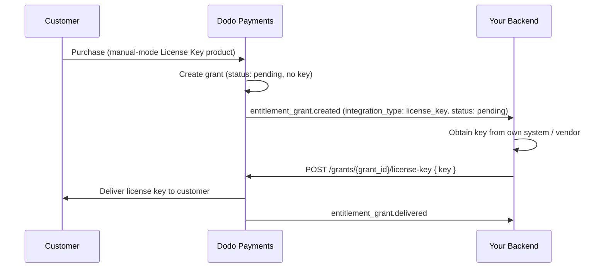

このガイドでは、**手動ライセンスキー発行**システムをエンドツーエンドで構築する方法を説明します。Dodo Payments が支払い時に自動生成する代わりに、各購入が `pending` の付与を作成し、*あなた* が独自のシステム、サードパーティのベンダー、または限られたコードのプールからキーを提供するのを待ちます。

完了することで、次のことが可能になります:

- ライセンスキー権利が `manual` 発行に設定された製品。
- 顧客がキーを待っているときに検出する Webhook リスナー。
- キーを配信し、顧客に自動的に通知する発行コール。

<CardGroup cols={2}>
<Card title="License Keys overview" icon="key" href="/features/license-keys">
完全なライセンスキーライフサイクルと `fulfillment_mode` 設定。
</Card>
<Card title="Fulfill License Key Grant API" icon="code" href="/api-reference/entitlements/fulfill-license-key">
キーを配信するために呼び出すエンドポイントの API リファレンス。
</Card>
</CardGroup>

## 仕組み



手動発行では、**発行**ステップだけが変更されます。配信された後は、アクティベーション、検証、無効化、有効期限、取り消しは自動生成されたキーと同じように動作します。

## 前提条件

このガイドを進めるには次のものが必要です:

- Dodo Payments マーチャントアカウント。
- ダッシュボードの API キー (`DODO_PAYMENTS_API_KEY`) と Webhook シークレットキー。API キー生成ガイドを参照: [API key generation guide](/api-reference/introduction#api-key-generation)。
- Webhook を受信できるバックエンドエンドポイント。

<Info>
`https://test.dodopayments.com` とテストモードの資格情報を使用して構築します。製品に移行するときは `https://live.dodopayments.com` とライブキーに切り替えてください。
</Info>

## ステップ 1 — 手動モードでライセンスキー権利を作成

権利とは、提供するものの再利用可能な定義です。ライセンスキー権利を作成し、その `fulfillment_mode` を `manual` に設定します。

<Tabs>
<Tab title="Dashboard">
<Steps>
<Step title="Open Entitlements">
ダッシュボードの**権利**に移動し、**+** をクリックして新しい権利を作成します。
</Step>
<Step title="Choose License Key">
**ライセンスキー**を統合として選択し、**名前**を付けます。フォームは次のフィールドを公開しています:

- **Fulfillment Mode** — デフォルトでは `Automatic`。これは手動発行を有効にする設定です。次のステップで変更します。
- **License Length** — 各発行されたキーが有効である期間、または **No expiration**。
- **Activations Limit** — 各キーの最大アクティベーション数、または **Unlimited**。
- **Activation Message** — キーを有効化するときに表示される、顧客向けのオプションメッセージ。

<Frame>

</Frame>
</Step>
<Step title="Set Fulfillment Mode to Manual">
**Fulfillment Mode** ドロップダウンを開き、**自動**から**手動**に変更します。これは、このガイド全体を駆動する設定です — これがないと、キーは自動的に生成されメールされ、保留中の付与は作成されません。**手動**を選択すると、各購入であなたが発行するための `pending` 付与が作成されます。**Create Entitlement** をクリックして保存します。
</Step>
</Steps>
</Tab>

<Tab title="API">
権利を `integration_config.fulfillment_mode` を `manual` に設定して作成します。
<CodeGroup>

```typescript Node.js theme={null}
import DodoPayments from 'dodopayments';

const client = new DodoPayments({
  bearerToken: process.env.DODO_PAYMENTS_API_KEY,
  environment: 'test_mode', // defaults to 'live_mode'
});

const entitlement = await client.entitlements.create({
  name: 'Pro License (Manual)',
  integration_type: 'license_key',
  integration_config: {
    fulfillment_mode: 'manual',
    activations_limit: 5,
    duration_count: 1,
    duration_interval: 'Year',
  },
});

console.log(entitlement.id); // ent_...
```

```python Python theme={null}
import os
from dodopayments import DodoPayments

client = DodoPayments(
    bearer_token=os.environ.get("DODO_PAYMENTS_API_KEY"),
    environment="test_mode",  # defaults to "live_mode"
)

entitlement = client.entitlements.create(
    name="Pro License (Manual)",
    integration_type="license_key",
    integration_config={
        "fulfillment_mode": "manual",
        "activations_limit": 5,
        "duration_count": 1,
        "duration_interval": "Year",
    },
)

print(entitlement.id)
```

```bash cURL theme={null}
curl -X POST https://test.dodopayments.com/entitlements \
  -H "Authorization: Bearer $DODO_PAYMENTS_API_KEY" \
  -H "Content-Type: application/json" \
  -d '{
    "name": "Pro License (Manual)",
    "integration_type": "license_key",
    "integration_config": {
      "fulfillment_mode": "manual",
      "activations_limit": 5,
      "duration_count": 1,
      "duration_interval": "Year"
    }
  }'
```

</CodeGroup>
</Tab>
</Tabs>

<Note>
`fulfillment_mode` はデフォルトで `auto` です。それを省略するか、既存の権利を変更しないままでいると、自動動作が維持されます。明示的に `manual` に設定された権利のみが保留中の付与を作成します。
</Note>

## ステップ 2 — 権利を製品に添付

販売したい製品を開き、**詳細設定 → 権利 & クレジット**を展開し、ステップ 1 で手動に設定した**ライセンスキー権利**を選択します。単一の製品で、このライセンスキーを他の権利と同じ購入に一緒に提供することができます。

<Frame caption="Selecting the License Key entitlement in the product entitlements panel.">

</Frame>

<Note>
発行モードは**権利**のプロパティであり、製品のプロパティではありません。ステップ 1 で手動に設定したので、この権利が添付されたすべての製品は購買時に `pending` ライセンスキーの付与を作成します—ここでは何も追加で設定する必要はありません。
</Note>

<Tip>
まだ製品を持っていない場合は、最初に製品（ワンタイムまたはサブスクリプション）を作成します。[ワンタイムペイメント統合ガイド](/developer-resources/integration-guide) を参照して、チェックアウトを通じて製品を販売します。
</Tip>

## ステップ 3 — 保留中の付与を検出

顧客が製品を購入すると、Dodo Payments は `pending` 状態で**キーが添付されていない**付与を作成し、`entitlement_grant.created` Webhook を発火します。これが顧客がキーを待っていることを示す合図です。

### Webhook を監視する

Webhook エンドポイントをセットアップし (ダッシュボードの Developer → Webhooks)、保留中のライセンスキー付与にアクションを起こします。実装は [Standard Webhooks](https://standardwebhooks.com/) の仕様に従います。

```typescript theme={null}
import { Webhook } from 'standardwebhooks';

const webhook = new Webhook(process.env.DODO_WEBHOOK_KEY!);

export async function POST(request: Request) {
  const rawBody = await request.text();
  const headers = {
    'webhook-id': request.headers.get('webhook-id') || '',
    'webhook-signature': request.headers.get('webhook-signature') || '',
    'webhook-timestamp': request.headers.get('webhook-timestamp') || '',
  };

  await webhook.verify(rawBody, headers);
  const event = JSON.parse(rawBody);

  // A customer bought a manual-mode license key and is waiting for it.
  if (
    event.type === 'entitlement_grant.created' &&
    event.data.integration_type === 'license_key' &&
    event.data.status === 'pending'
  ) {
    await queueLicenseKeyFulfillment({
      grantId: event.data.id,
      customerId: event.data.customer_id,
    });
  }

  return new Response('ok');
}
```

付与ペイロードは `integration_type: "license_key"` を運ぶので、余分なルックアップなしでライセンスキー付与を認識できます。完全なペイロードについては [Entitlement Grant webhook reference](/developer-resources/webhooks/intents/entitlement-grant) を参照してください。

### または List Grants API をポーリングする

Webhook に頼りたくない場合は、権利のために付与をリストし、`integration_type` と `status` でフィルタリングします:

Webhook に依存したくない場合、ライセンスキーの承認のための付与を一覧表示し、`status` でフィルタリングしてください。ライセンスキーの承認に関するすべての付与はすでにライセンスキーの付与であるため、`integration_type` フィルタは不要です。

```typescript Node.js theme={null}
const pending = await client.entitlements.grants.list('ent_license_key_id', {
  integration_type: 'license_key',
  status: 'pending',
});

for (const grant of pending.items) {
  console.log(`Grant ${grant.id} for customer ${grant.customer_id} needs a key`);
}
```

```typescript Node.js theme={null}
const pending = await client.entitlements.grants.list('ent_license_key_id', {
  status: 'Pending',
});

for (const grant of pending.items) {
  console.log(`Grant ${grant.id} for customer ${grant.customer_id} needs a key`);
}
```

```bash cURL theme={null}
curl -G https://test.dodopayments.com/entitlements/ent_license_key_id/grants \
  -H "Authorization: Bearer $DODO_PAYMENTS_API_KEY" \
  --data-urlencode "status=Pending"
```

## ステップ 4 — キーを配信

独自のシステムからキーの値を取得し、[Fulfill License Key Grant](/api-reference/entitlements/fulfill-license-key) エンドポイントに送信します。これには秘密の API キー (編集者権限) が必要です。これは公開ライセンスエンドポイントのひとつでは**ありません**。

<CodeGroup>

```typescript Node.js theme={null}
async function fulfill(grantId: string, key: string) {
  const res = await fetch(
    `https://test.dodopayments.com/grants/${grantId}/license-key`,
    {
      method: 'POST',
      headers: {
        'Content-Type': 'application/json',
        Authorization: `Bearer ${process.env.DODO_PAYMENTS_API_KEY}`,
      },
      body: JSON.stringify({
        key,
        // Optional — fall back to the entitlement config when omitted
        activations_limit: 5,
        expires_at: '2027-05-01T00:00:00Z',
      }),
    },
  );

  if (!res.ok) {
    // See the status code table below for handling
    throw new Error(`Fulfillment failed: ${res.status}`);
  }

  return res.json(); // updated grant, now status: "delivered"
}
```

```bash cURL theme={null}
curl -X POST https://test.dodopayments.com/grants/grant_8VbC6JDZ/license-key \
  -H "Authorization: Bearer $DODO_PAYMENTS_API_KEY" \
  -H "Content-Type: application/json" \
  -d '{
    "key": "PRO-AAAA-BBBB-CCCC-DDDD",
    "activations_limit": 5,
    "expires_at": "2027-05-01T00:00:00Z"
  }'
```

</CodeGroup>

### リクエストフィールド

<ParamField body="key" type="string" required>
顧客に配信するためのライセンスキー文字列。空白がトリムされます。空または空白のみの値は拒否されます。
</ParamField>

<ParamField body="activations_limit" type="integer">
キーごとのアクティベーション制限。省略時は権利の設定にフォールバックします。
</ParamField>

<ParamField body="expires_at" type="string">
キーごとの有効期限 (ISO 8601)。省略時は権利設定の期間にフォールバックします。サブスクリプション発行の付与の場合、有効性はサブスクリプションに関係なくつながれたままです。
</ParamField>

成功すれば付与が `delivered` に移行し、顧客に自動的にキーが送信されます（自動発行の下で受け取るのと同じメール）、`entitlement_grant.delivered` が発火します。

顧客はライセンスキー、製品、アクティベーション制限、有効期限、あなたのアクティベーション指示が含まれるメールを受け取ります:

<Frame caption="The license key email the customer receives once you fulfill the grant.">

</Frame>

<Check>
キーを自分でメール送信する必要はありません—付与が完了すると自動的に配信されます。
</Check>

## ステップ 5 — エラーと再試行の処理

エンドポイントは何も配信する前に付与を検証します。次の応答を処理します:

| ステータス | 意味 | すべきこと |
|---|---|---|
| `200` | キーが配信され、付与は現在 `delivered` です。 | 完了。 |
| `400` | ライセンスキーの付与ではない、またはキーが空/空白。 | リクエストを修正し、そのまま再試行しないでください。 |
| `404` | ビジネスにその ID の付与は存在しません。 | `grant_id` を確認します。 |
| `409` | 付与は発行待ちでない（すでに配信されているか、すでにキーがある）、**または** キー値がすでに存在します。 | すでに配信されている場合は、成功として処理します。重複したキーの場合は、別のキーを提供してください。 |
| `422` | リクエスト本文のバリデーションに失敗した（例: `activations_limit < 1`）。 | フィールドを修正して再試行してください。 |

<Warning>
一時的なエラー（タイムアウト、`5xx`）については発行を安全に再試行できます。各付与は一度だけ満たすことができるため、成功したが確認されなかった後の再試行は、二つ目のキーを発行したり重複したメールを送信する代わりに `409` を返します。付与 `id` を冪等性キーとして使用してください。
</Warning>

## フローを確認

1. テストモードで製品を購入 (チェックアウトガイドを参照: [checkout guides](/developer-resources/integration-guide))。
2. Webhook で `entitlement_grant.created` が `status: "pending"` と `integration_type: "license_key"` を受信していることを確認、または付与がこれらのフィルタで List Grants の応答に表示されることを確認します。
3. テストキーで発行エンドポイントを呼び出します。
4. 応答が `status: "delivered"` を示し、`license_key` が入力され、顧客がキーのメールを受け取り、`entitlement_grant.delivered` が発火することを確認します。

<Check>
配信後、顧客は [アクティベーションと検証](/features/license-keys#activation-validation-deactivation) を公開ライセンスエンドポイントに対して自動生成されたキーのように行うことができます。
</Check>

## 関連 API リファレンス

<CardGroup cols={2}>
<Card title="Create Entitlement" icon="plus" href="/api-reference/entitlements/create-entitlement">
`fulfillment_mode: manual` でライセンスキーの権利を作成します。
</Card>
<Card title="List Grants" icon="users" href="/api-reference/entitlements/list-grants">
`integration_type` と `status` でフィルターして保留中の付与を見つけます。
</Card>
<Card title="Fulfill License Key Grant" icon="code" href="/api-reference/entitlements/fulfill-license-key">
キーの値を配信し、付与を配信済みへと移行します。
</Card>
<Card title="Entitlement Grant Webhooks" icon="webhook" href="/developer-resources/webhooks/intents/entitlement-grant">
保留中と配信済みの付与を示す `entitlement_grant.*` イベント。
</Card>
</CardGroup>

<CardGroup cols={2}>
<Card title="Create Entitlement" icon="plus" href="/api-reference/entitlements/create-entitlement">
Create the License Key entitlement with `fulfillment_mode: manual`.
</Card>
<Card title="List Grants" icon="users" href="/api-reference/entitlements/list-grants">
Filter by `integration_type` and `status` to find pending grants.
</Card>
<Card title="Fulfill License Key Grant" icon="code" href="/api-reference/entitlements/fulfill-license-key">
Deliver the key value and transition the grant to delivered.
</Card>
<Card title="Entitlement Grant Webhooks" icon="webhook" href="/developer-resources/webhooks/intents/entitlement-grant">
The `entitlement_grant.*` events that signal pending and delivered grants.
</Card>
</CardGroup>
