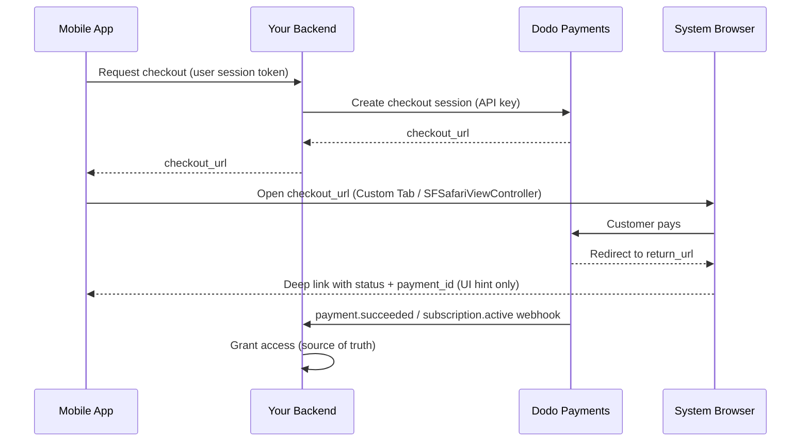

<CardGroup cols={4}>
<Card title="Quick Start" icon="rocket" href="#integration-workflow">
  Get your mobile payment integration running in 4 simple steps
</Card>

<Card title="Platform Examples" icon="code" href="#choose-your-sdk">
  Complete code examples for Android, iOS, React Native, and Flutter
</Card>

<Card title="Checkout Customization" icon="sliders" href="#checkout-page-customization">
  Configure themes, pre-fill, and 14 mobile-specific parameters
</Card>

<Card title="Mobile Recipes" icon="flask" href="#mobile-optimized-recipes">
  Copy-paste checkout configs for 5 common mobile scenarios
</Card>
</CardGroup>

<Info>
Dodo Payments ships an official checkout SDK for **Android, iOS, React Native,
and Flutter**. Each one wraps the pattern documented below (open the checkout
URL, capture the return, parse the result) behind a single typed `start(...)`
call, with abandoned-session recovery built in. Reach for a manual WebView only
if none of them fits your stack.
</Info>

## Prerequisites

Before integrating Dodo Payments into your mobile app, ensure you have:

- **Dodo Payments Account**: Active merchant account with API access
- **API Credentials**: API key and webhook secret key from your dashboard
- **Mobile App Project**: Android, iOS, React Native, or Flutter application
- **Backend Server**: To securely handle checkout session creation

## Integration Workflow

The mobile integration follows a secure 4-step process where your backend handles API calls and your mobile app manages the user experience.



<Info>
The deep-link `status` is only a **UI hint** for what to show the user. Always grant access from the `payment.succeeded` / `subscription.active` **webhook** on your backend — never from the mobile result alone.
</Info>

<Steps>
<Step title="Backend: Create Checkout Session">
<Card title="Checkout Session API Docs" icon="book" href="/developer-resources/checkout-session">
Learn how to create a checkout session in your backend using Node.js, Python, and more. See complete examples and parameter references in the dedicated <strong>Checkout Sessions API</strong> documentation.
</Card>
<Note>
**Security**: Checkout sessions must be created on your backend server, never in the mobile app. This protects your API keys and ensures proper validation.
</Note>

</Step>

<Step title="Mobile: Get Checkout URL">

Your mobile app calls your backend to get the checkout URL. Authenticate
this request with the signed-in user's own session token.

<Tabs>
<Tab title="iOS (Swift)">

```swift
func getCheckoutURL(productId: String, customerEmail: String, customerName: String) async throws -> String {
    let url = URL(string: "https://your-backend.com/api/create-checkout-session")!
    var request = URLRequest(url: url)
    request.httpMethod = "POST"
    request.setValue("application/json", forHTTPHeaderField: "Content-Type")
    request.setValue("Bearer \(userSessionToken)", forHTTPHeaderField: "Authorization")
    
    let requestData: [String: Any] = [
        "productId": productId,
        "customerEmail": customerEmail,
        "customerName": customerName
    ]
    request.httpBody = try JSONSerialization.data(withJSONObject: requestData)
    
    let (data, _) = try await URLSession.shared.data(for: request)
    let response = try JSONDecoder().decode(CheckoutResponse.self, from: data)
    return response.checkout_url
}
```

</Tab>
<Tab title="Android (Kotlin)">

```kotlin
suspend fun getCheckoutURL(productId: String, customerEmail: String, customerName: String): String {
    val client = OkHttpClient()
    val requestBody = JSONObject().apply {
        put("productId", productId)
        put("customerEmail", customerEmail)
        put("customerName", customerName)
    }.toString().toRequestBody("application/json".toMediaType())
    
    val request = Request.Builder()
        .url("https://your-backend.com/api/create-checkout-session")
        .header("Authorization", "Bearer $userSessionToken")
        .post(requestBody)
        .build()
    
    val response = client.newCall(request).execute()
    val responseBody = response.body?.string()
    val jsonResponse = JSONObject(responseBody ?: "")
    return jsonResponse.getString("checkout_url")
}
```

</Tab>
<Tab title="React Native (JavaScript)">

```javascript
const getCheckoutURL = async (productId, customerEmail, customerName) => {
  try {
    const response = await fetch('https://your-backend.com/api/create-checkout-session', {
      method: 'POST',
      headers: {
        'Content-Type': 'application/json',
        'Authorization': `Bearer ${userSessionToken}`,
      },
      body: JSON.stringify({
        productId,
        customerEmail,
        customerName
      })
    });
    
    const data = await response.json();
    return data.checkout_url;
  } catch (error) {
    console.error('Failed to get checkout URL:', error);
    throw error;
  }
};
```

</Tab>
<Tab title="Flutter (Dart)">

```dart
import 'dart:convert';
import 'package:http/http.dart' as http;

Future<String> getCheckoutUrl({
  required String productId,
  required String customerEmail,
  required String customerName,
}) async {
  final response = await http.post(
    Uri.parse('https://your-backend.com/api/create-checkout-session'),
    headers: {
      'Content-Type': 'application/json',
      'Authorization': 'Bearer $userSessionToken',
    },
    body: jsonEncode({
      'productId': productId,
      'customerEmail': customerEmail,
      'customerName': customerName,
    }),
  );

  if (response.statusCode != 200) {
    throw Exception('Failed to get checkout URL: ${response.statusCode}');
  }
  return jsonDecode(response.body)['checkout_url'] as String;
}
```

</Tab>
</Tabs>
<Note>
**Security**: Mobile apps only communicate with your backend, never directly with Dodo Payments API.
</Note>
</Step>

<Step title="Mobile: Open Checkout in Browser">
Open the checkout URL in a secure in-app browser for payment processing.
Or skip the manual setup entirely with the official checkout SDK for your
platform.

<Card title="Pick your mobile SDK" icon="box" href="#choose-your-sdk">
  Install steps and setup instructions for Android, iOS, React Native, and Flutter.
</Card>

</Step>

<Step title="Backend: Handle Payment Completion">
Process payment completion via webhooks and redirect URLs to confirm payment status.
</Step>
</Steps>

## Choose Your SDK

Every mobile SDK exposes the same contract: one `start(...)` call opens Dodo's
hosted checkout in the platform's native browser surface and returns a typed
`CheckoutResult` whose `status` is `succeeded`, `failed`, `cancelled`,
`pending`, or `expired`. None of them holds an API key or calls the Dodo
Payments API, and all four support abandoned-session recovery.

<CardGroup cols={2}>
<Card title="Android" icon="android" href="/developer-resources/sdks/android">
  `com.dodopayments.api:checkout-android` opens a Chrome Custom Tab. Requires `minSdk` 23.
</Card>
<Card title="iOS" icon="apple" href="/developer-resources/sdks/ios">
  `dodopayments-mobile-sdk-ios` opens `SFSafariViewController`. Requires iOS 16+.
</Card>
<Card title="React Native" icon="react" href="/developer-resources/sdks/react-native">
  `@dodopayments/react-native-checkout`, a Turbo Module over both native cores. Requires React Native 0.76+.
</Card>
<Card title="Flutter" icon="layer-group" href="/developer-resources/sdks/flutter">
  `dodopayments_checkout`, a Pigeon channel over both native cores. Requires Flutter 3.44+.
</Card>
</CardGroup>

<Warning>
The `status` you get back is a UI hint, not proof of payment. Confirm every
payment from your backend via the `payment.succeeded` / `subscription.active`
webhook, or by retrieving the payment with your secret key.
</Warning>

### Registering a Callback URL Scheme

All four SDKs hand control back to your app through a custom URL scheme that
you choose, for example `myapp://checkout/return`. Register it once per
platform:

<Tabs>
<Tab title="Android">

```kotlin android/app/build.gradle
android {
    defaultConfig {
        manifestPlaceholders["dodoCallbackScheme"] = "myapp"
    }
}
```

The SDK's own manifest already declares the redirect activity, so there is no
manifest XML to add.
</Tab>
<Tab title="iOS">

```xml Info.plist
<key>CFBundleURLTypes</key>
<array>
  <dict>
    <key>CFBundleURLName</key>
    <string>myapp</string>
    <key>CFBundleURLSchemes</key>
    <array>
      <string>myapp</string>
    </array>
  </dict>
</array>
```

On iOS you must also forward incoming URLs into the SDK, because
`SFSafariViewController` cannot catch its own return URL. See the
[iOS](/developer-resources/sdks/ios) or
[React Native](/developer-resources/sdks/react-native) page for the exact
handler.
</Tab>
<Tab title="Expo">
`@dodopayments/react-native-checkout` ships a config plugin that registers the
scheme for both platforms at `prebuild`. Pass it a `scheme` option:

```json app.json
{
  "expo": {
    "scheme": "myapp",
    "plugins": [
      [
        "@dodopayments/react-native-checkout",
        { "scheme": "myappcheckout" }
      ]
    ]
  }
}
```

`scheme` must match `returnUrl` and must differ from `expo.scheme`, which Expo
already registers on `MainActivity`. See the
[React Native SDK](/developer-resources/sdks/react-native) page for details.

If `android/app/build.gradle` is hand-maintained without a standard
`defaultConfig { }` block, set the placeholder manually instead (see the
Android tab).

Works with development builds only, not Expo Go. Run
`npx expo prebuild --clean` after editing `app.json`.
</Tab>
</Tabs>

<Note>
Prefer to build it yourself? Open the `checkout_url` in the platform's system
browser (Android Custom Tabs / iOS `SFSafariViewController`) and intercept the
navigation to your `return_url`, then read the `status` and `payment_id` query
parameters. The SDKs above do exactly this for you.
</Note>

<Warning>
**Do not open checkout inside an embedded WebView (`WKWebView` / Android
`WebView`).** This is the single most common mobile integration problem: an
embedded WebView **suppresses Apple Pay and Google Pay**, and can also break
3-D Secure challenges and saved-card autofill - so customers see fewer payment
options and more failures. Always use the SDK, or open the `checkout_url` in the
system browser (Custom Tabs / `SFSafariViewController`). That native browser
surface is exactly why Apple Pay and Google Pay keep working.
</Warning>

## Appearance Customization

Every SDK accepts an optional `customization` parameter on `start(...)` /
`CheckoutParams` that controls the native browser surface's appearance and
behavior - the toolbar, buttons, and presentation. This is separate from the
checkout page's own theme, which you configure server-side via
[`customization.theme_config`](/developer-resources/checkout-session) on the
checkout session.

Options are grouped by platform because Android's Custom Tab and iOS's
`SFSafariViewController` expose different native controls. All fields are
optional; omitting `customization` entirely uses each platform's default
appearance.

<AccordionGroup>
<Accordion title="Android - Custom Tab">

<ParamField body="toolbarColor" type="Color">
Toolbar background color.
</ParamField>

<ParamField body="navigationBarColor" type="Color">
Navigation bar color.
</ParamField>

<ParamField body="navigationBarDividerColor" type="Color">
Divider color above the navigation bar.
</ParamField>

<ParamField body="closeButtonStyle" type="'default' | 'back'">
`default` shows the system "X" icon; `back` draws a back arrow instead.
</ParamField>

<ParamField body="closeButtonPosition" type="'start' | 'end'">
Which side of the toolbar the close button appears on.
</ParamField>

<ParamField body="shareButtonEnabled" type="boolean">
Shows the toolbar's share icon.
</ParamField>

<ParamField body="showTitleEnabled" type="boolean">
Shows the page title under the URL in the toolbar.
</ParamField>

<ParamField body="urlBarHidingEnabled" type="boolean">
Lets the toolbar auto-hide as the page scrolls.
</ParamField>

<ParamField body="bookmarksButtonEnabled" type="boolean">
Shows "Bookmark this page" in the overflow menu.
</ParamField>

<ParamField body="downloadsButtonEnabled" type="boolean">
Shows "Download page" in the overflow menu.
</ParamField>

<ParamField body="colorScheme" type="'system' | 'light' | 'dark'">
Forces light or dark appearance regardless of the device's system setting.
</ParamField>

</Accordion>

<Accordion title="iOS - SFSafariViewController">

<ParamField body="dismissButtonStyle" type="'done' | 'close' | 'cancel'">
Label or icon for the dismiss button.
</ParamField>

<ParamField body="presentationStyle" type="'pageSheet' | 'fullScreen'">
`pageSheet` presents as a card with swipe-to-dismiss; `fullScreen` covers the whole screen.
</ParamField>

<ParamField body="barCollapsingEnabled" type="boolean">
Lets the toolbar collapse on scroll. Only visible when `presentationStyle` is `fullScreen` - `pageSheet` keeps the bars pinned regardless of this setting.
</ParamField>

<ParamField body="colorScheme" type="'system' | 'light' | 'dark'">
Forces light or dark appearance regardless of the device's system setting.
</ParamField>

</Accordion>
</AccordionGroup>

<Tabs>
<Tab title="React Native">

```typescript
const result = await DodoCheckout.start({
  checkoutUrl,
  returnUrl: 'myapp://checkout/return',
  customization: {
    android: { toolbarColor: '#6366F1', closeButtonStyle: 'back' },
    ios: { presentationStyle: 'fullScreen', colorScheme: 'dark' },
  },
});
```

</Tab>
<Tab title="Flutter">

```dart
final result = await DodoCheckout.instance.start(
  CheckoutParams(
    checkoutUrl: Uri.parse(checkoutUrl),
    returnUrl: Uri.parse('myapp://checkout/return'),
    customization: BrowserCustomization(
      android: AndroidBrowserOptions(
        toolbarColor: Color(0xFF6366F1),
        closeButtonStyle: CloseButtonStyle.back,
      ),
      ios: IosBrowserOptions(
        presentationStyle: PresentationStyle.fullScreen,
        colorScheme: BrowserColorScheme.dark,
      ),
    ),
  ),
);
```

</Tab>
<Tab title="Android (Kotlin)">

```kotlin
val result = DodoCheckout.start(
    activity,
    CheckoutParams(
        checkoutUrl = checkoutUrl,
        returnUrl = "myapp://checkout/return",
        customization = BrowserCustomization(
            toolbarColor = Color.parseColor("#6366F1"),
            closeButtonStyle = BrowserCustomization.CloseButtonStyle.BACK,
        )
    )
) { event -> }
```

</Tab>
<Tab title="iOS (Swift)">

```swift
let result = try await DodoCheckout.start(
    checkoutUrl: checkoutUrl,
    returnUrl: URL(string: "myapp://checkout/return")!,
    customization: BrowserCustomization(
        presentationStyle: .fullScreen,
        colorScheme: .dark
    )
)
```

</Tab>
</Tabs>

## Checkout Page Customization

The [Appearance Customization](#appearance-customization) section above controls the native browser surface - toolbar, buttons, color scheme. The checkout *page itself* - what fields appear, the theme, which payment methods show - is configured server-side when you create the checkout session. These parameters have the most impact on mobile conversion.

The parameters below sit in three different places on the checkout session request - the **Where it goes** column tells you which object each one belongs in. Getting this wrong is the most common mistake: a parameter placed in the wrong object is silently ignored.

| Parameter | Where it goes | Mobile benefit | Default | Set when… |
|-----------|---------------|---------------|---------|-----------|
| `show_order_details` | `customization` | Collapses the order summary so payment methods appear at the top of the screen | `true` | Always set `false` on mobile - moving payment methods above the fold significantly reduces drop-off |
| `minimal_address` | top-level | Requires only a postcode; hides street, city, and state fields | `false` | Almost always on mobile - every extra field loses conversions |
| `theme` | `customization` | Controls light or dark appearance of the checkout page | Business default | Use `"system"` to match the device OS preference |
| `theme_config` | `customization` | Full brand palette - colors, fonts, border radius, pay-button label | None | When the checkout must feel like part of your app |
| `force_language` | `customization` | Overrides browser locale detection | Auto-detect | Set it from your app locale rather than relying on the browser |
| `show_on_demand_tag` | `customization` | Shows or hides the "on-demand" label on the checkout page | `true` | Set `false` when you use on-demand billing purely as card tokenisation |
| `show_saved_payment_methods` | top-level | Shows a returning customer's saved cards for one-tap payment | `false` | Enable for signed-in users who have paid before |
| `allow_discount_code` | `feature_flags` | Shows the promo-code input field | `true` | Set `false` to shorten the form; users who leave to find a code rarely return |
| `allow_currency_selection` | `feature_flags` | Lets the customer switch billing currency | `true` | Set `false` when you lock the currency with `billing_currency` |
| `redirect_immediately` | `feature_flags` | Skips the success page and jumps straight to `return_url` | `false` | Enable for a seamless handoff back to your app |
| `confirm` | top-level | Finalises the payment without an extra confirmation step | `false` | Use with `payment_method_id` for one-click checkout |
| `short_link` | top-level | Returns a shorter checkout URL | `false` | Useful when the URL must fit in a push notification or SMS |
| `payment_method_id` | top-level | Pre-selects a saved payment method | - | Pass together with `confirm: true` for one-click checkout |
| `allowed_payment_method_types` | top-level | Whitelists the payment methods that appear | All enabled | Limit to the methods that work for your product type |

<Warning>
**Always pass `billing_currency` and `billing_address.country` together.** If either is omitted, adaptive currency may silently change the billing currency based on the customer's IP address. One merchant saw a US subscription switch to EUR when their customer traveled to Europe - because the billing country was not explicitly set.
</Warning>

<Tip>
**Biggest single conversion lift on mobile:** set `show_order_details: false` and `minimal_address: true`. Moving payment methods above the fold and reducing form fields are the two highest-impact changes you can make.
</Tip>

<Frame caption="show_order_details: false moves the contact and payment fields above the fold, instead of behind the order summary.">
  
</Frame>

Set `minimal_address: true` to collect only a postcode instead of the full street, city, and state fields:

<Frame caption="minimal_address: true reduces the billing address to a single postcode field.">
  
</Frame>

Set `theme: "system"` so the checkout follows the device's light or dark mode preference:

<Frame caption="With theme: system, the checkout follows the device's light or dark appearance automatically.">
  
</Frame>

<Info>
**Payment method availability varies by product type.** Apple Pay and Cash App are supported for non-zero recurring subscriptions. For one-time payments, all enabled methods are available.
</Info>

<Card title="Full checkout session parameter reference" icon="book" href="/developer-resources/checkout-session">
  See every available parameter, type, and default value in the Checkout Sessions guide.
</Card>

## Mobile-Optimized Recipes

Each recipe below is a complete checkout session request body. Copy the one that matches your scenario, swap in your product ID, and pass it to your backend's session-creation endpoint.

<AccordionGroup>
<Accordion title="Minimal Mobile Checkout - fastest path to payment">

Use this when you want the shortest possible form: payment methods at the top, only a postcode required for address, no discount field, theme matches the device.

<Tabs>
<Tab title="Node.js SDK">

```javascript expandable
import DodoPayments from 'dodopayments';

const client = new DodoPayments({
  bearerToken: process.env.DODO_PAYMENTS_API_KEY,
  environment: 'test_mode',
});

const session = await client.checkoutSessions.create({
  product_cart: [{ product_id: 'pdt_your_product_id', quantity: 1 }],
  customer: { email: 'user@example.com', name: 'Jane Smith' },
  billing_address: { country: 'US' },
  return_url: 'myapp://checkout/success',
  cancel_url: 'myapp://checkout/cancelled',
  billing_currency: 'USD',
  minimal_address: true,
  customization: {
    show_order_details: false,
    theme: 'system',
  },
  feature_flags: {
    allow_discount_code: false,
    allow_currency_selection: false,
  },
});

console.log(session.checkout_url);
```

</Tab>
<Tab title="Python SDK">

```python expandable
import os
import dodopayments

client = dodopayments.DodoPayments(
    bearer_token=os.environ.get("DODO_PAYMENTS_API_KEY"),
    environment="test_mode",
)

session = client.checkout_sessions.create(
    product_cart=[{"product_id": "pdt_your_product_id", "quantity": 1}],
    customer={"email": "user@example.com", "name": "Jane Smith"},
    billing_address={"country": "US"},
    return_url="myapp://checkout/success",
    cancel_url="myapp://checkout/cancelled",
    billing_currency="USD",
    minimal_address=True,
    customization={
        "show_order_details": False,
        "theme": "system",
    },
    feature_flags={
        "allow_discount_code": False,
        "allow_currency_selection": False,
    },
)

print(session.checkout_url)
```

</Tab>
</Tabs>

<Note>
See [Checkout Sessions](/developer-resources/checkout-session) for all available parameters and their defaults.
</Note>
</Accordion>

<Accordion title="Branded Mobile Checkout - custom colors, fonts, and button label">

Use this when the checkout page must feel like part of your app. Set your brand colors, a custom font, and a localized pay-button label.

<Frame>
  
</Frame>

<Tabs>
<Tab title="Node.js SDK">

```javascript expandable
const session = await client.checkoutSessions.create({
  product_cart: [{ product_id: 'pdt_your_product_id', quantity: 1 }],
  customer: { email: 'user@example.com', name: 'Jane Smith' },
  billing_address: { country: 'US' },
  billing_currency: 'USD',
  return_url: 'myapp://checkout/success',
  minimal_address: true,
  customization: {
    show_order_details: false,
    theme: 'dark',
    theme_config: {
      dark: {
        button_primary: '#7C3AED',
        button_primary_hover: '#6D28D9',
        button_text_primary: '#FFFFFF',
        bg_primary: '#1A1A2E',
        bg_secondary: '#16213E',
        text_primary: '#E2E8F0',
      },
      pay_button_text: 'Complete Purchase',
      radius: '8px',
    },
  },
});
```

</Tab>
<Tab title="Python SDK">

```python expandable
session = client.checkout_sessions.create(
    product_cart=[{"product_id": "pdt_your_product_id", "quantity": 1}],
    customer={"email": "user@example.com", "name": "Jane Smith"},
    billing_address={"country": "US"},
    billing_currency="USD",
    return_url="myapp://checkout/success",
    minimal_address=True,
    customization={
        "show_order_details": False,
        "theme": "dark",
        "theme_config": {
            "dark": {
                "button_primary": "#7C3AED",
                "button_primary_hover": "#6D28D9",
                "button_text_primary": "#FFFFFF",
                "bg_primary": "#1A1A2E",
                "bg_secondary": "#16213E",
                "text_primary": "#E2E8F0",
            },
            "pay_button_text": "Complete Purchase",
            "radius": "8px",
        },
    },
)
```

</Tab>
</Tabs>

<Note>
`theme_config` accepts separate `dark` and `light` objects so the palette adapts to the device's current appearance. See [Checkout Sessions](/developer-resources/checkout-session) for the full color key reference.
</Note>
</Accordion>

<Accordion title="One-Click Returning Customer - saved card, instant confirmation">

Use this for signed-in users who have paid before. Combine a customer ID, their saved payment method, and `confirm: true` to skip the checkout form entirely.

<Tabs>
<Tab title="Node.js SDK">

```javascript expandable
const session = await client.checkoutSessions.create({
  product_cart: [{ product_id: 'pdt_your_product_id', quantity: 1 }],
  customer: { customer_id: 'cus_returning_customer_id' },
  billing_address: { country: 'US' },
  billing_currency: 'USD',
  return_url: 'myapp://checkout/success',
  payment_method_id: 'pm_saved_payment_method_id',
  confirm: true,
  show_saved_payment_methods: true,           // top-level parameter
  feature_flags: { redirect_immediately: true },
});
```

</Tab>
<Tab title="Python SDK">

```python expandable
session = client.checkout_sessions.create(
    product_cart=[{"product_id": "pdt_your_product_id", "quantity": 1}],
    customer={"customer_id": "cus_returning_customer_id"},
    billing_address={"country": "US"},
    billing_currency="USD",
    return_url="myapp://checkout/success",
    payment_method_id="pm_saved_payment_method_id",
    confirm=True,
    show_saved_payment_methods=True,           # top-level parameter
    feature_flags={"redirect_immediately": True},
)
```

</Tab>
</Tabs>

<Note>
The `status` in the deep-link return is a UI hint only. Confirm access by listening for the `payment.succeeded` webhook on your backend.
</Note>
</Accordion>

<Accordion title="Subscription with Free Trial - trial before first charge">

Use this for subscription products that offer a free trial period before the first billing cycle.

<Tabs>
<Tab title="Node.js SDK">

```javascript expandable
const session = await client.checkoutSessions.create({
  product_cart: [{ product_id: 'pdt_your_subscription_product_id', quantity: 1 }],
  customer: { email: 'user@example.com', name: 'Jane Smith' },
  billing_address: { country: 'US' },
  billing_currency: 'USD',
  return_url: 'myapp://subscription/activated',
  cancel_url: 'myapp://subscription/cancelled',
  minimal_address: true,
  customization: {
    show_order_details: false,
    theme: 'system',
  },
  subscription_data: { trial_period_days: 14 },
});
```

</Tab>
<Tab title="Python SDK">

```python expandable
session = client.checkout_sessions.create(
    product_cart=[{"product_id": "pdt_your_subscription_product_id", "quantity": 1}],
    customer={"email": "user@example.com", "name": "Jane Smith"},
    billing_address={"country": "US"},
    billing_currency="USD",
    return_url="myapp://subscription/activated",
    cancel_url="myapp://subscription/cancelled",
    minimal_address=True,
    customization={"show_order_details": False, "theme": "system"},
    subscription_data={"trial_period_days": 14},
)
```

</Tab>
</Tabs>

<Note>
Grant feature access when your backend receives the `subscription.active` webhook - not when the mobile SDK returns. See [Subscription Integration Guide](/developer-resources/subscription-integration-guide) for the full webhook flow.
</Note>
</Accordion>

<Accordion title="On-Demand Mandate - save a card for future variable charges">

Use this to tokenize a customer's card for later charges (wallet top-ups, pay-as-you-go, BNPL) without showing a "subscription" label. The customer authorizes their payment method once; you charge variable amounts on demand later.

<Info>
This is the pattern used by apps that charge based on usage - for example, an astrology app that charges per session from a pre-authorized card, rather than on a fixed schedule.
</Info>

<Tabs>
<Tab title="Node.js SDK">

```javascript expandable
// Step 1: Authorize the mandate (no charge yet)
const session = await client.checkoutSessions.create({
  product_cart: [{ product_id: 'pdt_your_subscription_product_id', quantity: 1 }],
  customer: { email: 'user@example.com', name: 'Jane Smith' },
  billing_address: { country: 'US' },
  billing_currency: 'USD',
  return_url: 'myapp://mandate/authorized',
  cancel_url: 'myapp://mandate/cancelled',
  minimal_address: true,
  customization: {
    show_order_details: false,
    show_on_demand_tag: false, // hides the "on-demand" / "subscription" label
    theme: 'system',
  },
  subscription_data: {
    on_demand: { mandate_only: true },
  },
});

// Step 2: Later, charge any amount using the subscription ID
// (received via the subscription.active webhook after mandate authorization)
// await client.subscriptions.charge(subscriptionId, {
//   product_price: 2000,         // $20.00 in cents
//   product_currency: 'USD',
//   product_description: 'Session credits',
// });
```

</Tab>
<Tab title="Python SDK">

```python expandable
# Step 1: Authorize the mandate (no charge yet)
session = client.checkout_sessions.create(
    product_cart=[{"product_id": "pdt_your_subscription_product_id", "quantity": 1}],
    customer={"email": "user@example.com", "name": "Jane Smith"},
    billing_address={"country": "US"},
    billing_currency="USD",
    return_url="myapp://mandate/authorized",
    cancel_url="myapp://mandate/cancelled",
    minimal_address=True,
    customization={
        "show_order_details": False,
        "show_on_demand_tag": False,  # hides the "on-demand" / "subscription" label
        "theme": "system",
    },
    subscription_data={"on_demand": {"mandate_only": True}},
)

# Step 2: Later, charge any amount using the subscription ID
# client.subscriptions.charge(subscription_id, {
#     "product_price": 2000,  # $20.00 in cents
#     "product_currency": "USD",
#     "product_description": "Session credits",
# })
```

</Tab>
</Tabs>

<Warning>
On-demand charges require a minimum of 1 USD (100 cents). Amounts below 1 USD will be rejected with `"value out of range"`. For a zero-amount authorization, use `mandate_only: true` as shown above, then charge at least 1 USD in subsequent calls.
</Warning>

<Note>
See [On-Demand Subscriptions](/developer-resources/ondemand-subscriptions) for the full charge flow, webhook events, and retry policies.
</Note>
</Accordion>
</AccordionGroup>

## Subscription Flows from Mobile

Subscriptions are created through the same checkout session flow used for one-time payments - the mobile SDK opens the hosted checkout, the customer subscribes, and your app handles the deep-link return. The subscription lifecycle is then managed entirely on the backend.

### Regular Recurring Subscriptions

For fixed-interval billing (monthly, annual), create a checkout session with a subscription product and a deep-link `return_url`. Your backend receives `subscription.active` when the subscription is confirmed.

<Info>
**Apple Pay** and **Cash App** are supported for non-zero recurring subscriptions.
</Info>

For the complete backend webhook flow, see the [Subscription Integration Guide](/developer-resources/subscription-integration-guide).

---

### On-Demand Subscriptions

On-demand subscriptions let you authorize a customer's payment method once and charge variable amounts later - ideal for wallet top-ups, pay-as-you-go, and any scenario where the charge amount is not known in advance. See the **On-Demand Mandate** recipe above for the full request body.

Key mobile considerations:

- Set `show_on_demand_tag: false` so the checkout page does not show "subscription" or "on-demand" language. For card-tokenization use cases, customers do not expect subscription terminology.
- After the mandate is authorized, your backend receives `subscription.active`. Store the `subscription_id` - you will use it for all future charges.

<Warning>
Minimum charge is 1 USD (100 cents). On-demand charges below 1 USD will be rejected with `"value out of range"`. Either charge at least 1 USD, or use `mandate_only: true` to authorize without charging and collect the first real amount later.
</Warning>

<Warning>
**Avoid rapid-fire retries.** If a previous charge is still processing, a new charge on the same subscription fails with `"Cannot create new charge as previous payment is not successful yet"`. This is especially common with Indian payment methods (UPI, Indian debit/credit cards) where RBI mandate rules can hold a transaction in processing state for up to 48 hours. Add a cooldown check in your charge logic before retrying.
</Warning>

See [On-Demand Subscriptions](/developer-resources/ondemand-subscriptions) for the complete charge endpoint, webhook events, and retry policies.

---

### Subscription with Free Trial

Pass `subscription_data.trial_period_days` in the checkout session to offer a trial before the first billing cycle. The customer authorizes their payment method during trial signup; the first charge happens automatically when the trial ends. See the **Subscription with Free Trial** recipe above for the full request body.

---

### Upgrades and Downgrades

Plan changes are made via API on your backend, not through a new checkout session. Dodo Payments calculates proration automatically. To give customers a self-service option, embed or link to the [Customer Portal](/features/customer-portal).

<CardGroup cols={2}>
<Card title="Subscription Integration Guide" icon="repeat" href="/developer-resources/subscription-integration-guide">
  Full backend setup: webhook flow, access provisioning, cancellation
</Card>
<Card title="On-Demand Subscriptions" icon="bolt" href="/developer-resources/ondemand-subscriptions">
  Mandate authorization, variable charges, and retry policies
</Card>
<Card title="Upgrade / Downgrade" icon="arrows-up-down" href="/developer-resources/subscription-upgrade-downgrade">
  Proration strategies, plan changes, and seat adjustments
</Card>
<Card title="Customer Portal" icon="user" href="/features/customer-portal">
  Self-service subscription management for your customers
</Card>
</CardGroup>

## Reducing Checkout Drop-Offs

Mobile checkouts see higher abandonment than web - smaller screens, more distractions, and longer forms all contribute. The fastest improvements come from the checkout session configuration itself.

### Optimize the Form

| Setting | Recommended value | Effect |
|---------|------------------|--------|
| `show_order_details` | `false` | Collapses the order summary; payment methods appear at the top |
| `minimal_address` | `true` | Only a postcode is required; removes street, city, and state |
| `show_saved_payment_methods` | `true` | One-tap payment for returning customers |
| `allow_discount_code` | `false` | Removes the promo-code field |
| `theme` | `"system"` | Matches the device light or dark preference |
| `force_language` | Your app locale | Prevents the checkout defaulting to the browser language |

### Pre-Fill Customer Data

Every field the customer does not have to type is a reason not to abandon:

- **New customers** - set `customer.email` and `customer.name` from your auth session.
- **Returning customers** - set `customer.customer_id` to pre-fill all stored details automatically.
- **Currency** - always pass `billing_currency` and `billing_address.country` together.

### Recovery Tools

<CardGroup cols={2}>
<Card title="Abandoned Cart Recovery" icon="cart-shopping" href="/features/recovery/abandoned-cart-recovery">
  Automated email sequences for incomplete checkouts
</Card>
<Card title="Payment Retries" icon="rotate" href="/features/recovery/payment-retries">
  Smart retry logic for failed subscription renewals
</Card>
<Card title="Subscription Dunning" icon="envelope" href="/features/recovery/subscription-dunning">
  Re-engagement emails for lapsed subscriptions
</Card>
<Card title="Recovery Overview" icon="chart-line" href="/features/recovery/overview">
  All recovery tools and their combined revenue impact
</Card>
</CardGroup>

<Tip>
**Test cart abandonment emails before enabling them.** Create a checkout session in live mode and enter invalid card details. The failed payment triggers the recovery email flow, letting you preview exactly what your customers receive.
</Tip>

## Best Practices

- **Security**: Never ship an API key in your app. Create checkout sessions on your backend and pass only the resulting `checkout_url` to the client.
- **Authority**: Treat `CheckoutResult.status` as a UI hint. Grant access only after your backend confirms the payment.
- **User Experience**: Show a loading state while your backend creates the session, and handle `cancelled` as a normal outcome rather than an error.
- **Testing**: Use test mode and test cards, and verify the return-URL round trip on a real device as well as a simulator.
- **Conversion**: Set `show_order_details: false` and `minimal_address: true` for the best mobile checkout completion rates. Moving payment methods above the fold and reducing form fields are the two highest-impact changes you can make.
- **Currency**: Always pass both `billing_currency` and `billing_address.country` explicitly - if either is missing, adaptive currency may change the billing currency based on the customer's IP address.
- **On-demand billing**: Set `show_on_demand_tag: false` when using on-demand subscriptions for card tokenization. Customers using a wallet top-up flow do not expect to see "subscription" language.
- **Recovery**: Enable abandoned cart recovery in your Dodo Payments dashboard to automatically re-engage customers who do not complete checkout.

## Troubleshooting

### Common Issues

- **Callback never arrives**: The scheme in `returnUrl` must match the one you registered. On Android that is the `dodoCallbackScheme` manifest placeholder; on iOS and React Native it is the `Info.plist` URL type.
- **Checkout returns to the browser instead of your app (iOS)**: You haven't forwarded the incoming URL. Call `DodoCheckout.handleOpenURL(url)` from `.onOpenURL`, `scene(_:openURLContexts:)`, or a React Native `Linking` listener.
- **`PLATFORM_ERROR` on Android**: Most often a scheme mismatch. It can also appear if your `MainActivity` sets `android:taskAffinity=""` (the stock `flutter create` default), which lets some OEM builds lose the in-flight checkout.
- **`ALREADY_IN_PROGRESS`**: A checkout is still open. Await or dismiss the previous one before starting another.
- **Build fails with an unresolved placeholder**: You added the Android SDK but never set `manifestPlaceholders["dodoCallbackScheme"]`.
- **Payment succeeded but access wasn't granted**: Expected if you're keying off the mobile result. Grant access from the `payment.succeeded` / `subscription.active` webhook instead.
- **Apple Pay / Google Pay not showing on mobile**: The checkout is loading inside an embedded WebView (`WKWebView` / Android `WebView`), which suppresses wallets and can break 3-D Secure. Open it with the SDK or in the system browser (Custom Tabs / `SFSafariViewController`) instead.

## Additional Resources
- [Payment Integration Guide](/developer-resources/integration-guide)
- [Webhook Documentation](/developer-resources/webhooks/intents/webhook-events-guide)
- [Testing Process](/miscellaneous/testing-process)
- [Technical FAQs](/miscellaneous/faq)
- [Checkout Session Customization](/developer-resources/checkout-session)
- [On-Demand Subscriptions](/developer-resources/ondemand-subscriptions)
- [Subscription Upgrade/Downgrade](/developer-resources/subscription-upgrade-downgrade)
- [Abandoned Cart Recovery](/features/recovery/abandoned-cart-recovery)
- [Customer Portal](/features/customer-portal)

<Check>
For questions or support, contact <a href="mailto:support@dodopayments.com">support@dodopayments.com</a>.
</Check>