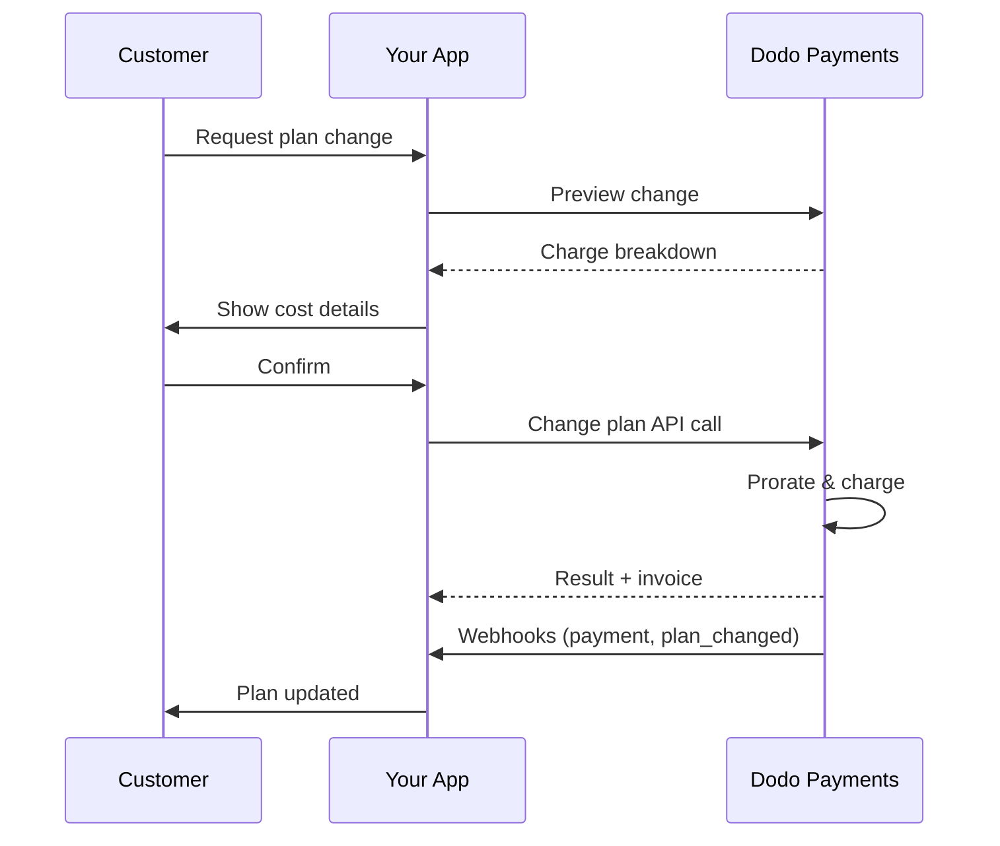
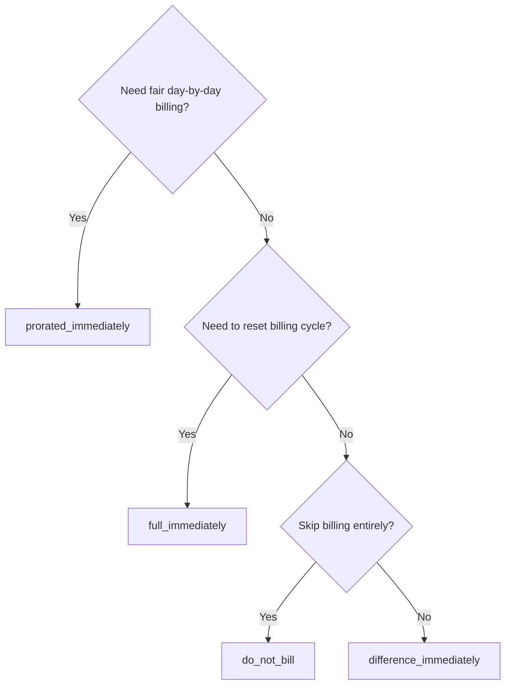
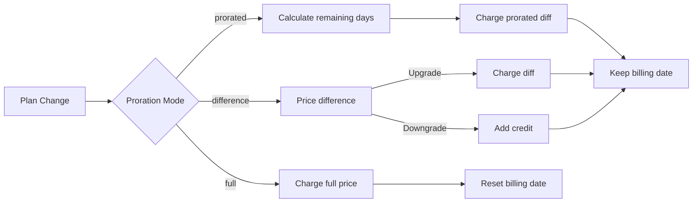

<CardGroup cols={3}>
<Card title="Change Plan API" icon="code" href="/api-reference/subscriptions/change-plan">
  Full API docs for updating subscriptions.
</Card>
<Card title="Plan Change Preview" icon="eye" href="/api-reference/subscriptions/preview-change-plan">
  See charge amounts before changing plans.
</Card>
<Card title="Integration Guide" icon="book" href="/developer-resources/subscription-integration-guide">
  Step-by-step subscription setup.
</Card>
</CardGroup>

## What is a subscription upgrade or downgrade?

Changing plans lets you move a customer between subscription tiers or quantities. Use it to:
- Align pricing with usage or features
- Move from monthly to annual (or vice versa)
- Adjust quantity for seat-based products

<Info>
Plan changes can trigger an immediate charge depending on the proration mode you choose.
</Info>

## When to use plan changes

- Upgrade when a customer needs more features, usage, or seats
- Downgrade when usage decreases
- Migrate users to a new product or price without cancelling their subscription

## Plan Change Flow



## Prerequisites

Before implementing subscription plan changes, ensure you have:

- A Dodo Payments merchant account with active subscription products
- API credentials (API key and webhook secret key) from the dashboard
- An existing active subscription to modify
- Webhook endpoint configured to handle subscription events

<Info>
For detailed setup instructions, see our [Integration Guide](/developer-resources/integration-guide#dashboard-setup).
</Info>

## Step-by-Step Implementation Guide

Follow this comprehensive guide to implement subscription plan changes in your application:

<Steps>
<Step title="Understand Plan Change Requirements">
Before implementing, determine:
- Which subscription products can be changed to which others
- What proration mode fits your business model
- How to handle failed plan changes gracefully
- Which webhook events to track for state management

<Tip>
Test plan changes thoroughly in test mode before implementing in production.
</Tip>
</Step>

<Step title="Choose Your Proration Strategy">
Select the billing approach that aligns with your business needs:

<Tabs>
<Tab title="prorated_immediately">
Best for: SaaS applications wanting to charge fairly for unused time
- Calculates exact prorated amount based on remaining cycle time
- Charges a prorated amount based on unused time remaining in the cycle
- Provides transparent billing to customers
</Tab>

<Tab title="difference_immediately">
Best for: Clear upgrade/downgrade scenarios
- Upgrade: Charge immediate difference (e.g., $30→$80 = charge $50)
- Downgrade: Credit remaining value for future renewals
- Simplifies billing logic and customer communication
</Tab>

<Tab title="full_immediately">
Best for: When you want to reset the billing cycle
- Charges full amount of new plan immediately
- Ignores remaining time from old plan
- Useful for annual to monthly transitions
</Tab>

<Tab title="do_not_bill">
Best for: Free migrations, courtesy switches, or absorbing cost differences
- No charges or credits calculated
- Customer moves to the new plan immediately without any billing adjustment
- Billing cycle remains unchanged
</Tab>
</Tabs>
</Step>

<Step title="Implement the Change Plan API">
Use the Change Plan API to modify subscription details:

<ParamField path="subscription_id" type="string" required>
The ID of the active subscription to modify.
</ParamField>

<ParamField path="product_id" type="string" required>
The new product ID to change the subscription to.
</ParamField>

<ParamField path="quantity" type="integer" required>
新プランのユニット数（シートベースの製品の場合）。
</ParamField>

<ParamField path="proration_billing_mode" type="string" required>
How to handle immediate billing: `prorated_immediately`, `full_immediately`, `difference_immediately`, or `do_not_bill`.
</ParamField>

<ParamField path="addons" type="array">
Optional addons for the new plan. Leaving this empty removes any existing addons.
</ParamField>

<ParamField path="on_payment_failure" type="string">
Controls behavior when the plan change payment fails:
- `prevent_change`: Keep subscription on current plan until payment succeeds
- `apply_change` (default): Apply plan change immediately regardless of payment outcome

If not specified, uses the business-level default setting.
</ParamField>

<ParamField path="discount_codes" type="array">
新しいプランに適用する**スタック型**の割引コード（最大20、配列順で適用）。渡す内容によって動作が変わります。

- **指定なし / `null`** — 新しい製品に適用可能な場合、`preserve_on_plan_change=true` で既存の割引が保持されます。
- **`[]` (空の配列)** — すべての既存の割引がサブスクリプションから削除されます。
- **`["CODE_A", "CODE_B", ...]`** — 既存の割引をこのスタックセットで置き換えます。
</ParamField>

<ParamField path="discount_code" type="string" deprecated>
**非推奨** — 新しい統合には `discount_codes` を推奨。このフィールドは後方互換性のために機能しますが、同じリクエストで `discount_codes` と組み合わせることはできません。
</ParamField>

<ParamField path="effective_at" type="string" default="immediately">
プラン変更の適用タイミング：
- `immediately` (デフォルト): プラン変更をすぐに適用
- `next_billing_date`: 次の請求日に変更をスケジュール。顧客は請求期間が終了するまで現在のプランを保持。

ダウングレードには `next_billing_date` を使用し、請求期間が終了するまで顧客は現在のプラン特典を保持します。
</ParamField>
</Step>

<Step title="Handle Webhook Events">
プラン変更の結果を追跡するためにウェブフックをセットアップします：

- `subscription.active`: プラン変更成功、サブスクリプションが更新されました
- `subscription.plan_changed`: サブスクリプションプランが変更されました（アップグレード/ダウングレード/アドオンの更新）
- `subscription.on_hold`: プラン変更課金が失敗し、サブスクリプションが一時停止されました
- `payment.succeeded`: プラン変更の即時課金が成功しました
- `payment.failed`: 即時課金が失敗しました

<Warning>
常にウェブフックの署名を検証し、冪等性のあるイベント処理を実装します。
</Warning>
</Step>

<Step title="Update Your Application State">
ウェブフックイベントに基づき、アプリケーションを更新します：
- 新しいプランに基づいて機能を付与/剥奪
- 顧客ダッシュボードを新しいプランの詳細で更新
- プラン変更に関する確認メールを送信
- 監査目的で請求の変更をログ
</Step>

<Step title="Test and Monitor">
実装を徹底的にテストします：
- 様々なシナリオでのすべてのプロレーションモードをテスト
- ウェブフックの処理が正しく動作するかを確認
- プラン変更の成功率を監視
- 失敗したプラン変更に対するアラートを設定

<Check>
サブスクリプションプラン変更の実装は、本番用として準備が整いました。
</Check>
</Step>
</Steps>

## プラン変更のプレビュー

プラン変更を確定する前に、プレビューAPIを使用して顧客に正確に課金される金額を示します：

<Tabs>
<Tab title="Node.js SDK">

```javascript
const preview = await client.subscriptions.previewChangePlan('sub_123', {
  product_id: 'prod_pro',
  quantity: 1,
  proration_billing_mode: 'prorated_immediately'
});

// Show customer the charge before confirming
console.log('Immediate charge:', preview.immediate_charge.summary);
console.log('New plan details:', preview.new_plan);
```

</Tab>

<Tab title="Python SDK">

```python
preview = client.subscriptions.preview_change_plan(
    subscription_id="sub_123",
    product_id="prod_pro",
    quantity=1,
    proration_billing_mode="prorated_immediately"
)

# Show customer the charge before confirming
print("Immediate charge:", preview.immediate_charge.summary)
print("New plan details:", preview.new_plan)
```

</Tab>
</Tabs>

<Tip>
プレビューAPIを使用して、プラン変更を確認する前に顧客に正確な金額を示す確認ダイアログを構築します。
</Tip>

## プラン変更API

Change Plan APIを使用して、アクティブなサブスクリプションの製品、数量、およびプロレーションの動作を変更します。

### クイックスタート例

<Tabs>
  <Tab title="Node.js SDK">

    ```javascript
    import DodoPayments from 'dodopayments';

    const client = new DodoPayments({
      bearerToken: process.env.DODO_PAYMENTS_API_KEY,
      environment: 'test_mode', // defaults to 'live_mode'
    });

    async function changePlan() {
      const result = await client.subscriptions.changePlan('sub_123', {
        product_id: 'prod_new',
        quantity: 3,
        proration_billing_mode: 'prorated_immediately',
        on_payment_failure: 'prevent_change', // Optional: control behavior on payment failure
      });
      console.log(result.status, result.invoice_id, result.payment_id);
    }

    changePlan();
    ```

  </Tab>
  <Tab title="Python SDK">

    ```python
    import os
    from dodopayments import DodoPayments

    client = DodoPayments(
        bearer_token=os.environ.get("DODO_PAYMENTS_API_KEY"),
        environment="test_mode",  # defaults to "live_mode"
    )

    result = client.subscriptions.change_plan(
        subscription_id="sub_123",
        product_id="prod_new",
        quantity=3,
        proration_billing_mode="prorated_immediately",
        on_payment_failure="prevent_change",  # Optional: control behavior on payment failure
    )
    print(result.status, result.get("invoice_id"), result.get("payment_id"))
    ```

  </Tab>
  <Tab title="Go SDK">

    ```go
    package main

    import (
      "context"
      "fmt"
      "github.com/dodopayments/dodopayments-go"
      "github.com/dodopayments/dodopayments-go/option"
    )

    func main() {
      client := dodopayments.NewClient(option.WithBearerToken("YOUR_TOKEN"))
      // ChangePlan returns no response body; a nil error means the change succeeded.
      err := client.Subscriptions.ChangePlan(context.TODO(), "sub_123", dodopayments.SubscriptionChangePlanParams{
        UpdateSubscriptionPlanReq: dodopayments.UpdateSubscriptionPlanReqParam{
          ProductID:            dodopayments.F("prod_new"),
          Quantity:             dodopayments.F(int64(3)),
          ProrationBillingMode: dodopayments.F(dodopayments.UpdateSubscriptionPlanReqProrationBillingModeProratedImmediately),
          OnPaymentFailure:     dodopayments.F(dodopayments.UpdateSubscriptionPlanReqOnPaymentFailurePreventChange), // Optional
        },
      })
      if err != nil { panic(err) }
      fmt.Println("Plan change applied")
    }
    ```

  </Tab>
  <Tab title="HTTP">

    ```bash
    curl -X POST "$DODO_API_BASE/subscriptions/sub_123/change-plan" \
      -H "Authorization: Bearer $DODO_PAYMENTS_API_KEY" \
      -H "Content-Type: application/json" \
      -d '{
        "product_id": "prod_new",
        "quantity": 3,
        "proration_billing_mode": "prorated_immediately",
        "on_payment_failure": "prevent_change"
      }'
    ```

  </Tab>
</Tabs>

```json Success
{
  "status": "processing",
  "subscription_id": "sub_123",
  "invoice_id": "inv_789",
  "payment_id": "pay_456",
  "proration_billing_mode": "prorated_immediately"
}
```

<Note>
<code>invoice_id</code>や<code>payment_id</code>のようなフィールドは、プラン変更中に即時課金や請求書が作成された場合のみ返されます。結果を確認するために常にウェブフックイベント（例：<code>payment.succeeded</code>、<code>subscription.plan_changed</code>）に依存します。
</Note>

<Warning>
即時課金が失敗した場合、サブスクリプションは支払いが成功するまで`subscription.on_hold` に移行することがあります。
</Warning>

## アドオンの管理

サブスクリプションプランを変更する際、アドオンも変更できます：

```javascript
// Add addons to the new plan
await client.subscriptions.changePlan('sub_123', {
  product_id: 'prod_new',
  quantity: 1,
  proration_billing_mode: 'difference_immediately',
  addons: [
    { addon_id: 'addon_123', quantity: 2 }
  ]
});

// Remove all existing addons
await client.subscriptions.changePlan('sub_123', {
  product_id: 'prod_new',
  quantity: 1,
  proration_billing_mode: 'difference_immediately',
  addons: [] // Empty array removes all existing addons
});
```

<Info>
アドオンはプロレーション計算に含まれ、選択されたプロレーションモードに従って課金されます。
</Info>

## 割引コードの適用

サブスクリプションプランを変更する際に、1つまたは複数の**スタック型割引コード**を適用できます（最大20、配列順で適用）。アップグレードや移行時のプロモーション価格提供に便利です。

<Tabs>
<Tab title="Node.js SDK">

```javascript
// Apply stacked discount codes during plan change
await client.subscriptions.changePlan('sub_123', {
  product_id: 'prod_pro',
  quantity: 1,
  proration_billing_mode: 'prorated_immediately',
  discount_codes: ['UPGRADE20']
});
```

</Tab>
<Tab title="Python SDK">

```python
# Apply stacked discount codes during plan change
client.subscriptions.change_plan(
    subscription_id="sub_123",
    product_id="prod_pro",
    quantity=1,
    proration_billing_mode="prorated_immediately",
    discount_codes=["UPGRADE20"]
)
```

</Tab>
<Tab title="HTTP">

```bash
curl -X POST "$DODO_API_BASE/subscriptions/sub_123/change-plan" \
  -H "Authorization: Bearer $DODO_PAYMENTS_API_KEY" \
  -H "Content-Type: application/json" \
  -d '{
    "product_id": "prod_pro",
    "quantity": 1,
    "proration_billing_mode": "prorated_immediately",
    "discount_codes": ["UPGRADE20"]
  }'
```

</Tab>
</Tabs>

### プラン変更時の割引の動作

| `discount_codes` 値 | 動作 |
|------------------------|----------|
| 指定なし / `null` | 新しい製品に適用可能な場合、`preserve_on_plan_change=true` で既存の割引が自動的に保持されます。 |
| `[]` (空の配列) | 既存のすべての割引がサブスクリプションから削除されます。 |
| `["CODE_A", "CODE_B", ...]` | このスタックセットで既存の割引を置き換え、配列順に検証および適用されます。 |

<Info>
このエンドポイント上の単一の`discount_code` フィールドは**非推奨**ですが、後方互換性のために機能します。既存の統合はすぐに変更する必要はありません。同じリクエストで `discount_codes` と組み合わせることはできません。便利なときに配列形式に移行してください。
</Info>

<Tip>
顧客にプラン変更を確認する前にどれだけ節約できるかを正確に示すために、[プレビュープラン変更API](/api-reference/subscriptions/preview-change-plan) を `discount_codes` と一緒に使用してください。
</Tip>

## プロレーションモード

プランを変更する際の顧客への請求方法を選択します：

#### `prorated_immediately`
- 現在のサイクルの部分差額に対する課金
- トライアル期間中の場合、即時に課金され、新しいプランに変更されます
- ダウングレード：将来の更新に適用されるプロレーションされたクレジットを生成する可能性があります

#### `full_immediately`
- 新しいプランの全額を即時に課金
- 古いプランの残り時間を無視

<Info>
<code>difference_immediately</code>を使用してダウングレードによって作成されたクレジットはサブスクリプションに限定され、<a href="/features/credit-based-billing">Credit-Based Billing</a>の権利とは異なります。それらは自動的に同じサブスクリプションの将来の更新に適用され、他のサブスクリプション間で転送されません。
</Info>

#### `difference_immediately`
- アップグレード：旧プランと新プランの価格差を即時に課金
- ダウングレード：残価を内部クレジットとしてサブスクリプションに追加し、更新時に自動適用

#### `do_not_bill`
- 課金やクレジットは計算されません
- 顧客は請求調整なしで即時に新しいプランに切り替わります
- 請求サイクルは変更されません
- コスト差吸収、無償移行、親切なスイッチに最適

| 機能 | `prorated_immediately` | `difference_immediately` | `full_immediately` | `do_not_bill` |
|---------|----------------------|------------------------|-------------------|--------------|
| **アップグレード課金** | 残り日数に対するプロレーション差額 | プラン間の正価差額 | 新プランの全額 | 課金なし |
| **ダウングレードクレジット** | 残り日数に対するプロレーションクレジット | 正価差額をクレジットとして | クレジットなし | クレジットなし |
| **請求サイクル** | 変更なし | 変更なし | 今日にリセット | 変更なし |
| **トライアルの動作** | トライアル終了、即時課金 | トライアル終了、即時課金 | トライアル終了、全額課金 | トライアル終了、課金なし |
| **最適な用途** | 公正な時間ベースの請求 | 簡単なアップグレード/ダウングレードの計算 | 請求サイクルのリセット | 無償移行や親切なスイッチ |
| **複雑さ** | 中（時間計算） | 低（簡単な引き算） | 低（全額課金） | なし |



### 例シナリオ

次の基準数値を一貫して使用します：
- 現在のプラン：**Basic**（**$30/月**）
- アップグレードの目標：**Pro**（**$80/月**）
- ダウングレードの目標（Proから）：**Starter**（**$20/月**）
- 請求サイクル：**30日**、開始日**1月1日**
- プラン変更は**1月16日**に行われます（残り15日、使用済み15日）

<AccordionGroup>
  <Accordion title="Upgrade: Basic ($30) → Pro ($80) with prorated_immediately">

    ```
    Step 1: Calculate unused credit from current plan
      Unused days = 15 out of 30 days
      Credit = $30 × (15/30) = $15.00

    Step 2: Calculate prorated cost of new plan
      Remaining days = 15 out of 30 days
      New plan cost = $80 × (15/30) = $40.00

    Step 3: Calculate immediate charge
      Charge = New plan cost − Credit
      Charge = $40.00 − $15.00 = $25.00

    → Customer pays $25.00 now
    → Next renewal (Feb 1): $80.00/month
    ```

    ```javascript
    await client.subscriptions.changePlan('sub_123', {
      product_id: 'prod_pro',
      quantity: 1,
      proration_billing_mode: 'prorated_immediately'
    })
    ```

  </Accordion>

  <Accordion title="Downgrade: Pro ($80) → Starter ($20) with prorated_immediately">

    ```
    Step 1: Calculate unused credit from current plan
      Unused days = 15 out of 30 days
      Credit = $80 × (15/30) = $40.00

    Step 2: Calculate prorated cost of new plan
      Remaining days = 15 out of 30 days
      New plan cost = $20 × (15/30) = $10.00

    Step 3: Calculate credit balance
      Credit = $40.00 − $10.00 = $30.00

    → No charge — $30.00 credit added to subscription
    → Credit auto-applies to future renewals
    → Next renewal (Feb 1): $20.00 − $30.00 credit = $0.00
    → Following renewal (Mar 1): $20.00 − $10.00 remaining credit = $10.00
    ```

    ```javascript
    await client.subscriptions.changePlan('sub_123', {
      product_id: 'prod_starter',
      quantity: 1,
      proration_billing_mode: 'prorated_immediately'
    })
    ```

  </Accordion>

  <Accordion title="Upgrade: Basic ($30) → Pro ($80) with difference_immediately">

    ```
    Immediate charge = New plan price − Old plan price
                     = $80 − $30
                     = $50.00

    → Customer pays $50.00 now (regardless of cycle position)
    → Next renewal (Feb 1): $80.00/month
    ```

    ```javascript
    await client.subscriptions.changePlan('sub_123', {
      product_id: 'prod_pro',
      quantity: 1,
      proration_billing_mode: 'difference_immediately'
    })
    ```

  </Accordion>

  <Accordion title="Downgrade: Pro ($80) → Starter ($20) with difference_immediately">

    ```
    Credit = Old plan price − New plan price
           = $80 − $20
           = $60.00

    → No charge — $60.00 credit added to subscription
    → Credit auto-applies to future renewals
    → Next renewal: $20.00 − $20.00 (from credit) = $0.00
    → Following renewal: $20.00 − $20.00 (from credit) = $0.00
    → Third renewal: $20.00 − $20.00 (from remaining credit) = $0.00
    ```

    ```javascript
    await client.subscriptions.changePlan('sub_123', {
      product_id: 'prod_starter',
      quantity: 1,
      proration_billing_mode: 'difference_immediately'
    })
    ```

  </Accordion>

  <Accordion title="Upgrade: Basic ($30) → Pro ($80) with full_immediately">

    ```
    Immediate charge = Full new plan price = $80.00

    → Customer pays $80.00 now
    → No credit for unused time on old plan
    → Billing cycle resets to today (January 16)
    → Next renewal: February 16 at $80.00/month
    ```

    ```javascript
    await client.subscriptions.changePlan('sub_123', {
      product_id: 'prod_pro',
      quantity: 1,
      proration_billing_mode: 'full_immediately'
    })
    ```

  </Accordion>

  <Accordion title="Mid-cycle upgrade with add-ons using prorated_immediately">

    ```
    Current: Basic plan ($30/month), no add-ons
    New: Pro plan ($80/month) + Extra Seats add-on ($10/seat × 3 seats = $30/month)
    Change on day 16 of 30 (15 days remaining)

    Step 1: Credit from current plan
      Credit = $30 × (15/30) = $15.00

    Step 2: Prorated cost of new plan + add-ons
      New plan = $80 × (15/30) = $40.00
      Add-ons = $30 × (15/30) = $15.00
      Total new = $55.00

    Step 3: Immediate charge
      Charge = $55.00 − $15.00 = $40.00

    → Customer pays $40.00 now
    → Next renewal: $80.00 + $30.00 = $110.00/month
    ```

    ```javascript
    await client.subscriptions.changePlan('sub_123', {
      product_id: 'prod_pro',
      quantity: 1,
      proration_billing_mode: 'prorated_immediately',
      addons: [
        { addon_id: 'addon_seats', quantity: 3 }
      ]
    })
    ```

  </Accordion>
</AccordionGroup>

### 各モードが請求を処理する方法



<Tip>
公正な時間会計には `prorated_immediately` を選択してください。請求を再開始するには `full_immediately` を選択。ダウングレード時に自動クレジットを受けたい場合、アップグレードには`difference_immediately`を使用してください。請求調整のないプラン切り替えには `do_not_bill` を使用します。
</Tip>

## 支払い失敗の対応

プラン変更の支払いが失敗した場合に何が起こるかを `on_payment_failure` パラメータを使用して制御します。

### 支払い失敗モード

<Tabs>
<Tab title="prevent_change (Recommended for critical upgrades)">
**動作**: 支払いが成功するまでサブスクリプションを現在のプランに保ちます。

- プラン変更は「保留」としてマークされます
- 顧客は現在のプランにアクセスし続けます
- サブスクリプションが成功した支払い後にだけ `active` 状態に移行します
- 支払いの確認を通じて機能を強化する場合に便利

```javascript
await client.subscriptions.changePlan('sub_123', {
  product_id: 'prod_pro',
  quantity: 1,
  proration_billing_mode: 'prorated_immediately',
  on_payment_failure: 'prevent_change'
});
```

</Tab>

<Tab title="apply_change (Default)">
**動作**: 支払い結果に関係なく即時にプラン変更を適用。

- プラン変更は支払いが失敗しても適用されます
- 顧客は新しいプランに即時にアクセスできます
- 支払いが失敗した場合、サブスクリプションは `on_hold` に移行することがあります
- 非クリティカルなアップグレードや顧客を信頼する場合に適しています

```javascript
await client.subscriptions.changePlan('sub_123', {
  product_id: 'prod_pro',
  quantity: 1,
  proration_billing_mode: 'prorated_immediately',
  on_payment_failure: 'apply_change' // This is the default
});
```

</Tab>
</Tabs>

<Info>
指定されない場合、`on_payment_failure` パラメータはダッシュボードで設定されたビジネスレベルのデフォルト設定を使用します。
</Info>

### 各モードの使用タイミング

| シナリオ | 推奨モード | 理由 |
|----------|------------------|--------|
| プレミアム機能へのアップグレード | `prevent_change` | アクセスを提供する前に支払いを確認する |
| 数量増加（座席数増加） | `prevent_change` | 支払いなしでの利用を防ぐ |
| プランのダウングレード | `apply_change` | 顧客は支出を減らしています |
| 信頼できるエンタープライズ顧客 | `apply_change` | 支払いのリスクが低い |
| トライアルから有料への変換 | `prevent_change` | 重要な支払いの瞬間 |

## ウェブフックの処理

ウェブフックを通じてサブスクリプションの状態を追跡し、プランの変更と支払いを確認します。

### 処理するイベントタイプ
- `subscription.active`: サブスクリプションがアクティブ化されました
- `subscription.plan_changed`: サブスクリプションプランが変更されました（アップグレード/ダウングレード/アドオンの変更）
- `subscription.on_hold`: 課金失敗、サブスクリプションが一時停止
- `subscription.renewed`: 更新成功
- `payment.succeeded`: プラン変更または更新の支払いが成功
- `payment.failed`: 支払い失敗

<Info>
サブスクリプションイベントからビジネスロジックを運用し、支払いイベントを確認と照合に利用することをお勧めします。
</Info>

### 署名の検証とインテントの処理

<Tabs>
  <Tab title="Next.js Route Handler">

    ```javascript
    import { NextRequest, NextResponse } from 'next/server';
    
    export async function POST(req) {
      const webhookId = req.headers.get('webhook-id');
      const webhookSignature = req.headers.get('webhook-signature');
      const webhookTimestamp = req.headers.get('webhook-timestamp');
      const secret = process.env.DODO_WEBHOOK_SECRET;
    
      const payload = await req.text();
      // verifySignature is a placeholder – in production, use a Standard Webhooks library
      const { valid, event } = await verifySignature(
        payload,
        { id: webhookId, signature: webhookSignature, timestamp: webhookTimestamp },
        secret
      );
      if (!valid) return NextResponse.json({ error: 'Invalid signature' }, { status: 400 });
    
      switch (event.type) {
        case 'subscription.active':
          // mark subscription active in your DB
          break;
        case 'subscription.plan_changed':
          // refresh entitlements and reflect the new plan in your UI
          break;
        case 'subscription.on_hold':
          // notify user to update payment method
          break;
        case 'subscription.renewed':
          // extend access window
          break;
        case 'payment.succeeded':
          // reconcile payment for plan change
          break;
        case 'payment.failed':
          // log and alert
          break;
        default:
          // ignore unknown events
          break;
      }
    
      return NextResponse.json({ received: true });
    }
    ```

  </Tab>
  <Tab title="Express.js">

    ```javascript
    import express from 'express';
    
    const app = express();
    app.post('/webhooks/dodo', express.raw({ type: 'application/json' }), async (req, res) => {
      const webhookId = req.header('webhook-id');
      const webhookSignature = req.header('webhook-signature');
      const webhookTimestamp = req.header('webhook-timestamp');
      const secret = process.env.DODO_WEBHOOK_SECRET;
      const payload = req.body.toString('utf8');
    
      const { valid, event } = await verifySignature(
        payload,
        { id: webhookId, signature: webhookSignature, timestamp: webhookTimestamp },
        secret
      );
      if (!valid) return res.status(400).send('Invalid signature');
    
      // handle events like above
      res.json({ received: true });
    });
    
    app.listen(3000);
    ```

  </Tab>
</Tabs>

<Note>
詳細なペイロードスキーマについては、<a href="/developer-resources/webhooks/intents/subscription">サブスクリプションウェブフックペイロード</a>や<a href="/developer-resources/webhooks/intents/payment">支払いウェブフックペイロード</a>を参照してください。
</Note>

## ベストプラクティス

信頼性のあるサブスクリプションプラン変更のための推奨事項に従ってください：

### プラン変更戦略
- **徹底的にテスト**: 本番前に常にプラン変更をテストモードでテストする
- **プロレーションを慎重に選択**: ビジネスモデルに合ったプロレーションモードを選ぶ
- **失敗を丁寧に処理**: 適切なエラーハンドリングとリトライロジックを実装する
- **成功率を監視**: プラン変更の成功/失敗率を追跡し、問題を調査する

### ウェブフックの実装
- **署名を検証する**: ウェブフックの署名を常に確認して正当性を保証する
- **冪等性を実装**: 重複するウェブフックイベントを丁寧に処理する
- **非同期で処理する**: ウェブフックの応答を重い操作でブロックしない
- **すべてをログ**: デバッグおよび監査のために詳細なログを維持する

### ユーザーエクスペリエンス
- **明確に伝える**: 顧客に請求の変更とタイミングを通知する
- **確認を提供**: 成功したプラン変更の確認メールを送付する
- **エッジケースを処理する**: トライアル期間、プロレーション、支払い失敗を考慮する
- **UIを即時更新する**: アプリケーションのインターフェイスでプラン変更を反映する

## 一般的な問題と解決策

サブスクリプションプラン変更中に遭遇する典型的な問題を解決します：

<AccordionGroup>
<Accordion title="Charge created but subscription not updated">
**症状**: API呼び出しは成功するがサブスクリプションが古いプランのまま

**一般的な原因**:
- ウェブフックの処理が失敗または遅延した
- ウェブフック受信後にアプリケーションの状態が更新されていない
- 状態更新中のデータベーストランザクションの問題

**解決策**:
- リトライロジックを使用した堅牢なウェブフック処理を実装する
- 状態更新用に冪等操作を使用する
- 見逃したウェブフックイベントを検出して警告するモニタリングを追加する
- ウェブフックエンドポイントのアクセス性と応答を確認する
</Accordion>

<Accordion title="Credits not applied after downgrade">
**症状**: 顧客がダウングレードしたがクレジット残高が表示されない

**一般的な原因**:
- プロレーションモードの期待値：ダウングレードは`difference_immediately`でプラン価格の差額全体をクレジットし、`prorated_immediately`はサイクルの残り時間に基づいてプロレーションされたクレジットを生成
- クレジットはサブスクリプション専用で、サブスクリプション間で転送されない
- 顧客ダッシュボードにおけるクレジット残高の表示がない

**解決策**:
- 自動クレジットが必要な場合、ダウングレードに `difference_immediately` を使用する
- クレジットは同じサブスクリプションの将来の更新にのみ適用されると顧客に説明する
- クレジット残高を表示する顧客ポータルを実装する
- 適用されたクレジットを見るために次の請求書プレビューを確認する
</Accordion>

<Accordion title="Webhook signature verification fails">
**症状**: ウェブフックイベントが署名無効のために拒否される

**一般的な原因**:
- ウェブフックシークレットキーが不正
- JSONパースミドルウェアの前に生のリクエストボディが変更された
- 誤った署名検証アルゴリズム

**解決策**:
- ダッシュボードから正しい `DODO_WEBHOOK_SECRET` を使用しているか確認する
- どのJSONパースミドルウェアの前にも生のリクエストボディを読み取る
- プラットフォーム用の標準ウェブフック検証ライブラリを使用する
- 開発環境でのウェブフック署名検証をテストする
</Accordion>

<Accordion title="Plan change fails with 422 error">
**症状**: APIが422 Unprocessable Entityエラーを返す

**一般的な原因**:
- 無効なサブスクリプションIDや製品ID
- サブスクリプションがアクティブ状態ではない
- 必須パラメータが欠如
- プラン変更のための製品が利用できない

**解決策**:
- サブスクリプションが存在し、アクティブであることを確認する
- 製品IDが有効であり利用可能であることを確認する
- 必須パラメータがすべて提供されていることを確認する
- パラメータ要件に関するAPIドキュメントを確認する
</Accordion>

<Accordion title="Immediate charge fails during plan change">
**症状**: プラン変更が開始されるが即時課金が失敗

**一般的な原因**:
- 顧客の支払い方法に十分な資金がない
- 支払い方法が期限切れまたは無効
- 銀行が取引を拒否
- 不正検出が課金をブロック

**解決策**:
- 処理する `payment.failed` ウェブフックイベントを適切に対処する
- 顧客に支払い方法を更新するよう通知する
- 一時的な障害の場合にリトライロジックを実装する
- 失敗した即時課金でもプラン変更を許可することを検討する
</Accordion>

<Accordion title="Subscription on hold after plan change">
**症状**: プラン変更課金が失敗しサブスクリプションが `on_hold` 状態に移行する

**何が起こるか**:
プラン変更課金が失敗すると、サブスクリプションは自動的に `on_hold` 状態になります。支払い方法が更新されるまでサブスクリプションは自動で更新されません。

**解決策**: 支払い方法を更新してサブスクリプションを再活性化

支払い方法を更新し、失敗したプラン変更後に `on_hold` 状態からサブスクリプションを再活性化するには：

1. **支払い方法を更新**するためにUpdate Payment Method APIを使用
2. **自動チャージ作成**: APIは自動的に未払い分のチャージを作成
3. **請求書の発行**: チャージに対して請求書を発行
4. **支払い処理**: 新しい支払い方法を使用して支払いを処理
5. **再活性化**: 支払いが成功すると、サブスクリプションが成功の `active` 状態に再活性化されます

<CodeGroup>

```javascript Node.js
// Reactivate subscription from on_hold after failed plan change
async function reactivateAfterFailedPlanChange(subscriptionId) {
  // Update payment method - automatically creates charge for remaining dues
  const response = await client.subscriptions.updatePaymentMethod(subscriptionId, {
    type: 'new',
    return_url: 'https://example.com/return'
  });
  
  if (response.payment_id) {
    console.log('Charge created for remaining dues:', response.payment_id);
    console.log('Payment link:', response.payment_link);
    
    // Redirect customer to payment_link to complete payment
    // Monitor webhooks for:
    // 1. payment.succeeded - charge succeeded
    // 2. subscription.active - subscription reactivated
  }
  
  return response;
}

// Or use existing payment method if available
async function reactivateWithExistingPaymentMethod(subscriptionId, paymentMethodId) {
  const response = await client.subscriptions.updatePaymentMethod(subscriptionId, {
    type: 'existing',
    payment_method_id: paymentMethodId
  });
  
  // Monitor webhooks for payment.succeeded and subscription.active
  return response;
}
```

```python Python
# Reactivate subscription from on_hold after failed plan change
def reactivate_after_failed_plan_change(subscription_id):
    # Update payment method - automatically creates charge for remaining dues
    response = client.subscriptions.update_payment_method(
        subscription_id=subscription_id,
        type="new",
        return_url="https://example.com/return"
    )
    
    if response.payment_id:
        print("Charge created for remaining dues:", response.payment_id)
        print("Payment link:", response.payment_link)
        
        # Redirect customer to payment_link to complete payment
        # Monitor webhooks for:
        # 1. payment.succeeded - charge succeeded
        # 2. subscription.active - subscription reactivated
    
    return response

# Or use existing payment method if available
def reactivate_with_existing_payment_method(subscription_id, payment_method_id):
    response = client.subscriptions.update_payment_method(
        subscription_id=subscription_id,
        type="existing",
        payment_method_id=payment_method_id
    )
    
    # Monitor webhooks for payment.succeeded and subscription.active
    return response
```

</CodeGroup>

**監視すべきウェブフックイベント**:
- `subscription.on_hold`: プラン変更課金が失敗し、サブスクリプションが保留される（受信時）
- `payment.succeeded`: 支払い方法の更新後に残余額の支払いが成功
- `subscription.active`: 支払い成功後にサブスクリプションが再活性化

**ベストプラクティス**:
- プラン変更課金が失敗した際には顧客に即座に通知する
- 支払い方法の更新方法を明確に説明する
- ウェブフックイベントを監視して再活性化状態を追跡する
- 一時的な支払い失敗の自動リトライロジックを実装することを検討

<Card title="Update Payment Method API Reference" icon="code" href="/api-reference/subscriptions/update-payment-method">
支払い方法の更新とサブスクリプションの再活性化に関する完全なAPIドキュメントを参照してください。
</Card>
</Accordion>
</AccordionGroup>

## 実装のテスト

サブスクリプションプラン変更の実装を徹底的にテストするために、以下の手順に従ってください：

<Steps>
<Step title="Set up test environment">
- テストAPIキーとテスト製品を使用する
- 異なるプランタイプでテストサブスクリプションを作成する
- テストウェブフックエンドポイントを設定する
- モニタリングとログを設定する
</Step>

<Step title="Test different proration modes">
- 様々な請求サイクルの位置で `prorated_immediately` をテストする
- アップグレードとダウングレードのために `difference_immediately` をテストする
- 請求サイクルをリセットするために `full_immediately` をテストする
- 無課金/無クレジットのプランスイッチのために `do_not_bill` をテストする
- クレジット計算が正しいことを確認する
</Step>

<Step title="Test webhook handling">
- 関連するすべてのウェブフックイベントを受信することを確認する
- ウェブフック署名の検証をテストする
- 重複したウェブフックイベントを丁寧に扱う
- ウェブフック処理失敗のシナリオをテストする
</Step>

<Step title="Test error scenarios">
- 無効なサブスクリプションIDでテストする
- 期限切れの支払い方法でテストする
- ネットワーク障害やタイムアウトをテストする
- 資金不足でテストする
</Step>

<Step title="Monitor in production">
- 失敗したプラン変更に対するアラートを設定する
- ウェブフック処理時間を監視する
- プラン変更の成功率を監視する
- プラン変更の問題に関する顧客サポートチケットをレビューする
</Step>
</Steps>

## エラーハンドリング

実装における一般的なAPIエラーを丁寧に処理します：

### HTTPステータスコード

<AccordionGroup>
<Accordion title="200 OK">
プラン変更リクエストが正常に処理されました。サブスクリプションは更新中で、支払い処理が開始されました。
</Accordion>

<Accordion title="400 Bad Request">
無効なリクエストパラメータ。すべての必須フィールドが提供され、適切にフォーマットされているか確認してください。
</Accordion>

<Accordion title="401 Unauthorized">
無効または欠如したAPIキー。あなたの `DODO_PAYMENTS_API_KEY` が正しく、適切な権限を持っていることを確認してください。
</Accordion>

<Accordion title="404 Not Found">
サブスクリプションIDが見つからないか、アカウントに属していません。
</Accordion>

<Accordion title="422 Unprocessable Entity">
サブスクリプションを変更できません（例：すでにキャンセル済み、製品が利用できないなど）。
</Accordion>

<Accordion title="500 Internal Server Error">
サーバーエラーが発生しました。少し待ってからリクエストを再試行してください。
</Accordion>
</AccordionGroup>

### エラーレスポンスフォーマット

```json
{
  "error": {
    "code": "subscription_not_found",
    "message": "The subscription with ID 'sub_123' was not found",
    "details": {
      "subscription_id": "sub_123"
    }
  }
}
```

## 次のステップ

- <a href="/api-reference/subscriptions/change-plan">Change Plan API</a>をレビューする
- <a href="/features/credit-based-billing">Credit-Based Billing</a>を探索する
- `subscription.on_hold` のためのアラートを実装する
- <a href="/developer-resources/webhooks">Webhook Integration Guide</a>をチェックアウトする

<AccordionGroup>
<Accordion title="200 OK">
プラン変更要求が正常に処理されました。サブスクリプションが更新され、支払い処理が開始されました。
</Accordion>

<Accordion title="400 Bad Request">
リクエストパラメータが無効です。すべての必須フィールドが提供され、正しくフォーマットされていることを確認してください。
</Accordion>

<Accordion title="401 Unauthorized">
APIキーが無効または見つかりません。あなたの`DODO_PAYMENTS_API_KEY`が正しく、適切な権限を持っていることを確認してください。
</Accordion>

<Accordion title="404 Not Found">
サブスクリプションIDが見つからないか、あなたのアカウントに属していません。
</Accordion>

<Accordion title="422 Unprocessable Entity">
サブスクリプションを変更できません（例: 既にキャンセル済み、商品が利用できないなど）。
</Accordion>

<Accordion title="500 Internal Server Error">
サーバーエラーが発生しました。少し待ってからリクエストを再試行してください。
</Accordion>
</AccordionGroup>

### エラーレスポンス形式

```json
{
  "error": {
    "code": "subscription_not_found",
    "message": "The subscription with ID 'sub_123' was not found",
    "details": {
      "subscription_id": "sub_123"
    }
  }
}
```

## 次のステップ

- <a href="/api-reference/subscriptions/change-plan">プラン変更API</a>を確認する
- <a href="/features/credit-based-billing">クレジットベースの請求</a>を探る
- `subscription.on_hold`のアラートを実装する
- <a href="/developer-resources/webhooks">Webhook統合ガイド</a>をチェックする
