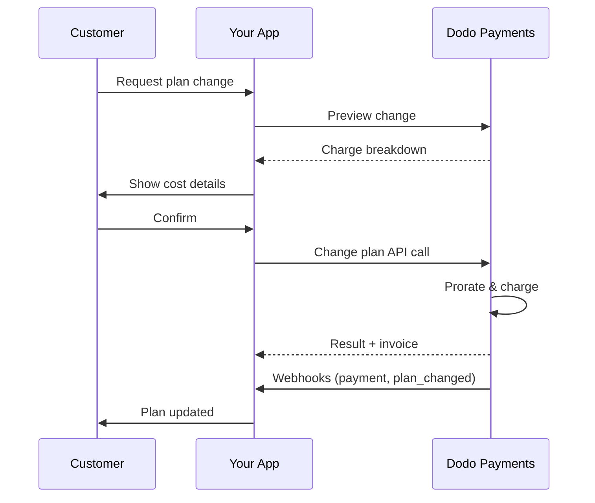
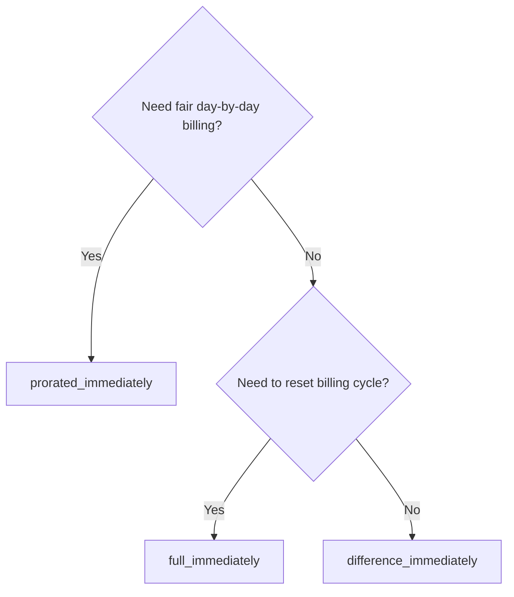
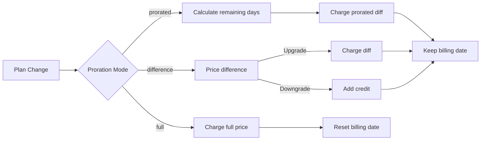

<CardGroup cols={3}>
<Card title="プラン変更API" icon="code" href="/api-reference/subscriptions/change-plan">
  サブスクリプションを更新するための完全なAPIドキュメントです。
</Card>
<Card title="プラン変更プレビュー" icon="eye" href="/api-reference/subscriptions/preview-change-plan">
  プランを変更する前に請求金額を確認します。
</Card>
<Card title="統合ガイド" icon="book" href="/developer-resources/subscription-integration-guide">
  ステップバイステップのサブスクリプションセットアップです。
</Card>
</CardGroup>

## サブスクリプションのアップグレードまたはダウングレードとは？

プランを変更すると、顧客をサブスクリプションのティアまたは数量間で移動させることができます。これを使用して：
- 使用量や機能に応じて価格を調整する
- 月額から年額に変更する（またはその逆）
- シートベースの製品の数量を調整する

<Info>
プラン変更は、選択した按分モードに応じて、即時の請求を引き起こす可能性があります。
</Info>

## プラン変更を使用するタイミング

- 顧客がより多くの機能、使用量、またはシートを必要とする場合にアップグレード
- 使用量が減少した場合にダウングレード
- ユーザーをサブスクリプションをキャンセルせずに新しい製品や価格に移行する

## プラン変更フロー



## 前提条件

サブスクリプションプランの変更を実装する前に、次のことを確認してください：

- アクティブなサブスクリプション製品を持つDodo Paymentsのマーチャントアカウント
- ダッシュボードからのAPI認証情報（APIキーとWebhookシークレットキー）
- 修正するための既存のアクティブなサブスクリプション
- サブスクリプションイベントを処理するために設定されたWebhookエンドポイント

<Info>
詳細なセットアップ手順については、[統合ガイド](/developer-resources/integration-guide#dashboard-setup)を参照してください。
</Info>

## ステップバイステップの実装ガイド

アプリケーションでサブスクリプションプランの変更を実装するための包括的なガイドに従ってください：

<Steps>
<Step title="プラン変更の要件を理解する">
実装する前に、次のことを決定します：
- どのサブスクリプション製品がどの他の製品に変更できるか
- どの按分モードがビジネスモデルに適しているか
- 失敗したプラン変更をどのように優雅に処理するか
- 状態管理のために追跡するWebhookイベント

<Tip>
本番環境に実装する前に、テストモードでプラン変更を徹底的にテストしてください。
</Tip>
</Step>

<Step title="按分戦略を選択する">
ビジネスニーズに合った請求アプローチを選択します：

<Tabs>
<Tab title="prorated_immediately">
最適：未使用の時間に対して公正に請求したいSaaSアプリケーション
- 残りのサイクル時間に基づいて正確な按分額を計算します
- サイクル内の未使用時間に基づいて按分額を請求します
- 顧客に透明な請求を提供します
</Tab>

<Tab title="difference_immediately">
最適：明確なアップグレード/ダウングレードシナリオ
- アップグレード：即時の差額を請求（例：$30→$80 = $50を請求）
- ダウングレード：将来の更新のために残りの価値をクレジットします
- 請求ロジックと顧客コミュニケーションを簡素化します
</Tab>

<Tab title="full_immediately">
最適：請求サイクルをリセットしたい場合
- 新しいプランの全額を即時に請求します
- 古いプランの残りの時間を無視します
- 年間から月間への移行に便利です
</Tab>
</Tabs>
</Step>

<Step title="プラン変更APIを実装する">
プラン変更APIを使用してサブスクリプションの詳細を変更します：

<ParamField path="subscription_id" type="string" required>
変更するアクティブなサブスクリプションのID。
</ParamField>

<ParamField path="product_id" type="string" required>
サブスクリプションを変更する新しい製品ID。
</ParamField>

<ParamField path="quantity" type="integer" default="1">
新しいプランのユニット数（シートベースの製品の場合）。
</ParamField>

<ParamField path="proration_billing_mode" type="string" required>
即時請求を処理する方法： `prorated_immediately`、 `full_immediately`、または `difference_immediately`。
</ParamField>

<ParamField path="addons" type="array">
新しいプランのためのオプションのアドオン。このフィールドを空にすると、既存のアドオンが削除されます。
</ParamField>

<ParamField path="on_payment_failure" type="string">
プラン変更の支払いが失敗したときの動作を制御します：
- `prevent_change`: 支払いが成功するまでサブスクリプションを現在のプランに維持
- `apply_change` (デフォルト): 支払いの結果にかかわらず、プラン変更を即座に適用
</ParamField>

指定されていない場合、ビジネスレベルのデフォルト設定が使用されます。
</ParamField>
</Step>

<Step title="Webhookイベントの処理">
プラン変更の結果を追跡するためにWebhook処理を設定します：

- `subscription.active`: プラン変更が成功し、サブスクリプションが更新されました
- `subscription.plan_changed`: サブスクリプションプランが変更されました（アップグレード/ダウングレード/アドオンの更新）
- `subscription.on_hold`: プラン変更の請求が失敗し、サブスクリプションが一時停止されました
- `payment.succeeded`: プラン変更のための即時請求が成功しました
- `payment.failed`: 即時請求が失敗しました

<Warning>
常にWebhookの署名を確認し、冪等的なイベント処理を実装してください。
</Warning>
</Step>

<Step title="アプリケーション状態を更新">
Webhookイベントに基づいてアプリケーションを更新します：
- 新しいプランに基づいて機能を付与/取り消す
- 新しいプランの詳細で顧客ダッシュボードを更新する
- プラン変更に関する確認メールを送信する
- 監査目的のために請求の変更を記録する
</Step>

<Step title="テストおよび監視">
実装を徹底的にテストしてください：
- 異なるシナリオで全ての按分モードをテストします
- Webhook処理が正しく機能することを確認する
- プラン変更の成功率を監視する
- 失敗したプラン変更のアラートを設定する
</Step>
</Steps>

<Check>
あなたのサブスクリプションプラン変更の実装は、生産環境での使用の準備が整いました。
</Check>
</Step>
</Steps>

## プラン変更のプレビュー

プラン変更を確定する前に、プレビュAPIを使用して顧客に請求される正確な金額を示します：

<Tabs>
<Tab title="Node.js SDK">

```javascript
const preview = await client.subscriptions.previewChangePlan('sub_123', {
  product_id: 'prod_pro',
  quantity: 1,
  proration_billing_mode: 'prorated_immediately'
});

// Show customer the charge before confirming
console.log('Immediate charge:', preview.immediate_charge.summary);
console.log('New plan details:', preview.new_plan);
```

</Tab>

<Tab title="Python SDK">

```python
preview = client.subscriptions.preview_change_plan(
    subscription_id="sub_123",
    product_id="prod_pro",
    quantity=1,
    proration_billing_mode="prorated_immediately"
)

# Show customer the charge before confirming
print("Immediate charge:", preview.immediate_charge.summary)
print("New plan details:", preview.new_plan)
```

</Tab>
</Tabs>

<Tip>
プレビュAPIを使用して、顧客がプラン変更を確認する前に正確な金額を表示する確認ダイアログを作成してください。
</Tip>

## プラン変更API

アクティブなサブスクリプションの製品、数量、および按分動作を変更するために、プラン変更APIを使用します。

### クイックスタート例

<Tabs>
  <Tab title="Node.js SDK">

    ```javascript
    import DodoPayments from 'dodopayments';

    const client = new DodoPayments({
      bearerToken: process.env.DODO_PAYMENTS_API_KEY,
      environment: 'test_mode', // defaults to 'live_mode'
    });

    async function changePlan() {
      const result = await client.subscriptions.changePlan('sub_123', {
        product_id: 'prod_new',
        quantity: 3,
        proration_billing_mode: 'prorated_immediately',
        on_payment_failure: 'prevent_change', // Optional: control behavior on payment failure
      });
      console.log(result.status, result.invoice_id, result.payment_id);
    }

    changePlan();
    ```

  </Tab>
  <Tab title="Python SDK">

    ```python
    import os
    from dodopayments import DodoPayments

    client = DodoPayments(
        bearer_token=os.environ.get("DODO_PAYMENTS_API_KEY"),
        environment="test_mode",  # defaults to "live_mode"
    )

    result = client.subscriptions.change_plan(
        subscription_id="sub_123",
        product_id="prod_new",
        quantity=3,
        proration_billing_mode="prorated_immediately",
        on_payment_failure="prevent_change",  # Optional: control behavior on payment failure
    )
    print(result.status, result.get("invoice_id"), result.get("payment_id"))
    ```

  </Tab>
  <Tab title="Go SDK">

    ```go
    package main

    import (
      "context"
      "fmt"
      "github.com/dodopayments/dodopayments-go"
      "github.com/dodopayments/dodopayments-go/option"
    )

    func main() {
      client := dodopayments.NewClient(option.WithBearerToken("YOUR_TOKEN"))
      res, err := client.Subscriptions.ChangePlan(context.TODO(), dodopayments.SubscriptionChangePlanParams{
        SubscriptionID: dodopayments.F("sub_123"),
        ProductID:             dodopayments.F("prod_new"),
        Quantity:              dodopayments.F(int64(3)),
        ProrationBillingMode:  dodopayments.F(dodopayments.SubscriptionChangePlanParamsProrationBillingModeProratedImmediately),
        OnPaymentFailure:      dodopayments.F(dodopayments.OnPaymentFailurePreventChange), // Optional
      })
      if err != nil { panic(err) }
      fmt.Println(res.Status, res.InvoiceID, res.PaymentID)
    }
    ```

  </Tab>
  <Tab title="HTTP">

    ```bash
    curl -X POST "$DODO_API_BASE/subscriptions/sub_123/change-plan" \
      -H "Authorization: Bearer $DODO_PAYMENTS_API_KEY" \
      -H "Content-Type: application/json" \
      -d '{
        "product_id": "prod_new",
        "quantity": 3,
        "proration_billing_mode": "prorated_immediately",
        "on_payment_failure": "prevent_change"
      }'
    ```

  </Tab>
</Tabs>

```json Success
{
  "status": "processing",
  "subscription_id": "sub_123",
  "invoice_id": "inv_789",
  "payment_id": "pay_456",
  "proration_billing_mode": "prorated_immediately"
}
```

<Note>
<code>invoice_id</code>や<code>payment_id</code>のようなフィールドは、プラン変更中に即時請求や請求書が作成される場合にのみ返されます。結果を確認するためには、常にWebhookイベント（例：<code>payment.succeeded</code>、<code>subscription.plan_changed</code>）に依存してください。
</Note>

<Warning>
即時請求が失敗した場合、サブスクリプションは `subscription.on_hold` に移動する可能性があり、支払いが成功するまで維持されます。
</Warning>

## アドオンの管理

サブスクリプションプランを変更する際に、アドオンも変更できます：

```javascript
// Add addons to the new plan
await client.subscriptions.changePlan('sub_123', {
  product_id: 'prod_new',
  quantity: 1,
  proration_billing_mode: 'difference_immediately',
  addons: [
    { addon_id: 'addon_123', quantity: 2 }
  ]
});

// Remove all existing addons
await client.subscriptions.changePlan('sub_123', {
  product_id: 'prod_new',
  quantity: 1,
  proration_billing_mode: 'difference_immediately',
  addons: [] // Empty array removes all existing addons
});
```

<Info>
アドオンは按分計算に含まれており、選択した按分モードに応じて請求されます。
</Info>

## 按分モード

プラン変更の際に顧客に請求する方法を選択します：

#### `prorated_immediately`
- 現在のサイクルでの部分的差額に対して請求します
- トライアル中の場合は即座に請求し、今すぐ新しいプランに切り替わります
- ダウングレード：将来の更新に適用される按分クレジットを生成する可能性があります

#### `full_immediately`
- 新しいプランの全額を即座に請求します
- 古いプランの残り時間を無視します

<Info>
<code>difference_immediately</code>を使用して生成されたダウングレードによるクレジットは、サブスクリプションスコープであり、<a href="/features/customer-credit">顧客クレジット</a>とは異なります。これらは同じサブスクリプションの将来の更新に自動的に適用され、サブスクリプション間で移行することはできません。
</Info>

#### `difference_immediately`
- アップグレード：古いプランと新しいプランの価格差を即座に請求します
- ダウングレード：残りの価値をサブスクリプションに内部クレジットとして追加し、更新時に自動的に適用します

| 機能 | `prorated_immediately` | `difference_immediately` | `full_immediately` |
|---------|----------------------|------------------------|-------------------|
| **アップグレード料金** | 残りの日のための按分された差額 | プラン間の全額の差額 | 新しいプランの全額 |
| **ダウングレードクレジット** | 残りの日のための按分されたクレジット | クレジットとしての全額差額 | クレジットなし |
| **請求サイクル** | 変更なし | 変更なし | 今日にリセット |
| **トライアル動作** | トライアルを終了し、即時に請求します | トライアルを終了し、即時に請求します | トライアルを終了し、全額請求します |
| **最適** | 公正な時間ベースの請求 | シンプルなアップグレード/ダウングレードの計算 | 請求サイクルのリセット |
| **複雑さ** | 中（日にちの計算） | 低（単純な引き算） | 低（全額請求） |



### 例シナリオ

一貫して次の標準的な数値を使用してください：
- 現在のプラン: **基本** で **30ドル/月**
- アップグレードターゲット: **プロ** で **80ドル/月**
- ダウングレードターゲット（プロから）: **スターター** で **20ドル/月**
- 請求サイクル: **30日**、**1月1日**に開始
- プラン変更は **1月16日** に行われます（残り15日、使用済み15日）

<AccordionGroup>
  <Accordion title="アップグレード: 基本 ($30) → プロ ($80) with prorated_immediately">

    ```
    Step 1: Calculate unused credit from current plan
      Unused days = 15 out of 30 days
      Credit = $30 × (15/30) = $15.00

    Step 2: Calculate prorated cost of new plan
      Remaining days = 15 out of 30 days
      New plan cost = $80 × (15/30) = $40.00

    Step 3: Calculate immediate charge
      Charge = New plan cost − Credit
      Charge = $40.00 − $15.00 = $25.00

    → Customer pays $25.00 now
    → Next renewal (Feb 1): $80.00/month
    ```

    ```javascript
    await client.subscriptions.changePlan('sub_123', {
      product_id: 'prod_pro',
      quantity: 1,
      proration_billing_mode: 'prorated_immediately'
    })
    ```

  </Accordion>

  <Accordion title="ダウングレード: プロ ($80) → スターター ($20) with prorated_immediately">

    ```
    Step 1: Calculate unused credit from current plan
      Unused days = 15 out of 30 days
      Credit = $80 × (15/30) = $40.00

    Step 2: Calculate prorated cost of new plan
      Remaining days = 15 out of 30 days
      New plan cost = $20 × (15/30) = $10.00

    Step 3: Calculate credit balance
      Credit = $40.00 − $10.00 = $30.00

    → No charge — $30.00 credit added to subscription
    → Credit auto-applies to future renewals
    → Next renewal (Feb 1): $20.00 − $30.00 credit = $0.00
    → Following renewal (Mar 1): $20.00 − $10.00 remaining credit = $10.00
    ```

    ```javascript
    await client.subscriptions.changePlan('sub_123', {
      product_id: 'prod_starter',
      quantity: 1,
      proration_billing_mode: 'prorated_immediately'
    })
    ```

  </Accordion>

  <Accordion title="アップグレード: 基本 ($30) → プロ ($80) with difference_immediately">

    ```
    Immediate charge = New plan price − Old plan price
                     = $80 − $30
                     = $50.00

    → Customer pays $50.00 now (regardless of cycle position)
    → Next renewal (Feb 1): $80.00/month
    ```

    ```javascript
    await client.subscriptions.changePlan('sub_123', {
      product_id: 'prod_pro',
      quantity: 1,
      proration_billing_mode: 'difference_immediately'
    })
    ```

  </Accordion>

  <Accordion title="ダウングレード: プロ ($80) → スターター ($20) with difference_immediately">

    ```
    Credit = Old plan price − New plan price
           = $80 − $20
           = $60.00

    → No charge — $60.00 credit added to subscription
    → Credit auto-applies to future renewals
    → Next renewal: $20.00 − $20.00 (from credit) = $0.00
    → Following renewal: $20.00 − $20.00 (from credit) = $0.00
    → Third renewal: $20.00 − $20.00 (from remaining credit) = $0.00
    ```

    ```javascript
    await client.subscriptions.changePlan('sub_123', {
      product_id: 'prod_starter',
      quantity: 1,
      proration_billing_mode: 'difference_immediately'
    })
    ```

  </Accordion>

  <Accordion title="アップグレード: 基本 ($30) → プロ ($80) with full_immediately">

    ```
    Immediate charge = Full new plan price = $80.00

    → Customer pays $80.00 now
    → No credit for unused time on old plan
    → Billing cycle resets to today (January 16)
    → Next renewal: February 16 at $80.00/month
    ```

    ```javascript
    await client.subscriptions.changePlan('sub_123', {
      product_id: 'prod_pro',
      quantity: 1,
      proration_billing_mode: 'full_immediately'
    })
    ```

  </Accordion>

  <Accordion title="ミッドサイクルアップグレード（アドオン付き） using prorated_immediately">

    ```
    Current: Basic plan ($30/month), no add-ons
    New: Pro plan ($80/month) + Extra Seats add-on ($10/seat × 3 seats = $30/month)
    Change on day 16 of 30 (15 days remaining)

    Step 1: Credit from current plan
      Credit = $30 × (15/30) = $15.00

    Step 2: Prorated cost of new plan + add-ons
      New plan = $80 × (15/30) = $40.00
      Add-ons = $30 × (15/30) = $15.00
      Total new = $55.00

    Step 3: Immediate charge
      Charge = $55.00 − $15.00 = $40.00

    → Customer pays $40.00 now
    → Next renewal: $80.00 + $30.00 = $110.00/month
    ```

    ```javascript
    await client.subscriptions.changePlan('sub_123', {
      product_id: 'prod_pro',
      quantity: 1,
      proration_billing_mode: 'prorated_immediately',
      addons: [
        { addon_id: 'addon_seats', quantity: 3 }
      ]
    })
    ```

  </Accordion>
</AccordionGroup>

### 各モードの請求処理



<Tip>
公正な時間計算のために `prorated_immediately` を選び、請求を再起動するために `full_immediately` を選択し、シンプルなアップグレードやダウングレードで自動クレジットを使用するために `difference_immediately` を選んでください。
</Tip>

## 支払い失敗の処理

プラン変更の支払いが失敗したときに何が起こるかを `on_payment_failure` パラメータを使用して制御します。

### 支払い失敗モード

<Tabs>
<Tab title="prevent_change (重要なアップグレードに推奨)">
**動作**: 支払いが成功するまでサブスクリプションを現在のプランに維持します。

- プラン変更は「保留」としてマークされます
- 顧客は現在のプランへのアクセスを保持します
- 支払いが成功した後にのみ、サブスクリプションは `active` 状態に移動します
- アップグレード機能を付与する前に支払いを確認したい場合に便利です

```javascript
await client.subscriptions.changePlan('sub_123', {
  product_id: 'prod_pro',
  quantity: 1,
  proration_billing_mode: 'prorated_immediately',
  on_payment_failure: 'prevent_change'
});
```

</Tab>

<Tab title="apply_change (デフォルト)">
**動作**: 支払いの結果にかかわらず、プラン変更を即時に適用します。

- 支払いが失敗してもプラン変更が適用されます
- 顧客は新しいプランに即座にアクセスできます
- 支払いが失敗した場合、サブスクリプションは `on_hold` に移動する可能性があります
- 非重要なアップグレードや顧客を信頼する場合に適しています

```javascript
await client.subscriptions.changePlan('sub_123', {
  product_id: 'prod_pro',
  quantity: 1,
  proration_billing_mode: 'prorated_immediately',
  on_payment_failure: 'apply_change' // This is the default
});
```

</Tab>
</Tabs>

<Info>
指定されていない場合、`on_payment_failure` パラメータは、ダッシュボードで設定されたビジネスレベルのデフォルト設定を使用します。
</Info>

### 各モードを使用するタイミング

| シナリオ | 推奨モード | 理由 |
|----------|------------------|--------|
| プレミアム機能へのアップグレード | `prevent_change` | アクセスを付与する前に支払いを確認 |
| 数量の増加（シート数の増加） | `prevent_change` | 支払いなしの使用を防ぐ |
| プランのダウングレード | `apply_change` | 顧客が支出を減らす |
| 信頼できる企業顧客 | `apply_change` | 未払いのリスクを低下 |
| トライアルから有料への変換 | `prevent_change` | 重要な支払いの瞬間 |

## Webhookの処理

Webhookを通じてサブスクリプション状態を追跡し、プラン変更や支払いを確認します。

### 処理すべきイベントタイプ
- `subscription.active`: サブスクリプションがアクティブになりました
- `subscription.plan_changed`: サブスクリプションプランが変更されました（アップグレード/ダウングレード/アドオンの変更）
- `subscription.on_hold`: 請求が失敗し、サブスクリプションが一時停止されました
- `subscription.renewed`: 更新が成功しました
- `payment.succeeded`: プラン変更または更新の支払いが成功しました
- `payment.failed`: 支払いが失敗しました

<Info>
サブスクリプションイベントからビジネスロジックを導き、確認と調整のために支払いイベントを使用することをお勧めします。
</Info>

### 署名の確認と意図の処理

<Tabs>
  <Tab title="Next.js ルートハンドラー">

    ```javascript
    import { NextRequest, NextResponse } from 'next/server';
    
    export async function POST(req) {
      const webhookId = req.headers.get('webhook-id');
      const webhookSignature = req.headers.get('webhook-signature');
      const webhookTimestamp = req.headers.get('webhook-timestamp');
      const secret = process.env.DODO_WEBHOOK_SECRET;
    
      const payload = await req.text();
      // verifySignature is a placeholder – in production, use a Standard Webhooks library
      const { valid, event } = await verifySignature(
        payload,
        { id: webhookId, signature: webhookSignature, timestamp: webhookTimestamp },
        secret
      );
      if (!valid) return NextResponse.json({ error: 'Invalid signature' }, { status: 400 });
    
      switch (event.type) {
        case 'subscription.active':
          // mark subscription active in your DB
          break;
        case 'subscription.plan_changed':
          // refresh entitlements and reflect the new plan in your UI
          break;
        case 'subscription.on_hold':
          // notify user to update payment method
          break;
        case 'subscription.renewed':
          // extend access window
          break;
        case 'payment.succeeded':
          // reconcile payment for plan change
          break;
        case 'payment.failed':
          // log and alert
          break;
        default:
          // ignore unknown events
          break;
      }
    
      return NextResponse.json({ received: true });
    }
    ```

  </Tab>
  <Tab title="Express.js">

    ```javascript
    import express from 'express';
    
    const app = express();
    app.post('/webhooks/dodo', express.raw({ type: 'application/json' }), async (req, res) => {
      const webhookId = req.header('webhook-id');
      const webhookSignature = req.header('webhook-signature');
      const webhookTimestamp = req.header('webhook-timestamp');
      const secret = process.env.DODO_WEBHOOK_SECRET;
      const payload = req.body.toString('utf8');
    
      const { valid, event } = await verifySignature(
        payload,
        { id: webhookId, signature: webhookSignature, timestamp: webhookTimestamp },
        secret
      );
      if (!valid) return res.status(400).send('Invalid signature');
    
      // handle events like above
      res.json({ received: true });
    });
    
    app.listen(3000);
    ```

  </Tab>
</Tabs>

<Note>
詳細なペイロードスキーマについては、<a href="/developer-resources/webhooks/intents/subscription">サブスクリプションWebhookペイロード</a>と、<a href="/developer-resources/webhooks/intents/payment">支払いWebhookペイロード</a>を参照してください。
</Note>

## ベストプラクティス

サブスクリプションプラン変更を信頼できるものにするために、以下の推奨事項に従ってください：

### プラン変更戦略
- **徹底的にテストする**: 生産環境の前に常にテストモードでプラン変更をテストする
- **按分を慎重に選択する**: ビジネスモデルに沿った按分モードを選択する
- **エラーを優雅に処理する**: 適切なエラーハンドリングと再試行ロジックを実装する
- **成功率を監視する**: プラン変更の成功/失敗率を追跡し、問題を調査する

### Webhook実装
- **署名を確認する**: 常にWebhookの署名を検証してその真正性を確保する
- **冪等性を実装する**: 重複したWebhookイベントを優雅に処理する
- **非同期処理を行う**: 重い操作でWebhookの応答をブロックしない
- **すべてを記録する**: デバッグや監査目的のために詳細なログを維持する

### ユーザーエクスペリエンス
- **明確にコミュニケーションする**: 顧客に請求変更やタイミングに関する情報を伝える
- **確認を提供する**: プラン変更が成功した場合に確認メールを送る
- **エッジケースを処理する**: トライアル期間、按分、および支払い失敗を考慮する
- **UIを即座に更新する**: アプリケーションインターフェースにプラン変更を反映させる

## 一般的な問題と解決策

サブスクリプションプラン変更中に発生する典型的な問題を解決します：

<AccordionGroup>
<Accordion title="請求が作成されたがサブスクリプションが更新されていない">
**症状**: API呼び出しは成功しましたが、サブスクリプションは旧プランのままです。

**一般的な原因**:
- Webhook処理が失敗したり遅れたりした
- Webhookを受信した後にアプリケーション状態が更新されていない
- 状態更新中のデータベーストランザクションの問題

**解決策**:
- 再試行ロジックを持つ堅牢なWebhook処理を実装する
- 状態更新に冪等性操作を使用する
- 失われたWebhookイベントを検出・警告する監視を追加する
- Webhookエンドポイントがアクセス可能で正しく応答しているか確認する
</Accordion>

<Accordion title="ダウングレード後にクレジットが適用されない">
**症状**: 顧客がダウングレードしたが、クレジット残高が表示されない

**一般的な原因**:
- 按分モードの期待：ダウングレードは、`difference_immediately`でプランの全額の価格差をクレジットに戻し、`prorated_immediately`で残りのサイクルに基づいて按分されたクレジットを生成
- クレジットがサブスクリプション特有で、サブスクリプション間で移行できない
- 顧客ダッシュボードにクレジット残高が表示されない

**解決策**:
- 自動的なクレジットを希望する場合、ダウングレードの際は`difference_immediately`を使用する
- クレジットは同じサブスクリプションの将来の更新に適用されることを顧客に説明する
- クレジット残高を表示する顧客ポータルを実装する
- 適用されたクレジットを確認するために次の請求書プレビューを確認する
</Accordion>

<Accordion title="Webhookの署名検証が失敗する">
**症状**: 無効な署名のためWebhookイベントが拒否される

**一般的な原因**:
- 不正確なWebhookシークレットキー
- 署名検証の前に生のリクエストボディが変更された
- 不正確な署名検証アルゴリズム

**解決策**:
- ダッシュボードから正しい `DODO_WEBHOOK_SECRET` を使用していることを確認する
- JSONパーサーミドルウェアの前に生のリクエストボディを読み取る
- プラットフォームのための標準Webhook検証ライブラリを使用する
- 開発環境でWebhookの署名検証をテストする
</Accordion>

<Accordion title="プラン変更が422エラーで失敗する">
**症状**: APIが422 Unprocessable Entityエラーを返す

**一般的な原因**:
- 無効なサブスクリプションIDまたは製品ID
- アクティブな状態でないサブスクリプション
- 必要なパラメータが欠けている
- プラン変更が利用できない製品

**解決策**:
- サブスクリプションが存在し、アクティブであることを確認します
- 製品IDが有効であり利用可能であることを確認します
- すべての必要なパラメータが提供されていることを確認します
- パラメータ要件のためにAPIドキュメンテーションを確認する
</Accordion>

<Accordion title="プラン変更中に即時請求が失敗する">
**症状**: プラン変更が始まるが即時請求が失敗する

**一般的な原因**:
- 顧客の支払い方法に十分な資金がない
- 支払い方法が期限切れまたは無効
- 銀行がトランザクションを拒否した
- 詐欺検出が請求をブロックした

**解決策**:
- `payment.failed` Webhookイベントを適切に処理する
- 顧客に支払い方法の更新を通知する
- 一時的な失敗に対する再試行ロジックを実装する
- 即時請求が失敗した場合でもプラン変更を許可することを検討する
</Accordion>

<Accordion title="プラン変更後にサブスクリプションが保留される">
**症状**: プラン変更の請求が失敗し、サブスクリプションが `on_hold` 状態に移行する

**何が起こるか**:
プラン変更の請求が失敗した場合、サブスクリプションは自動的に `on_hold` 状態に置かれます。支払い方法が更新されるまで、サブスクリプションは自動的に更新されません。

**解決策**: 支払い方法を更新してサブスクリプションを再起動します。

失敗したプラン変更後に INLIN_CODE_PLACEHOLDER_833e01167b2e3da7_END 状態からサブスクリプションを再起動するには：

1. **支払い方法を更新**して、更新支払い方法APIを使用します
2. **自動的な請求作成**: APIが未払い分の請求を自動的に作成します
3. **請求書の生成**: 請求のための請求書が生成されます
4. **支払い処理**: 新しい支払い方法を使用して支払いが処理されます
5. **再起動**: 支払いが成功すると、サブスクリプションが `active` 状態に再起動されます

<CodeGroup>

```javascript Node.js
// Reactivate subscription from on_hold after failed plan change
async function reactivateAfterFailedPlanChange(subscriptionId) {
  // Update payment method - automatically creates charge for remaining dues
  const response = await client.subscriptions.updatePaymentMethod(subscriptionId, {
    type: 'new',
    return_url: 'https://example.com/return'
  });
  
  if (response.payment_id) {
    console.log('Charge created for remaining dues:', response.payment_id);
    console.log('Payment link:', response.payment_link);
    
    // Redirect customer to payment_link to complete payment
    // Monitor webhooks for:
    // 1. payment.succeeded - charge succeeded
    // 2. subscription.active - subscription reactivated
  }
  
  return response;
}

// Or use existing payment method if available
async function reactivateWithExistingPaymentMethod(subscriptionId, paymentMethodId) {
  const response = await client.subscriptions.updatePaymentMethod(subscriptionId, {
    type: 'existing',
    payment_method_id: paymentMethodId
  });
  
  // Monitor webhooks for payment.succeeded and subscription.active
  return response;
}
```

```python Python
# Reactivate subscription from on_hold after failed plan change
def reactivate_after_failed_plan_change(subscription_id):
    # Update payment method - automatically creates charge for remaining dues
    response = client.subscriptions.update_payment_method(
        subscription_id=subscription_id,
        type="new",
        return_url="https://example.com/return"
    )
    
    if response.payment_id:
        print("Charge created for remaining dues:", response.payment_id)
        print("Payment link:", response.payment_link)
        
        # Redirect customer to payment_link to complete payment
        # Monitor webhooks for:
        # 1. payment.succeeded - charge succeeded
        # 2. subscription.active - subscription reactivated
    
    return response

# Or use existing payment method if available
def reactivate_with_existing_payment_method(subscription_id, payment_method_id):
    response = client.subscriptions.update_payment_method(
        subscription_id=subscription_id,
        type="existing",
        payment_method_id=payment_method_id
    )
    
    # Monitor webhooks for payment.succeeded and subscription.active
    return response
```

</CodeGroup>

**監視すべきWebhookイベント**:
- `subscription.on_hold`: サブスクリプションが保留中になりました（プラン変更の請求が失敗した場合に受信）
- `payment.succeeded`: 残りの債務に対する支払いが成功しました（支払い方法を更新した後）
- `subscription.active`: 支払い成功後にサブスクリプションが再起動されました

**ベストプラクティス**:
- プラン変更の請求が失敗したときに顧客に即座に通知します
- 支払い方法を更新するための明確な指示を提供します
- 再起動のステータスを追跡するためにWebhookイベントを監視します
- 一時的な支払い失敗に対する自動再試行ロジックを実装することを検討します

<Card title="支払い方法更新APIリファレンス" icon="code" href="/api-reference/subscriptions/update-payment-method">
支払い方法の更新とサブスクリプションの再起動についての完全なAPIドキュメントを表示します。
</Card>
</Accordion>
</AccordionGroup>

## 実装のテスト

サブスクリプションプラン変更の実装を徹底的にテストするための手順は以下の通りです：

<Steps>
<Step title="テスト環境の設定">
- テストAPIキーとテスト製品を使用します
- 異なるプランタイプでテストサブスクリプションを作成します
- テストWebhookエンドポイントを設定します
- 監視とログを設定します
</Step>

<Step title="異なる按分モードのテスト">
- 様々な請求サイクルの位置で `prorated_immediately` をテストします
- アップグレードとダウングレードで `difference_immediately` をテストします
- 請求サイクルをリセットするために `full_immediately` をテストします
- クレジットの計算が正しいか確認します
</Step>

<Step title="Webhook処理のテスト">
- すべての関連するWebhookイベントが受信されたことを確認します
- Webhook署名検証をテストします
- 重複したWebhookイベントを優雅に処理します
- Webhook処理失敗シナリオをテストします
</Step>

<Step title="エラーシナリオのテスト">
- 無効なサブスクリプションIDでテストします
- 期限切れの支払い方法でテストします
- ネットワーク障害とタイムアウトでテストします
- 不足のある資金でテストします
</Step>

<Step title="本番環境での監視">
- 失敗したプラン変更のアラートを設定します
- Webhook処理時間を監視します
- プラン変更の成功率を追跡します
- プラン変更の問題に関する顧客サポートチケットをレビューします
</Step>
</Steps>

## エラーハンドリング

一般的なAPIエラーを優雅に処理します。

### HTTPステータスコード

<AccordionGroup>
<Accordion title="200 OK">
プラン変更リクエストは正常に処理されました。サブスクリプションが更新され、請求処理が開始されています。
</Accordion>

<Accordion title="400 Bad Request">
無効なリクエストパラメータです。すべての必要なフィールドが提供され、正しくフォーマットされていることを確認してください。
</Accordion>

<Accordion title="401 Unauthorized">
無効または欠如したAPIキー。あなたの `DODO_PAYMENTS_API_KEY` が正しいことを確認し、適切な権限があるか確認してください。
</Accordion>

<Accordion title="404 Not Found">
サブスクリプションIDが見つからないか、あなたのアカウントに属していません。
</Accordion>

<Accordion title="422 Unprocessable Entity">
サブスクリプションは変更できません（例：すでにキャンセルされている、製品が利用できないなど）。
</Accordion>

<Accordion title="500 Internal Server Error">
サーバーエラーが発生しました。しばらく待ってからリクエストを再試行してください。
</Accordion>
</AccordionGroup>

### エラー応答形式

```json
{
  "error": {
    "code": "subscription_not_found",
    "message": "The subscription with ID 'sub_123' was not found",
    "details": {
      "subscription_id": "sub_123"
    }
  }
}
```

## 次のステップ

- <a href="/api-reference/subscriptions/change-plan">プラン変更API</a>をレビューします
- <a href="/features/customer-credit">顧客クレジット</a>を探ります
- `subscription.on_hold` のアラートを実装します
- <a href="/developer-resources/webhooks">Webhook統合ガイド</a>をチェックしてください
