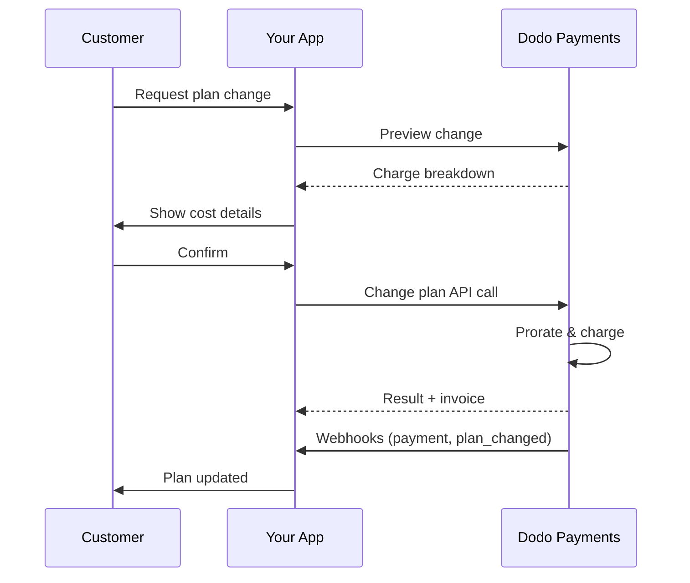
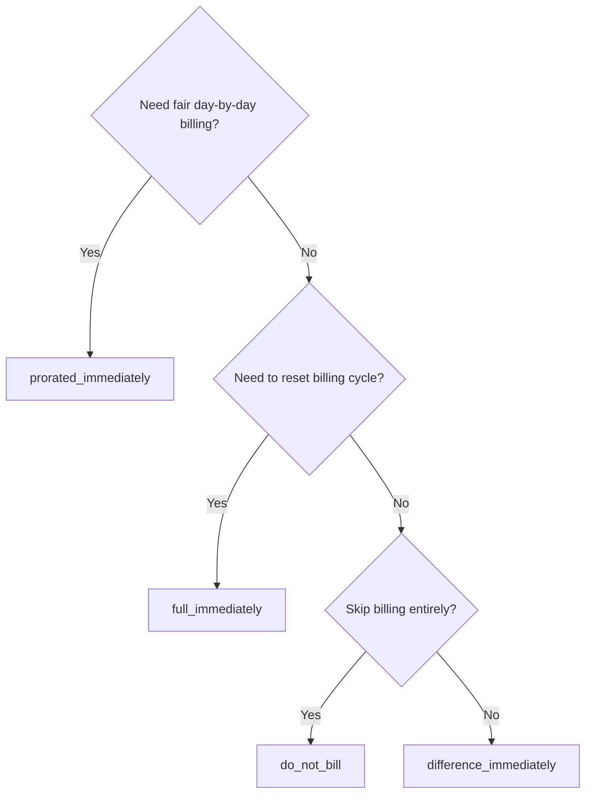
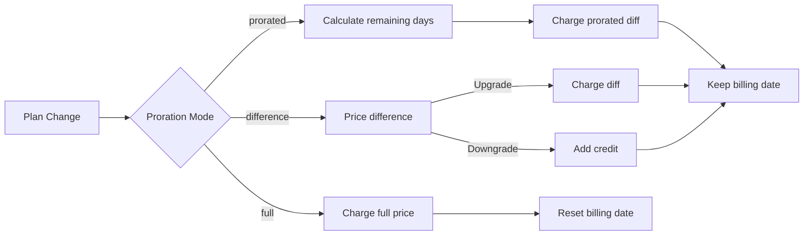

<CardGroup cols={3}>
<Card title="Change Plan API" icon="code" href="/api-reference/subscriptions/change-plan">
  Full API docs for updating subscriptions.
</Card>
<Card title="Plan Change Preview" icon="eye" href="/api-reference/subscriptions/preview-change-plan">
  See charge amounts before changing plans.
</Card>
<Card title="Integration Guide" icon="book" href="/developer-resources/subscription-integration-guide">
  Step-by-step subscription setup.
</Card>
</CardGroup>

## What is a subscription upgrade or downgrade?

Changing plans lets you move a customer between subscription tiers or quantities. Use it to:
- Align pricing with usage or features
- Move from monthly to annual (or vice versa)
- Adjust quantity for seat-based products

<Info>
Plan changes can trigger an immediate charge depending on the proration mode you choose.
</Info>

## When to use plan changes

- Upgrade when a customer needs more features, usage, or seats
- Downgrade when usage decreases
- Migrate users to a new product or price without cancelling their subscription

## Plan Change Flow



## Prerequisites

Before implementing subscription plan changes, ensure you have:

- A Dodo Payments merchant account with active subscription products
- API credentials (API key and webhook secret key) from the dashboard
- An existing active subscription to modify
- Webhook endpoint configured to handle subscription events

<Info>
For detailed setup instructions, see our [Integration Guide](/developer-resources/integration-guide#dashboard-setup).
</Info>

## Step-by-Step Implementation Guide

Follow this comprehensive guide to implement subscription plan changes in your application:

<Steps>
<Step title="Understand Plan Change Requirements">
Before implementing, determine:
- Which subscription products can be changed to which others
- What proration mode fits your business model
- How to handle failed plan changes gracefully
- Which webhook events to track for state management

<Tip>
Test plan changes thoroughly in test mode before implementing in production.
</Tip>
</Step>

<Step title="Choose Your Proration Strategy">
Select the billing approach that aligns with your business needs:

<Tabs>
<Tab title="prorated_immediately">
Best for: SaaS applications wanting to charge fairly for unused time
- Calculates exact prorated amount based on remaining cycle time
- Charges a prorated amount based on unused time remaining in the cycle
- Provides transparent billing to customers
</Tab>

<Tab title="difference_immediately">
Best for: Clear upgrade/downgrade scenarios
- Upgrade: Charge immediate difference (e.g., $30→$80 = charge $50)
- Downgrade: Credit remaining value for future renewals
- Simplifies billing logic and customer communication
</Tab>

<Tab title="full_immediately">
最適なタイミング: 請求サイクルをリセットしたい場合
- 新しいプランの全額を即座に請求
- 旧プランの残り時間を無視
- 年間から月間への移行に便利
</Tab>

{/* LOCKED_PATTERN_7fa7f81fc66b83c441dd56aff76d586c */}
最適なタイミング: 無料の移行、特別な切替、またはコスト差異を吸収するとき
- 請求やクレジットの計算なし
- 顧客は即座に新しいプランに移行、請求調整は行われない
- 請求サイクルは変更されない
</Tab>
</Tabs>
</Step>

<Step title="Implement the Change Plan API">
サブスクリプション詳細を変更するには、Change Plan APIを使用します：

<ParamField path="subscription_id" type="string" required>
変更するアクティブなサブスクリプションのID。
</ParamField>

<ParamField path="product_id" type="string" required>
サブスクリプションを変更する新しいプロダクトID。
</ParamField>

<ParamField path="quantity" type="integer" default="1">
新しいプランのユニット数（席数ベースのプロダクトの場合）。
</ParamField>

<ParamField path="proration_billing_mode" type="string" required>
即時請求の扱い方: `prorated_immediately`, `full_immediately`, `difference_immediately`, または `do_not_bill`。
</ParamField>

<ParamField path="addons" type="array">
新しいプラン用のオプションのアドオン。空の場合、既存のアドオンが削除されます。
</ParamField>

<ParamField path="on_payment_failure" type="string">
プラン変更時の支払いが失敗した場合の動作を制御します：
- `prevent_change`: 支払いが成功するまで現在のプランに留まる
- `apply_change`（デフォルト）: 支払い結果に関わらず即時プラン変更を適用

指定されていない場合は、ビジネスレベルのデフォルト設定を使用します。
</ParamField>

<ParamField path="discount_code" type="string">
新しいプランに適用するオプションの割引コード。提供された場合、割引を検証してプラン変更に適用します。提供されず、サブスクリプションに既存の割引がある場合、`preserve_on_plan_change=true`、新しいプロダクトに適用可能なら既存の割引が保持されます。
</ParamField>
</Step>

<Step title="Handle Webhook Events">
プラン変更結果を追跡するためにWebhookを設定します：

- `subscription.active`: プラン変更成功、サブスクリプションが更新されました
- `subscription.plan_changed`: サブスクリプションプラン変更（アップグレード/ダウングレード/アドオン更新）
- `subscription.on_hold`: プラン変更の請求が失敗し、サブスクリプションが一時停止されました
- `payment.succeeded`: プラン変更の即時請求が成功しました
- `payment.failed`: 即時請求が失敗しました

<Warning>
Webhook署名を必ず検証し、冪等なイベント処理を実装します。
</Warning>
</Step>

<Step title="Update Your Application State">
Webhookイベントに基づいて、アプリケーションを更新します:
- 新しいプランに基づいて機能を付与/取り消し
- 新しいプランの詳細を顧客ダッシュボードに更新
- プラン変更に関する確認メールを送信
- 監査目的で請求変更を記録
</Step>

<Step title="Test and Monitor">
実装を徹底的にテストします:
- 様々なシナリオでの全ての按分モードのテスト
- Webhook処理が正しく機能するかを確認
- プラン変更の成功率を監視
- 失敗したプラン変更の警告を設定

<Check>
サブスクリプションプラン変更の実装が本番使用の準備ができました。
</Check>
</Step>
</Steps>

## プラン変更のプレビュー

プラン変更を確定する前に、顧客に正確な請求額を示すため、Preview APIを使用してください：

<Tabs>
<Tab title="Node.js SDK">

```javascript
const preview = await client.subscriptions.previewChangePlan('sub_123', {
  product_id: 'prod_pro',
  quantity: 1,
  proration_billing_mode: 'prorated_immediately'
});

// Show customer the charge before confirming
console.log('Immediate charge:', preview.immediate_charge.summary);
console.log('New plan details:', preview.new_plan);
```

</Tab>

<Tab title="Python SDK">

```python
preview = client.subscriptions.preview_change_plan(
    subscription_id="sub_123",
    product_id="prod_pro",
    quantity=1,
    proration_billing_mode="prorated_immediately"
)

# Show customer the charge before confirming
print("Immediate charge:", preview.immediate_charge.summary)
print("New plan details:", preview.new_plan)
```

</Tab>
</Tabs>

<Tip>
プレビューAPIを使用して、顧客がプラン変更を確認する前に正確な請求額を表示する確認ダイアログを作成します。
</Tip>

## Change Plan API

アクティブなサブスクリプションのために、プロダクト、数量、按分の動作を変更するには、Change Plan APIを使用します。

### クイックスタート例

<Tabs>
  <Tab title="Node.js SDK">

    ```javascript
    import DodoPayments from 'dodopayments';

    const client = new DodoPayments({
      bearerToken: process.env.DODO_PAYMENTS_API_KEY,
      environment: 'test_mode', // defaults to 'live_mode'
    });

    async function changePlan() {
      const result = await client.subscriptions.changePlan('sub_123', {
        product_id: 'prod_new',
        quantity: 3,
        proration_billing_mode: 'prorated_immediately',
        on_payment_failure: 'prevent_change', // Optional: control behavior on payment failure
      });
      console.log(result.status, result.invoice_id, result.payment_id);
    }

    changePlan();
    ```

  </Tab>
  <Tab title="Python SDK">

    ```python
    import os
    from dodopayments import DodoPayments

    client = DodoPayments(
        bearer_token=os.environ.get("DODO_PAYMENTS_API_KEY"),
        environment="test_mode",  # defaults to "live_mode"
    )

    result = client.subscriptions.change_plan(
        subscription_id="sub_123",
        product_id="prod_new",
        quantity=3,
        proration_billing_mode="prorated_immediately",
        on_payment_failure="prevent_change",  # Optional: control behavior on payment failure
    )
    print(result.status, result.get("invoice_id"), result.get("payment_id"))
    ```

  </Tab>
  <Tab title="Go SDK">

    ```go
    package main

    import (
      "context"
      "fmt"
      "github.com/dodopayments/dodopayments-go"
      "github.com/dodopayments/dodopayments-go/option"
    )

    func main() {
      client := dodopayments.NewClient(option.WithBearerToken("YOUR_TOKEN"))
      res, err := client.Subscriptions.ChangePlan(context.TODO(), dodopayments.SubscriptionChangePlanParams{
        SubscriptionID: dodopayments.F("sub_123"),
        ProductID:             dodopayments.F("prod_new"),
        Quantity:              dodopayments.F(int64(3)),
        ProrationBillingMode:  dodopayments.F(dodopayments.SubscriptionChangePlanParamsProrationBillingModeProratedImmediately),
        OnPaymentFailure:      dodopayments.F(dodopayments.OnPaymentFailurePreventChange), // Optional
      })
      if err != nil { panic(err) }
      fmt.Println(res.Status, res.InvoiceID, res.PaymentID)
    }
    ```

  </Tab>
  <Tab title="HTTP">

    ```bash
    curl -X POST "$DODO_API_BASE/subscriptions/sub_123/change-plan" \
      -H "Authorization: Bearer $DODO_PAYMENTS_API_KEY" \
      -H "Content-Type: application/json" \
      -d '{
        "product_id": "prod_new",
        "quantity": 3,
        "proration_billing_mode": "prorated_immediately",
        "on_payment_failure": "prevent_change"
      }'
    ```

  </Tab>
</Tabs>

```json Success
{
  "status": "processing",
  "subscription_id": "sub_123",
  "invoice_id": "inv_789",
  "payment_id": "pay_456",
  "proration_billing_mode": "prorated_immediately"
}
```

<Note>
フィールド<code>invoice_id</code>と<code>payment_id</code>は、プラン変更中に即時請求または請求書が作成された場合にのみ返されます。結果を確認するには、常にWebhookイベント（例：<code>payment.succeeded</code>, <code>subscription.plan_changed</code>）に依存してください。
</Note>

<Warning>
即時請求が失敗した場合、サブスクリプションは`subscription.on_hold`に移行する可能性があります。
</Warning>

## アドオンの管理

サブスクリプションのプラン変更時に、アドオンを変更することもできます：

```javascript
// Add addons to the new plan
await client.subscriptions.changePlan('sub_123', {
  product_id: 'prod_new',
  quantity: 1,
  proration_billing_mode: 'difference_immediately',
  addons: [
    { addon_id: 'addon_123', quantity: 2 }
  ]
});

// Remove all existing addons
await client.subscriptions.changePlan('sub_123', {
  product_id: 'prod_new',
  quantity: 1,
  proration_billing_mode: 'difference_immediately',
  addons: [] // Empty array removes all existing addons
});
```

<Info>
アドオンは按分計算に含まれ、選択した按分モードに従って請求されます。
</Info>

## 割引コードの適用

サブスクリプションプランの変更時に割引コードを適用できます。これは、アップグレードまたは移行時のプロモーション価格を提供するのに便利です。

<Tabs>
<Tab title="Node.js SDK">

```javascript
// Apply a discount code during plan change
await client.subscriptions.changePlan('sub_123', {
  product_id: 'prod_pro',
  quantity: 1,
  proration_billing_mode: 'prorated_immediately',
  discount_code: 'UPGRADE20'
});
```

</Tab>
<Tab title="Python SDK">

```python
# Apply a discount code during plan change
client.subscriptions.change_plan(
    subscription_id="sub_123",
    product_id="prod_pro",
    quantity=1,
    proration_billing_mode="prorated_immediately",
    discount_code="UPGRADE20"
)
```

</Tab>
<Tab title="HTTP">

```bash
curl -X POST "$DODO_API_BASE/subscriptions/sub_123/change-plan" \
  -H "Authorization: Bearer $DODO_PAYMENTS_API_KEY" \
  -H "Content-Type: application/json" \
  -d '{
    "product_id": "prod_pro",
    "quantity": 1,
    "proration_billing_mode": "prorated_immediately",
    "discount_code": "UPGRADE20"
  }'
```

</Tab>
</Tabs>

### プラン変更時の割引の動作

| シナリオ | 挙動 |
|----------|----------|
| `discount_code` 提供済み | 割引を検証し新しいプランに適用します。 |
| コードが提供されず、既存の割引が `preserve_on_plan_change=true` の場合 | 該当する場合、新しい製品に自動的に既存の割引が保持されます。 |
| コードが提供されず、保持可能な割引がない | 新しいプランに割引は適用されません。 |

<Tip>
[Preview Plan Change API](/api-reference/subscriptions/preview-change-plan)を使用して、顧客がプラン変更を確認する前にどのくらい節約できるかを正確に示します。
</Tip>

## 按分モード

プラン変更時に顧客への請求方法を選択します：

#### `prorated_immediately`
- 現在のサイクルでの部分的な差額を請求
- 試用中の場合、即時請求され、即座に新しいプランに切り替わります
- ダウングレード：将来の更新に適用される按分されたクレジットが生成される可能性あり

#### `full_immediately`
- 即座に新しいプランの全額を請求
- 旧プランの残り時間を無視

<Info>
<code>difference_immediately</code>を使用したダウングレードで作成されたクレジットは、<a href="/features/credit-based-billing">クレジットベースの請求</a>の特権とは異なるサブスクリプション範囲のクレジットです。これらは自動的に同じサブスクリプションの将来の更新に適用され、他のサブスクリプション間では移動できません。
</Info>

#### `difference_immediately`
- アップグレード：古いプランと新しいプランの価格差を即座に請求
- ダウングレード：残りの価値をサブスクリプションの内部クレジットとして追加し、更新時に自動適用

#### `do_not_bill`
- 請求やクレジットは計算されない
- 顧客は即座に新しいプランに移行し、請求調整はされない
- 請求サイクルは変更されない
- 無償移行、特別な切替、またはコスト差異を吸収する際に最適

| 特徴 | `prorated_immediately` | `difference_immediately` | `full_immediately` | `do_not_bill` |
|---------|----------------------|------------------------|-------------------|--------------|
| **アップグレードの請求** | 残り日数の按分された差額 | プラン間の完全な価格差 | 新プランの完全な価格 | 無料 |
| **ダウングレードのクレジット** | 残り日数の按分クレジット | プラン間の完全な価格差をクレジット化 | クレジットなし | クレジットなし |
| **請求サイクル** | 変更なし | 変更なし | 本日からリセット | 変更なし |
| **試用の動作** | 試用終了、即時請求 | 試用終了、即時請求 | 試用終了、全額請求 | 試用終了、請求なし |
| **最適用途** | 時間ベースの公平請求 | シンプルなアップグレード/ダウングレード計算 | 請求サイクルのリセット | 無償移行や特別な切替 |
| **複雑さ** | 中（日時計算） | 低（簡単な引き算） | 低（全請求） | なし |



### 例のシナリオ

これらの標準的な数値を一貫して使用します：
- 現行プラン: **ベーシック** **30ドル/月**
- アップグレード目標: **プロ** **80ドル/月**
- ダウングレード目標（プロから）: **スターター** **20ドル/月**
- 請求サイクル: **30日間**、開始日 **1月1日**
- プラン変更日 **1月16日** (残り15日間、使用済15日間)

<AccordionGroup>
  <Accordion title="Upgrade: Basic ($30) → Pro ($80) with prorated_immediately">

    ```
    Step 1: Calculate unused credit from current plan
      Unused days = 15 out of 30 days
      Credit = $30 × (15/30) = $15.00

    Step 2: Calculate prorated cost of new plan
      Remaining days = 15 out of 30 days
      New plan cost = $80 × (15/30) = $40.00

    Step 3: Calculate immediate charge
      Charge = New plan cost − Credit
      Charge = $40.00 − $15.00 = $25.00

    → Customer pays $25.00 now
    → Next renewal (Feb 1): $80.00/month
    ```

    ```javascript
    await client.subscriptions.changePlan('sub_123', {
      product_id: 'prod_pro',
      quantity: 1,
      proration_billing_mode: 'prorated_immediately'
    })
    ```

  </Accordion>

  <Accordion title="Downgrade: Pro ($80) → Starter ($20) with prorated_immediately">

    ```
    Step 1: Calculate unused credit from current plan
      Unused days = 15 out of 30 days
      Credit = $80 × (15/30) = $40.00

    Step 2: Calculate prorated cost of new plan
      Remaining days = 15 out of 30 days
      New plan cost = $20 × (15/30) = $10.00

    Step 3: Calculate credit balance
      Credit = $40.00 − $10.00 = $30.00

    → No charge — $30.00 credit added to subscription
    → Credit auto-applies to future renewals
    → Next renewal (Feb 1): $20.00 − $30.00 credit = $0.00
    → Following renewal (Mar 1): $20.00 − $10.00 remaining credit = $10.00
    ```

    ```javascript
    await client.subscriptions.changePlan('sub_123', {
      product_id: 'prod_starter',
      quantity: 1,
      proration_billing_mode: 'prorated_immediately'
    })
    ```

  </Accordion>

  <Accordion title="Upgrade: Basic ($30) → Pro ($80) with difference_immediately">

    ```
    Immediate charge = New plan price − Old plan price
                     = $80 − $30
                     = $50.00

    → Customer pays $50.00 now (regardless of cycle position)
    → Next renewal (Feb 1): $80.00/month
    ```

    ```javascript
    await client.subscriptions.changePlan('sub_123', {
      product_id: 'prod_pro',
      quantity: 1,
      proration_billing_mode: 'difference_immediately'
    })
    ```

  </Accordion>

  <Accordion title="Downgrade: Pro ($80) → Starter ($20) with difference_immediately">

    ```
    Credit = Old plan price − New plan price
           = $80 − $20
           = $60.00

    → No charge — $60.00 credit added to subscription
    → Credit auto-applies to future renewals
    → Next renewal: $20.00 − $20.00 (from credit) = $0.00
    → Following renewal: $20.00 − $20.00 (from credit) = $0.00
    → Third renewal: $20.00 − $20.00 (from remaining credit) = $0.00
    ```

    ```javascript
    await client.subscriptions.changePlan('sub_123', {
      product_id: 'prod_starter',
      quantity: 1,
      proration_billing_mode: 'difference_immediately'
    })
    ```

  </Accordion>

  <Accordion title="Upgrade: Basic ($30) → Pro ($80) with full_immediately">

    ```
    Immediate charge = Full new plan price = $80.00

    → Customer pays $80.00 now
    → No credit for unused time on old plan
    → Billing cycle resets to today (January 16)
    → Next renewal: February 16 at $80.00/month
    ```

    ```javascript
    await client.subscriptions.changePlan('sub_123', {
      product_id: 'prod_pro',
      quantity: 1,
      proration_billing_mode: 'full_immediately'
    })
    ```

  </Accordion>

  <Accordion title="Mid-cycle upgrade with add-ons using prorated_immediately">

    ```
    Current: Basic plan ($30/month), no add-ons
    New: Pro plan ($80/month) + Extra Seats add-on ($10/seat × 3 seats = $30/month)
    Change on day 16 of 30 (15 days remaining)

    Step 1: Credit from current plan
      Credit = $30 × (15/30) = $15.00

    Step 2: Prorated cost of new plan + add-ons
      New plan = $80 × (15/30) = $40.00
      Add-ons = $30 × (15/30) = $15.00
      Total new = $55.00

    Step 3: Immediate charge
      Charge = $55.00 − $15.00 = $40.00

    → Customer pays $40.00 now
    → Next renewal: $80.00 + $30.00 = $110.00/month
    ```

    ```javascript
    await client.subscriptions.changePlan('sub_123', {
      product_id: 'prod_pro',
      quantity: 1,
      proration_billing_mode: 'prorated_immediately',
      addons: [
        { addon_id: 'addon_seats', quantity: 3 }
      ]
    })
    ```

  </Accordion>
</AccordionGroup>

### 各モードの請求処理方法



<Tip>
公正な時間会計を行うには`prorated_immediately`を選択してください；請求を再開するには`full_immediately`を選択してください；簡単なアップグレードと自動クレジットのために`difference_immediately`を使用し；請求調整なしでプランを切り替えるには`do_not_bill`を使用します。
</Tip>

## 支払い失敗の処理

プラン変更の支払いが失敗した場合の処理を、`on_payment_failure`パラメータを使用して制御します。

### 支払い失敗モード

<Tabs>
<Tab title="prevent_change (Recommended for critical upgrades)">
**動作**： 支払いが成功するまで、現在のプランにサブスクリプションを保ちます。

- プラン変更が「保留中」にマークされます
- 顧客は現在のプランにアクセスし続けます
- 支払いが成功した場合にのみ、サブスクリプションは`active`状態に移行します
- 支払いを確認してからアップグレードされた機能を提供したい場合に便利です

```javascript
await client.subscriptions.changePlan('sub_123', {
  product_id: 'prod_pro',
  quantity: 1,
  proration_billing_mode: 'prorated_immediately',
  on_payment_failure: 'prevent_change'
});
```

</Tab>

<Tab title="apply_change (Default)">
**動作**： 支払い結果に関係なく、プラン変更を即時適用します。

- 支払いが失敗してもプラン変更が適用されます
- 顧客は即座に新しいプランにアクセスできます
- 支払いが失敗するとサブスクリプションは`on_hold` に移行する可能性があります
- 重要ではないアップグレードや顧客を信用する場合に適しています

```javascript
await client.subscriptions.changePlan('sub_123', {
  product_id: 'prod_pro',
  quantity: 1,
  proration_billing_mode: 'prorated_immediately',
  on_payment_failure: 'apply_change' // This is the default
});
```

</Tab>
</Tabs>

<Info>
指定されていない場合、`on_payment_failure`パラメータはダッシュボードに設定されたビジネスレベルのデフォルト設定を使用します。
</Info>

### モードを使用するタイミング

| シナリオ | 推奨モード | 理由 |
|----------|------------------|--------|
| プレミアム機能へのアップグレード | `prevent_change` | アクセスを許可する前に支払いを確認します |
| 数量の増加（席数の増加） | `prevent_change` | 支払いなしでの使用を防ぎます |
| プランのダウングレード | `apply_change` | 顧客が支出を削減中です |
| 信用できる企業顧客 | `apply_change` | 支払いが滞るリスクが低いです |
| 試用から有料への変換 | `prevent_change` | 重要な支払いの瞬間です |

## Webhookの処理

サブスクリプションの状態をWebhooksで追跡し、プラン変更と支払いを確認します。

### 対応すべきイベントタイプ
- `subscription.active`: サブスクリプションが有効化されました
- `subscription.plan_changed`: サブスクリプションプランが変更されました（アップグレード/ダウングレード/アドオンの変更）
- `subscription.on_hold`: 請求が失敗し、サブスクリプションが一時停止されました
- `subscription.renewed`: 更新が成功しました
- `payment.succeeded`: プラン変更または更新の支払いが成功しました
- `payment.failed`: 支払いが失敗しました

<Info>
サブスクリプションイベントからビジネスロジックを駆動し、支払いイベントを確認および調整するために使用することをお勧めします。
</Info>

### 署名を検証し、意図を処理する

<Tabs>
  <Tab title="Next.js Route Handler">

    ```javascript
    import { NextRequest, NextResponse } from 'next/server';
    
    export async function POST(req) {
      const webhookId = req.headers.get('webhook-id');
      const webhookSignature = req.headers.get('webhook-signature');
      const webhookTimestamp = req.headers.get('webhook-timestamp');
      const secret = process.env.DODO_WEBHOOK_SECRET;
    
      const payload = await req.text();
      // verifySignature is a placeholder – in production, use a Standard Webhooks library
      const { valid, event } = await verifySignature(
        payload,
        { id: webhookId, signature: webhookSignature, timestamp: webhookTimestamp },
        secret
      );
      if (!valid) return NextResponse.json({ error: 'Invalid signature' }, { status: 400 });
    
      switch (event.type) {
        case 'subscription.active':
          // mark subscription active in your DB
          break;
        case 'subscription.plan_changed':
          // refresh entitlements and reflect the new plan in your UI
          break;
        case 'subscription.on_hold':
          // notify user to update payment method
          break;
        case 'subscription.renewed':
          // extend access window
          break;
        case 'payment.succeeded':
          // reconcile payment for plan change
          break;
        case 'payment.failed':
          // log and alert
          break;
        default:
          // ignore unknown events
          break;
      }
    
      return NextResponse.json({ received: true });
    }
    ```

  </Tab>
  <Tab title="Express.js">

    ```javascript
    import express from 'express';
    
    const app = express();
    app.post('/webhooks/dodo', express.raw({ type: 'application/json' }), async (req, res) => {
      const webhookId = req.header('webhook-id');
      const webhookSignature = req.header('webhook-signature');
      const webhookTimestamp = req.header('webhook-timestamp');
      const secret = process.env.DODO_WEBHOOK_SECRET;
      const payload = req.body.toString('utf8');
    
      const { valid, event } = await verifySignature(
        payload,
        { id: webhookId, signature: webhookSignature, timestamp: webhookTimestamp },
        secret
      );
      if (!valid) return res.status(400).send('Invalid signature');
    
      // handle events like above
      res.json({ received: true });
    });
    
    app.listen(3000);
    ```

  </Tab>
</Tabs>

<Note>
詳細なペイロードスキーマについては<a href="/developer-resources/webhooks/intents/subscription">サブスクリプションWebhookペイロード</a>と<a href="/developer-resources/webhooks/intents/payment">支払いWebhookペイロード</a>を参照してください。
</Note>

## ベストプラクティス

信頼性の高いサブスクリプションプラン変更のために次の推奨事項に従ってください：

### プラン変更の戦略
- **徹底的にテストします**： プラン変更を本番環境に導入する前に、テストモードで全てのプラン変更をテストしてください
- **仔細に考慮された按分を選択**： ビジネスモデルに合った按分モードを選択してください
- **失敗を優雅に処理する**： 適切なエラー処理とリトライロジックを実装してください
- **成功率を監視する**： プラン変更の成功/失敗率を追跡し、問題を調査してください

### Webhookの実装
- **署名を検証する**： Webhook署名の正当性を常に検証してください
- **冪等性を実装する**： 重複するWebhookイベントを優雅に処理してください
- **非同期に処理する**： Webhookの応答を重い操作でブロックしないでください
- **全てを記録する**： デバッグと監査のために詳細なログを維持してください

### ユーザーエクスペリエンス
- **明確に伝える**： 顧客に請求の変更とタイミングを知らせてください
- **確認を提供する**： プラン変更が成功したら確認メールを送信してください
- **エッジケースを処理する**： 試用期間、按分、および支払いの失敗を考慮してください
- **UIを即座に更新する**： アプリケーションインターフェイスにプラン変更を反映してください

## よくある問題と解決策

サブスクリプションプラン変更中に遭遇する一般的な問題を解決します：

<AccordionGroup>
<Accordion title="Charge created but subscription not updated">
**症状**： API呼び出しは成功するがサブスクリプションが旧プランにとどまる

**一般的な原因**：
- Webhook処理に失敗または遅延
- Webhookを受信した後にアプリケーションの状態が更新されない
- 状態更新中のデータベーストランザクションの問題

**解決策**：
- 再試行ロジックを含む強力なWebhook処理を実装してください
- 状態更新のために冪等操作を使用してください
- 未送信のWebhookイベントを検出して警告するための監視を追加してください
- Webhookエンドポイントのアクセス可能性と応答の正常性を確認してください
</Accordion>

<Accordion title="Credits not applied after downgrade">
**症状**： 顧客がダウングレードしてもクレジット残高が表示されない

**一般的な原因**：
- 按分モードの期待値：ダウングレードは`difference_immediately`でプラン価格の全額差をクレジットし、`prorated_immediately`はサイクルの残り時間に基づいて按分クレジットを作成します
- クレジットはサブスクリプション固有であり、サブスクリプション間では移動できません
- クレジット残高が顧客ダッシュボードに表示されない

**解決策**：
- 自動クレジットを望む場合は、ダウングレードに`difference_immediately`を使用してください
- クレジットは同じサブスクリプションの将来の更新に適用されると顧客に説明してください
- クレジット残高を表示する顧客ポータルを実装してください
- 適用されたクレジットを見るために次の請求書プレビューを確認してください
</Accordion>

<Accordion title="Webhook signature verification fails">
**症状**： Webhookイベントが無効な署名のために拒否される

**一般的な原因**：
- 誤ったWebhookシークレットキー
- 署名検証前に生のリクエストボディが変更された
- 間違った署名検証アルゴリズム

**解決策**：
- ダッシュボードから正しい`DODO_WEBHOOK_SECRET`を使用していることを確認してください
- JSON解析ミドルウェアの前に生のリクエストボディを読み取ってください
- プラットフォーム用の標準Webhook検証ライブラリを使用してください
- 開発環境でWebhook署名検証をテストしてください
</Accordion>

<Accordion title="Plan change fails with 422 error">
**症状**： APIが422 Unprocessable Entityエラーを返す

**一般的な原因**：
- 無効なサブスクリプションIDまたはプロダクトID
- サブスクリプションがアクティブな状態にない
- 必要なパラメータが欠落
- プラン変更用の製品が利用できない

**解決策**：
- サブスクリプションが存在していてアクティブであることを確認してください
- プロダクトIDが正確で利用可能であることを確認してください
- 必要な全てのパラメータが提供されていることを確認してください
- パラメータ要件に関するAPIドキュメントを確認してください
</Accordion>

<Accordion title="Immediate charge fails during plan change">
**症状**： プラン変更が開始されるが即時請求が失敗する

**一般的な原因**：
- 顧客の支払い方法に資金不足
- 支払い方法が期限切れまたは無効
- 銀行が取引を拒否
- 不正防止がチャージをブロック

**解決策**：
- `payment.failed` Webhookイベントを適切に処理してください
- 支払い方法の更新を顧客に通知してください
- 一時的な失敗のためにリトライロジックを実装してください
- 即時請求の失敗を許可することを検討してください
</Accordion>

<Accordion title="Subscription on hold after plan change">
**症状**： プラン変更の請求が失敗し、サブスクリプションが`on_hold`状態に移行する

**何が起こるか**：
プラン変更の請求が失敗すると、サブスクリプションは自動的に`on_hold`状態になります。支払い方法が更新されるまで、サブスクリプションは自動更新されません。

**解決策**： 支払い方法を更新してサブスクリプションを再アクティブ化します

プラン変更の失敗後に`on_hold`状態からサブスクリプションを再アクティブ化するには：

1. **支払い方法を更新します** Update Payment Method APIを使用して
2. **自動請求作成**： APIは残りの金額の請求を自動で作成します
3. **請求書生成**： 請求書がチャージのために生成されます
4. **支払い処理**： 新しい支払い方法を使用して支払いが処理されます
5. **再アクティブ化**： 支払いが成功すると、サブスクリプションが`active`状態に再アクティブ化されます

<CodeGroup>

```javascript Node.js
// Reactivate subscription from on_hold after failed plan change
async function reactivateAfterFailedPlanChange(subscriptionId) {
  // Update payment method - automatically creates charge for remaining dues
  const response = await client.subscriptions.updatePaymentMethod(subscriptionId, {
    type: 'new',
    return_url: 'https://example.com/return'
  });
  
  if (response.payment_id) {
    console.log('Charge created for remaining dues:', response.payment_id);
    console.log('Payment link:', response.payment_link);
    
    // Redirect customer to payment_link to complete payment
    // Monitor webhooks for:
    // 1. payment.succeeded - charge succeeded
    // 2. subscription.active - subscription reactivated
  }
  
  return response;
}

// Or use existing payment method if available
async function reactivateWithExistingPaymentMethod(subscriptionId, paymentMethodId) {
  const response = await client.subscriptions.updatePaymentMethod(subscriptionId, {
    type: 'existing',
    payment_method_id: paymentMethodId
  });
  
  // Monitor webhooks for payment.succeeded and subscription.active
  return response;
}
```

```python Python
# Reactivate subscription from on_hold after failed plan change
def reactivate_after_failed_plan_change(subscription_id):
    # Update payment method - automatically creates charge for remaining dues
    response = client.subscriptions.update_payment_method(
        subscription_id=subscription_id,
        type="new",
        return_url="https://example.com/return"
    )
    
    if response.payment_id:
        print("Charge created for remaining dues:", response.payment_id)
        print("Payment link:", response.payment_link)
        
        # Redirect customer to payment_link to complete payment
        # Monitor webhooks for:
        # 1. payment.succeeded - charge succeeded
        # 2. subscription.active - subscription reactivated
    
    return response

# Or use existing payment method if available
def reactivate_with_existing_payment_method(subscription_id, payment_method_id):
    response = client.subscriptions.update_payment_method(
        subscription_id=subscription_id,
        type="existing",
        payment_method_id=payment_method_id
    )
    
    # Monitor webhooks for payment.succeeded and subscription.active
    return response
```

</CodeGroup>

**監視すべきWebhookイベント**：
- `subscription.on_hold`: プラン変更の請求失敗時にサブスクリプションが保留にされました
- `payment.succeeded`: 残金の支払いが成功した後（支払い方法を更新した後）
- `subscription.active`: 支払い成功後にサブスクリプションが再アクティブ化されました

**ベストプラクティス**：
- プラン変更の請求失敗時に顧客に即時通知
- 支払い方法の更新方法について分かりやすい指示を提供
- 再アクティブ化状態を追跡するためにWebhookイベントを監視
- 一時的な支払い失敗のために自動リトライロジックを実装することを検討

<Card title="Update Payment Method API Reference" icon="code" href="/api-reference/subscriptions/update-payment-method">
支払い方法の更新とサブスクリプションの再アクティブ化に関する完全なAPIドキュメントを参照してください。
</Card>
</Accordion>
</AccordionGroup>

## 実装のテスト

サブスクリプションプラン変更の実装を徹底的にテストするための手順：

<Steps>
<Step title="Set up test environment">
- テスト用APIキーとテスト製品を使用
- 様々なプランタイプでテストサブスクリプションを作成
- テストWebhookエンドポイントを設定
- 監視とログを設定
</Step>

<Step title="Test different proration modes">
- 様々な請求サイクル位置で`prorated_immediately`をテスト
- アップグレードとダウングレードのため`difference_immediately`をテスト
- 請求サイクルをリセットするため`full_immediately`をテスト
- 無料/クレジットなしのプラン切替のため`do_not_bill`をテスト
- クレジット計算が正しいかを確認
</Step>

<Step title="Test webhook handling">
- 関連する全てのWebhookイベントが受信されるかを確認
- Webhook署名の検証をテスト
- 重複したWebhookイベントを優雅に処理
- Webhook処理失敗のシナリオをテスト
</Step>

<Step title="Test error scenarios">
- 無効なサブスクリプションIDを使用してテスト
- 期限切れの支払い方法でテスト
- ネットワーク障害とタイムアウトをテスト
- 資金不足でテスト
</Step>

<Step title="Monitor in production">
- 失敗したプラン変更の警告を設定
- Webhook処理時間を監視
- プラン変更の成功率を追跡
- プラン変更問題に関する顧客サポートチケットをレビュー
</Step>
</Steps>

## エラーハンドリング

実装では一般的なAPIエラーを優雅に処理します：

### HTTPステータスコード

<AccordionGroup>
<Accordion title="200 OK">
プラン変更リクエストが正常に処理されました。サブスクリプションが更新され、支払い処理が開始されています。
</Accordion>

<Accordion title="400 Bad Request">
リクエストパラメータが無効です。全ての必須フィールドが提供され、正しくフォーマットされているかを確認します。
</Accordion>

<Accordion title="401 Unauthorized">
無効または欠落したAPIキーです。`DODO_PAYMENTS_API_KEY`が正しく、適切な権限を持っているかを確認してください。
</Accordion>

<Accordion title="404 Not Found">
サブスクリプションIDが見つからないか、あなたのアカウントに属していません。
</Accordion>

<Accordion title="422 Unprocessable Entity">
サブスクリプションを変更できません（例えば、すでにキャンセル済み、製品が利用できない、など）。
</Accordion>

<Accordion title="500 Internal Server Error">
サーバーエラーが発生しました。短い遅延の後にリクエストを再試行してください。
{/* LOCKED_PATTERN_aae63d8bf6da4ac6fb501e13691e4d */}
</AccordionGroup>

### エラーレスポンス形式

```json
{
  "error": {
    "code": "subscription_not_found",
    "message": "The subscription with ID 'sub_123' was not found",
    "details": {
      "subscription_id": "sub_123"
    }
  }
}
```

## 次のステップ

- <a href="/api-reference/subscriptions/change-plan">Change Plan API</a>をレビューする
- <a href="/features/credit-based-billing">クレジットベースの請求</a>を探索する
- `subscription.on_hold`の警告を実装する
- <a href="/developer-resources/webhooks">Webhook Integration Guide</a>を確認する
