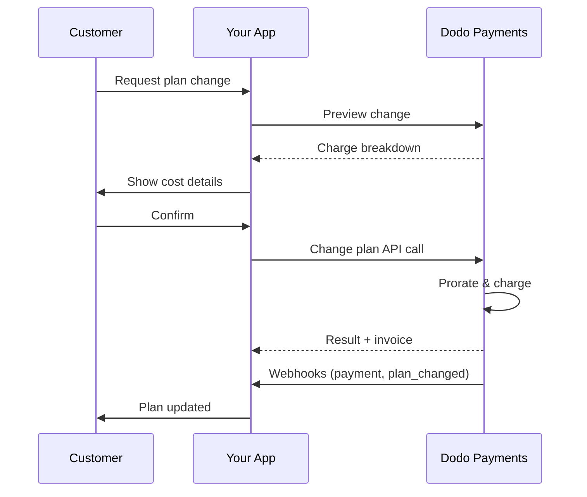
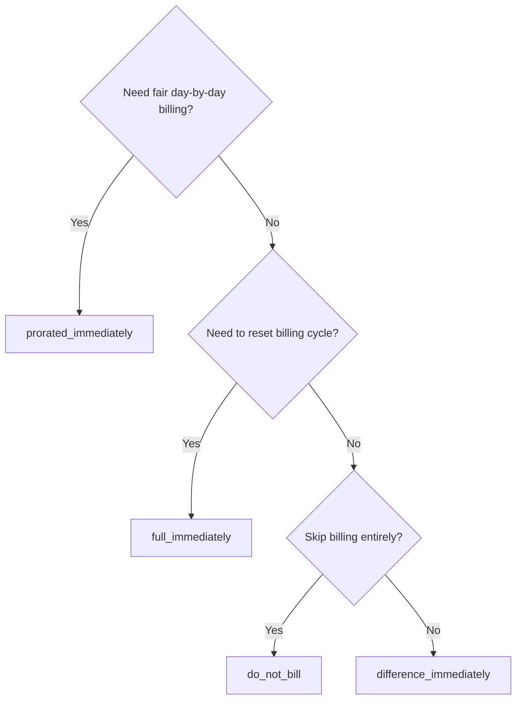
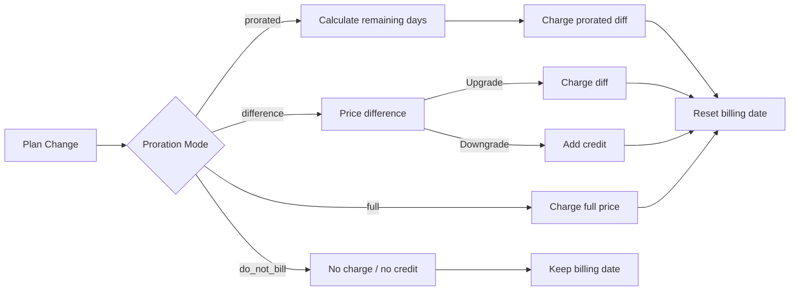

<CardGroup cols={3}>
<Card title="Change Plan API" icon="code" href="/api-reference/subscriptions/change-plan">
  Full API docs for updating subscriptions.
</Card>
<Card title="Plan Change Preview" icon="eye" href="/api-reference/subscriptions/preview-change-plan">
  See charge amounts before changing plans.
</Card>
<Card title="Integration Guide" icon="book" href="/developer-resources/subscription-integration-guide">
  Step-by-step subscription setup.
</Card>
</CardGroup>

## What is a subscription upgrade or downgrade?

Changing plans lets you move a customer between subscription tiers or quantities. Use it to:
- Align pricing with usage or features
- Move from monthly to annual (or vice versa)
- Adjust quantity for seat-based products

<Info>
Plan changes can trigger an immediate charge depending on the proration mode you choose.
</Info>

## When to use plan changes

- Upgrade when a customer needs more features, usage, or seats
- Downgrade when usage decreases
- Migrate users to a new product or price without cancelling their subscription

## Plan Change Flow



## Prerequisites

Before implementing subscription plan changes, ensure you have:

- A Dodo Payments merchant account with active subscription products
- API credentials (API key and webhook secret key) from the dashboard
- An existing active subscription to modify
- Webhook endpoint configured to handle subscription events

<Info>
For detailed setup instructions, see our [Integration Guide](/developer-resources/integration-guide#dashboard-setup).
</Info>

## Step-by-Step Implementation Guide

Follow this comprehensive guide to implement subscription plan changes in your application:

<Steps>
<Step title="Understand Plan Change Requirements">
Before implementing, determine:
- Which subscription products can be changed to which others
- What proration mode fits your business model
- How to handle failed plan changes gracefully
- Which webhook events to track for state management

<Tip>
Test plan changes thoroughly in test mode before implementing in production.
</Tip>
</Step>

<Step title="Choose Your Proration Strategy">
Select the billing approach that aligns with your business needs:

<Tabs>
<Tab title="prorated_immediately">
Best for: SaaS applications wanting to charge fairly for unused time
- Calculates exact prorated amount based on remaining cycle time
- Charges a prorated amount based on unused time remaining in the cycle
- Provides transparent billing to customers
</Tab>

<Tab title="difference_immediately">
Best for: Clear upgrade/downgrade scenarios
- Upgrade: Charge immediate difference (e.g., $30→$80 = charge $50)
- Downgrade: Credit remaining value for future renewals
- Simplifies billing logic and customer communication
</Tab>

<Tab title="full_immediately">
Best for: When you want to reset the billing cycle
- Charges full amount of new plan immediately
- Ignores remaining time from old plan
- Useful for annual to monthly transitions
</Tab>

<Tab title="do_not_bill">
Best for: Free migrations, courtesy switches, or absorbing cost differences
- No charges or credits calculated
- Customer moves to the new plan immediately without any billing adjustment
- Billing cycle remains unchanged
</Tab>
</Tabs>
</Step>

<Step title="Implement the Change Plan API">
Use the Change Plan API to modify subscription details:

<ParamField path="subscription_id" type="string" required>
The ID of the active subscription to modify.
</ParamField>

<ParamField path="product_id" type="string" required>
The new product ID to change the subscription to.
</ParamField>

<ParamField path="quantity" type="integer" required>
Number of units for the new plan (for seat-based products).
</ParamField>

<ParamField path="proration_billing_mode" type="string" required>
How to handle immediate billing: `prorated_immediately`, `full_immediately`, `difference_immediately`, or `do_not_bill`.
</ParamField>

<ParamField path="addons" type="array">
Optional addons for the new plan. Leaving this empty removes any existing addons.
</ParamField>

<ParamField path="on_payment_failure" type="string">
Controls behavior when the plan change payment fails:
- `prevent_change`: Keep subscription on current plan until payment succeeds
- `apply_change` (default): Apply plan change immediately regardless of payment outcome

If not specified, uses the business-level default setting.
</ParamField>

<ParamField path="collect_via_payment_link" type="boolean">
サブスクリプションに保存されている支払い方法で請求する代わりに、payment linkでプラン変更額を回収します。顧客はホスト型のcheckoutページで支払います。

ビジネスで`allow_plan_change_via_payment_link`機能（**Settings → Subscriptions → Collect Plan Change Payments by Payment Link**）が有効であり、`effective_at: immediately`および`on_payment_failure: prevent_change`が必要です。[Collecting Payment via a Checkout Link](#collecting-payment-via-a-checkout-link)を参照してください。

プレビューrouteでは無視されます。
</ParamField>

<ParamField path="discount_codes" type="array">
新しいプランに適用する、任意の**積み重ね可能な**discount codes（最大20個、arrayの順序で適用）。動作は渡す値によって異なります。

- **指定なし / `null`** — 新しいproductに適用可能な場合、`preserve_on_plan_change=true`を含む既存のdiscountsが保持されます。
- **`[]`（空のarray）** — サブスクリプションから既存のdiscountsをすべて削除します。
- **`["CODE_A", "CODE_B", ...]`** — 既存のdiscountsをこのstacked setに置き換えます。
</ParamField>

<ParamField path="discount_code" type="string" deprecated>
**非推奨** — 新しいintegrationsでは`discount_codes`を優先してください。このfieldはbackward compatibilityのため引き続き動作しますが、同じrequestで`discount_codes`と併用することはできません。
</ParamField>

<ParamField path="effective_at" type="string" default="immediately">
プラン変更を適用するタイミング：
- `immediately`（デフォルト）：プラン変更を直ちに適用します
- `next_billing_date`：次回のbilling dateに変更をscheduleします。billing periodが終了するまで、顧客は現在のプランを維持します。

downgradeでは`next_billing_date`を使用し、billing periodの終了まで顧客が現在のプランのbenefitsを維持できるようにします。
</ParamField>
</Step>

<Step title="Handle Webhook Events">
プラン変更の結果を追跡するため、webhook handlingを設定します。

- `subscription.active`：プラン変更に成功し、subscriptionが更新された
- `subscription.plan_changed`：subscription planが変更された（upgrade/downgrade/addon update）
- `subscription.on_hold`：プラン変更のchargeに失敗し、renewalsが停止された
- `payment.succeeded`：プラン変更の即時chargeに成功した
- `payment.failed`：即時chargeに失敗した

<Warning>
常にwebhook signaturesを検証し、idempotentなevent processingを実装してください。
</Warning>
</Step>

<Step title="Update Your Application State">
webhook eventsに基づいてapplicationを更新します。
- 新しいplanに基づいてfeaturesを付与／取り消す
- 新しいplanの詳細でcustomer dashboardを更新する
- plan changesについてconfirmation emailsを送信する
- audit purposesのためbilling changesをlogに記録する
</Step>

<Step title="Test and Monitor">
実装を十分にテストします。
- さまざまなscenarioですべてのproration modesをテストする
- webhook handlingが正しく動作することを確認する
- plan change success ratesを監視する
- failed plan changesのalertsを設定する

<Check>
subscription plan changeの実装は、productionで使用できる状態になりました。
</Check>
</Step>
</Steps>

## プラン変更のプレビュー

プラン変更を確定する前に、Preview APIを使用して、顧客に請求される正確な金額を表示します。

<Tabs>
<Tab title="Node.js SDK">

```javascript
const preview = await client.subscriptions.previewChangePlan('sub_123', {
  product_id: 'pdt_pro',
  quantity: 1,
  proration_billing_mode: 'prorated_immediately'
});

// Show customer the charge before confirming
console.log('Immediate charge:', preview.immediate_charge.summary);
console.log('New plan details:', preview.new_plan);
```

</Tab>

<Tab title="Python SDK">

```python
preview = client.subscriptions.preview_change_plan(
    subscription_id="sub_123",
    product_id="pdt_pro",
    quantity=1,
    proration_billing_mode="prorated_immediately"
)

# Show customer the charge before confirming
print("Immediate charge:", preview.immediate_charge.summary)
print("New plan details:", preview.new_plan)
```

</Tab>
</Tabs>

<Tip>
preview APIを使用して、顧客がplan changeを確認する前に正確な請求額を表示するconfirmation dialogsを作成します。
</Tip>

## Change Plan API

Change Plan APIを使用して、active subscriptionのproduct、quantity、proration behaviorを変更します。

### クイックスタートの例

<Tabs>
  <Tab title="Node.js SDK">

    ```javascript
    import DodoPayments from 'dodopayments';

    const client = new DodoPayments({
      bearerToken: process.env.DODO_PAYMENTS_API_KEY,
      environment: 'test_mode', // defaults to 'live_mode'
    });

    async function changePlan() {
      // change-plan returns 200 with an empty body.
      await client.subscriptions.changePlan('sub_123', {
        product_id: 'pdt_new',
        quantity: 3,
        proration_billing_mode: 'prorated_immediately',
        on_payment_failure: 'prevent_change', // Optional: control behavior on payment failure
      });
      console.log('Plan change accepted; awaiting webhooks');
    }

    changePlan();
    ```

  </Tab>
  <Tab title="Python SDK">

    ```python
    import os
    from dodopayments import DodoPayments

    client = DodoPayments(
        bearer_token=os.environ.get("DODO_PAYMENTS_API_KEY"),
        environment="test_mode",  # defaults to "live_mode"
    )

    # change_plan returns 200 with an empty body.
    client.subscriptions.change_plan(
        subscription_id="sub_123",
        product_id="pdt_new",
        quantity=3,
        proration_billing_mode="prorated_immediately",
        on_payment_failure="prevent_change",  # Optional: control behavior on payment failure
    )
    print("Plan change accepted; awaiting webhooks")
    ```

  </Tab>
  <Tab title="Go SDK">

    ```go
    package main

    import (
      "context"
      "fmt"
      "github.com/dodopayments/dodopayments-go"
      "github.com/dodopayments/dodopayments-go/option"
    )

    func main() {
      client := dodopayments.NewClient(option.WithBearerToken("YOUR_TOKEN"))
      // ChangePlan returns no response body; a nil error means the change succeeded.
      err := client.Subscriptions.ChangePlan(context.TODO(), "sub_123", dodopayments.SubscriptionChangePlanParams{
        UpdateSubscriptionPlanReq: dodopayments.UpdateSubscriptionPlanReqParam{
          ProductID:            dodopayments.F("pdt_new"),
          Quantity:             dodopayments.F(int64(3)),
          ProrationBillingMode: dodopayments.F(dodopayments.UpdateSubscriptionPlanReqProrationBillingModeProratedImmediately),
          OnPaymentFailure:     dodopayments.F(dodopayments.UpdateSubscriptionPlanReqOnPaymentFailurePreventChange), // Optional
        },
      })
      if err != nil { panic(err) }
      fmt.Println("Plan change applied")
    }
    ```

  </Tab>
  <Tab title="HTTP">

    ```bash
    curl -X POST "$DODO_API_BASE/subscriptions/sub_123/change-plan" \
      -H "Authorization: Bearer $DODO_PAYMENTS_API_KEY" \
      -H "Content-Type: application/json" \
      -d '{
        "product_id": "pdt_new",
        "quantity": 3,
        "proration_billing_mode": "prorated_immediately",
        "on_payment_failure": "prevent_change"
      }'
    ```

  </Tab>
</Tabs>

plan changeが成功すると、実際にchargeがsettleする前に`200 OK`が直ちに返されます。body（`ChangePlanResponse`）の内容は、変更の回収方法によって異なります。

| Case | `payment_id` / `payment_link` / `client_secret` / `expires_on` |
|------|------------------------------------------------------------|
| Scheduled change（`effective_at: next_billing_date`） | すべて`null` — まだ何もchargeされない |
| `proration_billing_mode: do_not_bill` | すべて`null` — chargeするものがない |
| 通常の即時charge（保存済みの支払い方法） | すべて`null` |
| `collect_via_payment_link: true`（link発行済み） | すべて**populated** — 顧客向けのcheckout handles |

<Note>
いずれの場合も、このresponseはpayment resultではなく、request自体が受け付けられたことだけを示します。即時chargeが実際に成功したかどうかは示しません。

**通常の即時charge**では、その結果はcall直後にoff-sessionで確定します。

**`collect_via_payment_link` request**では、結果は後から非同期に確定します。responseで渡されるのはcheckout linkだけで、subscriptionは現在のplanにとどまり、顧客が実際にlinkでpaymentを完了するまで結果は分かりません。

いずれの場合も、このresponseから結果を推測しないでください。webhook（<code>payment.succeeded</code>、<code>payment.failed</code>、<code>subscription.plan_changed</code>）で確認するか、<code>GET /subscriptions/&#123;subscription_id&#125;</code>でsubscriptionを再読み込みしてください。payment-linkの場合の詳細は[What Happens While the Link Is Unpaid](#what-happens-while-the-link-is-unpaid)を参照してください。
</Note>

<Warning>
即時chargeに失敗すると、paymentが成功するまでsubscriptionが`subscription.on_hold`に移行する場合があります。
</Warning>

## Checkout LinkによるPaymentの回収

デフォルトでは、即時のplan changeによってsubscriptionの保存済み支払い方法に直接chargeされます。`collect_via_payment_link: true`を設定すると、代わりに顧客をhosted checkout pageへ誘導できます。off-sessionでchargeできる保存済み支払い方法がない場合や、顧客に新しい価格を明示的に確認してもらいたい場合に便利です。

<Info>
これは、**Settings → Subscriptions**にある**Collect Plan Change Payments by Payment Link** toggleの機能でも使用されています。このtoggleは、組み込みの[Customer Portal](/features/customer-portal#collecting-plan-change-payments-by-payment-link)のplan-change flowを、保存済みカードではなくcheckout経由にします。
</Info>

### 要件

`collect_via_payment_link: true`が成功するには、**次のすべて**を満たす必要があります。満たさない場合、requestは`422`で失敗します。

- businessで`allow_plan_change_via_payment_link` capabilityが有効になっている（**Settings → Subscriptions → Collect Plan Change Payments by Payment Link**）。
- `effective_at`が`immediately`（デフォルト）であること。scheduled change（`next_billing_date`）では、適用されるまでchargeされないためcheckout pageは不要です。
- **effectiveな**`on_payment_failure`が`prevent_change`に解決されること。明示的に送る必要はありません。business-level default（下記の**Business & Collection Defaults**を参照）がすでに`prevent_change`であれば、fieldを省略してもこの条件を満たします。明示的な`apply_change`、または解決されたdefaultが`apply_change`の場合は`422`で失敗します。

<Info>
`collect_via_payment_link`はupgradeに限定されません。上記の要件を満たし、chargeが発生する即時変更であれば、downgradeを含めて適用されます。
</Info>

変更額が**ゼロまたはcredit**になる場合（`proration_billing_mode: do_not_bill`、または今cycleの合計がたまたまゼロになる別のmode）は、checkout pageに表示するものがありません。payment linkは発行されず、`payment_link`などは`null`として返され、変更は`collect_via_payment_link`なしの場合と同じく直ちに適用されます。これは`422`ではありません。このflagは回収すべき正の金額がある場合にのみ有効です。明確なupgrade以外のplan changesに一般的に`collect_via_payment_link`を設定する場合は、まず[Preview Plan Change](/api-reference/subscriptions/preview-change-plan)を呼び出し、previewされた金額を回収する価値がある場合にのみlinkを要求してください。

<Tabs>
<Tab title="Node.js SDK">

```javascript
const response = await client.subscriptions.changePlan('sub_123', {
  product_id: 'pdt_pro',
  quantity: 1,
  proration_billing_mode: 'prorated_immediately',
  effective_at: 'immediately',
  on_payment_failure: 'prevent_change',
  collect_via_payment_link: true,
});

// Hand response.payment_link to your frontend and send the customer there
console.log(response.payment_link);
```

</Tab>
<Tab title="Python SDK">

```python
response = client.subscriptions.change_plan(
    subscription_id="sub_123",
    product_id="pdt_pro",
    quantity=1,
    proration_billing_mode="prorated_immediately",
    effective_at="immediately",
    on_payment_failure="prevent_change",
    collect_via_payment_link=True,
)

# Hand response.payment_link to your frontend and send the customer there
print(response.payment_link)
```

</Tab>
<Tab title="HTTP">

```bash
curl -X POST "$DODO_API_BASE/subscriptions/sub_123/change-plan" \
  -H "Authorization: Bearer $DODO_PAYMENTS_API_KEY" \
  -H "Content-Type: application/json" \
  -d '{
    "product_id": "pdt_pro",
    "quantity": 1,
    "proration_billing_mode": "prorated_immediately",
    "effective_at": "immediately",
    "on_payment_failure": "prevent_change",
    "collect_via_payment_link": true
  }'
```

</Tab>
</Tabs>

成功したrequestはcheckout handlesを返します。

```json
{
  "payment_id": "<payment_id>",
  "payment_link": "https://checkout.dodopayments.com/...",
  "client_secret": "<client_secret>",
  "expires_on": "<expires_on>"
}
```

### Linkが未払いの間に発生すること

- subscriptionは**現在の**planにとどまります。`product_id`、`recurring_pre_tax_amount`、`next_billing_date`は、linkが支払われるまで変更されません。
- linkがpendingの間、同じsubscriptionへの追加の`change-plan` requestは`409 PendingPlanChangeExists`で拒否されます。必要に応じて`DELETE /subscriptions/{subscription_id}/change-plan/scheduled`で*scheduled* changeをcancelできますが、このendpointではpending payment-link changeはcancelできません。cancelされるのは、paymentの成功またはexpiryによってのみです。
- decline後も、顧客は**同じ**checkout sessionでカードを再試行できます。新しい`change-plan` callはretry pathではありません。
- linkが一度も支払われない場合、`expires_on`後に機能しなくなり、その少し後にsubscriptionは新しいplan-change requestを受け付けられる状態になります。
- *scheduled* change（`next_billing_date`）がすでに存在し、それを`cancel_scheduled_change_plan: true`で置き換えた場合、linkが未払いの間は元のscheduleが維持されます。linkの支払いが完了した時点で、新しいplanを適用するtransaction内でのみcancelされます。

<Warning>
即時payment-link changeが発行されると、そのsubscriptionへの以後のすべてのplan-change request（副作用のないpreviewを含む）が、linkの解決までblockedになります。顧客にすぐ支払ってもらう意図のないlinkは発行しないでください。
</Warning>

## Addonsの管理

subscription plansを変更する際、addonsも変更できます。

```javascript
// Add addons to the new plan
await client.subscriptions.changePlan('sub_123', {
  product_id: 'pdt_new',
  quantity: 1,
  proration_billing_mode: 'difference_immediately',
  addons: [
    { addon_id: 'addon_123', quantity: 2 }
  ]
});

// Remove all existing addons
await client.subscriptions.changePlan('sub_123', {
  product_id: 'pdt_new',
  quantity: 1,
  proration_billing_mode: 'difference_immediately',
  addons: [] // Empty array removes all existing addons
});
```

<Info>
addonsはproration calculationに含まれ、選択したproration modeに従ってchargeされます。
</Info>

## Discount Codesの適用

subscription plansの変更時に、1つ以上の**stacked discount codes**（最大20個、arrayの順序で適用）を適用できます。upgradeやmigrationにpromotional pricingを提供する場合に便利です。

<Tabs>
<Tab title="Node.js SDK">

```javascript
// Apply stacked discount codes during plan change
await client.subscriptions.changePlan('sub_123', {
  product_id: 'pdt_pro',
  quantity: 1,
  proration_billing_mode: 'prorated_immediately',
  discount_codes: ['UPGRADE20']
});
```

</Tab>
<Tab title="Python SDK">

```python
# Apply stacked discount codes during plan change
client.subscriptions.change_plan(
    subscription_id="sub_123",
    product_id="pdt_pro",
    quantity=1,
    proration_billing_mode="prorated_immediately",
    discount_codes=["UPGRADE20"]
)
```

</Tab>
<Tab title="HTTP">

```bash
curl -X POST "$DODO_API_BASE/subscriptions/sub_123/change-plan" \
  -H "Authorization: Bearer $DODO_PAYMENTS_API_KEY" \
  -H "Content-Type: application/json" \
  -d '{
    "product_id": "pdt_pro",
    "quantity": 1,
    "proration_billing_mode": "prorated_immediately",
    "discount_codes": ["UPGRADE20"]
  }'
```

</Tab>
</Tabs>

### Plan change時のDiscountの動作

| `discount_codes` value | 動作 |
|------------------------|----------|
| 指定なし / `null` | 新しいproductに適用可能な場合、`preserve_on_plan_change=true`を含む既存のdiscountsが自動的に保持されます。 |
| `[]`（空のarray） | subscriptionから既存のdiscountsを**すべて**削除します。 |
| `["CODE_A", "CODE_B", ...]` | 既存のdiscountsをこのstacked setに置き換え、検証してarrayの順序で適用します。 |

<Info>
このendpointの単数形の`discount_code` fieldは**非推奨**ですが、backward compatibilityのため引き続き動作します。既存のintegrationsですぐに変更する必要はありません。同じrequestで`discount_codes`と併用することはできません。都合のよいタイミングでarray形式へ移行してください。
</Info>

<Tip>
[Preview Plan Change API](/api-reference/subscriptions/preview-change-plan)を`discount_codes`と併用し、plan changeを確定する前に顧客がどれだけ節約できるかを正確に表示します。
</Tip>

## Proration modes

plansの変更時に顧客へどのようにbillするかを選択します。

#### `prorated_immediately`
- 現在のcycleにおける差額の一部をchargeする
- trial中の場合は直ちにchargeし、今すぐ新しいplanに切り替える
- Downgrade：prorated creditが発生し、今後のrenewalsに適用される場合がある

#### `full_immediately`
- 新しいplanの全額を直ちにchargeする
- 旧planの残り期間を無視する

<Info>
<code>difference_immediately</code>を使用したdowngradeによって作成されるcreditsはsubscriptionにスコープされ、<a href="/features/credit-based-billing">Credit-Based Billing</a>のentitlementsとは別物です。同じsubscriptionの今後のrenewalsに自動適用され、subscription間でtransferすることはできません。
</Info>

#### `difference_immediately`
- Upgrade：旧planと新planの価格差を直ちにchargeする
- Downgrade：残りのvalueをsubscriptionへのinternal creditとして追加し、renewalsに自動適用する

#### `do_not_bill`
- chargesもcreditsも計算しない
- billing adjustmentなしで、顧客を直ちに新しいplanへ切り替える
- billing cycleは変更しない
- courtesy migrations、free plan switches、またはcost differencesの吸収に最適

| Feature | `prorated_immediately` | `difference_immediately` | `full_immediately` | `do_not_bill` |
|---------|----------------------|------------------------|-------------------|--------------|
| **Upgrade charge** | 残り日数に対するprorated difference | plans間の全価格差 | 新planの全価格 | chargeなし |
| **Downgrade credit** | 残り日数に対するprorated credit | 全価格差をcreditとして付与 | creditなし | creditなし |
| **Billing cycle** | 今日にreset | 今日にreset | 今日にreset | 変更なし |
| **Trial behavior** | trialを終了し、直ちにcharge | trialを終了し、全額を直ちにcharge | trialを終了し、全額をcharge | trialを終了し、chargeなし |
| **Best for** | 時間に基づく公平なbilling | 単純なupgrade/downgrade計算 | billing cyclesのreset | 無料migrationまたはcourtesy switch |
| **Complexity** | Medium（日数計算） | Low（単純な減算） | Low（全額charge） | なし |



### シナリオ例

次のcanonical numbersを一貫して使用します。
- 現在のplan：**Basic**、**$30/month**
- Upgrade target：**Pro**、**$80/month**
- Downgrade target（Proから）：**Starter**、**$20/month**
- Billing cycle：**30 days**、**January 1**に開始
- Plan changeは**January 16**に発生（残り15日、使用済み15日）

<AccordionGroup>
  <Accordion title="Upgrade: Basic ($30) → Pro ($80) with prorated_immediately">

    ```
    Step 1: Calculate unused credit from current plan
      Unused days = 15 out of 30 days
      Credit = $30 × (15/30) = $15.00

    Step 2: Calculate prorated cost of new plan
      Remaining days = 15 out of 30 days
      New plan cost = $80 × (15/30) = $40.00

    Step 3: Calculate immediate charge
      Charge = New plan cost − Credit
      Charge = $40.00 − $15.00 = $25.00

    → Customer pays $25.00 now
    → Billing cycle resets to today (January 16)
    → Next renewal (Feb 15): $80.00/month
    ```

    ```javascript
    await client.subscriptions.changePlan('sub_123', {
      product_id: 'pdt_pro',
      quantity: 1,
      proration_billing_mode: 'prorated_immediately'
    })
    ```

  </Accordion>

  <Accordion title="Downgrade: Pro ($80) → Starter ($20) with prorated_immediately">

    ```
    Step 1: Calculate unused credit from current plan
      Unused days = 15 out of 30 days
      Credit = $80 × (15/30) = $40.00

    Step 2: Calculate prorated cost of new plan
      Remaining days = 15 out of 30 days
      New plan cost = $20 × (15/30) = $10.00

    Step 3: Calculate credit balance
      Credit = $40.00 − $10.00 = $30.00

    → No charge — $30.00 credit added to subscription
    → Billing cycle resets to today (January 16)
    → Credit auto-applies to future renewals
    → Next renewal (Feb 15): $20.00 − $20.00 (from credit) = $0.00 ($10.00 credit remaining)
    → Following renewal (Mar 15): $20.00 − $10.00 remaining credit = $10.00
    ```

    ```javascript
    await client.subscriptions.changePlan('sub_123', {
      product_id: 'pdt_starter',
      quantity: 1,
      proration_billing_mode: 'prorated_immediately'
    })
    ```

  </Accordion>

  <Accordion title="Upgrade: Basic ($30) → Pro ($80) with difference_immediately">

    ```
    Immediate charge = New plan price − Old plan price
                     = $80 − $30
                     = $50.00

    → Customer pays $50.00 now (regardless of cycle position)
    → Billing cycle resets to today (January 16)
    → Next renewal (Feb 15): $80.00/month
    ```

    ```javascript
    await client.subscriptions.changePlan('sub_123', {
      product_id: 'pdt_pro',
      quantity: 1,
      proration_billing_mode: 'difference_immediately'
    })
    ```

  </Accordion>

  <Accordion title="Downgrade: Pro ($80) → Starter ($20) with difference_immediately">

    ```
    Credit = Old plan price − New plan price
           = $80 − $20
           = $60.00

    → No charge — $60.00 credit added to subscription
    → Credit auto-applies to future renewals
    → Next renewal: $20.00 − $20.00 (from credit) = $0.00
    → Following renewal: $20.00 − $20.00 (from credit) = $0.00
    → Third renewal: $20.00 − $20.00 (from remaining credit) = $0.00
    ```

    ```javascript
    await client.subscriptions.changePlan('sub_123', {
      product_id: 'pdt_starter',
      quantity: 1,
      proration_billing_mode: 'difference_immediately'
    })
    ```

  </Accordion>

  <Accordion title="Upgrade: Basic ($30) → Pro ($80) with full_immediately">

    ```
    Immediate charge = Full new plan price = $80.00

    → Customer pays $80.00 now
    → No credit for unused time on old plan
    → Billing cycle resets to today (January 16)
    → Next renewal: February 16 at $80.00/month
    ```

    ```javascript
    await client.subscriptions.changePlan('sub_123', {
      product_id: 'pdt_pro',
      quantity: 1,
      proration_billing_mode: 'full_immediately'
    })
    ```

  </Accordion>

  <Accordion title="Mid-cycle upgrade with add-ons using prorated_immediately">

    ```
    Current: Basic plan ($30/month), no add-ons
    New: Pro plan ($80/month) + Extra Seats add-on ($10/seat × 3 seats = $30/month)
    Change on day 16 of 30 (15 days remaining)

    Step 1: Credit from current plan
      Credit = $30 × (15/30) = $15.00

    Step 2: Prorated cost of new plan + add-ons
      New plan = $80 × (15/30) = $40.00
      Add-ons = $30 × (15/30) = $15.00
      Total new = $55.00

    Step 3: Immediate charge
      Charge = $55.00 − $15.00 = $40.00

    → Customer pays $40.00 now
    → Next renewal: $80.00 + $30.00 = $110.00/month
    ```

    ```javascript
    await client.subscriptions.changePlan('sub_123', {
      product_id: 'pdt_pro',
      quantity: 1,
      proration_billing_mode: 'prorated_immediately',
      addons: [
        { addon_id: 'addon_seats', quantity: 3 }
      ]
    })
    ```

  </Accordion>
</AccordionGroup>

### 各modeでのbilling処理



<Tip>
時間に基づく公平なaccountingには`prorated_immediately`、billingをrestartするには`full_immediately`、単純なupgradesとdowngrades時の自動creditには`difference_immediately`、billing adjustmentなしのplan切り替えには`do_not_bill`を選択します。
</Tip>

## Payment Failuresの処理

`on_payment_failure` parameterを使用して、plan change paymentが失敗した場合の動作を制御します。

### Payment Failure Modes

<Tabs>
<Tab title="prevent_change (Recommended for critical upgrades)">
**動作**：paymentが成功するまでsubscriptionを現在のplanに維持します。

- Plan changeは「pending」としてmarkされる
- 顧客は現在のplanへのaccessを維持する
- subscriptionはpayment成功後にのみ`active` stateへ移行する
- upgraded featuresを付与する前にpaymentを確実に受け取りたい場合に有用

```javascript
await client.subscriptions.changePlan('sub_123', {
  product_id: 'pdt_pro',
  quantity: 1,
  proration_billing_mode: 'prorated_immediately',
  on_payment_failure: 'prevent_change'
});
```

</Tab>

<Tab title="apply_change (Default)">
**動作**：paymentの結果にかかわらずplan changeを直ちに適用します。

- paymentに失敗してもplan changeは適用される
- 顧客は新しいplanへ直ちにaccessできる
- paymentに失敗するとsubscriptionが`on_hold`へ移行する場合がある
- 重要度の低いupgradeや、顧客を信頼できる場合に適している

```javascript
await client.subscriptions.changePlan('sub_123', {
  product_id: 'pdt_pro',
  quantity: 1,
  proration_billing_mode: 'prorated_immediately',
  on_payment_failure: 'apply_change' // This is the default
});
```

</Tab>
</Tabs>

<Info>
指定しない場合、`on_payment_failure` parameterはdashboardで設定されたbusiness-level default settingを使用します。
</Info>

### 各Modeの使用タイミング

| Scenario | Recommended Mode | Reason |
|----------|------------------|--------|
| premium featuresへのupgrade | `prevent_change` | accessを付与する前にpaymentを確保する |
| quantity increase（seat追加） | `prevent_change` | paymentなしの利用を防ぐ |
| plansのdowngrade | `apply_change` | 顧客が支出を減らしている |
| 信頼できるenterprise customers | `apply_change` | 未払いのriskが低い |
| trialからpaidへのconversion | `prevent_change` | 重要なpayment moment |

## Business & Collection Defaults

すべてのplan changeでproration parametersを渡す代わりに、**default upgrade & downgrade behavior**をbusiness levelで一度設定できます。これらのdefaultsはすべてのcustomer-portal plan changesに適用され、**product collectionごとにoverride**できます。

upgradeとdowngradeにはそれぞれ別のdefaultsがあります。

| Setting | Field (upgrade / downgrade) | Default (upgrade) | Default (downgrade) |
|---------|-----------------------------|-------------------|---------------------|
| 新しいplanの開始時期 | `effective_at_on_upgrade` / `effective_at_on_downgrade` | `immediately` | `next_billing_date` |
| 顧客へのcharge方法 | `proration_billing_mode_on_upgrade` / `proration_billing_mode_on_downgrade` | `difference_immediately` | `difference_immediately` |
| 顧客のpaymentが失敗した場合 | `on_payment_failure` | `apply_change` | `apply_change` |

business defaultsは**Settings → Subscriptions**で、collection overridesは各product collectionで設定します。各collection fieldは独立しています。未設定のままにすると**business defaultをinherit**し、値を設定するとそのcollectionにのみoverrideされます。

### Resolution order

指定されたplan changeでは、各settingが次の順序で解決されます。

```
per-request value (Change Plan API) → collection field (if set) → business field → system default
```

<Info>
[Change Plan API](/api-reference/subscriptions/change-plan)に明示的に渡されたvalueが常に優先されます。businessおよびcollection defaultsは、明示的なvalueが指定されていない場合にのみ適用されます。これはcustomer portalから開始されたすべてのplan changesに当てはまります。
</Info>

<Tip>
一般的な設定では、upgradeを`immediately` + `difference_immediately`にして顧客が差額を支払い、すぐにaccessできるようにします。downgradeは`next_billing_date`にして、cycle終了まで顧客が現在のplanを維持できるようにします。
</Tip>

## Webhooksの処理

webhooksでsubscription stateを追跡し、plan changesとpaymentsを確認します。

### 処理するEvent types
- `subscription.active`：subscriptionがactivated
- `subscription.plan_changed`：subscription planが変更された（upgrade/downgrade/addon changes）
- `subscription.on_hold`：chargeに失敗し、renewalsが停止された
- `subscription.renewed`：renewalに成功した
- `payment.succeeded`：plan changeまたはrenewalのpaymentに成功した
- `payment.failed`：paymentに失敗した

<Info>
business logicはsubscription eventsを基準にし、confirmationとreconciliationにはpayment eventsを使用することを推奨します。
</Info>

### Signaturesの検証とIntentsの処理

<Tabs>
  <Tab title="Next.js Route Handler">

    ```javascript
    import { NextRequest, NextResponse } from 'next/server';
    
    export async function POST(req) {
      const webhookId = req.headers.get('webhook-id');
      const webhookSignature = req.headers.get('webhook-signature');
      const webhookTimestamp = req.headers.get('webhook-timestamp');
      const secret = process.env.DODO_WEBHOOK_SECRET;
    
      const payload = await req.text();
      // verifySignature is a placeholder – in production, use a Standard Webhooks library
      const { valid, event } = await verifySignature(
        payload,
        { id: webhookId, signature: webhookSignature, timestamp: webhookTimestamp },
        secret
      );
      if (!valid) return NextResponse.json({ error: 'Invalid signature' }, { status: 400 });
    
      switch (event.type) {
        case 'subscription.active':
          // mark subscription active in your DB
          break;
        case 'subscription.plan_changed':
          // refresh entitlements and reflect the new plan in your UI
          break;
        case 'subscription.on_hold':
          // notify user to update payment method
          break;
        case 'subscription.renewed':
          // extend access window
          break;
        case 'payment.succeeded':
          // reconcile payment for plan change
          break;
        case 'payment.failed':
          // log and alert
          break;
        default:
          // ignore unknown events
          break;
      }
    
      return NextResponse.json({ received: true });
    }
    ```

  </Tab>
  <Tab title="Express.js">

    ```javascript
    import express from 'express';
    
    const app = express();
    app.post('/webhooks/dodo', express.raw({ type: 'application/json' }), async (req, res) => {
      const webhookId = req.header('webhook-id');
      const webhookSignature = req.header('webhook-signature');
      const webhookTimestamp = req.header('webhook-timestamp');
      const secret = process.env.DODO_WEBHOOK_SECRET;
      const payload = req.body.toString('utf8');
    
      const { valid, event } = await verifySignature(
        payload,
        { id: webhookId, signature: webhookSignature, timestamp: webhookTimestamp },
        secret
      );
      if (!valid) return res.status(400).send('Invalid signature');
    
      // handle events like above
      res.json({ received: true });
    });
    
    app.listen(3000);
    ```

  </Tab>
</Tabs>

<Note>
詳細なpayload schemasについては、<a href="/developer-resources/webhooks/intents/subscription">Subscription webhook payloads</a>および<a href="/developer-resources/webhooks/intents/payment">Payment webhook payloads</a>を参照してください。
</Note>

## Best Practices

信頼性の高いsubscription plan changesのため、次の推奨事項に従ってください。

### Plan Change Strategy
- **十分にテストする**：productionの前に、必ずtest modeでplan changesをテストする
- **prorationを慎重に選択する**：business modelに合うproration modeを選択する
- **failuresを適切に処理する**：適切なerror handlingとretry logicを実装する
- **success ratesを監視する**：plan changeのsuccess/failure ratesを追跡し、問題を調査する

### Webhook Implementation
- **signaturesを検証する**：authenticityを確保するため、常にwebhook signaturesをvalidateする
- **idempotencyを実装する**：重複したwebhook eventsを適切に処理する
- **非同期で処理する**：重い処理でwebhook responsesをblockしない
- **すべてをlogに記録する**：debuggingとaudit purposesのため詳細なlogsを保持する

### User Experience
- **明確に伝える**：billing changesとtimingを顧客に知らせる
- **confirmationsを提供する**：成功したplan changesについてemail confirmationsを送信する
- **edge casesを処理する**：trial periods、prorations、failed paymentsを考慮する
- **UIを直ちに更新する**：application interfaceにplan changesを反映する

## よくある問題と解決策

subscription plan changes中に発生する一般的な問題を解決します。

<AccordionGroup>
<Accordion title="Charge created but subscription not updated">
**Symptoms**：API callは成功するが、subscriptionがold planのまま

**Common causes**：
- Webhook processingに失敗した、または遅延した
- webhooks受信後にapplication stateが更新されていない
- state update中のdatabase transaction issues

**Solutions**：
- retry logicを備えた堅牢なwebhook handlingを実装する
- state updatesにidempotent operationsを使用する
- missed webhook eventsを検出してalertするmonitoringを追加する
- webhook endpointにaccessでき、正しくresponseしていることを確認する
</Accordion>

<Accordion title="Credits not applied after downgrade">
**Symptoms**：顧客がdowngradeしたが、credit balanceが表示されない

**Common causes**：
- Proration modeの想定：downgradeでは`difference_immediately`によりfull plan price differenceがcreditされる一方、`prorated_immediately`ではcycleの残り時間に基づくprorated creditが作成される
- Creditsはsubscription-specificで、subscription間でtransferされない
- Customer dashboardにcredit balanceが表示されない

**Solutions**：
- automatic creditsが必要なdowngradeには`difference_immediately`を使用する
- creditsは同じsubscriptionのfuture renewalsに適用されることを顧客に説明する
- credit balancesを表示するcustomer portalを実装する
- next invoice previewで適用されたcreditsを確認する
</Accordion>

<Accordion title="Webhook signature verification fails">
**Symptoms**：invalid signatureによりWebhook eventsがrejectされる

**Common causes**：
- webhook secret keyが正しくない
- signature verification前にraw request bodyが変更された
- signature verification algorithmが間違っている

**Solutions**：
- dashboardの正しい`DODO_WEBHOOK_SECRET`を使用していることを確認する
- JSON parsing middlewareの前にraw request bodyを読み取る
- platform用のstandard webhook verification libraryを使用する
- development environmentでwebhook signature verificationをテストする
</Accordion>

<Accordion title="Plan change fails with 422 error">
**Symptoms**：APIが422 Unprocessable Entity errorを返す

**Common causes**：
- subscription IDまたはproduct IDが無効
- subscriptionがactive stateではない
- required parametersが不足している
- productがplan changesに利用できない

**Solutions**：
- subscriptionが存在し、activeであることを確認する
- product IDが有効で利用可能か確認する
- required parametersがすべて指定されていることを確認する
- parameter requirementsについてAPI documentationを確認する
</Accordion>

<Accordion title="Immediate charge fails during plan change">
**Symptoms**：plan changeが開始されたが、即時chargeに失敗する

**Common causes**：
- 顧客のpayment methodの残高不足
- payment methodの期限切れまたは無効
- bankがtransactionをdeclineした
- fraud detectionがchargeをblockした

**Solutions**：
- `payment.failed` webhook eventsを適切に処理する
- 顧客にpayment methodの更新を通知する
- 一時的なfailuresに対するretry logicを実装する
- failed immediate chargesでもplan changesを許可することを検討する
</Accordion>

<Accordion title="Subscription on hold after plan change">
**Symptoms**：plan change chargeに失敗し、subscriptionが`on_hold` stateへ移行する

**What happens**：
plan change chargeに失敗すると、subscriptionは自動的に`on_hold` stateになります。payment methodが更新されるまで、subscriptionは自動renewされません。

**Solution**：payment methodを更新してsubscriptionをreactivateする

failed plan change後、`on_hold` stateのsubscriptionをreactivateするには：

1. **payment methodを更新する**：Update Payment Method APIを使用します
2. **Automatic charge creation**：APIが未払い残額へのchargeを自動作成します
3. **Invoice generation**：chargeのinvoiceが生成されます
4. **Payment processing**：新しいpayment methodでpaymentが処理されます
5. **Reactivation**：payment成功後、subscriptionは`active` stateにreactivateされます

<CodeGroup>

```javascript Node.js
// Reactivate subscription from on_hold after failed plan change
async function reactivateAfterFailedPlanChange(subscriptionId) {
  // Update payment method - automatically creates charge for remaining dues
  const response = await client.subscriptions.updatePaymentMethod(subscriptionId, {
    payment_method: { type: 'new', return_url: 'https://example.com/return' }
  });
  
  if (response.payment_id) {
    console.log('Charge created for remaining dues:', response.payment_id);
    console.log('Payment link:', response.payment_link);
    
    // Redirect customer to payment_link to complete payment
    // Monitor webhooks for:
    // 1. payment.succeeded - charge succeeded
    // 2. subscription.active - subscription reactivated
  }
  
  return response;
}

// Or use existing payment method if available
async function reactivateWithExistingPaymentMethod(subscriptionId, paymentMethodId) {
  const response = await client.subscriptions.updatePaymentMethod(subscriptionId, {
    payment_method: { type: 'existing', payment_method_id: paymentMethodId }
  });
  
  // Monitor webhooks for payment.succeeded and subscription.active
  return response;
}
```

```python Python
# Reactivate subscription from on_hold after failed plan change
def reactivate_after_failed_plan_change(subscription_id):
    # Update payment method - automatically creates charge for remaining dues
    response = client.subscriptions.update_payment_method(
        subscription_id=subscription_id,
        payment_method={"type": "new", "return_url": "https://example.com/return"},
    )
    
    if response.payment_id:
        print("Charge created for remaining dues:", response.payment_id)
        print("Payment link:", response.payment_link)
        
        # Redirect customer to payment_link to complete payment
        # Monitor webhooks for:
        # 1. payment.succeeded - charge succeeded
        # 2. subscription.active - subscription reactivated
    
    return response

# Or use existing payment method if available
def reactivate_with_existing_payment_method(subscription_id, payment_method_id):
    response = client.subscriptions.update_payment_method(
        subscription_id=subscription_id,
        payment_method={"type": "existing", "payment_method_id": payment_method_id},
    )
    
    # Monitor webhooks for payment.succeeded and subscription.active
    return response
```

</CodeGroup>

**監視するWebhook events**：
- `subscription.on_hold`：subscriptionがholdされる（plan change charge失敗時に受信）
- `payment.succeeded`：未払い残額のpaymentに成功（payment method更新後）
- `subscription.active`：payment成功後にsubscriptionがreactivateされた

**Best practices**：
- plan change charge失敗時に顧客へ直ちに通知する
- payment methodの更新方法を明確に案内する
- reactivation statusを追跡するためwebhook eventsを監視する
- 一時的なpayment failuresに対するautomatic retry logicの実装を検討する

<Card title="Update Payment Method API Reference" icon="code" href="/api-reference/subscriptions/update-payment-method">
payment methodsの更新とsubscriptionsのreactivationに関する完全なAPI documentationを確認してください。
</Card>
</Accordion>
</AccordionGroup>

## 実装のテスト

subscription plan changeの実装を十分にテストするには、次の手順に従います。

<Steps>
<Step title="Set up test environment">
- test API keysとtest productsを使用する
- 異なるplan typesでtest subscriptionsを作成する
- test webhook endpointを設定する
- monitoringとloggingを設定する
</Step>

<Step title="Test different proration modes">
- さまざまなbilling cycle positionsで`prorated_immediately`をテストする
- upgradesとdowngradesで`difference_immediately`をテストする
- billing cyclesをresetするため`full_immediately`をテストする
- chargeもcreditもないplan switchesで`do_not_bill`をテストする
- credit calculationsが正しいことを確認する
</Step>

<Step title="Test webhook handling">
- 関連するすべてのwebhook eventsが受信されることを確認する
- webhook signature verificationをテストする
- duplicate webhook eventsを適切に処理する
- webhook processing failure scenariosをテストする
</Step>

<Step title="Test error scenarios">
- invalid subscription IDsでテストする
- expired payment methodsでテストする
- network failuresとtimeoutsをテストする
- insufficient fundsでテストする
</Step>

<Step title="Monitor in production">
- failed plan changesのalertsを設定する
- webhook processing timesを監視する
- plan change success ratesを追跡する
- plan change issuesに関するcustomer support ticketsを確認する
</Step>
</Steps>

## Error Handling

実装では一般的なAPI errorsを適切に処理します。

### HTTP Status Codes

<AccordionGroup>
<Accordion title="200 OK">
Plan change requestは正常に処理されました。response bodyは空ですが、成功した`collect_via_payment_link` requestの場合はcheckout handlesを返します。詳しくは[Collecting Payment via a Checkout Link](#collecting-payment-via-a-checkout-link)を参照してください。`on_payment_failure=prevent_change`の場合、paymentが成功するまでplan changeはpendingのままです。
</Accordion>

<Accordion title="400 Bad Request">
request parametersが無効です。required fieldsがすべて指定され、正しい形式であることを確認してください。
</Accordion>

<Accordion title="401 Unauthorized">
API keyが無効または不足しています。`DODO_PAYMENTS_API_KEY`が正しく、適切なpermissionsを持つことを確認してください。
</Accordion>

<Accordion title="404 Not Found">
Subscription IDが見つからないか、アカウントに属していません。
</Accordion>

<Accordion title="409 Conflict">
このsubscriptionにはpending plan changeがすでに存在します（`PendingPlanChangeExists`）。*scheduled* changeの場合は、別のものをsubmitする前に`DELETE /subscriptions/{subscription_id}/change-plan/scheduled`でcancelしてください。pending *payment-link* changeにはcancel endpointがありません。顧客が支払うかlinkがexpiryすると、subscriptionは新しいplan-change requestを受け付けます。
</Accordion>

<Accordion title="422 Unprocessable Entity">
subscriptionがinactiveまたはon-demandであるか、requestが`collect_via_payment_link`の対象外です。businessでcapabilityが有効になっていない、`effective_at`が`immediately`ではない、または`on_payment_failure`が`prevent_change`ではありません。[Requirements](#requirements)を参照してください。
</Accordion>

<Accordion title="500 Internal Server Error">
Server errorが発生しました。少し待ってからrequestをretryしてください。
</Accordion>
</AccordionGroup>

### Error Response Format

```json
{
  "error": {
    "code": "subscription_not_found",
    "message": "The subscription with ID 'sub_123' was not found",
    "details": {
      "subscription_id": "sub_123"
    }
  }
}
```

## 次のステップ

- <a href="/api-reference/subscriptions/change-plan">Change Plan API</a>を確認する
- <a href="/features/credit-based-billing">Credit-Based Billing</a>を確認する
- `subscription.on_hold`のalertsを実装する
- <a href="/developer-resources/webhooks">Webhook Integration Guide</a>を確認する
