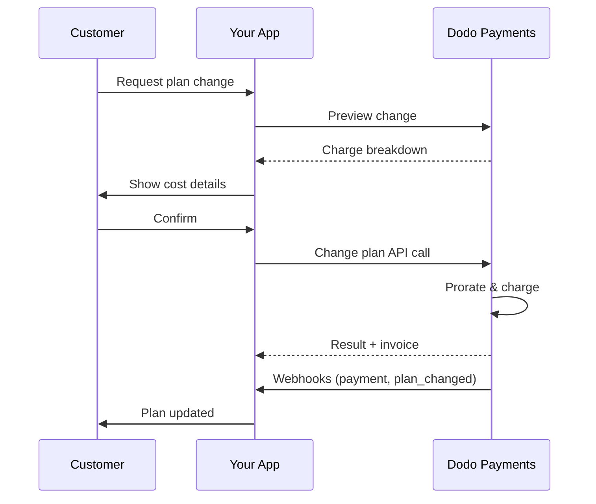
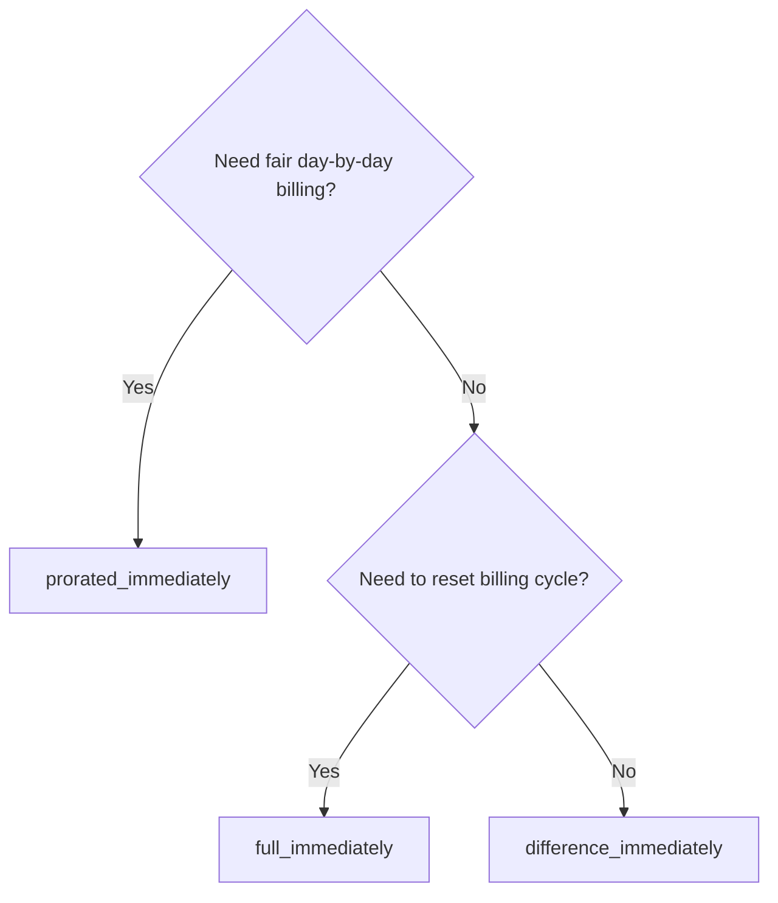
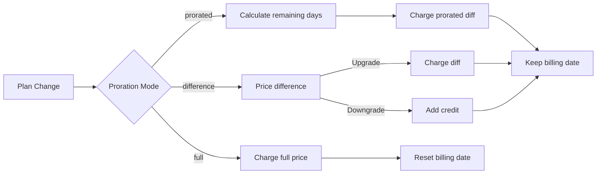

<CardGroup cols={3}>
<Card title="Change Plan API" icon="code" href="/api-reference/subscriptions/change-plan">
  Full API docs for updating subscriptions.
</Card>
<Card title="Plan Change Preview" icon="eye" href="/api-reference/subscriptions/preview-change-plan">
  See charge amounts before changing plans.
</Card>
<Card title="Integration Guide" icon="book" href="/developer-resources/subscription-integration-guide">
  Step-by-step subscription setup.
</Card>
</CardGroup>

## What is a subscription upgrade or downgrade?

Changing plans lets you move a customer between subscription tiers or quantities. Use it to:
- Align pricing with usage or features
- Move from monthly to annual (or vice versa)
- Adjust quantity for seat-based products

<Info>
Plan changes can trigger an immediate charge depending on the proration mode you choose.
</Info>

## When to use plan changes

- Upgrade when a customer needs more features, usage, or seats
- Downgrade when usage decreases
- Migrate users to a new product or price without cancelling their subscription

## Plan Change Flow



## Prerequisites

Before implementing subscription plan changes, ensure you have:

- A Dodo Payments merchant account with active subscription products
- API credentials (API key and webhook secret key) from the dashboard
- An existing active subscription to modify
- Webhook endpoint configured to handle subscription events

<Info>
For detailed setup instructions, see our [Integration Guide](/developer-resources/integration-guide#dashboard-setup).
</Info>

## Step-by-Step Implementation Guide

Follow this comprehensive guide to implement subscription plan changes in your application:

<Steps>
<Step title="Understand Plan Change Requirements">
Before implementing, determine:
- Which subscription products can be changed to which others
- What proration mode fits your business model
- How to handle failed plan changes gracefully
- Which webhook events to track for state management

<Tip>
Test plan changes thoroughly in test mode before implementing in production.
</Tip>
</Step>

<Step title="Choose Your Proration Strategy">
Select the billing approach that aligns with your business needs:

<Tabs>
<Tab title="prorated_immediately">
Best for: SaaS applications wanting to charge fairly for unused time
- Calculates exact prorated amount based on remaining cycle time
- Charges a prorated amount based on unused time remaining in the cycle
- Provides transparent billing to customers
</Tab>

<Tab title="difference_immediately">
Best for: Clear upgrade/downgrade scenarios
- Upgrade: Charge immediate difference (e.g., $30→$80 = charge $50)
- Downgrade: Credit remaining value for future renewals
- Simplifies billing logic and customer communication
</Tab>

<Tab title="full_immediately">
Best for: When you want to reset the billing cycle
- Charges full amount of new plan immediately
- Ignores remaining time from old plan
- Useful for annual to monthly transitions
</Tab>
</Tabs>
</Step>

<Step title="Implement the Change Plan API">
Use the Change Plan API to modify subscription details:

<ParamField path="subscription_id" type="string" required>
The ID of the active subscription to modify.
</ParamField>

<ParamField path="product_id" type="string" required>
The new product ID to change the subscription to.
</ParamField>

<ParamField path="quantity" type="integer" default="1">
Number of units for the new plan (for seat-based products).
</ParamField>

<ParamField path="proration_billing_mode" type="string" required>
How to handle immediate billing: `prorated_immediately`, `full_immediately`, or `difference_immediately`.
</ParamField>

<ParamField path="addons" type="array">
Optional addons for the new plan. Leaving this empty removes any existing addons.
</ParamField>

<ParamField path="on_payment_failure" type="string">
Controls behavior when the plan change payment fails:
- `prevent_change`: Keep subscription on current plan until payment succeeds
- `apply_change` (default): Apply plan change immediately regardless of payment outcome

指定されていない場合、ビジネスレベルのデフォルト設定を使用します。
</ParamField>

<ParamField path="discount_code" type="string">
新しいプランに適用するオプションのディスカウントコードです。提供された場合、ディスカウントを検証してプラン変更に適用します。提供されず、サブスクリプションに`preserve_on_plan_change=true`の既存のディスカウントがある場合、（新しい商品に適用可能であれば）既存のディスカウントが保持されます。
</ParamField>
</Step>

<Step title="Handle Webhook Events">
プラン変更の結果を追跡するためにWebhookハンドリングを設定します。

- `subscription.active`: プラン変更成功、サブスクリプションが更新されました
- `subscription.plan_changed`: サブスクリプションプランの変更（アップグレード/ダウングレード/アドオン更新）
- `subscription.on_hold`: プラン変更の課金失敗、サブスクリプションが一時停止されました
- `payment.succeeded`: プラン変更の即時課金が成功しました
- `payment.failed`: 即時課金失敗

<Warning>
常にWebhookの署名を確認し、冪等性のあるイベント処理を実装してください。
</Warning>
</Step>

<Step title="Update Your Application State">
Webhookイベントに基づいて、アプリケーションを更新します：
- 新しいプランに基づいて機能を許可/解除する
- 顧客ダッシュボードに新しいプランの詳細を更新する
- プラン変更に関する確認メールを送信する
- 感謝目的で請求の変更を記録する
</Step>

<Step title="Test and Monitor">
実装を徹底的にテストします：
- さまざまなシナリオでのすべての比例モードをテストする
- Webhook処理が正しく機能するか確認する
- プラン変更の成功率を監視する
- プラン変更の失敗に対するアラートを設定する

<Check>
サブスクリプションプランの変更の実装が本番用利用に向けて準備が整いました。
</Check>
</Step>
</Steps>

## プラン変更のプレビュー

プラン変更を確定する前に、Preview APIを使用して顧客に正確な課金内容を示します：

<Tabs>
<Tab title="Node.js SDK">

```javascript
const preview = await client.subscriptions.previewChangePlan('sub_123', {
  product_id: 'prod_pro',
  quantity: 1,
  proration_billing_mode: 'prorated_immediately'
});

// Show customer the charge before confirming
console.log('Immediate charge:', preview.immediate_charge.summary);
console.log('New plan details:', preview.new_plan);
```

</Tab>

<Tab title="Python SDK">

```python
preview = client.subscriptions.preview_change_plan(
    subscription_id="sub_123",
    product_id="prod_pro",
    quantity=1,
    proration_billing_mode="prorated_immediately"
)

# Show customer the charge before confirming
print("Immediate charge:", preview.immediate_charge.summary)
print("New plan details:", preview.new_plan)
```

</Tab>
</Tabs>

<Tip>
プレビューAPIを使用して、顧客がプラン変更を確認する前に課金される正確な金額を示す確認ダイアログを作成します。
</Tip>

## プラン変更API

アクティブなサブスクリプションのために、製品、数量、および比例計算の動作を変更するためにChange Plan APIを使用します。

### クイックスタート例

<Tabs>
  <Tab title="Node.js SDK">

    ```javascript
    import DodoPayments from 'dodopayments';

    const client = new DodoPayments({
      bearerToken: process.env.DODO_PAYMENTS_API_KEY,
      environment: 'test_mode', // defaults to 'live_mode'
    });

    async function changePlan() {
      const result = await client.subscriptions.changePlan('sub_123', {
        product_id: 'prod_new',
        quantity: 3,
        proration_billing_mode: 'prorated_immediately',
        on_payment_failure: 'prevent_change', // Optional: control behavior on payment failure
      });
      console.log(result.status, result.invoice_id, result.payment_id);
    }

    changePlan();
    ```

  </Tab>
  <Tab title="Python SDK">

    ```python
    import os
    from dodopayments import DodoPayments

    client = DodoPayments(
        bearer_token=os.environ.get("DODO_PAYMENTS_API_KEY"),
        environment="test_mode",  # defaults to "live_mode"
    )

    result = client.subscriptions.change_plan(
        subscription_id="sub_123",
        product_id="prod_new",
        quantity=3,
        proration_billing_mode="prorated_immediately",
        on_payment_failure="prevent_change",  # Optional: control behavior on payment failure
    )
    print(result.status, result.get("invoice_id"), result.get("payment_id"))
    ```

  </Tab>
  <Tab title="Go SDK">

    ```go
    package main

    import (
      "context"
      "fmt"
      "github.com/dodopayments/dodopayments-go"
      "github.com/dodopayments/dodopayments-go/option"
    )

    func main() {
      client := dodopayments.NewClient(option.WithBearerToken("YOUR_TOKEN"))
      res, err := client.Subscriptions.ChangePlan(context.TODO(), dodopayments.SubscriptionChangePlanParams{
        SubscriptionID: dodopayments.F("sub_123"),
        ProductID:             dodopayments.F("prod_new"),
        Quantity:              dodopayments.F(int64(3)),
        ProrationBillingMode:  dodopayments.F(dodopayments.SubscriptionChangePlanParamsProrationBillingModeProratedImmediately),
        OnPaymentFailure:      dodopayments.F(dodopayments.OnPaymentFailurePreventChange), // Optional
      })
      if err != nil { panic(err) }
      fmt.Println(res.Status, res.InvoiceID, res.PaymentID)
    }
    ```

  </Tab>
  <Tab title="HTTP">

    ```bash
    curl -X POST "$DODO_API_BASE/subscriptions/sub_123/change-plan" \
      -H "Authorization: Bearer $DODO_PAYMENTS_API_KEY" \
      -H "Content-Type: application/json" \
      -d '{
        "product_id": "prod_new",
        "quantity": 3,
        "proration_billing_mode": "prorated_immediately",
        "on_payment_failure": "prevent_change"
      }'
    ```

  </Tab>
</Tabs>

```json Success
{
  "status": "processing",
  "subscription_id": "sub_123",
  "invoice_id": "inv_789",
  "payment_id": "pay_456",
  "proration_billing_mode": "prorated_immediately"
}
```

<Note>
<code>invoice_id</code>や<code>payment_id</code>などのフィールドは、プラン変更中に即時課金や請求書が作成された場合にのみ返されます。常にWebhookイベント（例：<code>payment.succeeded</code>、<code>subscription.plan_changed</code>）に依存して結果を確認してください。
</Note>

<Warning>
もし即時課金が失敗した場合、サブスクリプションは`subscription.on_hold`へ移行する可能性があります。
</Warning>

## アドオンの管理

サブスクリプションプランを変更する際に、アドオンも変更できます：

```javascript
// Add addons to the new plan
await client.subscriptions.changePlan('sub_123', {
  product_id: 'prod_new',
  quantity: 1,
  proration_billing_mode: 'difference_immediately',
  addons: [
    { addon_id: 'addon_123', quantity: 2 }
  ]
});

// Remove all existing addons
await client.subscriptions.changePlan('sub_123', {
  product_id: 'prod_new',
  quantity: 1,
  proration_billing_mode: 'difference_immediately',
  addons: [] // Empty array removes all existing addons
});
```

<Info>
アドオンは比例計算に含まれ、選択した比例モードに従って課金されます。
</Info>

## ディスカウントコードの適用

サブスクリプションプランを変更する際にディスカウントコードを適用できます。これは、アップグレードや移行の際にプロモーション価格を提供するのに便利です。

<Tabs>
<Tab title="Node.js SDK">

```javascript
// Apply a discount code during plan change
await client.subscriptions.changePlan('sub_123', {
  product_id: 'prod_pro',
  quantity: 1,
  proration_billing_mode: 'prorated_immediately',
  discount_code: 'UPGRADE20'
});
```

</Tab>
<Tab title="Python SDK">

```python
# Apply a discount code during plan change
client.subscriptions.change_plan(
    subscription_id="sub_123",
    product_id="prod_pro",
    quantity=1,
    proration_billing_mode="prorated_immediately",
    discount_code="UPGRADE20"
)
```

</Tab>
<Tab title="HTTP">

```bash
curl -X POST "$DODO_API_BASE/subscriptions/sub_123/change-plan" \
  -H "Authorization: Bearer $DODO_PAYMENTS_API_KEY" \
  -H "Content-Type: application/json" \
  -d '{
    "product_id": "prod_pro",
    "quantity": 1,
    "proration_billing_mode": "prorated_immediately",
    "discount_code": "UPGRADE20"
  }'
```

</Tab>
</Tabs>

### プラン変更時のディスカウントの動作

| シナリオ | 動作 |
|----------|----------|
| `discount_code` 提供済み | 新しいプランにディスカウントを検証し適用します。 |
| コードが提供されておらず、`preserve_on_plan_change=true`の既存ディスカウントがある場合 | 新しい商品に適用可能であれば、既存のディスカウントが自動的に保持されます。 |
| コード未提供、保持可能なディスカウントがない場合 | 新しいプランにディスカウントは適用されません。 |

<Tip>
お客様がプラン変更を確認する前にどれだけ節約できるか正確に示すために[プレビュー プラン変更 API](/api-reference/subscriptions/preview-change-plan)を使用します。
</Tip>

## 比例計算モード

プランを変更する際に顧客への請求方法を選択します：

#### `prorated_immediately`
- 現在のサイクルでの部分的な差額を課金します
- トライアル中の場合、即時課金して新しいプランに切り替えます
- ダウングレード: 将来の更新に適用される比例したクレジットを生成する可能性があります

#### `full_immediately`
- 新しいプランの全額を即時に課金します
- 古いプランの残り時間を無視します

<Info>
<code>difference_immediately</code>を使用したダウングレードによって作成されたクレジットはサブスクリプションにスコープされており、<a href="/features/credit-based-billing">クレジットベースの請求</a>の権利とは異なります。これらは、同じサブスクリプションの将来の更新に自動的に適用され、他のサブスクリプションに転送されません。
</Info>

#### `difference_immediately`
- アップグレード: 古いプランと新しいプラン間の価格差を即時課金します
- ダウングレード: 残りの価値を内部クレジットとしてサブスクリプションに追加し、更新時に自動適用します

| 機能 | `prorated_immediately` | `difference_immediately` | `full_immediately` |
|---------|----------------------|------------------------|-------------------|
| **アップグレード課金** | 残り日数の按分差額 | プラン間の全額差額 | 新しいプランの全額 |
| **ダウングレードクレジット** | 残り日数の按分クレジット | 全額差額としてのクレジット | クレジットなし |
| **請求サイクル** | 不変 | 不変 | 今日からリセット |
| **トライアルの動作** | トライアル終了、即時課金 | トライアル終了、即時課金 | トライアル終了、全額課金 |
| **最適な用途** | 時間ベースのフェアな請求 | シンプルなアップグレード/ダウングレードの計算 | 請求サイクルのリセット |
| **複雑さ** | 中（時間計算） | 低（単純な引き算） | 低（全額課金） |



### 例シナリオ

これらの標準的な数値を一貫して使用します：
- 現在のプラン: **Basic**で**$30/月**
- アップグレードターゲット: **Pro**で**$80/月**
- ダウングレードターゲット (Proから): **Starter**で**$20/月**
- 請求サイクル: **30日間**、**1月1日**に開始
- プラン変更は**1月16日**に行われます（残り15日、使用済み15日）

<AccordionGroup>
  <Accordion title="Upgrade: Basic ($30) → Pro ($80) with prorated_immediately">

    ```
    Step 1: Calculate unused credit from current plan
      Unused days = 15 out of 30 days
      Credit = $30 × (15/30) = $15.00

    Step 2: Calculate prorated cost of new plan
      Remaining days = 15 out of 30 days
      New plan cost = $80 × (15/30) = $40.00

    Step 3: Calculate immediate charge
      Charge = New plan cost − Credit
      Charge = $40.00 − $15.00 = $25.00

    → Customer pays $25.00 now
    → Next renewal (Feb 1): $80.00/month
    ```

    ```javascript
    await client.subscriptions.changePlan('sub_123', {
      product_id: 'prod_pro',
      quantity: 1,
      proration_billing_mode: 'prorated_immediately'
    })
    ```

  </Accordion>

  <Accordion title="Downgrade: Pro ($80) → Starter ($20) with prorated_immediately">

    ```
    Step 1: Calculate unused credit from current plan
      Unused days = 15 out of 30 days
      Credit = $80 × (15/30) = $40.00

    Step 2: Calculate prorated cost of new plan
      Remaining days = 15 out of 30 days
      New plan cost = $20 × (15/30) = $10.00

    Step 3: Calculate credit balance
      Credit = $40.00 − $10.00 = $30.00

    → No charge — $30.00 credit added to subscription
    → Credit auto-applies to future renewals
    → Next renewal (Feb 1): $20.00 − $30.00 credit = $0.00
    → Following renewal (Mar 1): $20.00 − $10.00 remaining credit = $10.00
    ```

    ```javascript
    await client.subscriptions.changePlan('sub_123', {
      product_id: 'prod_starter',
      quantity: 1,
      proration_billing_mode: 'prorated_immediately'
    })
    ```

  </Accordion>

  <Accordion title="Upgrade: Basic ($30) → Pro ($80) with difference_immediately">

    ```
    Immediate charge = New plan price − Old plan price
                     = $80 − $30
                     = $50.00

    → Customer pays $50.00 now (regardless of cycle position)
    → Next renewal (Feb 1): $80.00/month
    ```

    ```javascript
    await client.subscriptions.changePlan('sub_123', {
      product_id: 'prod_pro',
      quantity: 1,
      proration_billing_mode: 'difference_immediately'
    })
    ```

  </Accordion>

  <Accordion title="Downgrade: Pro ($80) → Starter ($20) with difference_immediately">

    ```
    Credit = Old plan price − New plan price
           = $80 − $20
           = $60.00

    → No charge — $60.00 credit added to subscription
    → Credit auto-applies to future renewals
    → Next renewal: $20.00 − $20.00 (from credit) = $0.00
    → Following renewal: $20.00 − $20.00 (from credit) = $0.00
    → Third renewal: $20.00 − $20.00 (from remaining credit) = $0.00
    ```

    ```javascript
    await client.subscriptions.changePlan('sub_123', {
      product_id: 'prod_starter',
      quantity: 1,
      proration_billing_mode: 'difference_immediately'
    })
    ```

  </Accordion>

  <Accordion title="Upgrade: Basic ($30) → Pro ($80) with full_immediately">

    ```
    Immediate charge = Full new plan price = $80.00

    → Customer pays $80.00 now
    → No credit for unused time on old plan
    → Billing cycle resets to today (January 16)
    → Next renewal: February 16 at $80.00/month
    ```

    ```javascript
    await client.subscriptions.changePlan('sub_123', {
      product_id: 'prod_pro',
      quantity: 1,
      proration_billing_mode: 'full_immediately'
    })
    ```

  </Accordion>

  <Accordion title="Mid-cycle upgrade with add-ons using prorated_immediately">

    ```
    Current: Basic plan ($30/month), no add-ons
    New: Pro plan ($80/month) + Extra Seats add-on ($10/seat × 3 seats = $30/month)
    Change on day 16 of 30 (15 days remaining)

    Step 1: Credit from current plan
      Credit = $30 × (15/30) = $15.00

    Step 2: Prorated cost of new plan + add-ons
      New plan = $80 × (15/30) = $40.00
      Add-ons = $30 × (15/30) = $15.00
      Total new = $55.00

    Step 3: Immediate charge
      Charge = $55.00 − $15.00 = $40.00

    → Customer pays $40.00 now
    → Next renewal: $80.00 + $30.00 = $110.00/month
    ```

    ```javascript
    await client.subscriptions.changePlan('sub_123', {
      product_id: 'prod_pro',
      quantity: 1,
      proration_billing_mode: 'prorated_immediately',
      addons: [
        { addon_id: 'addon_seats', quantity: 3 }
      ]
    })
    ```

  </Accordion>
</AccordionGroup>

### 各モードの請求処理方法



<Tip>
公正な時間会計には`prorated_immediately`を選択し、請求サイクルを再開するには`full_immediately`を選択し、シンプルなアップグレードとダウングレード時の自動クレジットには`difference_immediately`を使用します。
</Tip>

## 支払い失敗の処理

`on_payment_failure`パラメータを使用して、プラン変更の支払いが失敗した場合の動作を管理します。

### 支払い失敗モード

<Tabs>
<Tab title="prevent_change (Recommended for critical upgrades)">
**動作**: 支払いが成功するまでサブスクリプションを現在のプランのままにします。

- プラン変更は「保留中」としてマークされます
- 顧客は現在のプランへのアクセスを維持します
- 支払い成功後にのみサブスクリプションは`active`状態に移行します
- アップグレードされた機能を提供する前に支払いを確保したい場合に役立ちます

```javascript
await client.subscriptions.changePlan('sub_123', {
  product_id: 'prod_pro',
  quantity: 1,
  proration_billing_mode: 'prorated_immediately',
  on_payment_failure: 'prevent_change'
});
```

</Tab>

<Tab title="apply_change (Default)">
**動作**: 支払い結果に関係なくプラン変更を即座に適用します。

- 支払いが失敗してもプラン変更が適用されます
- 新しいプランへの即時アクセスが顧客に与えられます
- 支払いが失敗した場合、サブスクリプションは`on_hold`に移行する可能性があります
- 非重要なアップグレードまたは顧客に信頼を置く場合に適しています

```javascript
await client.subscriptions.changePlan('sub_123', {
  product_id: 'prod_pro',
  quantity: 1,
  proration_billing_mode: 'prorated_immediately',
  on_payment_failure: 'apply_change' // This is the default
});
```

</Tab>
</Tabs>

<Info>
指定されていなければ、`on_payment_failure`パラメータは、ダッシュボードで構成したビジネスレベルのデフォルト設定を使用します。
</Info>

### 各モードを使用するタイミング

| シナリオ | 推奨モード | 理由 |
|----------|------------------|--------|
| プレミアム機能へのアップグレード | `prevent_change` | アクセスを提供する前に支払いを確保するため |
| 数量増加（シートの追加） | `prevent_change` | 支払いなしでの使用を防ぐため |
| プランのダウングレード | `apply_change` | 顧客が支出を削減するため |
| 信頼される企業顧客 | `apply_change` | 支払い未納のリスクが低いため |
| 試用から有料への変換 | `prevent_change` | 重要な支払いのタイミングのため |

## Webhookの処理

プラン変更と支払いの確認のためにWebhooksを介してサブスクリプションの状態を追跡します。

### 処理するイベントタイプ
- `subscription.active`: サブスクリプションの有効化
- `subscription.plan_changed`: サブスクリプションプランの変更（アップグレード/ダウングレード/アドオンの変更）
- `subscription.on_hold`: 課金失敗、サブスクリプションが一時停止
- `subscription.renewed`: 更新成功
- `payment.succeeded`: プラン変更または更新の支払い成功
- `payment.failed`: 支払い失敗

<Info>
サブスクリプションイベントからビジネスロジックを駆動し、支払いイベントを確認および再調整のために使用することをお勧めします。
</Info>

### 署名の確認とインテントの処理

<Tabs>
  <Tab title="Next.js Route Handler">

    ```javascript
    import { NextRequest, NextResponse } from 'next/server';
    
    export async function POST(req) {
      const webhookId = req.headers.get('webhook-id');
      const webhookSignature = req.headers.get('webhook-signature');
      const webhookTimestamp = req.headers.get('webhook-timestamp');
      const secret = process.env.DODO_WEBHOOK_SECRET;
    
      const payload = await req.text();
      // verifySignature is a placeholder – in production, use a Standard Webhooks library
      const { valid, event } = await verifySignature(
        payload,
        { id: webhookId, signature: webhookSignature, timestamp: webhookTimestamp },
        secret
      );
      if (!valid) return NextResponse.json({ error: 'Invalid signature' }, { status: 400 });
    
      switch (event.type) {
        case 'subscription.active':
          // mark subscription active in your DB
          break;
        case 'subscription.plan_changed':
          // refresh entitlements and reflect the new plan in your UI
          break;
        case 'subscription.on_hold':
          // notify user to update payment method
          break;
        case 'subscription.renewed':
          // extend access window
          break;
        case 'payment.succeeded':
          // reconcile payment for plan change
          break;
        case 'payment.failed':
          // log and alert
          break;
        default:
          // ignore unknown events
          break;
      }
    
      return NextResponse.json({ received: true });
    }
    ```

  </Tab>
  <Tab title="Express.js">

    ```javascript
    import express from 'express';
    
    const app = express();
    app.post('/webhooks/dodo', express.raw({ type: 'application/json' }), async (req, res) => {
      const webhookId = req.header('webhook-id');
      const webhookSignature = req.header('webhook-signature');
      const webhookTimestamp = req.header('webhook-timestamp');
      const secret = process.env.DODO_WEBHOOK_SECRET;
      const payload = req.body.toString('utf8');
    
      const { valid, event } = await verifySignature(
        payload,
        { id: webhookId, signature: webhookSignature, timestamp: webhookTimestamp },
        secret
      );
      if (!valid) return res.status(400).send('Invalid signature');
    
      // handle events like above
      res.json({ received: true });
    });
    
    app.listen(3000);
    ```

  </Tab>
</Tabs>

<Note>
詳細なペイロードスキーマについては、<a href="/developer-resources/webhooks/intents/subscription">サブスクリプションWebhookペイロード</a>と<a href="/developer-resources/webhooks/intents/payment">支払いWebhookペイロード</a>を参照してください。
</Note>

## ベストプラクティス

信頼性の高いサブスクリプションプラン変更のために、これらの推奨事項に従ってください：

### プラン変更戦略
- **徹底的にテストする**: プラン変更を本番前にテストモードで常にテストします
- **比例計算を慎重に選択する**: ビジネスモデルに合った比例モードを選択します
- **失敗を優しく処理する**: 適切なエラーハンドリングと再試行ロジックを実装します
- **成功率を監視する**: プラン変更の成功/失敗率を追跡し、問題を調査します

### Webhook実装
- **署名を確認する**: Webhookの署名を常に検証して信頼性を確保します
- **冪等性を実装する**: 重複したWebhookイベントを優雅に処理します
- **非同期に処理する**: Webhookの応答を重い操作でブロックしないでください
- **すべてを記録する**: デバッグと監査のための詳細なログを維持します

### ユーザーエクスペリエンス
- **明確にコミュニケーションする**: 請求の変更とタイミングについて顧客に通知します
- **確認を提供する**: 成功したプラン変更についてのメール確認を送信します
- **エッジケースを処理する**: トライアル期間、比例計算、失敗した支払いを考慮します
- **UIを即座に更新する**: アプリケーションインターフェースにプラン変更を反映します

## 一般的な問題と解決策

サブスクリプションプラン変更中によくある問題を解決します：

<AccordionGroup>
<Accordion title="Charge created but subscription not updated">
**症状**: API呼び出しが成功するが、サブスクリプションは古いプランのままです

**一般的な原因**:
- Webhookの処理が失敗したか遅延した
- Webhook受信後にアプリケーションの状態が更新されていない
- 状態更新中のデータベーストランザクションの問題

**解決策**:
- 冗長なWebhook処理と再試行ロジックを実装する
- 状態更新のために冪等性のある操作を使用する
- 見逃したWebhookイベントを検出し警告するための監視を追加する
- Webhookエンドポイントがアクセス可能で正しく応答していることを確認する
</Accordion>

<Accordion title="Credits not applied after downgrade">
**症状**: 顧客がダウングレードしてもクレジット残高が見えない

**一般的な原因**:
- 比例計算モードの期待値：ダウングレードは`difference_immediately`でプラン価格の全額差額をクレジットし、`prorated_immediately`はサイクルの残り時間に基づいて比例したクレジットを作成
- クレジットはサブスクリプション固有であり、他のサブスクリプション間で転送されません
- 顧客ダッシュボードにクレジット残高が表示されない

**解決策**:
- ダウングレード時に自動的にクレジットを希望する場合は`difference_immediately`を使用
- クレジットは同じサブスクリプションの将来の更新に適用されることを顧客に説明
- クレジット残高を表示するための顧客ポータルを実装
- 適用されたクレジットを確認するために次の請求書プレビューを確認する
</Accordion>

<Accordion title="Webhook signature verification fails">
**症状**: Webhookイベントが無効な署名で拒否される

**一般的な原因**:
- 不正確なWebhook秘密キー
- 署名の確認前に生のリクエストボディが変更されている
- 署名確認のアルゴリズムが間違っている

**解決策**:
- ダッシュボードからの正しい`DODO_WEBHOOK_SECRET`を使用していることを確認
- 任意のJSON解析ミドルウェアの前に生のリクエストボディを読み取る
- プラットフォームの標準的なWebhook確認ライブラリを使用
- 開発環境でWebhook署名の確認をテストする
</Accordion>

<Accordion title="Plan change fails with 422 error">
**症状**: APIが422 Unprocessable Entityエラーを返す

**一般的な原因**:
- 無効なサブスクリプションIDや製品ID
- サブスクリプションがアクティブな状態でない
- 必要なパラメータが欠落している
- プラン変更が可能な商品でない

**解決策**:
- サブスクリプションが存在しアクティブであることを確認
- 製品IDが有効かつ利用可能であることをチェック
- すべての必要なパラメータが提供されていることを確認
- パラメータの要件についてはAPIドキュメントを確認する
</Accordion>

<Accordion title="Immediate charge fails during plan change">
**症状**: プラン変更が開始されたが即時課金が失敗

**一般的な原因**:
- 顧客の支払い方法の資金不足
- 支払い方法の期限切れまたは無効
- 銀行が取引を拒否
- 詐欺検出が課金をブロック

**解決策**:
- `payment.failed` Webhookイベントを適切に処理する
- 顧客に支払い方法を更新するよう通知する
- 一時的な失敗の場合のための再試行ロジックを実装
- 即時課金が失敗してもプラン変更を許可することを検討する
</Accordion>

<Accordion title="Subscription on hold after plan change">
**症状**: プラン変更の課金が失敗しサブスクリプションが`on_hold`状態に移行

**何が起こるか**:
プラン変更の課金が失敗するとサブスクリプションは自動的に`on_hold`状態に置かれます。支払い方法が更新されるまでサブスクリプションは自動更新されません。

**解決策**: 支払い方法を更新してサブスクリプションを再起動する

プラン変更の失敗後に`on_hold`状態からサブスクリプションを再起動する方法：

1. **Payment Method APIを使用して支払い方法を更新する**
2. **自動課金作成**: APIは残りの未払い分に対して自動的に課金を作成します
3. **請求書の生成**: 課金に対して請求書が生成されます
4. **支払い処理**: 新しい支払い方法を使用して支払いが処理されます
5. **再起動**: 支払いが成功すると、サブスクリプションは`active`状態に再起動されます

<CodeGroup>

```javascript Node.js
// Reactivate subscription from on_hold after failed plan change
async function reactivateAfterFailedPlanChange(subscriptionId) {
  // Update payment method - automatically creates charge for remaining dues
  const response = await client.subscriptions.updatePaymentMethod(subscriptionId, {
    type: 'new',
    return_url: 'https://example.com/return'
  });
  
  if (response.payment_id) {
    console.log('Charge created for remaining dues:', response.payment_id);
    console.log('Payment link:', response.payment_link);
    
    // Redirect customer to payment_link to complete payment
    // Monitor webhooks for:
    // 1. payment.succeeded - charge succeeded
    // 2. subscription.active - subscription reactivated
  }
  
  return response;
}

// Or use existing payment method if available
async function reactivateWithExistingPaymentMethod(subscriptionId, paymentMethodId) {
  const response = await client.subscriptions.updatePaymentMethod(subscriptionId, {
    type: 'existing',
    payment_method_id: paymentMethodId
  });
  
  // Monitor webhooks for payment.succeeded and subscription.active
  return response;
}
```

```python Python
# Reactivate subscription from on_hold after failed plan change
def reactivate_after_failed_plan_change(subscription_id):
    # Update payment method - automatically creates charge for remaining dues
    response = client.subscriptions.update_payment_method(
        subscription_id=subscription_id,
        type="new",
        return_url="https://example.com/return"
    )
    
    if response.payment_id:
        print("Charge created for remaining dues:", response.payment_id)
        print("Payment link:", response.payment_link)
        
        # Redirect customer to payment_link to complete payment
        # Monitor webhooks for:
        # 1. payment.succeeded - charge succeeded
        # 2. subscription.active - subscription reactivated
    
    return response

# Or use existing payment method if available
def reactivate_with_existing_payment_method(subscription_id, payment_method_id):
    response = client.subscriptions.update_payment_method(
        subscription_id=subscription_id,
        type="existing",
        payment_method_id=payment_method_id
    )
    
    # Monitor webhooks for payment.succeeded and subscription.active
    return response
```

</CodeGroup>

**監視するWebhookイベント**:
- `subscription.on_hold`: プラン変更の課金に失敗した際にサブスクリプションが一時停止されました（受信済み）
- `payment.succeeded`: 支払い方法更新後の未払い分の支払いに成功しました
- `subscription.active`: 支払い成功後にサブスクリプションが再起動されました

**ベストプラクティス**:
- プラン変更の課金が失敗した際に顧客に即座に通知する
- 支払い方法の更新方法について明確な指示を提供する
- 再起動ステータスを追跡するためにWebhookイベントを監視する
- 一時的な支払い失敗のために自動再試行ロジックを実装することを考慮する

<Card title="Update Payment Method API Reference" icon="code" href="/api-reference/subscriptions/update-payment-method">
支払い方法の更新とサブスクリプションの再起動に関する完全なAPIドキュメントを参照してください。
</Card>
</Accordion>
</AccordionGroup>

## 実装のテスト

サブスクリプションプラン変更の実装を徹底的にテストするために、これらの手順に従います：

<Steps>
<Step title="Set up test environment">
- テストAPIキーとテスト製品を使用
- 異なるプランタイプでのテストサブスクリプションを作成
- テストWebhookエンドポイントを設定
- 監視とロギングを設定
</Step>

<Step title="Test different proration modes">
- 様々な請求サイクルの位置で `prorated_immediately`をテスト
- アップグレードとダウングレードのために `difference_immediately`をテスト
- 請求サイクルをリセットするために `full_immediately` をテスト
- クレジット計算が正しいか確認
</Step>

<Step title="Test webhook handling">
- 関連するすべてのWebhookイベントが受信されることを確認
- Webhook署名確認のテスト
- 重複したWebhookイベントを優雅に処理
- Webhook処理失敗シナリオのテスト
</Step>

<Step title="Test error scenarios">
- 無効なサブスクリプションIDでテスト
- 有効期限切れの支払い方法でテスト
- ネットワーク障害とタイムアウトのテスト
- 資金不足でのテスト
</Step>

<Step title="Monitor in production">
- 失敗したプラン変更のためのアラートを設定
- Webhook処理時間を監視
- プラン変更の成功率を追跡
- プラン変更に関する顧客サポートチケットを確認
</Step>
</Steps>

## エラーハンドリング

一般的なAPIエラーを有 graceful に処理するために実装してください：

### HTTPステータスコード

<AccordionGroup>
<Accordion title="200 OK">
プラン変更要求が正常に処理されました。サブスクリプションが更新され、支払い処理が開始されています。
</Accordion>

<Accordion title="400 Bad Request">
無効なリクエストパラメータ。すべての必須フィールドが提供され、適切にフォーマットされていることを確認してください。
</Accordion>

<Accordion title="401 Unauthorized">
無効または不足しているAPIキー。正確で適切な許可を持つ`DODO_PAYMENTS_API_KEY`を確認してください。
</Accordion>

<Accordion title="404 Not Found">
サブスクリプションIDが見つからないか、アカウントに属していません。
</Accordion>

<Accordion title="422 Unprocessable Entity">
サブスクリプションを変更できません（例：すでにキャンセル済み、商品が利用不可など）。
</Accordion>

<Accordion title="500 Internal Server Error">
サーバーエラーが発生しました。短時間の後にリクエストを再試行してください。
</Accordion>
</AccordionGroup>

### エラーレスポンスフォーマット

```json
{
  "error": {
    "code": "subscription_not_found",
    "message": "The subscription with ID 'sub_123' was not found",
    "details": {
      "subscription_id": "sub_123"
    }
  }
}
```

## 次のステップ

- <a href="/api-reference/subscriptions/change-plan">Change Plan API</a> をレビュー
- <a href="/features/credit-based-billing">クレジットベースの請求</a>を探る
- `subscription.on_hold`のためにアラートを設定
- <a href="/developer-resources/webhooks">Webhook統合ガイド</a>をチェック
