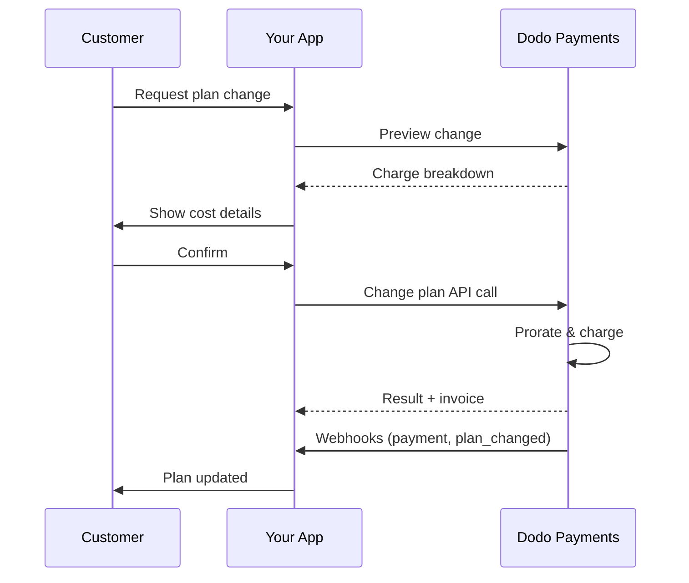
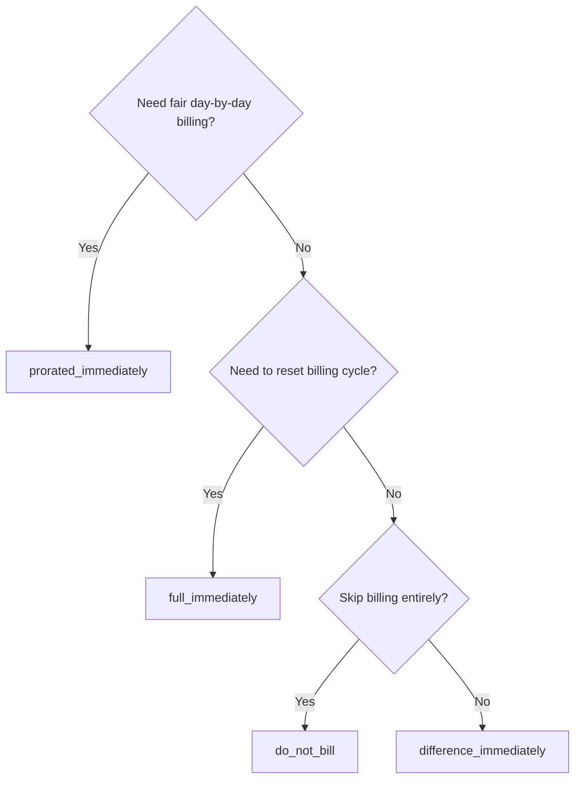
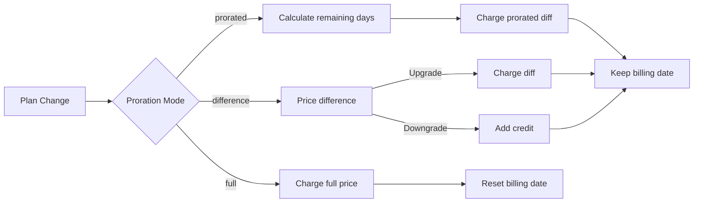

<CardGroup cols={3}>
<Card title="Change Plan API" icon="code" href="/api-reference/subscriptions/change-plan">
  Full API docs for updating subscriptions.
</Card>
<Card title="Plan Change Preview" icon="eye" href="/api-reference/subscriptions/preview-change-plan">
  See charge amounts before changing plans.
</Card>
<Card title="Integration Guide" icon="book" href="/developer-resources/subscription-integration-guide">
  Step-by-step subscription setup.
</Card>
</CardGroup>

## What is a subscription upgrade or downgrade?

Changing plans lets you move a customer between subscription tiers or quantities. Use it to:
- Align pricing with usage or features
- Move from monthly to annual (or vice versa)
- Adjust quantity for seat-based products

<Info>
Plan changes can trigger an immediate charge depending on the proration mode you choose.
</Info>

## When to use plan changes

- Upgrade when a customer needs more features, usage, or seats
- Downgrade when usage decreases
- Migrate users to a new product or price without cancelling their subscription

## Plan Change Flow



## Prerequisites

Before implementing subscription plan changes, ensure you have:

- A Dodo Payments merchant account with active subscription products
- API credentials (API key and webhook secret key) from the dashboard
- An existing active subscription to modify
- Webhook endpoint configured to handle subscription events

<Info>
For detailed setup instructions, see our [Integration Guide](/developer-resources/integration-guide#dashboard-setup).
</Info>

## Step-by-Step Implementation Guide

Follow this comprehensive guide to implement subscription plan changes in your application:

<Steps>
<Step title="Understand Plan Change Requirements">
Before implementing, determine:
- Which subscription products can be changed to which others
- What proration mode fits your business model
- How to handle failed plan changes gracefully
- Which webhook events to track for state management

<Tip>
Test plan changes thoroughly in test mode before implementing in production.
</Tip>
</Step>

<Step title="Choose Your Proration Strategy">
Select the billing approach that aligns with your business needs:

<Tabs>
<Tab title="prorated_immediately">
Best for: SaaS applications wanting to charge fairly for unused time
- Calculates exact prorated amount based on remaining cycle time
- Charges a prorated amount based on unused time remaining in the cycle
- Provides transparent billing to customers
</Tab>

<Tab title="difference_immediately">
Best for: Clear upgrade/downgrade scenarios
- Upgrade: Charge immediate difference (e.g., $30→$80 = charge $50)
- Downgrade: Credit remaining value for future renewals
- Simplifies billing logic and customer communication
</Tab>

<Tab title="full_immediately">
Best for: When you want to reset the billing cycle
- Charges full amount of new plan immediately
- Ignores remaining time from old plan
- Useful for annual to monthly transitions
</Tab>

<Tab title="do_not_bill">
Best for: Free migrations, courtesy switches, or absorbing cost differences
- No charges or credits calculated
- Customer moves to the new plan immediately without any billing adjustment
- Billing cycle remains unchanged
</Tab>
</Tabs>
</Step>

<Step title="Implement the Change Plan API">
Use the Change Plan API to modify subscription details:

<ParamField path="subscription_id" type="string" required>
The ID of the active subscription to modify.
</ParamField>

<ParamField path="product_id" type="string" required>
The new product ID to change the subscription to.
</ParamField>

<ParamField path="quantity" type="integer" default="1">
Number of units for the new plan (for seat-based products).
</ParamField>

<ParamField path="proration_billing_mode" type="string" required>
How to handle immediate billing: `prorated_immediately`, `full_immediately`, `difference_immediately`, or `do_not_bill`.
</ParamField>

<ParamField path="addons" type="array">
Optional addons for the new plan. Leaving this empty removes any existing addons.
</ParamField>

<ParamField path="on_payment_failure" type="string">
Controls behavior when the plan change payment fails:
- `prevent_change`: Keep subscription on current plan until payment succeeds
- `apply_change` (default): Apply plan change immediately regardless of payment outcome

If not specified, uses the business-level default setting.
</ParamField>

<ParamField path="discount_code" type="string">
新しいプランに適用するオプションの割引コードがあれば、それを検証してプラン変更に適用します。提供されていない場合で、サブスクリプションが`preserve_on_plan_change=true`と既存の割引を持っている場合、新しい製品に適用可能であれば既存の割引が保持されます。
</ParamField>

{/* LOCKED_PATTERN_0d738664f87342fd479b900ee4eff497 */}
プラン変更の適用時期:
- `immediately`（デフォルト）: プラン変更をすぐに適用
- `next_billing_date`: 次の請求日に変更をスケジュールします。顧客は請求期間が終了するまで現在のプランを保持します。

ダウングレードには`next_billing_date`を使用して、顧客が請求期間終了まで現在のプランの特典を保持するようにします。
</ParamField>
</Step>

<Step title="Handle Webhook Events">
ウェブフック処理を設定してプラン変更の結果を追跡します:

- `subscription.active`: プラン変更が成功し、サブスクリプションが更新されました
- `subscription.plan_changed`: サブスクリプションプランが変更された（アップグレード/ダウングレード/アドオン更新）
- `subscription.on_hold`: プラン変更の課金が失敗し、サブスクリプションが一時停止されました
- `payment.succeeded`: プラン変更の即時課金が成功しました
- `payment.failed`: 即時課金が失敗しました

<Warning>
ウェブフックの署名を常に確認し、冪等性の高いイベント処理を実装します。
</Warning>
</Step>

<Step title="Update Your Application State">
ウェブフックイベントに基づいてアプリケーションを更新する:
- 新しいプランに基づいて機能を付与/取り消し
- 顧客のダッシュボードを新しいプランの詳細で更新
- プラン変更について確認のメールを送信
- 監査目的で請求変更を記録
</Step>

<Step title="Test and Monitor">
実装を徹底的にテストします:
- さまざまなシナリオで全ての料金比例モードをテスト
- ウェブフック処理が正しく機能するかを検証
- プラン変更の成功率を監視
- 失敗したプラン変更について警告を設定

<Check>
サブスクリプションプラン変更の実装が本稼働用に準備が整いました。
</Check>
</Step>
</Steps>

## プラン変更のプレビュー

プラン変更の確認前に、Preview APIを使用して顧客に正確な請求額を表示します。

<Tabs>
<Tab title="Node.js SDK">

```javascript
const preview = await client.subscriptions.previewChangePlan('sub_123', {
  product_id: 'prod_pro',
  quantity: 1,
  proration_billing_mode: 'prorated_immediately'
});

// Show customer the charge before confirming
console.log('Immediate charge:', preview.immediate_charge.summary);
console.log('New plan details:', preview.new_plan);
```

</Tab>

<Tab title="Python SDK">

```python
preview = client.subscriptions.preview_change_plan(
    subscription_id="sub_123",
    product_id="prod_pro",
    quantity=1,
    proration_billing_mode="prorated_immediately"
)

# Show customer the charge before confirming
print("Immediate charge:", preview.immediate_charge.summary)
print("New plan details:", preview.new_plan)
```

</Tab>
</Tabs>

<Tip>
プレビューAPIを使って、顧客がプラン変更を確認する前に、正確な請求額を表示する確認ダイアログを作成します。
</Tip>

## プラン変更API

Change Plan APIを使用して、アクティブなサブスクリプションの製品、数量、および料金比例の動作を修正します。

### クイックスタートの例

<Tabs>
  <Tab title="Node.js SDK">

    ```javascript
    import DodoPayments from 'dodopayments';

    const client = new DodoPayments({
      bearerToken: process.env.DODO_PAYMENTS_API_KEY,
      environment: 'test_mode', // defaults to 'live_mode'
    });

    async function changePlan() {
      const result = await client.subscriptions.changePlan('sub_123', {
        product_id: 'prod_new',
        quantity: 3,
        proration_billing_mode: 'prorated_immediately',
        on_payment_failure: 'prevent_change', // Optional: control behavior on payment failure
      });
      console.log(result.status, result.invoice_id, result.payment_id);
    }

    changePlan();
    ```

  </Tab>
  <Tab title="Python SDK">

    ```python
    import os
    from dodopayments import DodoPayments

    client = DodoPayments(
        bearer_token=os.environ.get("DODO_PAYMENTS_API_KEY"),
        environment="test_mode",  # defaults to "live_mode"
    )

    result = client.subscriptions.change_plan(
        subscription_id="sub_123",
        product_id="prod_new",
        quantity=3,
        proration_billing_mode="prorated_immediately",
        on_payment_failure="prevent_change",  # Optional: control behavior on payment failure
    )
    print(result.status, result.get("invoice_id"), result.get("payment_id"))
    ```

  </Tab>
  <Tab title="Go SDK">

    ```go
    package main

    import (
      "context"
      "fmt"
      "github.com/dodopayments/dodopayments-go"
      "github.com/dodopayments/dodopayments-go/option"
    )

    func main() {
      client := dodopayments.NewClient(option.WithBearerToken("YOUR_TOKEN"))
      res, err := client.Subscriptions.ChangePlan(context.TODO(), dodopayments.SubscriptionChangePlanParams{
        SubscriptionID: dodopayments.F("sub_123"),
        ProductID:             dodopayments.F("prod_new"),
        Quantity:              dodopayments.F(int64(3)),
        ProrationBillingMode:  dodopayments.F(dodopayments.SubscriptionChangePlanParamsProrationBillingModeProratedImmediately),
        OnPaymentFailure:      dodopayments.F(dodopayments.OnPaymentFailurePreventChange), // Optional
      })
      if err != nil { panic(err) }
      fmt.Println(res.Status, res.InvoiceID, res.PaymentID)
    }
    ```

  </Tab>
  <Tab title="HTTP">

    ```bash
    curl -X POST "$DODO_API_BASE/subscriptions/sub_123/change-plan" \
      -H "Authorization: Bearer $DODO_PAYMENTS_API_KEY" \
      -H "Content-Type: application/json" \
      -d '{
        "product_id": "prod_new",
        "quantity": 3,
        "proration_billing_mode": "prorated_immediately",
        "on_payment_failure": "prevent_change"
      }'
    ```

  </Tab>
</Tabs>

```json Success
{
  "status": "processing",
  "subscription_id": "sub_123",
  "invoice_id": "inv_789",
  "payment_id": "pay_456",
  "proration_billing_mode": "prorated_immediately"
}
```

<Note>
<code>invoice_id</code> および <code>payment_id</code> などのフィールドは、プラン変更時に即時課金および/または請求書が作成された場合のみ返されます。結果を確認するために常にウェブフックイベント（例：<code>payment.succeeded</code>、<code>subscription.plan_changed</code>）に依存してください。
</Note>

<Warning>
即時課金が失敗した場合、サブスクリプションは支払いが成功するまで`subscription.on_hold`に移行する可能性があります。
</Warning>

## アドオンの管理

サブスクリプションプランを変更する際に、アドオンを変更することもできます:

```javascript
// Add addons to the new plan
await client.subscriptions.changePlan('sub_123', {
  product_id: 'prod_new',
  quantity: 1,
  proration_billing_mode: 'difference_immediately',
  addons: [
    { addon_id: 'addon_123', quantity: 2 }
  ]
});

// Remove all existing addons
await client.subscriptions.changePlan('sub_123', {
  product_id: 'prod_new',
  quantity: 1,
  proration_billing_mode: 'difference_immediately',
  addons: [] // Empty array removes all existing addons
});
```

<Info>
アドオンは料金比例計算に含まれており、選択した料金比例モードに従って課金されます。
</Info>

## 割引コードの適用

サブスクリプションプランの変更時に割引コードを適用できます。これはアップグレードや移行時にプロモーション価格を提供するのに役立ちます。

<Tabs>
<Tab title="Node.js SDK">

```javascript
// Apply a discount code during plan change
await client.subscriptions.changePlan('sub_123', {
  product_id: 'prod_pro',
  quantity: 1,
  proration_billing_mode: 'prorated_immediately',
  discount_code: 'UPGRADE20'
});
```

</Tab>
<Tab title="Python SDK">

```python
# Apply a discount code during plan change
client.subscriptions.change_plan(
    subscription_id="sub_123",
    product_id="prod_pro",
    quantity=1,
    proration_billing_mode="prorated_immediately",
    discount_code="UPGRADE20"
)
```

</Tab>
<Tab title="HTTP">

```bash
curl -X POST "$DODO_API_BASE/subscriptions/sub_123/change-plan" \
  -H "Authorization: Bearer $DODO_PAYMENTS_API_KEY" \
  -H "Content-Type: application/json" \
  -d '{
    "product_id": "prod_pro",
    "quantity": 1,
    "proration_billing_mode": "prorated_immediately",
    "discount_code": "UPGRADE20"
  }'
```

</Tab>
</Tabs>

### プラン変更における割引の動作

| シナリオ | 動作 |
|----------|----------|
| `discount_code` 提供済み | 割引を検証して新しいプランに適用します。 |
| コード未提供、既存の割引あり`preserve_on_plan_change=true` | 新しい製品に適用可能であれば、既存の割引が自動的に保持されます。 |
| コード未提供、保持可能な割引なし | 新しいプランに割引は適用されません。 |

<Tip>
[プラン変更のプレビューAPI](/api-reference/subscriptions/preview-change-plan) を`discount_code`と共に使用して、顧客がプラン変更を確認する前に正確な節約額を示します。
</Tip>

## 料金比例モード

プラン変更時に顧客に請求する方法を選択します:

#### `prorated_immediately`
- 現在のサイクルでの差額を計算し課金
- 試用中の場合は即座に課金し、新プランに切り替え
- ダウングレード: 将来の更新に適用される比例クレジットを生成する可能性があります

#### `full_immediately`
- 新プランの全額を即座に課金
- 旧プランからの残り時間を無視

<Info>
<code>difference_immediately</code> を使用したダウングレードによって作成されたクレジットはサブスクリプション範囲であり、<a href="/features/credit-based-billing">クレジットベースの課金</a> 利権とは異なります。それらは同じサブスクリプションの将来の更新に自動的に適用され、サブスクリプション間で転送できません。
</Info>

#### `difference_immediately`
- アップグレード: 旧プランと新プランの価格差を即座に課金
- ダウングレード: 残価を内部クレジットとしてサブスクリプションに追加し、更新時に自動適用

#### `do_not_bill`
- 課金やクレジットは計算されません
- 顧客は請求調整なしで即座に新プランに切り替わります
- 請求サイクルは変更されません
- 無料プランのスイッチや、コスト差の吸収に最適

| 機能 | `prorated_immediately` | `difference_immediately` | `full_immediately` | `do_not_bill` |
|---------|----------------------|------------------------|-------------------|--------------|
| **アップグレード課金** | 残り日数の比例差額 | 新旧プラン間の全額 | 新プランの全額 | 課金なし |
| **ダウングレードクレジット** | 残り日数の比例クレジット | クレジットとしての全額差 | クレジットなし | クレジットなし |
| **請求サイクル** | 変更なし | 変更なし | 今日にリセット | 変更なし |
| **試用動作** | 試用終了、即座に課金 | 試用終了、即座に課金 | 試用終了、全額課金 | 試用終了、課金なし |
| **最適** | 公平な時間ベースの課金 | 単純なアップグレード/ダウングレード数式 | 請求サイクルの再設定 | 無料移行、礼儀上の切り替え |
| **複雑さ** | 中程度（日数計算） | 低（単純な差し引き） | 低（全額課金） | 無し |



### シナリオの例

これらの標準数値を一貫して使用します:
- 現在のプラン: **ベーシック**で**月額$30**
- アップグレード目標: **プロ**で**月額$80**
- ダウングレード目標（プロから）: **スターター**で**月額$20**
- 請求サイクル: **30日間**、**1月1日**に開始
- プラン変更が**1月16日**に発生する（残日数15日、使用日数15日）

 <AccordionGroup>
  <Accordion title="Upgrade: Basic ($30) → Pro ($80) with prorated_immediately">

    ```
    Step 1: Calculate unused credit from current plan
      Unused days = 15 out of 30 days
      Credit = $30 × (15/30) = $15.00

    Step 2: Calculate prorated cost of new plan
      Remaining days = 15 out of 30 days
      New plan cost = $80 × (15/30) = $40.00

    Step 3: Calculate immediate charge
      Charge = New plan cost − Credit
      Charge = $40.00 − $15.00 = $25.00

    → Customer pays $25.00 now
    → Next renewal (Feb 1): $80.00/month
    ```

    ```javascript
    await client.subscriptions.changePlan('sub_123', {
      product_id: 'prod_pro',
      quantity: 1,
      proration_billing_mode: 'prorated_immediately'
    })
    ```

  </Accordion>

  <Accordion title="Downgrade: Pro ($80) → Starter ($20) with prorated_immediately">

    ```
    Step 1: Calculate unused credit from current plan
      Unused days = 15 out of 30 days
      Credit = $80 × (15/30) = $40.00

    Step 2: Calculate prorated cost of new plan
      Remaining days = 15 out of 30 days
      New plan cost = $20 × (15/30) = $10.00

    Step 3: Calculate credit balance
      Credit = $40.00 − $10.00 = $30.00

    → No charge — $30.00 credit added to subscription
    → Credit auto-applies to future renewals
    → Next renewal (Feb 1): $20.00 − $30.00 credit = $0.00
    → Following renewal (Mar 1): $20.00 − $10.00 remaining credit = $10.00
    ```

    ```javascript
    await client.subscriptions.changePlan('sub_123', {
      product_id: 'prod_starter',
      quantity: 1,
      proration_billing_mode: 'prorated_immediately'
    })
    ```

  </Accordion>

  <Accordion title="Upgrade: Basic ($30) → Pro ($80) with difference_immediately">

    ```
    Immediate charge = New plan price − Old plan price
                     = $80 − $30
                     = $50.00

    → Customer pays $50.00 now (regardless of cycle position)
    → Next renewal (Feb 1): $80.00/month
    ```

    ```javascript
    await client.subscriptions.changePlan('sub_123', {
      product_id: 'prod_pro',
      quantity: 1,
      proration_billing_mode: 'difference_immediately'
    })
    ```

  </Accordion>

  <Accordion title="Downgrade: Pro ($80) → Starter ($20) with difference_immediately">

    ```
    Credit = Old plan price − New plan price
           = $80 − $20
           = $60.00

    → No charge — $60.00 credit added to subscription
    → Credit auto-applies to future renewals
    → Next renewal: $20.00 − $20.00 (from credit) = $0.00
    → Following renewal: $20.00 − $20.00 (from credit) = $0.00
    → Third renewal: $20.00 − $20.00 (from remaining credit) = $0.00
    ```

    ```javascript
    await client.subscriptions.changePlan('sub_123', {
      product_id: 'prod_starter',
      quantity: 1,
      proration_billing_mode: 'difference_immediately'
    })
    ```

  </Accordion>

  <Accordion title="Upgrade: Basic ($30) → Pro ($80) with full_immediately">

    ```
    Immediate charge = Full new plan price = $80.00

    → Customer pays $80.00 now
    → No credit for unused time on old plan
    → Billing cycle resets to today (January 16)
    → Next renewal: February 16 at $80.00/month
    ```

    ```javascript
    await client.subscriptions.changePlan('sub_123', {
      product_id: 'prod_pro',
      quantity: 1,
      proration_billing_mode: 'full_immediately'
    })
    ```

  </Accordion>

  <Accordion title="Mid-cycle upgrade with add-ons using prorated_immediately">

    ```
    Current: Basic plan ($30/month), no add-ons
    New: Pro plan ($80/month) + Extra Seats add-on ($10/seat × 3 seats = $30/month)
    Change on day 16 of 30 (15 days remaining)

    Step 1: Credit from current plan
      Credit = $30 × (15/30) = $15.00

    Step 2: Prorated cost of new plan + add-ons
      New plan = $80 × (15/30) = $40.00
      Add-ons = $30 × (15/30) = $15.00
      Total new = $55.00

    Step 3: Immediate charge
      Charge = $55.00 − $15.00 = $40.00

    → Customer pays $40.00 now
    → Next renewal: $80.00 + $30.00 = $110.00/month
    ```

    ```javascript
    await client.subscriptions.changePlan('sub_123', {
      product_id: 'prod_pro',
      quantity: 1,
      proration_billing_mode: 'prorated_immediately',
      addons: [
        { addon_id: 'addon_seats', quantity: 3 }
      ]
    })
    ```

  </Accordion>
</AccordionGroup>

### 各モードが請求を処理する方法



<Tip>
公平な時間会計には`prorated_immediately`を選択してください。請求を再開するには`full_immediately`を選択します。アップグレードやダウングレードの自動クレジットには`difference_immediately`を使用し、請求調整なしでプランを切り替えるには`do_not_bill`を使用します。
</Tip>

## 支払い失敗時の処理

プラン変更支払いが失敗した際の処理を`on_payment_failure`パラメータを使用して制御します。

### 支払い失敗モード

 <Tabs>
<Tab title="prevent_change (Recommended for critical upgrades)">
**動作**: 支払いが成功するまでサブスクリプションを現在のプランに維持します。

- プラン変更が"保留中"としてマークされる
- 顧客は現在のプランのアクセスを保持する
- 支払いが成功した後のみサブスクリプションは`active`状態に移行する
- アップグレード機能を提供する前に支払いを確保したい場合に有用

```javascript
await client.subscriptions.changePlan('sub_123', {
  product_id: 'prod_pro',
  quantity: 1,
  proration_billing_mode: 'prorated_immediately',
  on_payment_failure: 'prevent_change'
});
```

 </Tab>

 <Tab title="apply_change (Default)">
**動作**: 支払い結果に関係なくすぐにプラン変更を適用します。

- 支払いが失敗してもプラン変更が適用される
- 顧客はすぐに新プランにアクセスできる
- 支払いが失敗した場合、サブスクリプションは`on_hold`に移行する可能性がある
- 重要でないアップグレードや顧客を信頼する場合に良い

```javascript
await client.subscriptions.changePlan('sub_123', {
  product_id: 'prod_pro',
  quantity: 1,
  proration_billing_mode: 'prorated_immediately',
  on_payment_failure: 'apply_change' // This is the default
});
```

 </Tab>
</Tabs>

 <Info>
指定されていない場合、`on_payment_failure`パラメータは、ダッシュボードに設定されたビジネスレベルのデフォルト設定を使用します。
</Info>

### 各モードの使用タイミング

| シナリオ | 推奨モード | 理由 |
|----------|------------------|--------|
| プレミアム機能へのアップグレード | `prevent_change` | アクセスを許可する前に支払いを確保する |
| 数量増加（座席追加） | `prevent_change` | 支払いなしに利用を防ぐ |
| プランのダウングレード | `apply_change` | 顧客が支出を削減している |
| 信頼できる企業顧客 | `apply_change` | 不払いのリスクが低い |
| 試用から有料への変換 | `prevent_change` | 重要な支払いの瞬間 |

## ウェブフックの処理

プラン変更と支払いを確認するためにウェブフックを通じてサブスクリプションの状態を追跡します。

### 処理するイベントタイプ
- `subscription.active`: サブスクリプションがアクティブになる
- `subscription.plan_changed`: サブスクリプションプランが変更された（アップグレード/ダウングレード/アドオン変更）
- `subscription.on_hold`: 課金が失敗し、サブスクリプションが一時停止される
- `subscription.renewed`: 更新が成功する
- `payment.succeeded`: プラン変更または更新の支払いが成功する
- `payment.failed`: 支払いが失敗する

 <Info>
サブスクリプションイベントからビジネスロジックを駆動し、支払いイベントを確認および調整に使用することをお勧めします。
</Info>

### 署名の確認とインテントの処理

 <Tabs>
  <Tab title="Next.js Route Handler">

    ```javascript
    import { NextRequest, NextResponse } from 'next/server';
    
    export async function POST(req) {
      const webhookId = req.headers.get('webhook-id');
      const webhookSignature = req.headers.get('webhook-signature');
      const webhookTimestamp = req.headers.get('webhook-timestamp');
      const secret = process.env.DODO_WEBHOOK_SECRET;
    
      const payload = await req.text();
      // verifySignature is a placeholder – in production, use a Standard Webhooks library
      const { valid, event } = await verifySignature(
        payload,
        { id: webhookId, signature: webhookSignature, timestamp: webhookTimestamp },
        secret
      );
      if (!valid) return NextResponse.json({ error: 'Invalid signature' }, { status: 400 });
    
      switch (event.type) {
        case 'subscription.active':
          // mark subscription active in your DB
          break;
        case 'subscription.plan_changed':
          // refresh entitlements and reflect the new plan in your UI
          break;
        case 'subscription.on_hold':
          // notify user to update payment method
          break;
        case 'subscription.renewed':
          // extend access window
          break;
        case 'payment.succeeded':
          // reconcile payment for plan change
          break;
        case 'payment.failed':
          // log and alert
          break;
        default:
          // ignore unknown events
          break;
      }
    
      return NextResponse.json({ received: true });
    }
    ```

  </Tab>
  <Tab title="Express.js">

    ```javascript
    import express from 'express';
    
    const app = express();
    app.post('/webhooks/dodo', express.raw({ type: 'application/json' }), async (req, res) => {
      const webhookId = req.header('webhook-id');
      const webhookSignature = req.header('webhook-signature');
      const webhookTimestamp = req.header('webhook-timestamp');
      const secret = process.env.DODO_WEBHOOK_SECRET;
      const payload = req.body.toString('utf8');
    
      const { valid, event } = await verifySignature(
        payload,
        { id: webhookId, signature: webhookSignature, timestamp: webhookTimestamp },
        secret
      );
      if (!valid) return res.status(400).send('Invalid signature');
    
      // handle events like above
      res.json({ received: true });
    });
    
    app.listen(3000);
    ```

  </Tab>
</Tabs>

 <Note>
詳細なペイロードスキーマについては、<a href="/developer-resources/webhooks/intents/subscription">サブスクリプションウェブフックペイロード</a> と <a href="/developer-resources/webhooks/intents/payment">支払いウェブフックペイロード</a> を参照してください。
</Note>

## ベストプラクティス

信頼性のあるサブスクリプションプランの変更のために、以下の推奨事項に従ってください:

### プラン変更戦略
- **徹底的にテストする**: 本稼働前に常にテストモードでプラン変更をテスト
- **慎重に料金比例を選択する**: ビジネスモデルに合った料金比例モードを選択
- **失敗を優雅に処理する**: 適切なエラーハンドリングと再試行ロジックを実装
- **成功率を監視する**: プラン変更の成功/失敗率を追跡し、問題を調査

### ウェブフックの実装
- **署名を確認する**: 署名を常に確認してウェブフックの信憑性を確保
- **冪等性を実装する**: 重複するウェブフックイベントを優雅に処理
- **非同期で処理する**: ウェブフックの応答を重い処理でブロッキングしない
- **すべてを記録する**: デバッグと監査のために詳細なログを維持

### ユーザーエクスペリエンス
- **明確に伝える**: 顧客に請求変更とタイミングを通知
- **確認を提供する**: プラン変更の成功に関する確認メールを送信
- **エッジケースを処理する**: 試用期間、料金比例、支払い失敗を考慮
- **UIを即座に更新する**: アプリケーションインタフェースにプラン変更を反映

## 共通の問題と解決策

サブスクリプションプラン変更中に遭遇する一般的な問題を解決します:

 <AccordionGroup>
<Accordion title="Charge created but subscription not updated">
**症状**: API呼び出しは成功するが、サブスクリプションが古いプランのまま

**一般的な原因**:
- ウェブフック処理が失敗または遅延している
- ウェブフック受信後にアプリケーション状態が更新されていない
- 状態更新中のデータベーストランザクションの問題

**解決策**:
- 再試行ロジックを用いた頑強なウェブフック処理を実装
- 状態更新のために冪等な操作を使用
- 見逃したウェブフックイベントを検出して警告するための監視を追加
- ウェブフックエンドポイントがアクセス可能で正しく応答していることを確認
</Accordion>

 <Accordion title="Credits not applied after downgrade">
**症状**: 顧客がダウングレードしたがクレジット残高が表示されない

**一般的な原因**:
- 料金比例モードの期待: ダウングレードは、`difference_immediately`でプランの全価格差をクレジットするが、`prorated_immediately`はサイクルの残り時間に基づいて比例クレジットを作成します
- クレジットはサブスクリプション毎であり、サブスクリプション間で転送されない
- クレジット残高が顧客ダッシュボードに表示されていない

**解決策**:
- ダウングレード時に自動クレジットを希望する場合は`difference_immediately`を使用
- クレジットは同じサブスクリプションの将来の更新に適用されることを顧客に説明
- クレジット残高を表示する顧客ポータルを実装
- 適用されたクレジットを確認するには、次の請求書プレビューをチェック
</Accordion>

 <Accordion title="Webhook signature verification fails">
**症状**: ウェブフックイベントが無効な署名で拒否される

**一般的な原因**:
- 不正確なウェブフックシークレットキー
- 署名検証前に修正された生リクエストボディ
- 誤った署名検証アルゴリズム

**解決策**:
- ダッシュボードから正しい`DODO_WEBHOOK_SECRET`を使用していることを確認
- JSON解析ミドルウェアの前に生リクエストボディを参照する
- プラットフォーム用の標準ウェブフック検証ライブラリを使用
- 開発環境でウェブフック署名の検証をテスト
</Accordion>

 <Accordion title="Plan change fails with 422 error">
**症状**: APIが422 Unprocessable Entityエラーを返す

**一般的な原因**:
- 無効なサブスクリプションIDまたは製品ID
- サブスクリプションがアクティブ状態にない
- 必要なパラメーターの欠如
- プラン変更のための製品の利用不可

**解決策**:
- サブスクリプションが存在しアクティブであることを確認
- 製品IDが有効で利用可能であることを確認
- 必要なすべてのパラメーターが提供されていることを確認
- パラメーター要件についてAPIドキュメントを参照
</Accordion>

 <Accordion title="Immediate charge fails during plan change">
**症状**: プラン変更が開始されるが、即時課金が失敗する

**一般的な原因**:
- 顧客の支払い方法に資金不足
- 支払い方法が期限切れまたは無効
- 銀行が取引を拒否
- 詐欺検出が課金をブロック

**解決策**:
- `payment.failed`ウェブフックイベントを適切に処理
- 顧客に支払い方法の更新を通知
- 一時的な失敗のために再試行ロジックを実装
- 即時課金失敗でもプラン変更を許可することを検討
</Accordion>

 <Accordion title="Subscription on hold after plan change">
**症状**: プラン変更の課金が失敗し、サブスクリプションが`on_hold`状態に移行する

**何が起こるか**:
プラン変更の課金に失敗すると、サブスクリプションは自動的に`on_hold`状態になります。支払い方法が更新されるまでサブスクリプションは自動更新されません。

**解決策**: 支払い方法を更新してサブスクリプションを再有効化

プラン変更が失敗した後、`on_hold`状態からサブスクリプションを再活性化するには:

1. 支払い方法の更新を行う：Update Payment Method APIを使用
2. 自動課金の作成: APIは自動的に残りの債務の課金を作成
3. インボイスの生成: 課金のためのインボイスが生成されます
4. 支払いの処理: 新しい支払い方法を使用して支払いが処理されます
5. 再活性化: 支払いが成功すると、サブスクリプションは`active`状態に再活性化されます

 <CodeGroup>

```javascript Node.js
// Reactivate subscription from on_hold after failed plan change
async function reactivateAfterFailedPlanChange(subscriptionId) {
  // Update payment method - automatically creates charge for remaining dues
  const response = await client.subscriptions.updatePaymentMethod(subscriptionId, {
    type: 'new',
    return_url: 'https://example.com/return'
  });
  
  if (response.payment_id) {
    console.log('Charge created for remaining dues:', response.payment_id);
    console.log('Payment link:', response.payment_link);
    
    // Redirect customer to payment_link to complete payment
    // Monitor webhooks for:
    // 1. payment.succeeded - charge succeeded
    // 2. subscription.active - subscription reactivated
  }
  
  return response;
}

// Or use existing payment method if available
async function reactivateWithExistingPaymentMethod(subscriptionId, paymentMethodId) {
  const response = await client.subscriptions.updatePaymentMethod(subscriptionId, {
    type: 'existing',
    payment_method_id: paymentMethodId
  });
  
  // Monitor webhooks for payment.succeeded and subscription.active
  return response;
}
```

```python Python
# Reactivate subscription from on_hold after failed plan change
def reactivate_after_failed_plan_change(subscription_id):
    # Update payment method - automatically creates charge for remaining dues
    response = client.subscriptions.update_payment_method(
        subscription_id=subscription_id,
        type="new",
        return_url="https://example.com/return"
    )
    
    if response.payment_id:
        print("Charge created for remaining dues:", response.payment_id)
        print("Payment link:", response.payment_link)
        
        # Redirect customer to payment_link to complete payment
        # Monitor webhooks for:
        # 1. payment.succeeded - charge succeeded
        # 2. subscription.active - subscription reactivated
    
    return response

# Or use existing payment method if available
def reactivate_with_existing_payment_method(subscription_id, payment_method_id):
    response = client.subscriptions.update_payment_method(
        subscription_id=subscription_id,
        type="existing",
        payment_method_id=payment_method_id
    )
    
    # Monitor webhooks for payment.succeeded and subscription.active
    return response
```

 </CodeGroup>

**監視するウェブフックイベント**:
- `subscription.on_hold`: プラン変更の課金失敗時にサブスクリプションが保留になる
- `payment.succeeded`: 支払い方法の更新後、残りの債務の支払いが成功
- `subscription.active`: 支払いが成功した後、サブスクリプションが再活性化

**ベストプラクティス**:
- プラン変更の課金が失敗したときに顧客に即時に通知
- 支払い方法を更新する方法について明確な指示を提供
- 再活性化の状態を追跡するためにウェブフックイベントを監視
- 一時的な支払い失敗のために自動再試行ロジックを実装を検討

 <Card title="Update Payment Method API Reference" icon="code" href="/api-reference/subscriptions/update-payment-method">
支払い方法の更新とサブスクリプションの再活性化に関するAPIの完全なドキュメントを参照してください。
</Card>
</Accordion>
</AccordionGroup>

## 実装のテスト

サブスクリプションプラン変更の実装を徹底的にテストするために次の手順に従います:

 <Steps>
<Step title="Set up test environment">
- テストAPIキーとテスト製品を使用
- 異なるプランタイプでテストサブスクリプションを作成
- テスト用ウェブフックエンドポイントを設定
- 監視とログ記録を設定
</Step>

 <Step title="Test different proration modes">
- 様々な請求サイクルのポジションで`prorated_immediately`をテスト
- アップグレードとダウングレードを対象に`difference_immediately`をテスト
- 請求サイクルをリセットするために`full_immediately`をテスト
- 無料プランの切り替えために`do_not_bill`をテスト
- クレジット計算が正しいことを確認
</Step>

 <Step title="Test webhook handling">
- すべての関連するウェブフックイベントが受信されていることを確認
- ウェブフックの署名確認をテスト
- 重複するウェブフックイベントを優雅に処理
- ウェブフック処理失敗シナリオをテスト
</Step>

 <Step title="Test error scenarios">
- 無効なサブスクリプションIDでテスト
- 期限切れの支払い方法でテスト
- ネットワーク障害とタイムアウトをテスト
- 資金不足でテスト
</Step>

 <Step title="Monitor in production">
- 失敗したプラン変更についてアラートを設定
- ウェブフック処理時間を監視
- プラン変更の成功率を追跡
- プラン変更に関するカスタマーサポートチケットをレビュー
</Step>
</Steps>

## エラーハンドリング

実装内で一般的なAPIエラーを優雅に処理する:

### HTTPステータスコード

 <AccordionGroup>
<Accordion title="200 OK">
プラン変更要求が正常に処理されました。サブスクリプションは更新され、支払い処理が開始されました。
</Accordion>

 <Accordion title="400 Bad Request">
無効なリクエストパラメーター。すべての必要なフィールドが正しく提供されていることを確認してください。
</Accordion>

 <Accordion title="401 Unauthorized">
無効または欠落したAPIキー。あなたの`DODO_PAYMENTS_API_KEY`が正しいことと適切な権限を持っていることを確認してください。
</Accordion>

 <Accordion title="404 Not Found">
サブスクリプションIDが見つからないか、あなたのアカウントに属していません。
</Accordion>

 <Accordion title="422 Unprocessable Entity">
サブスクリプションは変更できません（例：既にキャンセルされた、製品が利用できない、など）。
</Accordion>

 <Accordion title="500 Internal Server Error">
サーバーエラーが発生しました。短い遅延の後にリクエストを再試行してください。
</Accordion>
</AccordionGroup>

### エラーレスポンス形式

```json
{
  "error": {
    "code": "subscription_not_found",
    "message": "The subscription with ID 'sub_123' was not found",
    "details": {
      "subscription_id": "sub_123"
    }
  }
}
```

## 次のステップ

- <a href="/api-reference/subscriptions/change-plan">プラン変更API</a>を確認
- <a href="/features/credit-based-billing">クレジットベースの課金</a>を探る
- `subscription.on_hold`のアラートを実装
- <a href="/developer-resources/webhooks">Webhook Integration Guide</a>を参照
