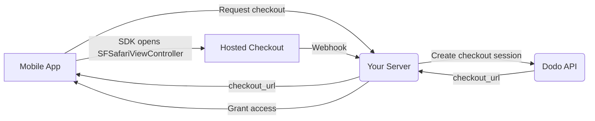

## はじめに

Dodo Paymentsは、開発者がiOSアプリでデジタル商品やサービスを販売できるようにし、税務コンプライアンス、通貨換算、支払いなどの複雑な側面を処理します。この包括的なガイドでは、SaaSツール、コンテンツサブスクリプション、デジタルユーティリティ向けにDodo PaymentsをiOSアプリに統合する方法を詳しく説明します。

## 概要

Dodo Paymentsは、あなたの**記録商人 (MoR)**として機能し、デジタルビジネスの重要な側面を管理します：

<Tabs>
<Tab title="What We Handle">
- 税金の徴収と送金（VAT、GST、その他の地域税）
- ポリシーおよび現地の支払い方法に準拠したグローバル支払い
- 通貨換算と外国為替
- チャージバックと不正防止
- エンドカスタマー向け請求および領収書
- 地域の規制遵守
</Tab>

<Tab title="What You Get">
- Webおよびモバイルプラットフォーム向けの統合API
- アプリ内チェックアウトのサポート（UPI、カード、ウォレット、BNPL）
- グローバル支払い対応（Payoneer、Wise、現地銀行振込）
- 分析およびレポートダッシュボード
- 安全な決済処理
</Tab>
</Tabs>

## ユースケース

<CardGroup cols={2}>
<Card title="Subscriptions" icon="repeat">
- プレミアムコンテンツまたは機能アクセス
- 柔軟なオプションの定期課金、無料トライアル、比例配分、アップグレードおよびダウングレード
</Card>

<Card title="Courses and Learning" icon="graduation-cap">
- コースごとのアクセス課金
- バンドルコンテンツパッケージ
- 永続または更新可能なライセンス
- 進捗追跡の統合
</Card>

<Card title="Digital Downloads" icon="download">
- 一度限りの購入（PDF、音楽、ツール）
- デジタル資産の配信
- ライセンスキー管理
</Card>

<Card title="SaaS Tools" icon="screwdriver-wrench">
- SaaSサブスクリプション
- 使用量に基づく課金
- チームおよびエンタープライズプラン
</Card>
</CardGroup>

## 統合フロー

アプリは Dodo のホスト型 checkout を
[iOS checkout SDK](/developer-resources/sdks/ios) で開き、
`SFSafariViewController` に表示して、型付きの結果を返します。

<Warning>
checkout を `WebView` に埋め込むのではなく、SDK を使用してください。Apple Pay は実際のブラウザーサーフェスでのみ
利用できるため、`WebView` ではウォレットによる
コンバージョンが気付かないうちに失われます。また、`WebView` 内の payment フローは、App
Store review で却下される一般的な原因です。
</Warning>

### Integration Steps

<Steps>
<Step title="Mobile App to Your Server">
アプリは、自身の backend に対して checkout URL を要求します。この要求は、
サインイン済みユーザーの session token で認証されます。
</Step>

<Step title="Your Server to Dodo API">
backend で [checkout session](/developer-resources/checkout-session) を
API key で作成し、`checkout_url` をアプリに返します。

<Warning>
checkout session は必ずサーバー上で作成し、アプリ内では作成しないでください。アプリの binary 内に含めて配布された API key は、bundle から抽出される可能性があります。
</Warning>
</Step>

<Step title="Mobile App Opens Checkout">
`checkout_url` を `DodoCheckout.start(...)` に渡します。SDK はそれを
`SFSafariViewController` に表示し、customer が checkout を
完了または閉じた時点で、型付きの結果を返します。
</Step>

<Step title="Dodo Payments to Your Server">
payment が成功したとき、または subscription が有効化されたとき、Dodo Payments は webhook endpoint を呼び出します。
</Step>

<Step title="Your Server Grants Access">
購入されたコンテンツのロック解除は、アプリが受け取った結果ではなく、その webhook を基に行ってください。SDK の結果は UI のヒントであり、payment の証明ではありません。
</Step>
</Steps>

<CardGroup cols={2}>
<Card title="iOS Checkout SDK" icon="apple" href="/developer-resources/sdks/ios">
  Swift 用のインストール手順と、完全な `start(...)` contract。
</Card>
<Card title="Mobile Integration Guide" icon="mobile" href="/developer-resources/mobile-integration">
  エンドツーエンドのフローと、Android、React Native、Flutter 向けの同じ contract。
</Card>
</CardGroup>

## Regional Availability

Dodo Payments は、Apple が外部 payment を明示的に許可している App Store の region、または規制当局や裁判所命令によって義務付けられている App Store の region でのみ、代替 in-app purchase フローを利用できるようにします。

### Supported Regions

<AccordionGroup>
<Accordion title="United States">
現在の裁判所命令および Apple の更新されたガイドラインで許可される範囲においてサポートされます。

- 特定の裁判所命令による規定の下で利用可能
- Apple が法的要件を遵守することが条件
- Apple の実装ガイドラインに従う必要があります
</Accordion>

<Accordion title="European Union (EU) App Store">
Apple の EU Alternative Terms および External Purchase Entitlement を通じてサポートされます。

- Apple の EU Alternative Terms を通じて有効化
- External Purchase Entitlement の承認が必要
- EU Digital Markets Act の要件を遵守する必要があります
</Accordion>

<Accordion title="South Korea">
韓国向けバイナリ限定で、StoreKit External Purchase Entitlement を通じてサポートされます。

- StoreKit External Purchase Entitlement により利用可能
- 韓国向けの app binary が必要
- 韓国の電気通信法を遵守する必要があります
</Accordion>
</AccordionGroup>

<Warning>
いずれの storefront で Dodo Payments を有効化する場合も、事前に Apple の region 固有の entitlements と App Store Connect の要件を必ず確認し、遵守してください。サポート対象外の region で代替 payment フローを使用すると、アプリが却下または削除される可能性があります。
</Warning>

<Note>
サービスや特定のコンテンツカテゴリなど、一部のビジネスモデルでは、Apple が in-app purchase (IAP) の使用をまったく要求しない場合があります。Dodo Payments はこれらのモデルもサポートしています。ご利用のケースで IAP が必須かどうかを判断するため、アプリの分類と Apple の最新ガイドラインを必ず確認してください。
</Note>

### Learn More

global policy、法的先例、App Store fee を回避するための戦略的アプローチについて詳しくは、包括的なガイドをご覧ください。

<Card title="Bypassing App Store & Play Store Fees: A Strategic and Legal Playbook" icon="shield-check" href="/features/bypassing-app-store-fees">
最新の region ガイダンスと compliance のヒントを確認しながら、代替 payment フローを合法的に実装できる場所と方法を学べます。
</Card>