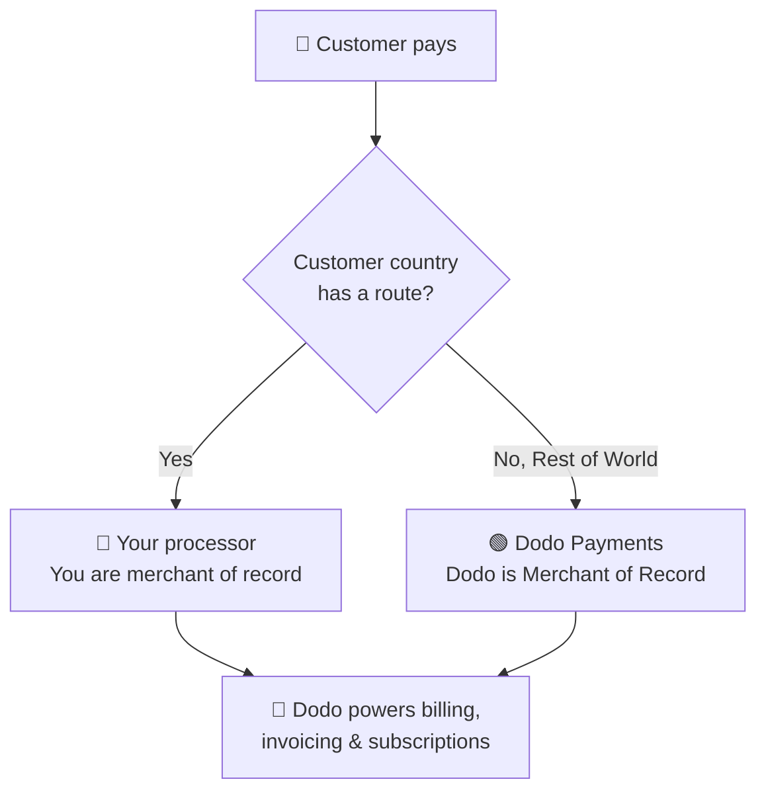

**Bring Your Own Processor (BYOP)** は、現在 **Stripe** または **Adyen** を自身の決済プロセッサとして使用し、取引に関連するすべてのもの（商品、サブスクリプション、ライセンスキーと適格性エンジン、請求書、カスタマーポータル、分析）にDodo Paymentsを利用することを可能にします。さらに多くのプロセッサのサポートが近日中に追加される予定です。

顧客の国ごとに、支払いを **あなたのプロセッサ**（そのルートの販売者記録として維持されます）またはフルサービスの販売者記録としての **Dodo Payments** で処理するかを決定します。明示的にルーティングしていない国は、自動的にDodoにフォールバックされます。

<CardGroup cols={2}>
<Card title="Route by geography" icon="globe">
特定の国の支払いを独自のプロセッサに送信し、その他すべてをDodoに送信します。
</Card>

<Card title="Keep your processor accounts" icon="plug">
既存のStripeまたはAdyenアカウントと関係を引き続き使用します。
</Card>

<Card title="Stay the merchant of record" icon="building">
独自のルートでは、法的な販売者であり、税金、紛争、支払いを管理します。
</Card>

<Card title="One billing layer" icon="layer-group">
Dodoはどちらのルートでも商品、サブスクリプション、請求書、分析を提供します。
</Card>
</CardGroup>

## BYOPとDodoの販売者記録としての違い

BYOPを有効にすると、各支払いの処理方法を選択できます。この2つのモデルは並行して動作し、顧客の国でルーティングされます。

| 機能 | Dodoの販売者記録として | 独自のプロセッサ |
|---------|----------------------------|--------------------------|
| 法的販売者の記録 | Dodo Payments | あなたの会社 |
| 税金（VAT、GST、販売税） | あなたのために計算、収集、納付 | あなたが登録、収集、申告 |
| チャージバックと詐欺 | 責任と保護はDodoが処理 | プロセッサ独自のツールで管理 |
| PCI準拠 | Dodoが処理 | あなたが管理 |
| 支払い方法 | 30以上のグローバルおよびローカル、多通貨 | カードのみ（クレジット/デビット） |
| 支払い | 集約されたグローバル支払い | 直接プロセッサから |
| 設定 | 簡単、数分でライブ | 中程度、キーとルーティング追加 |
| 最適な用途 | 世界中の販売、コンプライアンスの手間なし | 既存のプロセッサと地域コントロール |

<Tip>
一般的なセットアップは**ハイブリッド**です：すでに登録済みのエンティティとプロセッサがある国（例：ホームマーケット）を独自のプロセッサにルーティングし、Dodoがその他の世界を販売者記録として扱います。
</Tip>

## サポートされているプロセッサ

現在、**Stripe** または **Adyen** を接続できます。さらに多くのプロセッサへのサポートが進行中です。

<CardGroup cols={2}>
<Card title="Stripe" icon="stripe" />
<Card title="Adyen" icon="/images/logos/adyen.svg" />
</CardGroup>

<Note>
現在、独自のプロセッサを通じてルーティングされた支払いは**クレジットおよびデビットカードのみ**をサポートしています。今後、さらに多くの支払い方法を追加します。
</Note>

<Warning>
**Stripe** および **Adyen** の両方で、Dodoがプロセッサの上で請求をサポートするためにアカウントで**生のカードAPIアクセス**が有効になっている必要があります。各プロセッサは、要求に従ってこれを付与します。接続する前にプロセッサのサポートに連絡してこれを手配してください。詳細は[Stripe](/features/byop/stripe)と[Adyen](/features/byop/adyen)のガイドを参照してください。
</Warning>

<Info>
接続は**環境ごと**に設定されます。**テストモード**（Sandbox）で接続したプロセッサは**ライブモード**（Production）のものとは別です。ライブになる前にテストしたい場合は、両方をセットアップしてください。セットアップウィザードはダッシュボードのグローバルテスト/ライブ切り替えに従います。
</Info>

## BYOPの設定

ダッシュボードで **設定 → BYOP** を開き、*Bring Your Own Processor* カードで **設定** を選択してセットアップウィザードを起動します。

<Frame>

</Frame>

<Steps>
<Step title="Choose a payment processor">
接続したいプロセッサ、**Stripe** または **Adyen** を選択して続行します。

<Frame>

</Frame>
</Step>

<Step title="Connect your account">
接続に**プロバイダ名**を付けます（例：*Stripe US* と *Stripe UK* のように同じプロセッサの複数のアカウントがある場合に便利です）。次にプロセッサの**シークレットキー**（Stripeの場合、`sk_...`キー）を入力します。

**Adyen** には、さらに **Merchant Account** 識別子も入力してください。

<Frame>

</Frame>

保存すると接続が作成され、その接続に固有の**Webhookエンドポイント**が生成されます。そのURLをプロセッサのダッシュボードにWebhookの宛先として追加し、**Webhookサインシークレット**をDodoに戻して完了します：

- **Stripe**: 追加したWebhookエンドポイントからサインシークレットを貼り付けます。
- **Adyen**: *Customer Area → Webhooks* から**HMACキー**を貼り付けます。

<Note>
シークレットキーは安全に保存され、保存後に表示または変更することはできません。Dodo生成のWebhook URLをプロセッサに設定するだけであり、基盤となるインフラには直接関与しません。
</Note>

<Tip>
保存後に**接続を確認する**を使用して、プロセッサに対するテスト呼び出しを実行し、キーとWebhookシークレットが有効であることを確認します。
</Tip>
</Step>

<Step title="Configure payment routing">
顧客の国をプロセッサにマッピングする**ルーティングルール**を追加します。各国は正確に1つのプロセッサにルーティングできます。

- あなたのプロセッサは割り当てられた国からの支払いを処理します。
- **Dodo Payments** は **Rest of the World**（明示的にルーティングしていないすべての国）を販売者記録として処理します。

<Frame>

</Frame>

**ルート追加**を使用して、1つ以上の国をプロセッサに割り当てます。

<Frame>

</Frame>

<Info>
**ルーティングガイドライン**
- 「Rest of World」は上記にリストされていないすべての国をカバーします。
- Dodo Payments MoRルートは、コンプライアンスと税金を自動的に処理します。
- 独自のプロセッサルートは、必要に応じて別個の税金設定が必要です。
</Info>
</Step>

<Step title="Configure invoice information">
独自のプロセッサを介してルーティングされた支払いの場合、**あなた**が請求書上の販売者となります。これらの請求書に表示されるビジネス詳細を入力します：

- **登記済みビジネス名**（必須）
- **税ID**（EIN、SSNなど。任意で、米国EINの形式検証可能）
- **ステートメント記述**（必須）：銀行明細に表示される名称（5〜22文字）
- **登記済みビジネス住所**（必須）：入力を始めて検索し、住所を自動入力します。
- **プライバシーポリシー**および**利用規約**リンク（必須）

ライブ**請求書ヘッダープレビュー**は詳細がどのように表示されるかを示します。これらの詳細は、独自のプロセッサを介して処理するルートに対する請求書に**のみ**適用されます。Dodo経由の支払いはDodoの販売者記録の詳細を引き続き使用します。

<Frame>

</Frame>
</Step>

<Step title="Review and finish">
プロセッサ接続、ルーティングルール、請求書の詳細を確認します。ルーティングと請求の詳細が正しいことを確認して、**セットアップを完了**を選択します。

<Frame>

</Frame>
</Step>
</Steps>

構成が完了すると、BYOPカードには**構成の編集**が表示され、いつでもMoR専用に戻すことができます。」 ルーティングルールの編集**。

<Frame>

</Frame>

## ルーティングの仕組み

ルーティングは支払い時の**顧客の国**によって決定されます。同じロジックが一回限りの支払い、チェックアウトセッション、およびサブスクリプション登録に適用されます。更新時には、サブスクリプションが作成されたプロセッサを使用して再度請求されます（詳細は[サブスクリプション](#subscriptions)をご覧ください）。

**独自のプロセッサ**で処理されるルートでは：

- 支払いは**あなた**のプロセッサアカウントで支払い通貨で処理されます。
- Dodoによって**税金は計算または収集されません**。そのルートの税金についてはあなたが責任を負います。
- 請求書には、プロセッサに設定した**ビジネス詳細とステートメント記述**が使用され、販売者記録の参照はありません。
- 支払いは**直接あなた**にプロセッサから支払われ、Dodoのウォレットを通過することはありません。

「Dodo（Rest of World）」が処理するルートでは、Dodoはあなたのフルサービスの販売者記録として動作し、税金、コンプライアンス、紛争、詐欺、集計支払いを処理します。

## サブスクリプション

サブスクリプションは作成されたプロセッサ上に残ります。更新時には、サブスクリプション購入時に使用された同じ決済プロセッサでDodoが請求し、その下に保存された決済命令を再利用します。更新ごとにルーティングルールは再評価されません。

## どの支払いがどのプロセッサで処理されたかを確認する

BYOPが構成されると、**支払い**および**紛争**テーブルに各行の横にプロセッサアイコン（Stripe、Adyen、またはDodo）が表示され、支払いおよび紛争の詳細ページには**支払いプロセッサ**フィールドが含まれているため、どのルートで処理されたかを常に確認できます。

## 返金、紛争、支払い

<Tabs>
<Tab title="Refunds">
通常どおりDodoダッシュボードから返金を開始します。あなたの独自のプロセッサを経由してルーティングされた支払いの場合、返金はそのプロセッサで実行され、Dodoでの支払いの場合、Dodoが返金を処理します。
</Tab>

<Tab title="Disputes">
Dodoダッシュボードは**Dodo処理**した支払いの紛争のみを表示します。

> ここに表示されるのはDodo処理された紛争のみです。独自のプロセッサ（例：Stripe）での紛争は、そのプロセッサのダッシュボードで管理されます。

証拠のアップロード、受け入れ、チャレンジアクションはDodo処理された紛争にのみ利用可能です。あなたのプロセッサでの紛争はそのプロセッサ独自のツールで扱われます。
</Tab>

<Tab title="Payouts">
あなたの独自のプロセッサルートでは、プロセッサが**直接**支払いをあなたに支払い、それらの支払いはDodoに表示されません。

> ここに表示されるのはDodo支払いのみです。あなたのプロセッサでの支払いがそのプロセッサで発生します。

Dodo支払い（World of Rest MoRボリューム用）は標準の[支払い構造](/features/payouts/payout-structure)に従います。
</Tab>
</Tabs>

## 分析

収益、税金、およびサブスクリプションの分析には**両方のルート**が含まれるため、請求の全体像が分かります。紛争と支払用ウィジェットは**Dodo処理**のアクティビティのみを表示しますが、そのアクティビティが独自のプロセッサのダッシュボードに表示されていることを示すバナーがあります。

## 請求手数料

Dodoは、Dodoが引き続き取引において商品、サブスクリプション、請求書、分析を提供するため、独自のプロセッサを経由してルーティングされた支払いには少額の**BYOP請求手数料**を適用します。これは、あなたのバランス台帳にある`byop_fee`行として表示されます。デフォルトのレートは**0.5％**です。正確なレートは、アカウントでBYOPを有効にする際に確認されます。詳細については[こちら](mailto:founders@dodopayments.com)までご連絡ください。

## よくある質問

<AccordionGroup>
<Accordion title="Which processors can I connect?">
今日はStripeおよびAdyenがサポートされており、さらに多くのプロセッサのサポートが近日中に追加予定です。あなたのアカウントで**生のカードAPIアクセス**が有効になっている必要があり、これを手配するにはプロセッサのサポートに連絡する必要があります。詳細は、[Stripe](/features/byop/stripe)と[Adyen](/features/byop/adyen)のガイドを参照してください。
</Accordion>

<Accordion title="Can I route only some countries to my processor?">
はい。特定の国をあなたのプロセッサに割り当て、「Rest of the World」として残します。Dodoが販売者記録として対処します。各国は正確に1つのプロセッサにルーティングされます。
</Accordion>

<Accordion title="Who is the merchant of record on BYOP routes?">
あなたです。独自のプロセッサで処理されるルートでは、法的販売者として残り、税金、チャージバック、PCI準拠、支払いをその取引で管理します。
</Accordion>

<Accordion title="Does Dodo calculate tax on my processor's routes?">
いいえ。あなたのプロセッサを通じて処理されるルートでは、税金が計算または収集されず、あなたがそれらの取引に対する税金を管理します。DodoはDodoルートの（MoR）支払いに対する税金を引き続き処理します。
</Accordion>

<Accordion title="What happens to active subscriptions if I disable a processor?">
そのプロセッサでの更新は失敗し、ダッシュボードで失敗した支払いとして表示されます。プロセッサを再度有効にして更新を復元してください。
</Accordion>
</AccordionGroup>

## スタートガイド

<Card title="What is Merchant of Record?" icon="building-columns" href="/features/mor-introduction">
DodoのフルサービスMoRモデルの仕組みを理解します。
</Card>
